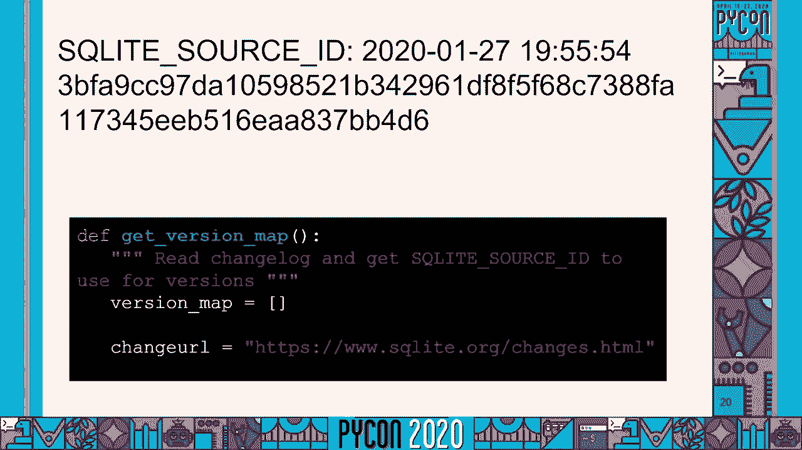

# 使用 Python 检测二进制文件中的漏洞：P71：工具原理与实践 🛡️


在本教程中，我们将学习如何使用一个名为 **CV 二进制工具** 的 Python 工具来检测二进制文件中的已知安全漏洞。我们将了解其工作原理、使用方法以及如何为开源安全做出贡献。

## 概述

软件安全是一个复杂且重要的问题。作为开发者或系统管理员，我们经常需要确认所运行的软件是否包含已知的安全漏洞。本教程将介绍一个免费、开源的 Python 工具，它通过扫描二进制文件中的特定字符串来识别软件版本，并与国家漏洞数据库进行比对，从而发现潜在的安全风险。

---

## 为什么需要检测二进制文件？🤔

当你从网站下载一个可执行文件时，通常会采取一些安全措施，例如运行病毒扫描、验证签名或检查更新。然而，现代软件通常包含大量依赖项，这使得手动追踪所有组件及其安全状态变得异常困难。

例如，在 Python 中安装 `cryptography` 库时，它会自动安装 `OpenSSL` 作为依赖。但你很难直接知道系统中安装的 `OpenSSL` 具体版本，更不用说其中是否存在已知漏洞。因此，自动化工具对于高效管理软件安全至关重要。

---

## CV 二进制工具简介 🧰

**CV 二进制工具** 是一个旨在简化漏洞检测过程的工具。它最初是一个用于检测旧版本 `OpenSSL` 的小脚本，后来逐渐发展成一个功能更全面的工具。其核心目标是提供一个**快速、免费且开源**的解决方案，适合集成到持续集成流程中，或与外部合作伙伴共享。

---

## 工具工作原理：引擎盖下的秘密 🔍

上一节我们介绍了工具的目标，本节中我们来看看它是如何实现漏洞检测的。


### 1. 识别软件内容

工具本身并不知道它在扫描什么。它的思路类似于黑客或渗透测试员，使用非常简单的启发式方法。

首先，它利用 Unix 实用程序 `strings` 来提取二进制文件中所有长度大于四个字符的字符串。

```bash
strings binary_file
```

输出中可能包含大量无用信息，但也会隐藏着揭示软件身份和版本的线索。

### 2. 定位版本信息

接着，工具使用文本搜索工具 `grep` 来缩小范围，寻找特定的版本字符串模式。


例如，对于 `OpenSSL`，其版本字符串通常遵循类似 `OpenSSL 1.1.1d 29 Sep` 的格式。通过分析多个版本的 `OpenSSL`，可以总结出用于匹配的**签名**（Signature）。

一个简单的 `OpenSSL` 签名模式可能如下：
```
OpenSSL \d+\.\d+\.\d+[a-z]?
```


这个模式表示“OpenSSL”后跟由点分隔的三组数字，可能以一个字母结尾。

### 3. 处理特殊情况

并非所有软件都使用简单的版本字符串。例如，`SQLite` 就没有直接可解析的版本号，但它包含一个独特的“源标识符”字符串。对于这种情况，工具会先检测到这个大字符串，然后通过哈希映射回具体的版本号。

当然，也存在一些目前无法轻易检测的库，工具会记录这些情况以待未来改进。


---

## 从版本号到已知漏洞 📋

一旦获得了软件名称和版本号，下一步就是查询已知漏洞数据库。



### 国家漏洞数据库


工具使用 **国家漏洞数据库** 作为漏洞信息源。这是一个公共领域的国际数据库，包含了大量已公开的软件弱点信息，每个漏洞都被赋予一个唯一的 **CVE** 编号。

数据库提供了机器可读的 JSON 数据，其中包含每个漏洞的描述、受影响版本的范围等信息。例如，一个 CVE 条目可能指明 `OpenSSL 1.1.1a` 到 `1.1.1k` 之间的版本存在某个漏洞。


### 版本匹配与解析

工具需要解析从二进制文件中提取的版本号，并判断它是否落在某个 CVE 条目指明的受影响范围内。

这里有时会遇到挑战。例如，`OpenSSL` 的版本号末尾可能包含字母（如 `1.1.1d`）。为了进行范围比较，工具需要将这些字母转换为可排序的数字。

此外，NVD 数据库由人工维护，偶尔会出现错误。例如，数据可能错误地标明“8.4 之前的所有版本都易受攻击”，但 8.4 版本本身却不受影响。工具团队会尽力修正这些发现的数据问题。

---

## 如何使用 CV 二进制工具 🛠️

了解了原理后，本节我们来看看如何实际使用这个工具。

### 安装与基本扫描


你需要 Python 3.6 或更高版本。使用 pip 安装工具：


```bash
pip install cv-binary-tool
```

安装后，你可以在任何文件或目录上运行它：

```bash
cv-bin-tool /path/to/scan
```

工具会扫描给定的文件或目录。如果它识别出某个已支持检查的库，并发现其版本存在已知漏洞，就会在控制台输出报告。

### 输出格式

工具提供多种输出格式以适应不同工作流：

1.  **控制台输出**：人类可读的摘要，列出发现的漏洞。
2.  **CSV 格式**：逗号分隔值格式，方便导入电子表格进行漏洞分类、跟踪和记录。
3.  **JSON 格式**：机器可读的格式，便于集成到其他自动化流程或工具中。

### 重要限制

请注意，`cv-bin-tool` 中的 **bin** 指的是二进制文件。工具**只扫描二进制文件**。这是因为其基于字符串的签名检测方法在扫描源代码或文档时会产生大量误报。对于源代码，通常有更适合的工具（如软件成分分析工具）来管理依赖项。

---

## 超越二进制扫描：`csv2cve` 工具 📄

如果你已经通过其他方式（如 `pip freeze`、构建脚本）获得了软件组件列表，可以跳过二进制扫描步骤。

安装 `cv-binary-tool` 时，会附带一个名为 `csv2cve` 的实用程序。它可以直接处理一个包含`组件名`和`版本号`的 CSV 文件列表，并查询相同的漏洞数据库，输出这些组件的已知漏洞。


这对于处理 Python 的 `requirements.txt` 文件或类似的依赖清单非常有用。

---


## 发现漏洞后该怎么办？🚨

运行工具后，如果它报告了漏洞，你可以遵循以下步骤：

以下是处理已发现漏洞的一般流程：

1.  **调查详情**：将工具报告的 **CVE 编号** 输入搜索引擎，可以找到关于该漏洞的详细描述、影响和修复状态。
2.  **升级修复**：最直接的方法是**将受影响的库升级到已修复该漏洞的版本**。通常升级到最新稳定版或长期支持版是推荐做法。
3.  **应用补丁**：如果无法立即升级，可以寻找是否有官方提供的向后移植的安全补丁。但请注意，手动打补丁可能引入新问题，且 `cv-bin-tool` 无法检测到这种修复，会继续报告该漏洞。
4.  **实施缓解措施**：如果既无法升级也没有补丁，应寻找可以降低风险的**缓解措施**，例如禁用某些功能、修改配置或增加网络防护。
5.  **通知用户**：如果你是软件的分发者，有责任告知用户潜在风险及建议的最佳实践。

---

## 如何参与和贡献 🤝

**CV 二进制工具** 是一个开源项目，欢迎社区贡献。

以下是几种参与方式：

1.  **使用工具**：最简单的帮助就是使用它。在你的系统上（例如扫描 `/bin` 或 `/usr/lib`）或 CI/CD 流水线中尝试运行，并反馈使用体验。
2.  **贡献新的检查器**：如果你关心的某个库尚未被支持，可以为其添加检查器。主要步骤包括：
    *   确定要添加的软件。
    *   在 NVD 数据库中查找对应的`供应商-产品`对。
    *   分析该软件的二进制文件，找到可靠的版本字符串**签名**。
    *   编写测试用例，验证检查器在真实二进制文件上有效。
3.  **担任导师**：项目通过 **Google 代码之夏** 等活动接纳了许多新贡献者。如果你擅长代码审查、调试或热爱开源，可以考虑担任导师，帮助学生成长。

项目地址和最新信息可在 GitHub 上找到。

---

## 总结

在本教程中，我们一起学习了：

*   为什么检测二进制文件中的漏洞对于软件安全至关重要。
*   **CV 二进制工具** 的基本原理：它通过 `strings` 和 `grep` 提取二进制文件中的版本签名，并与 **国家漏洞数据库** 进行比对。
*   如何安装和使用 `cv-bin-tool` 进行扫描，并理解其各种输出格式。
*   如何利用 `csv2cve` 工具直接分析已知的组件列表。
*   发现漏洞后的标准处理流程。
*   如何作为用户或贡献者参与到这个开源安全项目中。


**CV 二进制工具** 虽然不是解决安全问题的“银弹”，但它提供了一个轻量、实用的起点，能有效帮助开发者和运维人员发现并管理已知漏洞，是构建更安全软件生态的有力工具之一。