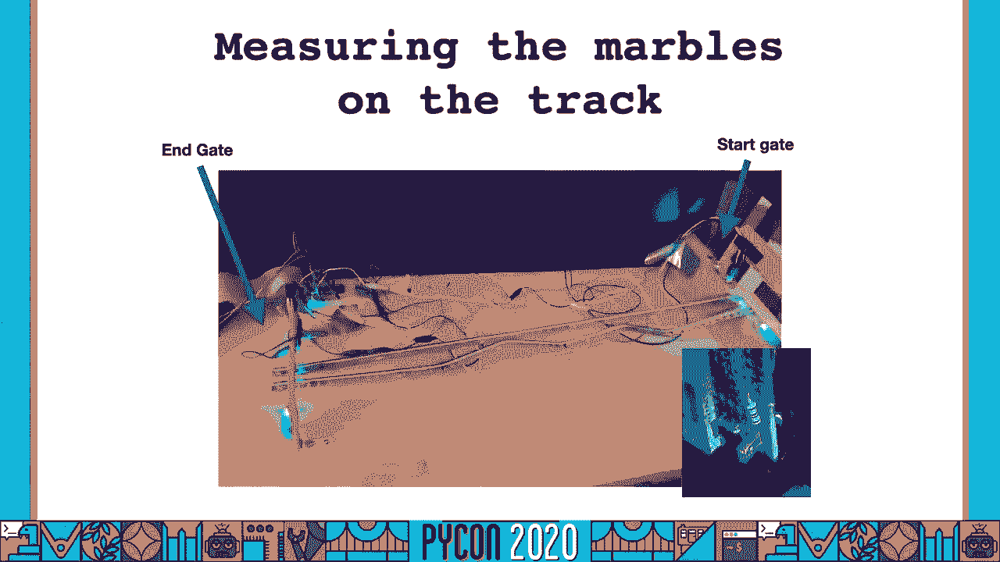
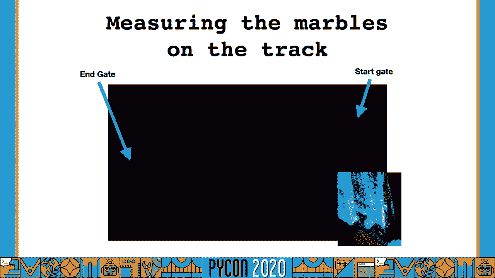

# 树莓派与Python：P74：五年级科学博览会项目实战教程


## 概述
在本教程中，我们将学习如何将树莓派与Python编程结合，用于构建一个五年级科学博览会项目——测量弹珠在轨道上的速度。我们将从安全须知开始，逐步介绍硬件准备、电路搭建、软件编程，并分享项目开发中的实用技巧与经验教训。

---

## 安全须知 ⚠️
在开始任何电路项目前，安全是第一要务。电是看不见的危险源，遵循良好实践能保护你和你的设备。

以下是必须遵守的安全准则：
*   每次修改电路前，务必关闭树莓派电源。
*   确保工作区域附近没有食物或饮料。
*   在干燥的室内环境中工作。
*   避免在金属桌面等导电表面上工作。
*   如果你是电路新手，请严格遵循说明书操作，注意所有警告。
*   考虑使用像“Snap Circuits”这样的学习工具包来安全地理解电路原理和隐患。

---

## 项目背景与简介 🎯
上一节我们强调了安全规范，本节我们来了解项目的起源。这个项目源于一个夏季科学博览会，孩子们通过不同形状的木制轨道比较弹珠速度。我儿子希望更进一步，精确测量每个弹珠的速度，因此我们决定利用树莓派来完成测量。

本教程将总结如何成功完成此类项目，无论你是独立完成还是协助他人。我们将涵盖：
*   如何开始使用树莓派。
*   如何在硬件项目中使用GPIO（通用输入输出）引脚连接外部电路。
*   项目过程中遇到的有趣挑战及其解决方案。

---

## 核心项目提示 💡
进行一个树莓派项目时，合理的规划至关重要。以下是确保项目顺利推进的一些关键建议。

需要注意的事项列表：
*   **警惕项目规模**：树莓派项目容易让人上瘾并不断扩展，可能导致无法在规定时间内完成。适时指导学生，如果项目过大，可以承诺后续添加功能。
*   **寻求外部帮助**：不要害怕向本地大学教授或创客社区寻求工具或传感器方面的建议。没有人能知晓一切，交流本身也是学习。
*   **分解任务**：不要试图在一个下午完成所有工作。将项目分解，在连续几个周末各花几小时进行，能有效减轻压力。
*   **积极调试**：每个项目都会遇到问题。当进展停滞时，可以休息一下或睡一觉。专注于**有效**的部分，逐步缩小范围来定位问题。
*   **记录过程**：在整个项目中拍摄照片和视频，这对回顾和展示非常有帮助。

---

## 项目构思与光电门原理 🔦
我们有了轨道，但如何测量速度呢？经过咨询，我们决定使用**光电门**。

光电门由两部分组成：一侧是光源（如LED或激光），另一侧是**光敏晶体管**。光敏晶体管是一种特殊开关：当被光照亮时，开关闭合，电流可以通过；当光线被阻挡时，开关断开，电流无法通过。

在电路层面，当光束未被阻挡时，输出为**低电压**；当光束被阻挡时，输出为**高电压**。对于树莓派，我们通常将低电压视为数字信号 **0**，高电压视为 **1**。

`电压状态： 有光 -> 低电压 (0) | 无光 -> 高电压 (1)`

我们通过在线搜索，找到了一个关于为树莓派搭建光电门的教程视频，这成为了我们项目的基础。

---

## 树莓派入门指南 🖥️
如果你从未使用过树莓派，可以从树莓派基金会官网开始。他们列出了许多供应商，提供各种套件。

以下是开始步骤：
*   **选择套件**：像“Canakit”这样的入门套件非常不错，通常包含预装NOOBS（新开箱即用软件）的Micro SD卡。NOOBS是一个包含Debian Linux操作系统的系统，拥有图形界面，并预装了Python和一些IDE。
*   **准备SD卡**：如果无法获得套件，你需要自行准备Micro SD卡并安装操作系统。
*   **使用虚拟环境**：如果你熟悉Python虚拟环境，建议为项目创建独立的虚拟环境。这能有效管理依赖。如果不熟悉，网上有大量相关教程。

树莓派顶部有一排突出的引脚，那就是**GPIO连接器**，用于连接外部电路。

---

## 推荐硬件与连接技巧 🔌
为了更方便地连接电路，推荐使用一些硬件工具。

**必备工具包列表：**
*   **Freenove Ultimate Starter Kit**：这个套件提供了带标签的分线板，可以轻松插到面包板上，并通过排线连接树莓派。它还包含LED、电机等多种元件，并附有详细的PDF教程和示例代码。
*   **面包板连接技巧**：连接排线时要格外小心。可以将树莓派翻过来，背面引脚中有一个是方形的（Pin 1）。确保排线上有红色标记的一侧与Pin 1在同一方向对齐，并确认每个孔都对应一个引脚，没有偏移。

**其他实用工具：**
*   **面包板连接线套件**：包含各种长度、已剥线的彩色跳线，能极大提高搭建效率。
*   **鳄鱼夹连接线**：用于连接面包板与外部元件。
*   **优质万用表**：用于调试和检查电路。如果预算有限，可以考虑购买两个廉价万用表相互校验。
*   **穿孔板（洞洞板）**：当你完成面包板上的电路并想永久保存时，可以学习焊接技能，将电路转移到洞洞板上。

---

## 电路搭建基础 ⚡
现在我们来了解如何在面包板上搭建基础电路。

首先，需要将树莓派提供的电压连接到面包板的电源轨。树莓派提供 **5V** 和 **3.3V** 两种电压。通常，将5V连接到面包板一侧的红色电源轨，将3.3V连接到另一侧（或根据需要）。同时，必须将树莓派的**地（GND）** 引脚连接到面包板的黑色地线轨，以确保电路有共同的参考点。

面包板中间的孔是垂直连接的，适合插入双列直插封装（DIP）的芯片，如定时器或逻辑门。芯片的引脚可以直接插入这些孔中。

搭建电路时，尽量保持线路整洁，这有助于后续调试。电路搭建完成后、通电前，建议用万用表的电阻档（欧姆档）检查：将黑表笔接地，红表笔分别接触5V和3.3V电源轨，确保读数不是接近 **0 欧姆**。如果读数极低，说明可能存在短路，通电会损坏元件。

---

## 软件环境设置与GPIO基础 🐍
硬件准备就绪后，我们来设置软件环境。树莓派通常预装Python 2和Python 3。请注意，Python 2已停止支持，建议使用Python 3。

对于树莓派GPIO编程，我们需要 `RPi.GPIO` 库。在较新的系统（如使用Canakit套件）中，这个库可能已经预装。你可以通过以下命令检查或安装：

```bash
# 检查Python 3和pip
python3 --version
pip3 --version

# 安装RPi.GPIO库 (如果未安装)
pip3 install RPi.GPIO
```

此外，Freenove套件的GitHub仓库提供了所有示例项目的Python代码，是极佳的学习资源。

---

## 深入电路元件：二极管与光电门升级 💎
我们的项目用到了发光二极管（LED）。二极管只允许电流单向流动（从阳极到阴极）。一个使用万用表的小技巧是：将其调到二极管测试档，用红黑表笔接触LED的两脚，如果LED微亮，则红表笔接触的是阳极。

我们的项目需要红外（IR）LED。红外光人眼不可见，但许多手机摄像头可以探测到。我们最初使用的小型红外LED亮度不足，导致光电门始终认为光线被阻挡。解决方案是将其替换为使用**纽扣电池供电的指尖手电筒**作为光源，效果显著提升。

我们搭建了两个光电门电路（起点门和终点门），分别连接到树莓派的GPIO 17和18号引脚。我们还增加了一个“验证回路”——一个简单的LED电路，用于手动遮挡光线时快速验证光电门是否工作正常。

你可以使用在线工具如 `circuit-diagram.org` 来绘制自己的电路图。

---

## GPIO输入编程与状态管理 🧮
GPIO输出编程相对简单（如点亮LED），但输入编程更具挑战性，因为你如何知道引脚状态变化了呢？

首先，你需要确认使用的GPIO引脚编号。Freenove套件的分线板有清晰的彩色标签。你也可以在终端使用 `gpio readall` 命令查看所有引脚状态。

接下来，我们可以编写一段简单的测试代码来读取引脚状态：

```python
import RPi.GPIO as GPIO
import time

# 设置引脚编号模式为BOARD
GPIO.setmode(GPIO.BOARD)

# 设置引脚（例如物理引脚11）为输入
input_pin = 11
GPIO.setup(input_pin, GPIO.IN)

try:
    while True:
        # 读取引脚状态
        pin_state = GPIO.input(input_pin)
        print(f"Pin state: {pin_state}")
        time.sleep(0.1) # 短暂延迟
except KeyboardInterrupt:
    print("Program stopped.")
finally:
    GPIO.cleanup() # 清理GPIO设置
```

运行这段代码，当你遮挡或移开光电门光束时，应该能在终端看到状态在 **0** 和 **1** 之间变化。





---

## 实现速度测量逻辑 ⏱️
有了基础输入检测，我们需要实现完整的测量逻辑。我们需要追踪以下状态：
1.  **等待开始**：弹珠在起点门处，门被阻挡（状态为1）。
2.  **第一颗弹珠出发**：弹珠离开起点门，门打开（状态变为0），此时启动计时器。
3.  **等待第一颗到达终点**：持续监测终点门，当状态从0变为1时，记录第一颗弹珠的到达时间。
4.  **等待第一颗离开终点**：持续监测，当终点门状态从1变回0时，表示第一颗弹珠已通过。
5.  **等待第二颗到达终点**：再次监测终点门，当状态从0变为1时，记录第二颗弹珠的到达时间。

核心思路是使用一个**状态机**和一系列**标志变量**在循环中管理这些状态迁移。代码会高速循环（每秒约千次读取），确保能捕捉到短暂的遮挡信号。

我们为这个项目创建了GitHub仓库，包含了测试代码和最终的测量代码，供大家参考。

---

## 总结与最终成果 🏆
在本教程中，我们一起学习了如何将树莓派和Python应用于一个真实的科学项目。我们从安全规范出发，逐步完成了硬件选型、电路搭建、软件环境配置、GPIO编程，并最终实现了弹珠速度的自动测量。

回顾关键步骤：
*   **安全第一**：始终遵循电路操作安全准则。
*   **小步前进**：从点亮一个LED开始，逐步增加复杂度。
*   **明确寻址**：事先确定并测试好GPIO引脚编号。
*   **善用测试**：编写小型测试代码来验证硬件和基础逻辑。
*   **状态管理**：对于复杂的输入序列，使用状态机或标志变量来清晰地管理逻辑。

我儿子用这个系统进行了十组实验，将数据导入Jupyter Notebook进行分析，并最终在地区科学博览会上获得了第三名！我们为他感到无比自豪。

希望这个教程能激发你或你的学生开始自己的树莓派探索之旅。记住，最重要的是保持好奇，乐于动手，并从过程中享受乐趣。


（参考资料与链接请参见原视频描述或幻灯片）