# 动手进行Web应用测试自动化：P76：教程概述 🚀


在本教程中，我们将学习如何使用Python和Selenium WebDriver从头开始构建一个Web应用测试自动化解决方案。我们将以DuckDuckGo搜索引擎为例，编写一个端到端的测试用例，涵盖从项目搭建、编写测试、使用页面对象模式到处理配置和并行测试的全过程。本教程旨在让初学者能够理解并实践Web UI测试自动化的核心概念。

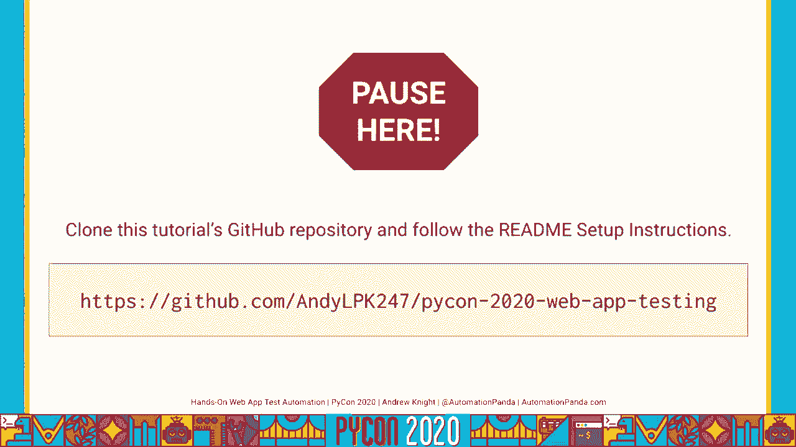

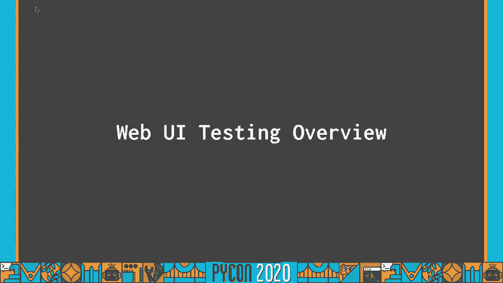

---

## 动手进行Web应用测试自动化：1：Web UI测试入门 🎯

在开始编写代码之前，让我们先了解什么是Web UI测试以及为什么它很重要。

测试是一种旨在识别软件产品特性中的优点和缺点以保持质量的活动。测试可以通过手动操作完成，也可以通过自动化脚本完成。

测试活动有多种类型，人们有时会误解“测试”一词，认为单元测试是唯一存在的测试类型。实际上，测试可以分为两大类：

*   **白盒测试**：直接与代码交互，测试代码单元（如函数或方法）是否按预期工作。单元测试和集成测试（测试代码模块间的协作）属于此类。
*   **黑盒测试**：不与代码直接交互，而是与软件的功能或产品本身交互，验证其是否符合需求并为最终用户提供价值。端到端测试和系统测试属于此类。

为了平衡测试的覆盖范围和成本，我们使用**测试金字塔**模型。金字塔底部是大量快速、廉价的单元测试（白盒测试）。金字塔顶部是数量较少但更复杂、更昂贵、执行更慢的黑盒测试（如集成测试和端到端测试）。我们的目标是拥有一个坚实的测试基础，同时谨慎地使用高层级测试。

**Web UI测试**是一种通过真实浏览器对Web应用程序进行的黑盒测试。它模拟真实用户与网页的交互（如点击、输入文本），属于功能测试和端到端测试的范畴。一个现代Web应用包含前端（HTML, CSS, JavaScript）、服务层（如REST APIs）、持久层（数据库）和基础设施，Web UI测试能验证所有这些部分协同工作的结果。

Web UI测试有其优缺点：
*   **优点**：提供良好的端到端覆盖；与产品交互方式更接近真实用户；能发现明显的功能问题。
*   **缺点**：比单元测试更复杂；执行速度慢；容易因网络延迟、页面加载等因素导致测试结果不稳定（片状化）；问题根因分析更困难。

一个好的Web UI测试应具备以下特点：
*   关注应用程序的一个主要行为（如登录、搜索）。
*   具有清晰、直观的步骤流程。
*   覆盖重要的核心功能或基本错误场景，避免罕见的边缘情况。
*   具有高投资回报率——如果测试失败，团队会立即意识到问题的严重性。

在本教程中，我们将把测试自动化视为软件开发的一个专门领域，采用最佳实践来构建我们的解决方案。我们的技术栈包括：
*   **Python**：实现语言。
*   **pytest**：核心测试框架，用于组织和运行测试用例。
*   **页面对象模式**：设计模式，用于对网页交互进行建模，提高代码可维护性和复用性。
*   **Selenium WebDriver**：底层库，用于自动化与真实浏览器的交互。

我们的架构如下图所示：测试用例（pytest）调用页面对象，页面对象调用Selenium WebDriver绑定，WebDriver通过一个代理（如本地WebDriver可执行文件或Selenium Grid）与浏览器通信。

现在，让我们开始设置项目并编写第一个测试。

---

## 动手进行Web应用测试自动化：2：用第一个测试设置pytest 🛠️

上一节我们介绍了Web UI测试的基本概念，本节我们将开始动手搭建测试项目并编写第一个测试用例。

我们将测试的产品是DuckDuckGo搜索引擎。我们编写的第一个测试用例是一个基本的搜索测试，步骤如下：
1.  导航到 `duckduckgo.com`。
2.  在搜索框中输入一个搜索短语（例如“panda”）。
3.  验证结果页面：
    *   页面标题包含搜索短语。
    *   结果页面的搜索输入框中的值等于搜索短语。
    *   至少有一个结果链接的标题与搜索短语相关。

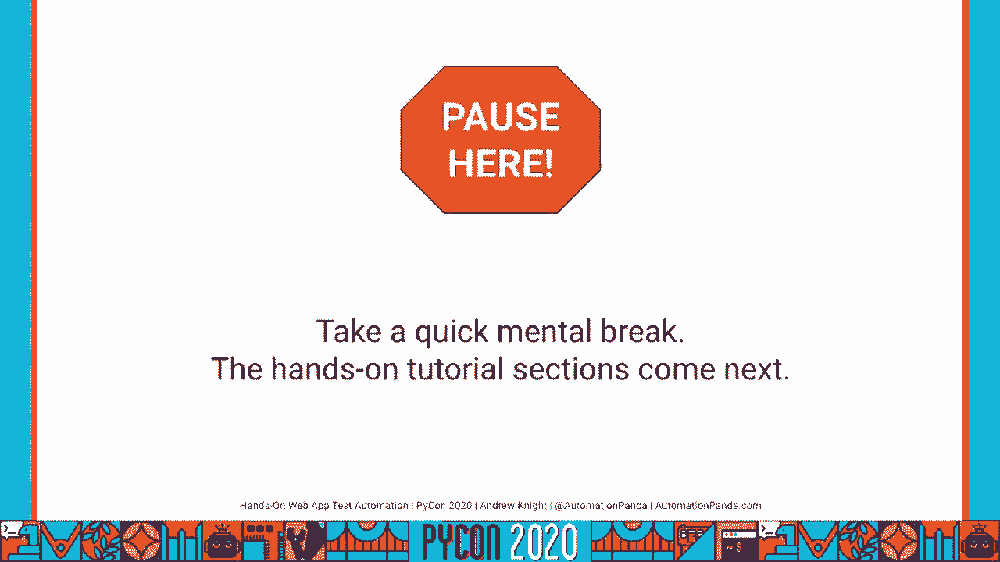

我们将使用**pytest**作为测试框架。pytest是Python中最流行、最简洁的测试框架之一。一个pytest测试用例可以简单到一个带有`assert`语句的函数。

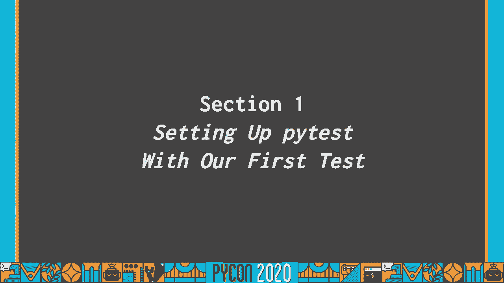

以下是设置步骤：
1.  克隆本教程的GitHub仓库，其中包含了所有示例代码和安装说明。
2.  按照README完成环境安装（包括Python、依赖包和浏览器驱动）。
3.  项目已包含一个虚拟的pytest测试模块 `test_fw.py`，运行 `python -m pytest` 命令可以验证pytest是否正常工作。

现在，轮到您动手了。请暂停视频，完成README中第一部分（Part 1）的教程说明。您需要：
*   在 `tests` 目录下创建一个新的测试模块（例如 `test_search.py`）。
*   在其中添加一个测试函数 `test_basic_duckduckgo_search`。
*   在函数体内，用注释或简单的`pass`语句勾勒出上述三个测试步骤，并在最后添加一个 `raise Exception(“Incomplete test”)` 语句，表示测试尚未实现。
*   运行 `python -m pytest`，您应该看到这个新测试因为抛出异常而失败。

这符合“测试驱动开发”（TDD）的理念：先编写一个会失败的测试，再逐步实现功能使其通过。

---

## 动手进行Web应用测试自动化：3：设置Selenium WebDriver 🌐

上一节我们编写了测试用例的轮廓，本节我们将引入Selenium WebDriver，它是实现浏览器自动化的核心工具。

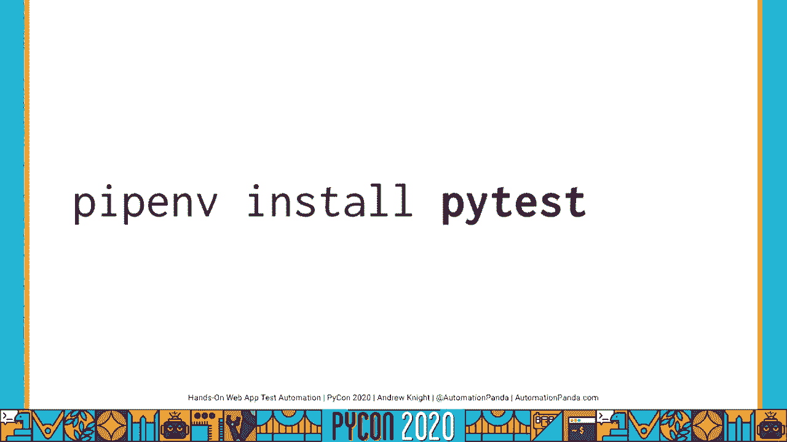

**Selenium WebDriver** 是一个W3C标准，用于自动化Web浏览器交互。它支持点击、输入文本、获取元素文本等各种操作。每个主要的浏览器（Chrome, Firefox, Safari, Edge等）都需要一个特定的**驱动程序**（如ChromeDriver, GeckoDriver）作为WebDriver和浏览器之间的代理。

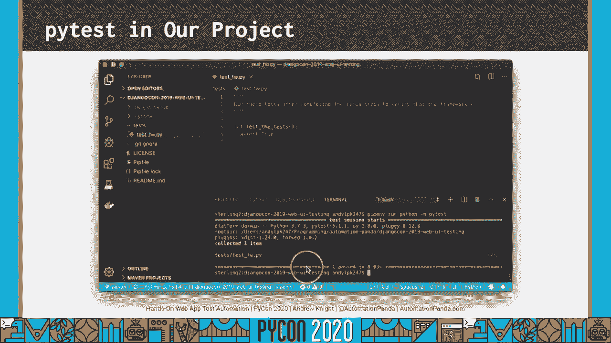

重要注意事项：
*   确保已将所需的浏览器驱动程序（如`chromedriver`, `geckodriver`）下载并放置在系统的PATH环境变量中。
*   注意浏览器版本与驱动程序版本的兼容性，不匹配会导致测试失败。
*   每个测试用例应该初始化自己的WebDriver实例，并在测试结束后正确退出（调用`quit()`方法），以避免资源泄漏和测试间相互影响。

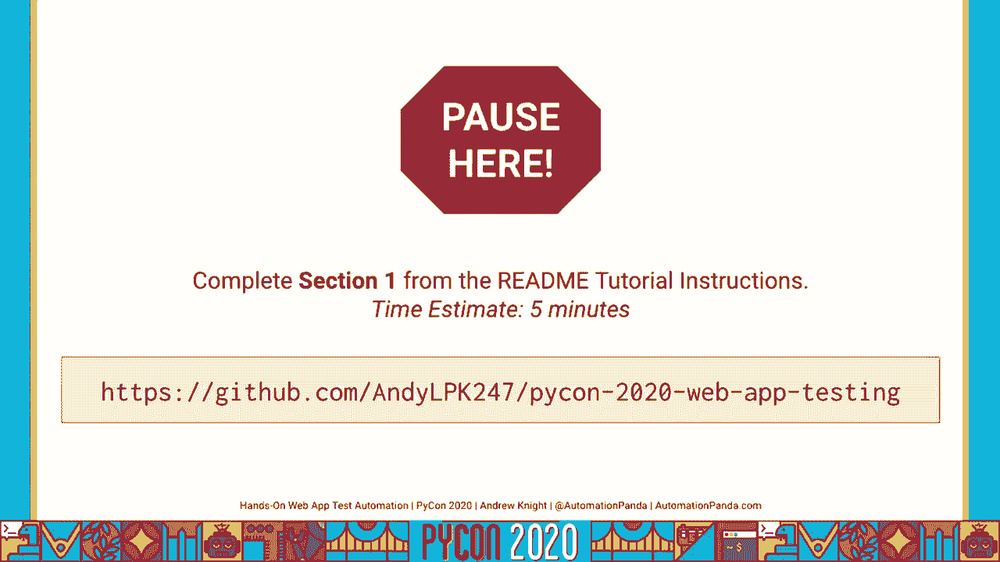

在pytest中，我们可以使用**fixture**来处理测试的初始化和清理工作。Fixture是pytest的一个强大功能，它提供了一种可重用的方式来设置测试所需的状态和环境。

以下是一个WebDriver fixture的示例框架：
```python
# conftest.py
import pytest
from selenium import webdriver

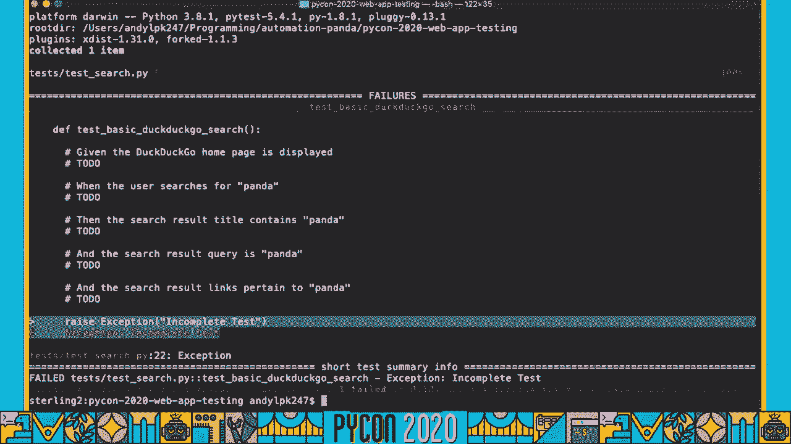

@pytest.fixture
def browser():
    # 1. 初始化：启动浏览器
    driver = webdriver.Chrome() # 或 webdriver.Firefox()
    # 2. （可选）设置一些全局等待时间
    driver.implicitly_wait(10)
    # 3. 将driver对象提供给测试用例
    yield driver
    # 4. 清理：测试结束后退出浏览器
    driver.quit()
```
在这个fixture中：
*   `yield` 之前的代码是“安装”阶段，在测试用例运行前执行。
*   `yield driver` 将 `driver` 对象提供给测试函数。
*   `yield` 之后的代码是“清理”阶段，在测试用例运行后（无论成功与否）执行。

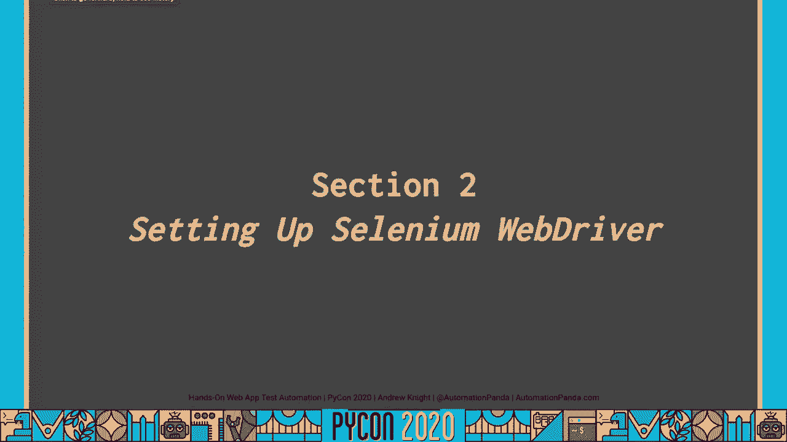

要在测试用例中使用这个fixture，只需将fixture的名称作为测试函数的参数即可：
```python
# test_search.py
def test_basic_duckduckgo_search(browser): # `browser` 参数会注入fixture返回的driver对象
    # ... 测试步骤 ...
    raise Exception(“Incomplete test”)
```

现在，轮到您动手了。请暂停视频，完成README中第二部分（Part 2）的教程说明。您需要：
1.  在项目根目录或`tests`目录下创建 `conftest.py` 文件。
2.  在其中实现上述的 `browser` fixture。
3.  更新您的 `test_basic_duckduckgo_search` 函数，添加 `browser` 参数。
4.  运行测试。您应该看到浏览器窗口短暂打开然后关闭，并且测试仍然因为“Incomplete test”异常而失败。这表明fixture已成功运行。

---

## 动手进行Web应用测试自动化：4：定义页面对象 📄

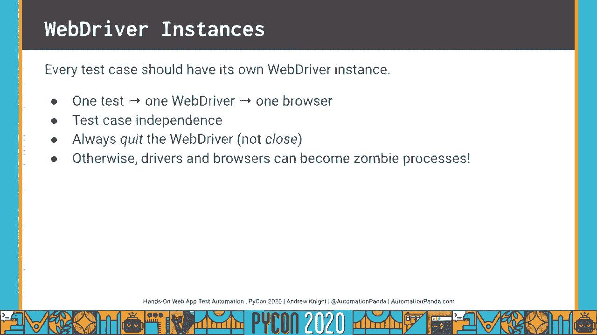

上一节我们成功启动了浏览器，本节我们将引入**页面对象模式**来组织我们的测试代码，使其更清晰、更易维护。

**页面对象**是一个代表网页或页面组件的类。它主要包含两部分：
1.  **定位器**：用于在页面上查找元素的查询语句（如CSS选择器、ID）。
2.  **交互方法**：封装了与页面元素交互的高级操作（如“登录”、“搜索”）。

使用页面对象的好处包括：
*   **提高可读性**：测试用例读起来像用户故事，而不是一堆技术性的WebDriver调用。
*   **最大化代码复用**：相同的页面交互逻辑可以在多个测试中复用。
*   **便于维护**：当页面UI发生变化时，通常只需要更新对应的页面对象类，而不是修改所有测试用例。

我们的测试涉及两个页面：
1.  **搜索页面** (`DuckDuckGoSearchPage`)：包含`load()`（加载页面）和`search(phrase)`（输入短语并搜索）方法。
2.  **结果页面** (`DuckDuckGoResultPage`)：包含`result_link_titles()`（获取所有结果链接的标题）、`search_input_value()`（获取搜索框中的值）和`title()`（获取页面标题）方法。

页面对象类的框架如下：
```python
# pages/search.py
class DuckDuckGoSearchPage:
    def __init__(self, browser):
        self.browser = browser # 接收来自测试用例的browser对象

    def load(self):
        # TODO: 实现加载页面
        pass

    def search(self, phrase):
        # TODO: 实现搜索操作
        pass
```

```python
# pages/result.py
class DuckDuckGoResultPage:
    def __init__(self, browser):
        self.browser = browser

    def result_link_titles(self):
        # TODO: 实现获取结果标题
        return []

    def search_input_value(self):
        # TODO: 实现获取搜索框值
        return “”

    def title(self):
        # TODO: 实现获取页面标题
        return “”
```

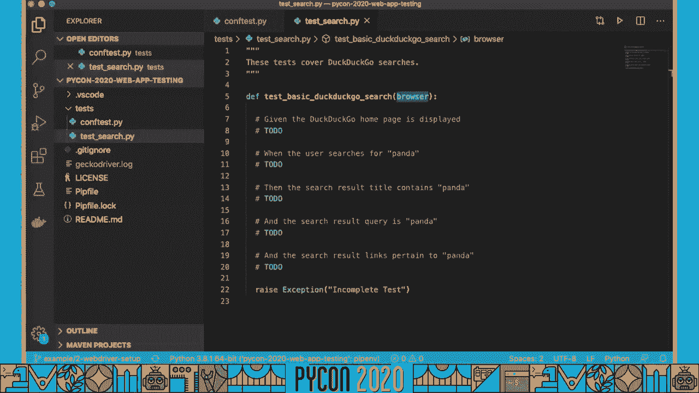


然后，我们可以在测试用例中使用这些页面对象：
```python
# test_search.py
from pages.search import DuckDuckGoSearchPage
from pages.result import DuckDuckGoResultPage

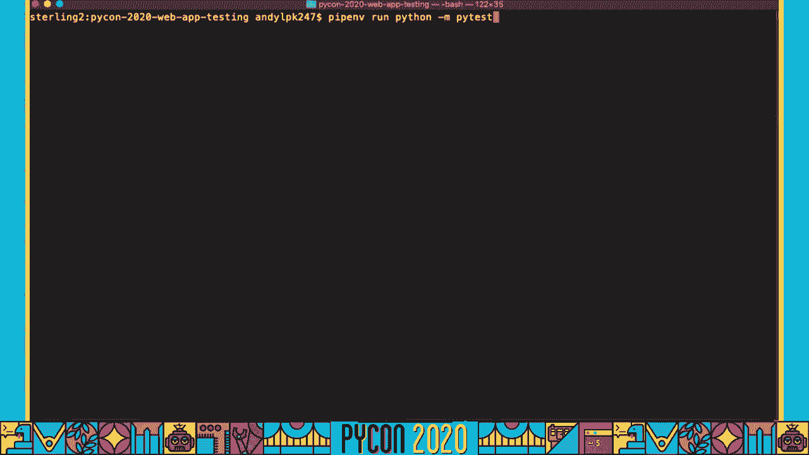

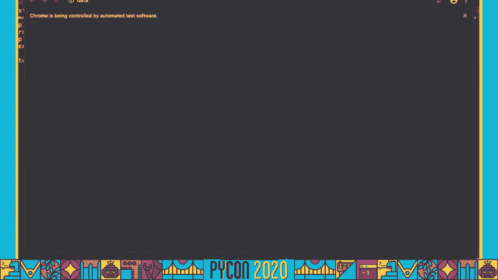

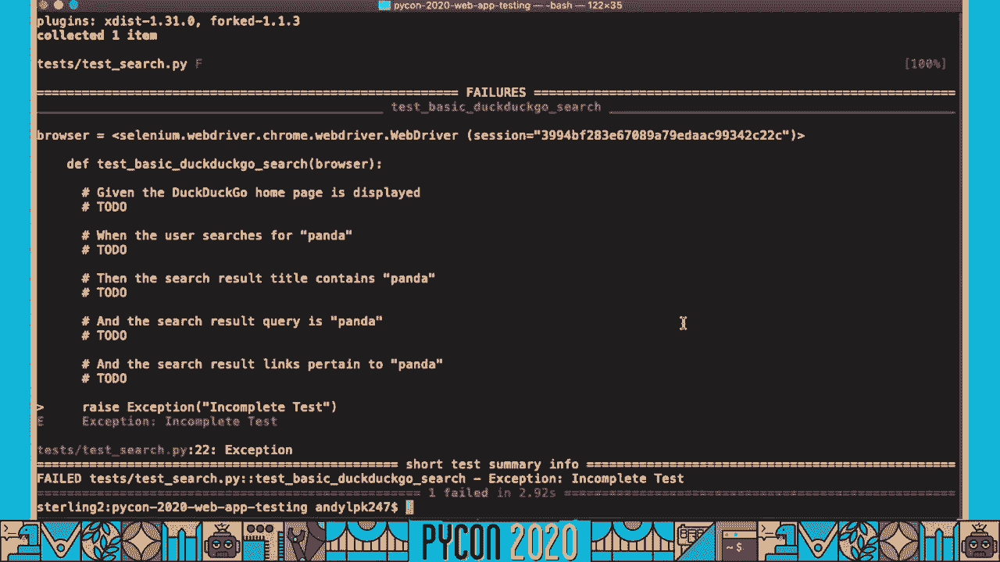

def test_basic_duckduckgo_search(browser):
    search_page = DuckDuckGoSearchPage(browser)
    result_page = DuckDuckGoResultPage(browser)
    PHRASE = “panda”

    # 1. 加载搜索页面
    search_page.load()
    # 2. 执行搜索
    search_page.search(PHRASE)
    # 3. 验证结果
    assert PHRASE in result_page.title()
    assert PHRASE == result_page.search_input_value()
    titles = result_page.result_link_titles()
    matches = [t for t in titles if PHRASE.lower() in t.lower()]
    assert len(matches) > 0
    # 移除之前的异常抛出
    # raise Exception(“Incomplete test”)
```
现在，测试用例的逻辑非常清晰，完全基于业务行为，隐藏了底层的WebDriver细节。

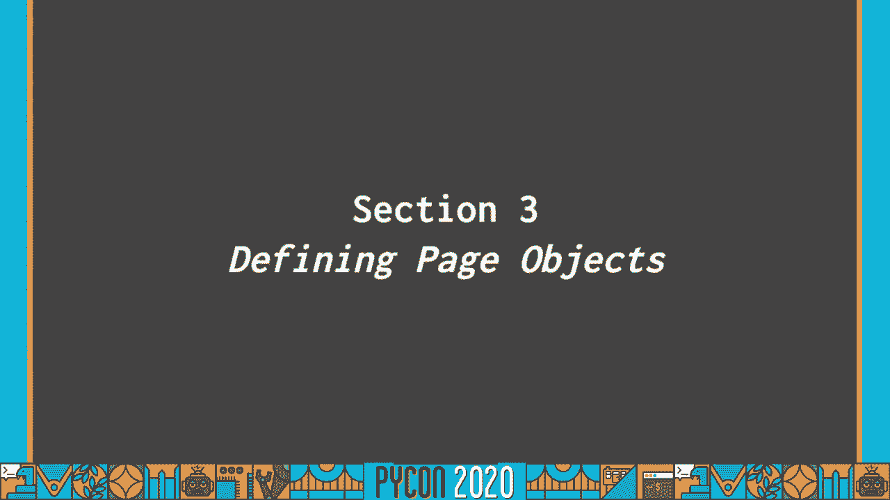

现在，轮到您动手了。请暂停视频，完成README中第三部分（Part 3）的教程说明。您需要：
1.  创建 `pages` 目录和相应的Python模块（`search.py`, `result.py`）。
2.  在其中定义页面对象类及其存根方法（如上面框架所示）。
3.  更新您的测试用例，导入并使用这些页面对象。
4.  运行测试。它仍然会失败，因为页面对象的方法还未实现，但失败信息会不同（例如，断言失败而不是异常）。这表明我们的测试结构正在逐步完善。

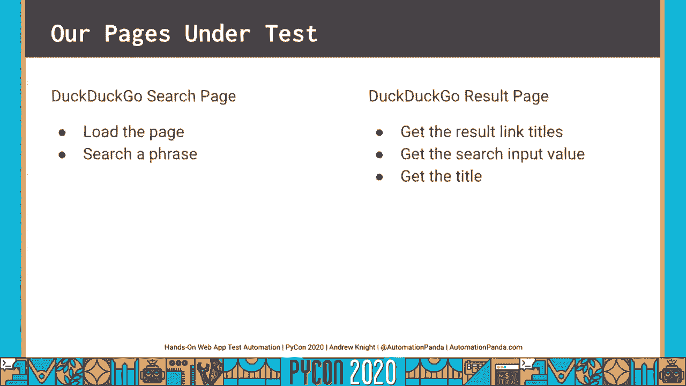

---

## 动手进行Web应用测试自动化：5：定位页面元素 🔍

上一节我们定义了页面对象的接口，本节我们将学习如何找到页面上的元素，这是实现页面对象方法的第一步。

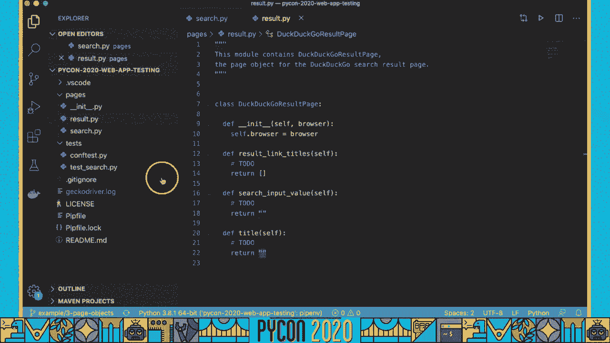

与网页元素交互通常需要三个步骤：
1.  **等待**：等待目标元素出现在页面上。
2.  **查找**：使用**定位器**找到该元素，并获得一个代表该元素的WebElement对象。
3.  **交互**：向该WebElement对象发送命令（如`.click()`, `.send_keys()`）或获取其属性（如`.text`, `.get_attribute(‘value’)`）。

**定位器**是在页面上查找元素的查询语句。Selenium支持多种定位器类型：
*   `By.ID`：通过元素的`id`属性定位（最优先选择，通常唯一）。
*   `By.NAME`：通过`name`属性定位。
*   `By.CSS_SELECTOR`：通过CSS选择器定位（功能强大且灵活）。
*   `By.XPATH`：通过XPath表达式定位（功能最强大，但也最复杂）。
*   `By.LINK_TEXT` / `By.PARTIAL_LINK_TEXT`：通过链接文本定位。
*   `By.CLASS_NAME` / `By.TAG_NAME`：通过类名或标签名定位。

**示例**：
```python
from selenium.webdriver.common.by import By


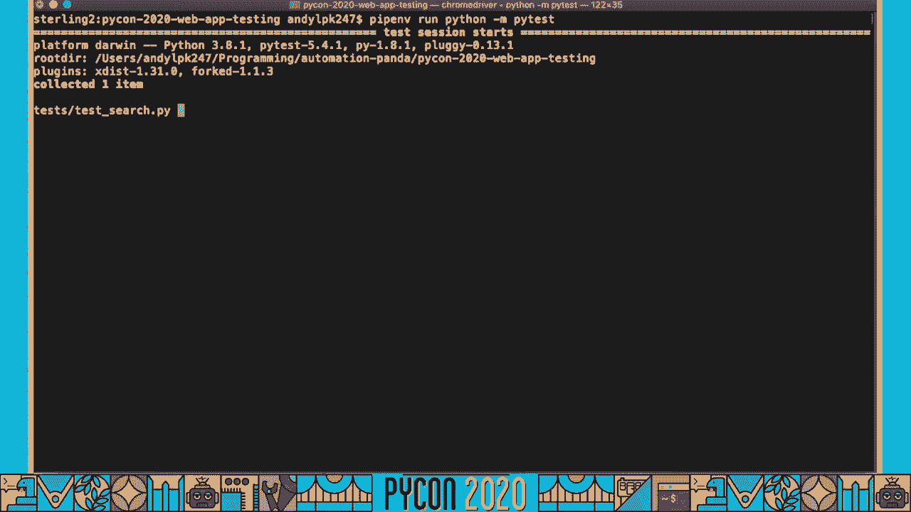

# ID定位器
locator_id = (By.ID, “search_form_input_homepage”)

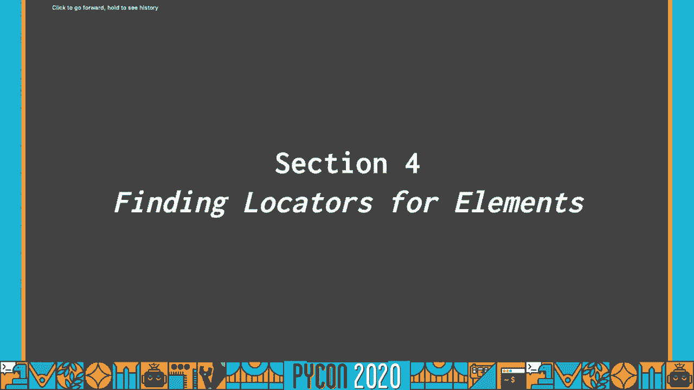

# CSS选择器定位器
locator_css = (By.CSS_SELECTOR, “input#search_form_input_homepage”)

# XPath定位器 (尽量避免复杂XPath)
locator_xpath = (By.XPATH, “//input[@id=‘search_form_input_homepage’]”)
```

如何找到元素的这些属性？我们可以使用浏览器的开发者工具（如Chrome DevTools）。
1.  打开目标网页（如 `duckduckgo.com`）。
2.  右键点击要检查的元素（如搜索框），选择“检查”。
3.  开发者工具会高亮显示对应的HTML代码，你可以从中找到`id`、`name`、`class`等属性。

我们的测试需要为以下元素找到定位器：
1.  搜索页面上的搜索输入框。
2.  结果页面上的搜索输入框。
3.  结果页面上的结果链接。

我们将这些定位器定义为页面对象类的属性：
```python
# pages/search.py
from selenium.webdriver.common.by import By

class DuckDuckGoSearchPage:
    # 定位器
    SEARCH_INPUT = (By.ID, ‘search_form_input_homepage’)

    def __init__(self, browser):
        self.browser = browser
    # ... 其他方法 ...
```

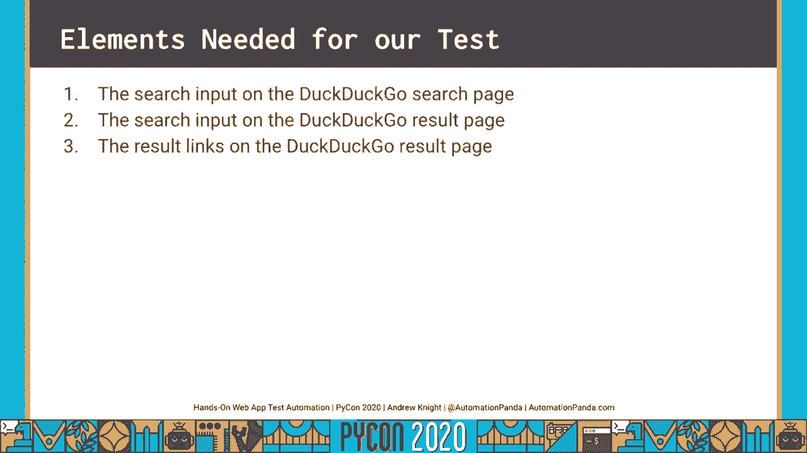

```python
# pages/result.py
from selenium.webdriver.common.by import By

class DuckDuckGoResultPage:
    # 定位器
    RESULT_LINKS = (By.CSS_SELECTOR, ‘a.result__a’)
    SEARCH_INPUT = (By.ID, ‘search_form_input’)

    def __init__(self, browser):
        self.browser = browser
    # ... 其他方法 ...
```
*注意：实际的定位器可能因网站更新而变化，请使用开发者工具自行验证。*

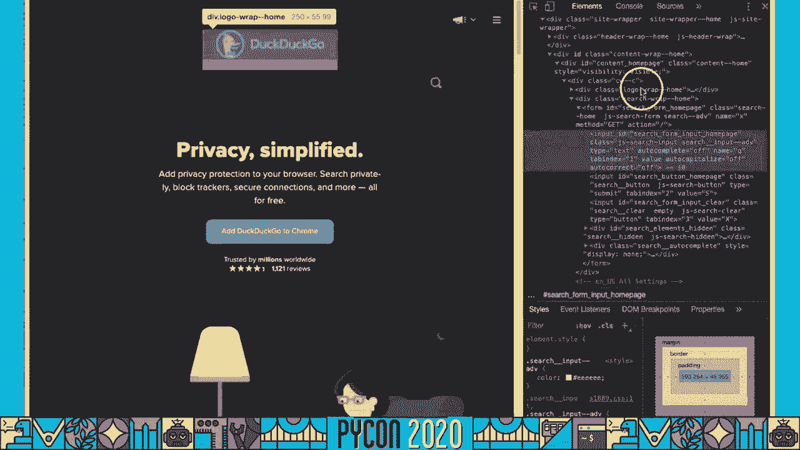

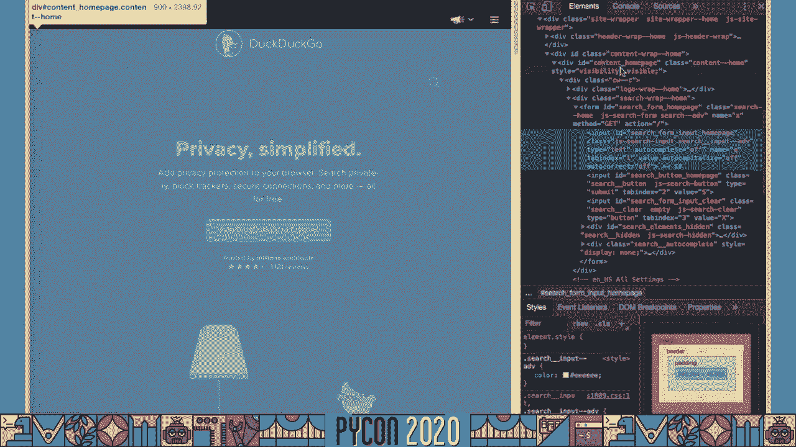

现在，轮到您动手了。请暂停视频，完成README中第四部分（Part 4）的教程说明。您需要：
1.  使用Chrome DevTools检查DuckDuckGo的搜索页面和结果页面，找到上述三个元素的合适定位器。
2.  将这些定位器作为类属性添加到您的页面对象类中。
3.  运行测试。测试仍然会失败，因为页面对象方法还未调用WebDriver，但我们已经为下一步做好了准备。

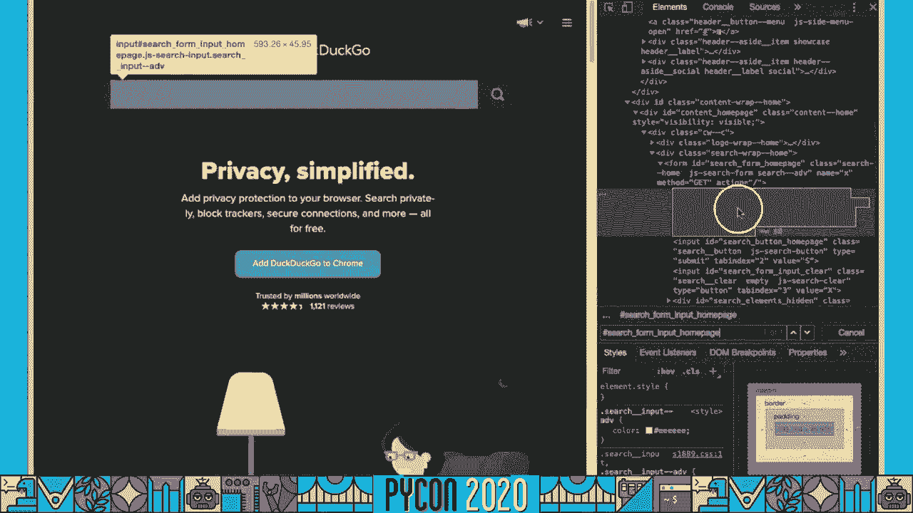

---

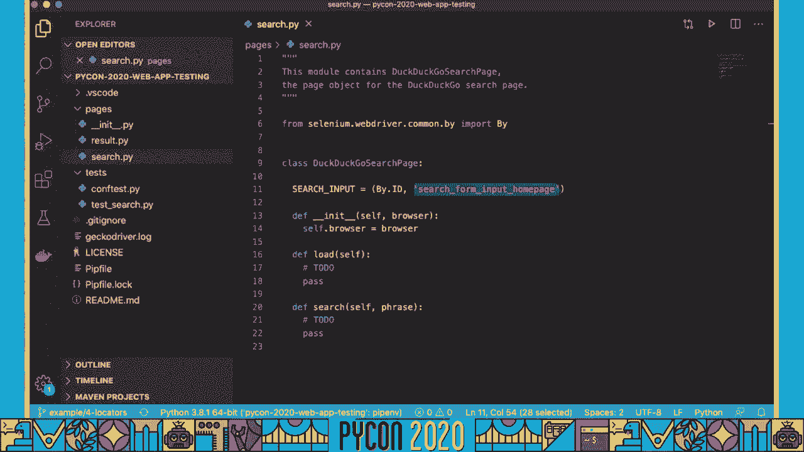

## 动手进行Web应用测试自动化：6：调用WebDriver API 🤖

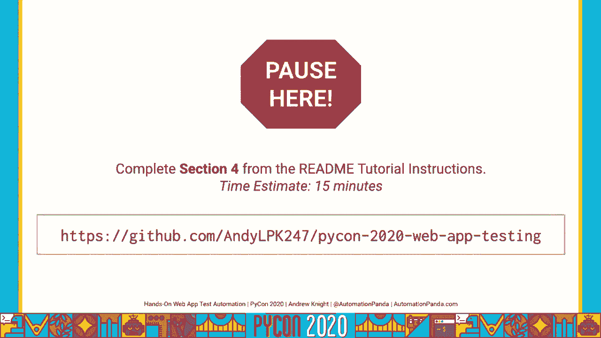

上一节我们找到了页面元素的定位器，本节我们将实现页面对象中的方法，通过调用Selenium WebDriver API来完成与浏览器的实际交互。

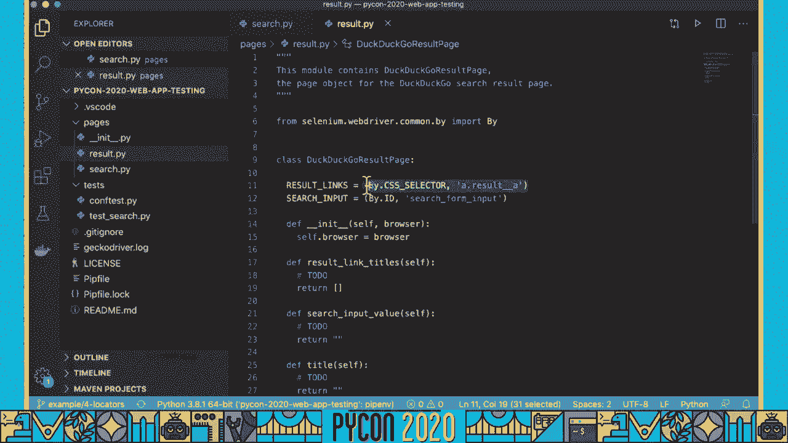

Selenium WebDriver API提供了丰富的方法来模拟用户操作。以下是一些最常用的调用：

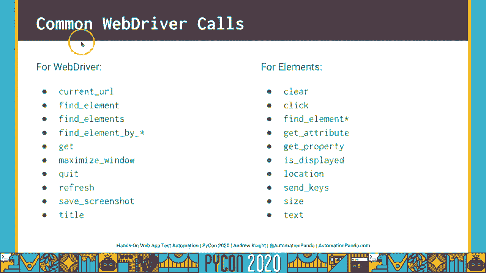

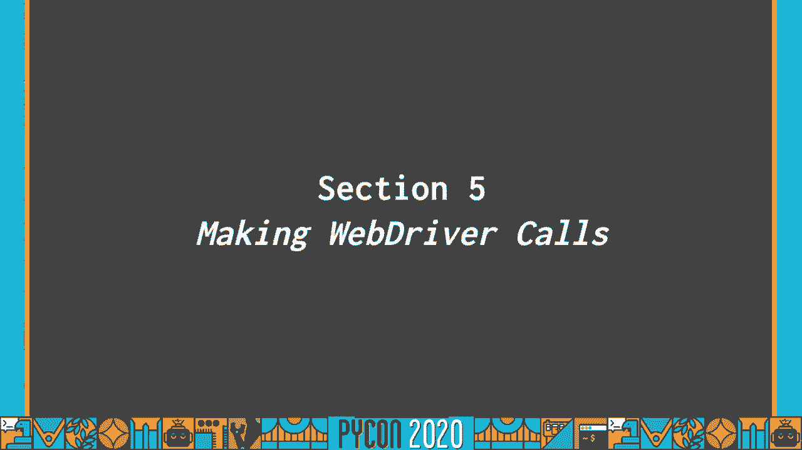

**WebDriver实例（即`browser`对象）的常用方法**：
*   `browser.get(url)`：导航到指定URL。
*   `browser.title`：获取当前页面的标题。
*   `browser.find_element(locator)`：查找单个元素，返回WebElement对象。
*   `browser.find_elements(locator)`：查找多个元素，返回WebElement对象列表。
*   `browser.quit()`：关闭浏览器并结束WebDriver会话。

**WebElement对象（通过`find_element`获得）的常用方法**：
*   `element.click()`：点击元素。
*   `element.send_keys(text)`：向元素（通常是输入框）输入文本。
*   `element.text`：获取元素的可见文本。
*   `element.get_attribute(‘attr_name’)`：获取元素的HTML属性值（对于输入框的值，需要用`get_attribute(‘value’)`）。

现在，让我们实现页面对象的方法。关键点在于使用我们之前定义的定位器，并通过`find_element`或`find_elements`来获取元素对象。

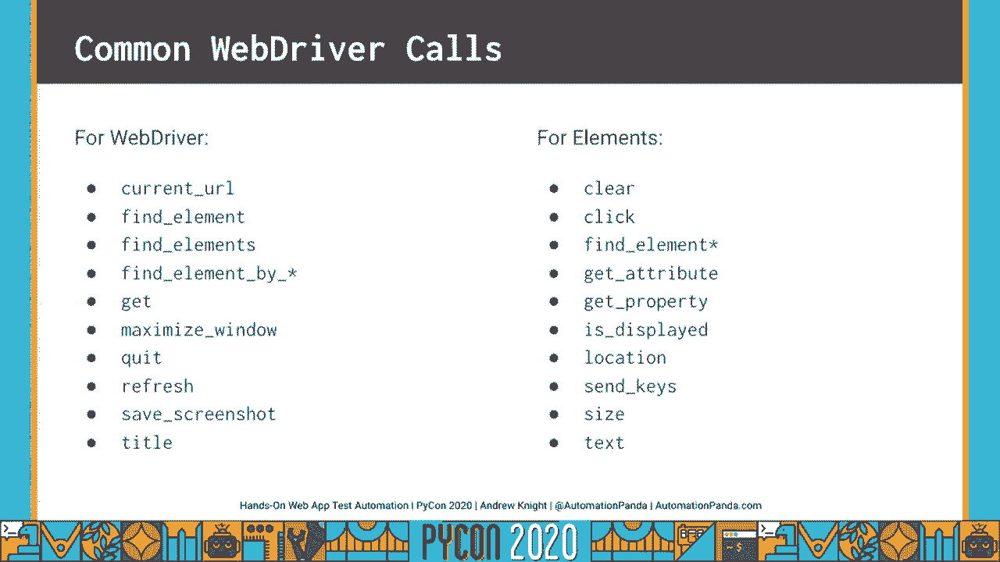

**搜索页面 (`search.py`)**：
```python
from selenium.webdriver.common.keys import Keys

class DuckDuckGoSearchPage:
    URL = ‘https://duckduckgo.com/‘
    SEARCH_INPUT = (By.ID, ‘search_form_input_homepage’)

    def __init__(self, browser):
        self.browser = browser

    def load(self):
        self.browser.get(self.URL)

    def search(self, phrase):
        # 1. 查找搜索输入框元素
        search_input = self.browser.find_element(*self.SEARCH_INPUT) # 注意 * 用于解包元组
        # 2. 输入搜索短语并模拟按下回车键
        search_input.send_keys(phrase + Keys.RETURN)
```
*   `*self.SEARCH_INPUT` 将元组 `(By.ID, ‘search_form_input_homepage’)` 解包为两个参数传递给 `find_element`。

**结果页面 (`result.py`)**：
```python
class DuckDuckGoResultPage:
    RESULT_LINKS = (By.CSS_SELECTOR, ‘a.result__a’)
    SEARCH_INPUT = (By.ID, ‘search_form_input’)

    def __init__(self, browser):
        self.browser = browser

    def result_link_titles(self):
        # 查找所有结果链接元素
        links = self.browser.find_elements(*self.RESULT_LINKS)
        # 提取每个链接的文本标题，返回列表
        titles = [link.text for link in links]
        return titles

    def search_input_value(self):
        # 查找搜索输入框元素
        search_input = self.browser.find_element(*self.SEARCH_INPUT)
        # 获取其 ‘value’ 属性的值（输入框的文本）
        value = search_input.get_attribute(‘value’)
        return value

    def title(self):
        # 页面标题是WebDriver的属性，不是页面元素
        return self.browser.title
```

现在，轮到您动手了。请暂停视频，完成README中第五部分（Part 5）的教程说明。您需要：
1.  根据上面的示例，在您的页面对象类中实现所有方法。
2.  确保在文件顶部导入必要的模块（如`from selenium.webdriver.common.keys import Keys`）。
3.  运行测试！如果一切正确，您将看到浏览器自动打开，执行搜索，然后关闭，并且测试应该**通过**（显示绿色的`.`或`PASSED`）。恭喜你，你已经完成了第一个端到端的Web UI自动化测试！

---

## 动手进行Web应用测试自动化：7：处理配置和浏览器选项 ⚙️

上一节我们成功运行了第一个自动化测试，本节我们将改进我们的框架，使其能够灵活地配置浏览器类型、超时时间等参数，并支持无头模式运行。

一个健壮的测试框架应该能够轻松适应不同的运行环境。我们需要处理诸如：
*   **浏览器选择**：在Chrome、Firefox或无头Chrome之间切换。
*   **配置参数**：如隐式等待时间、基础URL等，这些不应硬编码在代码中。
*   **敏感信息**：如密码、API密钥，应通过安全的方式传递，避免提交到代码仓库。

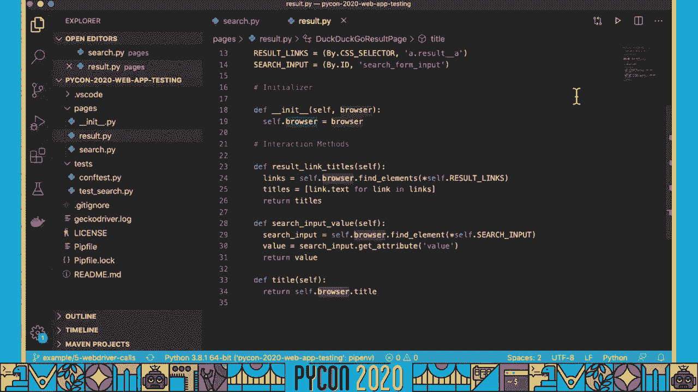

我们将使用一个JSON配置文件来管理这些输入，并使用pytest fixture来读取和验证配置。


**1. 创建配置文件 (`config.json`)**：
```json
{
  “browser”: “headless chrome”,
  “implicit_wait”: 10
}
```
支持的`browser`值可以是 `“chrome”`, `“firefox”`, `“headless chrome”`。

**2. 创建读取配置的fixture (`conftest.py`)**：
```python
import json
import pytest

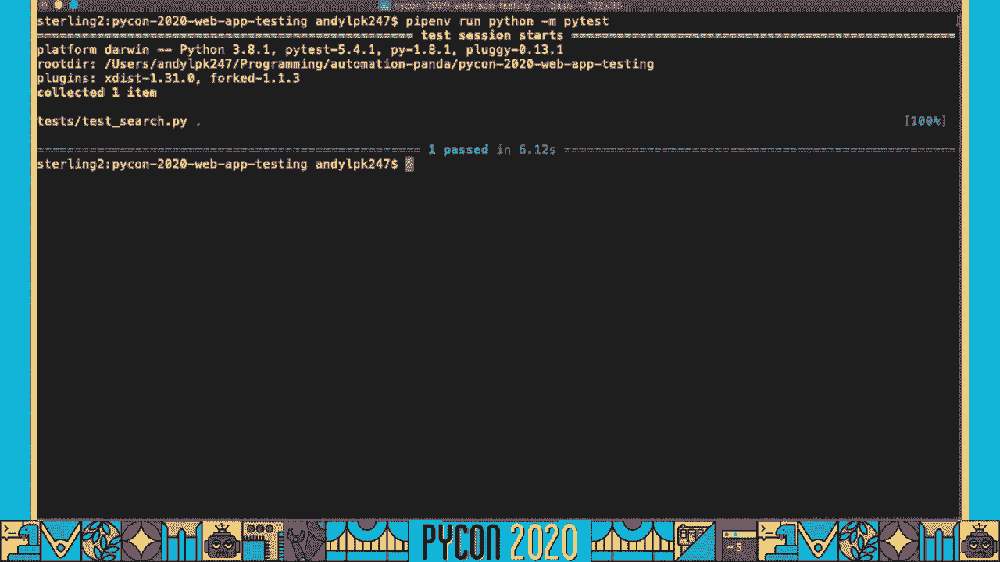


@pytest.fixture(scope=‘session’) # scope=‘session’ 表示整个测试会话只运行一次
def config():
    # 读取配置文件
    with open(‘config.json’) as f:
        config = json.load(f)
    # 验证配置值
    assert config[‘browser’] in [‘chrome’, ‘firefox’, ‘headless chrome’]
    assert isinstance(config[‘implicit_wait’], int)
    assert config[‘implicit_wait’] > 0
    # 返回配置字典
    return config
```

**3. 更新浏览器fixture以使用配置 (`conftest.py`)**：
```python
from selenium import webdriver
from selenium.webdriver.chrome.options import Options as ChromeOptions

@pytest.fixture
def browser(config): # fixture可以依赖其他fixture
    # 根据配置初始化浏览器
    browser_name = config[‘browser’]
    if browser_name == ‘chrome’:
        driver = webdriver.Chrome()
    elif browser_name == ‘firefox’:
        driver = webdriver.Firefox()
    elif browser_name == ‘headless chrome’:
        opts = ChromeOptions()
        opts.add_argument(‘headless’)
        driver = webdriver.Chrome(options=opts)
    else:
        raise Exception(f’Browser “{browser_name}” is not supported‘)

    driver.implicitly_wait(config[‘implicit_wait’])
    yield driver
    driver.quit()
```
*   无头模式不会打开浏览器GUI窗口，运行更快，适合在持续集成（CI）环境中使用。

**4. 测试用例无需修改**，因为它仍然通过`browser`参数接收WebDriver实例。

现在，轮到您动手了。请暂停视频，完成README中第六部分（Part 6）的教程说明。您需要：
1.  创建 `config.json` 文件。
2.  更新 `conftest.py`，添加 `config` fixture并修改 `browser` fixture。
3.  尝试修改 `config.json` 中的 `browser` 值，分别用 `“chrome”`、`“firefox”` 和 `“headless chrome”` 运行测试，确保它们都能正常工作。
4.  观察无头模式运行时，浏览器窗口不会弹出，测试在后台执行。

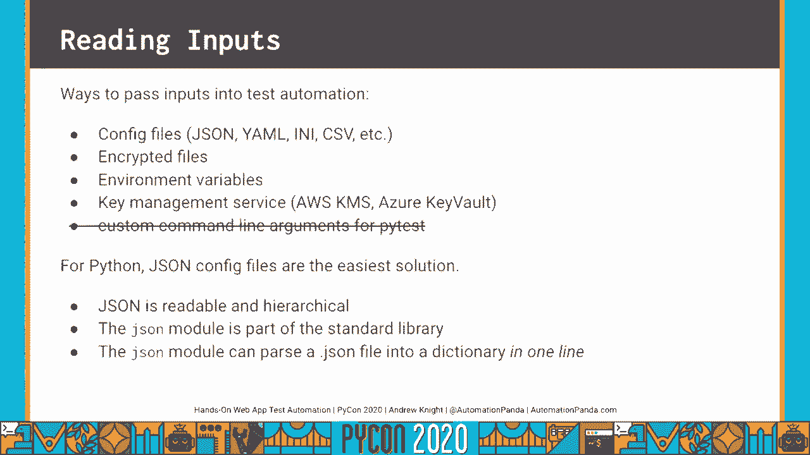

---

## 动手进行Web应用测试自动化：8：处理等待与竞态条件 ⏳

上一节我们实现了灵活的配置，但在运行多浏览器测试时，你可能会发现测试在Firefox上失败，而在Chrome上却成功。这通常是由**竞态条件**引起的，也是Web UI测试片状化的主要原因之一。本节我们将学习如何处理它。

**竞态条件**发生在自动化脚本和网页加载/渲染速度不同步时。例如，脚本在页面标题更新之前就试图去获取它，导致断言失败。

我们有两种主要的等待策略：
1.  **隐式等待**：在初始化WebDriver时设置一次（如 `driver.implicitly_wait(10)`）。它会在查找*任何元素*时，如果元素没有立即出现，WebDriver会轮询DOM最多10秒。它适用于整个会话，但不够精确。
2.  **显式等待**：针对某个特定条件（如元素可见、标题包含特定文本）进行等待。它更精确、更健壮，但代码更冗长。使用 `WebDriverWait` 和 `expected_conditions`。

**重要警告**：不要混合使用隐式和显式等待，这可能导致不可预知的超时行为。

在我们的例子中，测试在Firefox上失败是因为 `result_page.title()` 在页面标题完全更新前就被调用了。我们使用了隐式等待，但隐式等待只作用于 `find_element` 查找元素，而不作用于 `browser.title` 属性。

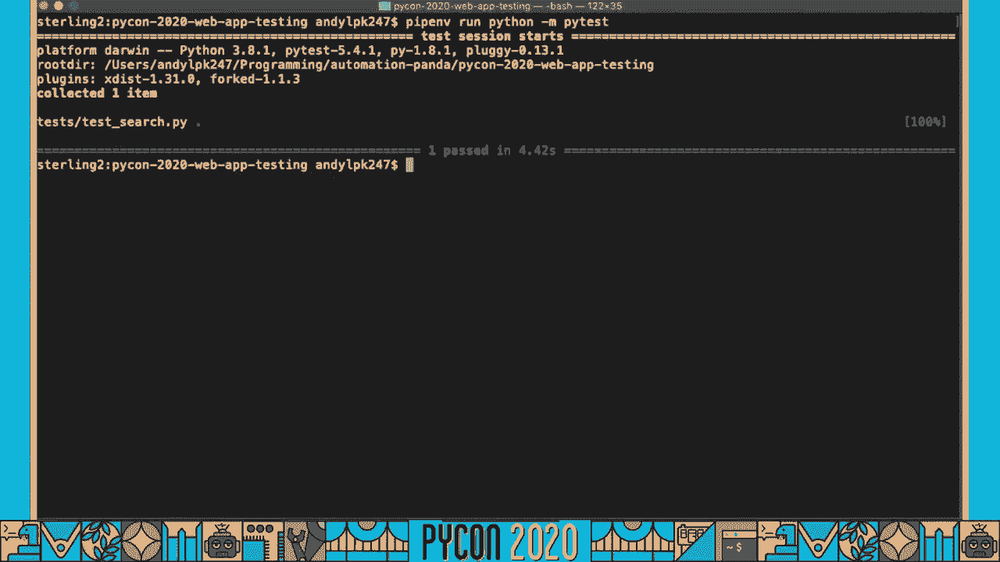

有几种修复方法：
*   **（不推荐）硬性等待**：`time.sleep(5)`。这会使测试变慢且不可靠。
*   **（推荐但复杂）显式等待**：等待标题发生变化。但这需要重写我们的等待策略。
*   **（简单有效）调整断言顺序**：将检查标题的断言移到检查元素之后。因为检查元素（`result_link_titles`, `search_input_value`）会触发隐式等待，确保页面加载更充分，此时标题很可能已经更新。

让我们采用第三种方法，修改测试用例中断言的顺序：
```python
def test_basic_duckduckgo_search(browser):
    # ... 前面的步骤不变 ...
    # 验证结果 - 先验证元素，再验证标题
    titles = result_page.result_link_titles()
    matches = [t for t in titles if PHRASE.lower() in t.lower()]
    assert len(matches) > 0
    assert PHRASE == result_page.search_input_value()
    assert PHRASE in result_page.title() # 最后检查标题
```

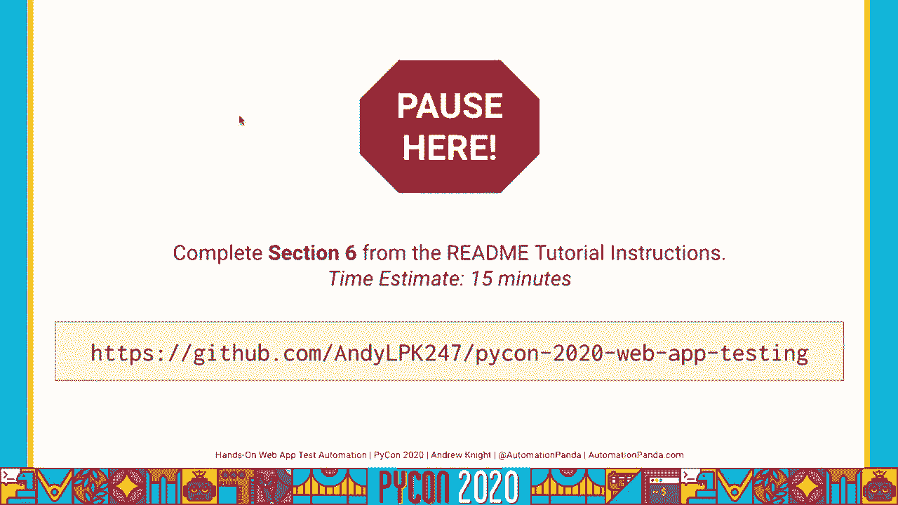

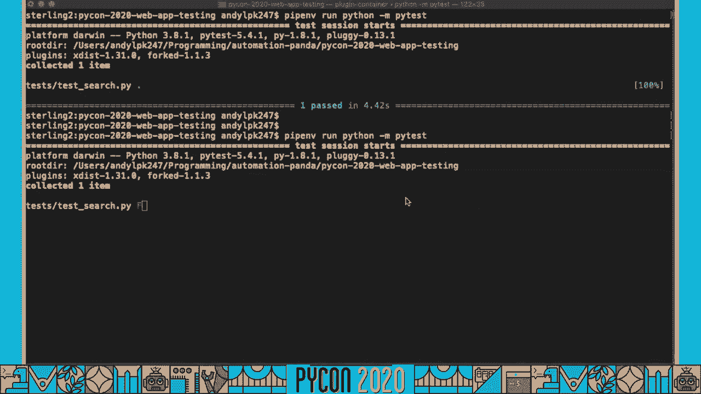

现在，轮到您动手了。请暂停视频，完成README中第七部分（Part 7）的教程说明。您需要：
1.  调整 `test_basic_duckduckgo_search` 函数中断言的顺序。
2.  再次使用三种浏览器配置（chrome, firefox, headless chrome）运行测试，确保现在全部通过。
3.  思考：为什么调整顺序能解决问题？这利用了隐式等待的副作用，是一种务实的解决方案。但对于更复杂的场景，学习并使用显式等待是更好的长期投资。

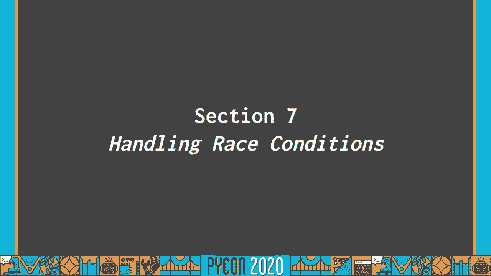

---

## 动手进行Web应用测试自动化：9：并行运行测试 🚄

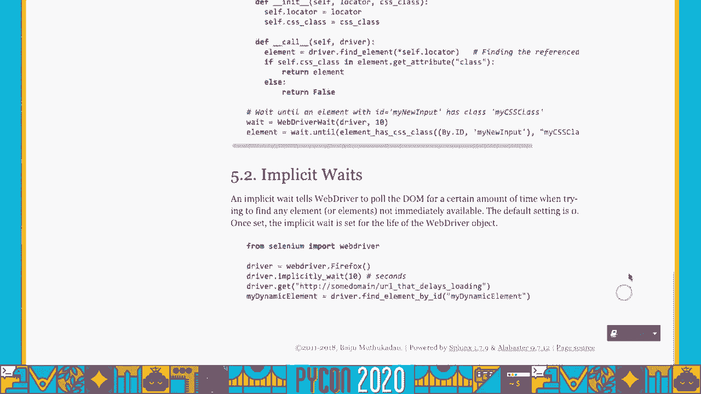

上一节我们解决了测试的稳定性问题，本节我们将关注如何提升测试的执行速度。Web UI测试通常执行较慢（约1分钟/个），当测试套件增长时，总运行时间会变得难以接受。**并行运行测试**是加速的关键。

假设我们有1000个Web UI测试，每个耗时1分钟，串行运行需要超过16小时。通过并行，我们可以将这个时间大幅缩短。

使用 **`pytest-xdist`** 插件可以轻松实现并行测试。它允许在多个CPU核心上并行运行测试，甚至可以将测试分发到多台机器上。

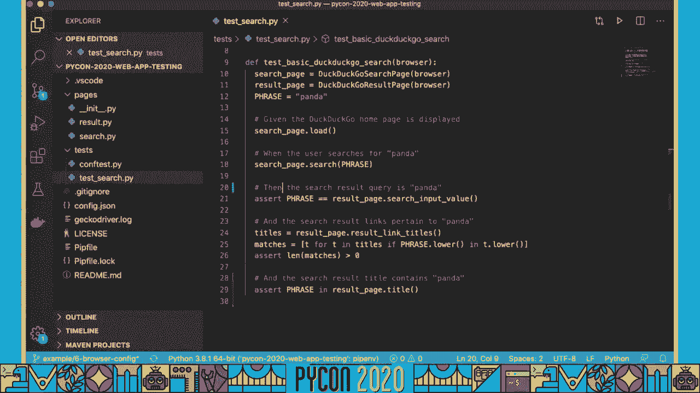

**前提条件**：
1.  **测试独立性**：每个测试必须能够独立运行，不依赖共享状态（如全局变量、数据库的特定记录），避免测试间相互干扰。
2.  **良好的性能**：每个测试本身应避免不必要的延迟（如硬性等待）。

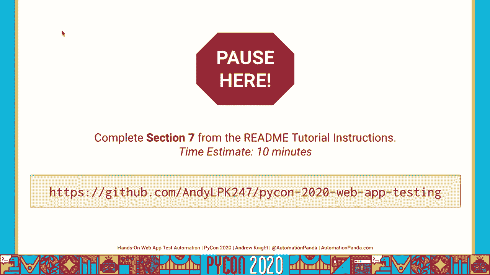

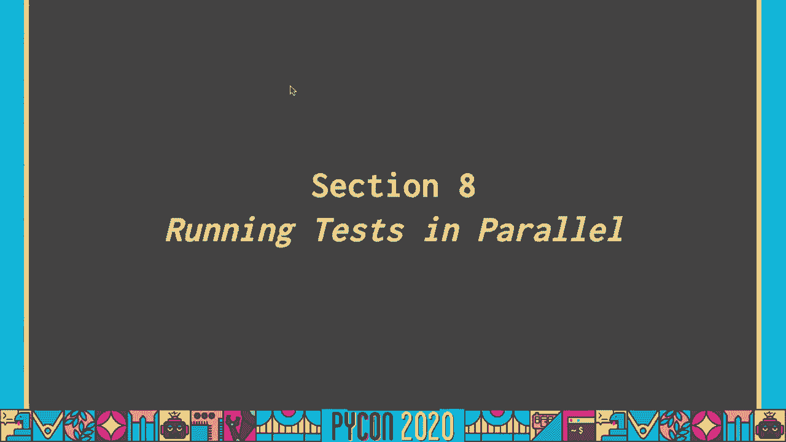

**安装与使用**：
```bash
pip install pytest-xdist
```
运行测试时，使用 `-n` 参数指定并行进程数：
```bash
python -m pytest -n 3 # 使用3个worker并行运行
```

为了演示，我们可以使用 `@pytest.mark.parametrize` 装饰器快速创建多个测试变体：
```python
import pytest

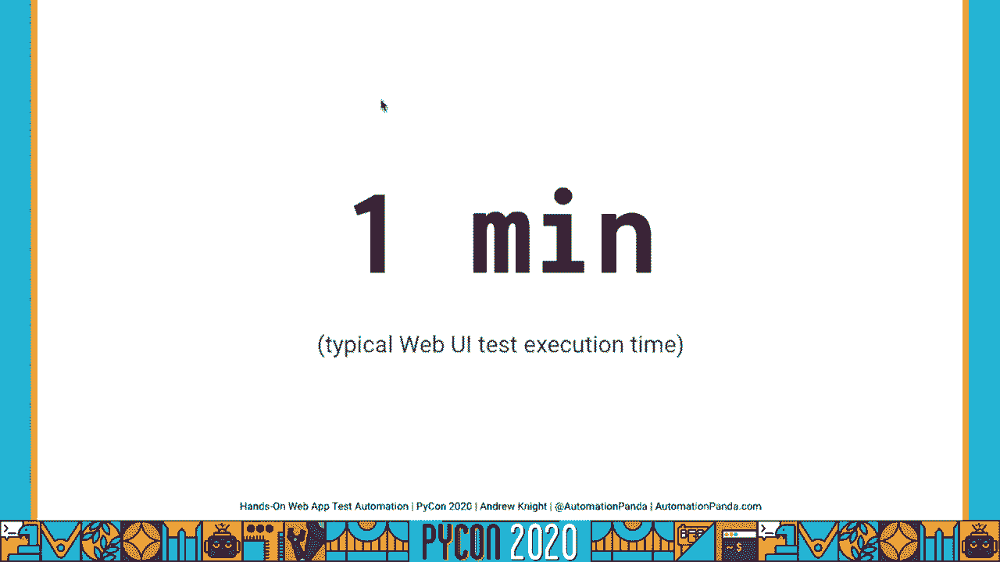

@pytest.mark.parametrize(‘phrase’, [‘panda’, ‘python’, ‘polar bear’])
def test_basic_duckduckgo_search(browser, phrase):
    # 测试体不变，现在会对每个phrase运行一次
    # ...
```
运行三个串行测试可能需要十几秒，而并行运行可能只需几秒。

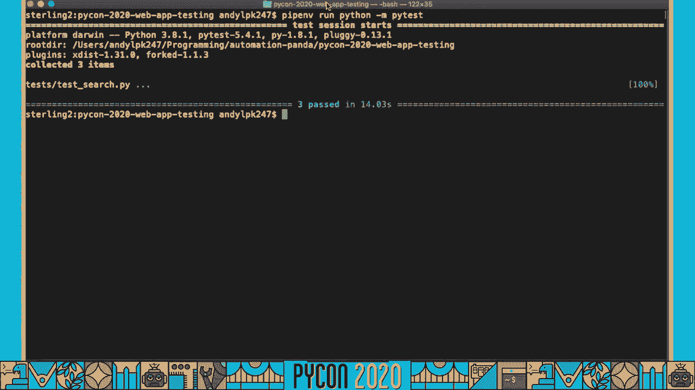

**超越单机：Selenium Grid**
对于更大规模的并行测试（跨浏览器、跨操作系统），可以使用 **Selenium Grid**。它是一个开源工具，由一个中心枢纽（Hub）和多个节点（Node）组成。测试向Hub请求特定配置（如“Windows 10上的Chrome 90”），Hub会分配一个空闲的Node来执行。
*   **自建Grid**：可以使用Docker等工具搭建。
*   **云服务**：也可以使用Sauce Labs、BrowserStack、LambdaTest等提供的云端Selenium Grid服务，它们管理了基础设施并提供额外功能（如视频录制、日志）。

现在，轮到您动手了。请暂停视频，完成README中第八部分（Part 8）的教程说明。您需要：
1.  安装 `pytest-xdist`。
2.  使用 `@pytest.mark.parametrize` 为您的搜索测试添加多个搜索短语。
3.  分别用串行 (`python -m pytest`) 和并行 (`python -m pytest -n 3`) 方式运行测试，观察执行时间的变化。
4.  体验并行测试带来的速度提升。

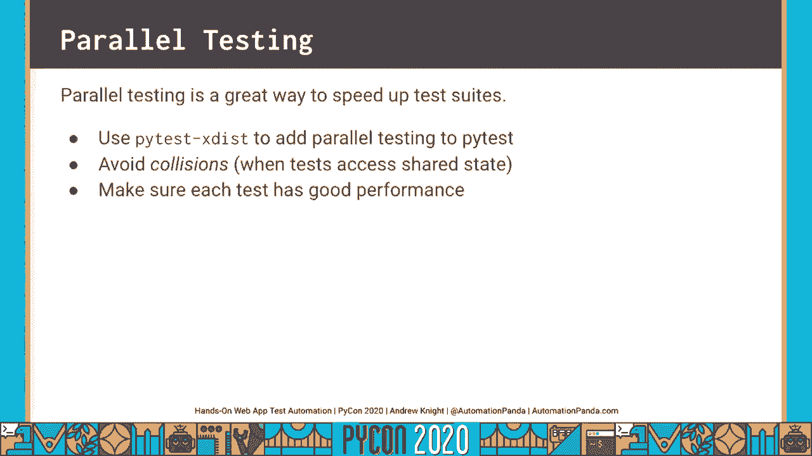

---

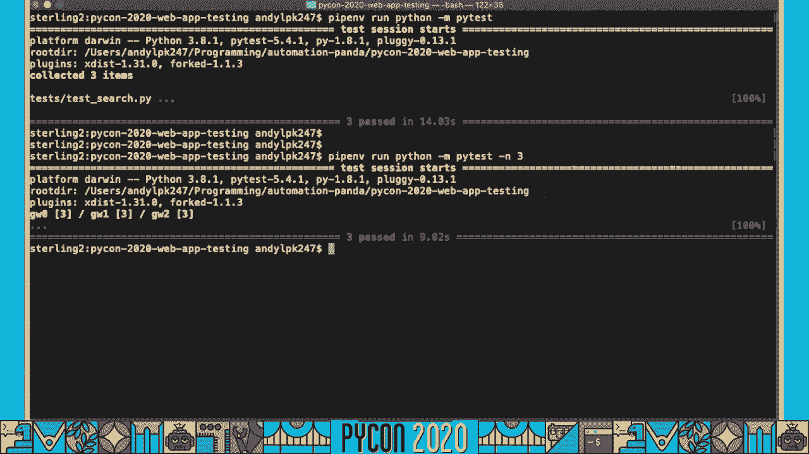

## 动手进行Web应用测试自动化：10：总结与扩展 🎉

恭喜你完成了本教程的所有核心部分！我们一起学习了如何从零开始构建一个基于Python、pytest、页面对象模式和Selenium WebDriver的Web应用测试自动化解决方案。

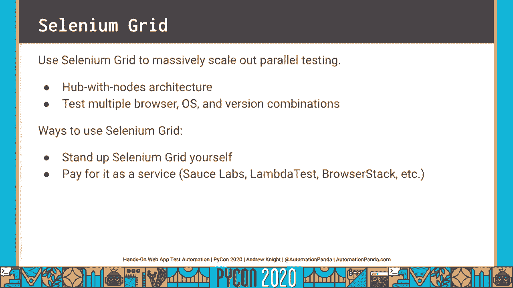

**本节课中我们一起学习了**：
1.  Web UI测试的概念、优缺点及测试金字塔。
2.  使用pytest框架组织和运行测试用例。
3.  使用Selenium WebDriver进行浏览器自动化。
4.  应用页面对象模式提高代码的可维护性和复用性。
5.  定位网页元素的不同策略。
6.  调用WebDriver API与页面交互。
7.  使用配置文件管理测试参数和浏览器选项。
8.  理解并处理竞态条件。
9.  使用pytest-xdist插件并行运行测试以提升效率。

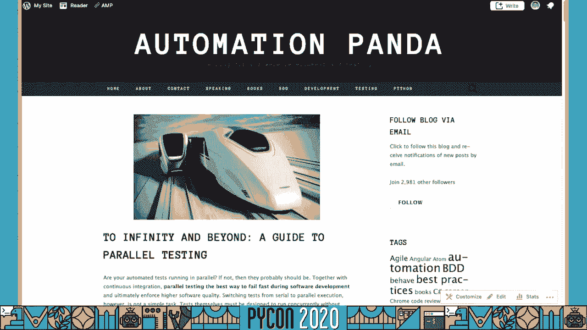

你的测试自动化项目现在已经是一个结构良好、可配置、可并行执行的坚实基础。**熟能生巧**，你可以在此基础上进行扩展：

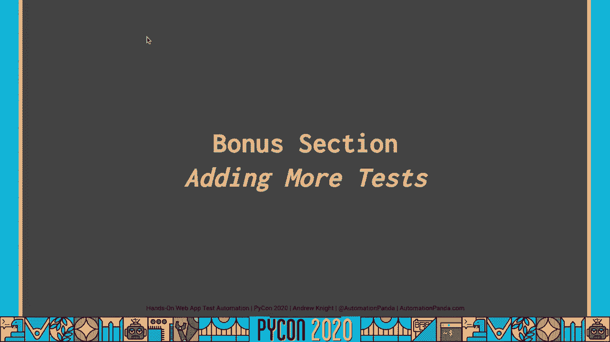

**扩展想法**：
*   为DuckDuckGo添加更多测试：通过点击按钮搜索、点击特定搜索结果、测试搜索设置、验证更多结果属性等。
*   尝试为其他更复杂的Web应用（如登录、表单提交、购物流程）编写测试。
*   集成更高级的报告工具（如Allure）。
*   将自动化套件集成到CI/CD管道（如Jenkins, GitLab CI, GitHub Actions）中。


测试自动化是一个充满挑战但回报丰厚的领域。希望本教程为你打开了这扇门，并提供了实用的起点。祝你在此旅程中一切顺利！