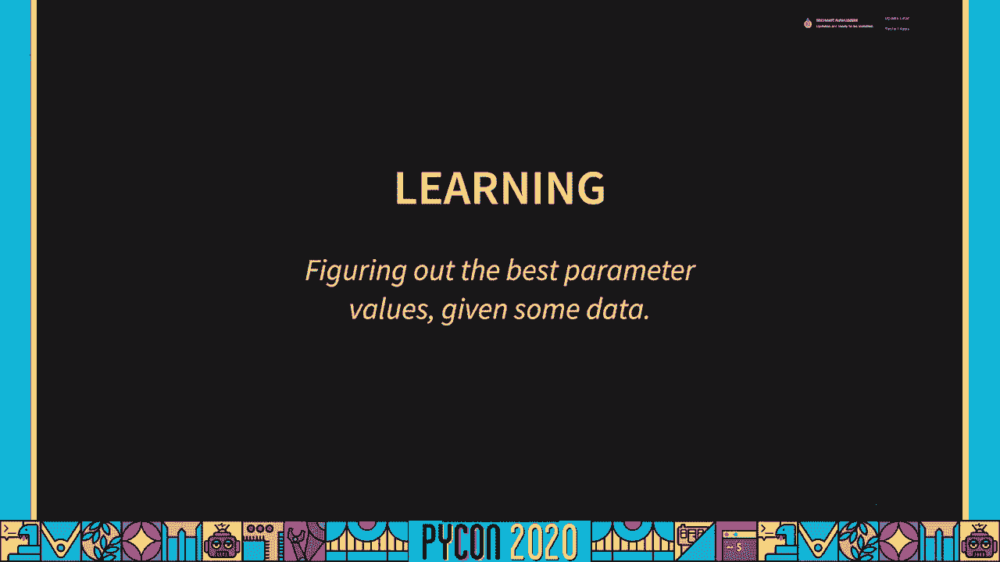
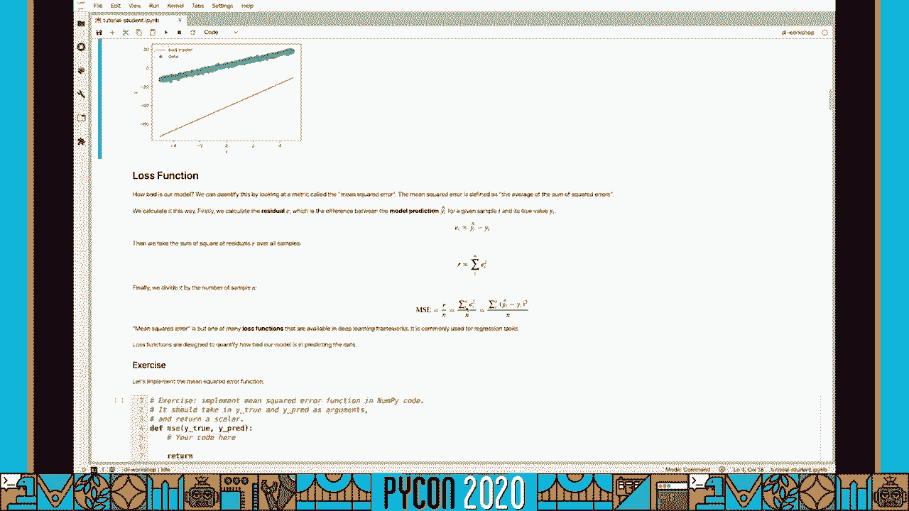
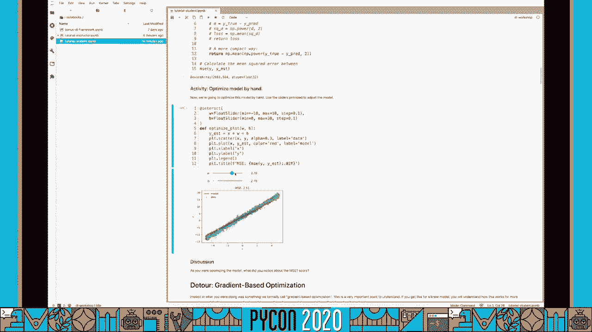
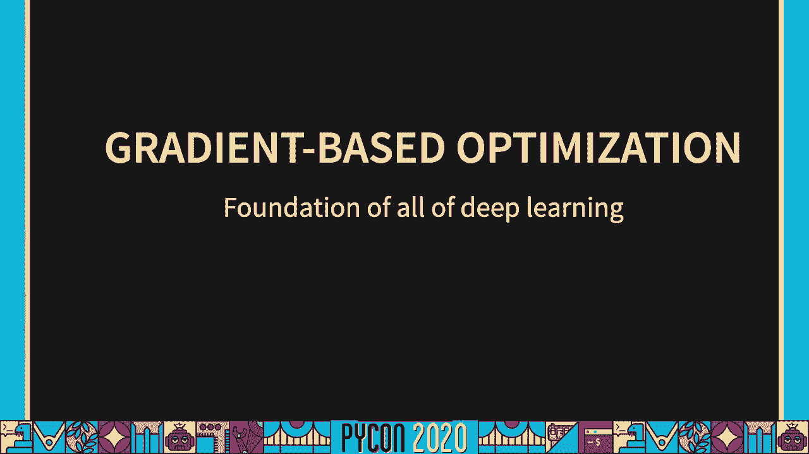
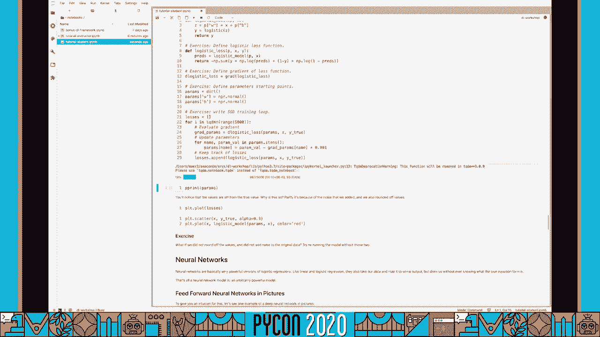
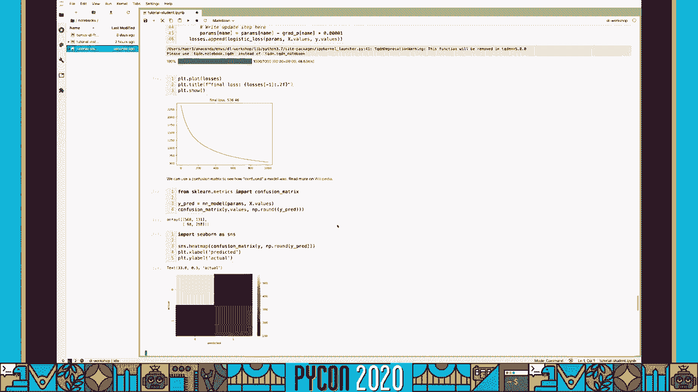

# 深度学习解密：P77：教程 Eric J. Ma - 为数据科学家解密深度学习


## 概述
在本教程中，我们将学习深度学习的基础框架，即**模型**、**损失函数**和**优化器**。我们将从线性回归开始，逐步过渡到逻辑回归和前馈神经网络，通过动手编码来理解这三个核心组件如何协同工作。

---

## 课程准备与目标


在开始教程之前，请确保您已准备好学习环境。您可以通过两种方式设置环境：
1.  按照教程存储库中的 Conda 环境说明，在本地托管 Jupyter 服务器。
2.  点击存储库中的 Binder 徽章，启动一个云托管的 Docker 容器化环境。请注意，Binder 有 15 分钟不活动暂停机制，请确保定期在笔记本中执行代码以避免连接中断。

环境就绪后，请打开 `notebooks/` 目录下的学生版笔记本。


本课程的目标是理解并能够定义**模型**、**损失函数**和**优化器**，并提供示例。课程结构如下：
*   首先在线性回归的背景下探索这些概念。
*   然后进行逻辑回归。
*   最后构建前馈神经网络。

课程结束时，您将看到这三个组件在实践中的应用。


学习本课程需要您熟悉 NumPy API、基础的线性代数知识（如点积）以及 Python 数据结构和流程控制。


---

## 线性回归：重温基础模型



上一节我们介绍了课程目标，本节中我们来看看第一个模型：线性回归。

线性回归是我们在高中数学和物理中学到的第一个模型，其公式为 **`y = wx + b`**。这个模型编码了一个结构假设：输出是输入的加权和加上一个偏置项。

线性模型非常有用，但世界并非完全是线性的。然而，如果我们假设观测到的数据是由一个具有未知参数 `w` 和 `b` 的线性模型生成的，那么我们的任务就是找出能最好地解释这些数据的参数值。

让我们通过模拟数据来探索这一点。首先，我们生成一些由真实参数 `w_true = 3.14` 和 `b_true = 2.72` 生成的数据，并添加一些噪声。




```python
import numpy as np
# 生成数据
np.random.seed(42)
x = np.random.randn(100)
noise = np.random.randn(100) * 0.5
y_true = 3.14 * x + 2.72 + noise
```

接下来，我们选择一个很差的参数估计（例如 `w=6.2`, `b=-4.2`）并绘制其预测。从视觉上可以看出这个模型很糟糕。为了量化模型的糟糕程度，我们引入一个**损失函数**。

一个常用的损失函数是**均方误差**。其定义为误差平方的平均值。

**公式**：
`MSE = (1/n) * Σ(y_true_i - y_pred_i)^2`

视觉上，MSE 计算的是每个数据点的预测值（红色线）与真实值（蓝色点）之间垂直距离（残差）的平方的平均值。

让我们在 NumPy 中实现它：

```python
def mse_loss(y_true, y_pred):
    """
    计算均方误差损失。
    参数:
        y_true (np.ndarray): 真实值数组。
        y_pred (np.ndarray): 预测值数组。
    返回:
        loss (np.ndarray): 标量损失值。
    """
    d = y_true - y_pred          # 计算残差
    squared_d = np.power(d, 2)   # 计算平方
    loss = np.mean(squared_d)    # 计算平均值
    return loss
    # 更简洁的写法: return np.mean((y_true - y_pred)**2)
```

计算 MSE 会得到一个正数，因为它衡量的是模型预测与数据之间的差异。通过量化损失，我们打开了**优化模型**的大门，即调整参数 `w` 和 `b` 以最小化损失函数。



您可以尝试手动调整参数来感受优化过程。您会注意到，当接近最佳拟合时，损失会减少；但如果调整过度，损失又会增加。为了系统地理解这个过程，我们需要绕道进入**基于梯度的优化**。



---

## 基于梯度的优化：寻找最小值

上一节我们通过手动调整体验了优化，本节中我们来看看其背后的数学原理：基于梯度的优化。

**梯度**与导数密切相关。简单来说，导数描述了当输入发生微小变化时，输出变化的大小。对于一个函数 `f(w)`，其导数 `df/dw` 给出了 `w` 变化时 `f` 的变化率。


当我们谈论优化一个函数时，通常指的是找到其最小值（或最大值）。在微积分中，我们知道函数在斜率为零的点可能达到极值。通过令一阶导数 `df/dw = 0` 并求解 `w`，我们可以解析地找到最小值（还需检查二阶导数确认是最小值）。

然而，对于复杂函数，解析求解可能很困难。这时，我们可以使用**计算优化**，即利用函数的导数信息来迭代地寻找最小值。这种方法称为**梯度下降**。

其核心思想是：如果我们站在函数曲线上的某一点，梯度（导数）告诉我们哪个方向是“上坡”。为了找到最小值，我们需要向“下坡”走，即**负梯度方向**。我们沿着这个方向迈出一小步（步长，通常记为 `learning_rate`），反复迭代，最终逼近最小值。

让我们用代码实现一个简单函数 `f(w) = w^2 + 3w - 5` 的梯度下降：

```python
def f(w):
    return w**2 + 3*w - 5

def df(w): # 手动计算的导数
    return 2*w + 3

# 梯度下降
w = 3 * np.pi # 任意起始点
learning_rate = 0.01
history = []
for i in range(1000):
    w = w - learning_rate * df(w) # 向负梯度方向更新
    history.append(w)
# 最终 w 应接近解析解 -1.5
```

恭喜，您刚刚手动实现了梯度下降！它是一个**优化器**，一个迭代修改参数以最小化目标函数的程序。

在上面的例子中，我们手动定义了导数函数 `df`。对于复杂函数，这很麻烦。幸运的是，有工具可以**自动计算导数**，这就是**自动微分**。本教程将使用 JAX 库，它允许我们对 NumPy 代码自动求导。

```python
from jax import grad

def f(w):
    return w**2 + 3*w - 5

df_auto = grad(f) # 自动生成梯度函数
# 现在 df_auto(w) 的行为与手动定义的 df(w) 相同
```

---

## 整合框架：模型、损失与优化器


上一节我们学习了梯度下降，现在让我们把基于梯度的优化和线性回归模型联系起来。

在线性回归中：
*   我们要优化的**函数**是损失函数 `L`（即 MSE）。
*   我们要优化的**参数**是 `w` 和 `b`（线性模型中的参数）。
*   我们**没有**直接优化线性模型函数本身，而是优化衡量模型好坏的损失函数。


至此，我们已经掌握了深度学习的核心框架，它由三部分组成：

1.  **模型**：一个数学函数 `f`，将输入 `x` 映射到输出 `y`。它由一组参数 `θ` 控制。在线性模型中，`θ = {w, b}`，函数为 `y = w*x + b`。
2.  **损失函数**：另一个数学函数 `L`，它量化模型预测 `y_pred` 与真实数据 `y_true` 之间的差异。它告诉我们模型有多“糟糕”。在线性回归中，我们使用 MSE。
3.  **优化器**：一个基于梯度的程序（如梯度下降），它迭代地更新参数 `θ`，以最小化损失函数 `L`。即寻找 `argmin_θ L(θ)`。

现在，让我们用代码将这个框架整合起来，用于线性回归：

```python
# 1. 定义模型
def linear_model(p, x):
    """线性模型 y = w*x + b"""
    return p['w'] * x + p['b']

# 2. 初始化参数 (随机起点)
np.random.seed(42)
params = {'w': np.random.randn(), 'b': np.random.randn()}

# 3. 定义损失函数 (已实现的 mse_loss)
# 4. 使用 JAX 获取损失函数的梯度
from jax import grad
def loss_fn(params, x, y_true):
    y_pred = linear_model(params, x)
    return mse_loss(y_true, y_pred)

grad_loss_fn = grad(loss_fn) # 自动微分得到梯度函数

# 5. 优化器 (梯度下降训练循环)
learning_rate = 0.05
losses = []
for i in range(200):
    # 计算当前参数下的梯度
    grads = grad_loss_fn(params, x, y_true)
    # 更新每个参数：向负梯度方向移动一小步
    for key in params:
        params[key] = params[key] - learning_rate * grads[key]
    # 记录损失
    current_loss = loss_fn(params, x, y_true)
    losses.append(current_loss)
# 训练后，params 应接近真实值 w_true, b_true
```

绘制损失曲线会看到损失下降，最终参数接近生成数据的真实参数。您已经成功使用模型、损失、优化器框架拟合了一个线性回归模型！

---

## 逻辑回归：从回归到分类

上一节我们在线性回归中应用了框架，本节中我们将其扩展到**逻辑回归**，处理分类问题。

逻辑回归可以看作是线性回归的自然延伸。它在线性分量 `z = w*x + b` 之后，添加了一个**激活函数**——逻辑函数（或称 Sigmoid 函数）`g(z) = 1 / (1 + exp(-z))`。这个函数将线性输出压缩到 (0, 1) 区间，可以解释为概率。

逻辑函数有两个参数：
*   `w` 控制曲线的斜率，即从 0 到 1 转换的陡峭程度。
*   `b` 控制转换发生的临界点位置。

对于分类问题，我们使用不同的损失函数：**交叉熵损失**（或称对数损失）。对于二分类问题（标签为 0 或 1），其公式为：

**公式**：
`L = - [y_true * log(y_pred) + (1 - y_true) * log(1 - y_pred)]`

这个损失函数衡量了预测概率分布与真实分布之间的差异。当预测概率接近真实标签时，损失较小。

现在，让我们将逻辑回归纳入我们的框架：

```python
# 1. 定义模型：线性部分 + 逻辑激活
def logistic_model(p, x):
    z = p['w'] * x + p['b'] # 线性部分
    y_pred = 1 / (1 + np.exp(-z)) # 逻辑(Sigmoid)激活
    return y_pred

# 2. 定义损失函数：交叉熵损失
def logistic_loss(y_true, y_pred):
    # 添加微小值防止 log(0) 导致 NaN
    eps = 1e-15
    y_pred = np.clip(y_pred, eps, 1 - eps)
    loss = - (y_true * np.log(y_pred) + (1 - y_true) * np.log(1 - y_pred))
    return np.mean(loss)



# 3. 整合损失函数（供自动微分使用）
def loss_fn(params, x, y_true):
    y_pred = logistic_model(params, x)
    return logistic_loss(y_true, y_pred)


from jax import grad
grad_loss_fn = grad(loss_fn)

# 4. 初始化参数和优化器循环（与线性回归类似）
np.random.seed(42)
params = {'w': np.random.randn(), 'b': np.random.randn()}
learning_rate = 0.1
losses = []

for i in range(1000):
    grads = grad_loss_fn(params, x, y_true)
    for key in params:
        params[key] = params[key] - learning_rate * grads[key]
    current_loss = loss_fn(params, x, y_true)
    losses.append(current_loss)
# 训练后，模型应能区分两类数据
```


通过这个练习，您可以看到，只需改变**模型**（添加激活函数）和**损失函数**（从 MSE 改为交叉熵），同一个优化器框架就能应用于分类任务。

---

## 前馈神经网络：堆叠的威力

上一节我们掌握了逻辑回归，本节中我们来看看如何将其思想扩展成强大的**前馈神经网络**。

神经网络本质上是多个“层”的堆叠，每一层都包含线性变换和激活函数。因此，一个简单的神经网络可以看作是多个逻辑回归单元的堆叠与组合，这使其成为通用的函数逼近器。

让我们构建一个简单的两层神经网络，用于预测分子是否可生物降解（二分类问题）。输入有 4 个特征，我们设计一个包含 20 个神经元的隐藏层。

以下是构建步骤：

```python
# 辅助函数：用噪声初始化参数矩阵
def init_param(shape):
    return np.random.randn(*shape) * 0.1

# 1. 初始化参数
params = {
    'w1': init_param((4, 20)), # 从4维输入到20维隐藏层
    'b1': init_param((20,)),
    'w2': init_param((20, 1)), # 从20维隐藏层到1维输出
    'b2': init_param((1,))
}

# 2. 定义前馈神经网络模型
def neural_net(p, x):
    # 第一层: 线性变换 + Tanh激活
    # x shape: (n_samples, 4)
    # p['w1'] shape: (4, 20)
    # p['b1'] shape: (20,)
    z1 = np.dot(x, p['w1']) + p['b1'] # 结果 shape: (n_samples, 20)
    a1 = np.tanh(z1) # 激活函数

    # 第二层: 线性变换 + Sigmoid激活 (输出概率)
    # a1 shape: (n_samples, 20)
    # p['w2'] shape: (20, 1)
    # p['b2'] shape: (1,)
    z2 = np.dot(a1, p['w2']) + p['b2'] # 结果 shape: (n_samples, 1)
    a2 = 1 / (1 + np.exp(-z2)) # Sigmoid激活
    return a2.flatten() # 输出 shape: (n_samples,)

# 3. 使用之前定义的 logistic_loss 和 grad
def loss_fn(params, x, y_true):
    y_pred = neural_net(params, x)
    return logistic_loss(y_true, y_pred)

from jax import grad
grad_loss_fn = grad(loss_fn)

# 4. 训练循环 (与之前结构一致)
learning_rate = 0.05
losses = []
for epoch in range(2000):
    grads = grad_loss_fn(params, x_train, y_train)
    for key in params:
        params[key] = params[key] - learning_rate * grads[key]
    current_loss = loss_fn(params, x_train, y_train)
    losses.append(current_loss)
    if epoch % 500 == 0:
        print(f"Epoch {epoch}, Loss: {current_loss:.4f}")
```




训练完成后，您可以评估模型在测试集上的性能，例如绘制混淆矩阵。您会看到，通过堆叠层，神经网络能够学习更复杂的模式来拟合数据。

---

## 总结与核心要点

本节课中，我们一起学习了深度学习的核心框架：**模型、损失函数和优化器**。

让我们回顾并总结这个框架：

1.  **模型**：一个将输入 `x` 映射到输出 `y` 的数学函数 `f(x; θ)`，具有可调参数 `θ`。它是我们最常更改的部分，针对不同任务（如图像、序列）有不同的标准架构（如 CNN、RNN）。
2.  **损失函数**：一个衡量模型预测 `f(x; θ)` 与真实目标 `y` 之间差异的函数 `L`。它由问题类型决定（如回归用 MSE，分类用交叉熵）。我们可以根据需要定制或修改损失函数。
3.  **优化器**：一个迭代算法（如梯度下降），它计算损失函数相对于参数 `θ` 的梯度，并沿负梯度方向更新 `θ` 以最小化损失 `L`。我们通常从一个简单、稳定的优化器（如学习率为 0.05 的普通梯度下降）开始。

这个框架具有强大的通用性。从线性回归到深度神经网络，我们只是改变了模型的复杂度和损失函数的形式，而优化器的核心思想保持不变。


希望本教程对您有所启发，并帮助您在职业发展中更好地理解和应用深度学习。感谢您的学习！