# P80：Tutorial Katie McLaughlin - Deploying Django on Serverless Infrastructure - 程序员百科书 - BV1rW4y1v7YG

大家好，欢迎来到无服务器基础设施上部署 django，蟒蛇二十二十教程。我是凯蒂，今天我是你们的导师，今天的教程将介绍如何使用无服务器基础设施部署 django 应用程序。今天的教程将使用 google cloud，并部署一个示例 django 应用程序，你可以跟着使用 glasson dot com 上列出的教程，斜杠蟒蛇二十连字符教程。然后，我们将运行手动部署项目所需的步骤，服务机密和安全需求来部署我们的 django 应用程序，已经手动完成了我们的部署。然后，我们将使用基于源的部署来自动化该部署，创建一个全新的项目，并将我们的准备和部署步骤自动化，使用地形。您可以在 glasson dot com 上跟随本教程。

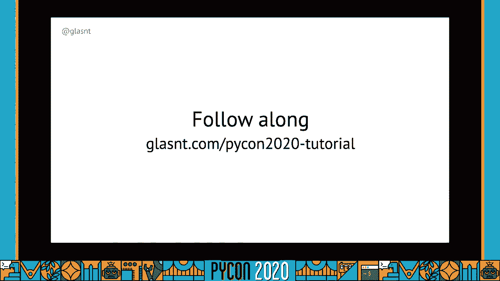

斜杠蟒蛇二十连字符教程，在我们开始之前，我们将在本地尝试应用程序，只是看看这是怎么回事。我准备了一份申请，你可以从 github 下载 zip 文件，所以我们要下载这个 django 演示应用程序的一个版本。Unicodex，这将是今天的演示应用，我们拿到了拉链文件，这样我们就可以把它取出来，放进我们的文件夹里。这看起来就像一个基本的 django 应用程序，但我得到的是。我还有一个码头工人的作曲文件，这将帮助我们连接我们的数据库，它将是 Postgres 和我们的网络容器。我们在这里定义数据库 url 密钥、用户名和密码，我们在本地使用一个 django 运行服务器。所以我现在能做的就是让码头工人帮我们整理一下数据库，这将允许我们的数据库在哪里运行，然后我们可以应用基本的 django 迁移命令，这将为我们填充数据库，所以我们有了基本的行政评估。

但我们也有一些 Unicodex 需要的东西，然后我们可以将一些样本数据加载到数据库中，这将会加载一些我们有的固定装置，然后我们可以启动我们的网络服务器，接下来是我们的演示。

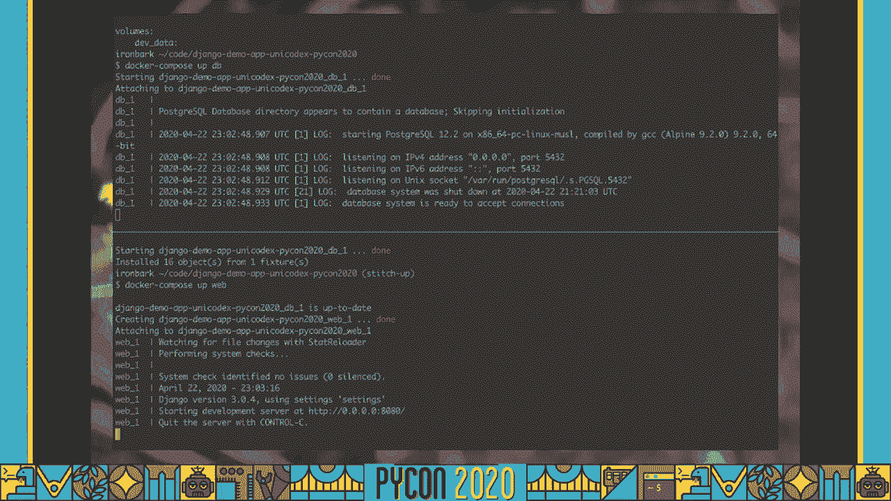

我们有独角兽，有一张非常快乐的波浪脸，现在这个没有任何数据，但我们要做的是，我们的 django 应用程序的存在是显示不同版本的表情符号，因为它们出现在我们系统的不同部分。

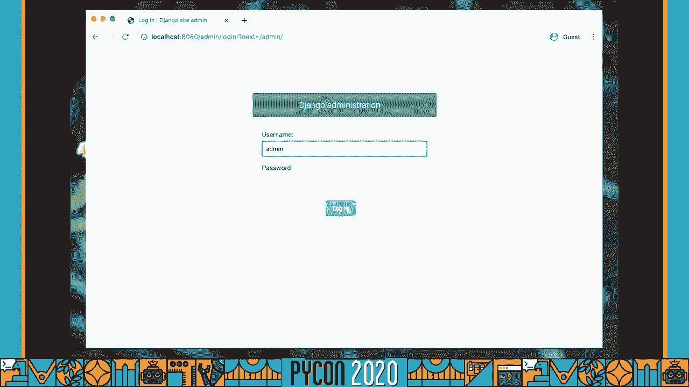

所以我们要做的就是找到我们的密码，从之前的副本弹出，回到我们的窗口并登录到我们的管理。

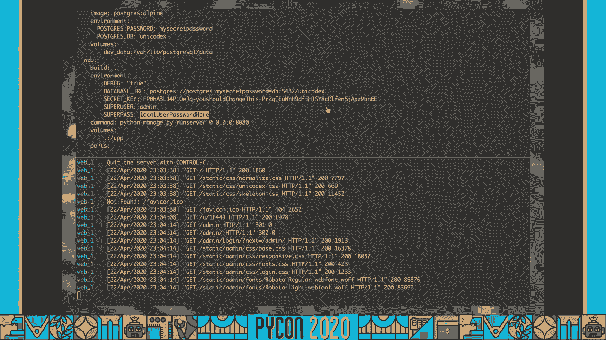

我们会有我们的 unicodex 应用程序，一大堆模特、代码点，实际的 unicode 解码点，对于多个不同的供应商和这些供应商的版本，我们会有设计图像。所以我们有我们的代码点，它在高高挥舞。我们也有一个管理行动，在那里我们可以为我们的供应商生成设计，这个要做什么，它会出现在表情符号上，org，它会把这一页的副本拉下来，挥动的手，它会复制所有这些图像，它将充斥我们版本的表情符号。所以生成图像，这是要做一个基本的管理行动，它会把那一页的副本，找出我们想要的供应商版本有什么图像。现在它已经导入了所有这些供应商版本。如果我们回到我们的网站，我们现在有了挥舞的手的样子，谷歌安卓四点三、四点四，还有亚达。我们有任务在身，有媒体图像，有行政行动，我们的管理有用武之地，我们有一个足够复杂的 django 应用程序，现在可以开始了。

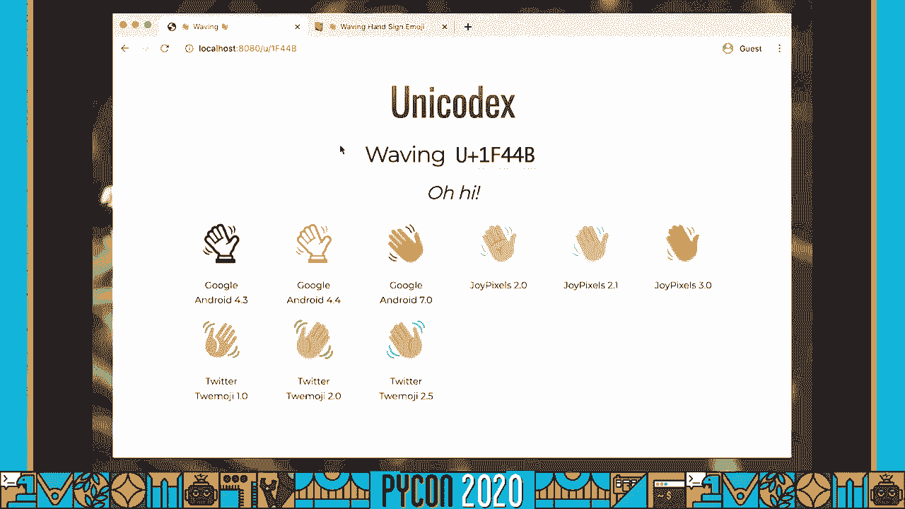

如何在生产中部署它，因为我们需要一个条款，我们的服务器在某个地方，我们需要在某个地方做些什么，对所有这些媒体资产进行处理，然后我们还得处理这些秘密。因为我有一个纯文本的密码，这可能不是最好的主意，在这里说本地用户密码。本教程的其余部分将介绍如何手动部署此应用程序，以及在本节中如何实现自动化部署。

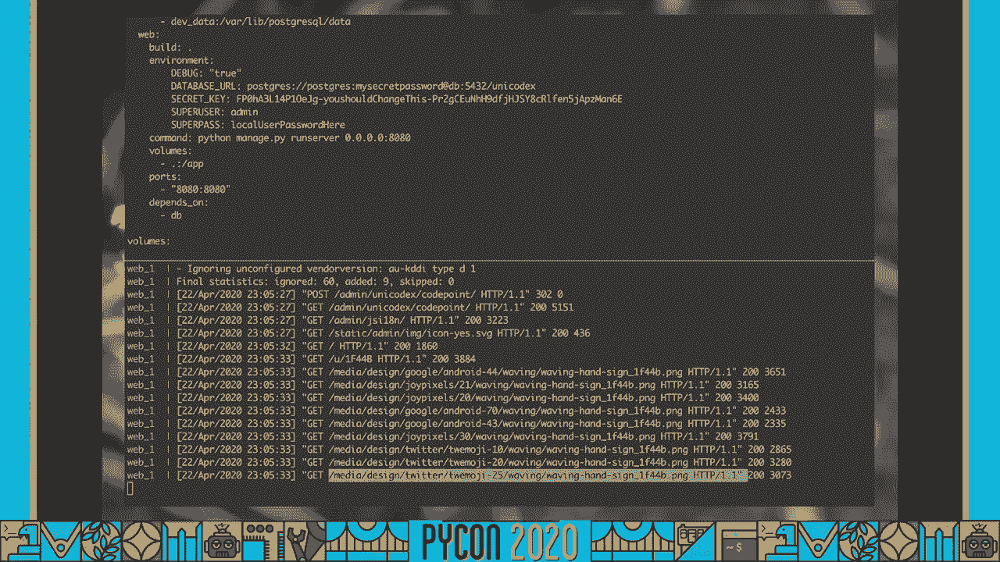

我们将手动将我们的应用程序部署到谷歌云平台上，我已经建立了一个项目，叫它 glapyon 二十二十，这将是我的项目编号，你的项目会有所不同。我们要做的是部署一个 cloud sql Postgres 实例，创建一个存储媒体桶，进行一些安全方面的设置，然后将我们的应用程序部署，而不是走在用户界面上，这可能会随着时间的推移而改变。复制粘贴东西有点困难，我们要使用谷歌云外壳，这将给我们一个互动终端，在那里我们可以运行 g 云命令。

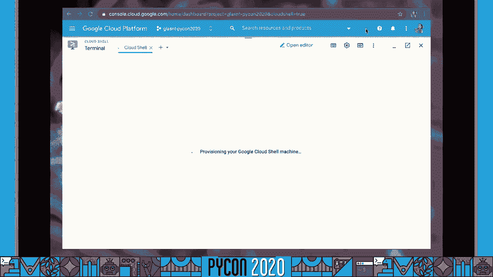

将军命令，所有其他命令，我们需要在特定的环境中运行，它已经为我们准备好了所有的工具。我参与了一个特别的项目，我需要确保我有一个项目的副本，以及我可以在我的项目中使用的身份证，这将使我们很容易复制和粘贴。我已经为您设置的所有 shell 命令，我们还需要考虑我们的地区。我会利用我们，你可以选择欧洲、北一区或亚洲，这将是一个支持我们今天所拥有的所有不同方面的地区。莱顿还不是每个地区都有的，截至录制时。所以请确保你选择了一个适合你的地区。我们今天还会用到很多不同的应用程序接口。

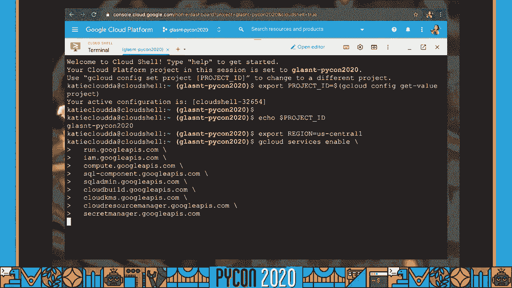

我现在可以花时间启用这些服务。你最终可能会得到一个错误，未启用计费。您需要为本教程的工作启用计费功能，因为我们现在要部署的东西需要花钱。谷歌云上的新用户确实获得了许多免费的试用学分。所以你今天应该可以部署我们的所有方面，而不必真正充电。如果你得到这个先决条件错误，你可以导航到一些花钱的选项，Cloud SQL，这将迫使谷歌云平台为你设置账单。然后您可以选择您想要的账单账户。一旦启用计费，我最终会出现在一个屏幕上，在那里我可以创建实例。

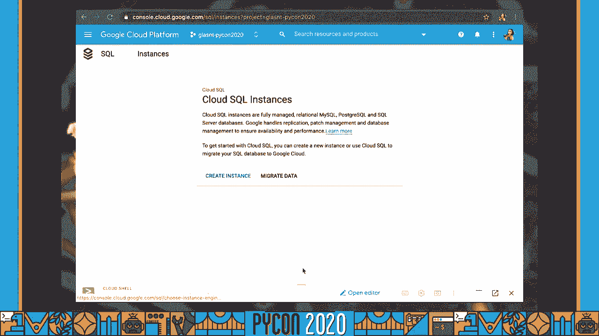

但是我们要用我们的外壳，这个命令需要几分钟才能完成，一旦我们启用了所有的人工智能，我们可以开始创建一些我们的支持服务，开始，我们需要创建一个服务帐户，这个服务帐户将是一个特定的身份，它将运行我们的服务。这将允许我们限制服务帐户可以运行的活动，而不是像我们自己一样奔跑，我们在谷歌云平台上有很多权利，我可以创建数据库，我们可能不希望我们的自动化软件运行数据库，反正还没有。这项特殊服务的身份将是我们项目中的`Unicodex`论文，身份证，我是网上服务的，即使用语言表达也很复杂，所以，我们将把它保存为一个环境变量，后来，我们的服务帐户将扮演的角色。是让我们在云运行中扮演管理员的角色，这个角色将允许我们作为一个云`SQL`客户端运行，这将使我们的服务帐户能够以云运行的方式运行，同时连接到我们的数据库，我们还想启用我们的云构建服务帐户这些相同的权限。

我们的云构建服务帐户将已经存在，它将被谷歌云构建`g`服务帐户上的项目编号所识别，为了便于识别，我们将把它存储为另一个环境变量，该服务帐户也将获得云运行管理，它还将获得云`SQL`客户端。这将允许云构建运行我们的数据库迁移，同时重新部署我们的服务，终于，我们需要确保我们的云构建服务帐户能够运行，作为我们的云运行服务账户，现在我们已经建立了所有这些服务帐户。我们可以开始创建我们的其他支持服务，我们需要为我们的数据库创建一个`Postgres`数据库，我们需要一个非常安全的根密码，我要做的是使用开发视图随机，随机生成一个长度，64 个密码将其存储为环境变量。从不输出到屏幕上，我个人永远不会知道这个密码是什么，可能是个好主意，所以如果我不知道，没有人知道。 

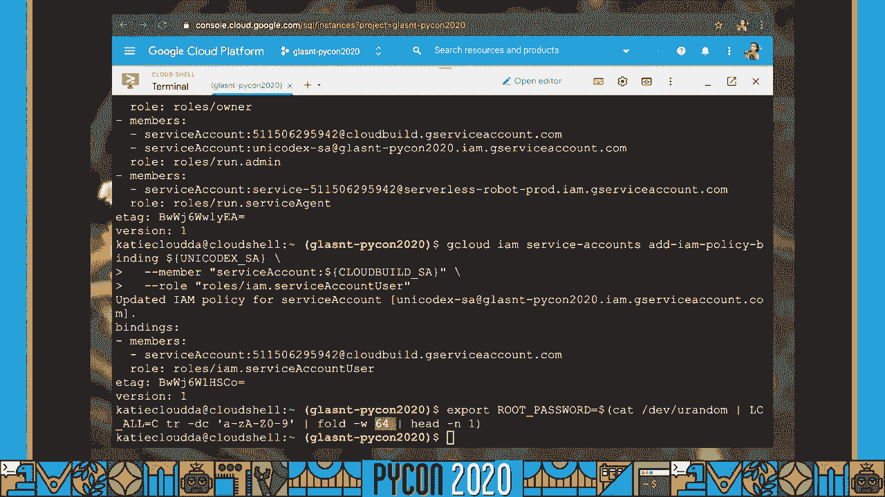

然后我将创建一个`g cloud sql`实例，我准备叫它`psql`，这将是一个非常小的例子，因为我不需要更大的为我今天的特殊应用，它将运行`Postgres 11`，它将在我的地区。用我之前准备好的项目 ID 和密码，这将提供一个`clad sql`实例，这需要一些时间，但这个非常好的小动画将继续运行，直到我们完成，既然我们的`sql`实例已经存在，我们可以在这个实例中创建一个数据库。和，我要确保我指定这个数据库，在我们的数据库中创建，现在数据库已经创建，我可以创建一个用户再次访问那个数据库，我就会随机利用你，这一次，一个更小的密码不需要那么大，但我会把它作为一个环境变量来存储。我永远不会把这个输出到那个存储环境变量的屏幕上，我将创建一个`SQL`用户，我把它叫做`Unicodex`用户，使用我针对`psql`实例创建的密码，现在我有了所有的数据库实例和密码，以及用户和密码。

然后我可以创建一个数据库 URL 字符串，这是我们的数据库连接字符串，这将指定我们要连接到`Postgres`，作为我们的用户名和我们在云上的密码，`SQL`实例，这将是唯一的标识与我们的项目 ID。我们的地区和我们的名字，然后它会连接到他们的数据库，这真的是秘密，我们不希望任何人看到秘密，所以稍后我们会把它作为一个秘密，我们已经建立了数据库，我们现在需要考虑将我们的媒体存储在哪里。我们将使用`姜戈仓库`和`姜戈仓库`，支持谷歌云存储，所以我们需要创建一个谷歌云存储桶，我们将把它作为我们的项目，ID 连字符媒体`gu til`是一个命令，很像`g 云`，但这是专门针对存储桶的，所以我们要做一个桶。在我们地区制造水桶，我们要用我们的桶名，我们现在有一个桶，我们还需要允许我们的服务账户，我们创建了更早的访问，以便能够写到那个桶，我们将运行一个`iam`更改命令，我们的服务账户，存储对象的角色，行政。

在我们的媒体桶里，如果没有这个，我们的行政行动将会失败，因为我们的服务帐户没有权利。

因为我们创造的所有秘密，我们现在将使用谷歌秘密管理器存储这些，我们需要为我们的数据库建立一个秘密，URL，我们将用环境变量的值填充它，我特意选择了把我们的名字保密在所有的帽子里。这将允许我引用环境变量，就像我在任何地方一样，无需做任何事情，比如使用大写或小写或更改名称，可能看起来有点傻，但这将有助于我们以后的部署，我们创造的另一个秘密是我们的桶名，我没必要把这当成秘密。但它将允许我们的申请是 12 个因素，这意味着我可以在任何我想要的环境中部署它，只要我替换所有的环境变量，没有关于这项服务在哪里或什么的信息，或者它被部署的地方存储在应用程序本身中，都是由环境变量定义的。秘钥将是一个独特的字符串，加密和工作机制，它至少要有 50 个长度，我将随机创造，秘密可以有多个版本，这让我可以，这意味着如果我需要重置或更改我的数据库 URL，因为我更改了数据库密码或私钥。

因为我想把我的秘密，我仍然可以提到秘密，但我可以在代码中引用最新版本，然后我可以随时更新这个秘密，所有这些秘密现在都存在，但没有人能真正访问它们，我需要明确地让我们的两个服务帐户访问，才能读懂这些秘密。我会做什么，对这些秘密中的每个秘密授予秘密访问器角色，所以`unicodex`服务帐户需要访问我们的数据库 URL，所以它可以连接到我们的数据库，我们的云构建服务账户也是，我们的。它将同时获得服务帐户和云构建服务帐户的访问或权利，我们的秘密钥匙，这将允许云构建和云运行访问到，快跑，我们的`django`应用程序，就像我们之前看到的，当我们用码头工人作曲时。我们定义了一个超级用户和超级通行证，这些值用于自动为我们创建超级用户的数据迁移，云跑的局限性之一，你不能进入正在运行的服务，运行`django`管理命令，你不能创造超级用户。

所以我们要使用数据迁移来自动创建它，对我们来说是一种迁移，我们需要为我们的用户名和密码存储秘密，为了这些秘密，它们只能通过云构建来访问，这意味着云运行，我们的服务。无法看到我们的`django`管理用户名和密码，这真是个好主意，我们的应用程序不应该知道要自己登录的信息，所以我要创建一个超级用户叫做管理员，我要创造一个秘密，我要把这个秘密再次储存起来。管理本身并不太秘密，但是确保所有这些值都存储为环境变量意味着，我可以继续我的十二分法，我还要创建一个超级用户密码，这又是一个新的随机链接，三十，并存储为密码，这两个秘密都只能通过云构建来访问。一旦完成，我们现在已经建立了所有的机制，能够进行我们的第一次部署，我们已经建立了数据库，我们创造了我们的存储桶，我们创造了秘密，我们还设置了服务帐户和这些服务帐户的权限，我们现在已经准备好了一切。

我们可以创建我们的云运行服务，当我们在本地工作并使用 docker compose 部署应用程序时，我们下载了申请代码，因为我们在“云壳”工作，目前没有这个代码的副本。我们可以运行与之前相同的命令，从 Github 下载 zip 文件夹，取出后进入该目录，这将是完全相同的代码，能够开始创建云运行服务。但在创建服务之前，需要建立网络容器，因为数据库容器已被实际数据库替换，现在只需构建网络容器，使用云构建。这个服务允许我们为特定命令构建，我们将运行的只是我们镜像的构建，它将使用我们的 Docker 文件创建网络镜像，现在我们创造了镜像，将其存储为 gcr，IO 删减项目 ID。

我们的名字，现在可以使用该映像部署云运行服务。

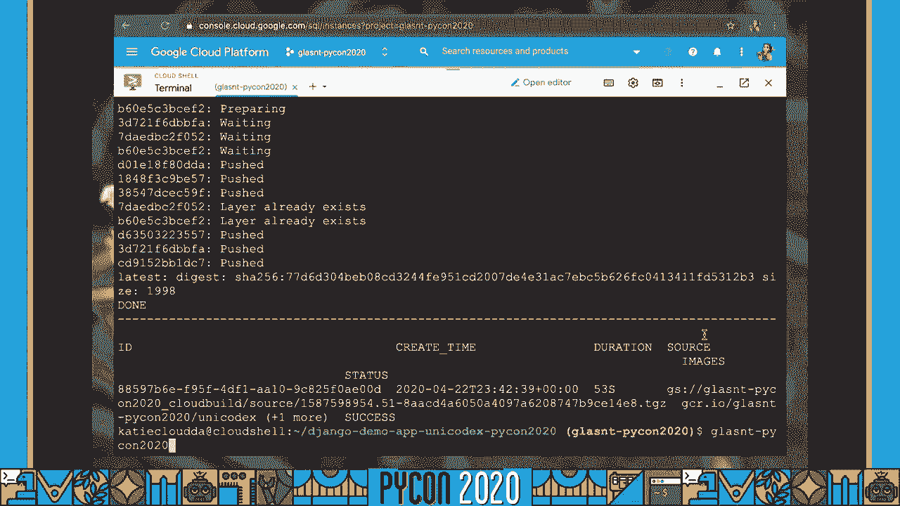

我们的云运行服务将被称为 Unicodex，托管在完全管理的 Google 云上，位于我们的区域，我们将允许未经认证的访问，意味着互联网上的任何人都可以进入我们的网站。看到我们的东西，指定的镜像是之前准备的镜像，SQL 实例和服务账户也是之前准备的，我们现在有一个可部署的服务，可以在该网址上访问。然而，这个 url 不能工作有两个原因，实际上还没有做任何数据库迁移，二是允许的主机指定为一个值，指定为当前主机，确保 Django 应用程序只运行在知道的地方。我们不知道这个网址是什么，直到第一次部署服务，因此我们将为刚创建的服务存储一个网址副本，作为名为 service url 的环境变量。

我们将使用 update 和 vaset 参数重新部署服务器，将当前主机设置为服务 url，刚回来后将重新部署服务设置和环境变量，使我们能够用 Django 加载网站，服务已经重新部署，但尚未运行。因为我们还没有运行数据库迁移，我们将再次运行云构建，但不是指定一个标记，而是指定配置文件，构建、迁移和部署应用程序，这就是为什么我们之前设置所有配置。这将允许云构建连接到数据库，运行数据库迁移，收集静态资源，充填媒体桶，重新部署应用程序，一旦这些完成，现在云构建过程已完成，我们有能力为服务提供支持。

我们的服务在云端运行，之前看到的是独角兽，因为这是新的部署，目前没有任何图像。可以遵循之前的过程，使用 Django admin 登录并运行 admin 命令。我们知道管理用户名是 admin，但密码是什么，那是秘密，所以我要执行命令，获取超级密码的最新值，我不会告诉你密码是什么，密码在我的剪贴板里。所以我可以粘贴，现在我有了我的手动管理员，能够进入代码点，选择代码点并为其生成镜像，然后加载网站，现在有和之前完全一样的功能。

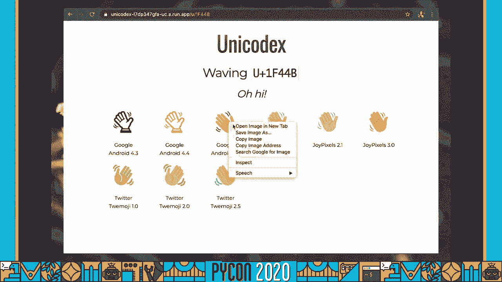

所有这些，图片将通过 Google API url 存储和访问，特别的媒体桶，与之前使用的网址完全相同，这一切都是天衣无缝地为我做的，使用大江戈仓库。

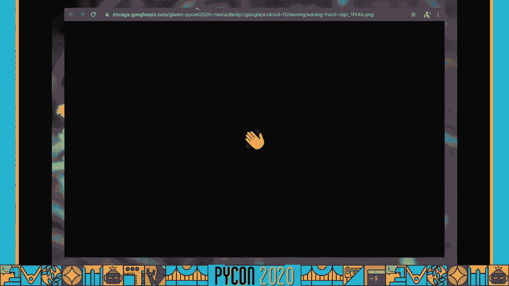

我也可以花时间创建新的代码点，加一个代码点，叫它蛇，这将是 Python 20，代码点来自蛇，走到底部，将是这个代码点，我们留到新进的记录里，为它生成镜像。现在如果我重新加载网站，现在有一条蛇和所有不同的蛇，我们已经成功手动将应用程序部署到云运行中。

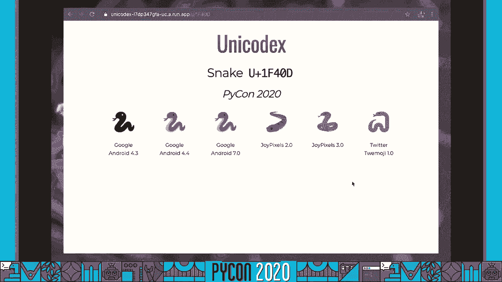

让我们花一点时间更仔细地看看迁移脚本，用这个文件构建迁移部署，这是标准的云构建清单，通常在云构建中扩展，你发现的旅客名单有一个运行 Docker 构建的步骤，然后将镜像推送到存储库。然后部署应用程序，我们在这里增加了迁移步骤，Engine Exec Wrapper 是已存在的云构建器，允许指定 cloud SQL 实例，自动为我们设置 cloud SQL 代理。我们的 Django 迁移脚本有多个步骤需要访问数据库，在云迁移 Django 迁移脚本中，运行 Python，管理，迁移，托管圆点圆周率，加载数据，样本数据，和 collect static 命令，它们要求访问数据库，Django 设置文件有一组设置，明确从中提取，秘密，帮助者，我们的设置文件正在运行。

然后用 Django 和 environ 将其加载到环境中，这允许只要能够访问秘密经理和数据库，就能运行 Django，无论去哪里，运行的两个环境 Django 在云构建和云运行中。因此，花那么多时间，埃利奥特将建立明确的服务账户，具有确切的权限，能够作为 SQL 客户端实体运行，作为云运行管理。所有这些配置和设置允许我们部署 Django 应用程序，使用所需的最小权限集，我们成功手动提供并将应用程序部署到 Google 云中，当想进一步开发应用程序时，可以做几个步骤，完全可以在云壳里工作，使用本地 zip 文件，去换衣服，一些模板，或在源代码管理库中工作，使用云构建触发器自动化部署。

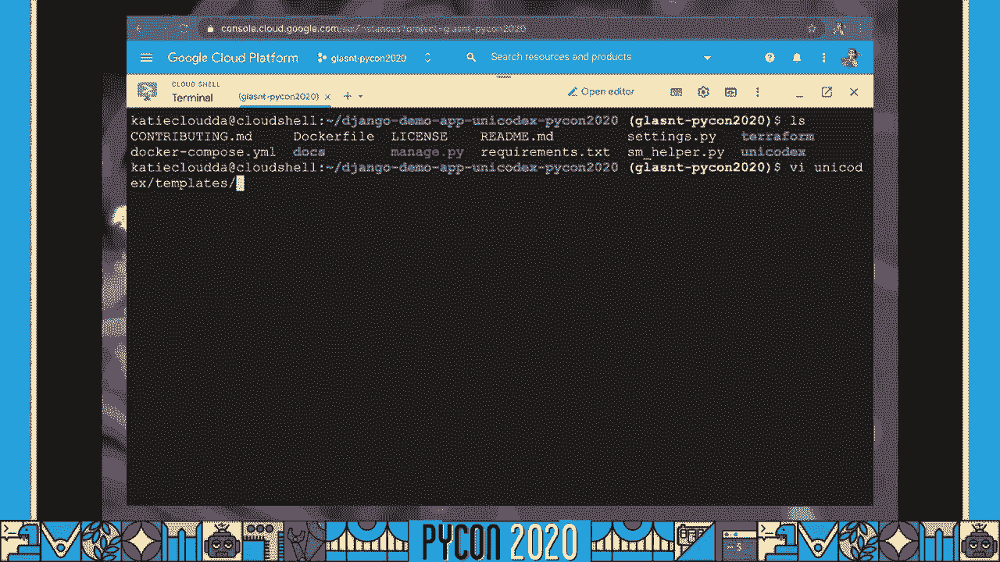

我们能做的是进入云计算，连接仓库，制造一个随时可以发射的触发器，推送主分支。这个步骤要求有源代码控制存储库，我们一直使用的演示复制是 Google 云平台。Django 演示应用程序，Unicodex，到目前为止一直在用这个下载的文件，为了 Python，2000，从这里发布这个演示应用程序，以便继续本教程，得把这个仓库。可以登录到 GitHub 并点击 fork，这是我创造的叉子，要制造一个触发器，拥有云构建配置火，任何时候在我的存储库上推送主分支做到这一点，需要连接仓库。单击 GitHub 并连接到源代码库，选择 Django 演示应用程序 Unicodex，确认，点击连接，跳过自动创建的特定部分，是的，肯定想跳过我的目的。

我不想在每次推送时都部署我的应用程序，我想要一个只在我与主干合并后触发的部署，这样我就可以像往常一样让拉取请求工作，但我的部署只能在合并拉取请求时重新部署。我可以在这里添加一个触发器，然后输入所有这些字段。

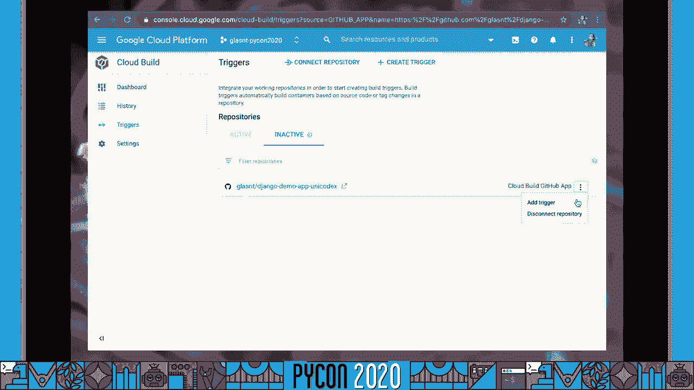

但相反，我要回到我的终端，我将使用“云”命令，在我的 GitHub 仓库上创建一个触发器，这将是我的回购，在我的用户下，你必须在这里改名，你不讨人喜欢，任何时候我都推给主干。我将运行与之前完全相同的云构建，使用相同的变量，一旦触发，创建了，我可以完成向我的主分支提交代码的过程，我的应用程序会自动部署。

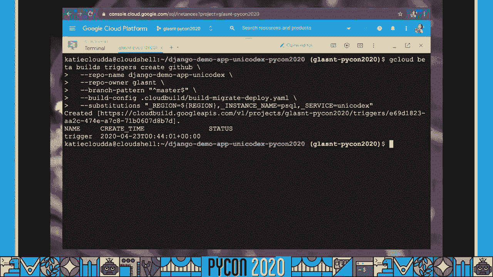

现在我有我的叉子设置和触发器设置，我可以创建我的存储库的克隆，进入源控制，然后我可以做一些改变。我想要的更改需要在我们部署的应用程序中显而易见。

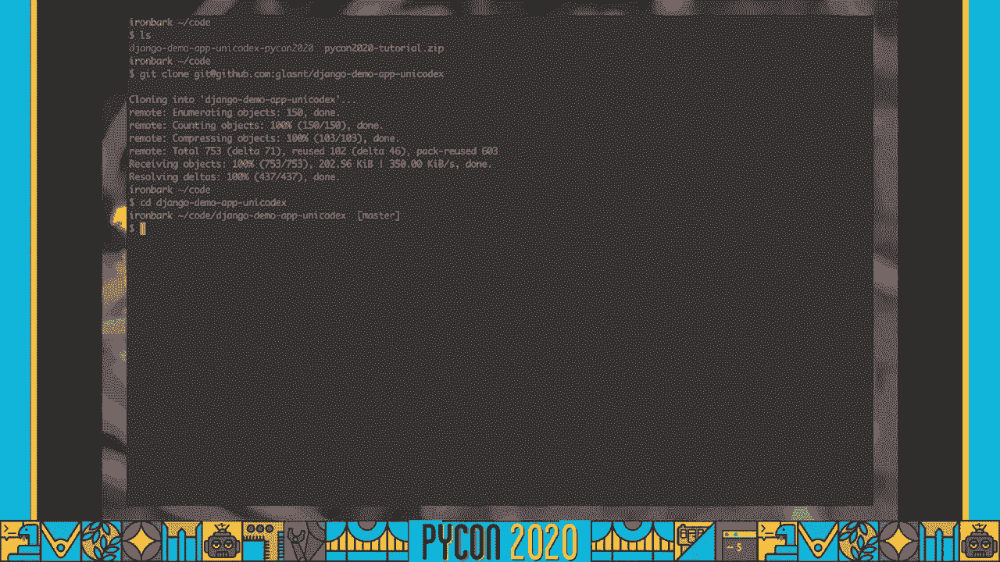

我们有一个紫色的标题，上面有一大堆图标，我能做的是，对我的模板进行明显的改变。

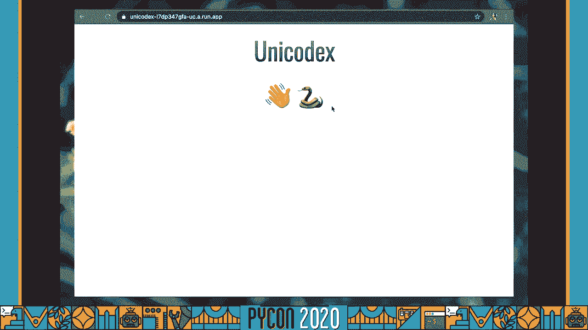

所以我们可以看到这个已经在我的源代码控制中被重新部署，我可以进入 Unicode 模板，我可以改变，然后我也可以去改变我的静态，把我的颜色渐变换成别的颜色，而不是这个颜色，我要用白色来测试这个。我可以使用 Docker Compose 在本地重新部署它，但我会用我的触发器，相反，我要采取这种差异，把它作为模板的改变，然后推给主干。

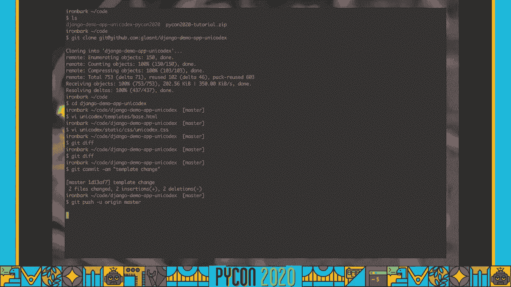

现在我已经把它推给了主干，GitHub 的触发器将自动发射。

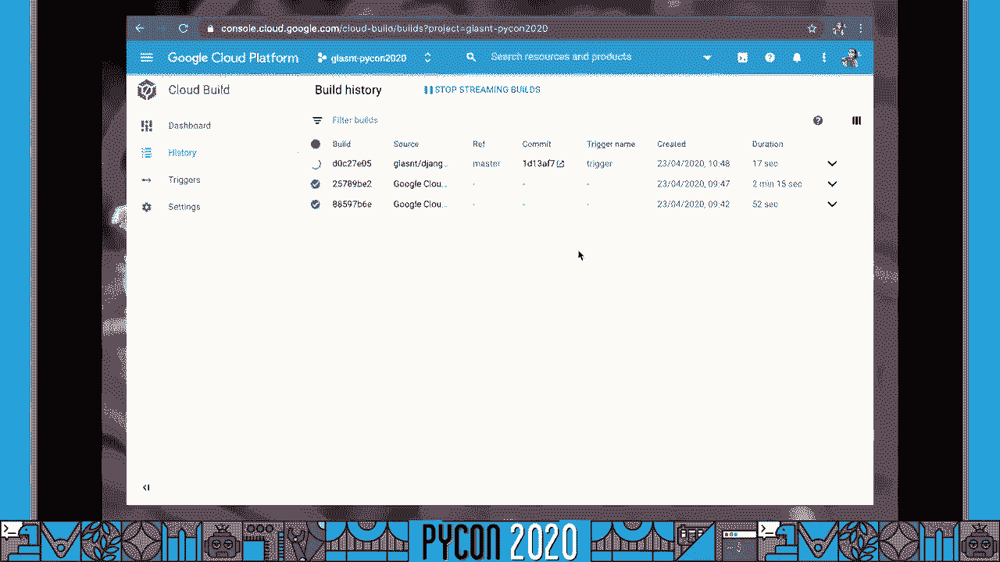

这是匹配的提交，我在这里的承诺。

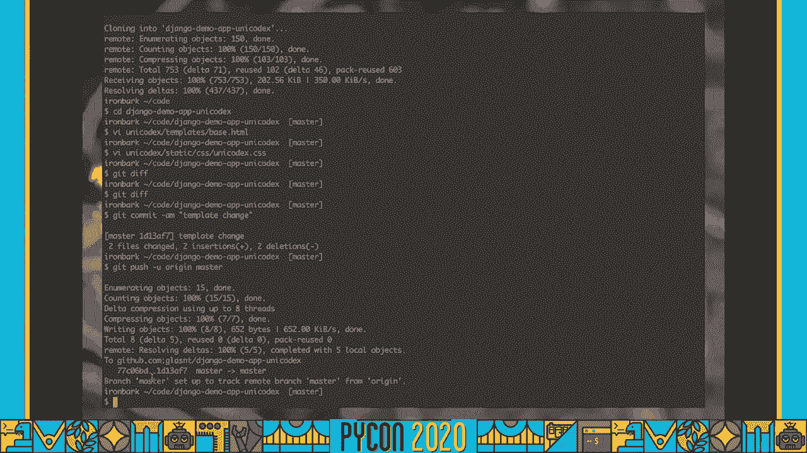

在那边，它会自动展开，我们最后一次部署花了大约两分钟，收集静电，现在我的构建已经完成，我可以去查看，构建成功完成，已经成功部署到我的网址上。刷新此页时，我可以看到我的标题变成了玻璃的独角兽，颜色也变了，这让我可以仅通过推送提交来重新部署我的应用程序。本教程到目前为止，我们手动提供了我们的支持服务，手动部署我们的云运行服务器。现在我们要把时间花在自动化供应上，Terraform 是作为代码选项的众多基础设施之一，在我们的源代码库中，我们有一堆地形文件，在这里我们将自动提供我们的后端服务。然后自动提供我们的服务，我们有一个模块专门为我们的支持服务，尤其是我们的数据库，专门针对我们的服务器，还有一些是为了我们的秘密，我们可以看看这些文件在做什么。

只要看看这段代码，我们就会做一些事情，比如创建一个随机的密码，创建数据库实例，在该实例中创建数据库，创建一个用户。我们要做的是配置本地环境，安装 Terraform，并在本部分教程中应用这些地形配置。我们将使用一个新的项目，你可以将手动部署的旧项目与新项目进行比较，看看它们是如何相同的，如何不同的。继续本教程，你得安装 Terraform，去`terraform.io`点击下载链接，为你的操作系统安装 Terraform。对于本教程的这一部分，你还可以选择在本地使用 G 云，安装 G 云，去`cloud.google.com/sdk`，并遵循你的操作系统的安装说明，创建一个新项目。我们可以进入新的项目屏幕，创建一个新的项目，我把这个叫做“20 世纪 20 年代的地球”。

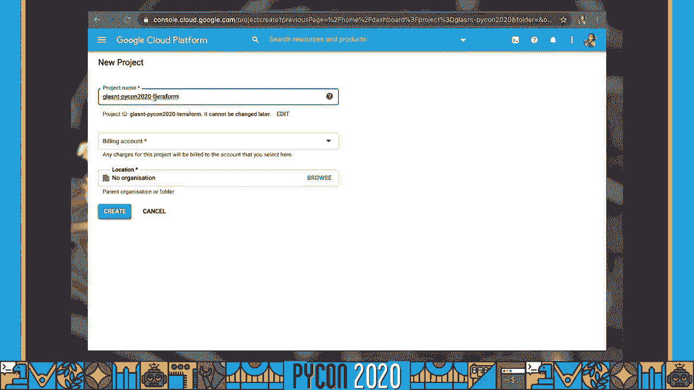

我也会把它连接到我们的账单账户上，一旦我们的计划完成，我可以在本地设置我的项目，成为这个新项目。我还可以确保我再次设置我的项目标识。从这里开始，我们需要做一些之前做过的步骤，在建立 Terraform 之前。我们需要为 Terraform 创建一个新的服务账户，我们叫它“地球”。我们还将约束，允许我们以所有者的角色运行我们的服务账户，这将允许 Terraform 有相同的权限，当我们运行 G 云时，我们还要确保 Terraform 知道如何访问这个服务账户。为此，我们要为服务账户创建一个本地密钥，并保存钥匙的副本，从本地存储在我们的申请凭据中，Terraform 会知道该派谁去，因为我在一个新项目中。我需要重现我之前的映像，Terraform 无法为我们创建新的容器映像，这超出了基础设施即代码的工作范围，我要建立我的映像，这需要一些时间来完成，现在我的映像存在。

我可以部署在 Terraform 上，我需要进入 Terraform 的目录，然后初始化 Terraform。Terraform 的初始化将初始化我的模块，从上游下载提供者插件，谷歌秘密测试模块和谷歌模块的其余部分。我们的应用程序一旦 Terraform 被初始化，我们现在可以使用我们的 Terraform 清单，我们将运行一个类似于我们之前在所有云构建运行中所做的命令，我们将选择指定服务的区域。我们特意在这里选了一个新的 Unicode Dex，所以我们可以看到网址会有所不同，当我们部署时。我们还需要指定实例名称，我们称它为新的 psql，只是为了确保我们看到它是不同的，我们的项目是。Terraform 现在将接受替换变量，找出需要做些什么来改变我们的项目，因为我们的项目里什么都没有，但一切都将是新的创造，一旦我们确定一切准备就绪，我们进去让它离开，Terraform。

现在要想出最快的方法来部署我们所有不同的方面，我们专门将其配置为具有依赖关系，例如，没有数据库就不能创建数据库用户，并且实例已经创建，这需要几分钟才能完成。它需要完成之前手动完成的所有步骤。我尽力确保我们的供应复杂性不会导致这样的问题，有时 Terraform 会失败，你得到的错误可能与此不匹配，但 Terraform 的伟大之处在于，我们可以再试一次，希望未决的分歧会有所不同。之前我们必须创建的 40 多个资源，现在我们只有 7 个，太棒了，我们再重复一次，这又需要几分钟才能完成，现在 Terraform 已经成功完成，我们可以看到接下来要做什么，我们的服务已经部署完毕。但 Terraform 不能运行云构建任务，它不能创建我们的映像，也不能运行我们的迁移。谢天谢地，我输出了你要运行的命令，要完成此迁移，然后我们就可以登录到管理员，当它完成的时候。

以下是获取用户名和密码的方法，所以我要复制粘贴，然后运行我的数据库迁移，这还需要一些时间来完成，现在我们的数据库迁移已经完成。

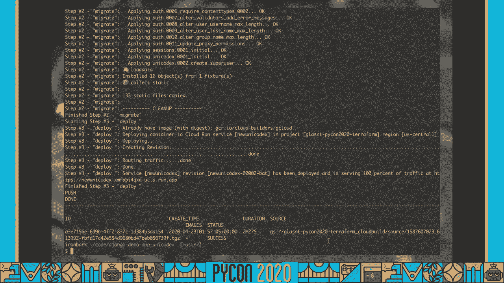

我们的服务现在可以使用了，我们可以去部署网址，我们可以看到我们在新的 Unicodex，在一个与以前不同的散列中，但我们仍然有我们当地的变化。

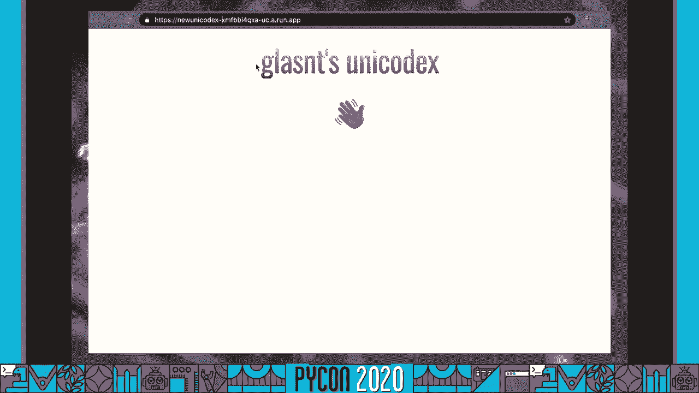

这是因为我们部署在主分支中。

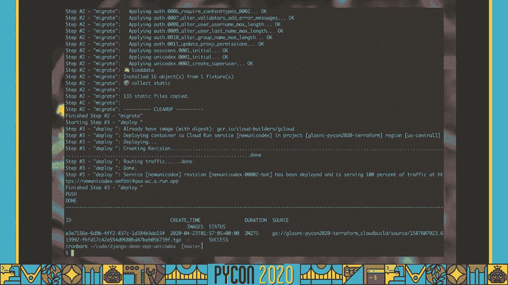

我们已经完成的代码更改，但我们可以看出这是不同的，因为我们没有任何媒体资产，这是一个新的部署，使用了最少的手动交互的 Terraform，通过使用基础设施作为代码，在谷歌云上提供和部署我们的应用程序。本教程到此结束，但你得自己清理一下，此刻，我们的教程没有任何预期的费用，但是因为我们有一个 SQL 实例，我们会有持续的成本，如果我们继续这样下去，我们能做的是，我们可以删除我们的项目。如果我们完全确定我们完成了，在页面顶部，单击项目选择屏幕并单击“管理项目”按钮，那么对于你想要的项目，单击操作并删除，这将关闭我们的项目，它，停止所有的收费和交通，我就会失去这个项目的权限。三十天后一切都会被删除，确认要删除项目，确保您进入您的项目，表格中的 ID，我的项目现在已经被关闭了，三十天后就会被删除，确保对 Terraform 实例和原始实例都这样做，谢谢你今天加入我的教程。

如果你有任何反馈，或者想问我任何问题，我可以在 twitter 和 github 上使用，就像在格拉斯哥一样。

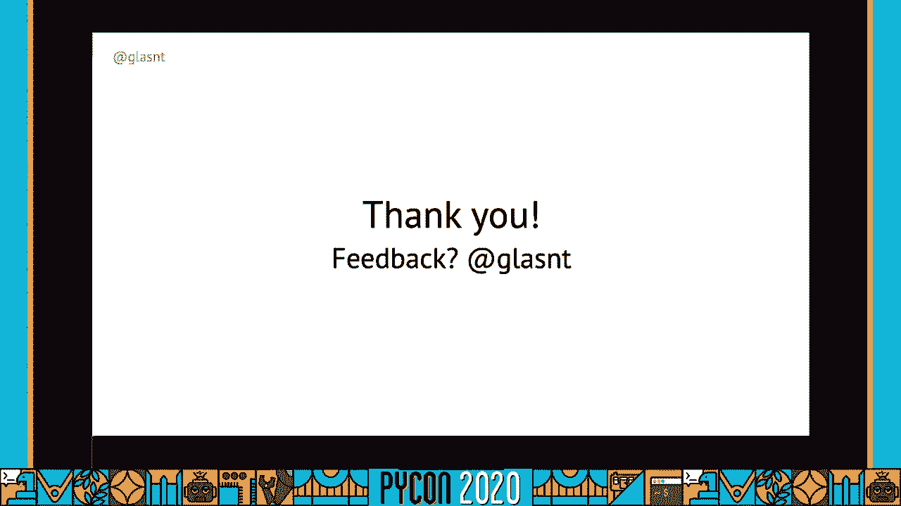

