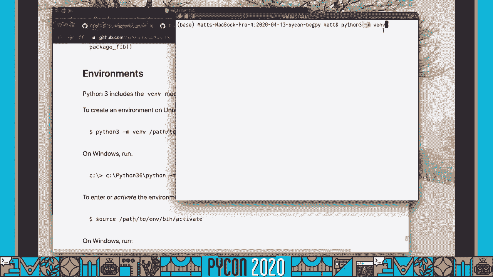
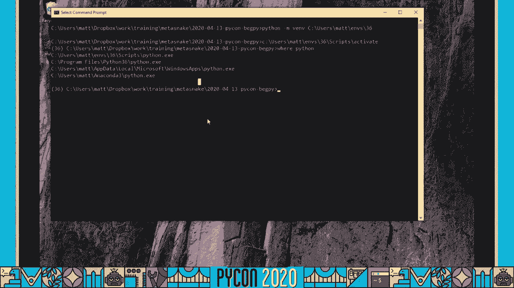
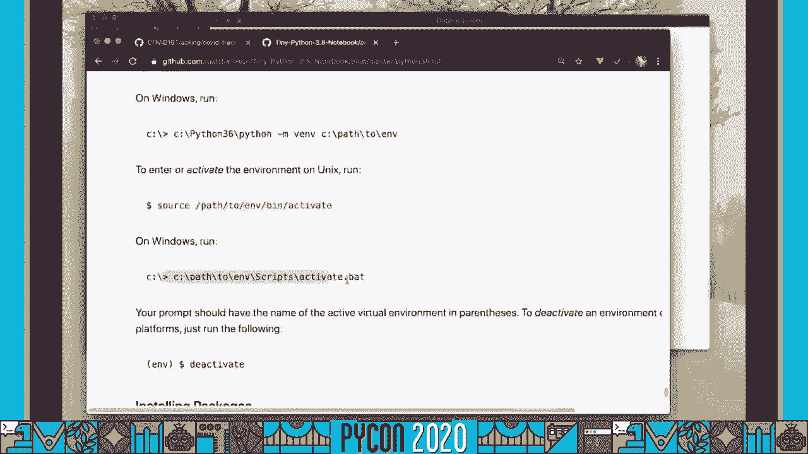
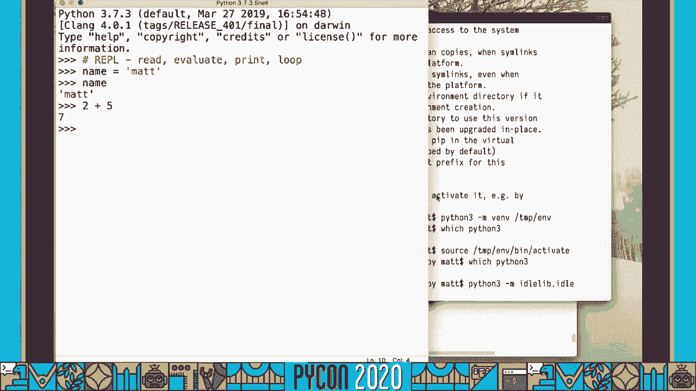
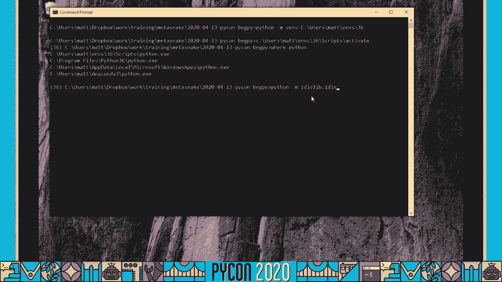
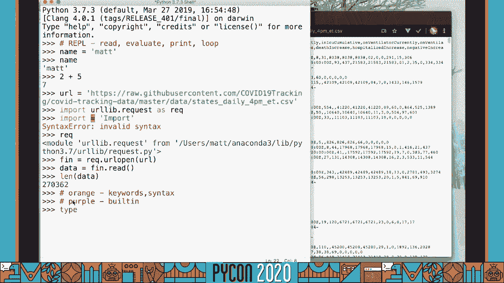

# 动手Python：P84：制作COVID-19图表 📊


在本节课中，我们将学习如何使用Python从GitHub下载COVID-19数据，解析CSV文件，筛选特定州的数据，并利用Matplotlib库绘制图表。这是一个高度互动的实践教程，我们将从命令行开始，逐步编写代码，并学习调试、测试和创建命令行工具。


## 概述


我们将通过一个实际项目来学习Python编程。项目目标是下载美国各州的COVID-19历史数据，筛选出特定州（如犹他州）的信息，并绘制阳性病例、住院人数等指标随时间变化的图表。在这个过程中，我们将涵盖Python环境设置、基本数据结构、函数定义、错误处理、代码测试以及创建命令行界面。


---


## 环境准备与命令行基础 💻

在开始编写代码之前，我们需要准备好Python环境，并熟悉命令行操作。这是高效使用Python和各种开发工具的基础。


### 检查Python安装

首先，确保你的系统已安装Python 3。打开终端（Mac/Linux）或命令提示符（Windows），输入以下命令进行检查：


*   **Mac/Linux:** `python3 --version`
*   **Windows:** `python --version`



如果命令返回了Python 3.x的版本号，说明安装成功。如果提示“命令未找到”，你需要从[python.org](https://www.python.org/)下载并安装Python。

**对于Windows用户的特别提示：**
在安装Python时，请务必勾选“**Add Python to PATH**”选项。如果没有勾选，你将无法从命令行直接运行`python`命令。解决方法是运行安装程序并选择“修复”选项，在过程中勾选该选项。

### 为什么使用命令行？


许多Python工具（如包管理器`pip`、测试运行器、代码覆盖工具等）都通过命令行运行。掌握命令行操作能让你更深入地理解工具的工作原理，并更高效地进行开发。





### 创建虚拟环境


虚拟环境可以将项目的依赖包隔离开来，避免不同项目之间的包版本冲突。以下是创建和激活虚拟环境的方法。



**在Mac/Linux上：**
```bash
# 创建名为‘env‘的虚拟环境
python3 -m venv env
# 激活虚拟环境
source env/bin/activate
```



**在Windows上：**
```bash
# 创建名为‘env‘的虚拟环境
python -m venv env
# 激活虚拟环境
env\Scripts\activate
```
激活后，你的命令行提示符通常会显示环境名称（如`(env)`）。现在，所有通过`pip`安装的包都将只存在于这个环境中。

### 启动IDLE编辑器

我们将使用Python自带的IDLE编辑器，因为它集成了REPL（交互式解释器），便于快速测试代码片段。请从**已激活的虚拟环境**中启动IDLE，以确保能访问环境中安装的第三方库。

*   **Mac/Linux:** `python3 -m idlelib.idle`
*   **Windows:** `python -m idlelib.idle`

IDLE启动后，你会看到一个带有`>>>`提示符的窗口，这就是REPL。你可以在这里输入单行代码并立即看到结果。



---


## 获取与处理数据 📥

上一节我们准备好了环境，本节中我们来看看如何获取数据并进行初步处理。我们将从一个公开的GitHub仓库下载CSV格式的COVID-19数据。

### 下载数据文件

我们将使用Python标准库中的`urllib.request`模块来下载数据。在IDLE的REPL中，输入以下代码：

```python
import urllib.request as req

# 数据文件的URL
url = ‘https://raw.githubusercontent.com/nytimes/covid-19-data/master/us-states.csv‘

# 打开URL并读取数据
with req.urlopen(url) as f:
    data = f.read()

print(f‘下载的数据大小：{len(data)} 字节‘)
```
这段代码会将远程CSV文件的内容以二进制形式下载到变量`data`中。

### 将数据保存到本地文件

为了方便后续处理，我们将下载的二进制数据保存到本地的一个CSV文件中。这里我们使用`with`语句来管理文件，它可以确保文件在使用后被正确关闭。

```python
# 将数据写入本地文件
with open(‘covid.csv‘, ‘wb‘) as f_out:
    f_out.write(data)
print(‘数据已保存到 covid.csv‘)
```

### 重构代码：创建可重用的函数

将直接在REPL中执行的代码重构为函数，可以提高代码的复用性和可读性。我们创建一个`fetch_url`函数。

```python
def fetch_url(url, fname):
    “““
    将一个URL的内容下载并保存到本地文件。
    参数:
        url: 要下载的URL地址
        fname: 要保存的本地文件名
    “““
    import urllib.request as req
    with req.urlopen(url) as f:
        data = f.read()
    with open(fname, ‘wb‘) as f_out:
        f_out.write(data)
    print(f‘已将 {url} 的内容保存到 {fname}‘)
```
在IDLE中，你可以通过**运行 -> 运行模块**来加载这个函数，然后在REPL中调用它：`fetch_url(url, ‘test.csv‘)`。

---

## 解析CSV数据与数据结构 📊

现在我们已经有了本地的CSV文件，本节我们将学习如何读取它，并使用Python的列表和字典这两种核心数据结构来组织和处理数据。

### 读取CSV文件

我们将编写一个`read_csv`函数来读取文件。这里我们手动解析CSV，以深入理解字符串处理和数据结构，而在实际项目中，你可能会使用`csv`模块或`pandas`库。

```python
def read_csv(fname):
    “““
    读取CSV文件，将每一行解析为一个字典。
    字典的键来自CSV文件的第一行（标题行）。
    返回一个字典的列表。
    “““
    with open(fname, encoding=‘utf-8‘) as f:
        rows = []
        for i, line in enumerate(f):
            # 去除行尾的换行符，并按逗号分割
            values = line.strip().split(‘,‘)
            if i == 0:
                # 第一行是标题行
                headers = values
            else:
                # 将标题和值组合成字典
                row_dict = dict(zip(headers, values))
                rows.append(row_dict)
    return rows
```
**代码解释：**
*   `enumerate(f)` 在遍历文件行时同时获取索引`i`和内容`line`。
*   `line.strip().split(‘,‘)` 先去掉换行符，再按逗号分割成列表。
*   `dict(zip(headers, values))` 是Python的一个常用技巧。`zip`将两个列表对应位置元素配对，`dict`将其转换为字典。

### 筛选特定州的数据

数据包含所有州的信息，我们需要筛选出感兴趣的那个州。我们创建一个`filter_rows`函数。

```python
def filter_rows(rows, state):
    “““
    从数据行中筛选出指定州的数据。
    参数:
        rows: 字典的列表，每个字典代表一行数据
        state: 要筛选的州名缩写（如 ‘UT‘）
    返回:
        筛选后的字典列表
    “““
    result = []
    for row in rows:
        if row[‘state‘] == state:
            result.append(row)
    return result
```
在REPL中测试：`utah_data = filter_rows(all_data, ‘UT‘)`，然后查看`len(utah_data)`和`utah_data[0]`来确认。

### 数据转换与清洗

观察数据，你会发现数字（如`‘positive‘`）是以字符串形式存储的。为了后续计算和绘图，我们需要将它们转换为整数。同时，某些字段可能为空字符串，直接转换会出错。

```python
def convert_row_types(row):
    “““
    尝试将字典中代表数字的字符串值转换为整数。
    如果转换失败（例如值为空），则保留原字符串。
    “““
    for key, value in row.items():
        try:
            row[key] = int(value)
        except ValueError:
            # 如果value不是有效的整数格式，则跳过，保留原值
            pass
    return row

# 应用转换到所有数据行
all_data = [convert_row_types(row) for row in all_data]
```
**代码解释：**
*   `try...except ValueError` 是异常处理机制。尝试执行`int(value)`，如果引发`ValueError`异常（例如`value`是`‘AK‘`或空字符串），则执行`except`块内的代码（这里`pass`表示什么也不做）。
*   列表推导式 `[convert_row_types(row) for row in all_data]` 是一种简洁的构建新列表的方式。

---

## 数据排序与提取 📈

处理完数据后，我们需要按日期排序，并提取出需要绘图的特定数据序列（如每日阳性病例数）。

### 按日期排序

数据默认可能是按州排列的，为了按时间序列绘图，我们需要按日期排序。

```python
def sort_by(rows, column_name):
    “““
    根据指定的列名对数据行进行排序。
    参数:
        rows: 字典的列表
        column_name: 作为排序依据的列名（如 ‘date‘）
    返回:
        排序后的新列表
    “““
    def get_key(row):
        return row[column_name]
    return sorted(rows, key=get_key)

# 对犹他州数据按日期排序
utah_data_sorted = sort_by(utah_data, ‘date‘)
```
`sorted`函数的`key`参数接受一个函数，该函数从每个元素中提取用于比较的值。

### 提取数值序列

为了绘图，我们需要从排序后的数据中提取出数值序列（列表）。

```python
def get_values(rows, column_name):
    “““
    从数据行中提取指定列的值，组成一个列表。
    参数:
        rows: 字典的列表
        column_name: 要提取的列名
    返回:
        值列表
    “““
    values = []
    for row in rows:
        values.append(row[column_name])
    return values

# 提取犹他州的阳性病例数和死亡数
positive_cases = get_values(utah_data_sorted, ‘positive‘)
deaths = get_values(utah_data_sorted, ‘deaths‘)
```

---

## 使用Matplotlib绘制图表 🎨

数据准备就绪，本节我们将使用Matplotlib库来创建图表，直观展示数据变化趋势。

### 安装Matplotlib

Matplotlib不是Python标准库的一部分，需要使用`pip`安装。在**已激活虚拟环境的命令行**中运行：
```bash
pip install matplotlib
```

### 绘制简单折线图

回到IDLE，导入Matplotlib并绘制阳性病例数的折线图。

```python
import matplotlib.pyplot as plt

# 创建图形和坐标轴
fig, ax = plt.subplots()
# 绘制阳性病例曲线， ‘b-‘ 表示蓝色实线
ax.plot(positive_cases, ‘b-‘, label=‘Positive Cases‘)
# 添加图例
ax.legend()
# 添加标题和坐标轴标签
ax.set_title(‘COVID-19 Positive Cases in Utah‘)
ax.set_xlabel(‘Day‘)
ax.set_ylabel(‘Number of Cases‘)
# 显示图表
plt.show()
```
运行后，会弹出一个窗口显示图表。你可以尝试在同一张图上叠加绘制死亡人数曲线。

### 创建绘图函数

我们将绘图步骤封装成一个函数，便于为不同州生成图表。

```python
def plot_state(state_abbr, csv_fname, output_fname):
    “““
    为指定州生成COVID-19数据图表并保存。
    参数:
        state_abbr: 州名缩写 (如 ‘UT‘)
        csv_fname: 输入的CSV文件名
        output_fname: 输出的图片文件名 (如 ‘utah_plot.png‘)
    “““
    # 1. 读取并处理数据
    all_data = read_csv(csv_fname)
    all_data = [convert_row_types(row) for row in all_data]
    state_data = filter_rows(all_data, state_abbr)
    state_data_sorted = sort_by(state_data, ‘date‘)

    # 2. 提取需要绘制的数据
    positives = get_values(state_data_sorted, ‘positive‘)
    hospitalized = get_values(state_data_sorted, ‘hospitalized‘)
    deaths = get_values(state_data_sorted, ‘deaths‘)

    # 3. 绘图
    fig, ax = plt.subplots(figsize=(10, 6))
    ax.plot(positives, ‘b-‘, label=‘Positive‘, linewidth=2)
    ax.plot(hospitalized, ‘g--‘, label=‘Hospitalized‘, linewidth=2)
    ax.plot(deaths, ‘r:‘, label=‘Deaths‘, linewidth=2)

    ax.set_title(f‘COVID-19 Trends in {state_abbr}‘)
    ax.set_xlabel(‘Days‘)
    ax.set_ylabel(‘Count‘)
    ax.legend()
    ax.grid(True, linestyle=‘--‘, alpha=0.7)

    # 4. 保存图表
    plt.tight_layout()
    fig.savefig(output_fname)
    print(f‘图表已保存至 {output_fname}‘)
    plt.close(fig) # 关闭图形，释放内存
```
现在，你可以调用 `plot_state(‘NY‘, ‘covid.csv‘, ‘new_york.png‘)` 来为纽约州生成图表。

---

## 代码测试与质量保障 ✅

编写可工作的代码很重要，但编写可测试、健壮的代码更重要。本节我们将为代码添加单元测试，并检查测试的代码覆盖率。

### 编写单元测试

Python标准库提供了`unittest`模块来编写测试。我们创建一个单独的测试文件`test_covid.py`。

```python
import unittest
import covid # 导入我们编写的主模块

class TestCovid(unittest.TestCase):
    “““测试covid模块中的函数。“““

    def test_read_csv(self):
        “““测试CSV文件读取功能。“““
        result = covid.read_csv(‘covid.csv‘)
        # 断言结果不为空，并且长度大于0
        self.assertIsInstance(result, list)
        self.assertGreater(len(result), 0)
        # 断言第一行包含预期的键
        first_row = result[0]
        self.assertIn(‘date‘, first_row)
        self.assertIn(‘state‘, first_row)

    def test_filter_rows(self):
        “““测试数据筛选功能。“““
        sample_data = [
            {‘state‘: ‘UT‘, ‘cases‘: 100},
            {‘state‘: ‘NY‘, ‘cases‘: 200},
            {‘state‘: ‘UT‘, ‘cases‘: 150}
        ]
        filtered = covid.filter_rows(sample_data, ‘UT‘)
        self.assertEqual(len(filtered), 2)
        for row in filtered:
            self.assertEqual(row[‘state‘], ‘UT‘)

    def test_get_values(self):
        “““测试数据提取功能。“““
        sample_data = [
            {‘state‘: ‘UT‘, ‘cases‘: 100},
            {‘state‘: ‘UT‘, ‘cases‘: 150}
        ]
        values = covid.get_values(sample_data, ‘cases‘)
        self.assertEqual(values, [100, 150])

if __name__ == ‘__main__‘:
    unittest.main()
```
在命令行运行测试：`python -m unittest test_covid.py`。如果所有测试通过，你会看到`OK`。

### 检查代码覆盖率

代码覆盖率工具可以告诉我们测试执行了源代码的哪些部分。我们使用`coverage`库。

1.  **安装：** `pip install coverage`
2.  **运行测试并收集覆盖率数据：** `coverage run -m unittest test_covid.py`
3.  **生成文本报告：** `coverage report`
4.  **生成更详细的HTML报告：** `coverage html`

打开生成的`htmlcov/index.html`文件，你可以直观地看到哪些代码行被测试覆盖了（绿色），哪些没有（红色）。这有助于你发现未被测试的代码分支。

---

## 创建命令行界面 🖥️

最后，我们将为程序添加一个命令行界面，这样用户可以直接通过终端命令来生成图表，而无需进入Python交互环境。

### 使用argparse解析参数

Python的`argparse`模块可以轻松地解析命令行参数。我们在主脚本`covid.py`底部添加以下代码：

```python
import argparse
import sys

def main(cli_args):
    “““命令行主函数。“““
    parser = argparse.ArgumentParser(description=‘生成指定州的COVID-19数据图表。‘)
    parser.add_argument(‘-s‘, ‘--state‘, required=True,
                        help=‘州名缩写，例如 UT, NY, CA‘)
    parser.add_argument(‘-c‘, ‘--csv‘, default=‘covid.csv‘,
                        help=‘输入的CSV数据文件路径 (默认: covid.csv)‘)
    parser.add_argument(‘-o‘, ‘--output‘, required=True,
                        help=‘输出的图表文件名 (例如 utah_plot.png)‘)

    args = parser.parse_args(cli_args)

    # 调用绘图函数
    plot_state(args.state, args.csv, args.output)

if __name__ == ‘__main__‘:
    # sys.argv[1:] 去掉了脚本名本身
    main(sys.argv[1:])
```

### 通过命令行使用程序

现在，你可以在命令行中像使用其他工具一样使用你的程序了：

```bash
# 查看帮助
python covid.py -h

# 为犹他州生成图表
python covid.py -s UT -c covid.csv -o utah_trends.png

# 为加利福尼亚州生成图表
python covid.py --state CA --csv covid.csv --output california.png
```

---

## 总结 🎉

在本节课中，我们一起完成了一个完整的Python小项目：**制作COVID-19数据图表**。我们从头开始，学习了：

1.  **环境搭建**：使用虚拟环境隔离项目依赖，从命令行操作Python。
2.  **数据处理**：下载网络数据，读取并解析CSV文件，使用**列表**和**字典**组织数据，进行筛选、排序和转换。
3.  **数据可视化**：安装并使用第三方库`Matplotlib`绘制折线图。
4.  **代码质量**：编写**单元测试**来验证函数逻辑，使用`coverage`工具检查**测试覆盖率**。
5.  **产品化**：利用`argparse`库为脚本创建友好的**命令行界面**。


这个项目涵盖了Python编程的多个核心概念和实用技能。记住，学习编程的最佳方式就是动手实践。尝试修改代码，绘制其他州的数据，或者添加新的功能（比如计算7日平均线）。祝你学习愉快！