# Python 2 迁移到 3：P85：教程概述 🐍


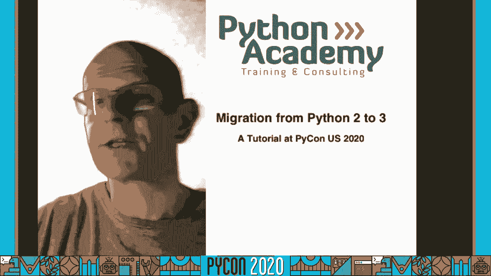

在本教程中，我们将学习如何将代码从 Python 2 迁移到 Python 3。我们将首先了解两个版本之间的主要差异，然后学习如何清理和现代化 Python 2 代码，最后探讨不同的迁移策略和自动化工具。本教程旨在让初学者能够理解并实践迁移过程。

---

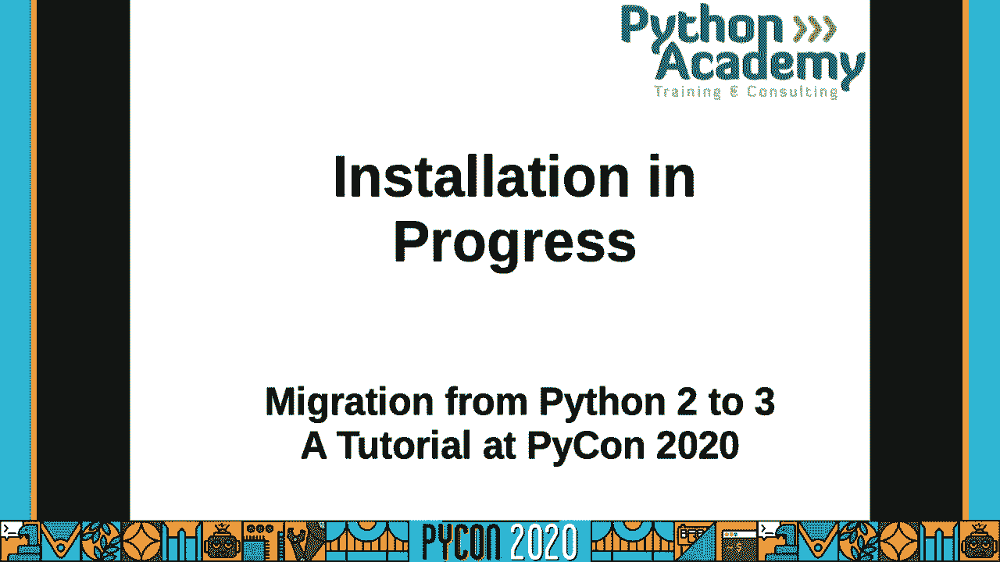

## Python 2 迁移到 3：1：环境设置与工具介绍 🔧

为了学习迁移，我们需要一个同时包含 Python 2 和 Python 3 的开发环境。我们将使用 Conda 来创建两个独立的环境，并使用 Jupyter Lab 作为我们的实验工具。

### 创建 Python 环境

以下是使用 Conda 创建环境的步骤。如果你已经设置好环境，可以跳过此部分。

1.  **创建 Python 2.7 环境**：
    ```bash
    conda create -n py27 python=2.7
    ```

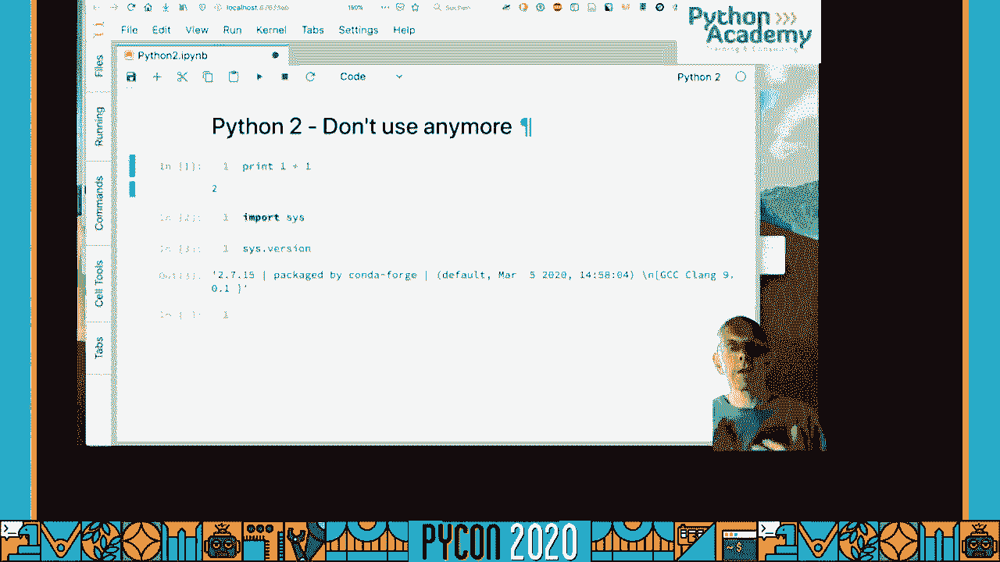

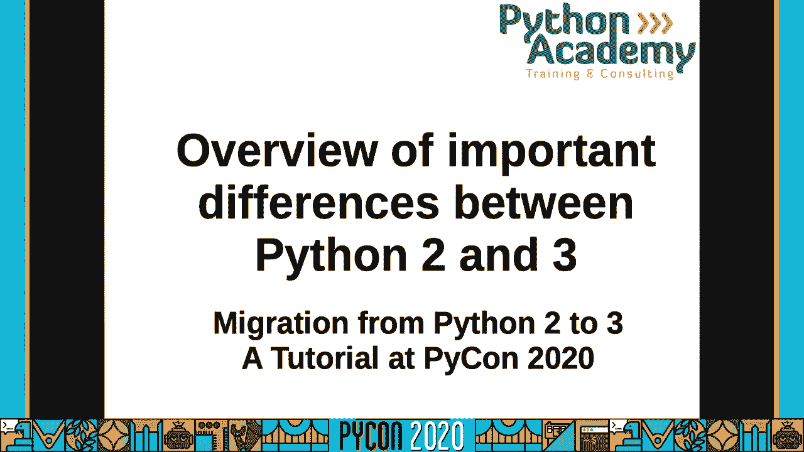

2.  **创建 Python 3.8 环境**：
    ```bash
    conda create -n py38 python=3.8
    ```

3.  **激活环境并安装 Jupyter Lab**：
    分别激活两个环境并安装 Jupyter Lab，以便进行交互式编程。
    ```bash
    conda activate py27
    conda install jupyterlab
    ```
    ```bash
    conda activate py38
    conda install jupyterlab
    ```

### 启动 Jupyter Lab

在激活的环境下，启动 Jupyter Lab 并指定端口（例如 8888 和 8889）以避免冲突。

```bash
jupyter lab --port 8888
```

在浏览器中打开 Jupyter Lab 后，你可以创建新的 Notebook，并选择对应的 Python 内核（2.7 或 3.8）进行编码。

---

## Python 2 迁移到 3：2：Python 2 与 Python 3 的核心差异 🔄

上一节我们设置了开发环境，本节中我们来看看 Python 2 和 Python 3 之间有哪些最重要的区别。理解这些差异是成功迁移的基础。

### 1. `print` 函数

在 Python 2 中，`print` 是一个语句；而在 Python 3 中，它是一个函数。

*   **Python 2**:
    ```python
    print "Hello World"
    ```
*   **Python 3**:
    ```python
    print("Hello World")
    ```
    为了使 Python 2 代码兼容，可以在文件顶部添加：
    ```python
    from __future__ import print_function
    ```

### 2. 整数除法

Python 2 中的整数除法会进行地板除，而 Python 3 会得到浮点数结果。

*   **Python 2**:
    ```python
    1 / 2  # 结果是 0
    ```
*   **Python 3**:
    ```python
    1 / 2  # 结果是 0.5
    1 // 2 # 地板除，结果是 0
    ```
    在 Python 2 中可以使用 `from __future__ import division` 来启用 Python 3 的除法行为。

### 3. Unicode 字符串

字符串处理是最大的变化之一。Python 3 默认使用 Unicode 字符串。

*   **Python 2**:
    ```python
    type('hello')      # <type 'str'> (字节字符串)
    type(u'hello')     # <type 'unicode'>
    ```
*   **Python 3**:
    ```python
    type('hello')      # <class 'str'> (Unicode 字符串)
    type(b'hello')     # <class 'bytes'>
    ```
    在 Python 2 中，可以使用 `from __future__ import unicode_literals` 使所有字符串字面量变为 Unicode。

### 4. `range` 与 `xrange`

在 Python 2 中，`range()` 返回列表，`xrange()` 返回迭代器。在 Python 3 中，`range()` 的行为类似于 Python 2 的 `xrange()`。

*   **Python 2**:
    ```python
    range(5)   # 返回列表 [0, 1, 2, 3, 4]
    xrange(5)  # 返回 xrange 对象（迭代器）
    ```
*   **Python 3**:
    ```python
    range(5)   # 返回 range 对象（迭代器）
    list(range(5)) # 转换为列表 [0, 1, 2, 3, 4]
    ```

### 5. 字典视图

字典的 `.keys()`, `.values()`, `.items()` 方法在 Python 3 中返回“视图”，而不是列表。

*   **Python 2**:
    ```python
    d = {'a': 1}
    keys = d.keys() # 返回列表 ['a']
    ```
*   **Python 3**:
    ```python
    d = {'a': 1}
    keys = d.keys() # 返回 dict_keys(['a']) 视图
    ```

### 6. 异常处理

捕获异常并访问异常实例的语法发生了变化。

*   **Python 2**:
    ```python
    try:
        1 / 0
    except ZeroDivisionError, e:
        print e
    ```
*   **Python 3**:
    ```python
    try:
        1 / 0
    except ZeroDivisionError as e:
        print(e)
    ```

### 7. 迭代器与生成器

许多内置函数在 Python 3 中返回迭代器以提高效率。

*   **Python 2**:
    ```python
    map(str, [1, 2]) # 返回列表 ['1', '2']
    zip([1,2], [3,4]) # 返回列表 [(1, 3), (2, 4)]
    ```
*   **Python 3**:
    ```python
    map(str, [1, 2]) # 返回 map 对象（迭代器）
    zip([1,2], [3,4]) # 返回 zip 对象（迭代器）
    ```

---

## Python 2 迁移到 3：3：清理和现代化 Python 2 代码 🧹

了解了核心差异后，本节我们来看看如何在不破坏 Python 2 兼容性的前提下，将旧代码现代化，为迁移到 Python 3 做好准备。

以下是一些让 Python 2 代码更现代、更接近 Python 3 风格的最佳实践：

### 停止使用过时的特性

1.  **使用新式类**：始终从 `object` 继承。
    ```python
    # 旧式类 (不要用)
    class OldClass:
        pass
    # 新式类
    class NewClass(object):
        pass
    ```

2.  **使用 `as` 语法捕获异常**：
    ```python
    # 旧语法 (不要用)
    try:
        ...
    except ValueError, e:
        ...
    # 新语法
    try:
        ...
    except ValueError as e:
        ...
    ```

3.  **使用 `//` 进行显式地板除**：
    ```python
    # 更明确
    result = 7 // 2
    ```

4.  **使用 `next()` 函数**：而不是迭代器的 `.next()` 方法。
    ```python
    it = iter([1, 2])
    # 旧方法
    value = it.next()
    # 新方法
    value = next(it)
    ```

### 使用 `__future__` 导入

`__future__` 模块允许你在当前版本中使用未来版本的功能。

*   **`print_function`**：使 `print` 成为函数。
*   **`division`**：启用 Python 3 的除法规则。
*   **`unicode_literals`**：使字符串字面量默认为 Unicode。
*   **`absolute_import`**：启用绝对导入，避免与本地模块命名冲突。

在文件顶部添加这些导入：
```python
from __future__ import print_function, division, unicode_literals, absolute_import
```

### 处理文本和二进制数据

明确区分文本（`str`/`unicode`）和二进制数据（`bytes`）。

*   使用 `io.open()` 替代内置的 `open()`，因为它能更好地处理编码。
*   在需要字节的地方显式使用 `b` 前缀，在需要文本的地方使用 `u` 前缀（在 Python 2 中）。

---

## Python 2 迁移到 3：4：迁移策略与自动化工具 🛠️

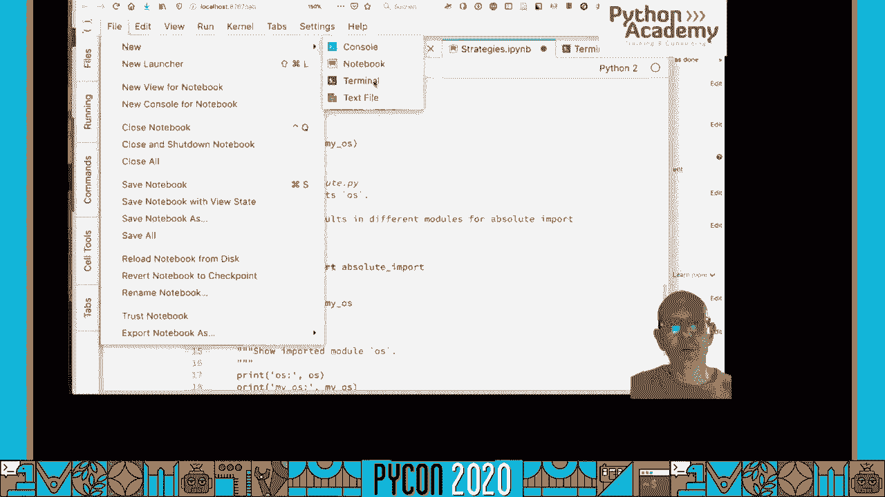

现在我们已经准备好了更现代的 Python 2 代码，本节我们来探讨将代码库迁移到 Python 3 的不同策略和自动化工具。

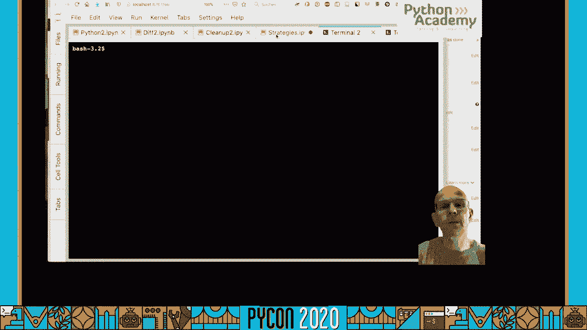

### 主要迁移策略

1.  **单代码库，双版本兼容**：维护一份同时能在 Python 2 和 Python 3 上运行的代码。这通常需要借助兼容层库。
2.  **并行分支**：为 Python 2 和 Python 3 维护两个独立的代码分支。长期维护成本高。
3.  **一次性迁移**：将整个项目直接升级到 Python 3，放弃对 Python 2 的支持。对于新项目或小项目是可行的。

### 兼容层库

对于策略1，有两个主流的库可以帮助我们：

*   **`six`**：一个轻量级的库，提供了简单的函数来包装版本差异。你需要修改代码，使用 `six` 提供的函数（如 `six.text_type`, `six.moves`）。
*   **`future`**：一个更强大的工具，它不仅提供了类似 `six` 的兼容层，还附带了 `futurize` 和 `pasteurize` 这样的自动化代码转换工具。

### 使用 `futurize` 进行自动化迁移

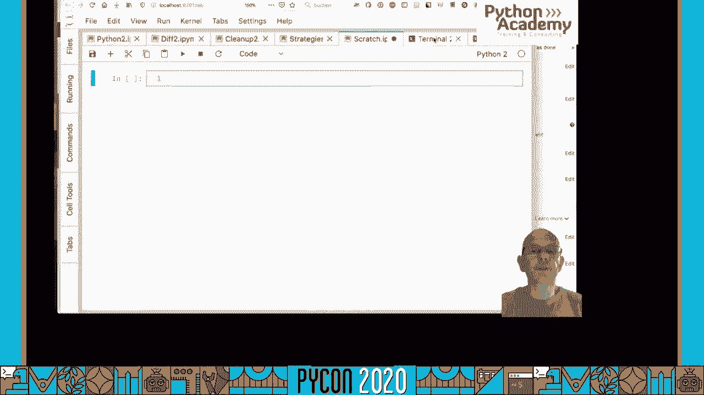

`futurize` 是 `future` 包的一部分，它能自动将 Python 2 代码转换为兼容 Python 2 和 Python 3 的代码。

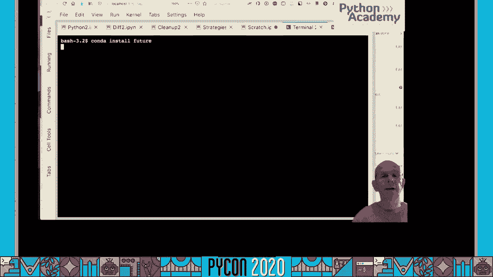

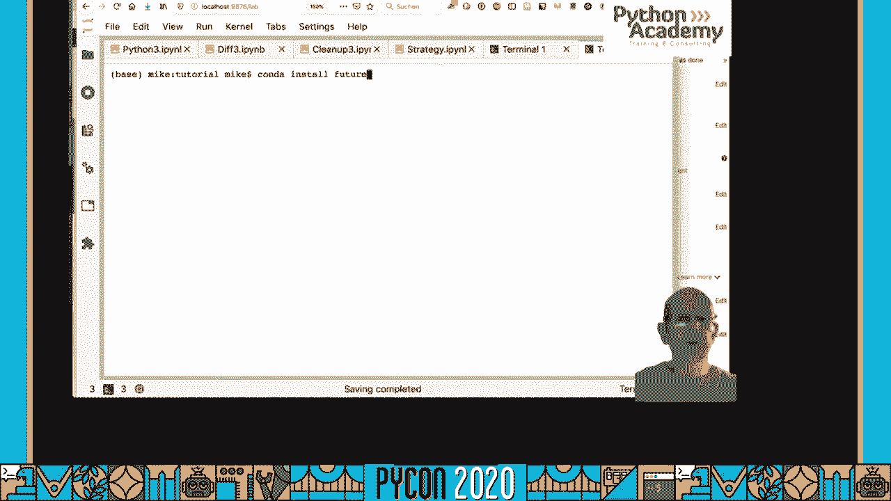

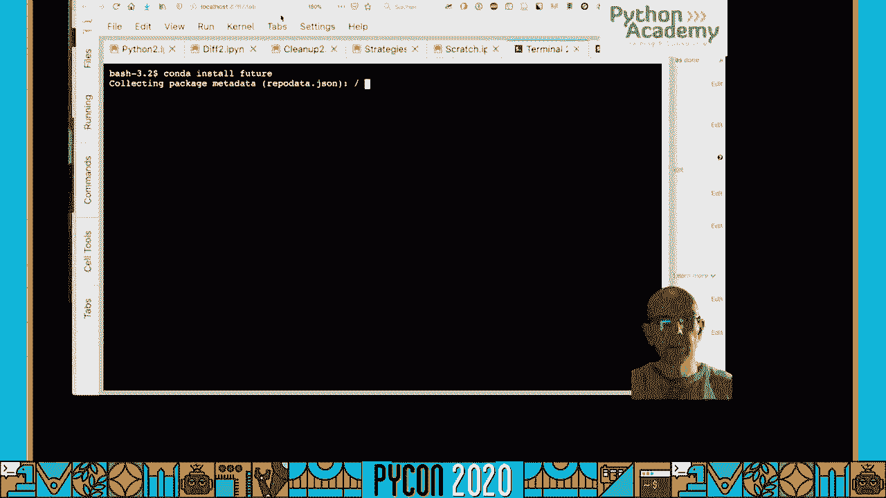

**基本用法**：

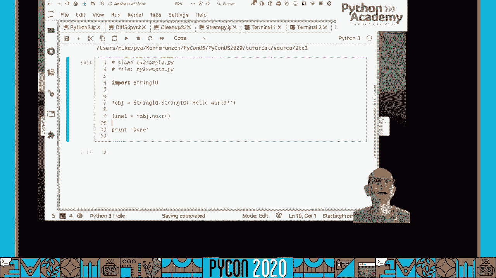

`futurize` 通常分两个阶段运行：

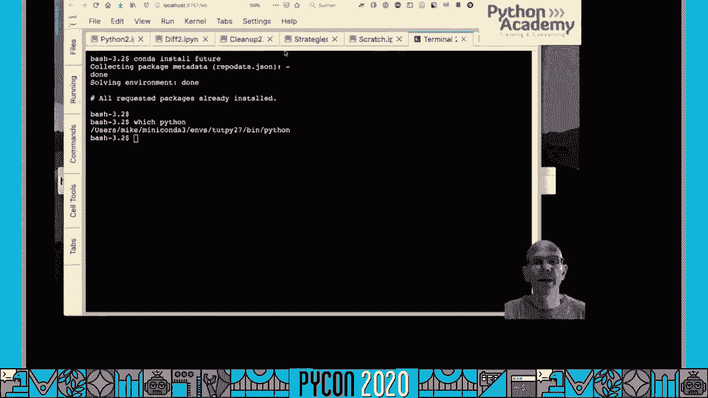

1.  **阶段一**：进行“安全的”更改，使代码更现代化，但仍完全兼容 Python 2。
    ```bash
    futurize --stage1 my_script.py
    ```
    这个阶段会做诸如添加 `__future__` 导入、将 `print` 改为函数、将 `.next()` 改为 `next()` 等操作。

2.  **阶段二**：进行更激进的更改，使代码在 Python 3 中能原生运行，同时通过 `future` 标准库在 Python 2 中保持兼容。
    ```bash
    futurize --stage2 my_script.py
    ```
    这个阶段会处理诸如将 `unicode` 改为 `str`，修改导入语句（如 `import urlparse` 改为 `from future.moves.urllib import parse`）等。

**更安全的方式**是使用 `--write` 或指定输出目录，而不是直接覆盖原文件：
```bash
futurize --stage1 -o stage1_output my_script.py
futurize --stage2 -o stage2_output stage1_output/my_script.py
```

### 使用 `pasteurize` 进行反向兼容

如果你是从 Python 3 开始，但需要支持 Python 2，可以使用 `pasteurize` 工具。
```bash
pasteurize my_py3_script.py
```
它会添加必要的导入和包装，使代码能在 Python 2 上运行。

### 迁移工作流程建议

1.  **确保测试覆盖**：在开始迁移前，确保你有良好的测试套件。迁移过程中要频繁运行测试。
2.  **版本控制**：使用 Git 等工具，在每次重大更改前提交代码。
3.  **逐步迁移**：对于大项目，可以逐个模块或逐个文件进行迁移和测试。
4.  **最终清理**：当项目完全迁移到 Python 3 并放弃 Python 2 支持后，可以移除 `future` 或 `six` 的兼容代码，使用纯 Python 3 语法。

---

## Python 2 迁移到 3：5：总结与后续步骤 🎯

本节课中我们一起学习了从 Python 2 迁移到 Python 3 的完整路径。

我们首先**设置了一个包含 Python 2.7 和 Python 3.8 的双环境**，用于对比和测试。接着，我们深入探讨了**两个版本之间的核心差异**，包括 `print` 函数、整数除法、Unicode 字符串、迭代器行为等关键变化。

然后，我们学习了如何**清理和现代化现有的 Python 2 代码**，例如使用新式类、更新异常语法、利用 `__future__` 导入等，这为迁移打下了良好基础。最后，我们介绍了不同的**迁移策略**，并重点演示了如何使用 `futurize` 等**自动化工具**来辅助迁移过程。

### 核心建议

1.  **不要拖延**：Python 2 已停止支持，迁移越早开始越好。
2.  **测试驱动**：强大的自动化测试是迁移成功的保障。
3.  **利用工具**：像 `futurize` 这样的工具可以处理大量机械性工作，但理解其背后的原理至关重要。
4.  **逐个击破**：对于大型项目，采用增量式迁移策略。


迁移完成后，你将能享受到 Python 3 带来的更多现代特性、性能改进和持续的社区支持。祝你迁移顺利！