# P86：教程 Santiago Basulto - Python 并发从入门到精通 - 程序员百科书 - BV1rW4y1v7YG

欢迎来到我们的 Python 并发教程。

我的名字是 Santiago，尽管我喜欢和你们在同一个房间里分享这个教程，在匹兹堡的同一个房间里很棒，但以这种方式尝试也很不错。所以我很高兴我们可以这样做。我已将这个教程从常规版本进行了调整，原版本中有很多中途停顿以检查练习。

关于这个在线版本。我们将练习分成第二部分，所以我们将在这次录音中完成所有课程，然后你将有时间查看作业和项目。正如我告诉你的，我的名字是 Santiago，来自阿根廷。我为 remotor.com 工作。实际上，我是 remotor 的联合创始人。

几年前，我们被 I&E 收购。我们提供课程，因此我们习惯录制课程等。我们开设在线课程，数据科学课程，网络课程，云计算课程，欢迎访问 I&E.com。现在我在个人时间里正在开发这个库，即 Parlil。目标是提供。

高级的并发代码接口，更高层次的并发和 futures，这是我们将在这个教程中看到的库，当然。所以让我们直接深入本教程的内容。在第一部分，我们将更深入地理解计算机如何工作。

架构，我们计算机中每个部分的角色，以及操作系统的角色。然后我们将直接进入编码，学习多线程、多处理，我们将看到线程同步，处理死锁问题，以及多处理并发和 futures。

最后要介绍的是 Parlil，这是我正在开发的库。但是，首先理解我们为什么需要并发以及我们需要编写什么并发程序很重要。让我先告诉你这个教程不涉及的内容，好吗？因为设定期望对我来说很重要，你知道我们要讨论什么。

还有哪些内容不在这个范围之内。首先，我们不讨论 Cinco 或其他这些替代库。这是一个不同的模型。Cinco 也可以用于创建并发代码，但这不是这两个教程的主题。我们将进行更经典的多线程和多处理，就是这样。

再次，Cinco 是我们在本教程中所做的一切的潜在替代品，但不在本教程的范围内。我们不会进行低级编程、线程编程。尽管我提到了一些像 fork 进程或 fork 进程生成进程的东西，但我们不会进行低级编程。这是多线程、多程序。

多处理并不是分布式架构的替代品，好的。因此，如果你有一个网站，例如，每当你收到请求时，你需要并发地做几件事情，通常将其放在任务队列中是更好的选择，典型的任务队列。你知道，你可以使用 RabbitMQ 或像 SQS 这样的提供服务。如果你使用 Django，可以查看。

Celery，但这不是重点，你不应该混淆这一点。了解你的需求以及解决该问题的正确工具是很重要的。这与管道集群或分布式计算无关。这更适合像 Dask 或 Spark 这样的东西，你可以让多台计算机并行处理某些内容，好的。

这并不是。这只是一个计算机，多线程、多处理。即使在同一台计算机上，你也可以进行 GPU 并行处理。这也不是重点。你可以在 rapids.io 查看，这是一种非常有趣的库，基于 CUDA，这是 NVIDIA 的，但它有一个 Python API 来处理数据框。

它们为每个重要的数据科学库提供了一个同义词，比如画家。他们有数据框，scikit-learn。他们有 Q&ML。所以这很有趣，但这也不是重点。了解你所处的位置是很有趣的。有一个非常有趣的模型，非常简单，你可以执行需要完成的任务。

或者可以在单个线程的单个核心中执行，单进程代码，只需任何脚本。你拥有的 95%的任务可能都属于这一核心类别。这很好。接下来向前迈出一步。是两到八个核心。我们可以说今天是两到 16、32 个核心，适合你电脑的东西。你有这个密集的任务。

但你可以让你的电脑运行。它需要 30 分钟、一个小时、两个小时，然后完成。并且可以在你自己的电脑上完成。所以这是第二步。接下来，你有另外一步。当你拥有超过这个 CPU 阈值时，在这种情况下，它说九个以上可以是 16 个以上、32 个以上，再次，它不适合大型计算机，一个大型商用。

商用电脑。而这时你需要分布式处理。但在这个教程中，我们将专注于第二点，两到 16、两到 32 个核心，任何你可以在自己电脑上做到的。为什么我们需要并发编程？

它的用途是什么？嗯，CPU 和计算的发展理念很有趣。这张图很棒，来源包含在这个光线中。它展示了 CPU 如何随着时间的推移而发展。你会看到，CPU 的频率在这里，它有一个尾巴，对吧？所以在这个数字上几乎是平坦的。

兆赫兹的速度保持不变，没有提升。CPU 并没有变得更快。我们在频率方面已经达到某种最大水平，这有很多原因，包括功耗开销，和它们不适合我们要放置的微小空间。所以我们在这方面达到了某种限制。

但我们尚未达到的限制是核心的数量。因此，逻辑核心的数量，你会看到它在快速增长。在过去 20 年中，它已经从单核机器演变为 100 个核心，比如说，这完全是可能的。当我开始从事与计算相关的工作时，一切都是一个核心。

想到两个核心是疯狂的。双核是一个我们知道存在的疯狂理论概念。没有人拥有。在今天的世界，获得一个具有 64 个逻辑核心的计算机或 CPU 并不是疯狂的，对吧？这是完全可能的。所以我们进入了这个数量级的第二个阶层，并且这可能会持续增加。我不知道限制是什么。某个时候我们会遇到渐近线。

对吧？我们会遇到某种限制，但到目前为止仍在增长。所以目标是，通过并发编程，尽可能利用所有这些核心。好的，我们希望利用所有这些核心。速度并没有提升。我们还是保持相同的速度。因此，我们必须将工作分配到多个核心中，尽可能多的核心。

这是为了工作。这是目标。这就是我们需要并发编程的原因。通常每个人的任务会有所不同。我认为游戏是多核架构的一个很好的例子，其中有多个事情同时发生。你有角色在跑。你有雨在下。敌人发射子弹。

你有多个事情同时发生，对吧？

你可以利用所有这些核心来提供更流畅的体验。让我们从计算机架构开始。这是基础。0.1，基础。让我们回到计算机架构的基础。这是冯·诺依曼架构。这只是非常普通、标准的架构。我们今天的所有计算机都在使用这些架构。

基于 CPU 内存单元的架构。在这种情况下，它是 RAM 和 IO，所有在 IO 之内的内容。这又是我们可以拥有的最简单模型。基本上，我们的代码中给定的操作或指令，通常会落入这几个类别中的每一个。一些操作将是 CPU 密集型的，它们将。

由 CPU 执行的某些操作，其他一些操作会存储在内存中，还有一些操作会连接到 IO。将这些资源的访问时间与之相关联非常重要。例如，访问 CPU 的速度远快于访问内存或 IO。我希望你关注这一点，因为这在后面会非常重要。

示例，这是一个非常有趣的人类相对时间的比较。如果一个 CPU 周期是 1 秒，访问内存（我们知道它很快）需要四分钟。也就是说，内存与 CPU 相比慢了多少。访问你的硬盘，即使是固态硬盘，也要花费 1.5 到四天。这就是它的慢速。

硬盘访问，机械硬盘的访问时间可能需要 1 到 9 个月。访问网络请求可能需要 5 年到 11 年，再次是相对于 CPU 周期的相对时间。所以，这一点很重要。当我们知道代码的哪些部分需要优化时，这将变得非常重要。

同时运行。在这种情况下，如果我们的代码是 IO 密集型，产生大量网络请求，我们会知道何时进行并行化。或者如果我们的代码是 CPU 密集型，进行大量 CPU 计算，也同样如此。这在后面会很重要，信我。现在我们要跳转到操作系统及其角色。

学习操作系统的历史及其演变非常有趣。我个人非常喜欢。我写过几本书，理解人类为了解我们需要操作系统而经历的过程是非常有趣的。但基本上，操作系统就是一个程序。就是有人坐下来编写了一个操作系统。

这是一个程序。但我们随着时间的推移理解到，计算机是非常宝贵的资源，我们不能随意执行随机程序，直接访问 CPU、内存和 IO。对我来说，从互联网下载应用并在我的计算机上运行是非常常见的。但在我的计算机中，我也有很多特权信息。而没有操作系统的话。

让我们设想一下，如果没有操作系统，每个你下载的程序可以随意访问任何资源，这很难让人信任这些程序。所以我们才创造了操作系统。我们在硬件之上创建了一个层次。

我们拥有所有的硬件，就像我们珍贵的资源一样。我们在任何你能想到的随机代码和这些资源之间放置了一层。因此，操作系统是这些资源的守护者。任何你想要执行的操作实际上都是通过操作系统进行的，而操作系统将会有。

对此的控制。你可以写入或读取哪些内存，在哪里可以写入或读取文件，等等。这都是操作系统保护性质的一部分。当然，操作系统还有许多其他用途，比如分页、分页算法以及处理磁盘驱动器等。在我们的这个例子中。

理解操作系统的保护性质是很重要的。为了运行你的代码，操作系统将使用进程的概念。记住。你不能直接执行你的代码。你必须把你的代码交给操作系统，并说，嘿，我想运行这段代码。你能为我做吗？

我？操作系统将把它放入我们所称之为进程的东西中。因此这些是代码。操作系统将把它放在这里这些容器中，这整个进程将包含一系列不同的内容。它将包含你的代码。它将有一个引用。它实际上会将你的代码加载到内存中。

它将有一个引用在那里。它将分配运行或内存。它将说这些进程已分配了多少字节的内存可供使用。它将拥有所有的局部变量、文件脚本，抱歉，所有我们需要访问的内容。因此，例如，当它以 X 等于 1 开始时。

我们增加了它，操作系统在内存中跟踪这一点。我们打开一个文件。我们请求操作系统为我们访问该文件。并且我们有一个最终描述符的引用。因此，操作系统正在创建这个抽象，进程。这样我们的代码就可以通过这种进程交互与系统进行交互。

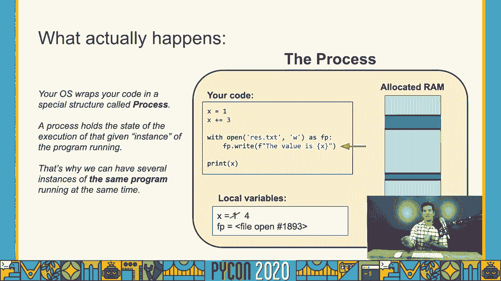

所以每当我们执行代码时，在这种情况下，每当你进行 Python 编程时，你的命令，其实发生的事情是操作系统正在创建一个新的进程。并且它正在注入你所编写的代码，并执行它。因此你实际上可以运行你所编写的同一个程序，即同一个 .pi 文件。

你可以多次执行它，你可以多次执行它。

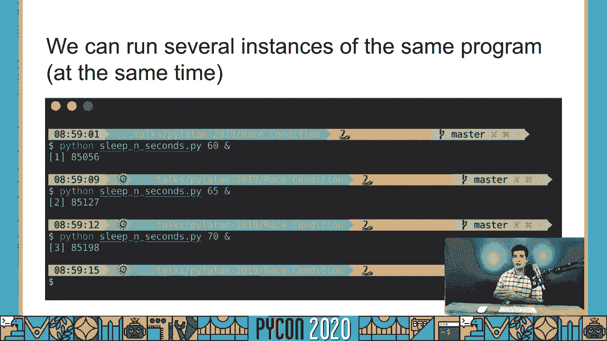

你在同一台计算机上可以同时运行多个进程。这就是我们在这里所看到的。因此，这些是我在重新启动所有这些进程后在计算机上运行的所有进程。再次强调，这些都是这些进程的不同实例。你可以在这里看到进程 ID，这意味着有一个不同的。

每一个进程的实例。它们都在执行相同的代码，但它们都是。

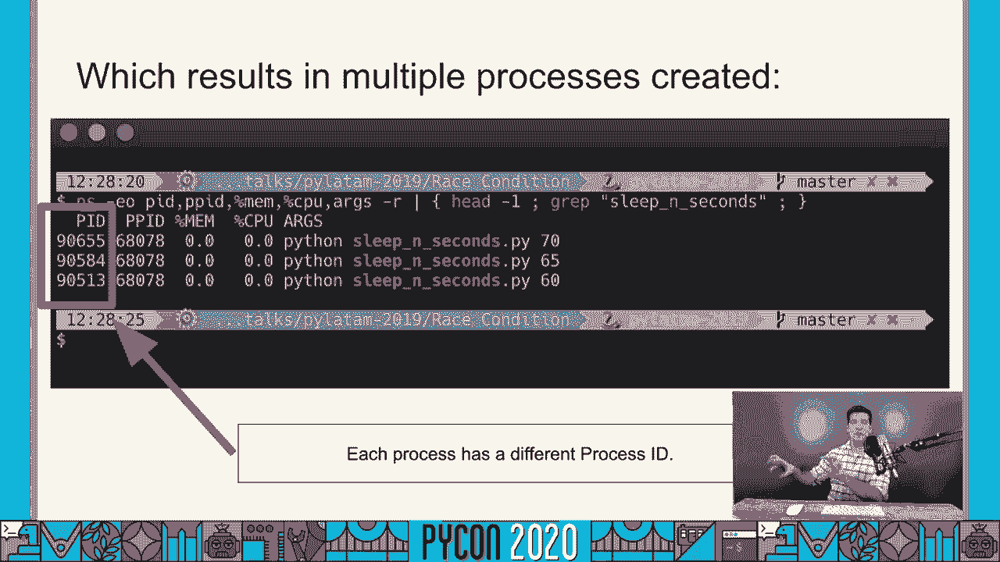

不同的进程。那么进程的并发性又如何呢？这正是学习操作系统历史时非常有趣的部分。开始时，我将展示一些幻灯片，但假设我们只有一个 CPU。我会带你回到过去。我虽然不算老，但我来自一个只有一个 CPU 的时代。假设你计算机里只有一个 CPU。这并不是。

目前的情况就是这样，但假设你的计算机只有一个 CPU。一个 CPU 就是一个工人，只有一个工人。你能在一个 CPU 上同时运行多少个进程？

这是个问题。当然，你只能一次运行一个任务。只有一个工人，你只能运行一个任务。但即使在我小时候，我有一台单核计算机，我依然有。相当流畅的体验。我可以玩，比如第一版的 Doom，尽管我只有一个核心。所以我开枪，我移动，我的敌人死了，我被攻击。

那么，仅有一个 CPU 时，这种体验是如何发生的？

如果 CPU 只能处理一件事情，我开一枪。那么 CPU 是如何跟踪子弹而其他一切都被冻结的？我不能移动，我的敌人也不能移动。这是由于我们将称之为时间切片或操作系统的轮转。所以即使只有一个 CPU，让我们保持这些高级策略在这里。

我们正在使用一台只有一个 CPU 的计算机。即使同时有多个进程在执行，操作系统也会将它们按顺序处理，对吗？

操作系统会给每个进程分配一点 CPU 时间。只有一个 CPU，操作系统会索取 CPU，给它分配时间处理一个进程，然后回收，接着分配时间处理第二个，最后回收，再分配时间处理第三个。因此，它会给你一种同时有多个进程在运行的错觉。

当一切在同一时刻发生时，实际上，所有事情并不是同时发生的。遗憾的是。在我们的游戏示例中，一个简单的射击游戏在一个 CPU、一个核心的时代。基本上，你开一枪，子弹飞行了一段时间。然后 CPU 转移到角色，接着转移到敌人，所有事情都在那。

这是非常非常快速的上下文切换，在这种情况下，它们不是进程，但在进程之间确实有非常快速的上下文切换。这让你感觉事情是在并行运行。这就是并发性与并行性之间的区别。

并发是同时处理多个任务，但并不是字面上的同时。那将是并行，但启动多个任务并管理可能无法同时运行的任务。并行性实际上是指两件事同时运行。在单 CPU 计算机中，你不能有并行性，你只能有并发。

你不能有并行性。这基本上是并行性与并发的区别。这是并行性可能的样子。对，如果我们回到这个幻灯片。在任何两个时刻都没有两个任务同时执行。总是有操作系统，它在切换，主 CPU，非主 CPU。

仅在进程之间使用 CPU 时间。这引入了复杂性，因为操作系统本身也是一个程序。因此，每当操作系统切换一个进程的上下文时，操作系统本身也需要一些时间来运行。这很有趣。

这是一个并行系统。我们有另一个假设。我们现在有两个核心，有两个 CPU，每个 CPU 是这些蓝色线之一。基本上发生的情况是，在这些时刻，我们实际上有了并行性，因为一个核心在处理这个任务，而另一个核心在处理另一个任务。

所以现在这实际上是并行性。你会看到在某些时刻 CPU 是空闲的。这是非常常见的。我觉得这非常常见。所以再一次，我们在这里说的是 CPU。操作系统决定了每个进程何时运行。它完全有权决定哪个 CPU，哪个进程将在给定时间运行。

这非常重要的是来回切换无法运行的进程。操作系统的历史可以看作是神经网络，但操作系统意识到有不同类型的任务。为此创建了多种时间片算法，以理解操作系统何时应授予资源。

对进程的 CPU 访问，何时应该安排进程进入或退出，对吗？拿出来。再放进去。基本上，有一个与正在运行的任务的性质相关的重要认识。记住我们的访问时间，如果一个进程是 CPU 和 I/O 密集型的，你希望在它需要时给它大量的 CPU。因此，每当 CPU 需要时。

每当进程需要运行 I/O 任务时，你希望将该进程分配给 CPU。因为你知道，它不会花很长时间，它只会启动请求。例如。它会说，给这个进程一些时间，它会说，哦，谢谢。我现在需要读取一个文件。就这样。你将 CPU 拿出，把它分配给另一个进程。

然后开始读取文件。这将花费很多时间。我们已经看到过。你现在需要四天来读取文件的一部分，以进行处理。所以不同的进程。根据它们的性质，如果它们是 I/O 密集型或 CPU 密集型，操作系统将以不同的方式对待它们。

这将给他们更多的优先级吗？通常来说，I/O 密集型的进程应该在 CPU 分配中获得更高的优先级。这一点在后面会很重要。那么我们要如何让我们的代码实现并发甚至并行呢？理想情况下？我们谈论的是多个进程。所以我可以告诉你，你知道的。

你有一个问题，你需要处理一个大文件。它有，我不知道，一十亿行。你需要处理这个。当你处理它时，你写你的代码，可能是，逐行处理。等等。所以你会意识到这是一种顺序处理，非常缓慢。而且你知道，你应该让这个程序并发。我现在可以给你一个答案。

只需编写你的程序。在这里，你可以接收一个参数。然后创建。

多个进程，同时实例化多个进程，从第一行处理文件，从零到一亿。我不知道，从一亿行运行程序到两亿行。所以你实例化十次相同的进程，处理不同的部分。然后就完成了。对吧？

这是个好答案。它能完成工作。当然，你希望在程序中并发运行所有内容。你想创建一个可以在多个线程或进程之间分配工作的程序。这就是。

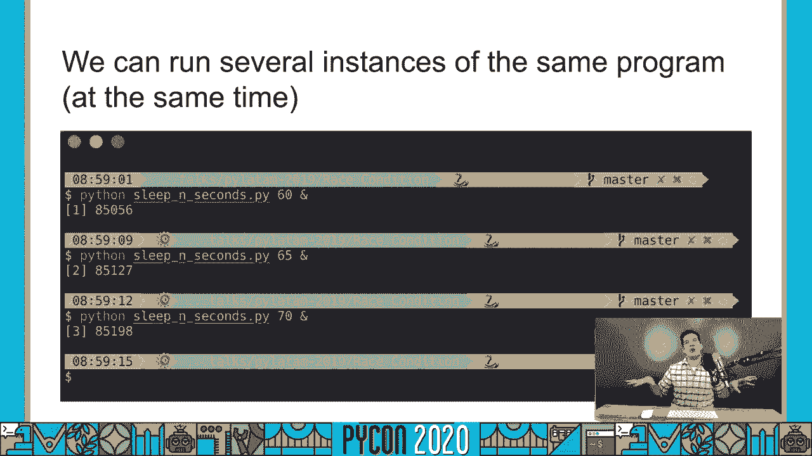

我们想要做的是什么。所以我们可以说程序内部的并发将是与线程一起工作。这就是我们现在要讨论的内容。目标，再次是。将顺序代码转换为潜在的并行代码。让我们看看一个例子。假设我们需要从三个不同的网站提取数据。那么。

网站加载缓慢，每个请求需要两秒。在传统代码中，这些都是传统代码。我们将所有操作都设为顺序执行。获取第一个网站需要两秒，再加上第二个需要两秒，再加上第三个需要两秒。总共至少需要六秒。

如果需要，你可以将它们结合起来。顺序程序至少需要六秒来处理。这是一个视觉表示。第一个网站，第二个网站，第三个网站，在处理结束时。所以你不能。关键是你不会在没有获取到的情况下开始抓取第二个网站。

完成了第一个网站。这是多线程的想法。它将实例化，或者同时启动一切，对吗？因此，希望一切都能并行运行，然后达到一个共同点以同步一切。这是多线程的理念。所以如果我们能做到这一点，能启动多个线程，并让它们都并发或并行运行。

我们将首先等待所有线程完成。这大约需要两秒钟，然后我们可以在最后进行组合。我们的代码将会像这样，看起来理想。这将看起来像这样。它并不是现实，只是伪代码。但我们将会看到线程的阻塞，以便更好地理解它。

我们将使用线程模块。我将先给你一个非常简短的介绍。我们将运行一些代码，它在 Jupyter 笔记本中。我们会进行一个非常简单的介绍，然后深入探讨更重要的部分，线程、同步等。

我希望你记住，我们正在一个内部编程环境中工作。我们在创建自己的代码，程序将使用多个线程。我们希望让它并发。因此，让我们直接跳入我们的代码，开始处理线程。终于是时候查看一些实际的 Python 代码了。

我们已经完成了关于计算机架构、操作系统、进程和线程的整个概念介绍。但现在是时候谈谈真正的代码，创建线程，让它们运行等。因此，这里有几个重要的节点，我们将使用线程类。这是我们将要使用的主要类。

在这几节课中，我们将创建线程，实例化它们，启动它们，让它们运行。我们将分析它们，检查它们的状态等。但一切都将在这个线程类中发生。

这个线程类包含在线程模块中。这是一个非常重要的事情，因为我们在 Python 3 中还有一个下划线线程模块。但这是一个非常底层的模块，不应使用。我们不使用它。我从未使用过。线程模块是使用在下划线线程模块之下的。

它为我们提供了一个更高级的接口，以便我们创建和操作线程。因此，线程类再次是一个主要的类。这是我们将要使用的最重要的类，用于创建和启动线程。当你创建它时，你将传递一个目标。这个目标是将在单独线程中运行的函数。

线程，对吧？所以请记住，当你有主进程时，你的主进程。你将创建一个将独立运行的单独线程。这个线程需要某种可调用的，需要执行某个动作。所以我们将说。我们希望做或运行的动作基于这个目标。所以我们将首先实例化。

线程。基本上将创建这些线程的容器。假设这是线程。我们将传递目标。所以在这种情况下。我们将说目标等于简单工作者。这样它就知道，对吧。它必须运行函数简单工作者。假设。

函数简单工作者解码一个简单的简单工作者在这里定义。然后我们将启动线程。当我们启动线程的那一刻，实际上线程就开始了，并且它在执行任务。它取决于你的目标函数是什么，以及它在做什么。然后，这将表明如果线程完成，会在某个时刻自动结束，或者它运行。

永远，这里很常见的是有一个 while true 的线程。所以基本上。我们希望有一个后台工作者，监控某些状态，只要我们的应用程序存活。在这种情况下，你可能会看到一个 true，我们将永远运行这个线程。它将在后台，它会进行一些计算。

在后台进行一些检查。但这里重要的是我们有整个过程。这些是 Python 进程。我们将创建几个线程，假设说。当我们创建多个线程，实例化它们时，创建实例 T 一，T 二，T 三等于线程目标。我们将传递目标，对吧。

它将指向一个函数，在这种情况下，简单工作者，对吧，那就是目标。线程在这里，它处于闲置状态，还没有开始运行。当我们实际调用启动方法时，它将开始运行。在那一刻，线程将开始它的执行。所以让我们实际编写代码，我将定义简单。

工作者函数，我将实例化线程。记住，什么都没有发生。你可以期待这里发生什么，当我们启动线程时，当我们真正开始。线程时，我们将看到“你好”被打印出来，它将睡眠两秒，我们将看到“你好”被打印出来。所以我将启动线程，我们看到“你好”。

我们将等待，现在你可以看到世界。但这里重要的是我可以。在这些线程运行时，我仍然拥有完全的控制。所以让我把这个设置为。比如说五秒，我将重新定义函数。我将实例化线程。我将在这里进行一个简单的计算，二加二，然后我将启动线程。

我将继续进行我的计算，而线程在后台运行。在这种情况下，它正在休眠，对吧？

但在某个时刻，它返回了，执行了它的最终函数。在这个特定时刻，线程已经死亡，我们说我们要看看是的，alive 方法，线程死了，对吧？它刚刚完成了工作，现在已经停止了。因此，通常的做法是创建多个线程。在这种情况下。

我们这里有所有这些线程，我要在这里加一个分号，这样我们就不会看到任何输出。我启动所有线程，线程开始休眠一段时间。我们实际上在生成一些随机值，休眠这段时间，然后再工作。一切都在后台进行。我在主线程中仍然拥有完全的控制。

线程可以做我想做的任何事情。所以我们再做一次，我可以继续运行这个东西。线程正在输出结果。现在让我们更详细地讨论线程的状态。正如我告诉你，当我们创建线程时，它在那里，可以说是停滞的，它活着吗？不。它还没有活。它在那里准备着，但还没有活。当我启动线程的那一刻。

现在线程是活的，你会看到 alive 方法返回 true。重要的是要记住，当我们启动线程时，主线程仍然完全控制。当你想暂停并等待线程停止或完成时，会发生什么？实际上。

假设你有这些过程，对吧？你在聚合数据或其他什么。你启动了所有这些线程，它们都在处理数据。但你需要暂停，直到它们全部完成。一旦它们都完成了，你就可以处理数据。在这种情况下，你确实希望主线程阻塞。确实如此。

希望主线程等待给定的线程或多个线程全部完成。为此，我们有 join 方法。所以我将再次实例化同一个线程。我要启动它。我将直接调用 join。正如你所看到的，我的主线程现在被暂停。它刚刚停止。我们是。

等待我们启动的线程完成。join 方法会暂停主线程，并等待那个线程或给定的一组线程全部完成。一旦线程完成，多个方法会引发运行时错误。在这种情况下，线程已经停止，或者它实际上已经完成了。

所以它不能再次启动。如果你想再次启动相同的任务，你必须创建一个新的线程实例。我们来谈谈线程身份。这对调试非常有帮助，可以更好地理解你的代码或更好地组织代码。线程身份意味着我们可以为线程设置名称。对吧，在这种情况下，线程的名称是自动设置的。但如果我。

再次给你展示线程名称构造函数，你会看到名称等于。在这种情况下，默认是已知的。因此，线程类，一个线程模块会给它一个随机名称，不是随机的，而是一个顺序名称线程。每个线程将被分配一个唯一标识符。

一个唯一的 ID，我们将在这种情况下称之为身份。所以我会说。在这种情况下，事件参数或属性是已知的。但一旦我启动线程。我们将看到现在它已经设置为一个给定的值。现在线程已经启动。在那时，它有这个 ID，对于我们识别特定线程来说只是数字。

没有两个线程会有相同的 ID，对吧？这是一个重要的事情。当我们启动线程时，可以设置自定义名称。我们实际上可以从主线程中查询该信息，检查在特定情况下线程的名称或 ID。有趣的是，我们还可以检查。

从线程内部获取这些值。所以这里有一个重要的概念性问题。让我再回到我们的绘图板。如果我有这个，记住外面的框是我的 Python 进程。里面的框是将运行给定函数简单工作者的 Python 线程。我们可以创建多个这样的线程，对吧？所以我将定义所有这些线程。假设我们。

有三个线程，它们都指向同一个地方，它们都会执行同一个函数，对吧？我们定义一个函数的方式就是定义这个将在线程中运行的函数，只需定义一个简单的函数，对吧？我说的并没有什么奇怪的，只是基础知识，对吧？

这只是一个普通的 Python 函数。但我想说的是，我们并不是在让这个函数准备好知道它将在哪个线程中运行。同一个函数必须以对所有创建的线程都有用的方式定义。一个，两个，三个，1000 个线程，它们都可以以该函数的形式运行相同的 Python 代码。

我的意思是，如果我们需要使用线程的名称，如果我们需要使用线程的 ID，我们必须使其足够通用，以便在这里运行的每个线程，可能是并行的，对吧？更准确地说，它们都在执行相同的代码，但它们都将有不同的 ID。

这就是我们将通过这两个非常有用的函数，当前线程和获取 dent 来实现的，它们是通用的动态方法，将给你特定的，等我停止这个东西，它们将给你特定的线程本身的值。在这种情况下，将给你整个当前线程。

当前线程的函数，它将给你整个线程，在这个线程中你可以询问名称，如我们在这里做的 t.name。你还可以获取生成的 ID。在这种情况下，获取 ident，它将是我们拥有的那个数字。那么我们实际上使用相同的代码来创建三个不同的线程，三个不同的线程。

每一个都有一个自定义，我们提供，并且我们将启动所有这些。现在我们在等待它们完成。所以，bubbles、blossom、buttercup，他们都完成了。当他们开始时，他们每一个内部都有自己的 ID。到目前为止，我们处理的是非常简单的函数，它们没有接收任何参数。

我们只是从这里开始，他们正在运行。当然，这并不现实。通常，函数接收参数。将参数传递给线程非常简单。可以说，处理动态情况，比如关键词参数，或者不同类型的参数会稍微复杂一些。

我们需要基于用例动态创建。这就是我创建并行库的原因之一，但我们稍后会详细谈论。现在，我将向你展示，将一些参数传递给给定函数是多么简单。在这种情况下，我们已定义。

简单的工作函数再次接收一个睡眠时间。到目前为止，我们总是随机定义函数的睡眠时间。在这种情况下，我们将该值作为参数传递。我们将这样做，像往常一样，我们创建线程类的实例，传递目标，传递线程的名称。

我们将传递一组参数。在这些参数类中，抱歉。不是类参数，我们将传递所有的值，作为函数的参数。在这种情况下，它必须是一个元组。由于我们只有一个参数，我必须在这里放一个逗号。所以我不希望你对此感到困惑。

但这里基本上是你想传递给函数的所有不同参数的列表。所以在这种情况下，我再次运行它。你知道，比如，bubbles，这里正在睡眠三秒，blossom，这里正在睡眠 1.5 秒。创建、实例化线程并运行它的另一种不同的替代方法，等等。

不是通过单独提供目标函数，而是通过创建线程的子类并在`run`方法中定义线程的行为来实现的。这也是非常常见的。如果你的代码中有良好的架构和良好的面向对象编程设计，这些可能会稍微更好地组织你的代码。例如，如果你有这个。

我们谈论的后台线程，而不是在不同模块中单独定义一个函数，你可以直接放置这个线程，给它一个非常明显的名字，说明线程的目的，然后让它运行，而不需要定义任何外部函数。通常，我们用于线程的函数，大约 80%的时间我会说。

这是一个非常特定的功能，其他地方没有使用。因此，如果这个功能只是由一个线程使用，定义在全局范围内就没有意义。这就是为什么你可以在`run`方法中定义相同的功能。`run`方法什么都不接收，只有`self`，这是唯一的参数。我们通常在类的构造函数中传递所有参数。

这是类的初始化方法。你需要小心不要覆盖线程的参数。如果你传递可变数量的参数等，应该怎么在这里全部传递。关于定义自己的类的好消息是，你可以在`run`方法中几乎随心所欲，这意味着你任何短小的带参数的评论都可以用自定义类来修复。

特别地，我更喜欢创建子类，因为这能更好地组织我的代码。我更喜欢有这个具有特定功能的线程，一切都封装在`run`方法中。在这个教程中，我必须对你完全诚实，我不会创建两个类。

但我会使用更多目标函数，因为这样更容易看出函数是单独定义的。因此，为了这个教程的清晰起见，我不会经常使用子类。但让我们看看它是怎么工作的。我现在就要实例化这个类。好了，`t`现在是我的线程的一个实例，我只传递了一个参数，那个数字。

时间不多了。我正在定义或设置那个参数作为实例属性。现在在`run`方法中，我可以直接使用这个参数。所以，我调用`t.start`。`t.start`正在运行`run`方法。在这里，我可以访问我需要的所有属性。例如，`name`属性是有趣的。记住，`name`属性是。

在线程启动之前就设置。这样我可以直接使用它。与线程的身份 ID 不同，后者需要以某种实时的动态方式进行查询。我想讨论一个非常重要的概念。这是我们已经讨论过的，关于访问共享数据的属性。

好吧。使用我们之前的概念分析图，我们的进程和线程，我们说这是我们的整个进程，黄色框。它有一些代码要运行，并且定义了一些局部变量。再次强调，这是整个进程。整个进程将实例化几个线程。这些线程将在那一刻启动。所有线程在其中。

进程可以访问该进程中每个已定义变量的自身。因此在这种情况下，我们的时间延迟是在函数外部定义的。当然，它是在主进程中定义的。当我创建我的线程时，我只会启动第一个。所以你可以检查一下。你可以看到这里正在睡眠两秒，因为这正是我们刚才所做的。

定义。所以让我们重新激活它们并再次运行。你会看到所有的线程都在运行，间隔为两秒。让我们改变这个设置。我将设为三秒，1.5 秒，缩短。然后我们定义并启动所有线程。你会看到它们都在提前 1.5 秒启动。这很有趣，因为你可以通过改变状态来改变线程的行为。

一个全局变量。所以假设我们有一个 exit，exit underscore threads 等于 false。对吧。在这里我们可以做一些像 while not exit threads 的事情。我们将继续进行一个后台进程。好吧，就这样运行。当我们想让所有线程停止时，我们可以通过改变这个变量来发出信号。

在主进程中，你会说，exit threads 等于 true。现在下次运行时，这个东西会发现那个变量已经改变。我们可以通过修改这些全局变量来修改线程的状态或工作。这是一个重要的事情。这实际上会引入，当然，竞争条件和共享数据的干扰问题。我们将讨论这个。

在我们的下一节课中谈论这个。因此，这只是一个非常快速的介绍，关于 Python 线程是如何工作的。我不希望你记住所有内容。我们将进行大量的工作。所以到本教程结束时，线程是如何工作的，如何创建它们，如何实例化，如何启动它们等等，会非常熟悉。我想结束这一部分。

这是我们对线程的第一次接触，展示了线程的实际例子以及它们的运行方式。为此，我们将使用我在这个库中包含的一个网络服务器，它基本上会给我们提供比特币的价格。所以我将在这里实例化。如果你检查一下结构。

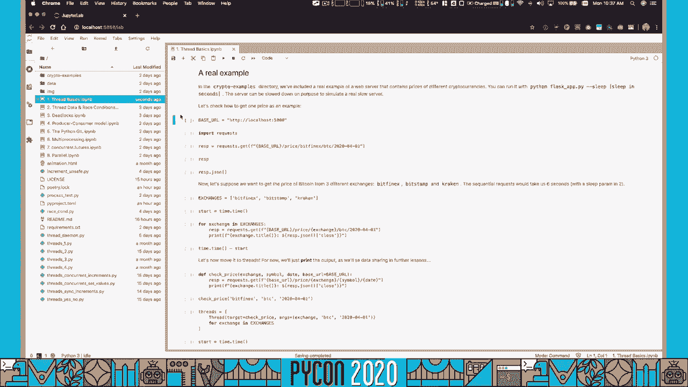

你的仓库中，你会看到这里的加密示例。这是一个我可以使用的 flask 应用。

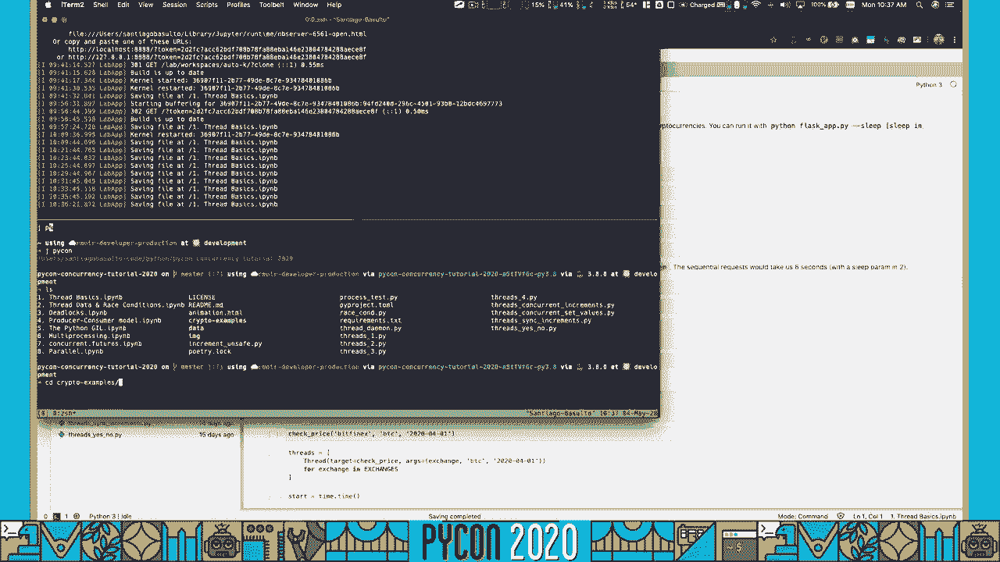

快速展示一下。这是加密货币示例，flask 黑客，就在这里。这个应用将返回来自不同加密货币和交易所的价格。实际上，我们可以通过这个教程咨询一个真实的服务，但老实说，我不想在做我们的教程时请求外部服务，因为可能会没有。

你可以为了教育的目的去过载一个服务器。因此我花时间只为这个教程重建应用。所以让我们启动应用。我们将设置。我们将不设置延迟，没错。好了，它在这个 URL 上运行。就这样。

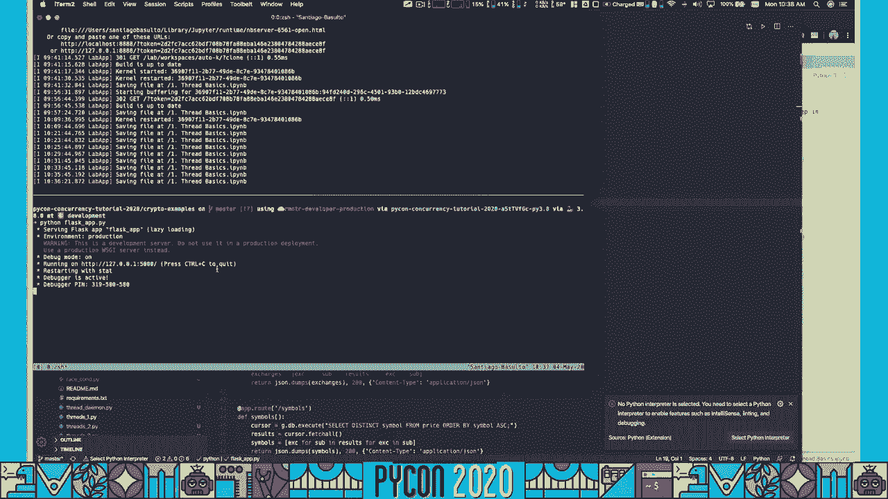

这是一个非常简单的应用。我们将有所有参与我们应用的交易所。它们都在这里，所有我们支持的符号或货币。然后我们可以咨询给定日期的价格。让我们看看这里是否有价格。我不知道。这里有一个价格。所以对于 Vith Finex，BDC，这就是那个给定日期的价格。我创建的方式。

这个简单的应用，除了代码外，是从哪里获取信息的。我想就在这里，在这个 CryptoWatch API 的笔记本中。如果你想查看我创建应用时遵循的过程，可以查看所有这些笔记本。但基本上，我是从这个公共 API 下载了信息。

我将它们全部下载为 CSV 文件。然后我实例化了 SQLite 数据库。所以这个 flask 应用是从数据库中获取价格的。因此这个方法实际上是在执行这个操作。

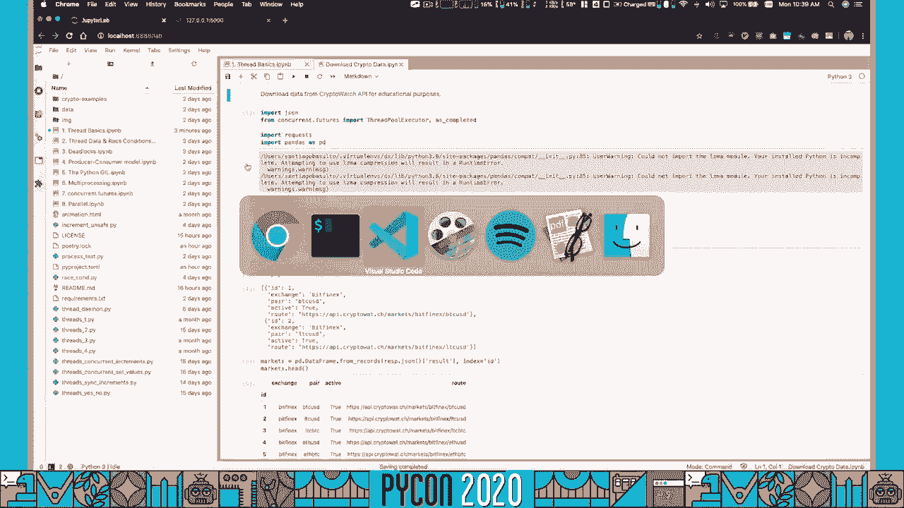

查询。你将获取给定交易所、给定符号和给定日期的价格。我们执行那个查询，并返回结果。如果有的话，如果没有结果，我们将只返回。

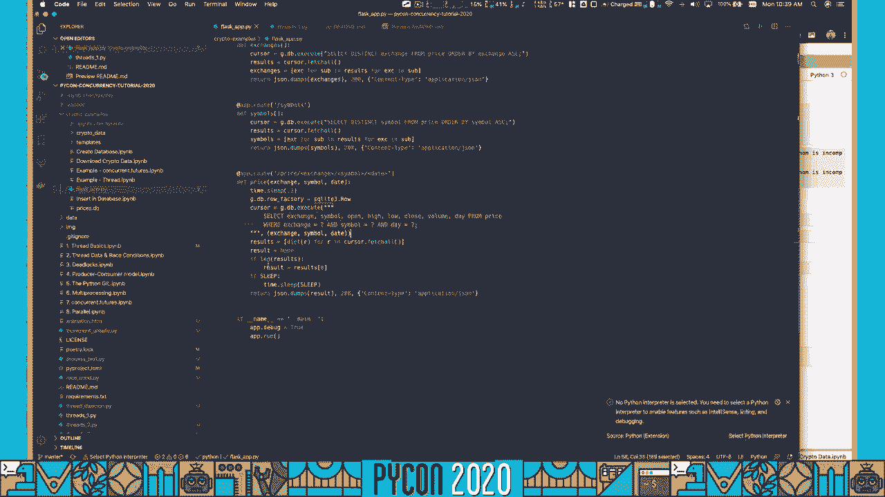

所以这又是我们应用工作原理的简要介绍。应用正在运行，我们可以坐在这里。我们将通过基础 URL 实例化，然后使用请求和数学模块来执行 HTTP 请求。我相信你们都很熟悉这个。我们将在这里执行一个简单的查询，看看价格是多少。实际上。

让我们继续关注相同的价格。我们将查看 bitfennox，bdc。但我们将改变日期。我们将获得相同的价格。哦，看看。收盘 7247，收盘 7247.5。所以是相同的价格，抱歉，再次对它们说。现在，我们为什么使用这个应用？我们将在整个教程中使用它。

我们在这里想要做的是检查几个不同交易所的几种不同加密货币的价格。但为了让事情更有趣。

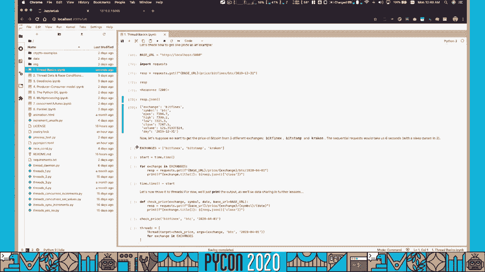

有趣的是，我将通过提供一个休眠参数来重启服务器。这。

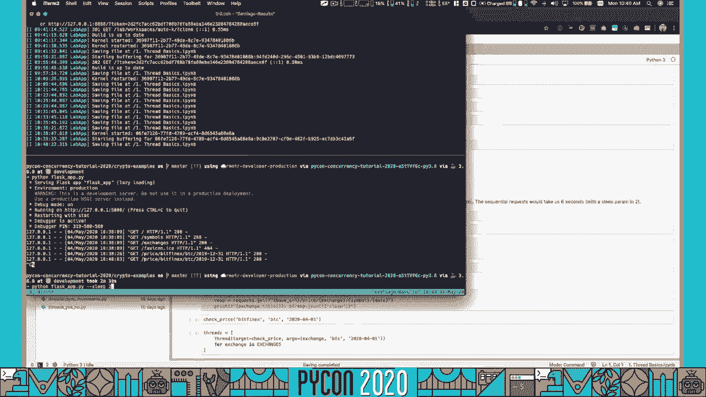

这是一个人为设置的服务器休眠时间。所以我们在这里检查，如果休眠，每个请求后都将延迟给定的秒数。而这个，

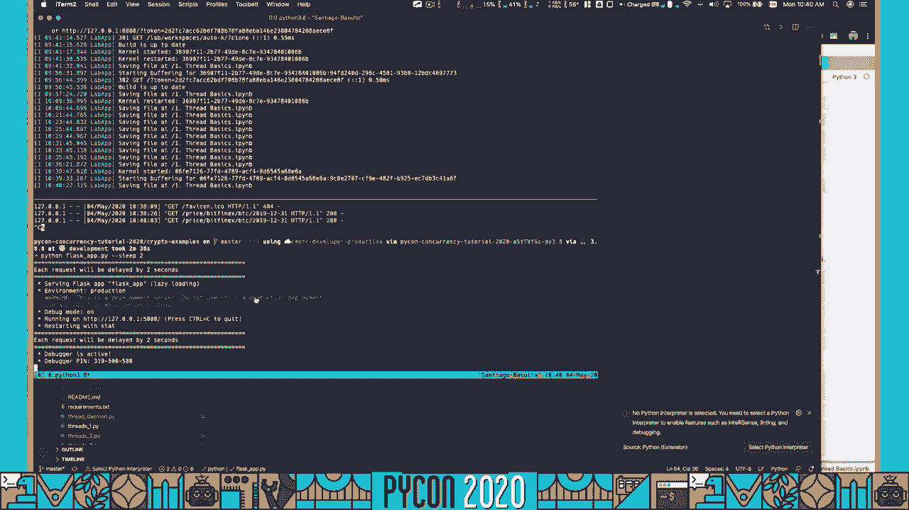

这里的信息将帮助我们模拟一个缓慢的服务器过程。这就是我们需要线程的原因。如果你记得我们的概念解释，我们说，假设我们想咨询三个价格，我们想咨询，看看我们有什么，我们将始终检查 BDC。我们有 Bitfinex，BF，我们有 Bitstamp，STAMP。还有 Kraken。这三个交易所。

如果每个请求延迟两秒，对吧，延迟两秒，因为我们人为地减慢了服务器速度。如果我们顺序执行，这意味着根本没有线程，正如你所知道的。你可以做一个 for 循环，可以做一个列表推导，无论如何，运行所有这些东西所需的总时间将是六秒。

或者至少是六秒，大约六秒，对吧，因为你将发出这个请求。延迟两秒，延迟，发出这个请求，延迟两秒，发出这个请求。再延迟两秒，最后，过程就会完成。如果我们同时运行所有这些获取价格的任务，那就意味着某种程度上的并发，对吧。

我在这两者之间交替使用，直到我们看到女孩的概念和所有相关内容。但如果我们并发运行所有这些，并且我们说它们都在运行，希望如此。假设它们都在并发运行，这意味着整个过程将会在大约两秒内完成，这就是使用线程的想法。那么现在我们来试一下。

我将实例化线程，使用交易所，我们将使用这三个交易所，我们将测量完成整个请求需要多少时间。因此对于每一个交易所，我们将，这个是顺序的，顺序过程。顺便提一下，我们先询问 Bitfinex，然后是 Bittrex，最后是 Kraken。

这大约需要 6.84 秒，没问题，这个是顺序的，我们先检查一个价格。我们等待，它只是，嗯，阻塞，然后检查另一个，再检查另一个。这是一个需要 6 秒的顺序过程。但现在让我们并发执行。我们将定义一个函数，检查价格，它接收一个交易所符号日期和一个基础。

我们将使用的 URL 是默认的，它只是会检查那个价格。所以现在我可以为我设置的每个交易所启动一个线程。因此他们有三个交易所。将会创建三个线程。我将做的是开始计时。启动线程，开始计数，现在我们看到所有的价格，Bitfinex，Kraken。

并且 Bitstamp，他们都在大约 2.35 秒内完成。这是我们对线程的期待，我们希望它们是并行的，不是顺序的，抱歉，是并发的，接近于并行执行以加快速度。现在这里有几点，我们不能。我们不能确定哪个先完成，老实说，在这种情况下，Kraken 首先完成。

如果我们运行这个，也许另一个可以先完成。并不是所有事情在工作中都是线性的，你在现实生活中要做的事情，在这种情况下人工运行了两秒。在现实生活中，这个请求可能比这个请求慢，所以你不知道它会如何结束。你也会看到在这种情况下这两件事是在同一行写的。

这是因为存在一些问题，对吧。一些共享状态或副作用影响着这个过程。我们将在下一课中进一步了解这一点。但再次强调，这里的想法是通过并发运行三个线程来加快获取这些价格的速度。

三个交易所。这太棒了，假设我们有，让我们按照这个例子来，假设我们想要获取我们系统中所有 10 个交易所的价格，三种符号，BTC，LTC，ETH，我们想要获取过去 30 天的所有数据。总之，我们将进行。

900 个请求。我们可以按照这个模式启动 900 个线程吗？每个工作创建一个线程？我们可以。创建这 900 个线程吗？答案通常是否，我们不能，因为线程会。如果我们再次查看这张图，它们会在过程中消耗资源。所以我们不想用大量线程同时工作来堵塞整个过程。

所以我们将看看如何通过多种方式来解决这个问题。主要是，我们将使用生产者-消费者模型，按照这个确切的例子进行，我们将创建一个线程池，假设是 10 个，它们将负责处理所有请求。但再一次，我要说的是要小心，对吧。

这段话的总结是要小心你要创建多少线程。这很大程度上取决于你使用的系统，我们将进一步讨论这一点。Python 模块使用一个公式来计算最佳线程数，但就是这样。最后，总结一下，记住，我们使用的模块是线程，不要使用。

线程，_ 线程，抱歉，因为这是一个非常低级的模块，你不想在里面搞糟。那么让我们继续讨论线程数据以及读取和引发条件。现在让我们谈谈在我们的线程中拥有共享数据的影响。在我们之前的笔记本中，我们看到了多个线程如何访问给定的局部变量。

进程中的全局变量，实际上是局部于主线程的。这个表述有些混淆，但基本上，线程可以访问共享数据。这很有趣，因为我们看到。我们可以通过仅仅改变设置在进程全局作用域中的不同变量来控制线程的行为，这可能很方便。但它也会引入一些问题。

这就是我们现在要讨论的内容。我们将看到的第一个问题是与竞争条件有关的问题，从概念上讲，这非常抽象。竞争条件是一个问题条件，这在程序中是不希望出现的。

程序的结果将取决于某些指令的执行方式或顺序。这是我们不想要的。假设今天，我们的程序输出五，因为。我不知道，线程一在线程二之前运行，而明天，它输出七，因为线程二先运行，线程一后运行。所以我们不想只是有一个固定的迭代次数。

我们程序中的随机行为，因为一个线程比另一个线程先运行，对吧？我们想要一个确定性和一致性的方法。我们想要那些我们能够确信的东西。我们不希望我们的程序今天成功运行，因为线程一在竞争中获胜，而明天却失败了，错误地转账，或者，我不知道，错误地授予一个未付款用户的访问权限。

因为另一个线程先运行，对吧？我们希望我们的程序是确定性的。所以，我将通过这个例子向你展示竞争条件的问题。我们有一个全局计数器变量，它被设置为零，我们将定义这个增量函数，在其中我们将在线程中运行。我们将创建 10 个不同的线程，并让它们运行。

我们将让每个线程运行一千次。所以，对，我们将创建一个全局计数器变量，从零开始，我们将实例化 10 个不同的线程。这里的 10，我们要做 10 个不同的线程。这些是 10 个线程。每个线程将运行 1000 次迭代。

在这段代码中，我们传递 1000 作为参数，但在这种情况下，我们必须找到 1000。1000 次给定迭代的重复次数，将计数器增加一，对吧？所以，它们都在将共享计数器增加一。对，这就是它们所做的。嗯。那么这会产生什么样的预期输出呢？暂时忘记线程。

假设你顺序运行这个程序。你先运行第一个线程，进行 1000 次迭代，所以计数器的值在第一个线程运行后是 1000。然后你运行第二个线程，这个线程将计数器增加 1000，再次是 1000，因为你这里有 2000，然后这个线程完成了。

我们有另一个线程进行 1000 次迭代，现在是 3000，对吧？所以最后这个事情的输出将等于我们拥有的线程数量，我们将说线程数量乘以迭代次数。在我们的示例中，我们有 10 个线程，10 乘以 1000 次迭代。所以我们的结果将是 10,000。这将是结果。

我们期望的最终结果是，在正确执行但较慢的情况下，这无关紧要。但是在正确执行的程序中，输出应该是 10,000。我们在有问题的情况下会看到错误的行为，竞态条件的表现是这些线程将会互相交错。

它们会在不同地方改变数据，输出将与 10,000 不同。这当然是有问题的，我们不希望发生这种情况。那么让我来澄清一下所有这一切。我们将运行示例，找到增量函数、迭代和变量。我们将实例化线程并开始让它们运行。它们都完成了。

这非常快速，我们只间隔了几毫秒。现在，一切都工作了。抱歉，线程失败了。这很有趣。在第一个示例中，并不是通常发生的事情，我实际上是在考虑尝试复制它。在第一个示例中，它工作了，你知道，这就是竞态条件的问题。

这是一件很棒的事情。你可能会运行你的代码，我需要正确运行。就像第一个示例一样，它有效，但随后你在生产中尝试时却崩溃。最糟糕的是，它并没有崩溃。在这种情况下，我故意让它崩溃。你有一个不正确的结果，如果你对代码充满信心。

因为你在本地运行它并且它有效或测试通过，但在生产环境中，你会相信这个计数器的值。虽然，再次强调，这是一个有缺陷的值。那么我们再试一次。让我们尝试创建线程，看看它们是如何工作的。好吧，似乎现在它一直在失败。检查结果，计数器变量总是不同，完全是随机的。

随便说说 32,000。在这个例子中是 47,000。只是哦，我没有改变计数器。看到了吗？所以我认为是 1,760，60，60，是的。所以再次，另一个值，重置计数器，值总是变化。它完全是随机的。你不知道这个值将会是什么，对吧？

这是竞争条件的结果。为什么会发生这种情况？嗯。如果你查看这个操作的细节，counter 加一。你会发现内部没有办法在一步中执行这个操作。实际上，如果我们有一个值 z，C，抱歉，是零。

我们想要递增 C，所做的就是创建一个**炮兵**变量，其值或代码等于 C 加一。因此现在是 1。然后我们设置这里的值，看到的是等于 oops。这是计算机通常会遵循的过程。所以这又是二。

至少三次操作。fine ox 产生了一些风险，得到了这个结果，然后再把它设置回 C。在这个时刻，如果你有这些部分由不同的线程运行，它们可能会相互干扰数据。假设我们有 counter 等于零。这是整个 counter。我们有这两个线程同时启动。

这是 T1。它们以这个操作开始，创建 ox 和 counter。这对它们来说是相同的。ox 将等于 C 加一，对它们两个来说是相同的 C 加一。但这两个线程在同一时刻完全并行运行。

这意味着对于 T1，C 将为零。所以它将是零加一。但对于编号为四或二的三个线程来说，这里也将是零。因此在这个时刻，A 的结果对它们来说都是相同的。这里将是 1。这里也将是 1。

那么无论哪个先返回这里的值都没关系。但基本上，我们执行了两个操作，它们都得到了相同的值，对吧？最后只会是 1。我们想要的是，我要澄清这一点。我们想要的是这两个线程，当 A 读取 C 的值零加一时，我们希望第一个线程是 C 加一。

我们希望它等待直到 A 等于 1，直到这一项把值放在这里。现在它可以去读取它。我们希望线程是隔离的，我们不希望它们在读取或写入数据时发生碰撞。我们将通过我们称之为**线程同步**来实现这一点。这在计算中是非常重要的。

这将在操作系统、数据库系统中发生。如果你想了解更多，可以阅读很多书，了解任何相关内容。你可以得到任何一本操作系统教材，它会谈论同步，会有一章专门讨论。我保证。因此，这是一个非常重要的主题。

计算中非常重要。同步工作的方式基本上是，从非常概念的角度来看，就是通过信号状态，信号我在这个时刻。我正在访问计数器。所以请保持距离，通过信号我刚刚完成更新计数器。所以现在你可以写，它，等等。只是通过创建信号并通知有人正在使用某样东西。

共享资源当前正忙碌。这已经在使用中。一个很好的例子就是这个录音灯。这来自我们自己的工作室。我拍了这张照片，作为一个人，如果我想使用这个共享资源的录音室，有几个教练，我们都使用同一个录音室。

如果我想使用这个共享资源，然后走到门口，我看到灯已经亮了。我就不会使用这个资源。我不会使用录音室，因为这意味着其他人正在使用这个录音室。我会等，抱歉，等灯熄灭，然后我才会走进录音室，因为我知道刚才有人刚用完这个资源。

现在我可以进去了。潜在地，外面会有多个教练在等待。问题是，哪个教练会先到录音室并打开灯。这就是同步的另一个问题。从概念上讲，同步是通过提供这些信号，提供这些提示来保护共享资源。

说已经有人使用了这些资源。问题在于，同步通常是合作性的。并不是说灯有某种物理力量阻止我进入录音室。如果我是一个不好的教练，如果我是一个糟糕的线程，我可以无论如何打开门，打断教练正在进行的录音会话。这是灾难性的。

因为我在中间打断了他们，他们将会失去两个小时的录音。例如，如果他们正在进行直播网络研讨会，我完全在破坏他们的工作。但我在外面停下来等，因为我是一个合作的教练。我决定待在外面，但没有什么能阻止我实际走进去。

同样的事情也会发生在我们的线程上。我们的线程将使用同步方法，但它们都是合作的。这是合作性的。这是因为我们决定以这样的方式编写代码，出于我们的最佳意图。我们在编写代码以使用同步。但如果你有一段恶意代码或一个马虎的程序员。

如果有人忘记使用那个同步机制，那么没有什么会阻止共享数据被修改。所以让我们现在开始，特别是。我们将看到第一个同步机制，即锁。这是一个非常简单的，它可能是我们使用的最古老的同步原语之一。

还有多种同步机制，比如锁、信号量，还有很多其他的。在这种情况下，我们将使用锁。再说一次，这是一种最简单的锁。通常是互斥锁。它也被称为互斥体，有几个名字。基本上，锁的工作原理就像一个真正的锁。有这个共享资源，并且是开放的，我们将要。

我打算尝试画一个锁。它是一个开锁。有人使用这个资源。所以他们只是关闭，锁上这个锁。当他们准备好了，当他们完成使用这个锁时，他们会打开这个锁，现在它将对其他人可用，供其他人去使用。

去使用它。所以它的工作原理是我们创建一个锁的实例。这个锁将是共享的。我们都使用同一个锁。而将要在该锁上工作的线程会首先尝试获取锁。这基本上是，我想使用这些资源，我们正在这里做的。

所以我想使用这个资源。我将获取锁。所以现在。我拥有这个锁。因此没有其他人，通过这样做，我将得到保证，没有其他人。没有其他线程能够获取这个锁。所以在锁上执行获取操作是原子的。如果我得到一个真正的输出，这意味着我是锁的唯一拥有者。

然后我可以做任何事情，我可以做我想做的任何事情。通常一旦你获取了锁。你将对你拥有的共享资源执行一些操作。那么假设这是一个计数器变量，在你获取锁的那个特定时刻，增加有效计数器的时刻就在那个时候。任何不可能的工作。

它不会遭受潜在的竞争条件，将会保持在锁之外。因为锁操作可能会拖慢你的速度。如果资源忙碌。你将无法获取锁，你将无法完成工作。因此，通常任何不涉及共享数据的工作将保持在锁之外。

一旦你获取了锁，再一次，你可以做任何你想做的事情。希望这只是与共享数据、共享资源相关的事情。然后一旦你完成了，你释放锁。你说，我完成了，任何想做这个工作的人，现在他们可以获取锁。那么我们来看看这是如何工作的。我获取了锁，我做了一些事情，然后锁完成了。

来吧，抱歉，锁完成了。我睡了 10 秒钟。所以这意味着我将在这个线程中共享或抱歉，我将保持锁在这个线程中被获取。我将保持它忙碌 10 秒钟。然后我释放它。那么，如果我尝试在这个线程已获取锁的情况下获取锁，会发生什么呢？好吧。

它将被阻塞。所以让我给你展示一下。t.start 开始获取锁。锁被获取。锁被锁定了吗？是的，它被锁定了。如果我尝试获取它会发生什么？

我将再次运行代码。我将增加这里的时间。这样你就可以非常清楚地看到将会发生什么。我将再次启动线程。它被锁住了。现在我们会尝试获取它。正如你所看到的，进程刚刚停止。它在等待获取锁。获取操作会阻塞，直到线程。

不管怎样，实际上成功获取锁的线程。好的。现在主线程已经获得了锁，我们可以用图示来简化这一点。我们有这个线程。我们在这里放一个共享锁。这个锁是开放的。假设这个是开放的。发生在这一行的事情是，开始的线程获取了锁。

对。所以在这种情况下，假设这个是锁的拥有者。当主线程，也就是我们主要的代码在这个过程中再次尝试访问锁时，它尝试上锁，但锁是锁住的。所以它在那等待。它在等待。它在等待，直到锁被释放。一旦锁被释放，我会清理一下。

一旦这里的线程释放了锁，它就是空的。现在主线程可以获得那个锁的所有权。所以现在这个锁由主线程拥有。但现在这个线程完成了。它完成了。我在这里创建了一个新线程。我会把它放在这里。同样，这已经完成。如果我再运行一次。

它在这一行尝试获取锁，那个线程将永远被阻塞。至少在我释放之前。所以这就是我们要做的。我将启动线程。它正在尝试获取锁。它在那里休眠。就在那停住。这是阻塞的。线程在等待。我的做法是，线程在那儿等待。它在等待。它在等待。

它在等待。它在等待。我能做的就是从主线程中说，现在释放锁。就释放它。我会这样做。我会释放锁。锁的获取就在这里，锁获取。然后它完成了休眠等所有事情，因为我没有传递任何时间。但这个想法是。

线程被停止并在等待。它被阻塞了，因为主线程已经获得了锁。当我释放锁的那一刻，那个线程就能够运行了。所以使用这一切，可能会让人困惑，我们将使用一个真实的例子。我们将修复我们的计数器。记住，在 1000 次操作后，10 个不同的线程，我们在等待，我们希望能得到 10。

最终结果中会出现 000。所以我们将通过每次迭代在修改这个重要的共享数据之前，先获取锁来实现这一点。此时，我们知道没有其他人会更新那个计数器。我们将拥有那个计数器的唯一所有权。我们将进行更新。

然后我们会立即释放锁。这样任何其他等待获取锁的人都能够做到。因此，我将最初初始化计数器，初始化增量或定义增量。我定义了一个锁。记住，锁是一个共享资源，我们都必须使用同一个锁。

如果我们使用不同的锁，那是没有意义的。我将创建所有线程。现在我将启动所有线程。它们正在工作。我将显示并等待它们完成，它们会很快完成。让我们看看计数器的结果。计数器是 10,000，符合预期。我们再做一次。10,000。

我可以做到这一点 1000 次，现在可以保证这些会有效，因为没有两个线程会同时修改计数器。现在，让我们再次回到可能面临的线程和资源管理问题。第一个是与我们所说的公司任务相关的问题。

我写了这段代码，并且很周到地在访问计数器之前放置了一个锁。但这需要我理解问题，足够小心地包括锁，或者我的同事在复审时也要清醒，让我看到我忘记了锁等等。所以这有很多不确定性。

可能出现多种问题。现在，这里列出了四个问题。首先，你可能会完全忘记使用锁。如果你匆忙修改一些全局变量，可能没意识到自己进入了一个竞态条件。因此，不理解这一点。

正确理解竞态条件和共享数据，可能只是经验不足的问题。当你开始编写第一个并发程序时，你会缺乏那种经验。因此这本身就是一个问题。第二个问题是，你可能忘记获取锁。如果我移除这一行，而我还没尝试过，干脆去试试吧。

如果我移除这一行，我将不会执行代码。如果我移除这一行，而实际上没有人获取锁，就像，知道的，开着的锁就像根本没有锁。因此，问题依然会出现。在这种情况下，我们需要在需要的时候获取锁。此外，锁在我们的代码中算是一种哲学术语。

但它并没有保护计数器。没有任何东西在保护计数器。我可能在获取锁之前就修改了计数器。他们问我，嘿，你用锁了吗？是的，我用了。但没有人说我在哪里用了。这是一个相当愚蠢的例子。抱歉，这只是五行代码。但在一个更复杂的程序中，你有大量共享数据。

多个锁分散在各处，这将成为一个问题。你可能会把锁的获取放在错误的位置，或者可能根本忘记放置它。那么这就是你临界区的问题，是否在做锁保护的事情。最后，忘记释放锁会发生什么？如果我忘记释放。

锁，所有其他线程将永远被阻塞。如果我的程序中有一个错误，我没有释放日志锁，抱歉，所有其他程序或线程，抱歉。它们将永远被阻塞。让我们看看这个问题。我将创建一个新的锁，并在这里定义这个函数。

我将开始它。这里将会发生的是我将暂停，出现错误。我将在睡眠参数中出现错误。那么这里会发生什么呢？这段代码将运行，它会获取锁。我有一个释放。所以让我们说，我提交了一个拉取请求，你审核了这段代码。

你会看到锁在这里释放，你会看到合唱团，一切都很有意义。你会说，嘿，这段代码运行得很好。但是，有一个问题。如果这个睡眠参数无效，会发生什么呢，就像这里那样？

当这段代码运行时，将会引发一个异常。线程将会完全停止。这意味着我们永远无法到达这一部分，也永远不会释放锁。现在让我们来运行它。它引发了一个异常。锁已被获取。因此现在这个锁仍然处于获取过程的状态，没有人可以获取。它只会……

一直挂在那里。我的代码现在挂起了。我打算人为地中断这一点。在你的代码实时中，没办法做到这一点。但再说一次，这些被锁住的东西无法处理。所以我们可以通过在获取过程中过滤掉超时来修复这个问题。假设我想获取锁，但我说，我只想在这里等待两秒钟。

因为如果锁在两秒内没有释放，那就可能是个问题。你可以在这里放任何你想要的值，或者你甚至可以询问我们，明确地说。我想获取锁，不想被阻塞。所以结果是假的。如果锁没有被获取，是真的，如果你成功获取了锁。

所以这不会阻塞。我们可以释放锁，现在一切正常。这是一个非常常见的问题。你看过代码。有一个获取调用，还有一个释放调用。但是在这两者之间，在释放之前的任何事情，如果有什么失败，锁将永远被获取。它将永远被获取，因为异常将阻止这行代码运行。

这在编程中是一个非常常见的模式。当访问数据库时，当访问文件时，当访问网络时，当访问这些重要且昂贵的资源时。Python 中有一种方法可以克服这些困难，那就是使用上下文管理器。因此，`with`语句是 Python 中的一个上下文管理器。

它将运行基本上这个模式。它将获取锁。它会尝试运行这个关键部分。如果任何事情失败，不管它是否失败，它都会释放锁，无论条件如何。如果成功或失败，如果因为异常而崩溃，或没有崩溃，它都会始终。

释放锁。这是`with`语句遵循的模式。因此我们将这样做。我将实例化锁。我将启动它。锁已被获取。锁已被获取。现在我们将运行这个有问题的例子，如果是那种崩溃的代码崩溃了。这意味着此时它停止了。但由于我们正在使用上下文管理器。

我们会看到代码并没有被锁定。我们可以立即获取锁。再次，这是我们在这里使用的模式。因此，最后，为了用`with`语句修复代码，使用上下文管理器，我们所做的唯一事情是在我们的增量遇到之前，我们只是使用`with lock`。

我们确保在这一点上会获取锁。我们可以做任何想做的事情。然后在这里，锁已经被释放。这一切都应该按预期工作。就这样，10,000，一切都正常。所以即使我们开始我们的课程时使用`acquire`和`release`，这实际上并不推荐。我建议的获取和释放的方式是。

使用`with`语句的锁要简洁得多。你将永远不会忘记释放锁。仅仅说`with lock`并使用上下文管理器就简单得多。作为本课或本笔记的总结，我们讨论了共享数据，讨论了竞争条件及其问题，也讨论了线程同步。这里有多种机制。

已经构建了多种工具来改善线程之间的同步。这些工具都是手动工具，可以这么说。它们都是协作的。而且，正如我们所说的，没有免费的午餐。使用这些工具并不能永远确保你的代码不会出错。这并不是现实。可悲的是，它也可能出错。

即使你使用这些同步机制。这就是为什么坦白说，我们尽可能避免使用同步。一旦我们到达这一点，它就会更有意义。但首先，我们将看到线程同步的另一个问题，这是进入死锁的大问题。正如承诺的那样，我们现在将讨论。

死锁。你应该感到害怕，因为在现实生活中会发生非常可怕的事情。我们应该避免它。我们将首先理解何时会发生死锁。我们要做的第一件事是模拟另一个提高的条件。所以我将直接运行这个。让我们解释一下会发生什么。有两个账户。

每个账户有$1,000。我们将启动两个线程，它们将转移资金。它们将从这个账户中取出$10 并放到这里。现在这个账户将是$990，而这个账户将是$1,000。然后，它将取出$500，剩下$409，最终将是$1,510。

然后它将在账户间转移资金。不能创造新的资金。我们从这里转移的所有资金都放到这里，从这里转移的资金也放到这里。这是一种常规交易的方式。因此，线程从一个账户开始，到另一个账户。我们说对于第一个线程，从 a1 转到 a2。然后我们说。

从 a2 转到 a1 以应对第二个威胁。当他们转移资金时，某个时刻会出现提高的条件，他们会发现不正确的余额。我并没有阻止负数的出现，但不正确的余额确实发生了。基本上，这些账户中的总资金必须是$2,000。因此，我们将采取一种方法来解决这个问题。

锁定条件。基本上，我们将为每个账户创建两个锁定。所以我们将说从 a1 到 a2 的锁定。a1 的锁定是从，a2 的锁定是到。为了运行代码，它将首先获取第一个锁。

然后获取第二个锁。它会转移资金，计算总额，检查总额，一切正常。然后它会继续。如果在任何时刻发现不正确的行为或资金被创造的情况，它基本上会停止。我们发现这可能会正常运行。似乎没有问题。

资金会在达到迭代限制之前创建，至少会运行一百万次。至少在那一刻，一切似乎都正常。我们可以进行第二次测试，看看是否一切正常。它在等待一百万次操作。好了，它完成了迭代，和总额仍然是$2,000。没有资金被创造或损失，状态保持不变。

一切看起来都正确。如果我检查日志，它们都是解锁状态。这似乎正常，但有一个潜在的非常危险的情况在等待我们。我现在就要给你展示。我要做的唯一事情是重置账户，改变日志的传递方式。日志一。

日志二，我之前是从两个日志中传递的。所以我对每个账户使用了相同的日志。我将改变它。我会说日志一，日志二，日志二，日志一。而且。我将启动这些线程，我们将看到这将永远不会结束。我可以在这里坐上千个小时，这将永远不会结束。我现在要中断这个。然后我将要。

检查账户的余额。看起来它们仍然是平衡的，但这两个日志都是锁定的。它们都被占用。我们刚面临的问题，再次，我可以尝试再次运行它。这将永远阻塞。我们刚面临的问题就是我们所知道的死锁，其中两个资源在锁定，对吧？共享资源，没有锁能够。

向前移动是因为另一个线程锁定了它们所需的资源。当我在十多年前的常规软件工程学校时，在我们的操作系统课程中，我们使用了一本非常流行的书。这是一本关于操作系统的非常好的书，非常概念化，非常底层。

如果你不太感兴趣，你需要把它写下来。它有这样一句话：“也许死锁的最佳插图可以从堪萨斯立法机构的低通道中得出。”抱歉，这没用。对我来说不好。“20 世纪初，它提到：当两列火车在交叉口相遇时，双方都应完全停下。

而且在另一方离开之前，两个线程都不会重新启动。"所以，有两个线程接近一个交叉口。它们都必须完全停下来，直到另一方离开才能移动。但如果没有火车能够移动，那就意味着它们会永远在那里等待。

所以这是对我们代码中发生的事情的一个很好的解释。第一个线程获得了第一个锁。很好。记住，稍等，我实际上要复制这段代码。我会粘贴它。我们再次有它吗？在这里。那里。所以，记住发生了什么。第一个线程在尝试获取第一个锁时成功了，获得了第一个锁。

线程尝试获取第二个锁，它成功了，但然后线程一需要两个锁才能继续。因此，当它去获取第二个锁时，它已经被线程二占有，所以它无法获得，只能停在那里等待。但是当线程二去这个地方并阻塞线程一并尝试获取第一个锁时，它首先被线程一获得。

所以它停下来了，等待。因此它们都有一个共享资源，并且在等待另一个线程。没有线程能够移动，因为它们都在阻塞对方所需的某些东西。所以这是一个非常糟糕的情况。在计算机科学中，讨论死锁非常常见，也包括饥饿等其他几个问题，我们主要会讨论死锁。

再次出现的问题是，死锁是当共享资源被一个线程获得，而另一个线程需要它，但那个线程需要的锁也在等待其他某个资源时。这是一个非常常见的问题。通常的程序是防止锁或死锁，抱歉。

理想情况下，不要完全同步代码。我们将在这里再次看到更多，但不应完全同步代码。如果你需要手动使用锁，永远不要锁定某个东西。好的，所以请记住，你的获取方法有一个超时，永远不要锁定某个东西，永远。始终给它一个机会进行清理，回滚一切并重新开始。在这种情况下。

我们要做的是，线程一将获得第一个锁。线程二将获得第二个锁，线程一将尝试获得这个锁。它将放弃，我不知道，给它一次一秒的机会。如果在那段时间内，一秒，它没有能够获得这个锁，它将释放这个锁，然后返回。

释放这个锁并重新开始整个过程。老实说，这并不快。我们引入了很多低效，但这将防止死锁。如果线程发现在某段时间后没有进展，它们就不会永远等待这个锁。如果它们没有能够获得所需的所有锁，它们就会停止。

回滚一切，释放所有内容，然后再次返回。所以这就是我们要在这里做的。我们将定义一个非常小的超时时间。我们将只等待这个时间。代码遵循这些，我们将做之前做的常规事情，我们将定义这个锁定变量以及线程。

将尝试同时获得两个锁。所以这个和这个，第二个。如果它们能够在给定的超时时间内锁定一切，值将被锁定。否则，如果它们无法锁定一切，它们将释放已获得的锁，一切都将继续。

再次开始，因为锁将保持为假。因此，它将再次尝试获得锁。假设第一个锁被正确获得。这是这里，这是真的。第二个锁是。它将等待，将阻塞`0.001`秒。然后它返回假。它说，我没有能够在这段时间内获得这个锁。那么如果。

我们都是锁的获得者，没有真正的真假。它们中的一个并没有被获得。所以锁住了。因此这不是，代码在这个分支中进入。剩下的一个获得了吗？是的，它获得了。所以这确实是。剩下的两个获得了吗？没有。所以不需要释放它。然后它又回到起点。锁是假的，过程继续进行。

所以我们会尝试永远获取锁。我们可以设定一个最大迭代次数，但在这种情况下，我们会一直等待，直到能够获取锁。我将运行这段代码，这将花费一些时间。但正如你所见，我们已经达到了迭代限制。

所以这意味着我们从未死锁，一切正常运行。因此，流程是我们需要在给定的超时时间内获取锁。我们不应该永远阻塞。锁会有给定的超时，如果一切顺利，我们就会执行所需的操作。现在我们获得了两个锁。否则。

我们将继续尝试一遍又一遍地做同样的事情，直到我们真正锁定资源。那么这前三个课程的总结是什么呢？可以说这是来自 Mozilla 开发者的非常有趣的图像。我们刚刚学到的是，使用同步技术编写正确的并发代码非常困难。

这非常困难。总是存在一些错误，总会出现死锁，意外的竞争条件总是可能发生。编写正确的同步代码非常困难，死锁、饥饿、竞争条件，这些问题都可能发生，非常困难。

调试代码并理解何时做正确的事情或何时不做，这就是整个课程的总结。你观看这个教程是因为你想使用多线程代码，可能是并发代码。我只是想警告你，保持代码的正确性并不会简单。

你必须做一千个测试，确保对那段代码进行大量的审查，因为如果在生产环境中遇到死锁，那是最糟糕的情况。整个系统将永远被阻塞，直到你手动停止它。

我们不想做的事情。接下来，我们将看到一种更实际的方法来处理多线程代码，这将解决我们在前三个课程中面临的多个问题。我们指出了两个主要问题。

使用并发代码和多个线程编写多线程程序时，第一个问题是如果我们有太多任务需要执行，就像我们的例子中，我们想要检查 900 个价格在我们的加密货币价格服务器。这些任务太多，无法将每个任务分配给一个单独的线程。我们无法创建 900 个线程。这是我们指出的第一个问题。

第二个问题，当然是最复杂的一个，涉及共享数据和同步。我们说编写同步代码非常困难，容易出错，调试也很难。总会有问题出现，可能会发生死锁，数据可能会损坏。在编写同步代码时，有很多事情在进行。

我们现在要看到的是一个部分解决方案，解决许多这些问题，既处理大量任务，也将看到一种技术，如果可能的话，可以让我们不需要同步代码。这就是在多线程代码中的生产者消费者模型。生产者消费者是多个模型的非常通用的称谓。

在这种情况下，应用于多线程代码意味着我们将有两个主要线程组。一个线程组，通常只有一个线程，将是生产工作的人，创建任务。把它们放在工作队列中，然后消费者线程，其他线程，将从这个队列中拉取，以查看待执行的任务。

所以我们有一些生产者，一些创建需要完成的任务的线程，以及拉取这些任务并实际执行工作的工作者。这里重要的是，所有这些在这个队列中都是同步的，在 Python 中，它是线程安全的。这意味着我们不需要同步，因为不会发生内存损坏，不会出现竞争条件。

从这个大队列中放置对象或获取对象。所以我们要做的是，这就是我们解决这两个问题的原因，首先，我们可以创建一定数量的消费者线程。我们有 900 个价格需要检查。所以我们的队列将有 900 个任务。假设我们有 10 个线程或 30 个线程，随便说，假设我们有 10 个线程。

然后每个线程将检查 90 个价格。将始终有 10 个线程在运行，他们将拉取价格，执行工作。一旦他们完成，他们会放入另一个价格并继续工作，这个过程将不断重复，直到没有更多的工作要做。这通常是这个过程。

所以我们分享了太多任务的问题。同样，由于这个队列是线程安全的，我们也解决了同步的问题。我们将不需要手动同步我们的代码。所以我们谈论的队列实际上来自队列模块，它是一个线程安全的队列。

这是一个被动的、非常简单的 API，我们将实例化一个队列，我们可以检查它是否为空。我们可以使用**put**方法放入对象，然后再次检查它是否为空，当然，队列的大小，我们可以从队列中取出对象。一些重要的事情。我不知道你对数据结构有多熟悉。在这种情况下，队列是先进先出（FIFO）的。

首先，**A B C**是我们放置对象的方式，**A B C**是我们取出对象的方式。你可以创建一个后进先出（LIFO）的**Q2**，如果你愿意，通常称为**TAC**，这取决于你。我不想深入探讨数据结构，关键在于你从一侧放入，从另一侧取出，在这种情况下，顺序是被尊重的。一个重要的事情是。

这是一个线程安全的队列，你可能会，有一些东西没有同步放置。在某种程度上，它们并不成问题，但例如，检查队列是否为空或队列的大小，有时可能是过时的结果，因为可能会有另一个对象从队列中提取，但这并不重要，通常这根本不是问题。但再说一次，放置。

它将把对象放入队列，任务在我们的情况下，它将是一个任务队列，而获取将从队列中获取对象。队列现在是空的。每当你获取一个对象，该对象将被移除，并不是说你在读取队列。你实际上是将对象从队列中取出，以便进行处理，这很好。

因为这意味着没有两个线程会看到相同的任务。一旦一个线程获取了对象，其他线程将永远不会重复同样的任务。队列的重要之处在于它准备在多线程环境中工作。在这种情况下，队列是空的，就像全新的一样。如果我尝试从队列中获取。

队列将阻塞，因为它在等待，对吧，队列是。这是一个阻塞操作，我们几乎是在说，嘿。我准备处理一个新任务，给我一个要处理的任务，而当队列为空时。我们将继续阻塞，直到生产者线程在另一端放入一个对象。

一旦他们放置对象，这种方法就会解除阻塞，我们将接收到执行的任务，因此获取方法是设计为阻塞的，你需要意识到这一点，因为你可能会永远被阻塞。为防止这种情况，如果必要，你可以传递`blockfalls`，或者你可以设置超时，给定一个时间。

这与锁的线接口非常相似，对吧。在我们提到的能够完全防止阻塞或传递超时的方法的线 API 中，这里重要的是如果你没有取出对象，该方法将引发一个空异常，一个空异常的队列。

所以我们必须捕获这一点。队列也可以有最大大小，对吧。我们可以说我们将创建多少资源。在这种情况下，如果你想放置另一个对象，你必须等待有人消费第一个创建的对象，好的，所以你可以始终确保队列的最大大小。

始终只有一个元素。给定队列中的元素不会超过一个，当然，这些方法也会引发异常，在这种情况下，是满异常，`queue.full exception`。通常的过程是，工作线程将尝试从队列中获取对象。如果队列是空的，对吧，他们将。

基本上只是跳出代码，我们应该在这里放一些类似于返回语句的东西。如果成功地从队列中提取了一个任务，那就意味着还有工作要做，所以在这里，工作者执行任务，最后通知队列，说明该任务现在完成。

这是队列对象的一个重要特性，因为这将允许你处理失败。假设你得到了对象，如果它没有完成，比如说，如果出现错误等，你也可以将其放回去。因此，这可以作为一种计数器，记录有多少任务被放入，多少任务被处理，然后你可以获取所有这些任务。

到零状态，这意味着队列中没有工作要做。所以这里重要的部分是，我们会要求获取一个任务，我们不会记录，或者我们可以包括一个超时。但是如果这个方法抛出异常，那就再次意味着所有工作完成，因为队列已经空了。这只对 19%的情况有效。

有时，生产者在队列中创建任务，消费者同时提取任务。使用等待队列变空的模型，这意味着所有工作都已放入队列，现在你在等待完成。一旦队列为空，你可以假设没有工作要做。但是如果生产者在。

不断向队列中注入元素，它们同时在生产和消费，生产和消费，这可能不是情况。空队列并不意味着没有工作要做，而是可能意味着生产者没有足够快地生产任务。因此消费者必须阻塞，然后你可以说，这里，阻塞等于。

默认情况下，这意味着无限期等待，或者设置一个超时。如果在，我不知道的 10 秒内没有更多任务被创建，那就意味着我们可以放弃，并且可以结束，因为没有更多的工作要做。那么让我们看看，结合所有这些理论，看看一个真实的例子，我们将开始提取这些，我把服务器停了，我们要启动。

我们不会让它滑动，所以速度足够快。你看它在工作。而且再次，目标是获得这 900 个请求，正如我们在第一课中所说的，但我们将以这种消费者生产者模式来做到这一点。这些是我们所有的交换，我们将为所有这些日期这样做，我随机选择了 30 天，抱歉，是 31 天，三月份。

我们将为所有的交易所，BDC，Ether 和 LTC 进行这个操作。总共，我们将有 1,023 个不同的请求。记住，我们将有 31 天，而不是 30 天。我们正在处理的方法，检查价格非常简单。它接收交易所、符号、日期和基本 URL。让我们构建请求并返回响应。这就是它所做的一切。

假设我们随机选择交换、符号和日期。那么在这种情况下，我们将从 Bitstamp 获取莱特币的价格。让我们检查一下价格，看看结果。来吧。这是这个函数的输出。我们并没有所有交易所、所有货币和所有日期的价格。因此，这些可能会是空的，只想让你意识到这一点。

那么我们现在要做的非常重要的事情是初始化一个队列。我们将把所有任务放入我们需要线程完成的任务中。在这种情况下，在这些特定的例子中，我们知道所有需要做的工作，因此我们可以初始化这个队列，我们可以把所有的工作一次性放进去，这样就不会有。

生产者线程，除了主线程。不是说生产者一直在不断放任务。我们可以初始化队列，告诉它完成所有这些工作，把一切放进去。消费者线程会处理这一切。因此在那个特定时刻，我们可以说。

零时，我将介绍所有这些，并将所有对象放入任务中。任务的形式就是一个普通的字典，我们说我们想要获取 Prolonix 上这个特定日期的莱特币价格。这就是一个表示待处理任务的字典，对吧？对于所有任务，我们有 1。

我们队列中的 023 个元素。我们要做的是定义一个非常简单的类`price result`。我们将拥有一个包含交换、日期和符号的字典，对吧？这样我们就可以跟踪所有价格。这里一个重要的说明是我知道，因为我读过这个，我不，不需要属性搜索。

在多线程环境中，将对象放入字典是线程安全的，因为当前的 CPython 实现。但这并不意味着字典是一个线程安全的集合。我选择它只是因为简单。在理论上，要使事情线程安全。

我们应该使用线程安全的集合，这也可以是一个结果队列，抱歉，在接下来的例子中，我们实际上会有两个队列，一个是要执行的任务，另一个是已经完成的任务的结果。我们将使用两个队列，因为它们都是线程安全的。在这种情况下。

我只是为了说明而使用一个简单的字典。这是我们工作者的代码。它要做的事情是尝试获取一个要执行的任务。在这种情况下，我们将进行阻塞等待，好的，这很重要。因为我们知道所有工作都是事先生成的。因此所有的工作者。

他们可以确信，如果从队列中没有获取任何元素，队列为空。那么就没有其他事情可做，他们可以直接退出，直接返回。但是如果有任务需要执行，线程将进行请求检查，检查给定交易符号和日期的价格，并将价格放入相应的字典中。

还有一件我知道的事是，不会有两个线程写入相同的信息。因为我没有重复的交易、符号或日期。这就是我可以使用字典的原因。一旦我放入价格，我会通知任务队列，给定任务已经完成，然后我将继续前进。

我会不断重复，直到队列为空。所以我们还初始化了结果类。现在，多少个线程会启动？我们要启动多少个？

所有这些在后台工作的线程，它们从队列中提取等。我们能启动多少个？好吧，有不同的建议。这是需要大量调整的，以理解系统中最佳的线程数量。在我们将要看到的并发 dot futures 包中，七在七个笔记本中。

在这个包中，我们稍后要讨论的线程池推荐或实际上默认的线程数量是 32 或操作系统的 CPU 数量加四。抱歉。所以这是这两个数值中的最小值。我不知道这是否实际上是乘以四，我们应该检查一下。他们说，哦不。

是加四。好吧，所以它是 CPU 数量加四。所以无论哪个数字，最适合你。这是一个很好的建议，关于我们所偏好的。在这种情况下。我只会设置为 32，这样所有任务就能更快完成。这还取决于你的计算机有多少内存。还取决于操作的性质。

如果它们是 CPU 密集型或 IO 密集型，我们会讨论一下，然后启动多个处理程序。但目前 32 是一个不错的数字。所以我要创建所有线程。我刚创建了 32 个线程。再次强调，工作者接收到的是队列，以便获取新的工作或新任务。

执行和结果。所以如果你想，它可以在结果准备好时发布。我将启动所有线程，现在我将阻塞在队列上。好的，我将设置并等待，直到队列基本为空。我将等待所有任务从队列中清除。这就是我们需要通过任务完成通知发布的原因。

工作者对队列说，嘿，我刚完成这个事情。一旦队列的数量回到零，我们就知道所有工作都已完成。任务数量为零，所有线程都已退出，对吧？QSMT，我在这里的工作是，退出 QSMT。我的工作是退出。所有不同的线程，我们启动了 32 个。

他们都完成了。所以就是这样。我们将检查我们所有的价格。那里只有几个随机价格你可以检查。没错。还有一些是非，更多的十进制，只管去吧。因此，例如，MXBT 在这些日子里，或者我们没有价格。再次地，我们与我们的生产者一起未能获得所有我们需要的价格。

消费者模型。因此，这部分的重要总结是，这是一种完全不同的心理模型，关于我们将如何设计多线程系统。这仍然是一个多线程系统，但我们不需要任何手动同步。这很好，因为队列是线程安全的。而且，我们在这个队列中放入大量任务，并创建了这个池。

消费者威胁正在发挥作用，我们确保系统不会过载。这是一个数字，你可以随时调整最大工作线程，你可以调整，我不知道它在哪里。你可以调整你将创建的工作线程数量。你可以始终保留报告，对吧？考虑到这些工作线程的数量，这就是系统 CPU 内存等的负载。

这就是花了多少时间等等。你可以继续调整和完善工作线程的数量。接下来，我们将看到一些非常有趣的内容，看看 Python。你可能已经听说过它。抱歉，但你可能不会喜欢我们在这节课中看到的内容。这一点都不好看。

这实际上是 Python 的一个主要问题，就是那个女孩。让我们开始吧。我会尝试做一个好的介绍。所以跟着我。跟随我们将要面对的那个女孩，什么是那个女孩，问题是什么，等等。所以再次强调，这只是一个故事，先跟着我的引导。

我们将尝试计算素数，实际上检查一个数字是否为素数。我们将尝试为此查看一个多线程的方法。所以我们要做的第一件事是定义函数 is prime。给定一个数字，它会告诉你这个数字是否为素数。目前为止相当简单。我这里有一组数字。文件就是这个文件。

你可以查看一下。让我们说一说大数字的列表，我不知道它们是否大。但计算这些数字是否是素数需要一些时间，大约 0.6 秒。我们说这里有一些计时问题，即使是微小的书等等。所以假设计算一个数字是否是素数需要 0.5 秒，半秒钟。

如果我们有这 10 个数字，我们可以期望整个检查，对吧。检查这 10 个数字是否都是素数，应该大约需要五秒钟。因此，采用顺序的方法，对吧，不是多线程的顺序方法。在这种方法中，我们检查所有数字是否是素数，我们希望实际上是这样的。

处理四秒，实际上顺序运行这些数字，依次处理一个数字后另一个数字会更快。我们立刻看到这是一个可以并行化的任务。有 10 个不同的线程。抱歉，假设我们有四个不同的数字，实际上我们有 10 个。

我的电脑实际上有 16 个核心，这正是我在这台电脑上所拥有的。但你知道，电脑有 8 个、16 个、32 个核心是相当普遍的。假设我们有四个数字，我有四个核心，基本上我可以把每个 CPU 分配给每个数字，它们都可以并行工作，最终的结果。

结果是并行计算的，如果每个数字的处理时间为半秒，那么处理 10 个数字只需半秒。因为它们都会并行运行。实际上，假设其中一个需要 0.6 秒。那么总时间将是 0.6 秒，其他的在这个完成时会很快结束。所以。

如果我可以并行运行所有这些任务，那么总时间将仅是最慢任务的时间，当然，这里我们使用多个线程的方法。这并不是说我们只检查一个数字，然后下一个数字，再下一个数字。所以，总时间是所有不同个体经过的时间之和。

数字。现在让我们实际编写我们的多线程代码，我们将在这里看到。这就是我们要运行的方式，创建一个名为 check prime worker 的函数，只有在值是质数时才会将值放入结果列表中。记住，列表可能不会被视为在 CPAINT 中的威胁，尽管我们知道它是的。

所以这只是为了教育目的。我们将创建 10 个线程，好的。每个数字一个线程，每个数字将有自己的线程，每个数字是一个任务，可以说。因此，将有 10 个不同的线程在运行这个任务，希望它们能够并行运行，我有 16 个核心。

在这台电脑上我的资源占用非常低。我除了这个笔记本和浏览器外没有使用任何其他东西。所以如果一切都能并行进行，这应该会非常快。那么，让我们看看结果。多线程方法的最终结果是 4.2 秒。

所以看起来所有线程都是并发运行的，但它们并没有并行运行。好的，这里出现的问题是我们遇到了全局解释器锁，Python 的全局解释器锁。让我先给你解释一下为什么会有这个问题，然后再告诉你什么是 gill。或者实际上让我先稍微解释一下这个问题。

同时我们会更好地理解 gill 是什么。那么 gill 到底是什么？我们遇到了什么问题？假设我们需要处理四个数字，其中三个是。处理好了。三个、八个和七个，我们需要检查这三个数字是否是素数。在顺序方法中，我们首先处理了三个，然后是八个，然后是七个。总的来说。

我们程序的时间是检查每一个数字所需时间的总和。那是顺序的。我们知道。在多线程方法中，我们有三个线程，开始处理三个，第一个线程。我们有第二个线程，还有第三个，我们期待这些线程并行运行。对吧，大家同时运行。假设。

这里的一个需要 0.5 秒，另一个需要 0.6 秒，而这个需要 0.5 秒。所以，实际上当我们处理所有线程时，总时间是 0.6 秒。这是我们期待的结果，对吧，我们希望所有的处理都能进行。部分。因此，每个 CPU 被分配了一个数字，一切都将非常迅速地完成。

但事情并不是这样。最终时间是 4.21 秒。实际上发生的是我们启动了三个线程。考虑到 gill，gill 的问题在于在 C Python 中。没有两个线程可以同时运行。所以发生的事情是一个线程开始处理，然后在完成之前。

其所有权被转移给另一个线程，然后是这个线程，然后是那个线程。因此，在任何给定的时间段内，如果你获得一个时间窗口。实际上只有一个线程在运行。即使在 C Python 中有一千个不同的核心，那个时候也只有一个线程在运行。好的。

这正是这里发生的事情。这让事情变得更慢。因为一个线程可能在中途暂停。当我们在进行顺序处理时。给予每个数字，我们的 CPU 充分关注，检查这个数字是否是素数。检查这个数字是否是素数，然后是那个，它是更快的。

因为每个进程或每段代码在移动到下一个之前都完成了。在这种情况下，你可能只完成了一部分。可以说。CPU 实际上被转移到了另一个线程。而你在 CPU 中加载的所有值突然都被清空了，所有缓存，所有内容。

这个线程的所有内容都已加载。然后工作完成了一半。这个线程现在被移除，返回给你。因此，你需要把所有内容重新加载到 CPU 中并重新开始。这就是为什么以这种方式更慢的原因。问题是，为什么 Python 会这样？我的意思是，为什么我们不能有线程同时运行。

并行？这有点傻。我们说我们想要进行 Python 线程，以加速进程，实现并行运行。但现实是，在**CPython**，即你可能正在使用的主要 Python 实现中，你不能同时运行两个线程。这里没有并行。这个原因稍微复杂一些。

实际上，我已经链接到这里的演讲，来自**拉里·哈斯廷斯**。非常好。它解释了为何一开始就需要这个锁。并且解释了这个锁的重要性。但基本上，这个锁是 Python 的全局解释器锁。它是一个锁。正如我们在之前的课程中所见，这是一个锁。它帮助 Python 防止多个线程破坏共享数据。请记住。

所有的线程都在同一个进程中运行，并且它们共享同一个 Python 解释器。多个线程不能同时在同一个进程中运行，因为它们可能会破坏数据。这就是我们需要这个锁的原因。这个锁的存在，基本上是因为作为用户和编码者，我们需要使用锁来保护我们的共享数据。

我想让你知道，Python 解释器也有重要的共享数据。这些数据将被多个线程访问。而 Python 解释器也希望保护这些数据。所以这就是解释器创建自己锁的原因，对吧，不是解释器的编码者，而是**CPython 核心开发者**。

引入锁定机制。因此，我们将确保两个线程不会破坏数据。所以我建议你，查看这里的演讲。非常好。它解释了我们为何需要**全局解释器锁**。实际上，它说明了为何感谢我们有了这个锁，因为这使得 Python 的发展在早期可以更快。

这意味着更大的受欢迎程度。但再说一遍，除了我个人的看法。我认为这是一场非常好的演讲。它将解释我们为何需要全局解释器锁。那么，发生了什么？我的意思是，我在告诉你关于并发的事情，而你正在观看关于 Python 并发的教程，我们如何加速程序，等等。

突然，我告诉你，你不能同时运行两个任务。好吧，隧道尽头有光，最终希望总是存在于**IO 绑定任务**的处理上。我们之前所做的，让我重放这个过程，换个颜色。在今天，我们的变量，我们想要保护它们。因此，我们创建了自己的锁。

我们有两个线程，为了简单起见，我们称之为 T1 和 T2。我们所说的是，没有两个线程可以同时运行，对吧？这是声明。因此，这个这里，这个这里，它们是交替的，它们都是并发运行的。就像它们都是在同一时间启动的。但实际上并不是。

线程实际上是同时并行运行的，它们在切换执行时间，来回交替。这就是我们所说的并发。理想情况下，我们希望实现真正的并行处理，同时处理两个任务。但这不是实际情况。在某个时刻运行的代码被中断。

线程的上下文被切换到第二个线程。这段代码被解释器中断，它说，嘿，立即执行，现在你不能再在这里运行了。现在分享这个过程，和那个其他线程共享部分 CPU。CPU，操作系统。

事实上，Python 解释器把你从 CPU 时间中踢出去，并把上下文转给另一个线程。这是因为这个线程，我会以同样傻的方式说，为什么线程被中断？线程被中断是因为它正在运行。这很傻，对吧？就像，我为什么摔倒？我摔倒是因为我在走路。所以如果我没有。

走路时，我不会摔倒。如果线程没有运行，它就不能被中断。跟我来。这里有点傻，我说这会在一秒后有意义。发生的事情是，这个任务是 CPU 密集型的，检查某个数是否为素数，这些任务的性质需要 CPU，尽可能多地使用 CPU。CPU，CPU，CPU。

CPU 完成了一个数是否为素数的答案。因此，由于这个任务非常消耗 CPU，解释器在任何时候决定停止它并将上下文转移到另一个线程。但这又是因为这是一个 CPU 密集型任务。它是一个 CPU 密集型任务。还有其他任务，比如 IO 任务，它们是短暂的工作突发。例如。

如果我们想从这个服务器获取价格，对吧，我们想从这个服务器获取价格。然后我们想进行一些计算。这个任务将更像是进行一些处理。获取价格，从服务器获取价格，等待直到完成，然后再进行一些额外的处理。这部分算法就是在等待结果的到来。

当我们在等待时，让我们在这里引入，我将改变颜色。所以这会更有意义。让我们添加一个光晕。看，这个光晕，我们会把网络放在这里。其他部分用黑色表示。因此，发生的事情是，在处理一些事情时，获取结果并等待。

然后进行更多处理，我们进行一点处理。然后请求一些来自网络的信息，网络处理并返回。然后我们可以继续工作。在这段时间内，我们除了等待什么也做不了。你还记得我们概念课上吗？我给你展示过相对时间的概念，等待多久。

与 CPU 任务相比，网络连接较慢，网络非常非常慢。网络 IO 等待文件读取，任何 IO 都是非常慢的。因此，结果是我们将完成这三个步骤。第一步，进行一些处理。第二步，从网络获取数据并等待。第三步，进行更多处理。

在这个方案中，我们将进行初始处理。在我们请求之前，实际上不是在之前，而是在我们进行网络请求时，这个线程将通知 Python 解释器，嘿。我将坐在这里等待一段时间。因此，你可以将上下文切换到另一个线程。

我完成了。因此，Python 解释器现在将运行。它会执行这个请求。因此，这里会有互动。在这里，然后在这里，抱歉，我的绘图有点错。但基本上，我们加快了一切，因为线程在协作等待某些事情。

它们可以通知解释器，它们不会很快进行任何处理。因此，解释器可以切换到其他线程。这是一种协作式多任务处理，线程会通知，表示，我正在等待网络响应。我不需要 CPU，可以将其移至其他线程。

然后只需查看我是否有结果，我就需要 CPU。因此，当我们并行运行这些时，如同之前一样，总时间来检查三个交易几乎与检查一个交易相同。检查一个交易的价格需要 0.8 秒，检查三个只需 0.84 秒。

这可能只是一个四舍五入的问题。所以如果我再次快速写，实际上速度会快很多。我不知道为什么。但基本上，gill 将成为一个问题，这也是整个演讲的总结。只有当你运行 CPU 绑定任务时，gill 才会成为问题。

这是你必须开始检查代码、合理化它、编写它并理解你正在运行什么类型代码的时刻。如果你有 CPU 绑定代码，感谢我们的 CPU 处理计算，那么线程就不是一个好主意。在这种情况下，多处理是一个好的解决方案。多处理是我们克服 gill 问题的办法。

我们将能够通过多处理克服 gill 的限制。但正如我们在本教程中的几个场合看到的，没有免费的午餐。所以我们将在某些地方从 gill 那里获得一些好处，但我们也会在其他地方失去一些。让我们先从概念上讨论一下。

到目前为止，我们所做的就是创建多个线程。我们在做多线程编程。我们的 Python 进程正在创建多个线程，计划多个线程，并且它们在并发工作。对，我们说，Python 解释器无法运行多线程的并行代码。这就是我们所做的。

在这一课中，我们将看到一种创建多个进程同时运行的方法。好吧，我们想计算三个质数，而不是创建三个线程。我们将创建三个进程。每个进程将负责处理不同的线程。全局解释器锁（GIL）是 Python 进程内部创建的，用来保护。

在这个过程中共享数据。所以它只影响线程。全局解释器锁（GIL）不会影响多个进程。我们将能够并行运行多个进程。所以这是个好消息。坏消息是什么呢？嗯，进程比线程要昂贵得多。创建一个进程。

这意味着在操作系统中设置整个机制，包括分配运行内存，分配共享文件描述符，初始化代码栈，保持我们在介绍中看到的所有这些东西，在我们实际设置进程工作之前，这些都是非常昂贵的。所以如果你想在这里创建多个进程，这必须是有道理的。再一次。

通过创建多个进程，我们将克服全局解释器锁（GIL）。将没有 GIL 的限制，我们实际上能够运行真正的并行代码。如果我们的机器有多个核心，我们会看到代码在并行运行。这是件好事。再说一遍，对应的问题是，进程比创建线程要重得多。那么让我们开始行动吧。我们将创建。

进程或某个重要的事情。我们将使用多进程模块。还有一个进程模块，你不应该把它们混淆。是多进程的那个。它通常被导入为 MP。这就是你在这里看到的。不要太担心。这只是 Mac OS 中的详细实现。

我们必须回归到 fork 机制，以保持代码简单。在其他情况下，我们将不得不复制文件描述符、内存以及大量的东西。让我给你展示进程 API。让我告诉你它是如何工作的。基本上，创建一个进程我们将遵循与线程几乎相同的 API。

我们将创建一个进程实例，这个实例再次是从多进程模块实例化的。在任何时候，我们都可以启动进程，并且可以检查直到进程完成。在这个例子中，进程就在那儿。它已经完成。一旦进程结束，关闭它是很重要的。因为记住。

它有大量相关资源，因此重要的是要关闭它。这里有几个有趣的点。第一个是我们正在创建进程。让我改变一下颜色。我们将回到红色。我们在这里创建进程，并传递一些代码。

这段代码似乎是共享的。如果这些进程实际上是完全独立的单元，为什么这些第一个进程作为目标能引用这里定义的代码？如果它们是独立和隔离的。另外，这些进程在这里运行，做一些工作，并且正在打印。

但输出在我的主进程中显示。这里的概念稍微复杂一些，但基本上通过使用我们在顶部使用的 fork 方法，操作系统正在复制进程。这里有进程父子关系的概念。这是 pthread 和一些线程库的低级特性。

基本上，我们正在创建线程的副本，它继承了所有定义的代码。因此，在这种情况下，它是说“你好”，还有文件的脚本器。我将放在这里。这些都是继承的，并且在第二个进程中有一定的重复。所以这就是为什么第二个进程完全独立和隔离，但几乎拥有我们所有的副本。

这就是它能够以这种方式运行的原因。一旦完成，我们就终止进程，释放资源，然后继续。所以我们实际上来做质数示例。这个函数是在读取我们所有的数字时确定是否为质数，然后我们将使用进程定义这个非常简单的函数，给定一个数字。

它将打印数字是否为质数。因此，我们将创建 10 个进程，每个数字一个。这又是，你可以看到它有 10 个不同的任务。进程将处理这些任务，我们会为每个任务创建一个进程，我们将同时启动它们，并跟踪时间。

我们将启动它们，等待它们全部完成，并查看所花费的时间。让我快速做一下。所有任务在 0.76 秒内完成。因此，这感觉是并行的。记住，检查一个质数或我们的数字是否为质数大约需要五秒，运行 10 个的时间是 0.76 秒，这相当不错。

好的。因此，现在这些实际上感觉是并行的。我将关闭所有进程，并释放我们拥有的所有资源。现在，你在这里看到的是我正在打印结果，因为没有共享数据。在我们之前的示例中，我创建了一个字典或列表，这是共享数据。

我把结果集合传给工人，工人可以计算结果并写入那块数据。对吧？所以如果我回到这里，数据块在这里，所有线程都将结果放入那里。可悲的是，在进程中我们不能这样做。我们不能，因为没有共享内存。我的意思是。

在状态上有变量，是不共享的。一个进程是一个全新的独立单元。幸运的是，有几种方法可以做到这一点。其中之一是使用队列。因此，当我们使用队列方法时，抱歉，队列模块。我们还可以使用多处理模块中的几个队列，它们非常相似。

这是我们已经使用过的队列的一部分。好消息是，尽管我们的两个进程是完全独立的，这部分队列会有些共享，因此两者都可以在这里读取和写入。它们无法再次，我不能在这里更改变量，也不能在这里更改或读取变量。这是每个进程的独立地方。但我们可以创建这个共享。

这个队列可以被这两个进程读取。因此，我们将要做到的方式是创建两个队列。在我们之前的例子中，我们只创建了一个队列。然后我们使用字典来跟踪结果。但我们在这里无法做到，所以我们将创建两个队列，一个用于待办事项，另一个用于已完成工作。

我们将通过放置我们想要执行的不同任务来准备队列，即所有我们想检查是否为质数的数字。我们将找出我们将有多少工人。所以最大值等于五，我随机决定了这个数字。这是我们将要运行的代码。队列，它将执行，抱歉，。

专家将执行任务，你不会等待。这是一个“获取阻塞等于假”的同义词。而且它在其他队列类中也存在。我之前没有使用它，因为不够明确。一旦我们得到数字，如果我们得到一个数字，我们将检查这个数字是否为质数，然后将结果放入结果队列，结果队列的 put。

这个数字和这个结果。这些可能会引发异常，即队列为空，这意味着这里的队列是空的，没有更多结果。在这种情况下，进程将刚刚结束。一切都在这个 while true 中，像往常一样。因此，创建进程池，创建所有进程，我将让它们全部工作，我们将。

等待直到它们结束。看吧，它们都完成了。在工作完成中，我们得到了所有数据的结果。所以你看到这里的这个队列是如何作为一个缓冲区的，我们可以在这里读取和写入，我们可以在这里放东西。它们可以从这个进程读取，我们可以在这两个进程之间以安全的方式交换信息。

还有一个管道的概念，它更像是进程一，它会是某种东西，像 P 一，然后我们会有像一个管道，对吧，名称，对吧，我们将会有另一个进程。它们会在彼此之间发送消息。所以发送消息，发送消息在这里和那里。标准管道是双向的，但你可以创建一个。

这可以仅有一个方向。是完全可能的。它的工作方式是一个管道。将有两个方法，分别是接收和发送。好的。我们将创建一个管道，它给你两个连接，左侧的连接，右侧的连接，如果你愿意，可以是左侧和右侧。在这种情况下。

我把它们命名为主，因为我的主进程和工作者。我们要做的是定义这个函数，它将接收一个数字以检查它是否是质数，以及一个管道连接。一旦检查完，它就会发送一条消息，对吧。在这里发送一条消息，说，嘿，这个数字，这个结果，它是质数还是不是。

我创建了所有的进程，并且启动了所有的进程。然后我可以开始接收所有来自这个特定消息的值。实际上，它们已经都发布了，对吧，它们都发布了，我立即得到了它们。但基本上，我使用 connection.dot.receive 来接收消息。我知道我在等待 10 条不同的消息。老实说，管道并不是。

我通常不使用它们，说实话，我觉得自己并不常用。如果它们是一个有趣的工具，知道它的存在也不错。但我发现它们通常更容易出错。我更喜欢使用提示。最后， multiprocessing 模块有拉取，多处理池，抱歉，拉取多处理池基本上会让你创建多个进程并发送。

它们的工作是以非常高级的接口来处理，而无需处理共享数据的低级细节。在这种情况下，我们将创建一个有四个工作者的池，四个进程。我们知道这里创建了四个工作者，我在池中获得了一个引用。然后我可以进行 apply sync，好的，帮我运行这个。我将等待结果。

所以这里将是获取结果的结果。让我再做两次。我们来看看这两个是否完成了，我正在使它们同步。但如果你能做的话，我们可以做类似 R 一的事情。让我们在这里做。实际上，让我们来获取这个。R 二。我们可以在这里做，四个质数将是 R 一，R 二，那就是你，一和二，二。

一，一，二。现在速度快多了，因为我不再同步执行了。我们在原来的基础上，基本上，我创建了，让我们这么放置，看看是否更清晰。无论怎样更清晰。我正在创建这两个数字，然后我立即启动它们。这就像，这并没有阻塞。这只是，你知道的。

将一切转发到池中，告诉它，“嘿，我需要你运行这个东西。” 只需开始执行即可。在任何时候，我实际上可以在这里放置像 time.sleep 这样的代码来打印等待或暂停。现在打印获取结果。暂停，获取结果，我们立即得到结果。抱歉，不是资源，结果是由池提供的。所以再次强调，这就像。

你启动后就可以忘记，得到一个结果的引用。一旦你想检查结果，只需使用我们的 one，获取结果。这是惊人的，因为我们不需要处理队列、管道或任何东西。没有什么低级的东西需要处理，我们只需启动所有任务，随着它们的完成，我们将获得结果。

池中还有一个重要方法，即 map 方法，它基本上是将多个集合映射到给定的可调用函数。这个看起来很像标准库中的常规 map 方法或列表推导式。因此我们这样做，然后我可以很快处理之前所有的值。

所以总结一下？通常，我们会使用多线程。这是很重要的。我不知道，更快，但使用多个线程是轻量级的。你不能随意启动 1000 个进程，因为那样会彻底杀死你的电脑。线程是轻量级的，所以我们通常更喜欢它们。

我不知道你如何看，除了科学计算、数据科学和所有这些，通常的任务在我的经验中，它们通常是 I/O 绑定的。大多数时候，我发现自己在解决依赖于 I/O 的实际问题，写文件、从网络写入、向网络写入等等。因此在这种情况下。

线程在处理 I/O 任务时非常有意义，记住，它们非常适合线程。但如果你的任务是 CPU 绑定，且需要大量计算能力，那么多线程不会对你有帮助，反而会使事情变得更慢。所以这就是为什么你可以回归多处理。但请记住，创建进程是更昂贵的。因此你必须始终注意。

牢记这一点，并注意分析过程，以理解你可以创建的最佳进程数量，而不会使整个系统崩溃。到目前为止，这就是我们必须了解的所有概念，我们讨论了线程，讨论了生产者-消费者模型，讨论了竞争条件和同步。

我们谈到了多处理，以及它的重要性，还有与 Python GIL 的并行性。现在我将向你展示两个高级库，它们将让我们以非常清晰的方式创建多线程或多处理代码。好的，第一个是 concurrent.futures。

然后我创建的库，它是这个教程的一部分。为了完成这个教程，我们将看到两个高级库，或者可以说是将帮助我们创建更抽象的多线程或并发代码的包。这里的想法是，高级抽象数据不深入到创建线程和进程的内部。

同步它们，等等。尽可能高效地工作。这是我认为这些库的目标。优势很明显，对吧？如果我们不需要编写同步代码，就没有机会在同步中创建错误或死锁。如果我们不需要手动创建线程和进程，就没有机会忘记。

例如，关闭一个进程，导致我们的计算机被未使用的资源占用。因此，尽可能高层次，第一种是`concurrent.futures`。这也是 Python 内置的，属于标准库的一部分。所以你不需要安装任何东西，只需使用它。它有一个非常简洁的接口，就是执行器，可以是基于线程的或基于池的，你可以创建。

要么是基于线程的执行器，要么是基于池的执行器，抱歉，还有基于进程的执行器。基本上，它们都有相同的 API。有子类。因此，任何执行器，无论是什么，你都可以提交任务。这与我们在多进程池中看到的`apply`非常相似。在这种情况下，它将提交单个任务，或者你也可以有。

高级方法，比如映射。那我们实际上来说说这个，没错。我们有这个检查价格的函数，像往常一样，它会检查价格并返回结果。我们将实例化一个线程池执行器，并将其作为上下文管理器运行。在这种情况下，我有 10 个工作线程，完全是多余，没关系。

我们将提交一个任务来执行，在这种情况下，检查这些值的价格。这些选项的结果将是一个 future。好的，因此这是`concurrent.futures`库中的主要变化，它引入了 future 的概念。在这种情况下，future 是一个对象，我们实际上可以在这里检查接口。

它是一个对象，代表一些可能在此时正在发生的计算。它有各种不同的方法，我可以尝试取消它，检查它是否正在运行，检查它是否完成。更重要的是，尝试从中获取结果。因此在这种情况下，一旦我们拥有了 future 句柄，我们可以调用`future.result`。

我们可以得到计算的结果。在这种情况下，这就是价格。在这里也发生了同样的事情。如果在你请求结果的时候，任务还没有完成，你会一直阻塞，直到它实际上完成。如果你的超时参数设置得太低，当然会导致超时。还有一个非常有用的。

我不知道这是否很有用，但这是一种有趣的方法，可能对你有用。它是一个完成回调，因此基本上会在你完成结果时被调用。还有什么呢？继续前进，这再次是结果的接口。检查未来的结果是否完成，等等。还有一个映射方法。

映射方法很有趣，因为它的 API 与内置标准库的映射方法相似，实际上是相同的 API。它接收一个可调用对象和一个要执行的事项列表。在这种情况下，我正在传递这些参数：交换 BDC 和所有这些。交换的日期。我们所有的结果都在那里，可以用，对吧？

这再次是我们传递的内容，对于每一个。这个映射的优势在于，你在参数上没有任何灵活性。你可以传递上去，让我们进行映射。你总是只能传递一个列表的区间，作为函数的参数，这样我们总是只能传递那个。没有其他。

主参数的支持，没有对可变长度参数的支持，等等。这非常。严格。因此，我们可以结合提交方法，这是一种非常常见的模式，还有一个模块级别的函数，抱歉，是已完成的，以完全执行这段代码。让我带你走一遍这段代码。我们将提交，我们有一个交换列表，所以我们将要。

创建一个字典推导式。对于每个交换，我们将提交一个工作，或者任务去。执行，检查价格，这个交换，这个符号，这个日期，和这个值。它将是我们实际使用的交换。因此，我们将有一个映射。一个字典，即期货到交换的映射。这样我们就可以使用这些期货的完成函数。

我们要为每个完成的未来资产获取结果，顺序并不重要。第一个完成的结果就是结果，这里是一个。它是一个阻塞的同步函数，基本上会。返回已完成的期货。你可以根据给定的期货字典来获取交换。

我们使用的。这涉及未来的不可变特性，可以用作键。并且可以用来引用它。我们基本上可以做这个参数，这个模式，对不起。我们提交，并将其作为字典的键。完成函数再次返回。已完成的值。所以如果我多次运行这个，我将得到不同的结果。

订单。因此，首先破裂的部分，fin X，bit stump，bit，fin X。bit some crock，它将改变顺序。因为只是会按完成顺序返回它们。再次，首先完成的将会在这里返回，这只是顺序排列。我正在使用一个。

生产者消费者模式基本上是一样的。所以让我们继续推进我们已经知道的内容，我们将初始化队列。我们在队列中有所有的任务。这就是工作者，它将像往常一样接收任务队列和结果队列，这两个不同的队列，它将尝试。

从队列中获取一些东西，如果还有其他东西，Q7 将返回。它将按顺序检查价格并将结果放入队列。我们做的方法是提交一批这些未来的工作，然后我们就坐着等待，直到队列中的工作完成 Q 是空的。基本上。

所有任务都完成了。这最终会结束。看吧。我们可以看到工作完成的队列中有所有结果。我们可以将它们全部传入一个结果字典并使用它。因此，这里有几个重要的要点。第一个是我们可以通过仅仅更改这里的名称来完全改变这些代码的行为。

进程池执行器这里，进程池执行器。如果你只改变这里的这个东西，你将从多线程转向多进程，完全抽象的方式。当然，在这种情况下，我们使用的是多线程队列，你应该改为 MP 队列。但再说一次，从多线程代码转换到多进程是如此简单，只需更改这一点。

第二个重要的事情是，正如你所说，我们总是将这个东西作为上下文管理器使用，使用 with 语法，因为基本上那些线程或进程使用的所有资源将在工作完成后释放。因此，这两个都是当前的非常好的特性。

包。我想说的是，如果你必须这样做，这是整个教程的一个非常重要的总结。如果你能够开始，如果你要做一些需要多线程或多进程的事情，我建议你首先尝试使用 concurrent.futures 库。它是内置的，坚如磐石，已经存在很长时间了。它在非常高的层次上。

好吧，你不需要手动同步任何东西。所以先尝试用 concurrent.futures 完成。如果那不行，那么你可以转向低级线程或多进程。但首先，我认为最主要的原因应该是，我会尝试先用多进程来做这件事。

所以让我们转到第二个库，这是我创建的一个库。所以它是并行的，可以在 GitHub 上找到，你可以通过简单的 beep install python-portal 很快安装它。我在这个库中尝试改进映射方法，还有一些我在这里没有展示的其他方法，但看到映射，一些方法与。

更多灵活性。在这种情况下，函数并行点映射，我没有定义该函数。并行点映射接收一个函数和一个间隔列表，以及可能传递的额外参数。它所做的，默认情况下是在一个多线程环境中运行所有内容，除非你在这里将执行器更改为多进程。

多线程。所以你可以通过一个简单的关键字快速更改所使用的执行器。参数。我也非常重视良好的错误处理。所以基本上，你可以为此传递名称、参数或可选参数。我要故意破坏这个执行。我要更改基础 URL，这将不起作用，只会崩溃。所以每，其他。

这里的参数将接收基础 URL 等于这个。这里将定义，基础等于基础 URL 等于八端口 8000。这将崩溃。如果我运行点。我会看到它只是崩溃。但是我们包含了一个参数，即静默，静默，抱歉。因此，我们可以保持错误静默，获得执行的结果。

我们在这里会看到位转储，变量位转储在这里，是一个失败任务。所以我们有这个。失败任务抽象，能让我们理解代码失败的原因，是什么参数，以及为什么它失败。这就是失败任务的理念。所以如果你对高级并行计算感兴趣，可以查看这个库。再一次。

我的建议是，我们可以整体使用，摘要是首先尝试使用并发点未来。这就是。我们已经到了那个 URL 的尽头。请注意人们发布的练习和项目的更新。练习我们所看到的内容将很重要。作为快速总结，我们可以做一个肮脏的检查表。

关于我们学到的所有内容，以及我们如何将其组织在我们脑海中。我希望你明白，主要目的是理解何时使用每个工具，以及如何使用每个工具，以及使用特定工具意味着什么。最简单的事情是说，让我们总是使用多线程。但我们知道这不是答案。如果我们的任务是 CPU 绑定的，那是行不通的。我们知道如何。

很多人，即使我们决定线程，我们也会说。让我们使用线程模块并自己创建线程。然后我们开始解决所有我们看到的同步问题，这些问题可能会引发条件竞争、死锁等等。因此，再一次，最重要的是理解概念。希望能。

你理解何时使用合适的工具。首先。你是否需要编写多线程和多进程代码？

也许你没有多线程问题。你必须使用作业。立方体，正如我们在开始时看到的，或者你必须使用一些类似大数据架构的东西，比如任务或火花。因此，首先，你需要多线程吗？你需要多进程吗？

然后如果你想继续前进，就要意识到，如果是 CPU 密集型任务，就要使用多进程，或者如果通常是 I/O 密集型任务，那么你就得使用多线程。一旦你有了所有有限的定义，就需要并发运行以编写并发代码。例如，使用多线程，假设，然后从后往前或向下开始，对吧？

你拥有的库的抽象层次。你能否使用一个非常高层次的库，完全将你与创建多个线程的事实隔离，让你远离同步、死锁等问题？如果有的话，那就太好了。实际上，这样的库是存在的。它就是`concurrent.futures`，我推荐你使用并发。

尽可能多地使用`futures`，因为它是内置的，在标准库中，非常可靠。许多人关注这个库，它证明了其出色的工作能力。因此，如果你能从这里开始，使用高层次的`concurrent.futures`，那么你可以开始说，我的问题变得更复杂了。我可以切换到像`parallel`这样的不同库吗？我能使用其他的东西吗？

高层次，但它更强大一些。如果我不能，那就开始使用线程包，但要始终意识到可能遇到的问题，以及你可能打开的门。所以，再一次，关于多线程、多进程和并发编程最重要的事情是理解何时需要创建并发软件以及会出现什么问题。

谢谢你。这是一次美妙的体验，让我们保持联系，在 Twitter 或其他任何媒体上，主要是 Twitter。希望在下一个 Python 会议上见到你。

好的。
