# P87：教程塞巴斯蒂安·维托夫斯基 - 现代 Python 开发者工具包 - 程序员百科书 - BV1rW4y1v7YG

嗨，欢迎参加现代 Python 开发者工具包研讨会。

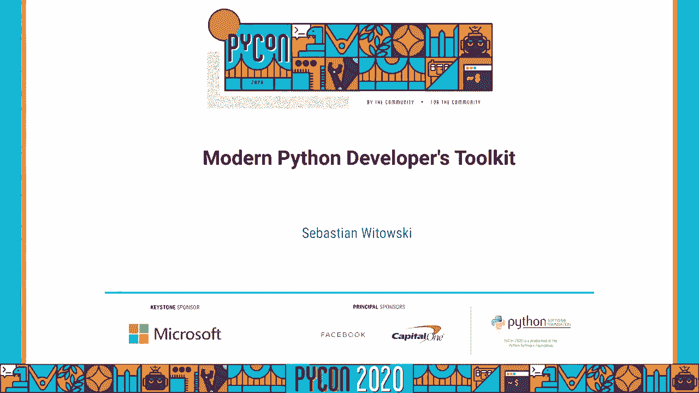

今天，我将教你如何优雅地配置你的 Python 开发环境，如何设置你的代码编辑器，如何管理不同的 Python 版本和 Python 依赖项。希望在本教程结束时，你能对编写 Python 项目感到舒适。所以首先，如果你访问这个网址，你可以找到本教程的材料。

在研讨会上，我会进行很多实时通话和分享一些内容，但你可以在这个网站上找到我将谈论的所有内容，描述得非常详细。那么，我是谁呢？我叫塞巴斯蒂安，我以编写 Python 代码为生。我还教别人如何写 Python。在与其他人交谈时。

我注意到，知道如何编写 Python 代码与实际上能够编写 Python 项目之间存在巨大的差距。即使你知道 Python，当你坐下来编写第一个 Python 网站或 Python 包时，有时你真的不知道从哪里开始。比如，你如何在计算机上更新 Python 版本或安装依赖项。

这样可以确保它们不会与之前安装的其他依赖项发生冲突。这就是我决定举办这个研讨会的原因。如果你已经知道如何编写 Python，但对编写 Python 项目不太自信，或者觉得电脑上的工具可以进一步调整，这正是我们今天要讨论的内容。

开始时，我将向你展示如何设置你的代码编辑器。然后我们将讨论如何管理不同的 Python 版本和 Python 依赖项。接着我们将进行一个简短的练习。然后我们将讨论项目结构以及如何使用一个名为 cookie cutter 的工具。

接下来我们将讨论代码风格，如何使用不同的 REPL 以及如何编写测试和文档，以及你可能想要使用的工具。最后，我们将进行一个小项目。我们将把我之前展示的所有内容整合起来，构建一个小型待办事项应用程序。在最后，我会向你展示如何将你的应用程序用 Docker 部署。

要跟随本教程，你需要安装 Visual Studio Code 编辑器。如果你还没有安装，不用担心，我会告诉你如何获取。你还需要 Docker。所以如果你访问这个网址，你可以获取 Docker 安装文件。如果你使用 Windows 家庭版，我认为 Docker 桌面可能无法正常工作，但如果你。

搜索“Docker Windows Home”，你会找到一些安装教程。最后，你应该安装 Python 3.6 或更高版本。如果你没有，不用担心。我将向你展示一些工具，让你轻松切换 Python 版本。当然，你应该了解 Python 的基础知识。如果你不知道什么是上下文管理器或装饰器。

这完全没问题。你只需要了解基本的语法。至于操作系统，如你所见，我正在使用 Mac OS。所以我向你展示的所有内容在最新版本的 Mac OS 上都可以工作。在 Linux 上也可以，因为它非常相似，你应该能够跟随。至于 Windows，我尝试安装我所讨论的所有工具。有时 Windows 的操作方式稍有不同。

所以如果你在查看此文档，请寻找小 Windows 图标，看看在使用 Windows 时需要做什么不同的提示。我们来谈谈代码编辑器。我将向你展示如何安装和设置 VS Code。因为代码编辑器是每个程序员的基本工具，有些人对此非常敏感。

如果你不喜欢 VS Code，并且对学习如何设置它不感兴趣，随意跳过这一部分。但如果你是初学者，不知道从哪里开始或选择哪个编辑器，VS Code 是一个非常好的选择。我已经使用它超过一年，并对此非常满意。我选择在本教程中使用 VS Code，主要是因为它的受欢迎程度。

如果你查看 Stack Overflow 开发者调查，这是每年 Stack Overflow 进行的一项调查，检查人们使用的技术类型。如果你查看 2017 年的结果，你会看到 Visual Studio Code 在某种程度上很受欢迎，但它并不是最受欢迎的工具。如果我们切换到 2018 年。

你会发现 Visual Studio Code 排在第一位，但 Visual Studio 或 Notepad++的结果几乎相同。如果你查看去年的结果，基本上几乎每个程序员都在使用 Visual Studio Code。还有其他代码编辑器，如 VIM 或 EMACs，它们比 VS Code 更快，提供更多功能。

具有更高的可配置性。所以如果你花足够的时间，你可以真的让它们看起来和做你想要的任何事情。但这里的问题是你必须花时间去配置它们。而如果你安装 VS Code，它从一开始就相当实用。在我看来。

VS Code 在生产力和用户友好性之间取得了很好的平衡。你只需安装它，然后如果你打开一个 Python 文件，它会告诉你，“嘿，看看。这里有一个你可能想用的 Python 扩展。”所以我们安装了它。接着你可以打开一个 Markdown 文件，它会建议你另一个扩展。随着使用。

你可能会安装越来越多的工具，但你会非常高效。

从一开始就是这样。如果你还没有做到这一点，让我们一起安装 Visual Studio Code。我将使用一个全新的 macOS Catalina 安装，这样你可以跟着操作。所以如果你打开浏览器搜索 VS Code，你可以访问这里，你会看到一个链接，指向“为你的操作系统上传安装程序”。因为这是一个干净的安装。

我们会看到很多弹出窗口。一旦完成，打开 VS Code。这基本上就是了。在 VS Code 中你要做的第一件事是安装 Python 扩展。VS Code 默认没有编程语言的扩展。所以如果没有 Python 扩展，我们甚至没有语法高亮，更不用说其他功能了。

正常情况下，打开 VS Code 后，你会看到这个欢迎页面。在这里你可以点击“Python”，它会显示一个小弹出窗口。我们点击“好的”。它会为你安装 Python 扩展。如果你没有这个欢迎窗口，你也可以去扩展选项卡搜索。好吧，现在已经消失了。

但通常你会去扩展选项卡搜索 Python。现在它已经安装好了。如果还没有安装，你会看到一个绿色按钮。现在有了 Python 扩展，我们可以访问一组新工具。我们有 Intel-ESense，所以代码补全和语法检查或代码导航。

如果你想去查看一个函数的定义，现在可以了。我们还可以访问代码检查和格式化工具。所以如果你打开一个 Python 文件，VS Code 会提示你安装，比如说，一个 linter，它会检查你的代码是否有错误。我们还有一些调试工具可以启用。

例如，对于 Django 或 Flask 应用程序。我们还可以检测 Python 环境并自动启用虚拟环境，稍后我们会讨论这些。所以让我们尝试打开一个 Python 文件。我有一个示例“Hello World”。如果你打开一个 Python 文件，你可能会收到一个建议，提示 linter 没有安装。

所以虽然 Visual Studio Code 会建议“pylint”，但我会建议一个稍微不同的。我将安装 Flake 8。一旦你点击它，你会收到另一个弹出窗口。因为我使用的是全新的 Mac 安装，所以没有安装 pip。通常在你的计算机上安装 Python 时。

它还会安装 pip。但我实际上还没有在这个 Mac 安装上安装 Python。所以我只有 MacBook 自带的 Python，没有其他依赖项，比如 pip。如果你和我在同样的情况，且没有安装 pip，稍后在本教程中我会给你展示一个工具，你可以用它轻松安装新的 Python 版本。

与此同时，我将去 Python 网站安装 Python 版本。这样我就可以将 linter 添加到 Visual Studio Code。现在我已经安装了另一个版本的 Python。我必须告诉 VS Code，你的代码实际上要使用它。所以为此，我们可以点击这里的 Python 版本，查看不同的 Python 版本列表。

我现在使用的是一个非常过时的 Python，来自 Mac。而我想使用 Python 3。7 或者他们刚刚安装的版本。所以我只需点击它，你可以看到版本已经在这里更改。再一次，我们收到这个弹出窗口。提示 linter 尚未安装。如果你没有收到这个弹出窗口，且不知道如何安装 linter。

你可以关闭这个文件然后重新打开。但一个更好的方法是打开命令面板，选择一个名为 linter 的命令。在这里我们可以点击 Python 选择 linter。这里我们选择 flake 8，然后我们会得到弹出窗口。所以 Visual Studio Code 将在你的计算机上安装 flake 8 包。

这不是完美的解决方案，因为它没有将其与电脑上的其他依赖项分开。所以稍后我将向你展示一个更好的方法。但现在仅为说明目的，让我们这样做。如果你在想我们刚刚安装的 linter 工具是什么，它是一个工具。

这将帮助你找到代码中的一些错误。例如，如果你导入了一个模块或一个函数但未使用，linter 会发出警告。如果你尝试使用一个未定义的变量，或者将断点语句放在循环外，linter 也会发出警告。例如。

如果在我们简单的 hello world 中忘记了闭合引号，我们将会出现错误。你可以悬停查看这是一个语法错误。然而，由于 Python 不是一种静态类型语言，linter 不会检测出你代码中的所有问题。如果你尝试，例如，将字符串添加到一个整数。

linter 将不会检测它，但如果你运行你的程序，它会失败。我建议你做的最后一步是将代码命令添加到你的终端。这样，如果你在终端中输入代码加上文件或文件夹的名称，你将自动在 VS Code 中打开它。为此，你需要打开命令面板。

搜索 shell 命令，安装，路径中的代码命令，然后运行它。它会要求你输入密码，我们有信息显示它将成功。我们使用快捷键打开命令面板，VS Code 还有一些你会经常使用的快捷键。让我们来看看其中的一些。

所以你已经知道命令面板，这基本上给你一个在 VS Code 中可用的所有命令的列表。接下来我们有“转到文件”，所以我们可以快速打开当前项目中的任何文件。如果我输入 blueprint，我可以去蓝图。接下来我们有“转到符号”。符号是当前文件中的所有函数、方法、变量和模块。如果我们按冒号。

VS Code 将把它们分组。因此，我们将把类放在顶部，然后是方法，最后是变量。如果我们到达那里。是的，另一个有用的快捷键是控制空格。所以如果你正在输入代码，你会得到这个自动补全。但是如果因为某种原因它消失了，你想把它找回来。

一种方法是实际删除代码，然后希望它会再次出现。但更好的方法是使用快捷键触发自动补全。因此，默认情况下应该是控制空格，但似乎它不起作用。所以如果我们打开键盘快捷键并搜索建议，我们可以看到除外。

从控制空格中，还有选项逃脱也可以触发这个。所以我们来试试这个。所以我们有了自我，然后，是的，它有效。如果你想查看一个函数的定义，可以按 F12，这将打开一个带有定义的新文件。如果你的键盘上没有 F12。

你也可以按命令键，然后单击函数名。如果你不想打开新文件，可以按选项键，然后 F12，这将打开一个小窗口，显示当前文件中函数的定义。最后，如果你在定义中，想要查看这个函数被使用的所有地方。

你可以按 shift 和 F12，这将显示一个列表，列出这个函数当前被使用的所有地方。如果你想了解更多关于 VS Code 提供的快捷键的信息，可以去。

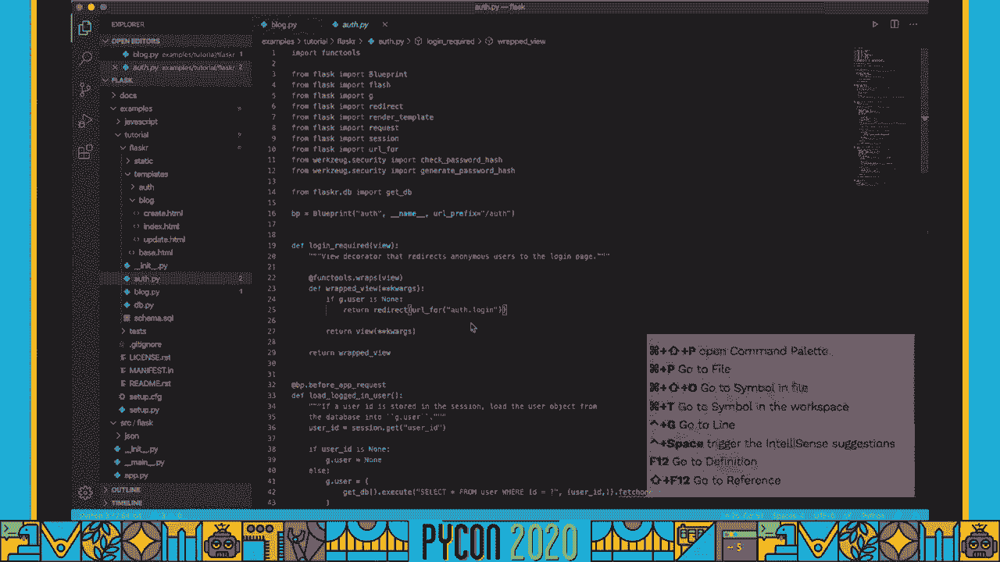

文档的键盘快捷键部分有一个可打印的快捷键列表，你可以下载它。当然，VS Code 还有更多在此列表中显示的快捷键。因此，如果你打开 VS Code 并进入键盘快捷键，你会发现几乎每个在 VS Code 中的操作都有一个可以分配给它的键盘快捷键。最后。

如果你是从其他代码编辑器迁移到 VS Code，那么你会有一些插件，它们会将键盘绑定更改为你之前代码编辑器的绑定。这样，你就不必从第一天起重新训练你的肌肉记忆，你可以慢慢适应新的键盘绑定。

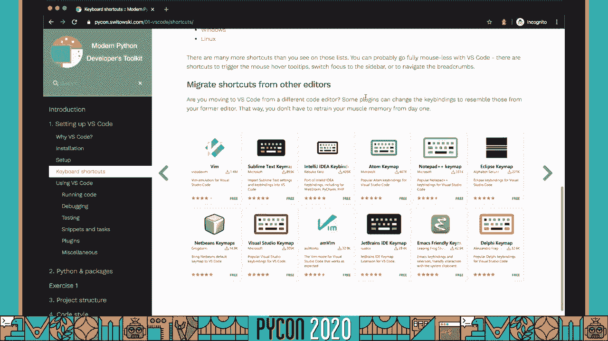

让我们谈谈如何使用 VS Code。VS Code 相当简单。你按下字母 A 输入 A。你按下字母 S 输入 S。你按下字母 D。我只是开个玩笑。如果你有一个文件，并且它是一个独立文件，比如脚本或模块，所以不需要像 Flask 或 Django 应用程序那样的网络服务器，你可以直接在终端中运行它。

与 VS Code 一起提供的。你所要做的就是搜索“在终端中运行 Python 文件”，并运行这个命令。如你所见，我们在这里得到了输出。此外，你也可以直接按绿色箭头，它也会在终端中运行整个文件。如果你想在终端中只运行代码的一部分，你可以选择它并搜索“在 Python 终端中运行选择”命令。

这将打开一个 Python REPL 并运行你代码中的一行。你也可以选择代码并按 Shift+Enter 达到相同的效果。如果你想运行一个 Web 应用程序，事情会变得更复杂。当然，你可以始终从终端运行它，但也许你不喜欢在它们之间切换。

VS Code 和终端。所以假设你在一个名为 uppy 的文件中有一个非常简单的 Flask 网络应用程序。确保你使用 pip 安装了 Flask，然后切换到构建终端。记得可以用反引号命令触发它，运行 Python 或者实际上是 Python 3，在我的情况下是`-m flask run`。这将为你的 Flask 应用程序启动一个开发服务器。好的。

所以这是一个相当糟糕的建议。你可以从终端做同样的事情。由于 VS Code 有很多按钮，肯定有一个可以用来为我们启动服务器。如果你打开调试面板，就是这个有虫子和播放按钮的，点击它可以创建一个 launch JSON 文件。接下来，你必须从这个列表中选择 Flask，因为这是一个 Flask 应用程序。

我们按下回车键，就会得到一个 launch JSON。让我们停止服务器，并实际上使用这个 launch 文件来运行我们的 Flask 应用程序。如你所见，现在在运行面板中，我们有一个用于 Python Flask 应用程序的小绿色箭头。如果我们按下它，VS Code 会做很多事情，并且抱怨找不到 uppy 文件。为了解决这个问题，我不得不把我的应用移动到与 launch 文件相同的文件夹中。

JSON 文件是什么？所以如果我们现在去运行面板，再次尝试运行 Flask，我们可以看到这次它正确地启动了开发服务器。从 VS Code 启动 Flask 服务器的一个好处是它实际上以调试模式启动它。那么这意味着什么呢？好吧，假设我们有一些更多的代码。

如果你将鼠标悬停在编辑器左侧的数字上，你会看到一个红点。你可以点击它，将一个断点放在那一行。如果你现在启动服务器并在浏览器中打开网站，那么如果代码执行到那个断点，你的界面将显示很多新信息。

这个小边框表示代码执行已停止的位置。所以你可以看到我们在这个断点处停止了。这里只有一个断点，但如果我们放置多个，代码执行将会在每个断点处停止。在左侧，你可以看到当前变量的列表。我们这里只有局部变量。

但如果我们有一些全局变量，它们也会在这里显示。下面是监视区。你可以在这里添加一些表达式，VS Code 将会打印它们的值。如果你知道哪个变量有错误，并且想要查看这个变量如何随时间变化，这很有用。下面是调用堆栈和活动断点的列表。

在主窗口的顶部，你可以看到调试工具栏。它有典型的调试器按钮，可以让你继续执行。你可以逐步执行下一个函数。你可以进入或退出一个函数。你可以重新启动整个调试会话，也可以停止调试器。最后。

在底部你有一个调试控制台。你可以用它来执行任何 Python 代码。让我们停止调试器。VS Code 为运行测试提供了一个很好的界面。默认情况下，它不可见，尽管 Python 扩展有时会询问你是否想配置它。如果没有，这就是你如何启用它。

打开命令面板并运行 Python 配置测试。它会询问你想选择哪个测试框架，我将选择 PyTest，然后选择你存放测试的位置。在我的情况下，这是根目录。如你所见，PyTest 还未安装，所以 VS Code 将会为你安装它。同时。

它在问我是否想安装它。不，因为它已经存在。现在你可以看到我们有这个魔法药水图标。如果我们点击它，将会打开测试的侧边栏。一开始，这里没有太多内容。让我们看看我们有什么样的按钮。我们有一个按钮来重新运行所有测试，调试测试，发现测试。

显示测试输出，然后收起所有。我们对这个发现测试感兴趣。所以如果你点击它，VS Code 将会遍历所有文件并尝试查找测试。在 PyTest 的情况下，它会查找每个以 test 开头的文件，然后搜索每个以 test 开头的函数，并假设这些就是测试。

现在，如你所见，我们有三个测试，这里有问号，因为 VS Code 尚未运行这些测试。如果我们尝试运行它们，将会花费一些时间，正如你所看到的，两个通过了，一个失败了。你可以将鼠标悬停在测试名称上，你会看到我们的减法有问题。所以我们可以在这里放置一个断点，然后调试这个测试。

在这种情况下，这并没有给我们太多帮助，因为我们没有变量或其他可以调查的东西。但至少我们知道问题在哪里。因此我们停止调试，如果修复了测试，我们可以重新运行，是的，所有测试都通过了。如果你想运行一个单独的测试。

你可以从侧边栏进行此操作，或者你可以按测试函数上方的运行测试。让我们谈谈片段。一旦你安装了 Python 扩展，如果你在 Python 文件中开始输入，你会看到两个提示和一些建议。这只是自动完成告诉你，“嘿，我看到你试图。

输入一个函数。我可以放置这个函数的骨架来加快速度。如果不小心关闭了这个工具提示，可以通过按控制空格键或在我的情况下，选项逃键来恢复。每个片段在代码中都有一些位置，你可以使用 tab 键在这些位置之间切换。

一旦你遍历了所有位置，你将结束在代码的末尾。假设我们想写一个函数，我不知道为什么我得到这个类。啊，来了。这就是全部。你可以写自己的片段。如果你觉得有某段代码需要反复输入，并且想节省几次按键，可以去命令面板。

选择配置用户片段。在这里，你将看到特定编程语言的所有片段。如果我们为 Python 设置，你将看到一个文件，在其中可以定义将用于 Python 文件的片段。现在没有片段，只有一个如何创建片段的示例。出于某种原因，在每个文件中。

示例是相同的，适用于 JavaScript。但让我告诉你如何快速创建一个片段。假设我们想创建一个片段，将断点放入我们的代码中，而我们又不使用最新版本的 Python。因此我们不能仅仅写断点。我们想要的是一个片段，当输入调试语句时会被触发。

它将转换为导入 PDB 和 PDB 设置跟踪。那么你如何获取这个呢？好吧。首先，让我们摆脱这个。取消注释示例。首先我们定义片段的名称。这个名称将显示在自动完成建议中。因此我们将我们的片段命名为调试器片段。哦，也许是断点。没错，无法输入。

接下来我们需要定义将触发我们片段的前缀。我们希望当我们输入调试器时触发片段。因此我们可以输入调试器，但也许我们并不总是记得它是调试器。有时我们只输入 PDB，我们也希望在这种情况下触发片段。

因此，前缀可以接受不同值的列表。让我们添加 PDB。接下来是片段的主体。符号和数字定义了如果你按下 tab 键，光标将跳转到哪里。在我们的例子中，我们并没有确切想要放置光标的位置。因此我们就把 PDB 语句放在这里。放入 PDB，PDB 设置，trace。

最后，我们有一个描述。这是可选的，但它也会在自动补全中显示。让我们在这里写一些内容。放一个 PDB 断点。好吧，让我们保存它并测试我们的片段。因此，如果我输入 debug，你会看到在第一位有我们的调试器片段。

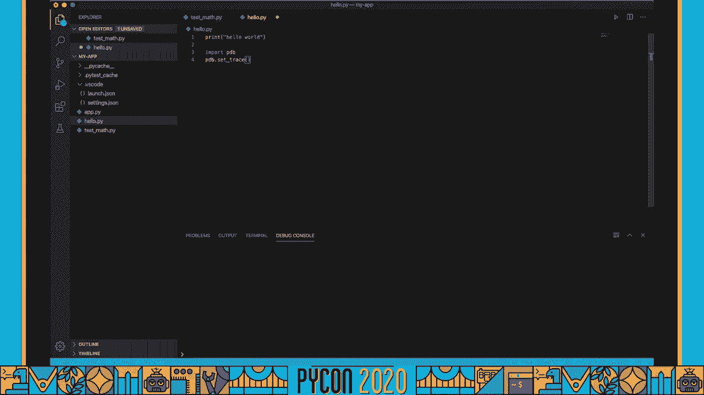

我们刚刚使用的片段非常基础，但你可以编写相当复杂的片段。例如，你可以使用特殊变量。你可以在这里找到一个完整的列表，比如文件名、行号，还有当前日期。你可以进行一些正则表达式转换，甚至可以将快捷键绑定分配给一个片段。最后一个我想展示的功能是任务。

如果你有一些用于不同编程语言的常见文件，例如 make 文件、ground、gulp、aunt、jc rake 或 ms build 文件，VS code 可以检测到。

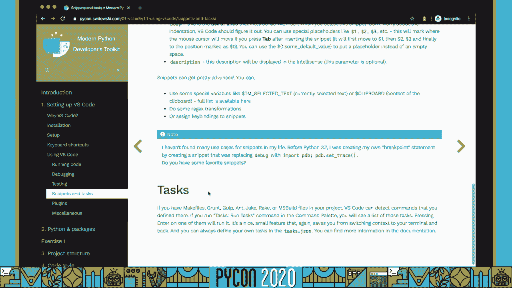

这些文件中的注释。例如，这里我有一个包含一些脚本的打包 JSON，如果我选择运行任务，我可以说显示所有任务，在这里你可以看到我的任务列表。此外，在侧边栏中我也可以在这里找到它们。你可以按这个箭头来运行这个任务。好吧，这个建议实际上并不适用于 Python，因为 Python 没有任务文件。

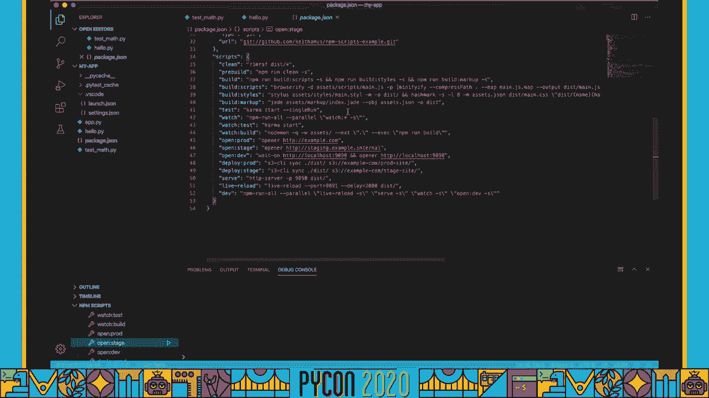

如果你想定义一些任务，例如你可以使用一些预定义的设置来运行任务。你可以创建一个 tasks.json 文件，并在其中定义你的 Python 任务。你可以在这个文档中找到更多信息。我们几乎完成了对 VS code 的简短介绍，但我还想给你展示。

我正在使用的一些插件。有些插件非常明显，有些则不太明显，因此也许你会觉得它们有用。第一个插件是用于 Python 编程语言的。这可能是你写 Python 代码时唯一需要安装的插件。如果你使用其他编程语言，你也会找到相应的扩展。

对于 C++，对于 Rust，针对 Go。如果你在使用 Django 或 Flask 或任何其他框架，你可能想要安装一个插件来支持该框架。例如，如果你安装 Django 的插件，它会添加一堆片段，使你的生活更轻松。不仅如此，它还会为框架特定的文件提供语法高亮。例如，如果你在 Django 中有模板文件，结合了 HTML 和 Django 文本，那么它。

将为这些文件提供合适的语法高亮。接下来我们有 Intelli code。如果你安装了 Python 插件，你将获得代码补全。但如果你安装 Intelli code，你会得到稍微智能一些的自动补全。如你所见，Intelli code 试图预测你实际需要的函数，并且它会。

用星号将这个函数放在列表的顶部。这是文档中的一个例子，有人使用 TensorFlow，而 IntelliCode 很成功地预测出在这种情况下需要的下一个函数。下一个是 Emmet，从技术上讲它不是一个扩展，因为它已经集成在内。

在 VS Code 中。但如果你在写大量的 HTML 和 CSS，我强烈建议你看看 Emmet 的工作原理。如果你掌握 Emmet 的基础知识，可以用简单的快捷键快速编写大量 HTML 代码。接下来是 AutoDoc string。这不是一个非常流行的插件，但我喜欢它，因为它使我为函数编写文档的速度大大加快。所以如果你写一个函数，然后在下面放三个双引号并按下回车。

它会自动生成文档的框架。如果你在函数中注释参数，它还会正确检测类型并将其移到文档主体中。下一个我非常喜欢的扩展是书签。它允许你在代码中标记一个位置，以便你可以轻松地在现有书签之间切换。

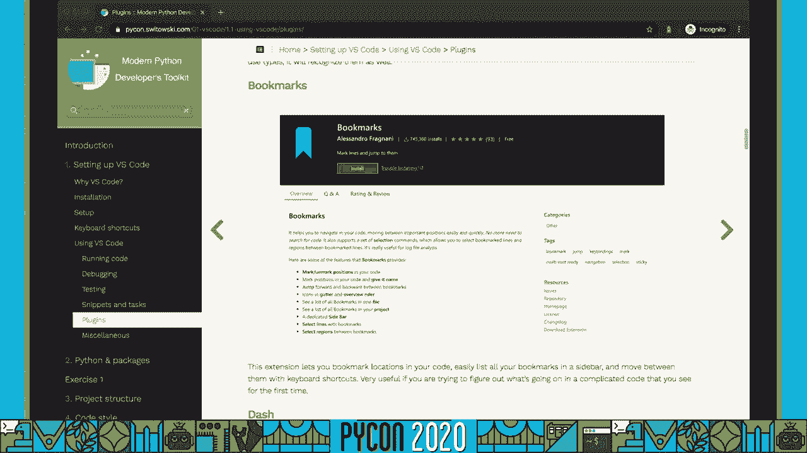

书签。我觉得在处理新项目时非常有用，这样我可以弄清楚发生了什么，或者在大型文件中需要在同一个文件的不同地方跳转，以查看不同函数的定义。例如，如果我在这里放一个书签，然后去代码中的其他地方，我可以使用一个。

快捷键会自动返回到这个书签。而且它还支持在不同文件中的书签。所以如果我在这里放一个书签，可能还在这里放一个书签，我可以使用命令 bookmark list 来查看所有文件中的书签列表。

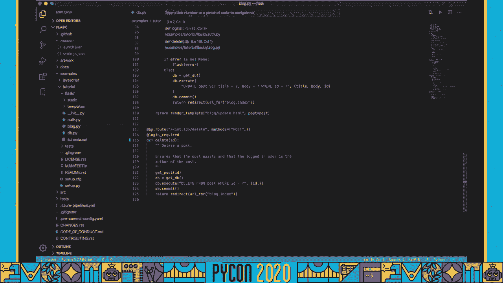

下一个扩展是 Dash。我不常用，但如果你在没有互联网的地方工作，它非常有用。Dash 扩展是一个工具的包装器，允许你离线保存文档。例如，你可以保存 Python 或 Django 的文档，如果你在没有互联网的地方工作，可以用它代替。下一个扩展是 error lens。

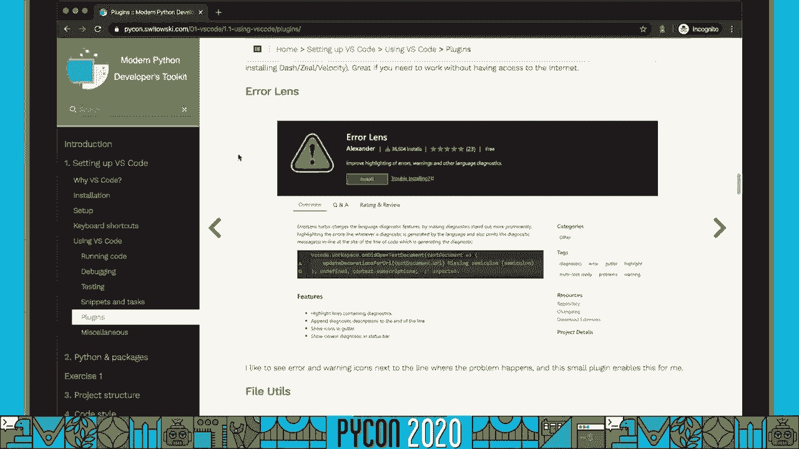

如果你的 Python 代码中有一些错误，你会看到一个波浪线，但使用 error lens。

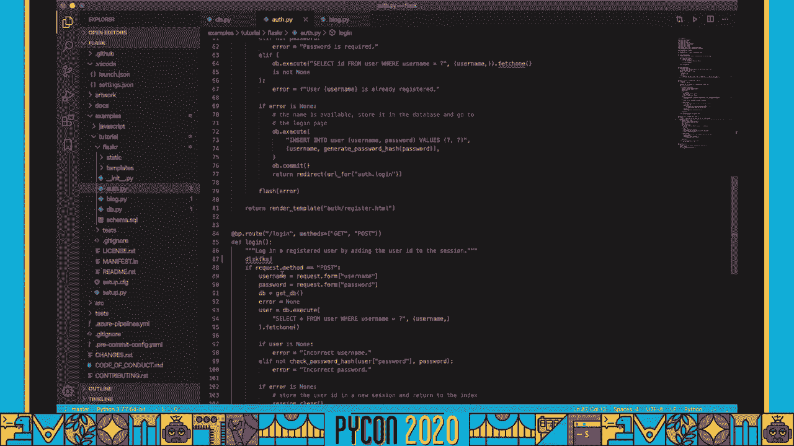

你还会在边缘看到一个小图标，表示这里存在错误。

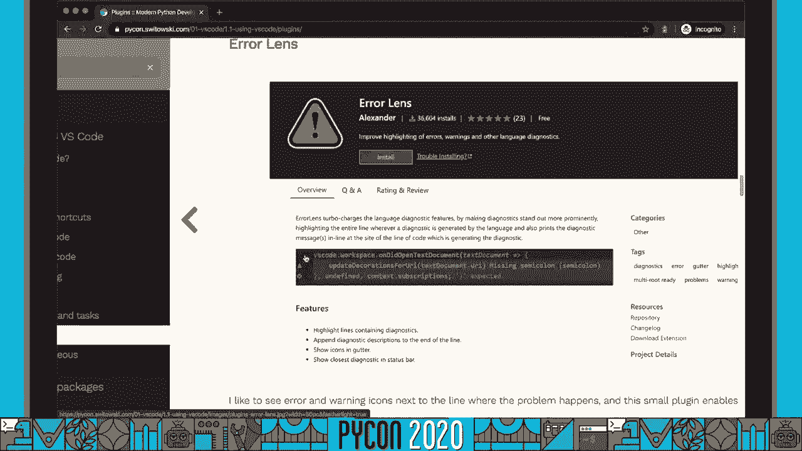

所以我非常喜欢它，因为我可以通过扫描边缘快速看到哪里有一些错误。而且你也可以进行配置。默认情况下，它会在代码中错误发生的地方显示错误消息，但正如我所说，我喜欢将其更改为在边缘显示图标。

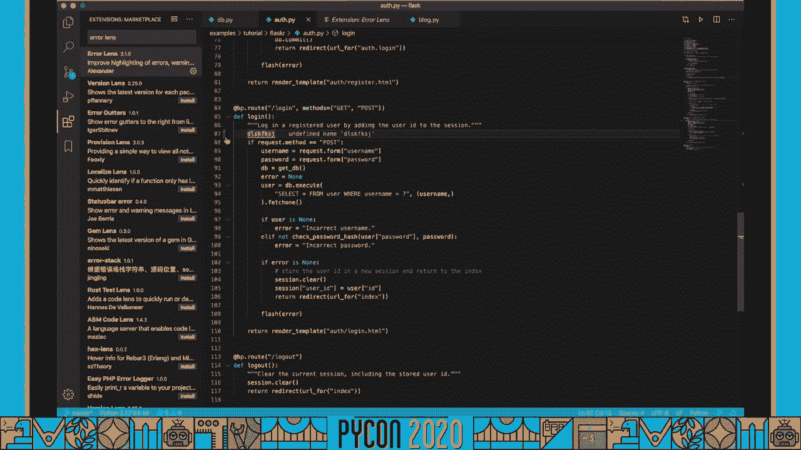

下一个扩展是文件工具。它添加了一些与文件相关的新命令，比如重命名、移动或复制。

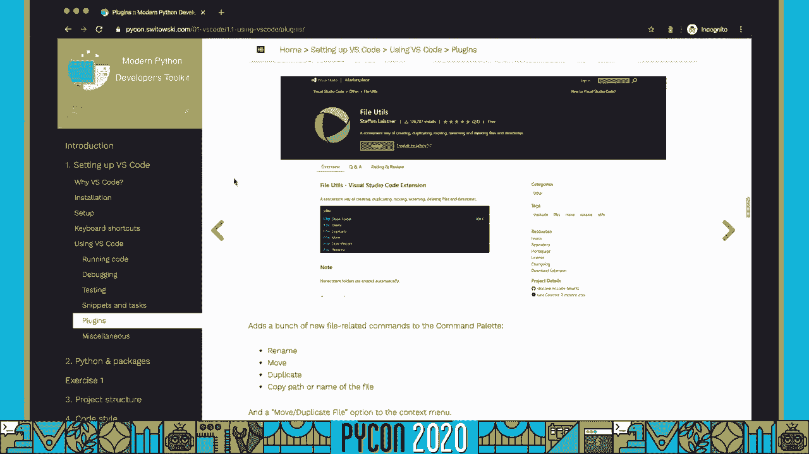

所以如果你试图例如复制一个文件或移动它，你不会在这里看到选项，但是。

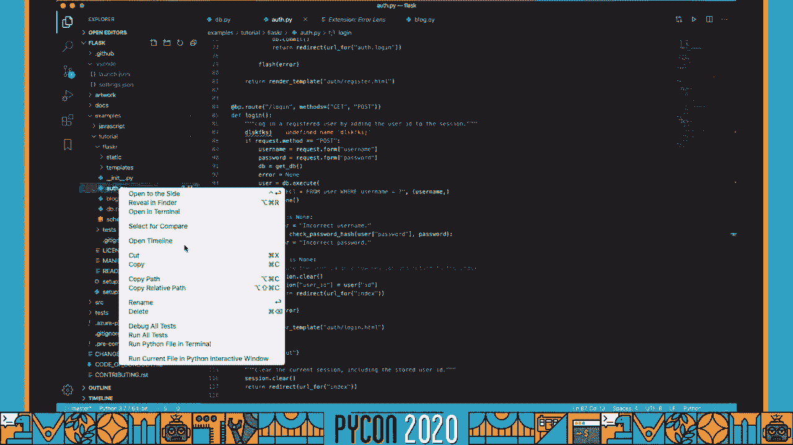

如果你安装文件工具，你会在侧边栏中看到这些选项。

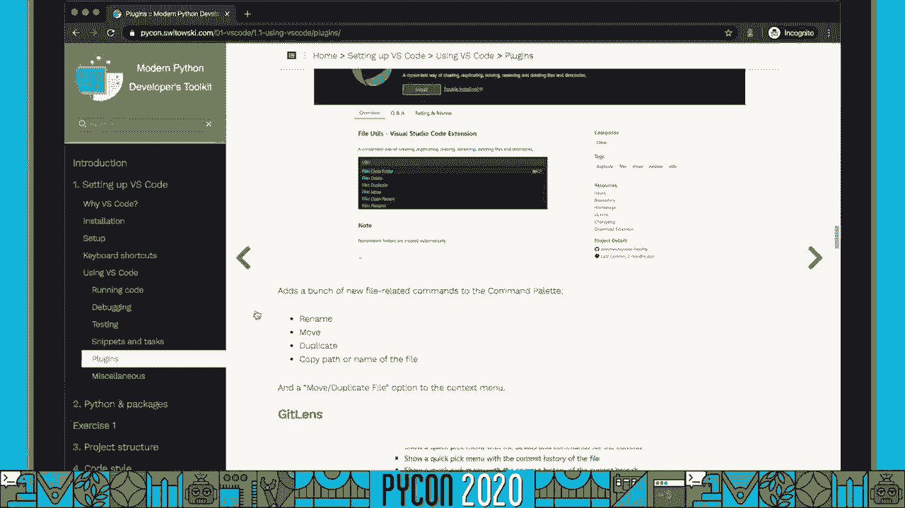

下一个扩展是 git lens。git lens 是一个拥有大量与 git 相关附加功能的强大扩展。安装后，你可以看到每行的注释，了解是谁修改了这一行。你还可以看到文件级别的注释。在状态栏中也能看到 git 状态，并可以切换 git blame 视图。你还会得到一个包含许多与 git 相关信息的新侧边栏。

例如，如果你的分支落后于或超前于某个远程分支，你可以查看分支、贡献者、传入活动、存储、标签，功能非常多。

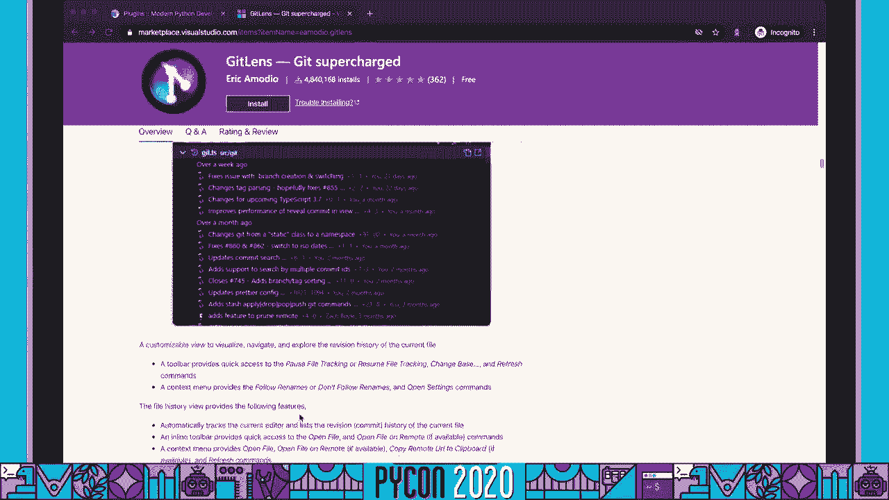

我觉得我甚至没有使用 10%或 20%的功能。接下来是 jumpy 或 metago。这两个扩展非常相似。

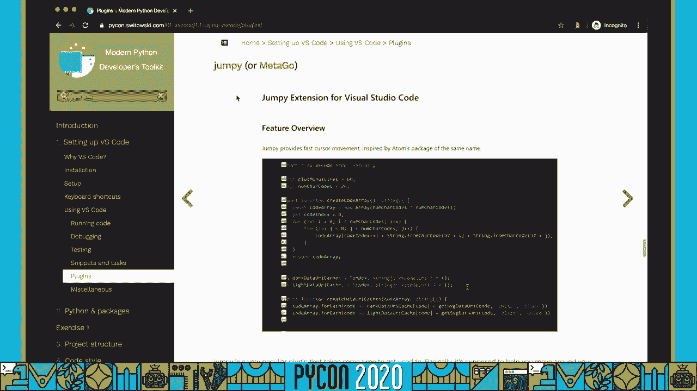

它们的作用是帮助你快速在代码中移动。让我们来看一个例子。如果我在代码中，想要跳到某个地方，我可以使用鼠标或按几次方向键，但如果你不喜欢用鼠标，这就不太方便。那么，jumpy 的作用就是定义一个我可以按下的键盘快捷键，这样就能。

分配一个两字母的快捷键，以便快速到达当前屏幕上的任何位置。所以如果我想去我的密码那里，我需要按字母 I 和 O，这样我就到了。如果我想去其他地方，我可以按 JF，这样我就到了。一旦你习惯了 jumpy，移动代码就非常快速。

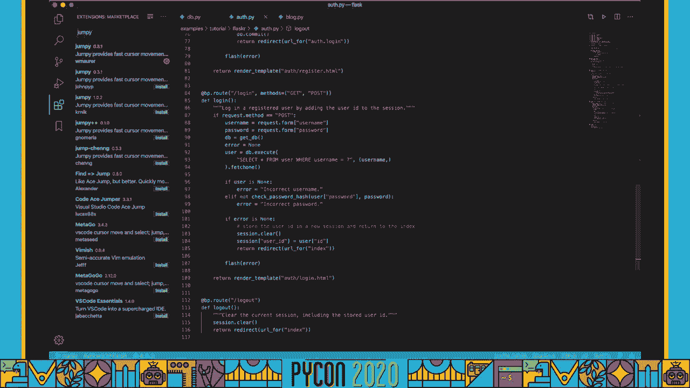

接下来是粘贴并缩进。如果你发现 VS Code 在粘贴一些代码时效果不好，你可以。

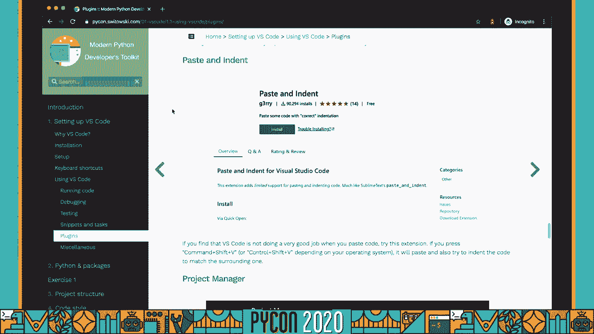

你可以尝试这个扩展。它对 Python 非常有用。让我们看一个例子。假设我想将这段代码复制到这里。如你所见，默认情况下效果并不好。如果我这样复制，那效果就更差了。所以我必须去这里进行缩进。

到这里，然后到那里。所以如果你不喜欢手动缩进行，可以使用这个扩展。它会给你一个名为“粘贴并缩进”的命令。你需要打开键盘快捷键，进入用户快捷键，然后给这个动作分配一个快捷键。我使用的是命令加 shift 加 P，尽管 VS Code 抱怨它无法识别。

这个命令是因为粘贴并缩进是一个非常老的扩展，三年来没有更新。因此即使我们收到这个警告也不要担心，它会正常工作。如果我们回到这里，先删除它。再试一次。我们复制这个，然后去这里粘贴。所以如你所见，效果更好，但仍然不完美，因为我们需要缩进这一行。

但至少我们得到了一个不错的行为，粘贴的文本会被选中。因此默认情况下你是得不到这个的，你需要去偏好设置。你需要进入用户设置，并添加这一行。确保在粘贴代码后，这个扩展也会选中它，以便我们可以。

按下 tab 键来缩进，或按 shift tab 来减少缩进。

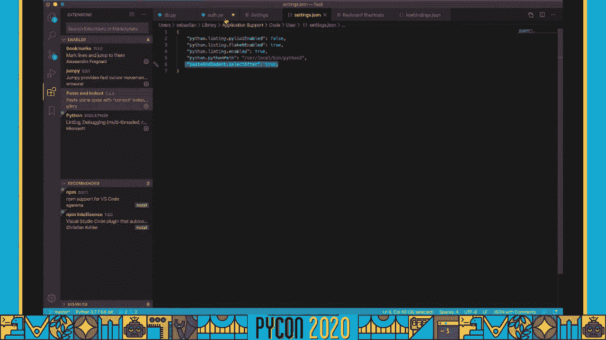

所以这是一个非常不错且实用的扩展。如果你在电脑上同时处理多个项目，那么你可能已经知道 VS Code 中的工作区概念。这是一个将一些文件或文件夹组合在一起的方式，以便你可以轻松地在它们之间切换。

但是使用工作区时，你必须在某个地方存储它们的配置，有时你并不知道把工作区配置保存在哪个文件夹里。因此我喜欢项目管理器扩展，因为它消除了这个麻烦。基本上，它只创建一个文件，存储你不同文件夹的路径。

然后它给你一个不错的侧边栏，你可以用来在项目之间切换。快速简便的文本选择是一个小工具，它让你为不同类型的选择分配快捷键。如果你想选择单引号、双引号、括号、尖括号或大括号内的所有文本，你可以用快捷键做到这一点。

我非常喜欢这个，因为 VS Code 并不原生支持这些不同的选择。设置工具是你真的想要的扩展。它允许你在不同的电脑之间同步 VS Code 的设置。它的工作方式是将其连接到一个私有的 GitHub 存储库，然后你导出你的设置。

然后如果你丢失了电脑或者换了另一台电脑，你可以轻松地下载设置。 我认为在即将发布的 VS Code 版本中，设置同步将会内置。To do highlight 是另一个小工具，用于突出显示我代码中的待办事项或修复我评论，这样我可以轻松发现它们。最后还有 spell right。

很奇怪，VS Code 没有内置的拼写检查器，因此如果你想检查代码的拼写，或者更重要的是检查评论的拼写，这就是你需要的扩展。VS Code 部分的最后一部分是一些杂项提示和技巧的错误。

我在路上捡到的一些东西。所以你可以看一下，也许会发现一些有用的东西。如果你在使用 Docker，那么有一个 Docker 扩展你可能会非常喜欢。它可以让你启动和停止容器，连接到正在运行的容器并使用 shell，或者将 VS code 附加到正在运行的容器上。这非常有用。如果你和一些同事一起工作，想要共享屏幕，或者更好的是。

让他们修改你在 VS code 中的代码。查看实时共享扩展，还有一些小技巧和窍门。

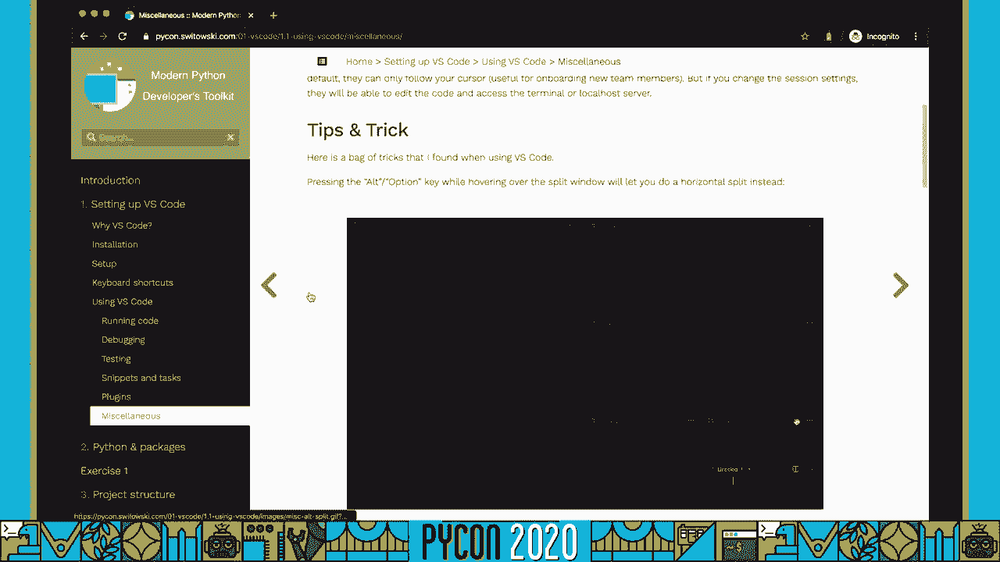

你可以使用 out 键来改变窗口的分割方式。如果你有大纲侧边栏，你可以选择跟随光标，这样你总能看到与主屏幕上所见内容相对应的函数。对于故障排除，如果需要重启 VS code，实际上你不需要关闭它，然后去应用程序再打开一次。可以使用一个命令重新加载窗口，这基本上是为你重启 VS code。

如果你发现显示符号或转到定义停止工作，那么你可以尝试更改自动完成功能。默认情况下，VS code 使用 IntelliSense，但如果你安装了 Python 扩展，你还会获得 Jedi，这是另一个引擎，有时切换引擎会修复显示符号或转到定义的问题。最后，如果你正在使用 Django 或 Flask，并希望在其中设置断点。

你的模板 VS code 可能会混淆，如果你正在编辑的 HTML 文件确实是一个 Django 模板，可能你就无法在那里设置断点。如果你觉得这个问题烦人，你可以更改断点的设置，允许在任何地方设置断点，这样你就可以在任何文件中设置断点。

现在我们已经配置好 VS code，让我们来谈谈如何在你的计算机上管理 Python 和 Python 包。在这一部分，我们将看到如何安装不同版本的 Python，以及如何轻松切换它们，同时也讨论如何为你的项目隔离依赖项，以及你为什么需要关心隔离它们。迟早你需要在计算机上安装不同版本的 Python。

可能会比你想的早。例如，如果你使用的是 MacBook，那么默认情况下你会安装 Python，而你可能会想，这个版本过时了，为什么不直接更新到 Python 3 呢。这是个糟糕的主意，因为你的计算机上有一些软件依赖于这个旧版本的 Python，所以如果你更改它，你可能会破坏一些东西。

在你的计算机上。即使你碰巧在计算机上全局安装了 Python 3，它也可能不是最新版本，你不应该依赖系统范围的 Python。如果你正在处理多个 Python 项目，并希望同时安装不同版本的 Python，这会变得更加复杂。

例如，如果你正在编写一个 Python 库，那么你可能需要在至少几个最近的 Python 版本中测试它，比如 Python 3.6、7、8，可能还有 3.9，你需要有一种简单的方法在这些版本之间切换。你可以用不同的前缀安装每一个，但那有点麻烦。

其实有一个更简单的方法来处理这个问题。在本教程的这一部分，我将向你展示如何使用 Pyenv 安装多个 Python 版本，以及如何轻松切换它们。安装 Pyenv 最简单的方法是使用 Pyenv 安装器脚本。它不仅会安装 Pyenv，还会安装一些额外的插件，比如 Pyenv doctor 来进行验证。

安装是正常的。Pyenv 虚拟环境非常好，因为它是一个管理虚拟环境的插件，我们接下来会讨论以及更多内容。如果我们去 Pyenv 安装器，你会看到推荐的版本是运行这个核心命令。如果你不信任来自互联网的脚本，通常你不应该信任它们。

你也可以使用 Homebrew，或简单地克隆仓库，如安装部分所述。但我打算选择简单的方法。我打开终端，把它粘贴在这里，运行。在安装结束时，你会看到一些关于如何将代码添加到你的 bash RC 文件的说明，或者如果你使用 Z shell 或 fish，稍微会有不同。

但注意这个信息很重要。所以让我们复制这些行并将其添加到我们的 bash RC 文件。最后，我们必须重启终端。为了检查一切是否正常，我将运行 pyenv 命令。但这不工作，因为我使用的是 Z shell 而不是 bash，所以让我们修改 Z shell RC 文件。

再试一次。太好了，如果你在这里看到命令列表，这意味着 pyenv 成功安装。一旦你安装了 pyenv，确保检查 GitHub 上的依赖部分。对于我的 Mojave，它提到了一些可选但推荐的软件包。所以如果你发现使用 pyenv 有问题，请确保安装它们。

你还有其他操作系统的依赖列表。如果你想在 Windows 上使用 pyenv，可以查看 pyenv win 包。它没有 pyenv 的所有功能，但有基本功能，所以你可以安装不同版本的 pyenv 并轻松切换。

如果你在我的 Mojave 上，那么有一个 GitHub 问题解释你需要添加额外的 SDK 头文件。如果你同时运行 Mojave 和 Catalina 版本，那么你不需要这一步。让我们尝试使用 pyenv 安装一个新的 Python 版本。要查看可用版本的列表，我们需要运行`pyenv install -list`。

在这里我们可以看到 pyenv 可以为我们安装的所有版本。顶部是标准的 Python 版本，然后是 anaconda，mini-konda，甚至还有 pipy 和一些其他的东西，比如 stackless。现在我们尝试安装最新版本的 Python，即 3.8.2。当我们谈到依赖关系时，我告诉过你，对于我的 coas，一些依赖是可选的。

在这里，由于我们没有 open SSL，pyenv 正在为我们安装它。完成了。大约花了 10 分钟，所以我真的很高兴我没有尝试实时编码，我可以直接快进。那么现在如果我们运行 pyenv versions，我们可以看到系统的 Python 版本和我们刚安装的 3.8.2。让我们添加另一个版本。如果你没有 open SSL。

readline 或 Z-lib 依赖关系，pyenv 会为你尝试安装的每个新 Python 版本下载它们。所以通常我会使用 homebrew 安装这些依赖。如果我们检查已安装的版本，你会看到我们有两个不同的 Python 版本已安装。如果我尝试运行任何 Python 命令，你会看到我仍在使用内置的 Python 版本。

所以，如果我们想切换正在使用的 Python 版本，我们需要使用 pyenv global 命令。如果你只运行 pyenv global，它会告诉你正在使用哪个 Python。如果你用版本号运行 pyenv global，你将切换到这个 Python 版本。那么现在如果我尝试运行 Python 命令，你会看到它没有改变。

如果这种情况发生在你身上，你需要运行 pyenv rehash。我忘了提到这一点，但在你安装新 Python 版本后，你需要运行 pyenv rehash，以便 pyenv 为你设置一切。那么让我们再试一次运行 Python 命令。瞧，现在我们正在使用最新版本的 Python。

如果我想切换到另一个版本，我所需要做的就是运行 pyenv global 和不同的版本。就是这样，每个 Python 版本都是彼此隔离的，你不必担心如果你尝试安装另一个版本会弄乱什么。那么现在我们知道如何更改我们计算机上的全局 Python 版本了，但还有另一个。

pyenv 的一个酷功能是你可以为特定目录及其所有子目录设置 Python 版本。这是一个很有用的功能，尤其是在你正在处理需要不同 Python 版本的项目时。例如，你有一些仍在使用 Python 2 的遗留代码，而你只希望在特定目录中使用 Python 2。

所以，除了来回切换全局版本，你所需要做的就是运行 pyenv local，这将创建一个 Python 版本文件。Pyenv 总是会在当前目录中查找此文件，如果找到，它将用来确定你想使用哪个 Python 版本。

所以让我们看看这个实际操作。正如你所看到的，我在全局使用 Python 3.8，假设我有一个项目需要旧版本的 Python。所以如果我只想在这个文件夹中使用 Python 3.7，我要做的就是运行`pyenv local`，然后指定一个 Python 版本。这将创建一个 Python 版本文件，里面可以看到使用的 Python 版本。

我们想要使用的。因此，如果我们运行`Python version`命令，你可以看到我们正在使用 Python 3.7，而如果我们离开这个目录，你可以看到全局仍在使用 Python 3.8。这是 pyenv 的一个非常不错的功能，尤其是当你在不同项目中工作时。

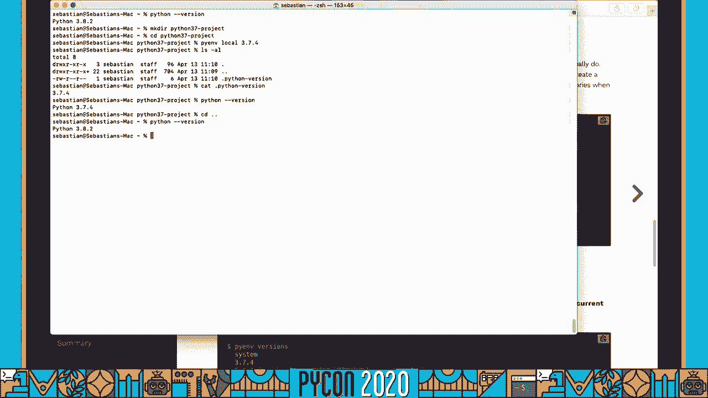

这些项目需要不同的 Python 版本。最后，我想向你展示的 pyenv 的一个功能是如何仅为特定的终端会话更改 Python 版本。例如，如果你想在 Python 2 中测试某些东西，你不必更改。

本地或全局 Python 版本。你要做的就是运行`pyenv shell`命令，并提供版本号。

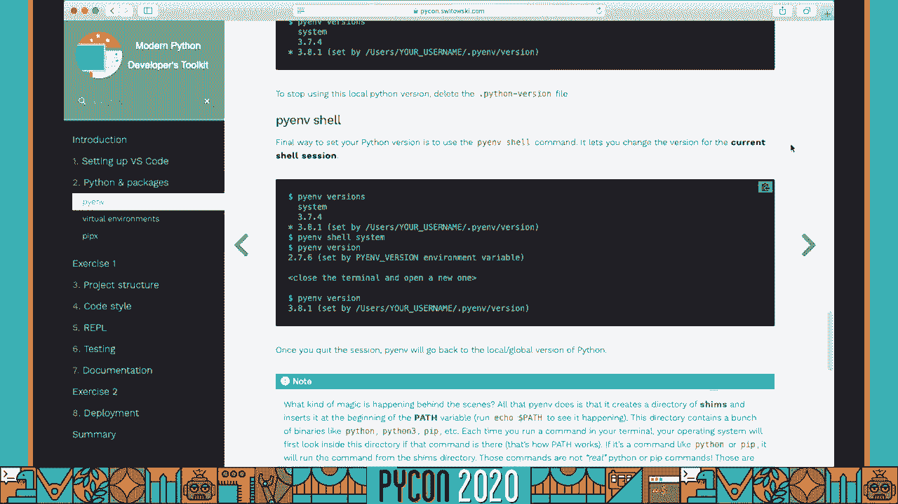

假设我在全局使用 Python 3.8，但出于某种原因我想在 Python 2 中测试一些东西。在我的电脑上，我仍然有安装作为系统 Python 的 Python，因此我可以使用它。这个命令会在我们的终端中启动另一个 shell 会话，所以如果我运行`Python version`，你可以看到我正在使用 Python 2。我们甚至收到警告，Python 2.7 不推荐使用。

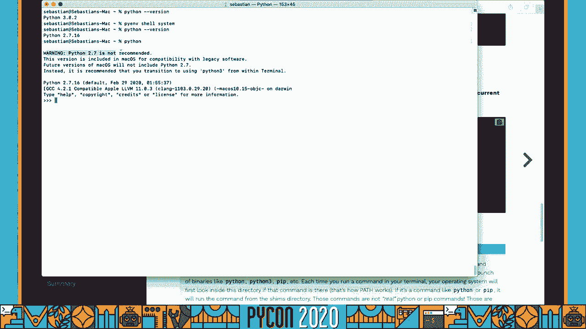

如果你想知道 Python 是如何工作的，以及它是如何安装不同的 Python 版本而不干扰你电脑上的任何东西，实际上它所做的就是创建一个 shims 目录，并放置一些二进制文件，如 Python、pip、Python 3.0，然后将这个目录插入到你的路径变量的开头。因此每次你运行像`Python`或`pip`这样的命令时，你的电脑就会从这个 shim 目录中获取二进制文件，而不是使用系统。

广泛命令将从这个 shim 目录中获取二进制文件。而这些二进制文件甚至不是真正的 Python 命令，它们只是一些脚本，会确定你想要使用的当前 Python 版本并调用该版本的二进制文件。

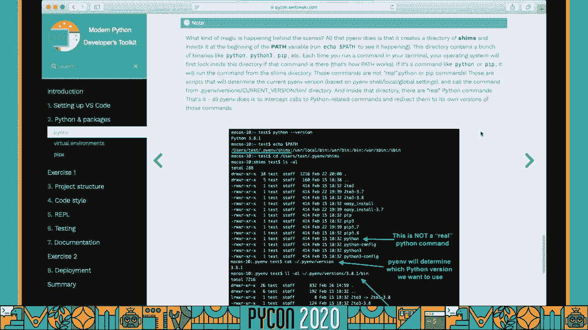

创建一个 shim 目录并将其添加到路径变量开头的这个想法并不新颖。如果你使用其他编程语言，你可能已经知道 ErbN、NodeN 或 GoN，它们做的正是相同的事情，但针对不同的编程语言。如果你在多种语言中编程，可以看看 ASDFVM。

这是一种管理不同编程语言不同版本的工具。

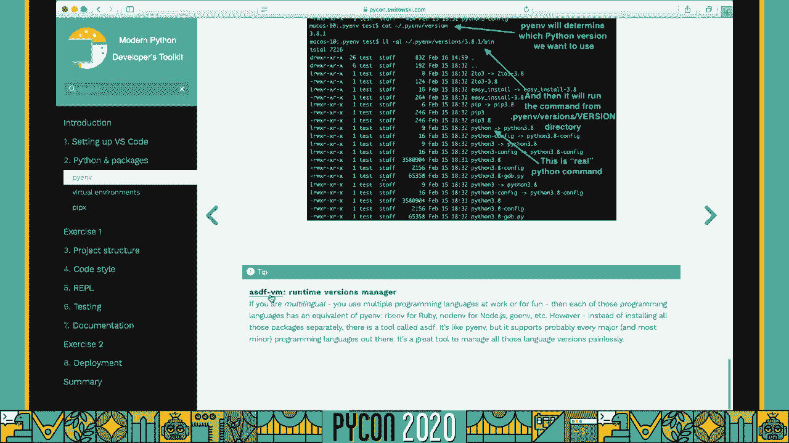

因此，如果你使用它，就不需要单独安装 `pip`、`node`、`erb`。使用 `pip` 我们解决了一个问题，即如何轻松切换不同版本的 Python。但即使你一直使用相同版本的 Python，你还会面临另一个问题：管理 Python 依赖关系。Python 有一个大问题，即你不能安装同一包的多个版本。

因为每个包都安装在同一个目录下，所以你不能同时安装 Django 2 和 Django 3。每次运行 `pip install Django` 时，`pip` 会检查 Django 是否已经安装在你的计算机上。如果没有，它将安装最新版本。你也可以指定你想要的版本。

例如，如果你想要 Django 版本 2，你需要运行 `pip install Django==2`，然后 `pip` 会首先检查你的计算机上是否已安装该版本的 Django。

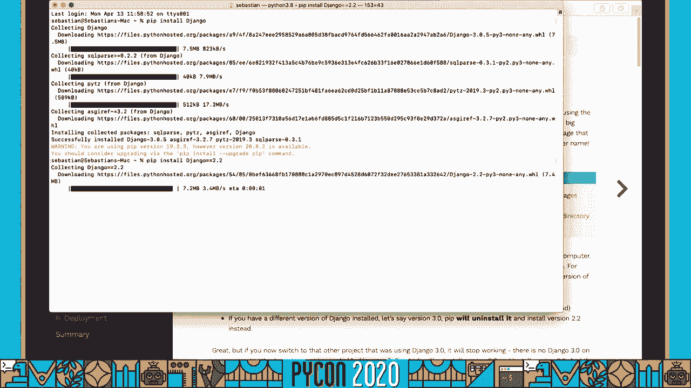

如果你没有安装，也没关系，`pip` 会为你安装它。如果你有不同版本的 Django，比如版本 3，`pip` 会首先卸载它。

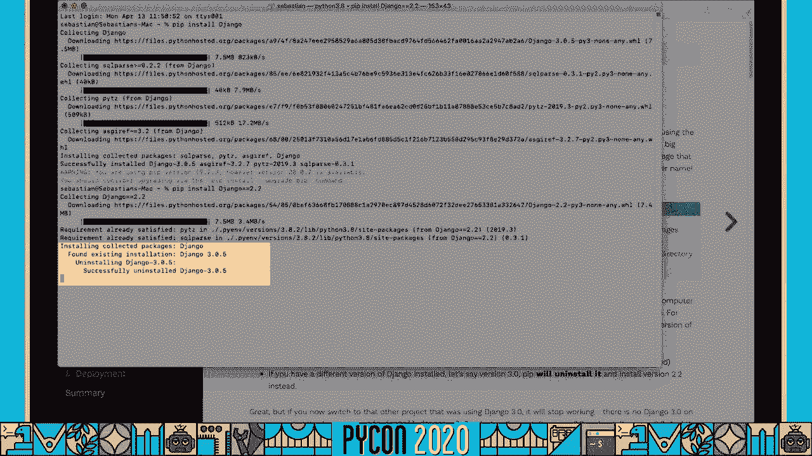

然后安装版本 2。很好，现在你有了版本 2，但如果你切换到使用版本 3 的另一个项目，它将停止工作。你的计算机上不再有 Django 3。所以你可以运行 `pip install Django==3`，这将卸载 Django 的版本 2。每次切换项目时，你都在卸载一些依赖并重新安装。

不同版本的问题会让你有多个项目时更加麻烦。为了解决这个问题，我们可以使用虚拟环境。虚拟环境会在你的路径变量中添加一个包含一些二进制文件的文件夹。因此，每次你运行 Python 命令时，你将自动使用来自该虚拟环境的 Python 和包。

在这个文件夹内，如果你运行 `pip install`，你将安装的包不是全局的，而是在这个虚拟环境内。使用虚拟环境的主要思想是，每个 Python 项目应该使用单独的虚拟环境。这样，你就不会混合依赖。如果你使用 Python 3.3 或更高版本，你不需要安装任何东西来使用虚拟环境。

已经有一个名为 `venv` 的内置模块，我们可以用它来创建虚拟环境。要创建一个新的虚拟环境，运行 `python -m venv`，然后指定虚拟环境的名称。这将创建一个目录，其名称与虚拟环境名称相同。在这个目录内，你可以看到有一堆文件和文件夹。

我们真正感兴趣的只有一个，它在 bin 文件夹内，名为 `activate`。当我们运行它时，它会激活这个虚拟环境。你可以看到，现在我们在终端显示了虚拟环境的名称。所以这是一个很好的方式来检查我们当前是否在使用虚拟环境。

现在我们处于一个隔离的环境中。如果我们用 peep 安装一些包，它们不会全局安装，而是安装在这个文件夹中。让我们试一下。假设我们想安装 flask。如果我们运行 `peep freeze` 来查看已安装包的列表，你可以看到我们在这里有 flask 及其依赖项。要停止使用这个虚拟环境，我们只需运行激活命令。

现在我们没有使用任何虚拟环境，所以如果我们尝试列出 peep 包，你会发现没有全局 peep 包。如果我们尝试运行 flask，我们会收到一条消息，提示 flask 未安装。假设我们有另一个项目，使用不同版本的 flask。那么我们就创建另一个虚拟环境。现在让我们安装 flask 的旧版本。

正如你在这里看到的，我们使用的是不同的 flask 版本。这就是关于虚拟环境你需要知道的所有内容。每次开始新项目时，创建一个新的环境，使用 peep 在其中安装包。当你停止这个项目的工作或想要切换到另一个项目时，只需停用环境。

除了内置的 `vnth` 模块，还有一些其他工具可以使使用虚拟环境稍微容易一些。例如，如果你使用这个 `pyenv installer` 安装了 `pyenv`，那么你也安装了 `pyenv virtualenv` 插件。因此，你可以使用它来创建和管理虚拟环境。主要的优点是你不必记得在哪个文件夹创建了虚拟环境，`pyenv virtualenv` 会为你处理这一切。

要创建一个新的虚拟环境，运行 `pyenv virtualenv`，然后指定 python 版本和环境名称。你可以看到没有创建新的文件夹。这是因为 `pyenv` 将虚拟环境存储在一个单独的目录中。

要查看可用虚拟环境的列表，请运行 `pyenv virtualenv` 命令。要激活其中一个环境，请运行 `pyenv activate` 和环境的名称。要停用它，只需运行 `pyenv deactivate`。除了 `pyenv virtualenv`，还有 `virtualenv wrapper`，这是一个相当老但仍然非常流行的虚拟环境管理工具。它的功能集非常相似，但大多使用不同的命令。

由于 `virtualenv wrapper` 不支持 fish shell，我发现有一个工具叫做 `virtual fish` 可以替代。它与 `virtual` 和 `wrapper` 的功能集相同，但命令更短。你可能听说过 `penv`，如果你已经在使用它，我不会建议使用它。

你可以更改它，但如果你想开始使用虚拟环境，我不建议使用 `penv`。这个项目的维护存在一些问题，而且有很多好的替代方案，我建议你看看其他项目。其中一个项目是 `poetry`，这是一种全新的管理 Python 项目的方式。

你可以用它为你的项目生成一个框架，以管理依赖项，准备发布到 PPI 等。如果你在寻找一种全面管理你的 Python 项目的方法，你可以看看这个。最后，如果你来自 Python 社区的数据科学部分，那么你可能对 anaconda 很熟悉。它使安装新的 Python 版本和包变得更加容易。

它会自动创建虚拟环境，并将所有依赖项安装在其中。当你使用 conda 时，你不必担心缺少的依赖项，它们通常会与包一起捆绑。pip 和 anaconda 之间的主要区别是，anaconda 不直接从 PPI 安装包。它安装的是二进制文件，这意味着必须有人先构建这个二进制文件并发布。

将其推送到 anaconda 仓库。大多数情况下，这不会成为问题。如果你坚持使用流行的包，大多数已经可用，但如果你想安装一个新包或你刚创建的包，那就不行了。如果你使用 Windows，anaconda 可以让你的生活轻松很多，所以如果你遇到问题。

使用 pip 是可以的，虽然我仍然建议你学习如何管理你的依赖项，使用虚拟环境和 pip。尽管这比使用 conda 更困难，但这正是大多数 Python 开发者所做的，这在长期内会给你带来更多的灵活性。因此，我们解决了不同项目之间依赖项隔离的问题。

然而，有时可能会出现你想在所有项目中使用相同工具的情况。例如，如果你想使用 black，一个代码格式化工具，或者 flake8，一个链接器，你不想去每个虚拟环境中安装它，因为那会非常麻烦。但你也不应该全局安装它，因为全局安装的包越多。

安装包之间发生冲突的机会就越大，你最终会再次陷入一个包卸载其他包的情况。为了解决这个问题，你可以安装 pipx。pipx 会在独立环境中安装 pip 包，但同时这些包就像是全局安装的一样，因此你不需要激活虚拟环境就能运行它们。

我们可以用 pip 或者在 Mac 上使用 bro 安装 pipx。安装后，通过运行 pipx 和确保路径命令来确保路径变量已更新。现在我们可以通过执行 pipx list 列出所有包，并通过执行 pipx install <包名> 安装一个新的包。让我们再次检查 pipx 包的列表，这里你可以看到我们有 black，并且它正在暴露。

两个命令 black 和 black D，这是 pipx 创建虚拟环境的地点。所以现在如果我们执行 pip freeze，你会看到 black 并没有被全局安装，但如果我们尝试运行它，它是可以工作的。你还可以使用 pipx run 命令在临时虚拟环境中运行 pip 包中的命令，该环境将在命令退出后被删除。

假设我们只想运行一次 flake 8，我们不想真正安装它。如你所见，即使我们运行了 flake 8，它也没有被安装。如果你记得在设置 VS code 的工作坊的第一部分，我们是怎么安装 flake 8 的。默认情况下，VS code 会全局安装 flake 8，我告诉过你这不是一个好的做法。

这样做的想法。所以我将向你展示如何配置 VS code 以使用来自 pipx 的 flake 8。首先，让我们使用 pipx 安装 flake 8。现在我们需要获取 flake 8 二进制文件的路径。所以让我们去这里，正如你所看到的，flake 8 在这里。所以让我们复制这个路径。

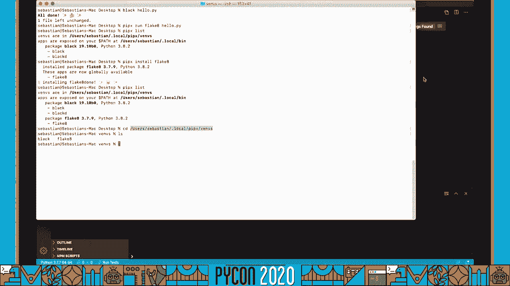

让我们去 VS code。打开这里可以找到的设置并搜索 flake 8。你会看到有 flake 8 的路径，默认情况下它只是 flake 8 二进制文件。你需要做的是将此值替换为 pipx 中 flake 8 的完整路径。所以现在让我们保存它，然后我们可以运行，但路径是无效的。

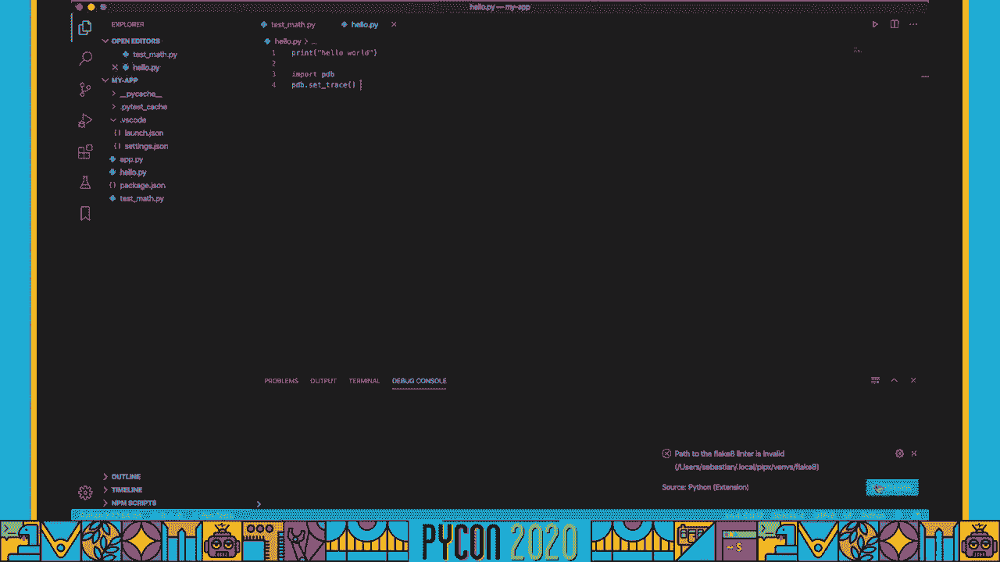

好吧，让我们看看发生了什么。好的，我知道问题出在哪里。这实际上不是一个二进制文件，而是一个文件夹，所以我们可以进去，然后有一个 bin 文件夹，里面有二进制文件。所以我们必须使用这个完整路径。

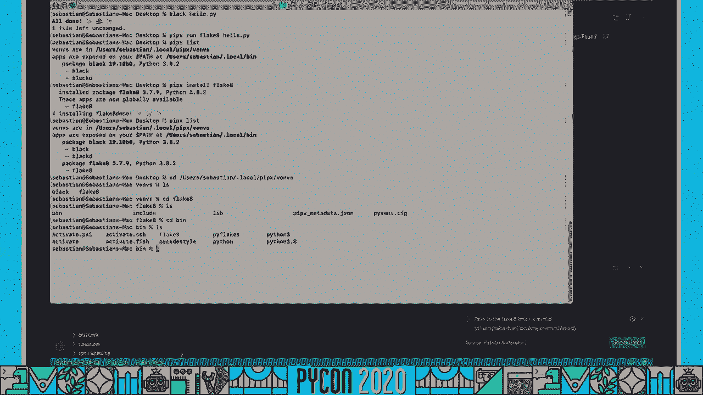

保存它，我们关闭设置，太好了，我们有一个接口。

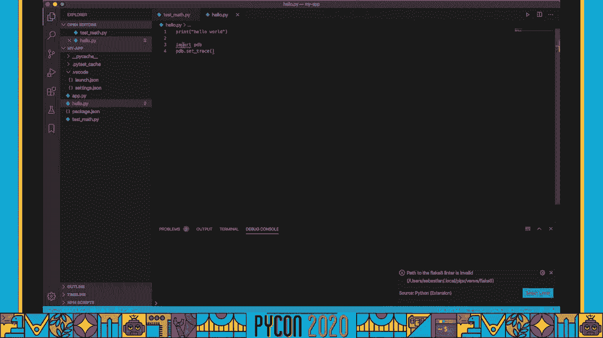

我们可以看到它在抱怨，所以一切都很好。我们在这里涵盖了很多内容，所以如果这些工具中的某些对你来说是新的，我准备了一个简短的练习，你可以用来练习使用它们。打开练习一并按照那里的说明进行。如果你已经知道 pipx 并且已经在使用虚拟环境，你可以跳过这部分。

这是一个练习，但如果这些工具中的一个对你来说是新的，我建议你跟着做。如果你有任何问题，请记笔记，你可以在 PyCon 的互动环节中提问。我希望这个练习不是太难，也希望你不会感到无聊。让我们转变话题，讨论一些与工具无关的内容。

我听到的一个很常见的问题是如何正确地构建一个 Python 项目，我没有一个正确的答案。Python 不强制任何结构，只要你知道自己在做什么，你可以随意组织你的项目。在我知道的工具和框架中，只有 Django 会尝试为你搭建一些基础结构，但你可以随时忽略它并移动东西。

当你第一次考虑项目结构时，可能听起来并不复杂，通常也确实如此。但如果你不小心，你可能会遇到两个常见问题。首先，你试图导入的文件不在导入路径上，这通常表现为模块未找到错误，或者你会遇到一些循环导入错误。

这会导致导入错误。如果你从未遇到过这些问题，那么我仅仅谈论它们可能会让你感到无聊。因此，我建议你自己阅读本章的其余部分，如果你遇到循环导入错误或模块未找到错误的问题，我会尝试描述可能的解决方案，并链接到一些 Stack Overflow 的解释。

与此同时，我想向你展示如何结构化我们的项目，以避免这些问题，并展示一个可以帮助我们的工具。每个 Python 项目都是不同的，但通常它们共享一些共同的元素。在 Django 中编写网站不再是进入网络框架世界的激动冒险。

这更像是一个平凡的任务，创建相同的 HTML 模板，将它们连接到 URLs，并编写一些从数据库中提取信息的视图。由于成千上万的开发者在你之前都使用过 Django 或 Flask 应用程序，或发布过 Python 包，有些人想出了提取通用部分的想法。

这些应用程序创造了可重用的脚手架，这就是 cookie cutter 项目诞生的原因。通过 cookie cutter，你可以创建模板，然后使用这些模板为你的项目生成脚手架。例如，如果你编写很多 Django 网站，你可能会注意到它们每个都有相似的结构。因此，你可以坐下来将相似的部分提取到一个模板中。

放置一些占位符，例如网站名称、作者、日期或许可证，然后当你需要创建另一个网站时，可以使用这个模板来生成大部分代码。在这个研讨会上，我们不会编写 cookie cutter 模板，但我们将使用一个。

那么如何使用它呢？如果你访问 cookie cutter 网站，你会看到下方有一个不同流行 cookie cutter 模板的列表。例如，如果你想创建一个 Python 包，你可以使用 cookie cutter pie 包。如果你想编写一个 Flask 网站，有一些 Flask 框架可供选择。Django 也是如此，它在这个列表中的某个地方。

有许多不同的 Django 模板，甚至有适用于 Pyramit 的模板，还有适用于不同语言的模板。有 C、C++的模板，所以假设我们想使用 cookie cutter pie 包模板来编写一个 Python 包。首先，我们需要安装 cookie cutter。请注意，我使用的是 pipx。

Cookie cutter 是我想在不同项目中使用的工具，所以没有必要将其存储在与我的项目相同的虚拟环境中。我希望它在我的计算机上全局可用。接下来我们运行 cookie cutter 命令，并粘贴模板的 GitHub 仓库 URL。

在这种情况下，我想使用 cookie cutter pie 包。按下回车后，cookie cutter 会问你几个问题。括号中的值是默认值，如果你没有提供不同的值，它将被使用。有些问题很重要，有些则不然。

例如，如果你提供全名，它主要会用于文档或许可证文件。但稍后你会看到一些实际上非常重要的问题。现在让我们填写一些信息。这里我不想更改默认值，所以我只是按下回车。现在我们到了问题实际上很重要的阶段。

在这里我们需要决定是否要使用 pipest 作为我们的测试框架，或者是否想使用其他的，比如内置的单元测试。我想使用 pipest，所以我选择是。这里我们可以选择是否想通过 travis 进行 pip 部署。我不想使用它，所以我会选择否。我不知道 pie up batch 是什么，所以我将使用默认的否。

在这里我们可以选择命令行接口。你可以使用流行的 click 库、内置的 arc parse，或者选择不使用命令行接口。根据你在这里的回答，cookie cutter 将会添加或删除一些文件。

通常会是你的 CLI 的模板。所以假设我想使用 click，我选择一个。我不知道这个作者文件是什么，所以我会选择否，然后我可以选择许可证。我们就使用默认的。如果我们查看当前目录，你会看到 cookie cutter 为我们创建了一个目录。如果我们进入里面，你会看到有很多文件。让我们使用三条命令。

我无法使用三条命令。文件的数量可能会让人感到不知所措，尤其是当你只想创建一个非常简单的 Python 包时，但你可以忽略大多数文件。例如，contributing 仅包含一些供贡献者了解你项目的信息。History 是一个可以存储你项目变更日志的地方。

你应该关注的一些文件，例如 make 文件。如果你从未使用过 make 文件，并且觉得它们很可怕，可以暂时忽略它们，但它们是存储脚本的好地方。例如这里你可以看到我们有一些命令来清理编译文件以进行链接。

我们的文件用于运行测试、生成文档或代码覆盖，最后安装我们的包。然后是 docs 目录，这是你的包文档所在的位置。这个 cookie cutter 模板使用 sphinx 来管理文档，我将在研讨会稍后讨论 sphinx，所以我们现在可以跳过这个文件夹。

my awesome python package 目录是你的 python 包代码的存放地。这个文件夹的名称取决于你给包的名称。因此，如你所见，cookie cutter 能够根据你提供的答案以动态方式生成一些文件或文件夹。接下来，我们有 requirements dev。txt 文件。

这个文件包含你在开发过程中所需的 python 包列表。如你所见，我们有用于 linting 的 flake 8，运行测试的 pite test，因此这些不是你的包最终用户将使用的包。最终用户包在 setup。py 中列出，在一些其他项目中，你可能会在一个叫 requirements。txt 的文件中找到它们。设置。

py 可能是这个目录中最复杂的文件。它包含一堆设置，可以让你在 pite 上发布你的包或使用 pip 安装它。好消息是它已经为你设置好，所以你不需要真的去动它，正如你所见，我们有我们包的最终用户需求。

这只是一个命令行界面的点击包。还有一个 setup。cfg 文件，其中包含你在开发过程中将使用的各种工具的设置。因此，如你所见，这里有 flake 8 和 pite 测试的设置。这个文件已经为你预先配置好，所以你也可以忽略它。

如果你想现在开始构建一个 python 包，你只需进入 my。awesome python package，打开 my awesome python package。py 文件并在这里添加一些模块和函数。如果你想使用 CLI，你还需要修改 cli。py 文件。如你所见，这里已经有一些代码可以帮助你入门。

当你的包准备好后，你会看到在 make 文件中有一个 release。命令，它将构建并发布你的包到 pite。使用 cookie cutter 的一个优势是这些模板通常会提供一些额外的工具，可能会帮助你进行开发过程。

最受欢迎的 cookie cutter 模板是许多 python 程序员的协作努力。因此，它们通常包含许多其他开发人员使用和测试过的工具，而不是昨天在 hacker news 上找到的一些闪亮的新玩具。例如，我们刚刚使用的 pie 包 cookie cutter 安装了 talks。

这是一个非常有用的工具，可以在不同的 Python 版本下运行测试。由于你在编写 Python 包，可能想在至少几个较新的 Python 版本下进行测试。同时，它还安装一些工具，可能是编写 Python 文档的最受欢迎工具。而且再次强调，既然你在编写 Python 包，你可能想记录如何使用它。

一些模板会更加主观，它们会安装更多工具。有些模板则更为简约。最终，选择使用哪个模板以及是否实际使用其所有功能，取决于你自己。如果你觉得找到的模板过于复杂，可以去 cookie cutter 网站搜索其他模板。例如，如果我们想构建一个 flask 网站，只需搜索 flask，看看有哪些可用的资源。

你可以看到这里有一个带 Bootstrap 的 flask 模板。让我们看看它的样子。好的，如你所见，我们将获得一个相当基础的 Bootstrap 网站，包含一些注册和登录表单以及 SQLAlchemy。如果你觉得其实不需要这些东西，你要做的就是返回去搜索另一个 flask 模板。也许你想要一个非常简约的 flask 应用程序，这里你可以看到有一个 flask minimal。

可能更适合你的模板。因此，如我所说，值得查看至少几种不同的模板，比较它们所提供的内容。如果你不明白某个功能如何工作，可以查看模板的文档，或者直接删除那段代码。除了决定如何构建你的项目，还有一些其他重要的决策。

你必须做出的决定，我不是在谈论如何构建你的应用程序，是否使用微服务或构建一个单体，使用哪个数据库或如何部署和扩展你的应用程序。在我们讨论这些之前，还有其他事情需要理清，特别是如果你与其他开发人员合作。你必须决定一种代码风格。

像制表符或空格、每行的字符数、是否使用绝对导入或相对导入，老实说，我见过人们更激烈地争论代码风格，而不是项目的整体架构。我理解这一点，我有自己偏爱的编码方式，但如果你与他人合作，有时需要妥协。这就是我们有 PEP8 的原因。

这是一个关于 Python 的风格指南，记录了你应该如何编写代码，然后我们有 PEP257，这是一个文档的风格指南。这两份文件为我们提供了关于如何编写和记录代码的坚实基础。即使这是你第一次听到这两个名字，如果你在使用自动格式化。

如果你的代码编辑器有这些功能，那么你的代码可能已经兼容这些规则。但我认为文档中应该说明你应该使用多少个空格进行缩进，如何缩进闭合括号或方括号，推荐的行长度是多少，或者如何排序导入语句。除非你有非常好的理由，否则你应该遵循这些规则。

目前最常见的异常是行长度。由于我们的屏幕越来越大，将限制提高到 79 个字符以上是非常合理的。但即使按照 PEP8，仍然有一些争论的余地。比如你应该如何拆分多行函数，应该使用多少个空格。

用于悬挂括号等小细节。关于这些小细节的讨论可能在代码审查过程中浪费很多时间。老实说，没有一种完美的方法来编写代码。因此，与其关注这些小细节，不如使用一个自动化工具。

将为你修复这些小问题，并将你的代码审查集中在真正重要的事情上。所以这些工具就是 black。Black 将根据 PEP8 和 PEP257 规则以及一些额外规则格式化你的文件。Black 几乎没有自定义选项。你唯一可以更改的设置是行长度，如果你不喜欢的话。

默认情况下是 88 个字符。有一些选项，比如跳过字符串规范化，这样可以阻止 black 将单引号变为双引号，但根据文档你不应该使用它。Black 是有主见的。有些人喜欢这样，有些人不喜欢。我和那些因为不喜欢代码格式而合并拉取请求的人一起工作。所以 black 消除了这些无聊的讨论，帮助你专注于真正重要的事情。

所以如果你问我，我会坚持使用它，除非你喜欢与人争论代码风格，否则你也应该使用 black。好了，让我们最后看看 black 的实际效果。首先我们需要安装它。我建议你使用 PEPX，因为你想在所有项目中全局使用 black。是的，似乎我之前已经安装过它。是的，如你所见，我们有两个命令。

黑色和黑色 D。我认为这是在启动一个恶魔。所以现在如果我们有一段故意丑陋的代码，我向你保证我不会写这样的代码。雇用我没问题。现在如果我们在这个文件上运行 black，你会看到它被重新格式化了，我们甚至得到了。

一些不错的表情符号。那么让我们看看经过格式化后的效果。我想。如你所见，导入语句整齐对齐，所有多余的空白都被移除了，列表现在在一行上，字典的键和值之间有适当的间距。所以这段代码看起来好多了。如果我们再次运行 black，你会看到这次没有任何需要更改的地方。

这就是你如何使用`black`。你可以在项目文件夹上运行它。你可以将其插入某个持续集成工具中。你可以使用`pre-commit`这样的工具，在每次创建新提交时运行它。

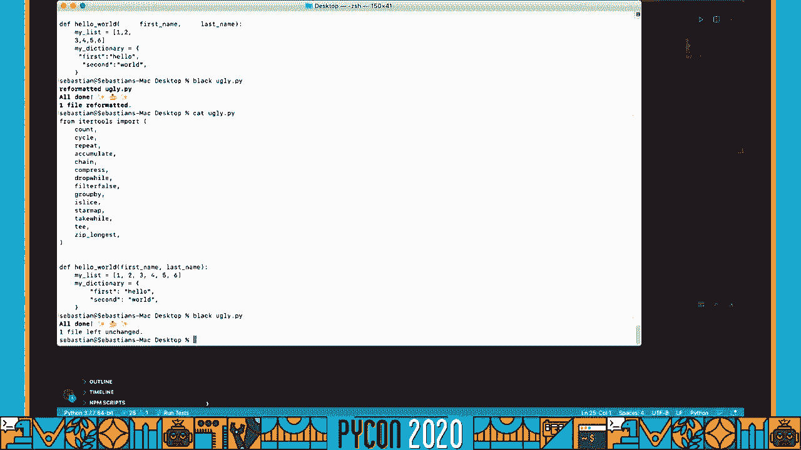

或者你可以像我刚刚做的那样手动运行它。还有一组工具可以帮助你编写更好的 Python 代码，它们是静态代码分析工具。我一直在使用的工具之一叫做`flake8`。`flake8`是一个代码检查工具。所以与`black`不同，它不会修改你的代码，但会给你一些关于可能存在的问题的提示。而且`flake8`实际上结合了三个不同的项目。

`PiFlex`可以给你关于未使用模块和已定义变量等内容的警告。`PiCult`风格会给你关于`pep8`违规的警告，而`maccape`默认是禁用的。但如果你启用它，它会给你关于函数的心理复杂度的警告。这基本上意味着你的函数有多复杂。

`flake8`与 VS Code 的集成非常好。

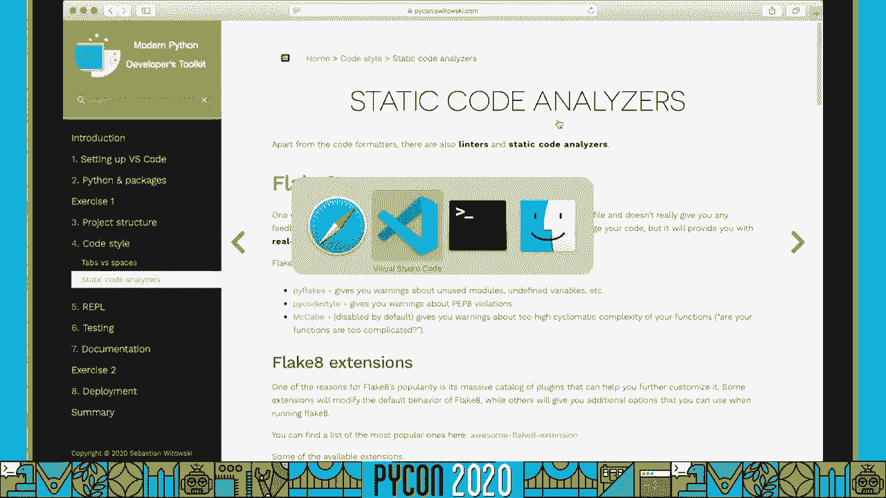

让我们来看看。如你所见，这就是我们丑陋的`ugly.py`文件，里面有很多丑陋的 Python 代码。所有快速下划线的红色部分是`flake8`报告的错误。因此，在第一行我们导入了一堆函数，但并没有使用它。这里它在抱怨我们没有两个空行。

这里我们为本地变量`my list`赋值，但并没有使用它。字典也是如此。这里缺少了一些空格和其他类似的东西。你还可以在问题停止处看到所有问题。如你所见，这里有很多内容。如果因为某种原因`flake8`对你不起作用，而你想启用它，可以打开。

注释调色板。输入`select linker`。然后从这里的列表中选择`flake8`。你也可以尝试其他的代码检查工具，我会在几分钟后讨论它们。

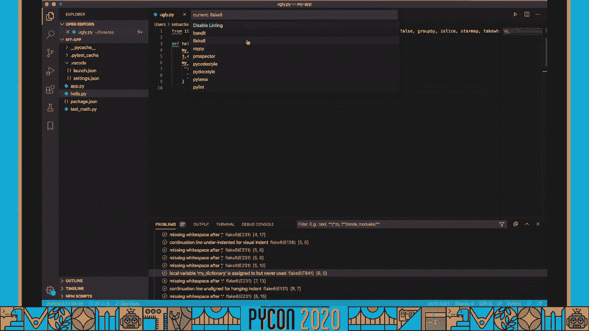

`flake8`如此受欢迎的原因之一是它有一个庞大的插件目录，你可以用来进行自定义。其中一些会修改`flake8`的默认行为，而其他一些会在运行`flake8`时为你提供额外的选项。你可以在优秀的`flake8`扩展网站上找到最受欢迎插件的列表。那是一个包含各种扩展的 GitHub 库。

我在这里列出了一些我发现非常有用的工具，即使你在使用`flake8`，我建议你也看看这个列表，因为在准备时我发现了很多我之前不知道的有用工具。其中一些扩展将增加额外的检查，例如确保你没有覆盖内置变量，也不会犯一些愚蠢的错误。

像 flake8 comprehensions 这样的工具会建议你可以使用列表、集合或字典推导式替代 for 循环的地方。还有 flake8 dockstrings，它会强制执行 pep257 和许多其他类似的插件。如果你在多个项目之间使用很多 flake8 插件，可以查看 flake hell 或相关讲座。它们都允许你通过修改一个配置来安装和配置所有 flake8 插件。

文件这样你就不需要去每个项目手动执行`pip install flake8`。这个扩展和那个扩展。它是一个有用的工具。如果你还没有安装 flake8，这就是你可以做的。我建议你使用 pipx，这样 flake8 可以全局可用，但仍然是分开的。

从你拥有的其他依赖关系中，如果你使用 pipx 并想要在 flake8 所在的同一个虚拟环境中安装 flake8 插件，你需要使用 pipx inject 函数。如果你想在你的文件夹上运行 flake8，而不是使用 VS code，只需运行这个命令。Flake8 和 black 是我在任何可以的地方使用的两个工具，但还有其他。

一些其他静态代码分析工具。另一个流行的 linter 是 pilot。它与 flake8 有一些重叠，但你可以安全地同时使用它们。只需记住，pilot 比 flake8 要严格得多。如果你有太少的公共方法、太多的局部变量或类，它会抱怨。

没有 init 方法。编写让 flake8 满意的代码要比编写与 pilot 兼容的代码简单得多。所以尝试在现有项目上运行 pilot，看看你是否喜欢。下一个工具是 Bandit。Bandit 旨在查找 Python 代码中的常见安全问题。如果你直接运行它，它会给你很多误报。

例如，它会抱怨在你的 pilot 文件中使用 assert 语句。但如果你花一些时间配置它，它会打印一些可能有用的信息，关于一些模块的不安全使用、可能的 SQL 注入点、默默忽略异常等等。如果你是初学者，Bandit 可以是一个帮助你审查代码的好工具。

PyDoc style 是一个确保你的文档按照 PEP257 规则书写的工具。只需记住，它会抱怨你没有编写的每个函数或模块缺少文档。然后有 vulture，它会帮助你找到未使用的代码，以及我们创建的 Python 风格指南，这是另一个严格的 linter，结合了 flake8、一堆 flake8 扩展和一些。

额外的自定义规则。它非常严格，所以可能对你的项目来说有些过于苛刻，但也许你会喜欢它。最后还有 prospector，它像 flake8，但使用的是 pylint。因此，它是 pylint、pylint 代码风格和 maccape 的组合。我的最终建议是，你可以通过使用 pre-commit 工具自动化大多数这些插件。

所以 pre-commit 让你将 linters、格式化工具和静态代码分析器作为 git hooks 插入，它们会在你创建提交时自动运行。查看这个链接，了解如何将 black 和 flake 8 设置为 pre-commit hooks。如果你写 Python 代码，另一个你将非常常用的工具是交互式 Python。

shell 或读取-评估-打印循环。这种类型的 shell 是当你在命令行界面输入 Python 时得到的，在这里你可以执行一些 Python 代码。拥有 Python REPL 很好，这样你可以交互式地测试代码，但基本的。

Python REPL 是基本的，从长远来看使用起来并不方便。有几种不同的选择。其中最受欢迎的是 IPython。这是运行在 Jupyter notebooks 背后的 REPL，所以即使你从未直接使用过 IPython，你可能对它有所熟悉。我们可以通过 pip 或 pipx 安装 IPython。

我推荐 pipx，因为这是一个你将在所有项目之间共享的工具。现在对你来说唯一的区别是，如果你想开始一个交互式会话，你只需输入 IPython 而不是 Python。IPython 的一些最佳功能是 tab 补全。如果你在标准的 Python shell 中按 tab，它会插入 tab。

如果你在 IPython 中按 tab，它会显示一系列可能的自动完成项，就像你的代码编辑器一样。我们还可以获得语法高亮，更好的错误信息。如果你开始编写函数或循环，IPython 会检测到这一点，并在你按下回车时自动缩进下一行，最后我最喜欢的 IPython 特性是动态。

对象内省。你只需在这个对象的末尾添加一个问号，就可以查看 Python 中任何对象的文档。这适用于任何类型的对象。选项、模块、构建模块、第三方库、你刚定义的变量，任何东西。如果文档字符串不够，你可以添加两个问号来查看完整内容。

这个对象的源代码。我非常喜欢这个功能，因为我不再需要离开终端去查找文档。IPython 还带有一堆魔法函数。这些是以一个或两个百分号开头的辅助函数，例如你可以用它们快速测量某段代码的执行时间、运行文件、浏览历史记录。

以前的 IPython 会话，重新运行一些之前的命令或打开代码编辑器在执行之前编辑一些代码。如果你愿意，你也可以随时编写自己的魔法函数。如果你觉得 IPython 有趣并想了解更多，查看 IPython 文档，获取不同功能的好概述。如果你更喜欢更直观的演示。

我去年做了一次关于 IPython 的演讲。这是一场时长 45 分钟、节奏很快的演讲，我介绍了它的大部分功能。在 YouTube 上观看可能比现场观看更好，因为你可以随时暂停，测试感兴趣的功能。因此，我强烈建议你使用 IPython，而不是默认的 Python REPL。即使你对大部分功能不感兴趣，自动补全和语法高亮也值得一试。

光是自动缩进就能让你的生活轻松很多。如果你不喜欢 IPython，还有其他 Python REPL 可供选择。它们的功能不如 IPython 丰富，但各有特色。所以你可能会更喜欢其中之一。我们有 BPython，提供语法高亮和自动补全。

自动缩进和像 rewind 这样的功能可以让你撤销最后执行的命令。我们还有 PTPython，提供类似的功能以及稍微更先进的界面，带有一些菜单和 Emacs 键绑定等。一旦你编写了一些代码，你需要确保它能够正常工作。

我不是说现在能用就行，因为你刚写过，点击了一些东西，所以你肯定一切正常。但我们需要确保在其他人修改了其他代码后，它仍然能够工作。所以让我们谈谈编写测试。Python 自带一个单元测试模块，你可以用它来编写测试。这个模块在功能上非常基础，同时在复杂性上又显得过于繁琐。

关于你需要记住多少不同断言。因此，我建议你学习 Pytest。Pytest 现在可能是最受欢迎的 Python 库。它功能丰富，但同时也对初学者非常友好。你不需要编写继承自单元测试用例的类。

你只需编写以 test 开头的函数。你不需要记住 assert equal、assert true 或 assert in。你只需使用 assert 某个东西等于另一个东西，这样就可以了。如果你需要更高级的功能，Pytest 有很多额外特性和一个庞大的插件生态系统。

要开始使用 Pytest，使用 pip 进行安装。由于不同项目可能使用不同的 Pytest 配置或插件，所以你不想安装全局版本，而是希望在每个项目中安装 Pytest。一旦安装了 Pytest，在项目的根文件夹中创建一个 tests 目录。

创建以 test_inside 开头的文件夹，然后编写以 test_inside 开头的函数。

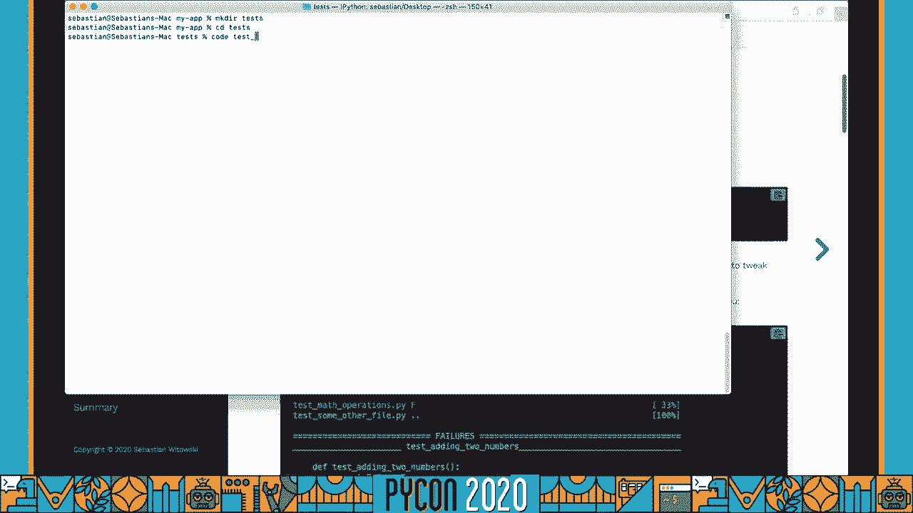

这些文件。如果你遵循这个建议，Pytest 将开箱即用。一旦你编写了一些测试，返回终端并运行 Pytest 命令。

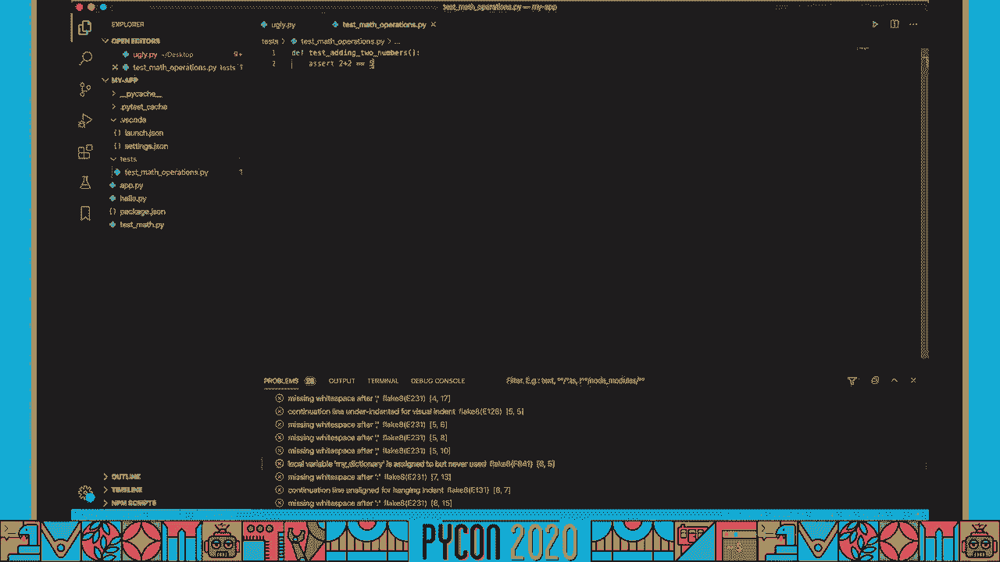

Pytest 会检测所有测试并为你运行它们。如你所见，Pytest 检测到四个测试。其中三个在我向你展示如何在 VS Code 中运行测试时使用的一个名为 TestMuff 的文件中，另外一个在 TestMuff 操作文件中。最后一个测试失败了，你可以看到追踪的错误信息。

现在你可以去修复这个测试了。

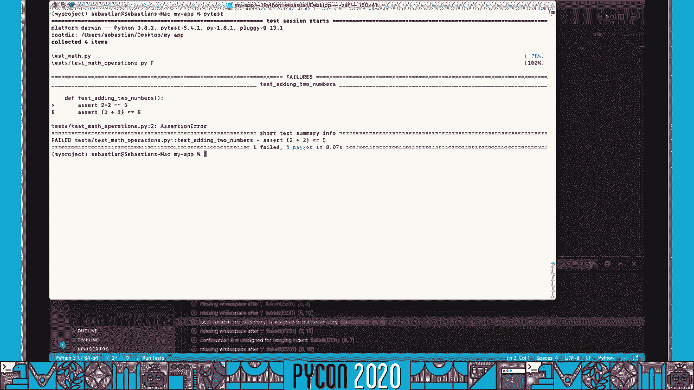

这就是你如何使用 Pytest 的。还有一些其他的 Pytest 特性或者一般的测试特性你可能需要在测试中使用，让我们来谈谈它们。首先是夹具。让我们用一个例子。假设你有一个电子商务网站，出售一些商品。你想确保一切正常，因为你不想免费赠送产品。

如果有 bug 的话。所以你编写一些测试。你检查用户是否可以登录，添加一些产品到购物车，进行结账过程。对于每个测试，你需要创建一个用户。因此，你决定将用户创建提取到一个单独的函数中，然后在开始时运行这个函数。

每个测试的开始。因此，实际上，这个用例需要在测试开始时存在特定对象是一个非常常见的场景，因此夹具的概念应运而生。夹具是一个返回对象的函数。在我们的案例中，是用户对象，但它可以是任何东西。它可以是你商店中的一件商品，也可以是一个数据库连接。

然后你可以在测试中使用这个夹具。要在 PyTest 中创建一个夹具，你只需编写一个函数，然后用 PyTest 夹具命令装饰它。如果你不知道什么是装饰器，不用担心，只需将这段代码放在一个函数上方。

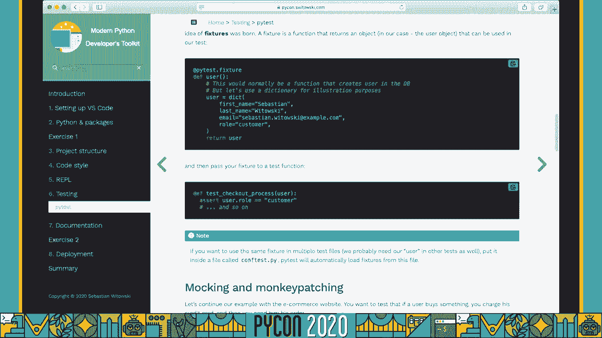

然后它将变成一个夹具。

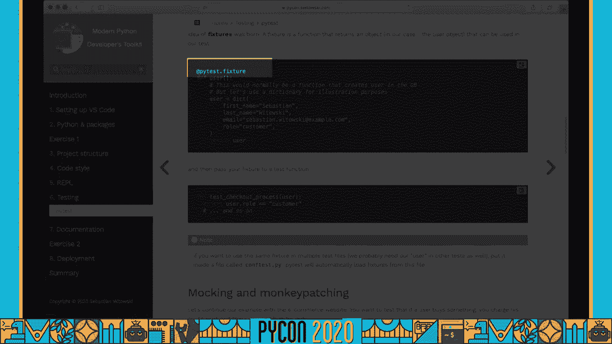

然后要在你的函数中使用夹具，你需要将这个夹具作为参数传递给你的函数。作为附注，如果你想在多个文件中使用相同的夹具，只需将这个夹具放在一个名为 conftest.py 的文件中。PyTest 将自动在你所有的测试中加载此文件中的所有夹具。

下一个概念是模拟和猴子补丁。假设在你的电子商务网站上，你想测试如果用户购买某样东西，首先扣取他的信用卡，如果一切顺利，你就发送他的订单。每次运行测试时，你无法扣取真实的信用卡。好吧，从技术上讲，如果你非常富有是可以的，但我们假设我们不是很富有。

我们希望避免亏损。这就是你需要一个模拟的原因，一个可以代替真实对象的假对象。因此，不是将信用卡信息发送到 Stripe，这是一种非常流行的支付处理器，而是用一个模拟对象替代 Stripe。这个模拟对象应该在你提供正确参数时返回成功信息。

模拟的整个意义在于你不需要测试 Stripe 是否正常工作。 你需要确保将正确的数据发送给 Stripe，然后接受和处理从 Stripe 返回的任何信息。 所以假设在我们的代码中有一个 charge customer 函数，它接受一个金额。

然后通过 Stripe API 将其发送给 Stripe。 从 Stripe 返回后，我们收到一个响应，并且该响应具有状态。 我们检查状态是否等于成功，如果是，则将当前订单的状态设置为处理中。 顺便说一下，这是一段完全无用的代码，无法与 Stripe 配合使用。 这里只是为了说明目的。 然后在我们的测试支付函数中，我们需要传递猴子补丁函数。

我们使用这个猴子补丁函数将 Stripe 对象的 charge 属性替换为。 返回一个状态等于成功的字典。 然后，当调用 charge customer 函数并执行 Stripe。charge 时，它不会执行真实函数，我们的模拟将介入并自动。

返回一个状态等于成功的字典。 这样就没有信息实际发送给 Stripe，我们可以断言，如果 Stripe 返回成功，当前订单状态被设置为处理中。 好吧，我给你讲个笑话。 一个测试员走进酒吧。 他点了一杯啤酒，他点了零杯啤酒，他点了一百万杯啤酒。

他点了一只蜥蜴，他点了-1 杯啤酒。 然后第一个顾客走进酒吧，他问洗手间在哪里。 酒吧突然起火，烧死了所有人。 所以在这个古老而略显搞笑的笑话中有一个重要的教训，而不是关于灭火器或逃生通道。 你可能希望用很多不同的输入测试你的函数，而 Pytest 有一个功能正好适合你。 你可以对你的测试进行参数化。

所以你必须决定测试的哪个部分可以改变。 在我们的电子商务网站中，这可以是订单数量和单个订单的大小。 然后你写一个接受这些可变部分作为参数的测试，并使用 Pytest.mark，parameterize 装饰器将不同的值传递给这些参数。

如果你查看这个例子，Pytest 实际上会将这个测试转化为四个不同的测试。 在第一个测试中，订单数量和订单大小将等于 1。 然后在第二个测试中，订单数量将等于 100，而订单大小将等于 1。 然后反之亦然，然后它们都将等于 50。

Pytest 参数化可以在编写测试时节省你大量的重复。 我们通常忘记保持最新的事情之一是文档。 大多数情况下是因为我们没有工具告诉我们它何时过时且不再有效。 Pytest 可以解决部分这个问题。 如果你在文档中放置一些代码示例，它可以评估它们并告诉你是否不再。

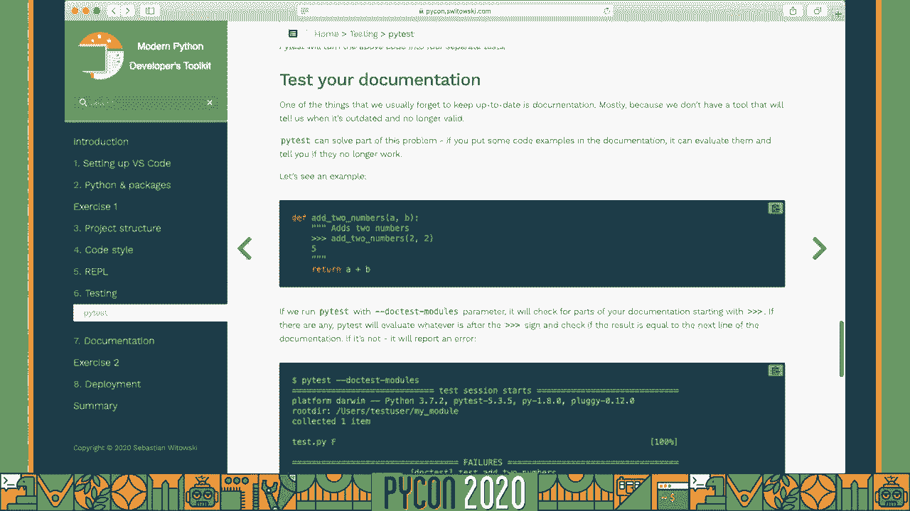

不再工作。我们来看一个例子。如果我们使用 DocTest 模块的参数运行 Pytest，它将检查你的文档中的部分内容。

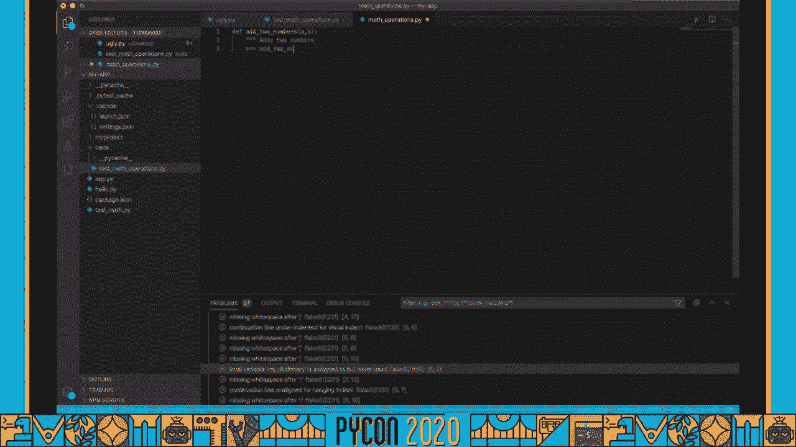

以这个符号开头。如果有任何内容，Pytest 将评估这一行，并查看结果是否等于文档的下一行。如果不等，它将报告错误。说到使用参数运行 Pytest，有很多很酷的参数可以传递给 Pytest。例如，你可以在第一次失败后停止运行测试，或者只重新运行失败的测试。

来自上一次运行的测试。你可以选择单个测试或单个文件来运行。当发生故障时，你可以启动调试器，或者可以并行运行测试。你可以标记测试，给测试分配标签，然后只运行具有特定标签的测试。你可以将测试拆分，例如单元测试，每次都运行这些测试，最终结束。

结束测试你只会在持续集成平台上运行，因为它们运行缓慢。你还可以使用预定义的标记之一。例如，如果你知道某些测试是坏的，而你今天没有时间去修复它们，但希望你的 CI 能正常工作，你可以告诉 Pytest 跳过这些测试。你可以告诉 Pytest 某些测试实际上是预期会失败的。

如果某个特定条件为真，你可以跳过某些测试。例如，如果某些测试不应该在 Windows 上运行，你可能想跳过这些测试。“如何制作一个好的 Python 项目”的最后一块拼图是文档。在某个时候，你可能想要解释如何使用你的项目或其他人如何使用它。

为此做出贡献。所以你需要编写文档。最受欢迎的 Python 工具之一叫做 Sphinx。它易于使用，并且自带很多有用的功能。你可以生成多种格式的文档。你可以轻松地在函数和模块之间创建超链接。你可以自动生成 API 的文档。与 Pytest 类似，它还可以测试文档中的代码示例。因此，要使用 Sphinx，通过 pip 或 pipx 安装它。我将使用 pip，因为在另一个项目中我可能想用其他东西。

一旦你安装了 Sphinx，运行 Sphinx-quickstart 命令并传入你想要保存文档的文件夹名称。这个文件夹的常见名称是“talks”，所以我就用这个名称。然后，Sphinx 会问你一些关于你项目的问题并生成文档。使用 Sphinx，你将使用重构文本来编写文档。

它与 Markdown 非常相似，但在其基础上有一些自定义语法。如果你想了解更多，这里有一个关于如何使用重构文本的说明链接。如果你出于某种原因不喜欢重构文本，想使用 Markdown，还有一个名为“re-common-mark”的扩展可以安装。不过。

我将选择“重构文本”这里。如果我们进入文档目录，你会看到我们有一个“make”文件和“make”路径。这些是我们将用来生成文档的文件。然后我们有“build”和“source”文件夹，因为我们在 Sphinx 提问的第一个问题中选择了单独的源和构建目录。

在 build 文件夹中，我们将找到生成的文档。现在我们还没有任何文档。在 source 文件夹中，我们将找到配置文件和索引“rest”，这就是。

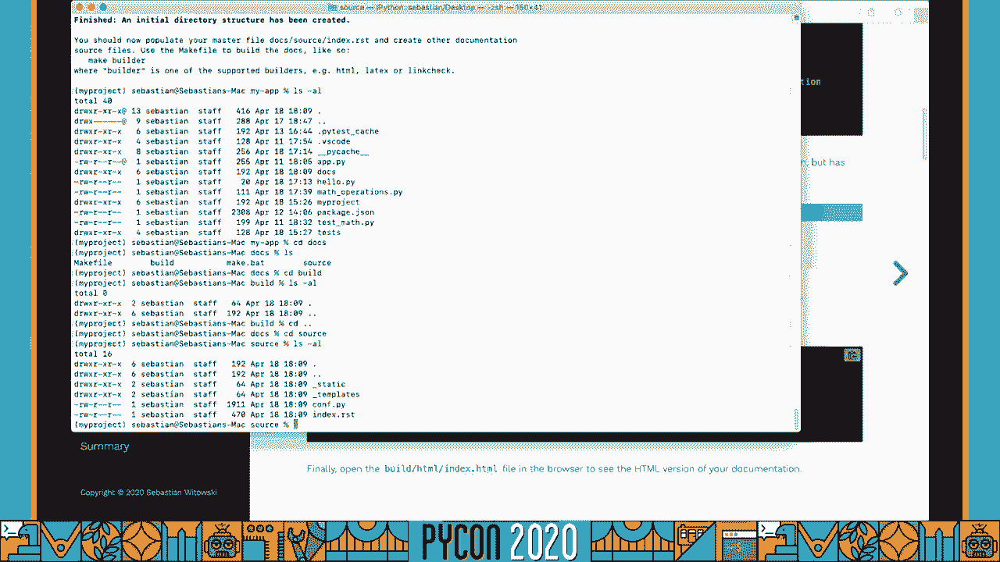

你的文档的主页。正如你所看到的，这里没有太多内容，VS Code 提示我们可以通过一些扩展来预览“rest”文件。

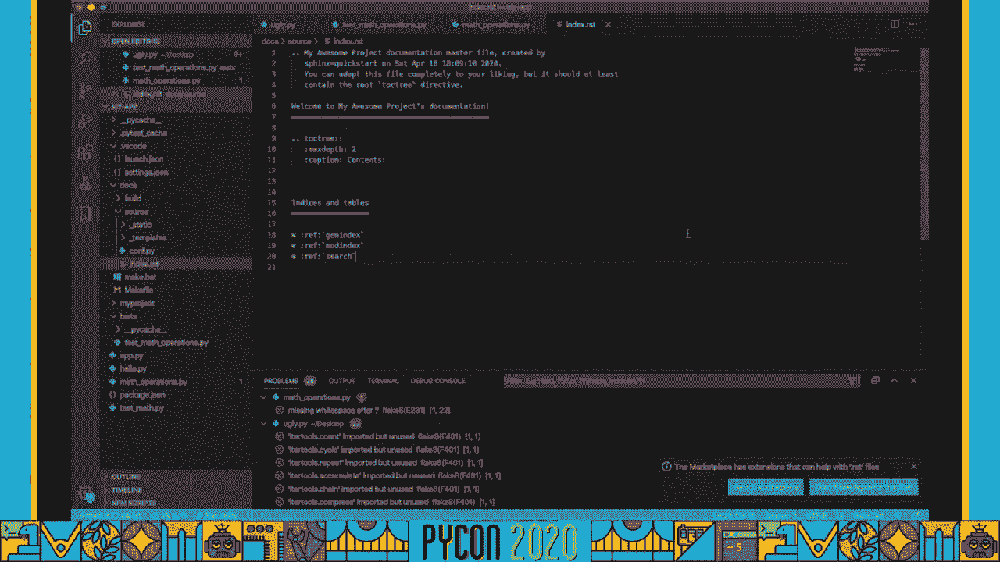

现在我将暂时忽略它。因此，要生成文档，我们必须转到包含“make”文件的文件夹，并运行“make.html”命令。这应该生成文档的 HTML 版本。如果我们现在进入 build 目录，你会看到我们有一个“html”文件夹，里面有一些页面。让我们在浏览器中打开索引“html”。

很好，所以我们有了文档的骨架。这里没有太多内容，所以让我们看看如何填充一些内容。你可以向源目录添加更多文件和文件夹，然后你可以链接它们。

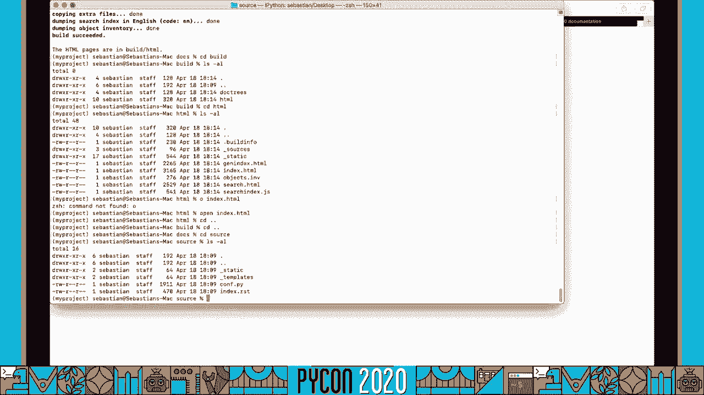

在“talk 3”部分下创建你文档的附加页面。确保你实际上创建了我们在这里指定的这三个文件，否则在构建文档时你会遇到一些错误。

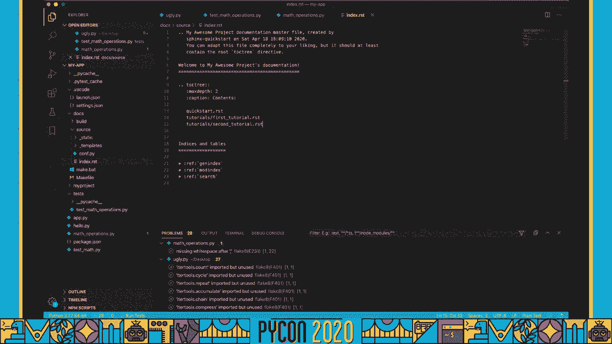

如果你在想要在文档中实际放置什么内容，我强烈推荐你观看这个演讲和这篇博客文章。如果你使用这个框架来编写文档，你将有四个主要类别。教程将向完全的初学者解释他们如何开始使用你的应用程序。如何指南，即解决特定问题的配方，解释你的项目。

实际上，它能够工作并且参考，这就像你项目的维基百科页面。我在 Sphinx 中非常喜欢的一个功能是它可以自动生成 API 文档。你所需要做的就是添加一个插件。

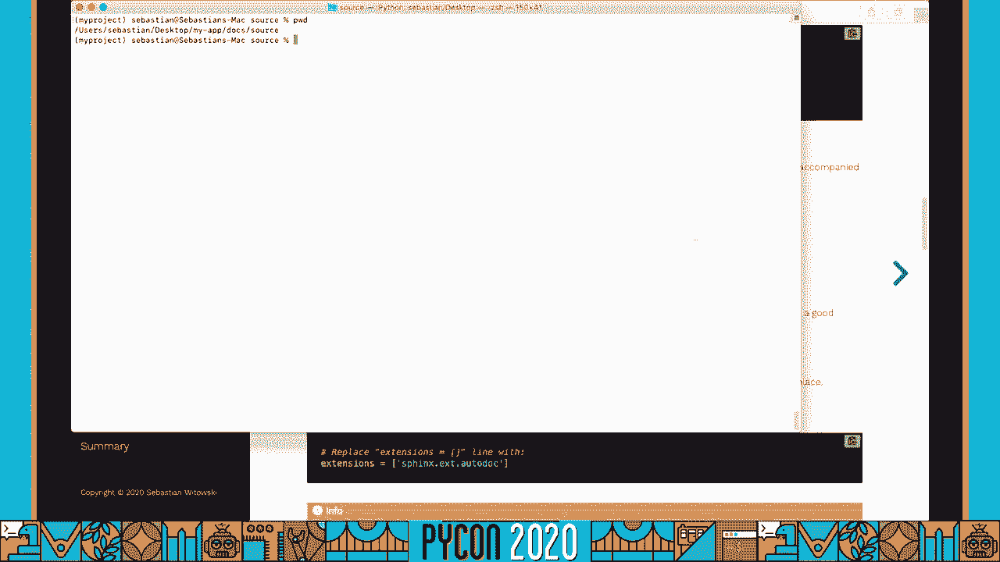

所以打开 conf.py 文件，该文件包含你的 Sphinx 文档的配置。然后在扩展列表中添加 sphinx.ext.out.doc。接下来，我们需要创建一个将包含此 API 文档的文件。所以让我们创建一个名为 api.rest 的新文件。在这个文件中，对于你想要记录的每个模块，你需要添加以下内容。

代码。首先是模块的名称，假设我想记录数学运算。好吧，这部分是完全可选的，但我喜欢添加它以便为每个模块提供漂亮的标题。现在是强制部分。通常你应该首先提供包的名称，然后是模块的名称。因为在这里我没有真正的包，只有一个文件，所以跳过也是可以的。

包的名称。但通常你会希望使用包来命名空间你的模块，以便轻松分隔。

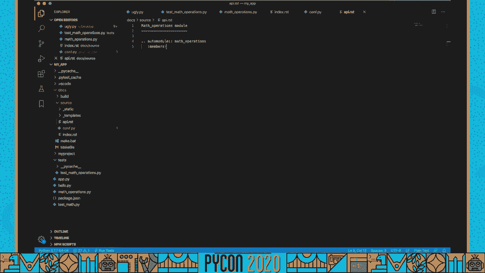

它们。所以让我们尝试构建我们的文档。

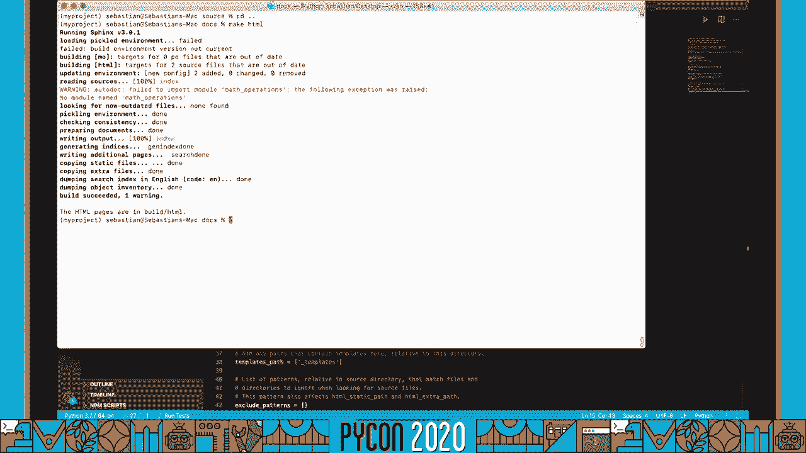

我们遇到了一个错误。这里的问题是数学运算文件在目录结构的上方。

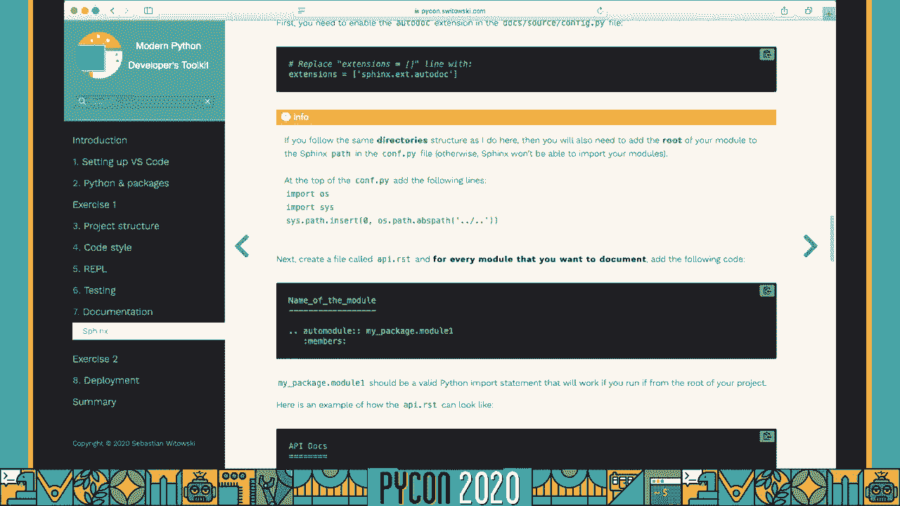

在 `conf.py` 文件中。所以我们要做的就是修改 `conf.py` 文件中的路径。让我们打开它，在 `conf` 文件的顶部你会看到这个问题的解释。所以取消注释那些行，并将其更改为上方的两个目录。

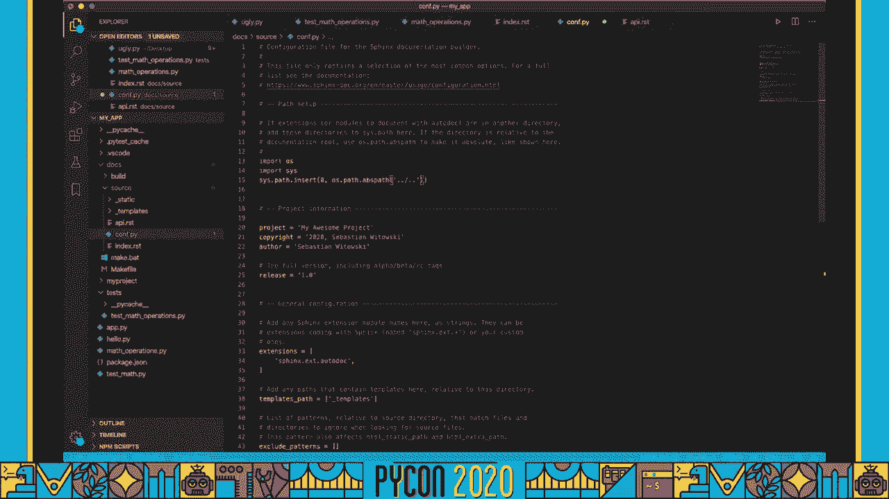

这是因为我们在源目录中有 `conf.py` 文件。在上方我们有文档目录，数学运算在文档目录的上一级。

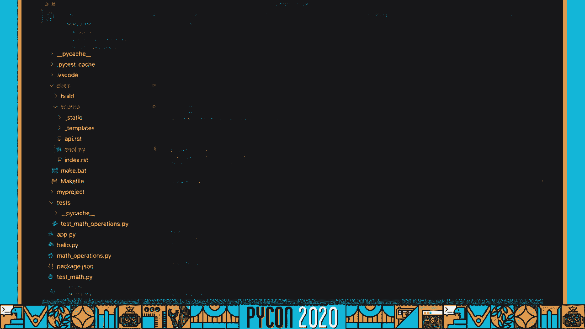

这就是为什么我们必须进入上层目录。一旦我们保存这个文件，就试着再次运行 `make`。这次成功了。让我们在浏览器中打开这个文件，这里就是它。如果你想知道我们如何得到那些参数和返回值，那是因为我进行了修改。

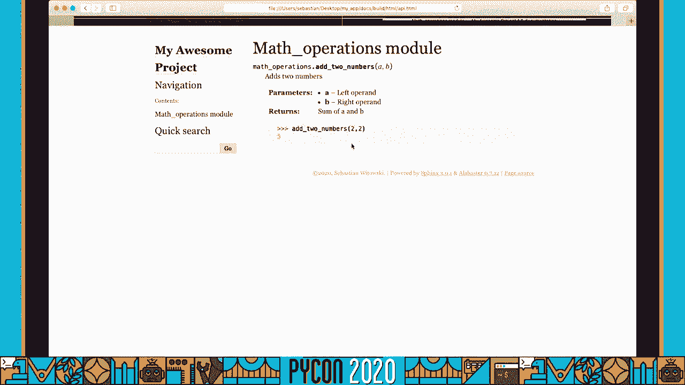

数学运算，我对文档字符串添加了更多内容。如果你查看 Sphinx 文档，你可以看到如何指定参数和。

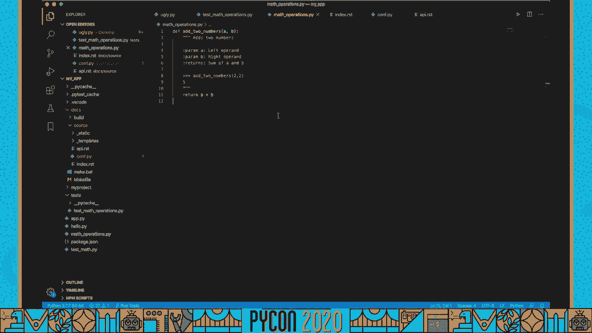

你的函数的返回值。我非常喜欢的一个功能是可以从文档链接到函数的源代码。通过 Sphinx，我们只需一个插件就可以实现。

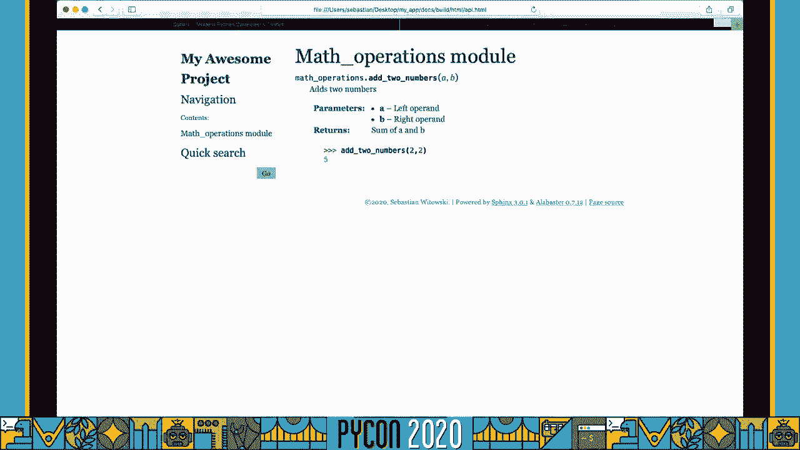

所以打开配置测试并将 `Sphinx.ext` 视图代码添加到我们的扩展列表中。

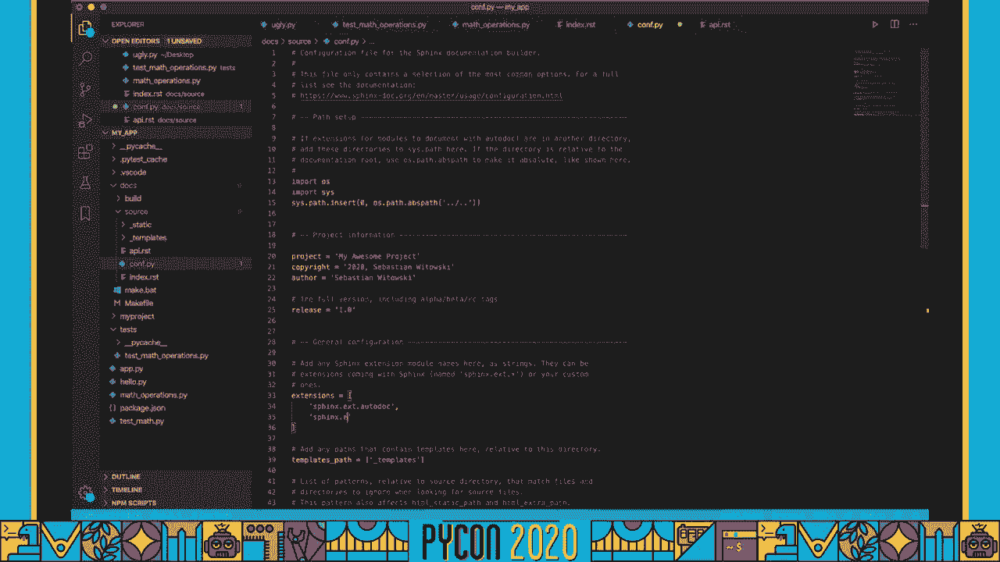

现在再次构建文档，如果我们去浏览器，你可以看到每个函数的源代码链接。这是一个非常不错的功能，尤其是我们只需修改一行就可以实现。如果你正在构建 REST API，例如你使用 Django 或 Flask 作为应用程序的后端，而在前端你使用 Vue 或 React。

查看 Swagger UI 和 Redog。它们都可以让你轻松生成应用程序的交互式文档。当我们谈到 Pytest 时，我向你展示了如何测试你的文档。但是如果你不使用 Pytest，你也可以直接从 Sphinx 测试你的文档。

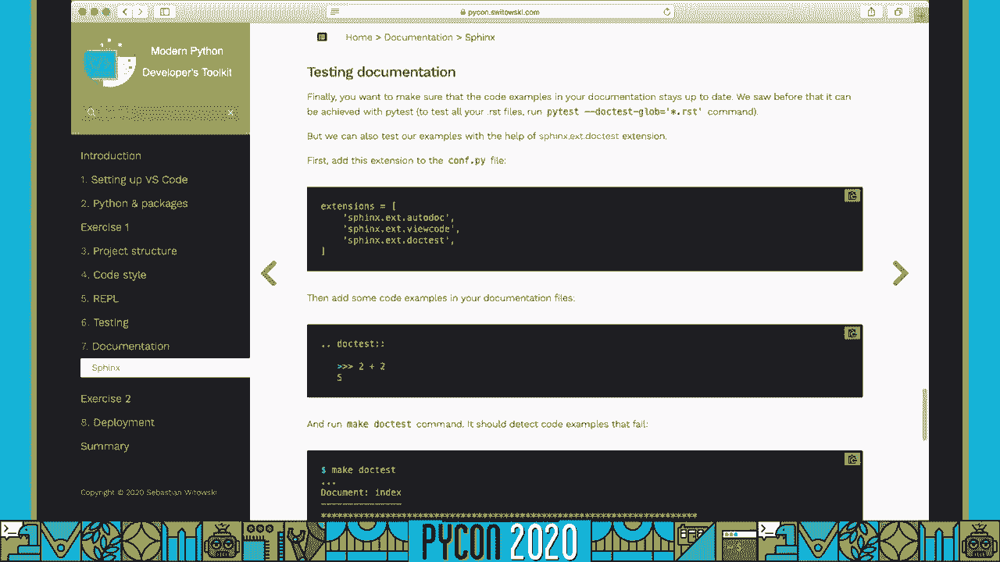

首先，你需要启用文档测试扩展，以确保你确实有一些测试。

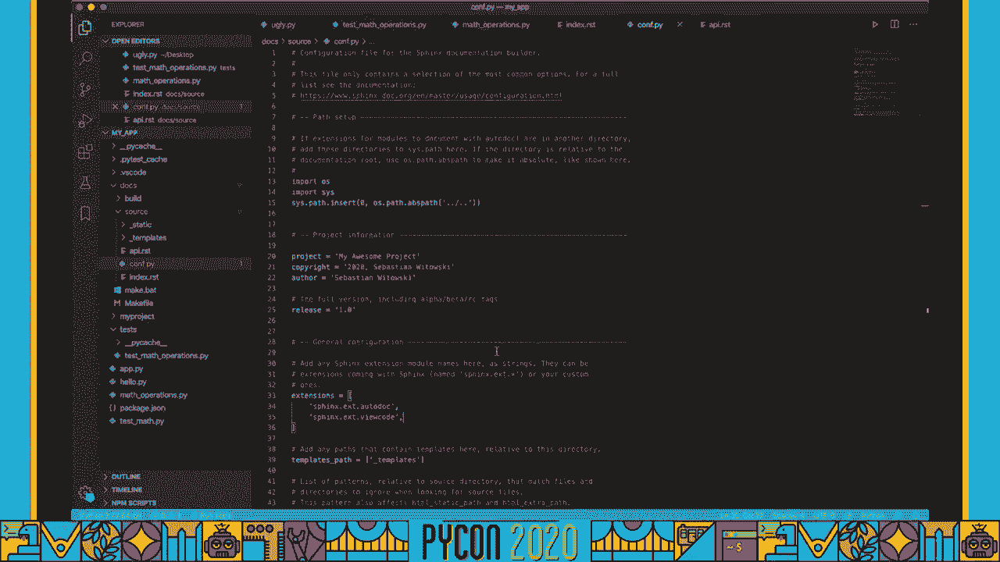

在你的文档中，然后最终运行 `make doc test` 命令。

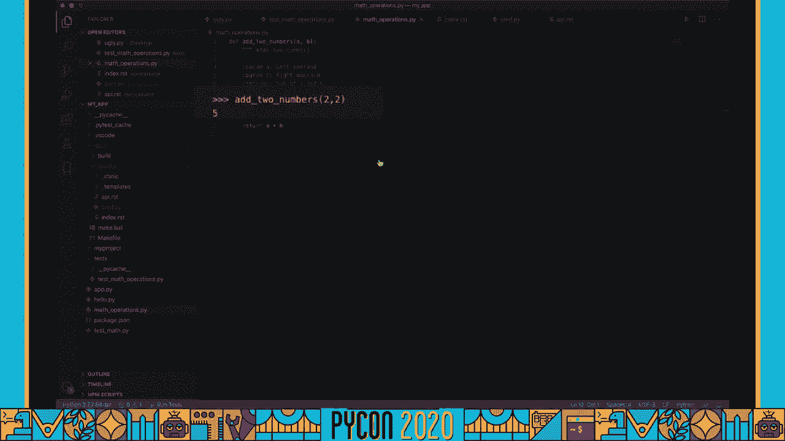

正如你所看到的，追踪回溯不像在 Pytest 中那样美观。你没有绿色和红色的颜色，但你可以看到我们的测试失败了。我通常会坚持使用 Pytest 来运行所有类型的测试，但也许你喜欢这种方式。最后我想给你展示的是阅读文档。

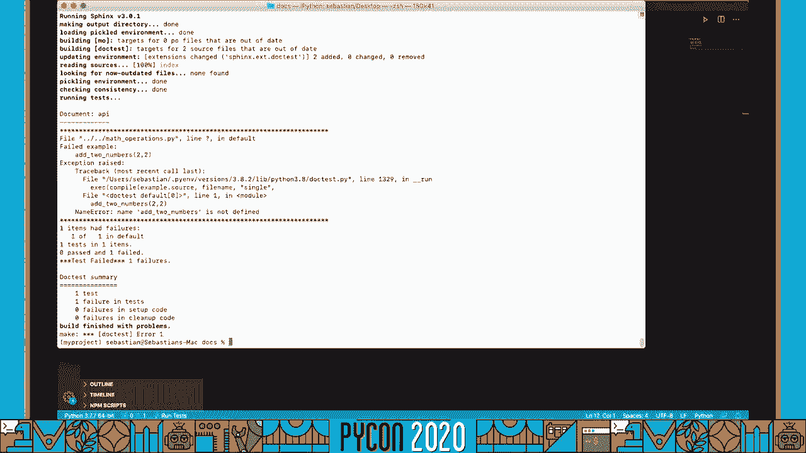

如果你正在参与一个开源项目，你可以在线免费托管你的文档。你所要做的就是访问阅读文档网站并在这里创建一个帐户。一旦你有了帐户，你将可以访问一个仪表盘，在那里你可以连接你的代码仓库。阅读文档会获取你的 Sphinx 文档并将其放到网上。

这里是一个示例，展示它可能的样子。因此，我们学到了很多，现在我希望你能将所有的新知识付诸实践。让我们写一个小的待办事项应用程序，在这里你可以使用今天学到的所有工具和想法。你的待办事项应用程序应该实现以下功能：显示任务列表，添加新任务，标记为完成，并删除任务。

除了仅仅编写代码外，我还希望你编写一些测试，记录一些函数，并使用 Sphinx 生成文档。我还希望你安装 Flake 8 和 Black，并通过这些工具运行你的代码。作为额外奖励，你可以配置你的 VS Code，使其自动使用 Flake 8 和 Black。

你可以从头开始这个项目，但我希望你练习使用 cookie cutter 模板。因此，我为你创建了一个模板，你可以使用它。让我告诉你如何开始。为了这个练习，我将不再使用干净的 Mac OS 安装。我将使用我正常的工作环境，这样你就可以看到我是如何工作的。

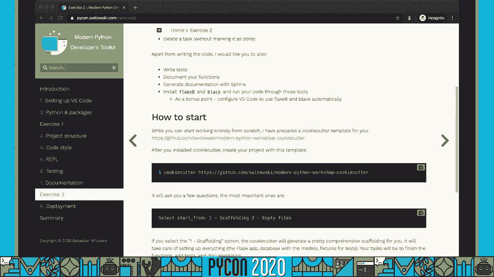

所以让我们开始我们的项目。为我们的应用程序创建一个文件夹。让我们检查一下我是否全局安装了 cookie cutter。是的，它的版本是 1.7，所以应该没问题。接下来，让我们创建一个虚拟环境。我正在使用 virtual fish，因此我会使用与我展示的不同的命令，但出现了一些问题。

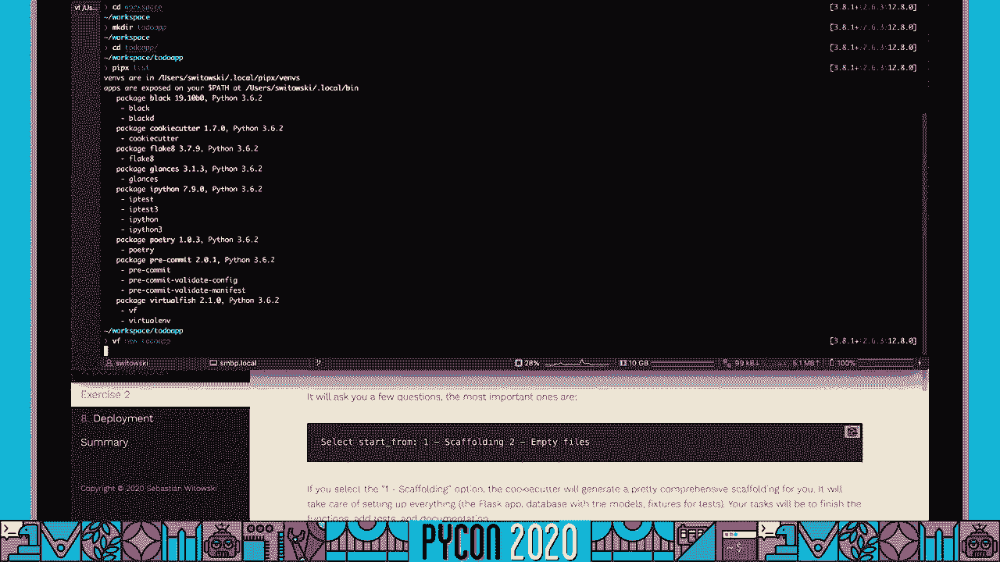

嗯，这很有趣。

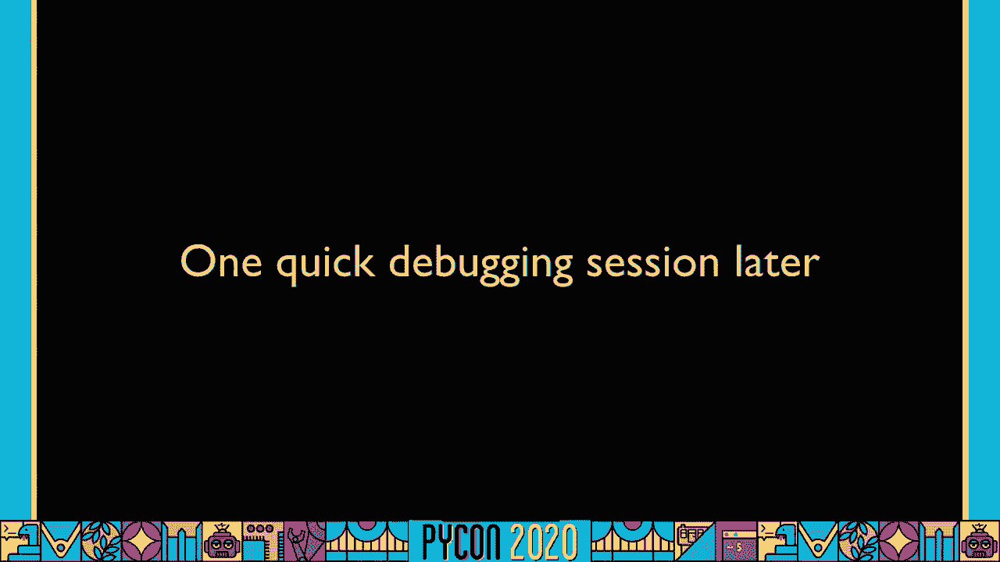

所以，结果是我在切换 Python 版本时搞砸了，virtual fish 不喜欢 3.8，所以我回到了 Python 3.6.2，现在应该可以正常工作。所以你应该看到的正确日志，而不是一些可怕的 shell 错误。我提到过我有多开心这不是实时编码，我实际上可以去修复一些错误吗？

你不需要盯着我随机运行命令半个小时。我们应该更频繁地这样做。所以我们有一个文件夹，有一个虚拟环境。让我们运行 cookie cutter。让我复制一下这个。我收到这个消息是因为我已经下载过它。让我们重新下载。Cookie cutter 会问你几个问题。

其中一些不那么重要，另一些则更重要。这是我的名字，所以我会坚持使用。给名字，咱们就保留这个。描述保持不变。目录名称。好吧，让我们保持两个。所以这里是重要的部分。我到现在为止忘记提了，但我会在这个简单的 web 应用中使用 Flask。

如果你选择第一个选项，那么骨架，cookie cutter 将为你的应用程序生成一个相当全面的骨架。它会负责设置一切，包括 Flask 应用、带有模型的数据库、测试用的图片，而你的任务就是完成函数，添加测试和文档。如果你不知道 Flask，或者很久没有使用过它，或者你对网络开发不熟悉。

一般来说，如果你在开发中，我建议你选择这个选项。这将使你更容易完成这个教程，但你可以随便看看我是如何实现的。如果你选择第二个选项，那么空文件，cookie cutter 将生成大部分空的文件，里面有很多待办事项的注释。

我生成这些文件的主要原因是为了强制执行一些结构。一个简单的 Flask 网站可以写在一个文件中。但这个练习的主要点之一是学习如何将项目拆分成不同的部分。所以我们选择第二个选项。这个选项将为你生成 HTML 骨架。

我建议你选择 S。这将生成一个带有一些 Bootstrap 样式的简单 HTML 网站。如果你现在选择，你将不得不自己编写 HTML，而这个练习并不真正是关于编写 HTML 的。但这取决于你。最后，你可以选择一个许可证。这是 cookie cutter 模板中一个相当常见的问题。我将选择一个。

所以如果我们查看当前文件夹，你会看到我们创建了一个待办事项文件夹。如果我们进入那里，你会看到我们有几个文件。

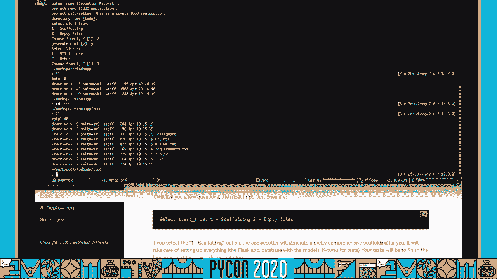

让我们在这里打开 VS Code。在 README 文件中，你会看到运行这个应用程序所需的所有步骤。我们已经有一个虚拟环境，所以你可以跳过前两个步骤。然后在 requirements.txt 中，你会看到一些要求。我们使用 Flask。

Flask SQL Alchemy、Sphinx 和 Pytest。那么回到 README，你会看到我们首先需要安装要求。

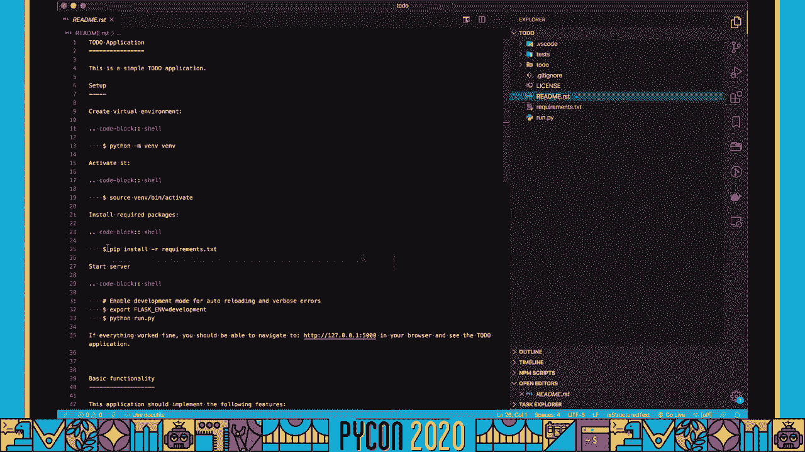

所以让我们来做这个。

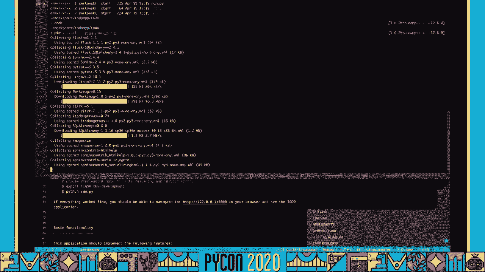

现在我们终于可以尝试运行我们的应用程序了。但首先，启用开发模式以实现自动重载和更多详细错误。请记住，你不想在生产环境中这样做。但对于开发来说，这是推荐的选项。如果我们尝试启动服务器，将会出现错误，因为运行 p。

i。是空的。

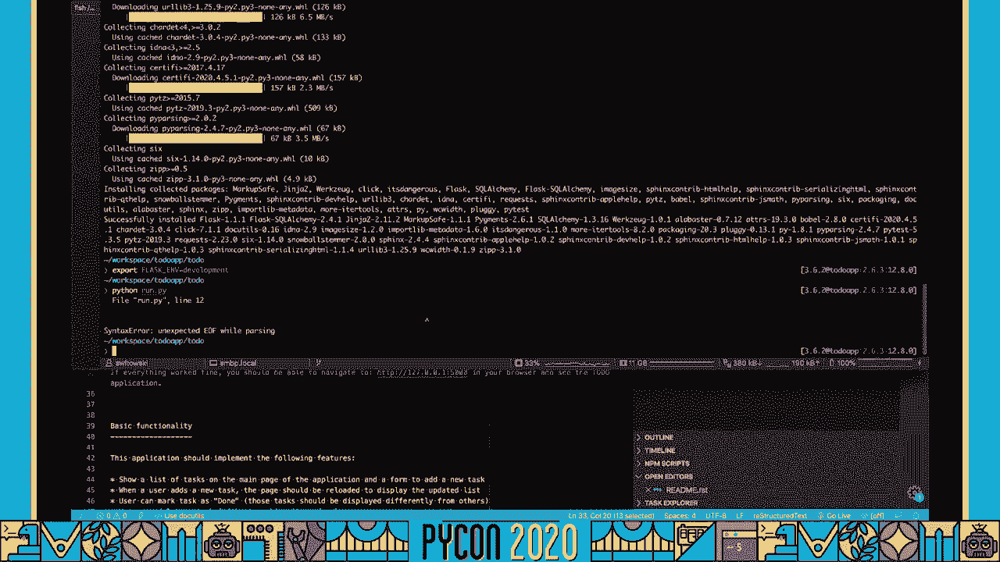

这里是你开始的地方。你需要在这里放一些代码，以设置所有内容并运行 web 服务器。然后检查其他一些文件。你可以看到我们有 Views。在这里你应该创建一些视图并将它们连接到 URL。然后我们有 Models。在这里我们应该有一个任务的数据库模型。它应该至少包含主体。

任务的文本。而 Done 是一个布尔值，用于定义任务是否完成。然后我们有一个 API。因此，我希望你编写 Views 文件，调用 API 中的函数，而不是在视图函数中列出、创建、删除和完成任务。

API 中的函数将调用模型中的函数。在模板中，我们有用于我们应用程序的 HTML 页面。有很多代码，但大多数只是 bootstrap 样式。你可以看到我们的 HTML 模板正在期待一个任务列表。然后它会遍历每个任务并打印一个任务。这个任务应该有两个属性。

用于指定任务是否完成的内容。还有包含任务文本的主体。最后，我们有一些建议你预期的视图的 URL。因此，我们应该使用已完成的斜杠任务 ID 来标记任务为已完成，并使用删除来标记任务为删除。此外，这里有一个表单用于创建新任务。它将发送一个包含文本的有效负载到斜杠任务的 URL。

然后我们有一个测试文件夹用于我们的测试，但目前是空的。我们没有文档的测试，因此我们必须使用 Sphinx 生成它。

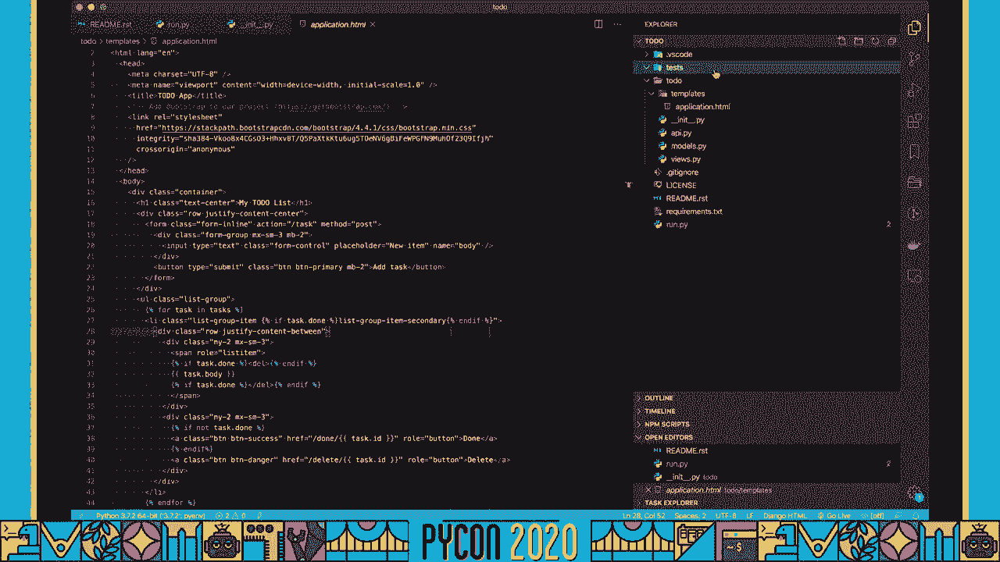

好的，我们可以在这里暂停视频，尝试做这个练习。如果你是从零开始，你可以完全忽略我的项目结构，随意编写。如果你决定从脚手架开始，并且在某处卡住了，不用担心。稍后我会向你展示如何编写这个项目，编写与我们匹配的代码。

在脚手架中已经有了。所以请暂停视频，尝试自己编写。如果你卡住了并想看看最终解决方案，可以访问这个 GitHub URL。

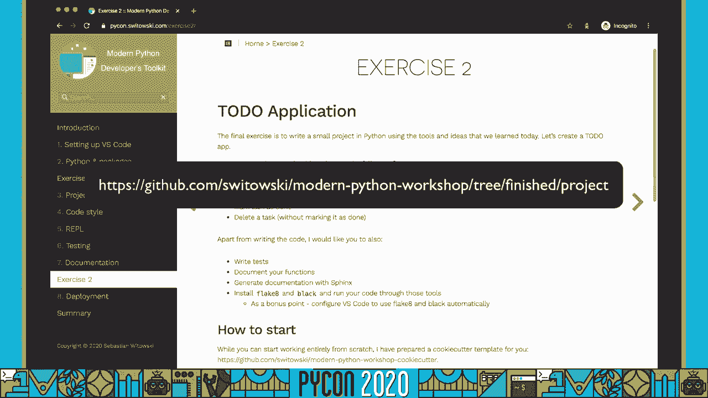

现在，我将向你展示我将如何编写这个项目。那么我们从品牌 PY 开始吧。

在这里，我会从我的项目中导入 up 并简单地运行它。所以现在我们实际上需要在某处创建这个 up。如果我进入我的待办事项目录，我将使用 inid.py 文件。在许多项目中，你会看到 inid.py 是空的。这是因为如果有一个带有 inid.py 文件的文件夹，意味着它是一个 Python 包。

包。现在你实际上不需要创建这个 inid.py 文件，因为我们有隐式和显式命名空间包。但这是另一回事。无论如何，关于 inid.py 的一个好处是我可以在这里放一些代码，然后我将能够像这样从待办事项中导入一些函数，而不是这样做。

从待办事项的文件名导入。所以让我们去这里。导入 Flask，并设置应用程序。你可以看到我的 lint 报告说无法解析 Flask。这是因为我使用了错误的虚拟环境。所以让我们更改它。正如你所看到的。

VS Code 实际上可以检测到我们有一个待办事项应用的虚拟环境。所以让我们使用这个。现在我们不再有这个警告，因为 Flask 已经安装在我们的虚拟环境中。所以让我们尝试运行我们的 Flask 应用程序。这次我将实际从 VS Code 执行。因此，让我们创建一个 launch.json 文件。它将是 Flask 应用程序的路径。在我的情况下。

这是 run.py。让我们看看。这是个巨大的。

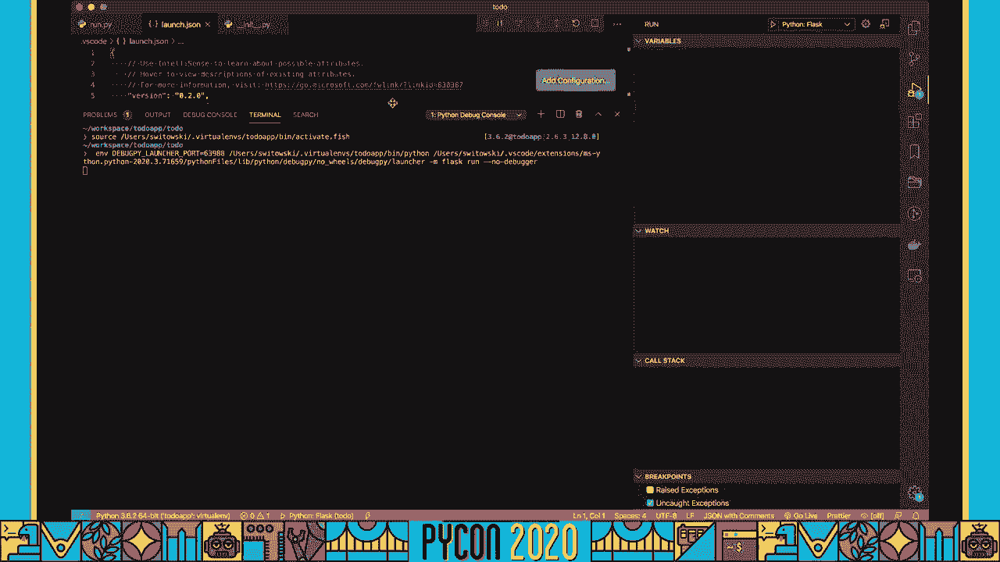

我知道。好的，似乎可以工作，如果我们打开它。好的，有什么事情在发生。但我们得到了 404。这是因为我们实际上在应用程序中没有任何 URL。

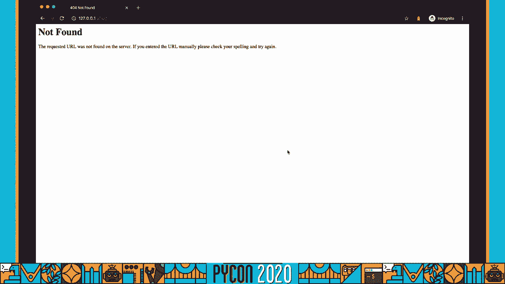

那么我们回去吧。停止我们的服务器。这个文件不再需要。我想获取一些空间。让我们实际上隐藏所有内容，因为我想在屏幕上获得一些空间。所以让我们进入视图并实际实现主页。在应用程序的主页面上，我们只想显示任务列表。

所以我们创建一个名为任务列表的函数。现在，由于我还没有数据库，我将初始化一个空字典作为任务列表。现在我需要渲染我们的 application.html 模板。我们得到一个错误，提示这个名称未定义。所以让我们看看是否可以通过 VS Code 的快速修复功能解决它。

对，这没错。这应该放在这里。我可以移除这个。现在我们实际上需要将这个函数连接到一个 URL。现在我们实际上需要导入我们的应用程序。因为我们的待办事项应用不知道视图，所以这还不能工作。我们去 ini.py。在初始化应用程序后，我们需要导入视图。嗯，这看起来太糟糕了。

但如果我们把导入移到这里，我们将遇到循环导入问题。所以它必须留在这里。正如你所看到的，它会对此感到抱怨。所以我们需要添加一个注释来禁用当前行的一个错误。我还需要告诉 iSort，这是一个排序你的导入的工具，它应该。

将此导入保留在原处。否则，它将被移动到文件顶部。这不好。在一个更大的 Flask 项目中，你可以通过使用扩展文件来解决这个问题。查看这个 Stack Overflow 答案，了解如何使用它。但在这个只有三个文件的小项目中，添加另一个文件只是。

解决这个导入问题似乎有点过于复杂。

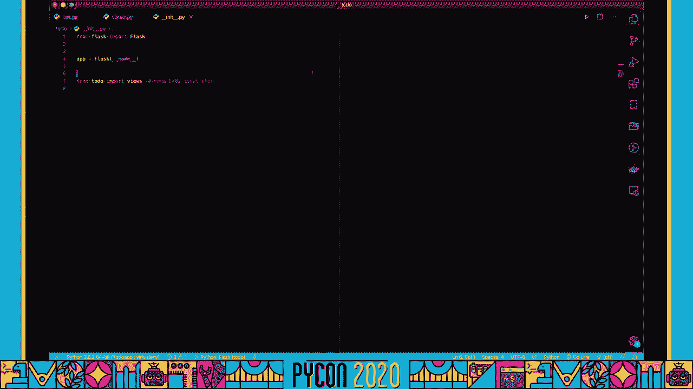

这并不总是最佳解决方案。好的，让我们再次启动服务器。正如你所见，我们有了美丽但空白的待办事项列表。我们可以输入一些内容，但因为我们仍然缺少一些 URL，所以会出现“未找到表单”的错误。

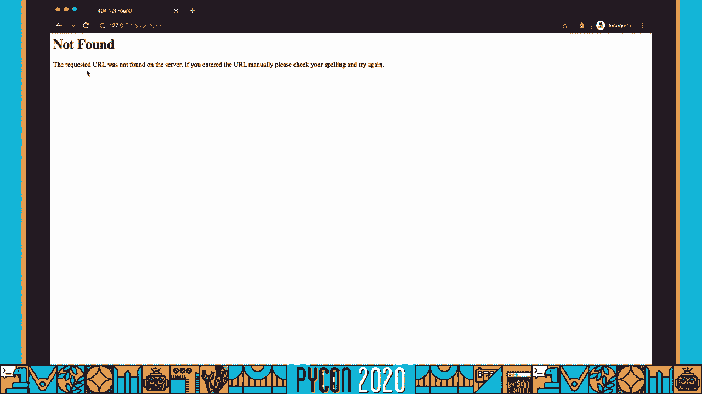

所以让我们现在修复它。我们想能够将任务添加到我们的待办事项列表中。为此，我们需要实际存储它们。因此，让我们在应用程序中添加一个数据库。让我们去我们的初始化文件，设置一个数据库。我将使用 SQLite 作为我们的数据库。通常我建议你使用一个更好的数据库，如 Postgres，即使是在开发阶段。

机器。但对于这个简单的示例，SQLite 完全可以满足需求。接下来，让我们查看我们的模型，并实际为数据库创建一些模型。这里我们从我们的初始化文件中导入 db 对象。因此，我们有一个名为 task 的表，它有三列。我用它来标记任务是否完成或删除它们。

包含任务文本的主体。而 done 是一个布尔字段，指明任务是否完成。让我们去我们的视图，写一个可以让我们添加新任务的函数。因此，我们将从表单的这一部分获取任务的主体。然后在我们创建任务后，我们想将用户重定向到主页。嗯，这不正确。

我们想从 Flask 重定向。所以我们也需要从 Flask 中获取请求。Flask 的一个好处是请求是全局的，因此我们可以在任何地方导入它。所以在这里，我们可以直接在数据库中创建一个任务。但我更喜欢为我们应用程序的公共 API 保留一个单独的文件。首先。

这将更容易为它编写单元测试。如果我们决定提取我们的 API，例如用它来进行 REST API，这将更容易做到。因此，让我们去我们的 API.py 文件，创建一个函数在那儿创建任务。这应该没问题。

让我们还创建一个函数来列出所有任务。好的，这应该没问题。现在我们到这里，实际上想要使用我们新创建的函数。别忘了导入它。在这里，我们实际上可以调用我们的函数。这就足够了。我们还需要在这里添加它。

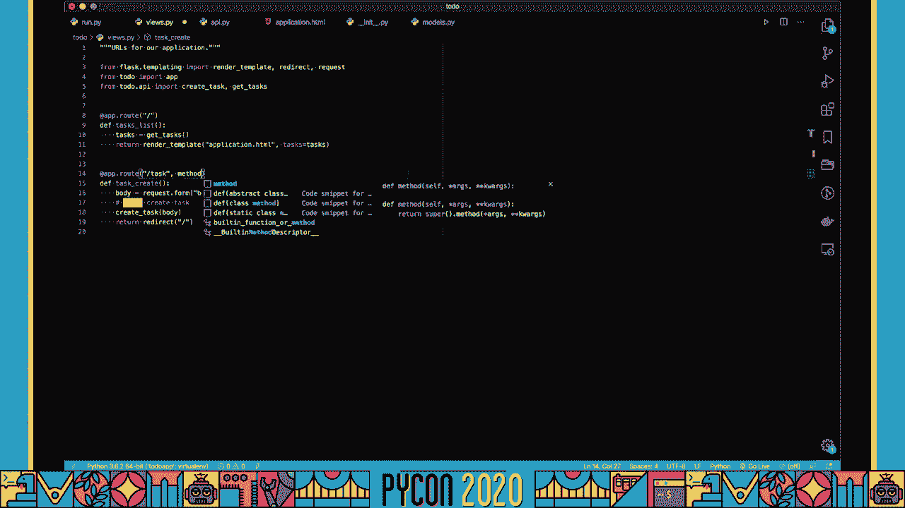

现在让我们运行我们的服务器。不，我们做不到。我们遇到了另一个“无法导入名称重定向”的错误。好的。这是因为它不在模板模块中，而是在 Flask 本身中。所以现在应该没问题了。再试一次。好的，它在工作，但我们得到这个奇怪的错误。其实这不是错误，而是弃用警告。它甚至表示你可以设置一个配置变量来消除这个消息。

所以让我们这样做。重启服务器。

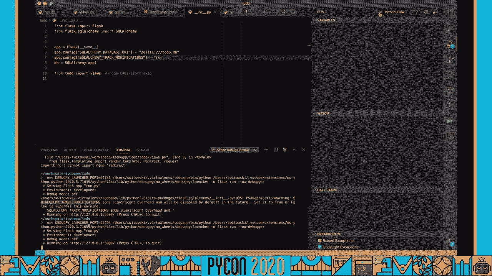

我们完成了。让我们去我们网站的根目录。有什么问题。

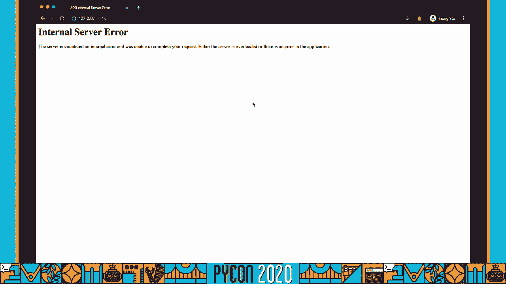

啊，是的。我们忘了实际创建数据库。所以为了修复这个问题，让我们去 `random.py` 文件。导入数据库，然后实际删除并重建表。这将确保每次重启服务器时都删除并重建表。对于这个应用程序来说，这完全没问题。但通常你可能希望在服务器重启之间保留数据库。

为了做到这一点，你可以检查数据库是否存在，如果不存在则创建它。所以让我们再次运行服务器。

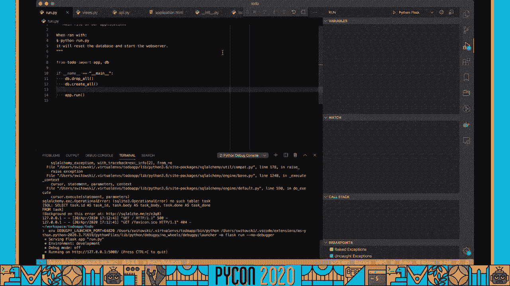

它刷新了。哦，拜托，还是有点问题。

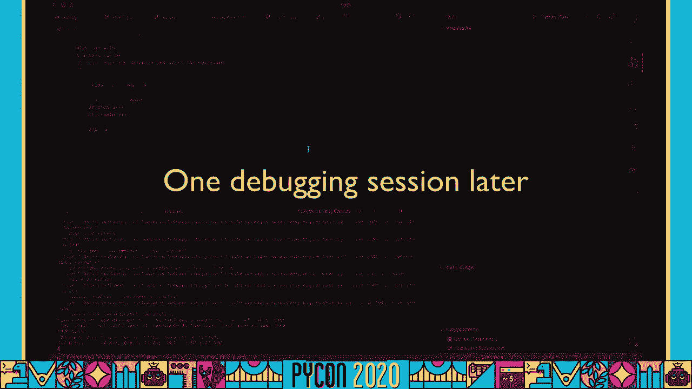

结果是，使用 launch JSON 文件启动应用程序实际上并没有创建数据库。所以我们必须去控制台运行，或者直接通过按下这个按钮执行 `run.py` 文件。

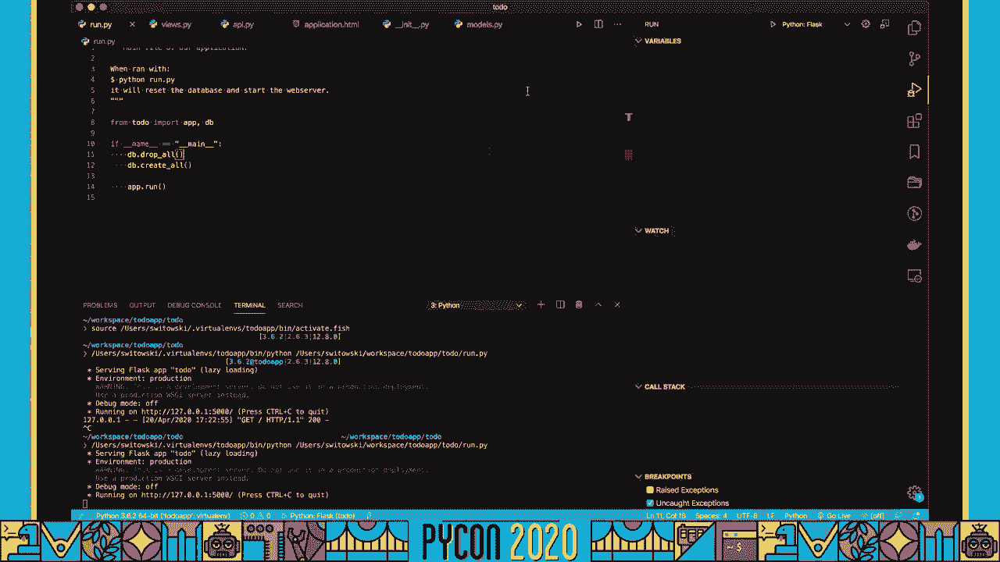

当我们进入待办事项文件夹时，你会看到现在我们实际上有了 `todo.db` 文件。

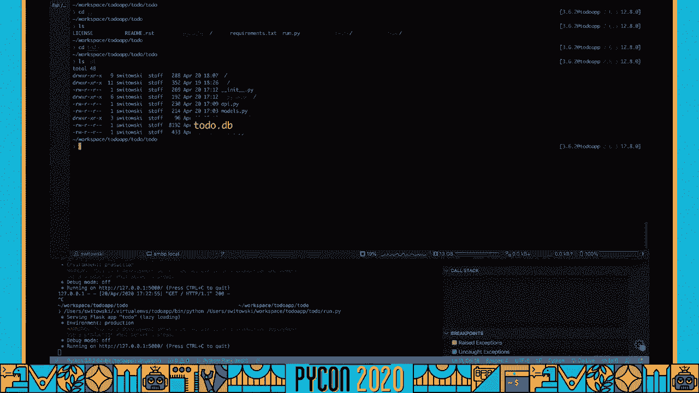

如果我们去浏览器，刷新一下。我们有了待办事项列表，并且可以实际添加任务。太完美了。现在我们需要添加功能来标记任务为完成和删除任务。

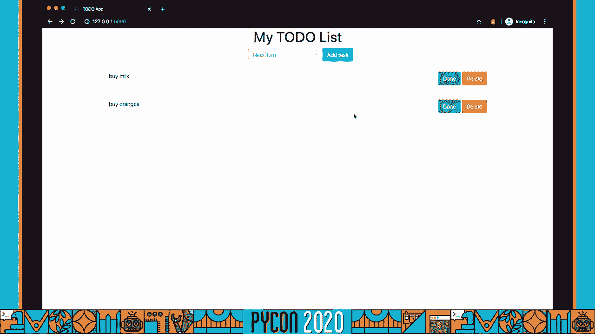

但是首先，让我们添加一些测试。先停止服务器。接下来，进入我们的测试目录，创建一个新文件 `test_up.py`。我们需要两个测试，一个是任务列表，另一个是任务创建。[BLANK_AUDIO]，[BLANK_AUDIO]。首先是这个。当然。这样就可以了。

唯一的问题是我们没有用于测试的数据库。我们可以使用与开发中相同的数据库，但这是一个糟糕的做法。让我们学习如何为我们的测试创建一个单独的数据库。因此在这里，我们将创建一个假应用程序，在我们的测试中使用。我们实际上可以进入我们的 `init`。

py。我打开了太多的标签。我们可以复制这个文件。并做一些修改。我们不想使用这个数据库。为了省去在所有测试后清理数据库的麻烦，让我们使用内存中的数据库。如果你有一个巨大的测试数据库，可能无法放在内存中。但由于我们的数据库很小，所以我们可以这样做。

还需要将应用程序配置设置为测试。好的，我们需要做一些导入。这是一个测试夹具，所以我们需要一个特殊的装饰器。这个 `db.all` 实际上不需要，因为我们使用的是内存数据库。无论如何它都会被删除。但通过这个简单的夹具，你实际上可以使用不同类型的数据库。

所以通过这个设置，我们可以回到我们的测试，确保它使用这个测试应用程序。好的，接下来我们来实际运行测试。配置测试，通过测试测试。好的，现在我们有了魔法 flask。但测试发现失败了。有一个错误。是的，好的，这就是问题。没有名为待办事项的模块。

如果你收到这样的错误，请确保你的测试目录中有 init.py 文件。这应该可以修复，否则你可以用 Python -m pytest 运行你的测试。

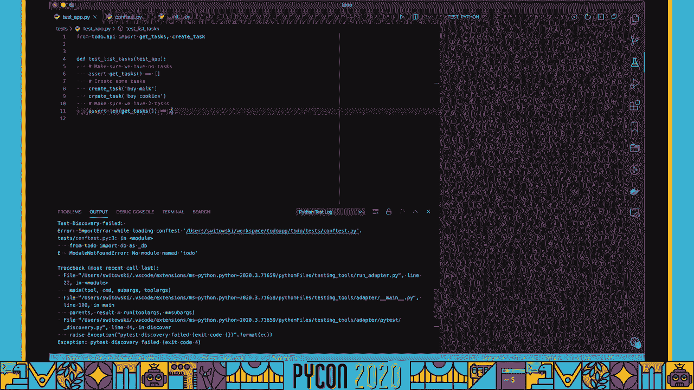

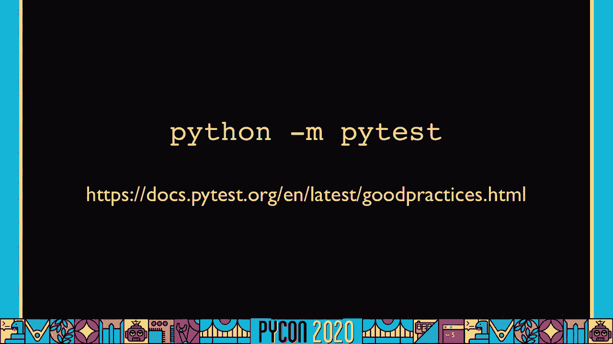

现在我们有了。我们有一个测试，并且它是绿色的，所以通过了。接下来，让我们测试创建一个任务。我们还需要通过测试。确保我们有一个任务。确保它有一个正确的正文并且未完成。这不是检查错误的方法。这是检查的方法。这里有两个空格，然后让我们运行这个测试。完美。

现在我们有两个测试，并且都通过了。让我们继续标记任务为完成并删除它。为了改变一下，让我们实际开始编写测试。让我们从完成一个任务开始。要完成一个任务，我们实际上必须有一个任务。所以让我们创建一个。让我们确保我们有一个任务。实际上这不是必要的，因为我们已经在测试 get_tasks 函数了。

但宁可保存也不要后悔。让我们获取第一个任务。我们需要这个任务的 ID，因为我们将根据它们的 ID 完成任务。现在让我们调用一个尚不存在的 finish_task 函数。最后，我们想确保我们的 get_milk 任务的完成状态为真。

现在我们必须实际编写 finish_task 函数。所以我们去我们的 API。好的。我们有一个函数。让我们运行测试。哦，让我们导入它。然后运行我们的测试。完美。它通过了。现在我们有三个测试。所以让我们在这里为删除任务编写一个测试。但在此之前，让我们确保在测试中我们实际上是获取最新的。

在这里获取任务的版本。所以让我们再次运行 get_task。这样我们可以确保没有使用某个未完成的缓存版本。现在返回到删除测试。我们实际上可以复制之前任务的大部分代码。我们需要将 finish 改为 delete task。现在确保我们没有任务。再来一次。

我们必须编写 delete_task 函数。让我们导入它。然后运行我们的测试。完美。所有测试都通过了。最后一步是将这些 API 函数连接到视图。所以让我们打开视图，创建一个函数来完成任务。我们称之为 task_done。我们需要接受任务 ID，并且我们可以从路由中获取它。

现在我们只需要在我们的任务上调用 finish 函数。并重定向回主页面。这是未定义的。太好了，这就是完成任务的路径。现在让我们创建另一个用于删除任务的路径。它看起来非常相似。所以我们复制这段代码。我们导入它。就这样。让我们启动服务器，打开浏览器。

并查看它是否工作。

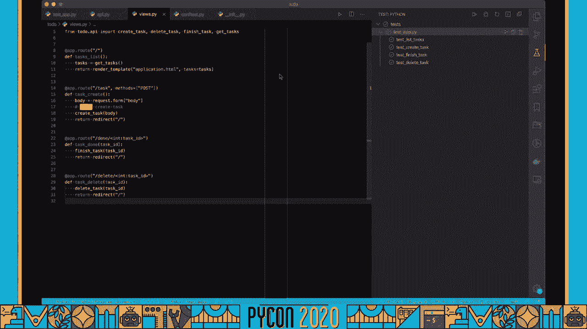

让我们将这个标记为完成，并删除这个任务。完美，如果我们刷新，它就有效了。太好了，我们的简单待办应用程序已经在运行。唯一缺少的部分是文档。

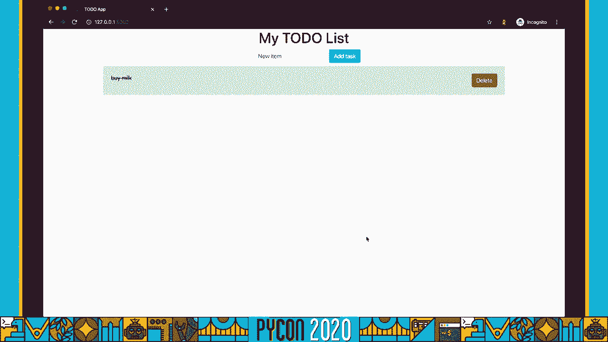

从我们的文档框架开始，使用 SphinxQuickStart 命令。我们将使用 docs 文件夹。让我们进入 docs。然后进入 source。接着修改 index RST。

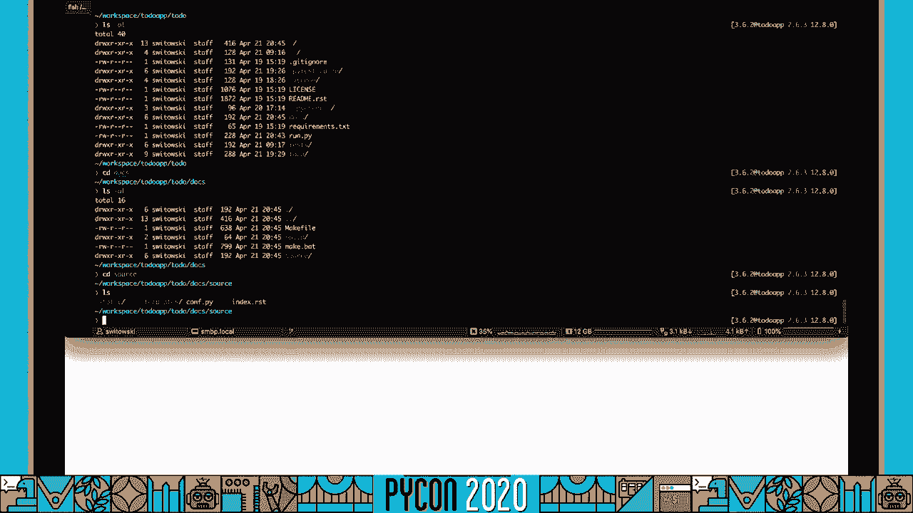

首先，让我们去掉这个。现在，代替手动在这里写点什么，我实际上可以导入我已经在 README 文件中拥有的内容。如你所见，我的 README 不是以 markdown 格式，而是以 RST 格式写的。正因如此，我可以在这里导入它。我想要这个。

我想实际拥有两页。一页是用法说明，另一页是 API。我不需要这个。所以现在我们必须创建用法页面。让我们加个标题。并放一些你如何使用它的信息。好的，你可以在这里添加更多信息，但我们假设这些已经足够了。接下来。

我们需要创建一个 API 文件。在这里我想为 Views、Models 和 API.py 文件提供文档。所以让我们称之为 API 参考。顺便说一下，那些奇怪的下划线就是你在 RST 中创建标题的方式。让我们复制这个。现在可以了。为了使它真正工作，我们必须去 cont.py 并包含一些扩展。但是首先。

确保我们有正确的系统路径。这和我在谈论 Sphinx 时给你展示的技巧是一样的。我们需要这样做，以确保 Sphinx 可以导入我们的待办模块。现在让我们去扩展。我想要 Auto-Daw。我还想有链接到源代码。如果你想测试你的 Sphinx 文档，你也可以在这里放置文档测试。

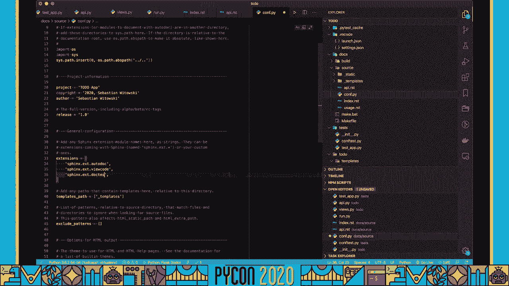

好的，我们应该没问题。让我们生成 HTML。然后在浏览器中打开文档。

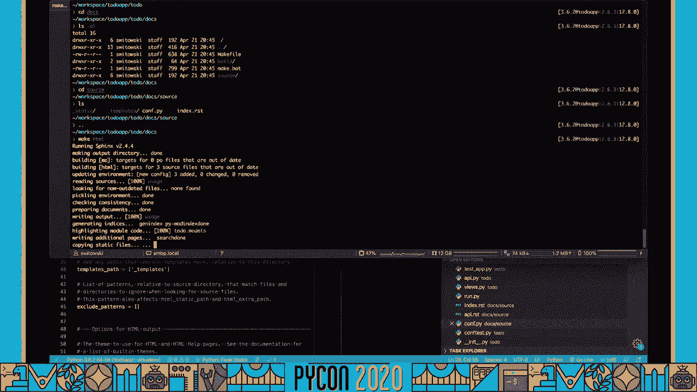

太好了，它正在工作。所以在这里你可以看到我们已经很漂亮地包含了 ReadMe。你可以查看包含我们简单说明的用法部分。然后我们可以去 API 参考。由于我们在 Boder 中记录了我们的函数，它是空的。让我们来解决这个问题。

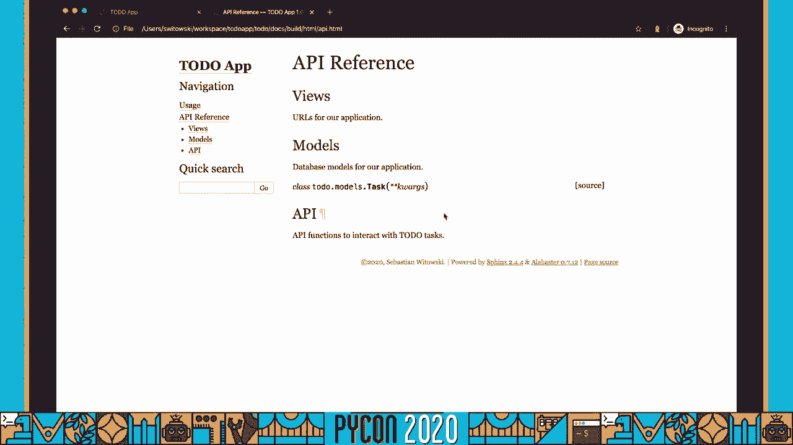

让我们关闭一些标签。然后记录一些 API 中的函数。所以这里我们有一个创建任务的函数。我们实际上必须使用 Sphinx 格式来记录参数。所以让我们去掉这个。再记录一个函数，也许是完成任务。让我们重新生成文档。

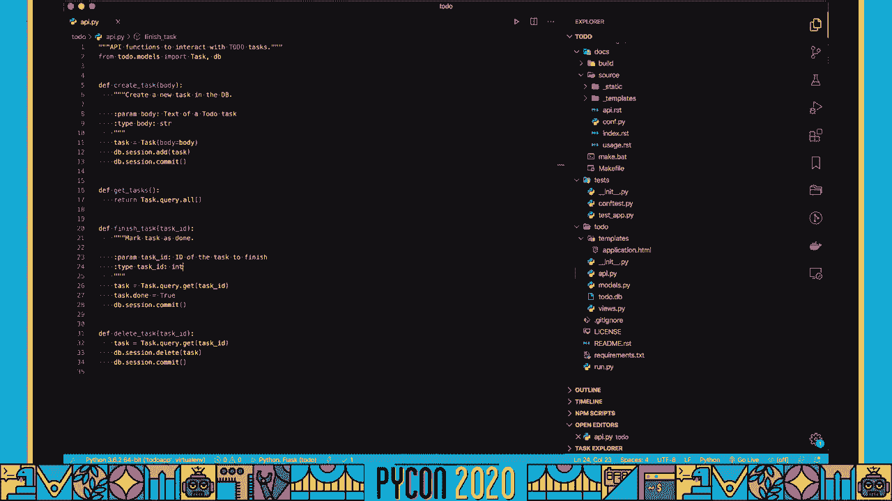

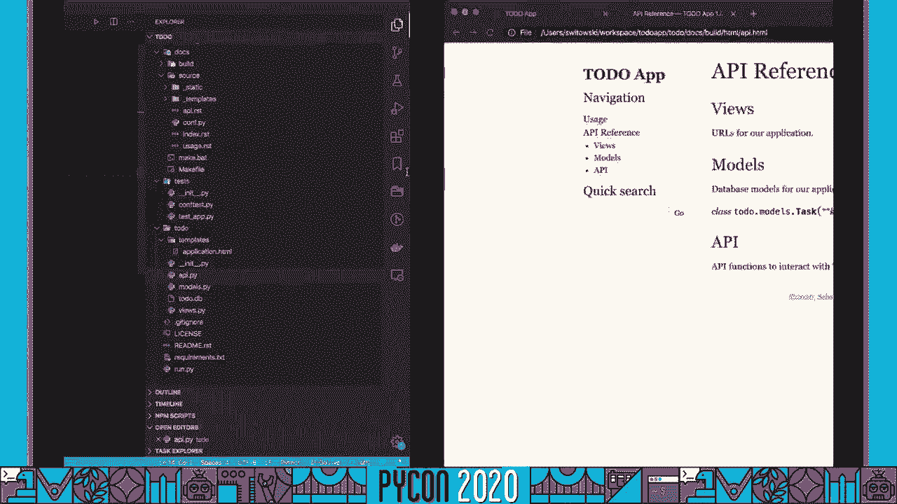

让我们刷新。完美，我们在这里有了更漂亮的文档。如果我们点击源代码，我们可以看到我们函数的主体。就是这样。我们的简单待办应用完成了。它非常基础，但有一些测试。

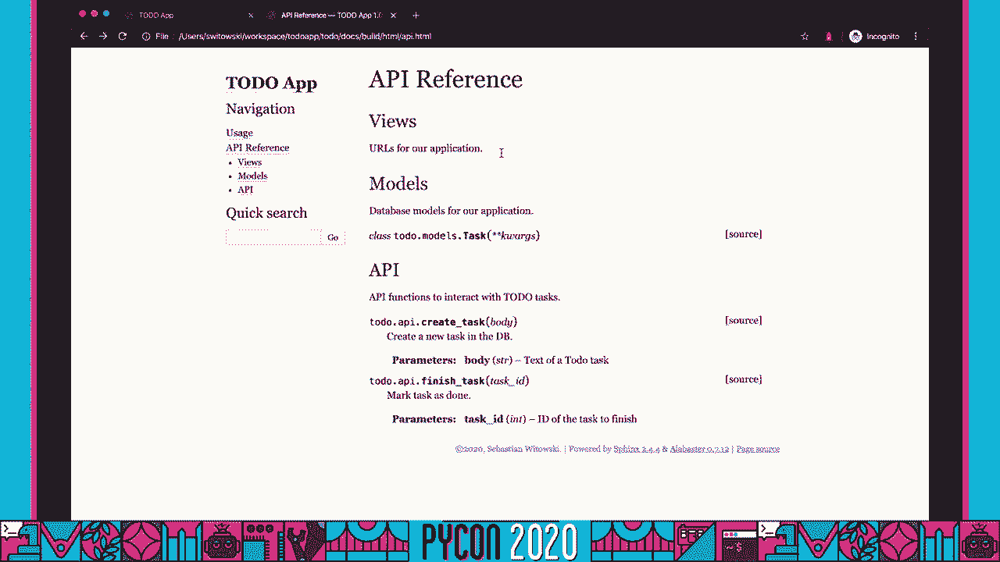

它有一些文档。我建议你自己写剩下的文档。

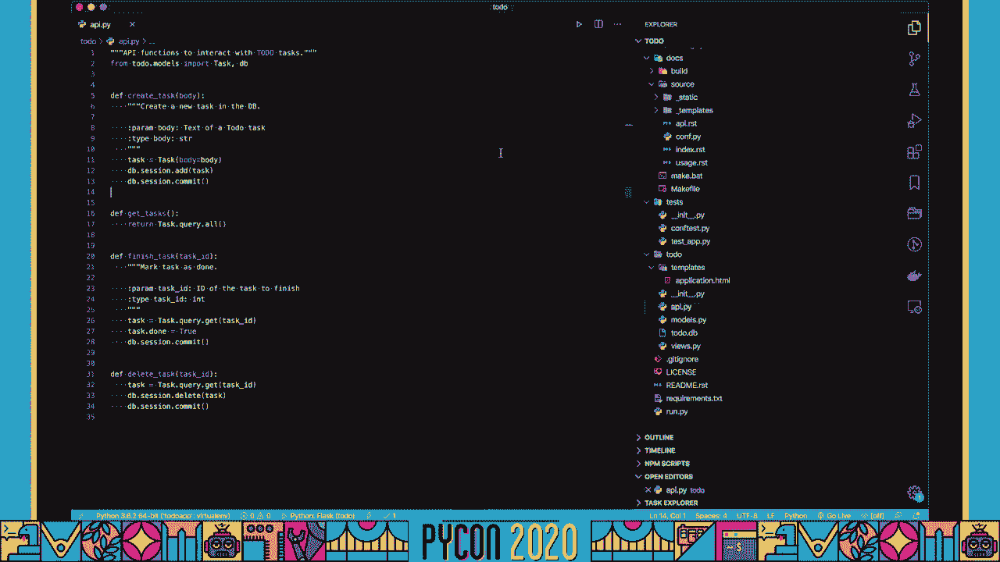

要查看最终版本的代码，请访问此网址。确保您在分支代码完成上。您可以在这里找到所有代码。如果您能做到这一点，做得很好。我希望您学到了一些东西。我知道这个研讨会已经有点长了。

但我还有一个话题要讨论。这个话题是部署。有很多不同的方式可以部署您的应用程序，Docker 是目前流行的方法之一。如果您不知道 Docker 是什么，那么我的简短解释可能不会对您有帮助。但简单来说。

Docker 是一个用于将您的应用程序容器化的工具。这意味着它可以创建一个名为镜像的包，里面包含您的应用程序代码和所有依赖项。所以窥探包，还有您通过 AppGet 安装的包，以及如何运行您的包的信息。然后您可以将这个镜像发送到服务器。

如果 Docker 已安装在该服务器上，您只需一条命令，就可以让您的应用程序运行起来。Docker 大大减少了部署的麻烦，但它并不是一个简单的工具。我将向您展示一个非常基本的示例。如果您想确保您的应用程序是安全的。

您真的应该了解 Docker 的高级功能。一开始，可能会很沮丧，因为这又是一个您必须学习如何使用的工具。如果您的应用程序无法工作，您将不知道是代码的问题还是 Docker 配置的问题。但一旦您学会了，部署应用程序会容易得多。所以在我看来。

Docker 值得花时间学习。尤其是现在，它已成为一种基本技能。即使对于软件开发人员，也不仅仅是针对 DevOps。因此，要将我们的应用程序 Docker 化，我们需要创建一个 Docker 文件。这是一个非常基本的 Docker 文件示例，可以工作。让我们拿这段代码并用它在我们的待办应用程序中创建一个新的 Docker 文件。

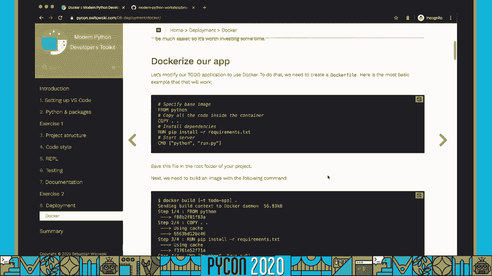

接下来，我们需要运行一个命令 Docker build。

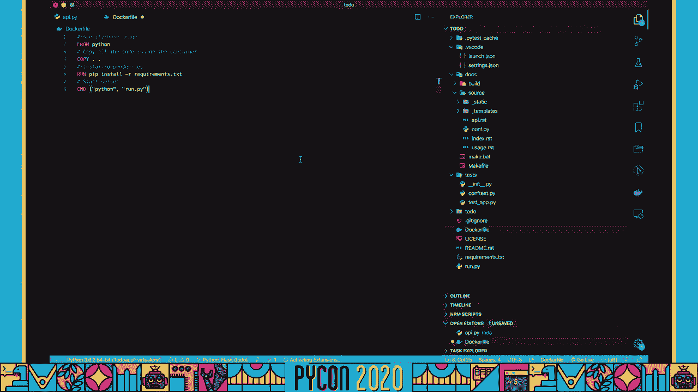

可选地，我们可以指定一个标签。使用标签通常是个好主意，因为否则 Docker 会分配一个完全随机的名字，比如这个。

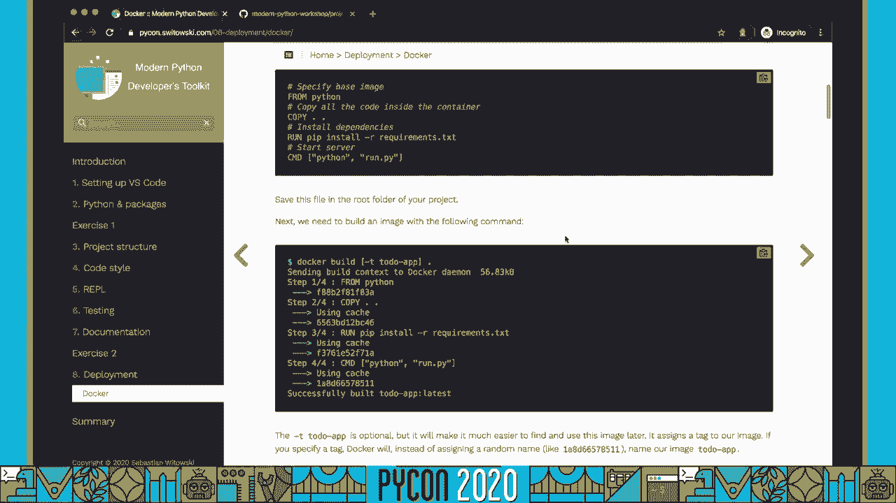

所以我们来做这个。确保您在 Docker 文件所在的同一目录中，然后运行命令。一旦我们的镜像构建完成，我们就可以启动它。

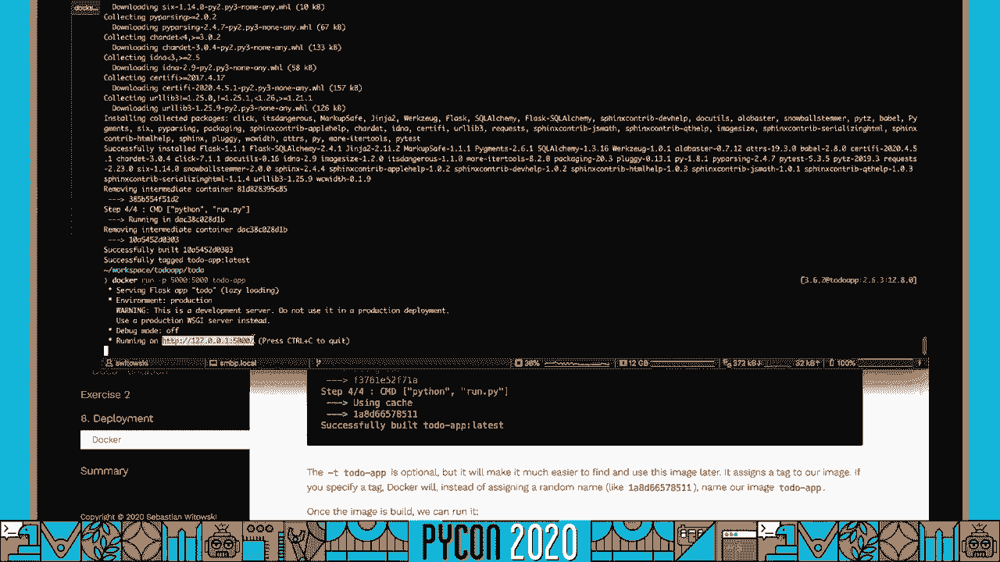

如果我们在浏览器中尝试打开这个网址，效果不好。

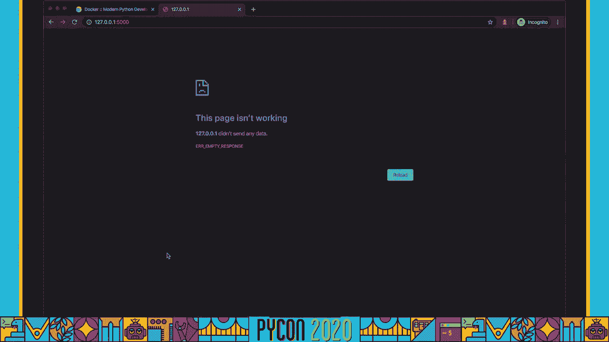

好吧，我要多调试了。我忘了对 run.py 文件进行一次更改。默认情况下，应用程序运行命令将 flask 应用程序绑定到本地主机。而在 Docker 中，本地主机实际上并没有暴露，因此我们必须将其绑定到主机 0.0.0.0。

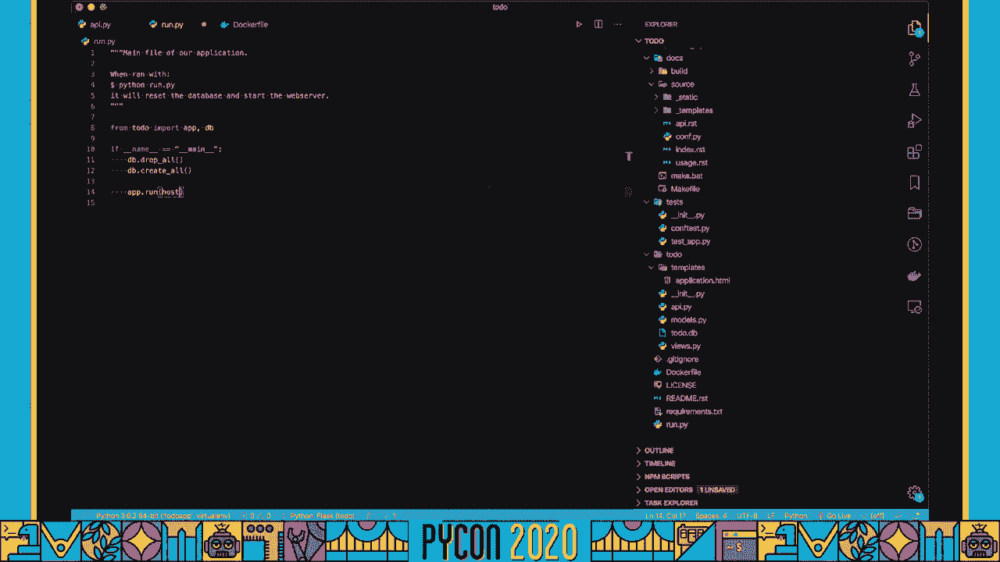

这应该可以解决问题。那么让我们重建我们的 Docker 镜像。正如你所见，它正在重新安装所有包。我稍后会告诉你为什么这是错误的，以及我们如何修复它。最后完成了。那么让我们启动我们的服务器。

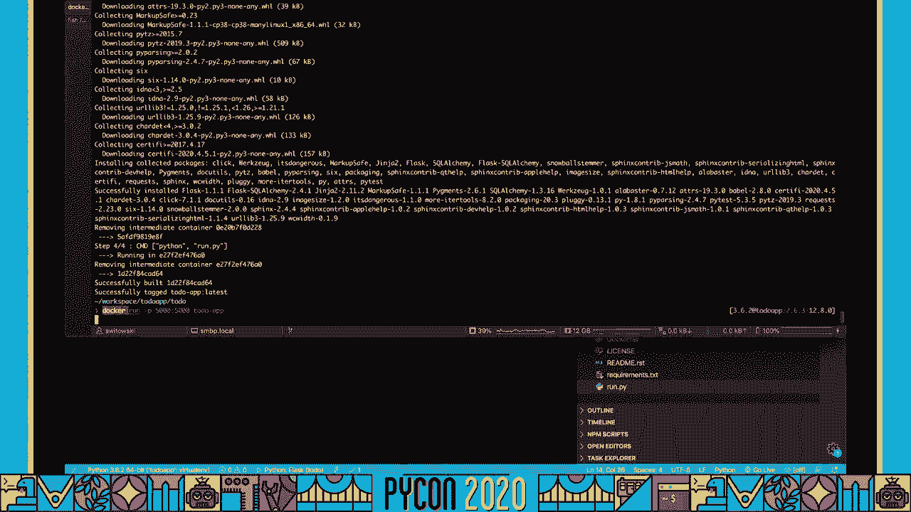

再试一次。完美。它在工作。我们可以添加任务，所以数据库在那里。我们可以将它们标记为完成。并告诉它们。

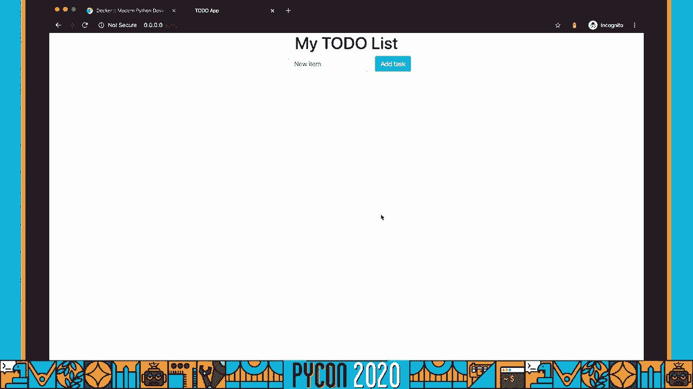

现在一切正常，让我们谈谈为什么我们的 Docker 文件是错误的。首先，我们的应用程序尚未准备好发送到生产环境。我们仍在使用 SQL Lite 数据库。调试器是启用的。好吧，这两个问题可以通过适当的数据库，如 PostgreSQL、Docker Compose 和环境变量来解决。但即使不考虑我们 Flask 应用程序的问题。

我们刚刚编写的 Docker 文件远非完美。这里有一些问题。在第一行中，我们指定了 Python 作为我们的基础镜像。但我们没有指定标签，因此 Docker 将拉取最新的镜像。在撰写本文时，这是 3.8.2。但是后来最新标签将变为 3.8.3、3.9 等等。

如果新版本的 Python 引入了一些重大变化，你只会在应用程序崩溃后才会注意到。所以始终为基础镜像指定一个标签。在第二步中，我们将当前目录中的所有内容复制到容器的根目录。这存在一些问题。主要问题是我们没有使用缓存。

Docker 将缓存构建阶段的每个步骤。Docker 文件中的每个命令都是一个构建步骤。当你运行 Docker build 命令时，Docker 将检查是否需要运行此步骤，或者它是否可以重用缓存。例如，如果你没有更改基础镜像，Docker 将使用缓存的镜像，而不是重新下载它。

如果你有一个命令来使用 app get 安装一些包，而你没有至少修改它，Docker 将重用缓存层，而不是重新安装所有包。一旦 Docker 到达一个无法使用缓存的步骤，它将重新运行此步骤及后续的每个命令。因此，了解缓存的工作原理以及如何利用它是非常重要的。

如果你没有正确构建你的 Docker 文件，那么构建时间会很长，你会在那里等待。在我们的案例中，我们复制所有文件，然后运行 pip install。现在每次我们修改项目中的任何文件，它都会使缓存失效，然后 pip install 会再次运行，尽管我们实际上没有添加任何新包，因此这并不需要。

我们可以先仅复制 requirements.txt 文件，运行 pip，然后再复制其余文件。这是一种非常常见的做法，这样 pip install 步骤只有在 requirements.txt 文件更改时才会失效。因此，通常您希望将安装某些内容的行放在 Docker 文件的顶部，并将可以更改的行尽可能放在 Docker 文件的底部。

如果您在模块结束时使用，并且目录的末尾在与您的项目相同的文件夹内，您会注意到每次尝试构建 Docker 镜像时，实际启动需要几秒钟。这是因为 Docker 正在将当前目录发送到 Docker 守护进程进行构建。并且 V 和文件夹实际上相对于其他文件来说相当大。

这个文件夹有几十兆，实际上 Docker 根本不需要这个文件夹。所以您可以将它移动到其他地方，或者您可以编写一个 Docker 忽略文件。同时我们也在将所有文件复制到容器的根目录。通常这无所谓，但如果您需要在容器中启动一个 bar 会话，情况可能会有所不同。

如果在那里面四处移动，您将会发现很难弄清楚哪些文件属于您的项目，哪些文件属于容器。因此，将您的项目复制到一个单独的目录中会更好。同时，我们也没有指定要使用哪个版本的 PIP。在我们的情况下，这可能不是大问题。Python 镜像会确保它使用的 PIP 版本。

它是无 bug 的。但是，如果您使用 apt-get 安装软件包，锁定软件包版本是个好主意。因此，请尽量始终指定您想使用的软件版本。99% 的情况下，您在没有锁定 apt 包版本的情况下应该没问题，但这可能会让您避免 1% 的奇怪 bug。同时，它也会帮助您进行缓存失效。

在这里，我们有一个如何改进 Docker 文件的示例。我们锁定 Python 版本，复制 requirements.txt，设置工作目录为 /project，然后运行 PIP install，接着复制其余文件。在这个阶段，您的缓存大多数时候会停止工作，但这没关系，因为仅仅复制文件和运行 Python 命令会花费您几毫秒。

最后我们运行 Python run 命令。所以让我们来看看这个改进后的 Docker 文件，重建我们的镜像，然后将其发送到 Docker Hub。

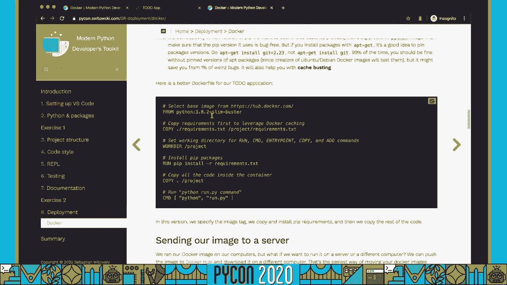

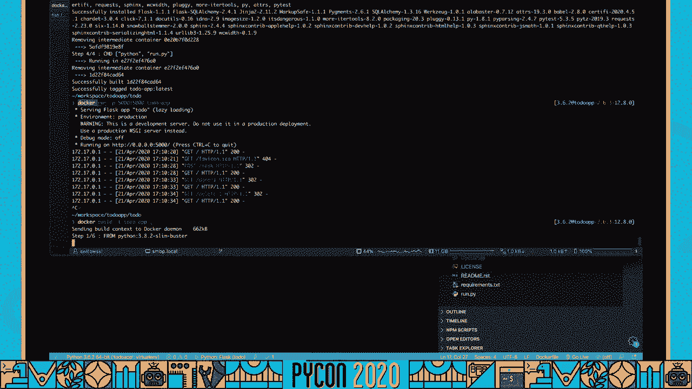

要完成最后一部分并使用 Docker Hub，您首先需要注册。Docker Hub 就像 GitHub，但用于 Docker 镜像。因此，请首先访问这个网址。点击注册，然后创建一个帐户。

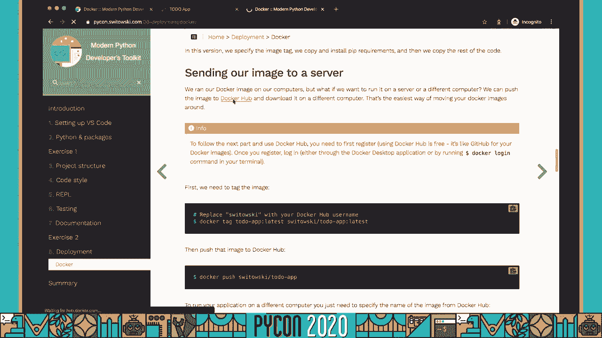

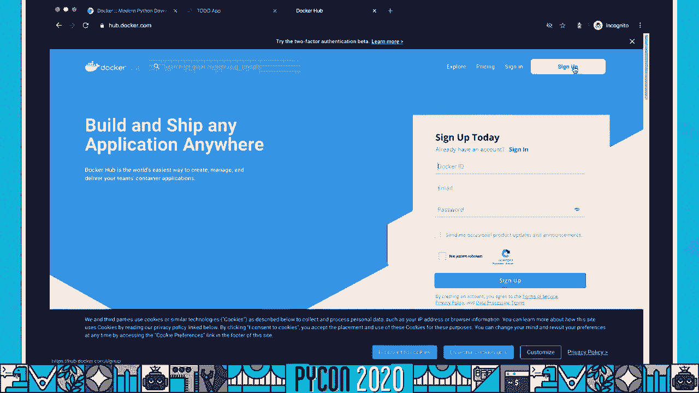

一旦您有了帐户，就必须通过运行 Docker login 命令来登录。

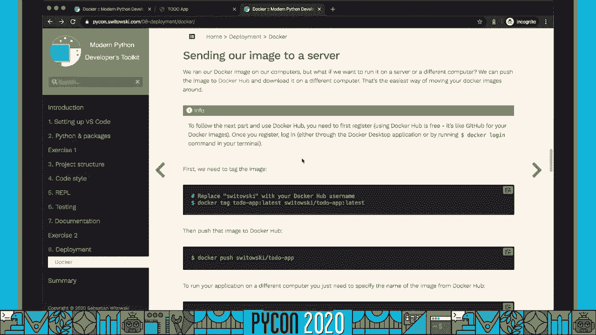

终端。我们的镜像构建已完成。让我们登录到 Docker Hub。通常它会要求你输入密码，由于我已经登录，所以我不需要执行这个步骤。

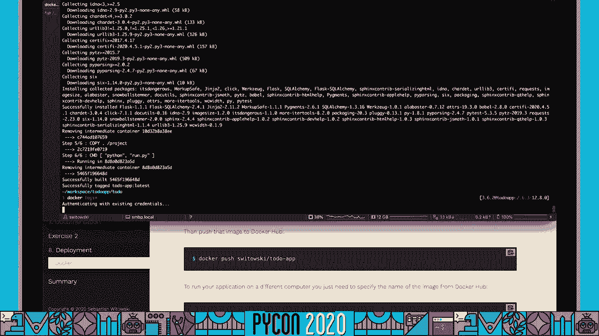

首先我们需要标记我们的镜像。确保将这一部分替换为你的 Docker Hub 用户名。现在我们将这个镜像推送到 Docker Hub。

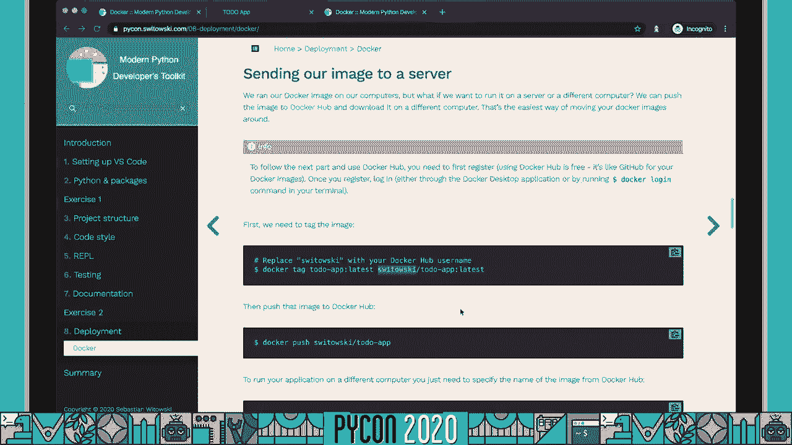

这将需要一些时间。

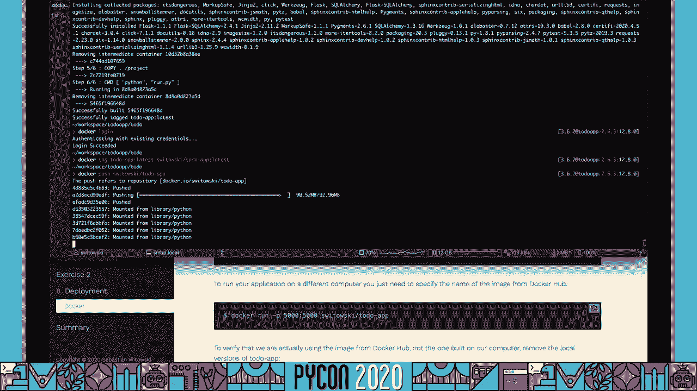

现在，要在另一台计算机上运行你的应用，你只需指定 Docker Hub 上的镜像名称。所以首先是你在 Docker Hub 的用户名，然后是镜像的名称。如果你在自己的计算机上执行这个步骤，可能想要确认你确实是在使用 Docker Hub 的镜像，而不是本地构建的那个。

首先运行这个命令来列出所有镜像，然后删除它们。

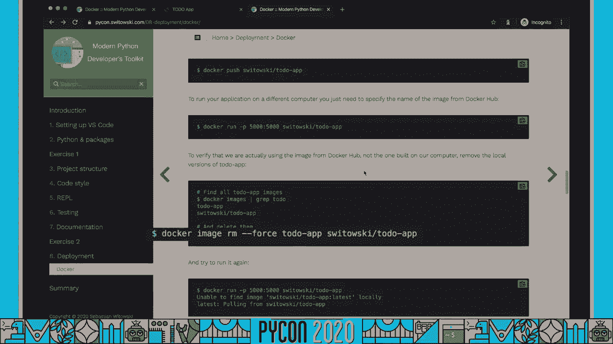

现在如果你执行这个 Docker run 命令，你会看到它无法在本地找到镜像，并将从 Docker Hub 拉取。如果你想在服务器上测试我们的镜像，我们可以创建一个 AWS 或 Google Cloud Platform 账户。但这需要花费金钱并且设置起来需要时间。对于我们的简单应用来说。

我们可以使用免费的 Play with Docker Playground。这不是一个适合生产环境的工具，但它是测试我们的待办事项应用的完美方式。所以让我们去这里。你可以用你的 Docker Hub 凭据登录。一旦登录，你会看到开始按钮，这将为你创建 Playground 会话。

它将持续四个小时。在此之后，这个会话中的所有内容都会被销毁。但你可以自由地启动另一个会话。

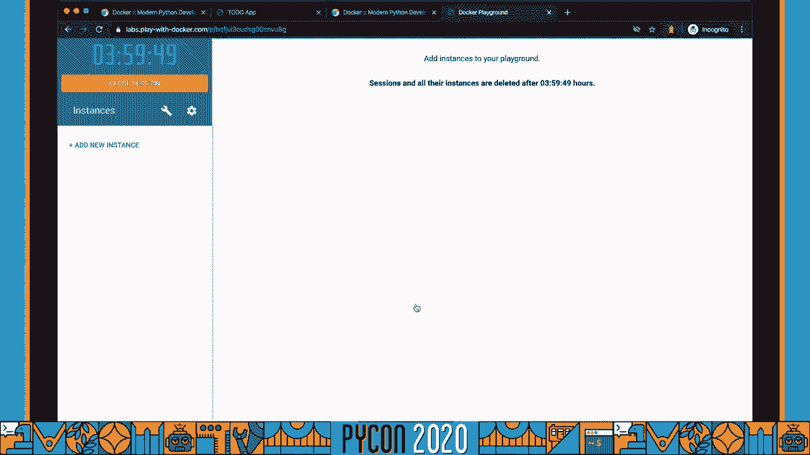

所以我们添加一个新实例。在此期间，让我们检查一下我们的镜像是否已经推送成功。

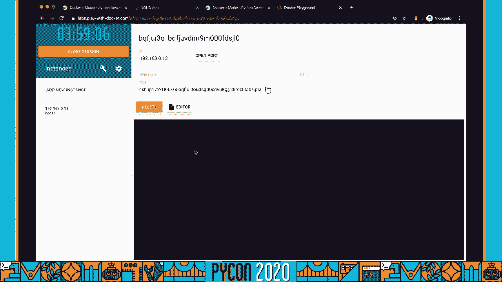

是的。我们的镜像已经推送到 Docker Hub。

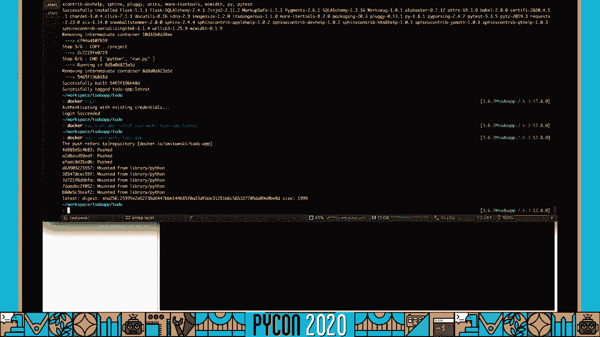

现在我们实际上可以运行与在本地主机上相同的命令。如你所见，它正在下载镜像。现在你会看到我们的应用正在 5000 端口运行。而且我们这里有一个按钮可以点击。

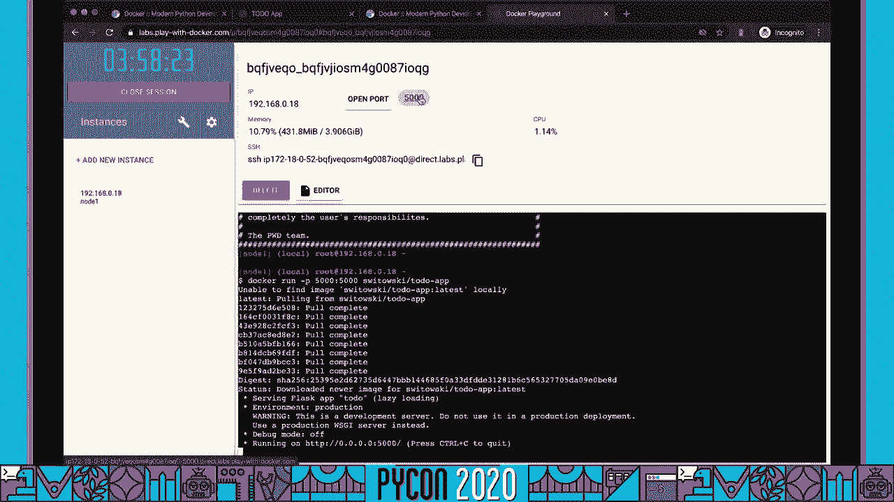

哒哒！这就是你的待办事项应用在某个服务器上运行。你实际上可以把这个链接发送给别人，他们将能够看到你的待办事项列表，至少在接下来的四个小时内，在会话被销毁之前。太好了。这是最后一部分。关于 Docker 还有一些事情需要记住，比如镜像大小。

多阶段构建，为应用程序分配单独的用户，还有 Docker swarm 等内容。我们只是初步接触了 Docker，但我想向你展示实际部署应用所需了解的最基本内容。这就是本教程的结束，恭喜你！我们已经达到了教程的尾声。

希望你能顺利完成所有设置。我向你展示了如何设置 VS Code 以编写 Python。我们学习了如何管理不同版本的 Python 及其依赖关系，以及如何构建一个 Python 项目的结构。我们还讨论了测试和文档。

我们构建了一个小的待办事项应用，并使用 Docker 进行了部署。如果你在过程中迷路，或者有我未回答的问题，可以在 LinkedIn 或 Twitter 上找到我，我的网站上也有联系表单。如果你喜欢这个研讨会并希望了解更多，我有一个为期两天的版本。

第一天详细介绍了 Python 工具和最佳实践，第二天我们讨论了部署内容。希望你喜欢这个教程，明年在 Python 大会上见，或者其他全球的 Python 会议。

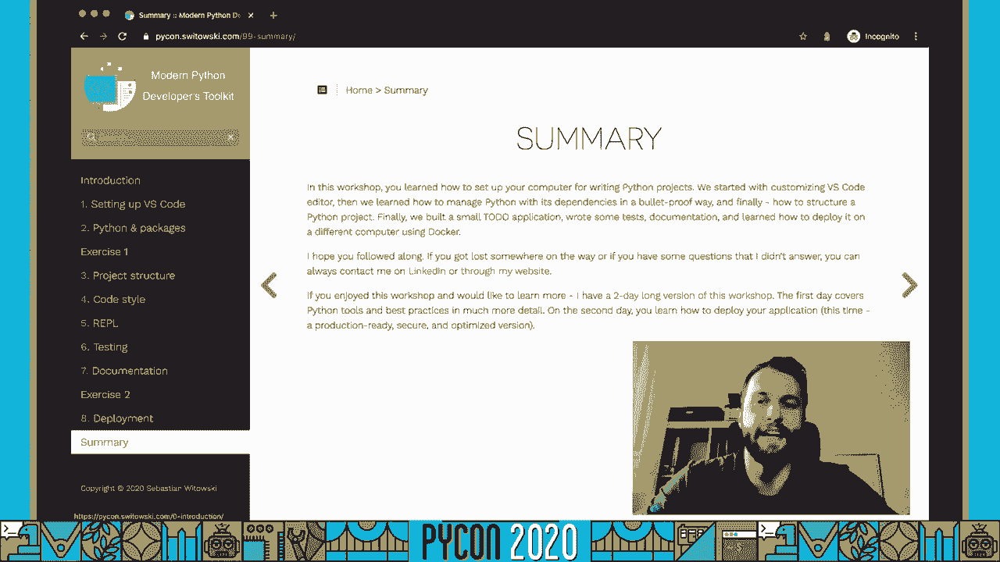

保重。 [BLANK_AUDIO]。

