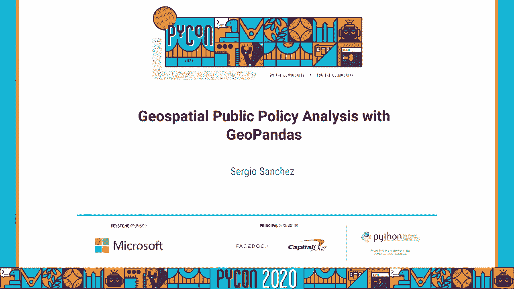
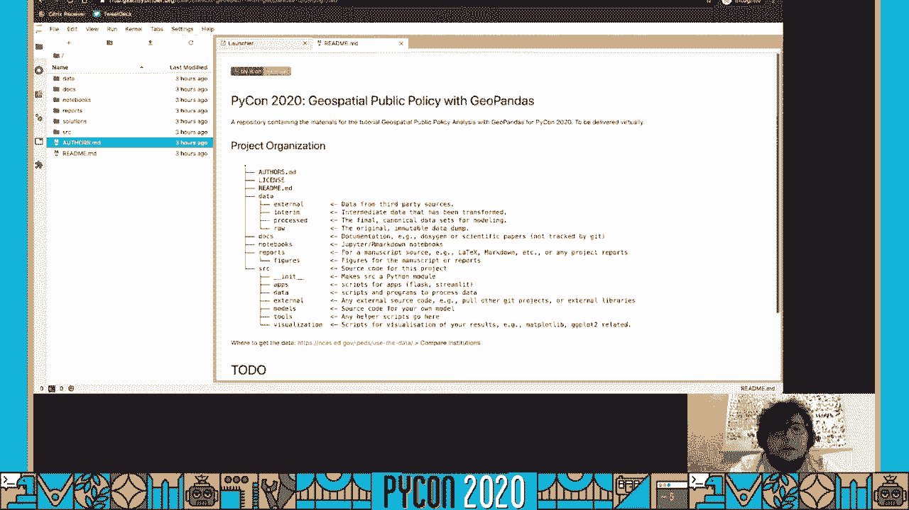
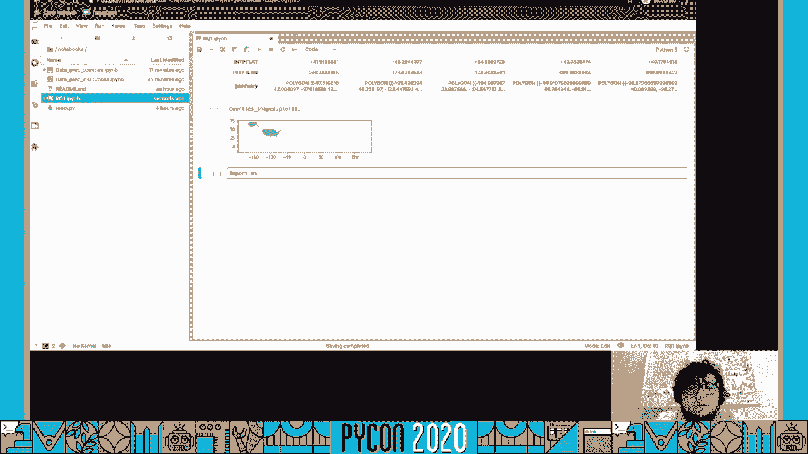
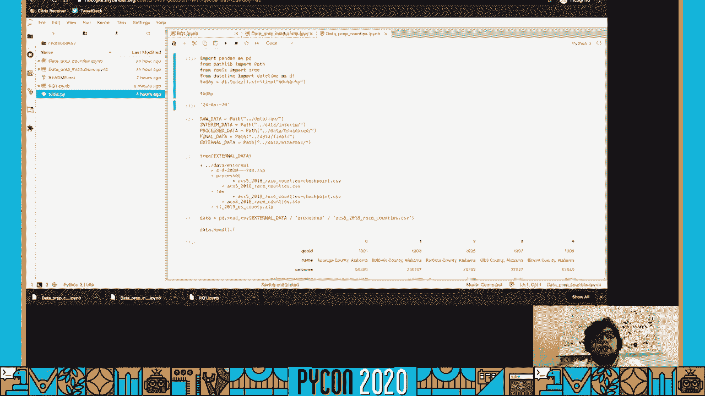
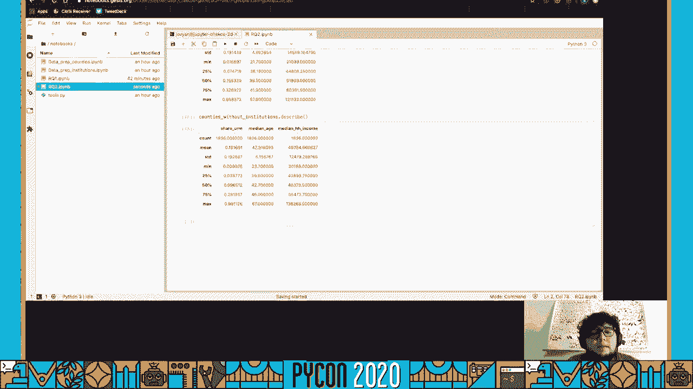

# P88：教程塞尔吉奥·桑切斯 - 使用 GeoPandas 进行地理空间公共政策分析 - 程序员百科书 - BV1rW4y1v7YG

[BLANK_AUDIO]。

大家好，我叫 Eshisant Savala。

这是一个关于使用 GeoPandas 进行地理空间公共政策分析的教程。我将首先进行简短的介绍，然后我们将讨论一些工具和数据来源，这些将在教程中使用。接下来我会展示你如何访问代码，以及如何运行代码。

然后我们将开始进行一些地理空间公共政策分析。好吧，我的名字是 Eshisant Savala，正如我提到的。我是研究助理。我曾在 PPIC 的高等教育中心担任研究助理，当时它首次进行此类讨论。

我做了大量关于加利福尼亚州公共政策的分析，显然是关于高等教育政策。主要集中在社区大学系统中的发展教育，谁能转学，谁不能转学到四年制院校。我还研究了一些移民政策与经济流动性相关的内容。现在我在 Aluma 担任数据可视化分析师。

在医疗和社会服务领域的社会企业。我还有一个个人项目叫 Tacos Ettos，这是一个在线平台，是一个社区，您可以在这里分享您在数据分析和可视化领域的最佳实践和知识。

用西班牙语表达，使我们所拥有的所有知识和技术进步，能被更多人获取，而不仅仅局限于英语世界。这就是目标，对吧？你可以在 github.com/checkos 找到我，C-H-E-K-O-S。正如你在屏幕上看到的。在 Twitter 上，checkos.wh。如果你感兴趣。

你也可以在 github.com/tacos-the-tacos 上关注 Tacos Ettos。那么我该做些什么呢？

他们在关注我在专业生活中所做的主题，以及我所有的工作相关事宜。我的目标是促进知识的转移。我如何将我的想法或同事的想法传递给你？最快、最简单的方式。所以让复杂话题变得更容易理解。

我认为这是一个很棒的事情。而且在研究机构中，这一点显而易见，对吧？我们会查看数字，寻找趋势。我们会向立法机关解释这些趋势，希望他们能够做出明智的决定。这样他们能做出更明智的决定，对吧？

在数据可视化领域，关键在于如何让你更容易理解，对吧？我该如何呈现复杂的信息，使你能够理解？

你会理解这是最快的方法。总的来说，这只是让研究更透明、可简化和可访问，我希望这个教程能帮助你做到这一点。这有很多影响，但我这样做的主要原因之一是。

这样，任何想要这样做的人只要有意愿并且可以访问电脑和 Python，就可以做到。他们不需要其他任何东西，对吧？因此，我们将在本教程中使用某些工具。希望你能将这些实践融入到你的日常工作中。

那么这个教程将涵盖什么内容呢？它基本上是从头到尾的逐步流程。研究人员如何去回答一个涉及一些地理空间分析的研究问题？

我们将看看我如何总体上组织我的项目。从开始到结束的数据清理工作流程，然后做这个、做这个、再做这个。以及如何使用 pandas 和 geo pandas 进行这种类型的分析，这可能是大多数人来这里的原因。你可以用 geo pandas 做些什么？

Panda 听起来很棒。将地理信息加入其中，听起来很酷。我们可以用它做些什么呢？

所以我们将会讨论这些。更具体地说，我们将学习如何使用 geo pandas 操作地理和形状、形状文件。这个教程适合谁呢？初学者将使用我的 binder，因此你甚至不需要安装任何东西。但对 Python 知识有一定的期待。

我不会从头开始教你 Python。我们将使用 Jupyter，使用 pandas 和 geo pandas。如果你有一些经验，那显然会是一个很大的优势。但我们不会触及复杂或更高级的主题。我认为我们甚至不会写任何函数。

这将非常逐步脚本化。首先，你做这个。然后你做这个。所以初学者、刚刚入门的人应该能够跟得上。如果不行，我会很乐意帮助你。你可以在 GitHub 上查看代码库，提交问题，或在 Twitter 上联系我。我们会设置一个方式来回答你有的任何问题。

如果你想在本教程之前多了解一些关于 pandas 的知识，可以查看我去年在 PyCon 上做的另一个教程。2019 年的教程在 GitHub 上，网址是 github.com/checkos/analyzingcensusdata。这是一个关于使用 pandas 分析人口普查数据的教程。这个教程更详细地逐步讲解了 pandas 能做什么，所以会非常有帮助。

YouTube 的链接也在里面。我相信你可以在网上搜索。那么我们将使用什么工具呢？我们将使用 JupyterLab 进行分析。在这里，我们将有所有的 Jupyter 笔记本和工作内容。所有的工作都将在 JupyterLab 中进行。我们将显然使用 geopandas 和 pandas 来处理数据。

这有助于你分析数据，结合 geopandas 以及操控地理的能力，来实施地理分析。我们将使用 geoplot，如果你听说过 seaborn，它使地图可视化默认变得更好看，这就是 geoplot 的作用。它就像地图的 seaborn。我们还将使用命令行界面。

这是 LA 时报数据小组的命令行工具。它叫做普查数据下载器。这将使我们能够自动化。它方便我们将数据导入计算机。这是个好习惯。它是一个非常酷的工具，LA 时报在做一些很酷的事情。

如果你对这些内容感兴趣，应该去查看一下。那么我们将使用哪些数据来源？我们将使用来自国家教育统计中心的 iPads，即综合高等教育数据系统。整合。我认为没有人知道 iPads 代表什么，但在教育领域，研究人员都知道。

空间知道 iPads。我们会在浏览器上查看，稍后会深入了解。我们还将使用来自普查的美国社区调查数据。这是普查每年进行的调查。数据下载工具就是为了这个目的。我们还将使用普查提供的 Tiger 形状文件。

这些是普查为我们提供的“官方”形状文件。接下来。那么我们将回答哪些问题？正如我在开始时提到的，我们将逐步探讨研究人员如何回答一个具有地理空间组件的问题？

那么这些问题是什么？它们本质上有三个问题。两个主要问题加上地图。第一个主要问题，第一个研究问题是，在多数代表性不足群体的县中，有多少高等教育机构？这些群体包括黑人和拉丁裔，土著居民，曾经受到排斥的地方。

在高等教育中历史上代表性不足。那么，在这些多数代表性不足的县中，有多少高等教育机构？对吗？这些机构的特征是什么？

这些问题是否因更富裕的机构或其他县而有所不同？

第二个主要问题是，是否有任何县没有高等教育机构？

这些教育沙漠，教育荒漠。你是否发现自己处于一个没有高等教育机构的县？

如果你想去高等教育机构，你就得离开。或者，也许你甚至不考虑去高等教育机构，因为周围没有，你从未见过等。这显然是假设，但美国这里是否存在教育沙漠？

那些县的人口特征是什么？

如果在那个县没有高等教育机构，那这个县与美国其他县有何不同？我们使用“县”是一个任意的地理层级。我们可以上升到州，但显然每个州都有高等教育机构。我们也可以降到普查区，这是一种非常小的单位。

但是你会失去一些与之相关的人口统计数据，因为在那种细化级别上并不公开可用。然后我们将制作一些地图。那么如果你在高等教育机构周围创建 10、25 或 50 英里的半径，哪些地区会被排除在外？加州的一些研究表明，大多数人……

普通学生一般上大学时，距离家大约 25 英里，如果是加州大学的话，大约是 50 英里。这是大学与学生家庭之间的平均和中位距离。如果是社区大学，通常不超过 10 英里。

这些就是我们将使用的问题，我们将沿着这个过程创建一些地图。那么现在，让我们开始介绍我提到的工具和数据来源。这是 NCES 网站，网址是 nces.ed.gov/ipids。这就是我们将用于数据的地方。如你所见。

这是美国大学和学院的主要信息来源。如果我们在这里，给我一秒钟，抱歉，我们去加入。我们将使用的是，不是加入，抱歉，我错了。使用数据。我们将使用这个工具。这已经为你下载，我稍微清理了一下，因为变量标题，列名很糟糕。但如你所见。

你可以创建小组，并根据是否授予学位、创办行业、是公立还是私立，以及它们所在的特定州来查找机构。

对于每个机构，你可以找到很多信息。你可以找到有多少人去那里，完整注册情况，有多少人全年留在那里，授予什么学位，授予多少学位，毕业率是多少，平均价格，财务援助情况。这有很多信息，如果你对这类信息感兴趣，真的很有趣。

我们还将使用普查数据。我们通过普查数据下载工具使用美国社区调查数据。但是你也可以去 data.census.gov 查找信息。他们为每个人提供表格，信息量很大。如果你对普查数据感兴趣，快去看看，挺酷的。

我们将使用 Jipit 或 Lab，正如我提到的。如果你还没听说过，它是一个基于网络的交互式开发环境，用于 Jipit 和笔记本。代码、数据和丰富的文本可以放在同一个文件中，这很酷。我们将使用 MyBinder 来运行我们的代码，这样你就不必安装任何东西。

所有的内容都会在你的浏览器中。我稍后会给你展示。你将拥有 GitHub 存储库和链接。所有这些都只是让你的浏览器上运行一个 Jupyter 或 Lab 的实例，所有依赖项已经安装好。我们显然会使用 Pandas 进行数据分析。

我们将使用 Geopandas 进行我们研究的地理空间分析。为了让处理地理空间数据变得更简单、更轻松。这正是我们所寻找的。Geopandas 使你能够将 shp 文件和几何图形读入数据框，就像用普通的 CSV 一样。我们将使用 Geoplot 进行地理空间数据可视化的地图。

这是一个高级地理空间规划库。它是 cartopi 和 map.lib 的扩展，使地理空间映射变得像海岸线一样简单。它只是让一切变得稍微容易一些。地图，让它变得稍微容易一些。正如我提到的，我们将使用洛杉矶时报的普查数据下载工具。

这项功能允许你从终端创建并运行普查数据下载器。给我所有州的中位年龄，或者如果你想更改的话，也可以是县的中位年龄。所以，可以是 2010 年、2011 年或 2018 年的中位年龄，州或县或区域等等。你可以用我在这里使用的数据创建一些非常酷的地图。

他们在某些地方使用过这个工具。它是一个非常好的工具。为了使用它，你需要一个普查 API 密钥，这非常简单。你只需点击，访问普查数据下载器的存储库 github.com/datadesk/censusdata.loader，在说明文件中，你将找到这一部分。

你需要点击这个链接。然后你要申请密钥。这个过程，这个过程实际上只需要大约两分钟，非常快速。所以你现在就应该去做这个，我们将字面上使用视频。与此同时，我想提醒你，如果你在美国。

美国的朋友们，请务必填写普查。如果仍然是 2020 年，请务必填写普查。这非常重要。现在正在进行中。你可以访问 census2020.gov 并进行回应。即使你没有收到任何邮件，甚至如果你丢失了邮件上的信件，你也可以在线回答。而且，我无法强调这一点，这真的非常重要。

这对美国的每一件事情都非常重要。所以请，如果你在美国，无论其他情况如何，如果你生活在美国，请访问 2020census.gov 并填写普查问卷，如果你还没有填写的话。这样，我们就开始着手处理代码。

好的。

现在让我们开始这个教程，使用实际的代码。你需要访问 [github/github.com/checkos/chiospecial-public-policy-analysis-gopandas](https://github.com/checkos/chiospecial-public-policy-analysis-gopandas)。我知道这个名字很长，但我尽量做到尽可能详细。你也可以直接访问 [github.com/checkos](https://github.com/checkos)，它就在那里，是第二个固定项目。

这样会快得多。你需要做的是点击这里。我们将使用 MyBinder。我将添加在本地运行的说明。如果这是你想要的。在 MyBinder 文件夹中，有一个环境文件，里面包含所有依赖项。

你可以在本地运行这个。为了简化，我们将使用 MyBinder 来跟随教程。你会点击徽章，它将带你到这个页面。如果你点击显示，它会显示出来。它会向你展示日志。

因为我已经运行过一次，所以他们为这个 GitHub 仓库已经构建了 Docker 镜像，所以不会有问题。但是如果它没有显示找到构建的镜像，这可能意味着我刚刚更改了仓库中的某些内容。因此他们正在创建镜像。这将需要一些时间，所以你只需等待，但它会完成。

它会传送到你那里。从这里开始，你只需等待。对于大型仓库或依赖项较多的仓库，通常不超过一分钟。根据我的经验，这可能需要更长时间。因此你看到的将直接进入 JupyterLab。

如果你更喜欢笔记本环境，可以在 URL 的最后部分更改 LAB，或者你可以删除它以获得经典的 Jupyter 笔记本视图，或者在帮助中点击启动经典笔记本。我不推荐这样，我们不会使用这个。所以这是文件夹的基本结构。我们有一个 authors MD，一个许可证。

根文件 mu，这个文件将会更新以显示安装步骤等。还有一个数据文件夹，其中有四个子文件夹：external、interim、process 和 raw data。这里是每个文件夹的定义。还有一个 docs 文件夹，你可以在这里放置任何文档，包括 PDF 或其他类型的文档，这些文档是在工作流程中使用的。

我们将在 notebooks 文件夹中工作。然后有一个 reports 文件夹，用于存放任何 markdown 或手稿，如果你在写报告。在里面还有一个 figures 文件夹。如果你产生了任何图像，我们将创建一些地图。

代码将直接放在 figures 中。然后有一个源文件夹，用于存放你产生的任何代码，如果你不想放在笔记本中，可以存放任何脚本、任何你从其他地方获得的有用代码或你创建的模型。任何产生你想要的可视化的内容都可以放在这里。

任何你想从笔记本中提取的内容，都可以直接放到源代码中。这样就能将其放在一个有序的空间里。这是基于数据科学的模板，我稍微修改了一下。

这个部分基于 MKRAPP 的可重复科学模板。我只是稍微修改了一下。我没有意见，也没有配置。这是我所有项目中使用的标准化方式，我知道每个笔记本的位置。

我确切知道数据分析的脚本在哪里。我知道创建可视化的脚本会在哪里放。所以标准化你的工作流程在长期内非常有用，尤其是当你有一个 ID，想尝试一些事情，结果忘记了，六个月后又想起来。

如果你想回头查看，我有那个 ID。好了，我们将进入笔记本部分。你可能注意到我们有一个解决方案文件夹，而在项目组织中没有这个。这是为了这个库。在教程中，我将放置解决方案，就是我们今天创建的笔记本。

我将为我们所做的每一步添加更多解释和链接，以便你可以跟着学习更多内容。建议你立即查看这些内容。你可以尝试自己完成这些，然后我们可以检查解决方案。好的。

在开始之前还有最后一件事，因为我的 Binder 实例在云端某处。它会在 15 分钟没有活动后进入休眠状态。因此，你应该每 10 到 15 分钟运行一些东西，确保实例不会关闭。你可能会看到我编码超过 15 分钟，但你应该暂停 15 分钟。

每一步你都应该暂停视频，然后跟着写代码，或者把它放在一边，开始运行你的代码。好的，我们将进入笔记本文件夹，首先我们要创建一个包含步骤的 Markdown 文件。每个研究项目的第一件事是数据清理，获取数据。

清洗数据，准备分析大约占工作量的 90%。这是我作为研究人员日常所做的事情。所以我们来写下这些步骤。第一步，数据准备。我们已经为你获取了一些数据，准备就绪，稍后我会展示给你看。接下来的第一步，我们将准备机构数据。

这两个机构的数据以及来自人口普查的县级数据，我们将保持简单的数据分析，对吧？显然，这是一份“活文档”。我们将回去添加我们在分析之间想要做的其他步骤。研究问题一，研究问题二，研究问题三。让我们称之为这样。

我们只需要称之为“读我”，这样人们就会把它扔回来并准备好使用，对吗？它会显示为默认设置。因为我们将进行数据准备，所以我们应该探索一下已经拥有的数据类型。如果我们进入数据文件夹和外部，你会看到我包含了两个压缩文件。这一个来自 iPads。

这是机构的数据，TL 是老虎线，那个是美国人口普查县形状文件。我会在我已经处理的文件中的数据上。我在 GitHub 存储库的源数据上包含了一个脚本。你必须担心这个数据清理，但本质上。

是通过那个压缩文件进行处理。它会删除一个随 iPads 而来的空列。通常情况下，不知为何，它总是带有一个未命名的列，然后数字会根据你获得的列数和变量的不同而变化。

然后只是稍微清理一下列的名称，因为对于这个教程你不需要担心这个。所以我只是为你包括了这一点。然后地理数据清理其实并不是清理，只是打开那个压缩文件，然后基本上提取出来。

它并不是清理数据。当你打开你的笔记本时，这些已经为你运行过了。但是如果你在本地运行，你将需要自己运行它们。你可以通过在终端中输入 Python 和脚本来做到这一点。在处理文件中，你可以看到机构的处理情况。看起来像是有一些机构名称。

它们的状态是公开的，是否是两年或四年，是否大多数都授予学位，但它们是否大多数是学士学位或不是大多数学士学位。它们的地址。希望你能引导它是我旅行的大学或历史上黑人大学或大学。

关于这一点的一些统计数据，世界的板子和他们的第一个笔记本，然后地理数据只是形状文件，对吗？可以直接读取到地理熊猫中。因此，在笔记本上，让我们创建我们的第一个笔记本。首先，你应该始终将其重命名为你将要称呼的名称。

我将其称为数据准备机构。首先，你将导入 pandas。显然，因为这就是我们将用于分析的工具。我们将使用 pathlib 来处理路径，以便在 Windows 和类 Unix 系统上都能工作。你可能注意到我包含了这个小脚本，它只是有一个函数。

这个名为 tree 的函数显示目录树。我称之为 tools.py。你可能会看到其他人使用 utils.py，我恰好这样做，因为这就是我的学习方式。我并不来自软件开发，而是来自社会设计。这就是我的学习方式。因此，我们将导入这个函数以便使用。

然后我们将导入这个日期时间函数，因为对于没有版本控制经验的人来说，如果你跟着这个步骤，你可能有 GitHub 的经验，并且可能知道 Git 和版本控制。但是很多从学术界和社会科学进入科技领域的人并不具备这些经验。

我们实际上并没有普遍使用版本控制。因此，我们的版本控制方式只是将日期标记在末尾，或者添加下划线。最终的下划线最终下划线。这并不是最佳的方法，但至少这是一个有版本控制的方式。

我们将使用 today 函数以创建日期。今天的字符串是`string F time`。我们将使用 B，作为字母。为什么？为了确保它有效。好的。今天是 2020 年 4 月 24 日。然后，我们可以将其标记在我们生成的任何 CSV 文件末尾。

再次强调，这不是最佳的方法。如果你已经知道版本控制，那你应该这样做。但如果你没有版本控制的经验，至少要在这里加上以区分同一文件的不同版本。好的。

我们将为数据文件夹创建路径。因此，我们有原始数据路径。对吧？这只是为我们节省时间，以便我们不需要每次调用某个文件时都显式输入`.. /data/raw/`等内容。

来自原始数据文件。由于它是路径，path 类在 Windows 和 Linux 系统上都能工作。因此，你无需担心斜杠的方向。我们将为输入数据做一个。我喜欢对所有数据文件夹这样做。即使我们现在不使用所有这些，处理数据以及额外的数据。

对的。没问题。好的。抱歉，我在看我的笔记，以确保我们要使用这个树形函数来查看我们在外部数据上的内容，你可以点击 tab 进行自动完成。我们看到我们有刚才给你展示的压缩文件。如果我们去处理。你可以再看看。你可以看到我们有来自机构的处理数据。

这就是我们在这里想要的，以及我们县的形状文件。这个检查点是在我们打开它和 Jupiter Lab 时刚刚创建的。好了。所以我们将使用 pandas 读取到一个数据框。如果你按下 tab，你可以看到所有选项。有很多选项。我喜欢 pandas。

我们将使用的是 CSV，因为它是 CSV 文件。现在关于路径的这一点很酷。还有 Patrick，我们可以做处理，然后斜杠，然后处理过的数据封闭我。它就是有效的数据。这里我们有一个数据框，我们读取了那个 CSV 文件，所以我们可以实际操作它并玩弄。

在 pandas 中还有另一种方法，我只是给你展示一个快速处理的数据。创建这些路径的另一种方法。你可以做连接路径。处理过的数据，CSV，我只是要运行一下，这样你就能看到会发生什么。它就是有效的。如果你在 Windows 上运行这个，它会显示其他的斜杠。

所以你可以做那个连接路径，或者你可以用斜杠。我喜欢斜杠。就是感觉很酷。好了。现在我们有了数据框，所有的列读起来有点困难。它会跳过它们。这些都是非常长的名称。所以我喜欢做的一件事是转置它。所以数据。那 T，你实际上并没有在转换数据。你所做的只是获取转置。

一个转置视图。对的。所以不再是列，从左到右和行，从上到下，你交换它们。这样我们就可以在这里读取列的名称。而且这读起来稍微容易一点，特别是对于这些非常长的名称，对吧？毕业率。

本科学位，六年，土著夏威夷人或其他太平洋岛屿。这边的那个会是。这就是它，对吧？只是读起来有点困难。所以你会看到我们有单位 ID，机构名称，州，部门。这包括它们是公立还是私立，以及是两年制还是四年制，或更多。

我们之前谈到的机构类别，间隙自由地址。机构名称别名。如果它们被称为其他名称，这个比例就会上升。机构名称，似乎我们有一列重复，pandas 会自动处理这个。我们只是添加一个来区分。态度，纬度。

一些机构的特征，无论是历史上的黑人大学，还是部落学院，录取百分比，女性的录取百分比，男性的录取百分比，注册总人数中美国印第安人或阿拉斯加原住民的比例，他们是西班牙裔，拉丁裔，有很多统计数据。

我们已经为您提供了可以玩弄的数据。我们将选择从这个大数据集中我们想要的特征。并且我们将创建一个分析数据文件，从这个主文件中提取一个子集，以免干扰它。这个文件已经准备好了，可以使用。

它适用于其存在的目的。所以我们想创建一个子集，作为我们特定项目处理的工作文件，对吧？所以我们要创建一个感兴趣变量的列表。我将其称为感兴趣变量（VUI）。我们将从这些列中创建一个列表，表示我们感兴趣的内容，对吧？

所以我们需要机构名称，逻辑以及纬度。我认为我们只需空间您的政策分析。我们想要第五个州代码，也就是州的位置，州的值，以及部门，稍后我们会讨论一下。我们需要总注册人数，和全职、兼职的瞬时列。

对吧？这些数据在这里。这所学院有 150 人，其中 108 人是全职，42 人是兼职。所以这是我在蒙大拿的纳科达学院。我们今天要做的特定分析所需的列就是这些。你可以选择添加，这就是我包含其他所有变量的原因。

如果你想做其他分析，比如，想看看男生在六年内获得学士学位的毕业率是多少？你可以在这里得到，对吧？所以这所学校，64%的男生在六年内获得学士学位，对吧？64。这意味着什么？36%的男生在这所学校六年内没有获得学士学位。

这可能是辍学，或者需要七年，或者需要八年或更长时间。所以我们要运行这个。现在我们有了这个列的列表，我们可以抓取那个子集，进行数据处理。您将通过方括号传递一个列的列表来抓取子集。现在我们得到了这个。我们现在有了这个子集。我们本可以用方括号来处理。

再次使用方括号，机构，主要部门。我们可以直接传递它，但这样更简单。您应该把它移出去，单独做一个列表。我选择了长方式，因为也许我不想再使用这个了，我可以直接去掉，对吧？

或者我可能想要另一个，然后我希望它按照这个特定的顺序排列，所以我可以直接丢弃。这样操作更简单。所以现在我们知道这是我们想要的。我们不想只有前五个，我们要创建这个数据框的副本。我们将称其为工作数据框，所以我们将发送其他内容。

这将是数据框，但我们只会抓取感兴趣的变量。我们要做的是创建一个副本。这样做的原因是，如果我们不这样做。如果我们只是说，好吧，这是一个数据框，这些是数据框的列，然后我们对正在处理的数据框做一些操作。如果我们操纵数据，我们以某种方式改变它。我们将会收到 Panda 的警告，告诉我们你在本质上操纵了一种类型。

一个窗口到另一个数据框。这不是我们想要的，复制整个其他数据框。所以我们在复制它，你可以随时使用 head 来检查一切是否在 Panda 中顺利运行。所以我们在这里的 sector 变量本质上是两个变量。对吧？它表示一个机构是公立还是私立，以及一个机构是两年制还是。

四年前。所以我们想把它分成两列。做到这一点的方法是在 F 首先，这就是你如何从 Panda 抓取一列。你用方括号，就像我们刚才为多个变量所做的那样。如果你传递，如果你不传递一个列表，而是传递一列的名称，sector，它会将其作为 Panda 系列返回。

对吧？然后你可以看到，它看起来与数据框有些不同。所以你想要的是，这些都是字符串。我们知道在 Python 中，你可以使用 split 方法来分割字符串，对吧？在列上进行分割。所以你习惯于。你有这些。所以我们想要的是能够将这个字符串方法应用于这个系列的每个元素。

这里。你在 Panda 中做到这一点的方式是使用字符串访问。所以你得做 SDR。让 Panda 知道你要对一个系列执行字符串方法。我们要做的是分割，在注释和空格上分割，因为我们就在这里处理这个。让我们看看会发生什么。所以现在你有一个列表，对吧？

所以它正在分割两个元素，但它仍然是一个系列。每一行都有一个字符串，而你拥有的是一个列表，这在 Pandas 中并不是我们想要的。你可以传递它并展开。是真的。砰。它创建。现在你可以看到格式变化。它创建了一个有两列的数据框，每个元素对应那个列表中的一个。

我们想要的就像我们在这里用方括号做的那样，我说抓取一个系列。你就这么做。你想抓取一个系列。你传递它的名称零。现在我们得到了这个。那是一个。我们得到另一个。我们想要做的就是懒惰地复制它，粘贴它。我们将把它赋值给一个系列，另一个系列。

我们可以随意命名。我们将其命名为 control。无论是公共还是私有，另一个将是 level。无论是两年还是四年。然后运行这个。好吧。我们要删除它。

所以我们进行工作 F，再次检查一切是否正常。你会看到我们有两个新列：Control 和 Level。这些是基于我们拆分的 Sector 列。好吧。既然我们有了这个，我们其实不需要 Sector 列。删除一列的方法是使用 drop 方法。

删除列 sector。让我们运行它。你会看到它现在被删除了。我们有一个 pandas 数据框，包含 3751 行，9 列。这返回一个 pandas 数据框。因此，如果我们将其保存到同一个位置，它将覆盖自身并删除这个密码数据框。你也可以使用 in place 设置为 true 处理列 sector。

而且，如果它们返回的是数据框，返回的数据框就会自动保存。前一段时间我看了 Mark Garcia 的一次讲座，他建议也许你不应该这样做。内部有一些与 in place 相关的事情。因此，从那以后我就一直这样做，明确覆盖自身。

但它也可以在 in place 中工作。如果你想这样做的话。好的，这几乎就是全部内容。我们从主数据集开始，抓取了我们感兴趣的列，删除了我们不再需要的列，比如 sector。

现在我们有一个分析文件，一个我们将用于其余分析的工作数据框。既然我们有了这个，我们可以在 markdown 中进行操作，你可以看到我没有在这里更改它。我点击了 escape，以便选择单元格，而不是在单元格内部。然后我点击了 M，这将其更改为 markdown 单元格。

我现在要做个检查点。我们要以 CSV 形式进行操作。我们仍然想将其保存为处理数据。让我们用另一种方式做。我们将其命名为 institutions_data.csv。

我们默认情况下不这样做，pandas 会使用 shift + tab 查看选项。你会看到 pandas 默认将 index 设置为 true。所以它会保存一列并命名为 index，它会在这里保存。我们不想要这样。因此，index 设置为 false。让我们看看编码还说了什么，没有。

我喜欢使用 UTF-8 编码，以确保我们不会丢失任何特殊字符。我的姓氏没有重音符号，但它总是会在查看器使用 UTF-8 时丢失，或者如果你使用其他东西就会搞乱。而且这些学院可能有一些特殊字符。所以明确一下是没有坏处的。我们要运行这个吗？因为我们已经完成了第一个笔记本。

现在我们在数据中，你会看到它是上个月或几秒前，因为我们刚刚保存并处理了它。现在我们有机构的数据。这就是我们在其他笔记本中要使用的内容。我们有机构流量数据。现在我们有来自人口普查的县级数据。那么我们将如何做到这一点呢？使用人口普查数据下载。

我们没有，我没有在这里包含数据。它不是外部的。它不是临时的。它不是任何其他地方的处理数据。我们需要做的是使用已经安装的种族数据下载工具，从人口普查获取数据。

我们可以去 GitHub 数据桌人口普查数据下载器查看如何操作。那么有什么可用的呢？很多这些表格。我们已经安装了它，如果你运行安装说明并且在本地运行。这在我们的依赖文件和环境文件中，所以你应该有它。它的工作方式是你首先需要导出，虽然你不必这样做，但这只是。

这将使事情变得更容易。你的人口普查 API 密钥。正如我在视频中提到的，这个 API 密钥你可以从人口普查获得。你需要注册。给他们你的电子邮件。他们会立刻发送给你一个。之后我们可以开始使用人口普查数据下载器，传递你想使用的年份，你所要求的内容，以及其他州的数据级别，我们想要的是县级数据。

我们要关注的是人口统计。种族是必要的。所以我们将在这里使用种族。我们这样做的方式是过来这里。下一步。导出人口普查 API 密钥并传递你的 API 密钥。我已经收到了我的。我们会收到一封这样的电子邮件。谢谢你的关注。这是你的 API 密钥。

我们要抓取那个命令 C。我将复制它。我们在这里。我将进行导出。人口普查 API 密钥等于返回。所以现在它就在这里。我们要做的是这样做。你看到我如何启动这个，你可以点击这里的加号按钮。

这就是你如何启动另一个笔记本、控制台、Python 控制台，创建一些其他文件。你可以从解释器实验室启动终端。它的工作方式是人口普查数据下载器年份等于 2018，这是最新的数据。第三。这将是因为我们处于顶级目录，它将在数据外部。

我们想要的是关于种族、民族和人口统计的种族表格。我们希望在县级别获取这些数据。而且一个州在火车上。县是我们要处理的内容。我们将点击输入。哦，它没有计数。哦，是的，县。点击输入。这将花一点时间。好了。

所以这是为每个县下载所有这些变量，对吧？

宇宙是指该县中所有人的宇宙注释，无论是否有注释宇宙的误差范围和误差范围注释。将会有人识别为白人、黑人、美国印第安人、阿拉斯加土著、亚洲人、夏威夷土著和太平洋岛民。类似于更多的拉丁裔或西班牙裔。已完成。

好的，我们可以去检查数据。这是一个外部文件，你会看到它在一个原始文件夹中创建了一个处理文件。原始文件夹里有表格中的名称。这是来自表 B030002 的。这些家庭名称对任何人来说都没有意义，这是人口普查的结果。但是如果你去处理过的数据。

他们让我们更容易工作，对吗？他们创建了白人、黑人独立的分类，但印度人、美国印第安人和阿拉斯加土著独立的数字。所以就这样。现在我们使用这个命令行工具直接从人口普查中获取数据。现在我们需要做的是处理这些数据。准备它。因此我们将创建一个笔记本。

我们称之为数据准备。计算这个。我们要做的是将 pandas 作为 P.D。并使用 form pathway。如果你注意到了，我实际上在做的和之前的完全一样。所以你可以在 Jupiter lab 中进行的一个技巧。

这就是我喜欢 Jupiter lab 而不是经典的 Jupiter notebook 的原因。首先，你可以抓住这个，把它放在一边，然后你有另一边，对吧？

你可以抓住这个，按住 Shift，突出显示这些单元格。你可以点击复制，也可以直接按 C 键复制。你可以到这里去。可以粘贴。我把第一个提取出来，然后我可以用 X 剪切到第一个。所以现在我们有了从另一个地方抓取的这些单元格。

所以我不必写这个第一个单元格。好的。我可以运行它。嗯，我已经有了这些。运行它。但现在我们正在查看外部数据，对吧？你看到它有处理和原始文件夹，并且在这些文件夹中。它有刚刚创建的 CSV 文件。我们有检查点，因为我们在 Jupiter lab 中打开了它们。所以首先，我们创建一个数据框，PD，读取 CSV，external。

我将再次使用斜杠。这个，呃，更喜欢这样。我们将进入另一个文件夹进行处理。因此我们要再做一个斜杠。我们将做 ACS 五个下划线 2018，抬起县的 CSV 数据。像之前一样，我只是转置你的雷达，让你能看到它。呃。

以更易读的方式。我们得到了 G O I D。得到了名称。我们为每一个都有宇宙。注释、宇宙、许多错误。还有这些列。就像在机构中一样，我们有一个主文件。这是我们刚刚得到的。这适用于现有的内容。

但这并不是我们这个项目想要的。所以我们要从这个创建一个子集。这个将是我们的工作文件和分析文件。做做做做做。好的。所以就像我们之前做的那样，我们要创建一个感兴趣变量列表。

但你可能已经看到了。我们感兴趣的是这些带下划线的单独列，对吧？

我们想要宇宙，我们想要独自，独自。所以我们要做的是，不是输入所有那些。我们可以使用列表推导式。这对初学者来说可能有点，稍微复杂，但这些真的很酷。我认为回顾一下会有用。从某种意义上说，这很简单。而且是个好练习。所以我们要这样做。

所以我们要创建，我们要逐列抓取数据列。实际上，现在，如果你点击外面的一个单元格，然后按键 B，它会在你当前单元格下面创建一个单元格。所以如果我们这样做列与列和数据列。它返回所有内容。对吧？因为我们在说，这是一个列表推导式，表示，好吧。

抓取一个列，或者这可以是，任何东西，对吧？对于这个其他东西中的每个元素。所以为数据列中的每列抓取列。我们想做的是，好吧。我们有所有这些。这不是我们想要的。我们想要的是那些不显示 M.O.E.的，因为我们想要误差范围。还有那些不显示注释的，因为我们不需要那个。

你可能注意到了，起初我们认为，好的，我们可以仅用下划线。而且可以去掉那个说注释的和那个说 M.O.E.的。但大学有下划线，名字没有，而上帝也没有。所以过滤掉我们不想要的列的更好方法是，不包含它们。

在这个列表推导式中。我们不去抓取那些仅显示下划线的。让我们去掉那些我们不想要的。所以让我们做一个 if 语句。如果 M.O.E.不在列中。所以我们去掉所有没有的，如果在列字符串中有 M.O.E.，我想要它。去掉它。所以这是你要做的第一个过滤。

我们也不想要注释，对吧？所以注释不在列中。看，碰。这正是我们想要的，对吧？我们有上帝，我们有名字，宇宙，所有的白人，黑人，美国人，印度人，所有的，本土的，亚洲人，土著夏威夷人，太平洋岛民，其他拉丁裔。所有那些，都是独自的。所以我们有这些，我们只是有州和县，亚洲区。

所有他们的家。所以这是列表推导式，我们要做的是，命令 C。复制并粘贴到这里。这是我们感兴趣的变量列表。就像我们之前做的那样。现在我们要创建一个工作数据框，工作数据。你可以称之为工作，随你喜欢，我称它为工作数据或工作。

对于 F，它取决于。而且绝对没有什么是完整或随机的。它们应该更标准化。那份副本，因为我们之前提到过。我们希望那份数据框的副本，而不是像一个窗口那样。运行一下。让我们确保它能正常工作。成功了。这就是我们得到了的。这就是我们想要的。

好的。既然我们已经创建了这个子集，你可以保存它。这正是我们想要的。我将点击跳过键。我将点击 M 键。所以现在它是一个 markdown 文件。我是说，一个 markdown 单元格。那，让我只用`#`，不是井号。这是一个好点子。我们要保存它。工作数据导出为 CSV。这将是一个处理过的斜杠计数 T 的文件。

这是 CSV。再次强调，我们不需要索引。假。编码。这有点冗余。我敢肯定这些会找到编码。你可以在我们的处理数据中检查。现在我们有县的 CSV 和机构数据的 CSV。好的。所以现在我们有这些。我们可以开始回答我们的研究问题。太好了。让我们去书里。让我创建。

让我们称这个研究问题为第一，乐趣从这里开始。我们将使用这个。我将向你展示如何做到这一点。我将称之并创建一个 markdown 文件。研究问题一。有多少高等教育机构位于城市、县和主要的，代表性群体？然后我们有一个子子研究问题。

这些机构的统计数据是什么？对吗？它们有变化吗？它们是一样的吗？

怎么回事？让我们运行这个。好的。所以首先我们将在端口做同样的事情。我们将导入 GOPANDUS 作为 PD。我将从头开始，而不是从其他地方复制，因为我们要导入一些新的。我们将导入 GOPANDUS 作为 GPD。我们将导入 GOPOT 作为 GPT。这会让人困惑，所以确保你输入正确。

我通常将 GPD 写作 GDP，因为社会科学导入 GOPOT 就是 CRS。S，G，CRS。这是 CRS 和 GIS，即坐标参考系统。

这与投影有关。这告诉我们以及人们如何在二维平面上显示坐标和形状文件。所以你已经见过某些类型的投影。阿拉斯加。我是说，格林兰看起来很大。而如果你在地球仪上看到，它并没有那么大。这些是不同类型的投影。我不会深入探讨这个。

但这就是它的本质。我们导入它是因为 GOPLOT 提供了一种简单的方法来更改投影，而你无需做所有数学计算。我们将导入 MATPLOT LIBPIPLOT 为 POT，因为我们将处理图形、地图标题等。我们还将导入 pathlib 和 port path，以及 date time。将 date time 导入为 DT。我建议使用 DT，因为从中导入 date time 时会让人感到困惑。

date time。你可以在任何地方使用它。DT，我们使用今天。这是时间的误差。我们正在处理日期。我们正在标记时间名称的字母，两个字母。只处理年份的前两位。我们正在运行今天，以确保我们得到它。耶。如果你在本地运行这个，当然，如果你创建了环境，它应该可以工作。

如果你在 binder 上运行这个，它显然是有效的。如果在本地无法运行，出于某种原因，我会跳到我的 binder。如果你试图在本地运行，然后遇到问题，我会直接去我的 binder，然后运行前两个数据准备。县数据在数据准备解决方案中——我的意思是，数据准备机构在解决方案中。

文件夹，以便你能够迅速上手。处理地理数据和安装 geo-plod。geo-pandas，有很多依赖项，有时在本地不太兼容。它们已经变得好多了。向 Condaforge 的人们致敬，他们让这一切变得非常出色。从我记得的情况来看，处理这些要容易得多。

我听说有人开始等我。好的，所以我打开了这个文件，因为我想懒惰一下，只复制这些路径，这样我就不必手动输入。我将剪切这个。这是我的工作。我们将在处理后的数据上做三次，因为我们刚刚保存了一切。好的。

正如我们提到的，你需要检查一下，我们可以忽略那些。地理数据在这里。这些是形状文件。我们在 Dataprep County 笔记本中刚创建的县 CSV。我们有来自数据准备机构笔记本的机构数据 CSV。我们想要的是获取形状文件、机构数据文件，然后是县级。

数据文件读取将所有数据导入数据框或地理数据框，并对所有这些进行操作。因此，县、机构、形状文件、县和机构都是 CSV 文件。因此，该站点工作于县。我们将其称为 counties data，因为我们也有委员会的形状文件。县数据，PD 读取，CSV，处理后的数据。我使用制表符自动完成，以确保没有拼写错误，这通常会发生。

处理数据时，我们将使用 counties.csv。我们将处理机构数据和县的形状。这个不会是 PD，因为它不是 pandas，而是 GPD。而且它不是读取，它是读取文件。你可以进行读取，然后按 tab 键查看选项。你可以读取 CSV 文件或 post GIS。但是我为这个用的是读取文件。

在 geo 数据文件夹中正在处理的数据是 geo 数据。这是它所在的文件夹，TL 2019 美国县的形状文件正是我们想要的。geo pandas 足够聪明，知道当你指向那个 .SHP 文件时，它是在一个包含 DBF、CPG、PRJ 的文件夹中。

所以你只需指向那个点，它会读取所有内容。我们将运行这个。耶。让我们来看县数据。这是一个转置。这就是我们刚刚做的。机构数据。同样。这就是它。现在来看县的形状。哦，我的天。我不想改变这个。其实无所谓。我本可以直接用县的形状，但为了保持一致性，我还是用县的形状。

我们将进行 T 转置操作。你会看到我们有状态 FIBs 代码县 FIBs 代码。哦，GAD 名称。让我为每个县刷新土地面积和水域面积。这就是几何学，这就是 geo pandas 带入 pandas 生态系统的内容。它增加了处理多边形的几何系列能力。

行流点，它就知道该怎么处理。所以如果我们做，比如说，机构数据的绘图。它只是 pandas 知道你想绘制某个东西。它不知道是什么。所以它只会添加所有变量。但如果我们做县的形状绘图。这是 geo pandas，大部分你的图形数据。这可能会花一些时间，因为数据量大。哦。

它知道你试图构建这些来映射和展示你的多边形，对吧？

所以我们想要的，你会看到我们有阿拉斯加的方式。是的，一切都对吧？

为了简单起见，我们只关注下 48 个州。对所有在外的人表示歉意，这只是为了让这次研讨会的数学更简洁。但你不必这样做。这就是我将要做的。同时也为了展示这个非常酷的包，叫做 us 或者 usa，你可以在上面找到。

API。

相当酷！这是一个帮助你处理美国各州元数据的包。它包含所有州的领土、邮政缩写、FIMP 代码、首府、州际使用、州籍、时区。真的很棒。我们不会深入探讨这个内容。每当我们处理人口普查数据时，它都非常有用。

美国的地理数据。这真的很有用。所以我们想要的是美国州的连续状态。这返回所有连续的美国州。我们想要的是，我们将创建这个东西。让我们抓取第一个，这样你可以看看它是什么。所以我们有州阿拉巴马，但这不是字符串。这是一个州类。

所以你可以访问它，实际上是州 fib。州名。对。州的缩写。对。好的。所以我们想要的是州的 fib 代码和连续的美国。我们想要的。我们将抓取每个州和连续的美国的 fib。就像我们之前做的那样，我们可以通过从这个理解开始来做到这一点。

我们将要获取州的连续状态。它返回所有州，就像我们之前做的那样。但我们想要的是这些州的 fib，没错吧？现在是这样。好的。连续的 fib。而我们想要的是很棒的。所谓的对我们的掩码。Fips。

这就是我们要用来过滤不在其中的形状。所以它不在。所以抓取州 B 是否在连续 fib 中。所以这在说。抓取县形状数据框的州 F P 列，并检查每个元素。如果每个元素在列表中，连续 fib，这将返回真或假。

对于每个元素，没错？确实，所以我们可以用这个过滤掉所有的假值。所以当你传递 pandas，一个附带索引的真值和假值列表时，它会告诉你是否想在你的数据中看到它。你想要过滤掉不匹配这些条件的任何行。

你创建掩码。所以我们要做的是覆盖这些县形状。所以现在只有连续的县。我们还想对机构数据做同样的事情。机构数据没有使用 fib 代码，它这里有 fib 代码，但使用的是州名称。所以我们想创建的，我们可以做美国有这个映射。它有返回的能力。

所以我们想要名称到 fib，并创建一个字典，我们可以用它来映射和附录，并将州名称转换为州 fib 代码。所以我们可以这样做，然后重用连续 fib。实际上，让我们尝试一下，因为这是一个很好的练习。让我们看看。我们将使用这个。

我们将其命名为名称到 fib 映射。这样做的方法是机构数据。我们抓取一个系列，这是 fib 州代码，并使用映射新的值集。我们将其作为字典传递到 fib 映射中。那么？

它将所有那些名称转换为对应的 fib 代码。我们可以重写相同的系列。称其为即时到达数据。让我们回去获取 fib 州代码。它是机构的。现在如果你查看机构数据，fib 代码，我们将其更改为此。所以我们无法使用掩码连续 fib 机构，因为它们具有不同的索引。

在 pandas 中，这也是重要的。你不能使用相同的掩码，因为这个掩码。这个掩码不是一个值的列表。它是这个真假值，但是它是一个 pandas 系列。因此它与一个索引关联，索引是支持的。所以我们将创建一个新的掩码连续的 fibs。

连续的 fibs 机构等于机构，数据。然后我们可以写相同的文本。然后我们可以写相同的文本和相同的信息。然后我们可以写相同的信息。然后我们可以写相同的信息。然后我们可以写相同的信息。然后我们可以写相同的信息。然后我们可以写相同的信息。

然后我们可以写相同的信息。然后我们可以写相同的信息。然后我们可以写相同的信息。然后我们可以写相同的信息。然后我们可以写相同的信息。然后我们可以写相同的信息。然后我们可以写相同的信息。然后我们可以写相同的信息。

然后我们可以写相同的信息。然后我们可以写相同的信息。所以我们有我们的工作数据。我们有形状、县和机构。但问题是，县里有多少所高等教育机构是代表性不足的群体的多数？

所以我们需要找出什么是代表性不足群体的多数。找到这一点的一种方法是使用这个县的数据。这就是我们要找出哪些县是代表性不足的多数的方式。所以做到这一点的方法是我们将写，我们将创建一个新的列，县。

数据分享代表性不足。这将等于我的本地学徒。它将包含许多其他列。这些数据，黑人单独加上县的数据。拉丁裔单独加上县的数据，美国印第安人和阿拉斯加土著，县的数据。夏威夷土著。实际上，我们可以稍微细分一下。

只是为了确保如果我们在学徒中运行这个，它会正常工作。所以你必须担心潜在的问题。好的。所以我们有黑人、拉丁裔、美国人、印第安人和夏威夷土著。我的意思是你可以包含两个或更多种族或其他。但这些是高等教育中历史上代表性不足的主要群体。

所以我们将把所有这些加起来，并将其除以县的数据，即一个总体。这是该县所有人的数据。看看这是否有效。我有县的数据。让我们看看。让我们这样做，先关闭它。所以我们已经创建了一个代表性不足的分享。这是零到一。这是代表性不足背景的人，或这四个种族民族背景的百分比。

在那个县。因此，为什么我们在阿拉巴马州计算，高等教育系统中 52%的人群被低估。历史上，在高等教育系统中不足一个百分点。阿拉巴马州鲍德温县，15%。而县，11%。所以即使在这里，你已经开始看到一些变化，这在研究背景中总是很有趣。因此，现在我们有了一个列，我们将用它来看看或回答我们的问题。

我们将像之前处理其他工作文件时那样使用它。我们将创建一个每个数据框的更小的子集，因为现在我们拥有这些，我们只想让 GID 与名称匹配。也许是佛蒙特大学，但主要是共享的低估。那就是我们所追求的。

所以我们将创建子集县数据，它将是县数据。我们将放置我们感兴趣的变量，GID，一个名称。我们想要共享的低估。这是我们想要的一件事。我们也想复制它们。我们将对我们的水形状做同样的事情，因此我们不想要所有的内容。

关注。例如，每个县的陆地面积和水域面积，对吧？

我们拥有这些可能很有趣。这可能是另一个问题。是否有更少的机构？是否有更少的高等教育机构以及没有水的县？

我们将处理一些有形状的县。我们将放置一个感兴趣变量的子集。GID，我们还想要名称和几何图形。这是你可能一开始没有注意到的事情，但如果你之前处理过人口普查数据，如果你知道 FIBs 代码和 GID 代码，你就会知道，它是五位数字。阿拉巴马州是两位数字。

县的数字应该是零、一和三位。因此总共应该是五位数字。这里的问题是子集、县、数据、数据类型，这就是你检查这些的原因。我们的 GID 被编码为整数。所以第一个零不重要。如果你正在处理实际数字，因为它们是代码。

所以我们需要先把这个转换为字符串，然后在左侧添加零。我们这样做的方法是使用 Z-fill 属性，即在这个字符串上的 Z-fill 方法。那么子集。那你如何抓取一个系列？我从地理数据框调用它们，从数据框。方括号。我们将抓取 GID。这就是我们所拥有的。

你也可以在这里看到文本是 int 64。所以我们想要的是首先转换为字符串。我们将把字符串转换为生成的类型。我们运行它。现在它是对象类型。这是 pandas 对任何非整数、浮点数或布尔值的称呼。我想在 pandas 1.0 中你有一个字符串检测，但这不是我们想要的。因此作为类型。

我的意思是这无关紧要，但不重要。我们对一个系列应用字符串方法的方式，就像我们之前做的，是通过字符串访问器。我们将做 SDR，然后我们实际上可以调用字符串方法。Z-fill，我们要填充到五个，因为我们希望它填充到五个。

现在你有这个零在之前，这很重要，因为在我们的县形状中。实际上，你在这里看不到，但你可以看到县形状。我们做采样。它会抓取五个随机样本。它会至少抓取一个，但你可以指定五个。它会抓取五个随机行，而不是你提前做的前五个。

一切完美。所以这里，格拉姆县是 08049。这里的 GID 确实在开头有那个零。为了将数据连接到形状，我们需要它们匹配。这就是我们需要做所有这些的原因。我们需要在这里添加那些零。现在我们知道这有效，我们将覆盖那个系列。

所以我们要做的是设置计数 t 的数据，GID 等于 BAM。好的，现在的做法是，因为我们要将它们连接起来，所以我们要做子集，县数据，设置索引计数 t。我们希望 GID 作为索引，对吧？为了确保这些是唯一的，并确保我们连接它们时，数据框知道这就是我们想要的。

子集县的数据，设置 G 为索引。我们可以像区域一样做。子集县的数据等于这个。这返回相同的数据框。所以我们只是要覆盖它。我们将对子集县的形状做同样的事情。子集县的形状，设置索引，geo-pand D。BAM。让我们连接它们。

现在我们想要的是，我们有统计数据，有人口统计信息，我们想要数据框，县的数据框。我们还有形状在另一个数据框中。我们想要的是能够匹配这些。因此，我们知道这个形状有这些特征。这个县在这里有 X 数量的 X 份额的代表性不足的人。这是相同的。

所以当我们创建地图时，我们可以说，好的，这是形状，根据这一列着色。在它们的共享中，代表性不足的属性。所以我们要通过说子集，县。形状，连接，来连接它们，看看这是否有效。完美。这是在索引上自动匹配。

这就是为什么我们确保将索引设置为 geoid，而不是零一。这毫无意义。值没有添加任何信息。好的，所以现在每一个都有来自地理数据框的名称和来自县数据的名称。我们从普查中获得了这些，都是来自普查，但这是来自普查数据下载器。

而且你可以看到，我包括了名字，我们本来不需要包括名字，但我加上了名字，以便我们检查一下，确保我们没有立刻做错什么。所以我们看到 Gilmer，我们有乔治亚州的 Gilmer County，所以这是我们，乔治亚州的县。所以这是我们数据的一个快速现实检查。

我们将把这个叫做工作 GDF，作为工作地理数据框，对吧？

你不需要复制，因为这是一个全新的数据框。好的。现在我们有了这个，让我们看看，我们来做吧。我添加分号是因为看，如果你不加分号，你就会得到这个。就有点丑。这是保持事情稍微整洁的一种方式。

所以这是地理数据框的默认插图。我想我们可以做列等于分享代表性不足的人对吧？

我们可以开始看看这个国家在代表性不足的人群方面的情况。在美国的高等教育系统中，历史上代表性不足的人群似乎在德克萨斯州南部的边界附近。这些地区看起来合理，因为这就是一种普遍的情况。

人口分布看起来会是这样的。这些不是美国人更多的地方。但这就是我们包含它的原因。Geoplot，Geoplot 默认让事情更美观。所以我们要做的是创建一个 GPT，GOPlot 并进行一个所谓的核心玩法。我们将传递 C shift tab。DF 将会工作。GDF。

投影将是 GCRS，真正的地理学家会讨厌我。我去年参加了 NACES，北美信息会议，北美制图信息学会，去年他们的会议上展示了如何用 Python 制作地图。在我演讲之前，我参加了海报会议。

还有一个小区域，你可以在上面留下便条让其他人看到。这些提示、技巧，无论你想分享什么。这些都是匿名的。有人写道：“不要使用网络墨卡托或停止使用网络墨卡托。”我当时有一个演讲，要在当天稍晚进行。

我使用的所有例子都是网络墨卡托。它就是好用。尤其是在看一个国家时，尤其是美国，这很好。所以没问题。这个稍微花点时间。但你会看到区别。所以这是 Mapla Live 的默认设置。已经很棒了，对吧？你仍然可以看到信息。

如果你不知道 Mapla Live，你可能需要，或许，谷歌一下，“哦，我该如何去掉坐标轴？” 

“我该如何添加标题？”等等。但是有了 GPLT Core Play，它就是这样工作的，挺不错的。好的，这就可以了。所有这些都在进行中。让我们开始处理我们的机构。所以我们有一个包含我们机构数据的数据框，就在这里，它有经度和。

很多——这仍然是一个表格数据。这仍然来自 CSV。但是经度和纬度是地理的特征，是一个点。有 X 和 Y。我们想要的是将其从常规的 Pandas 数据框转换为地理数据框，并创建几何列。区别在于，它不是多边形。

我们想要的是我们的点。这些点将来自经纬度。所以让我们看看如何做到这一点。我们将使用 GPD，地理数据框。我们将传递机构数据。我们将在树上做 GPD。我们将调用函数点来自 X，X，Y。这就是它要做的。

我们将传递系列机构数据的经度和机构数据的纬度。只需检查一下。这就是它。哦，看。GPLT，geo blood。它工作了。再次。它看起来差不多，但稍微好一点。默认图形大小大一点。没有坐标轴。但颜色是一样的。

线是一样的。因此，我更喜欢使用 GPLT，因为当事情稍微好看一点时，从顶部看起来会更轻松，我不需要放大，也不需要忽视坐标轴。它就进来了。这很不错。让我们尝试一下。我们正在从机构数据创建一个地理数据框，并且我们在说创建。

从这些经纬度点创建几何列。让我们来运行这个。好。还有。我检查了作为第三个。这是点。现在我们有了这个几何列，你可以看到这是一个点几何。因此，让我们来处理一下。我们将其保存为 geo institutions。记得我提到过有 CRS，坐标系统。让我们看看。

你会注意到 GDF，CRS，这个坐标系统已经设置好了。它来自数据。这是多个来自形状文件的文件之一。这些信息来自那里，并且告诉你如何显示这些信息。这些地理信息。如果我们为我们的 geo institutions 这样做。

它没有任何内容，因为我们刚刚创建了经纬度，但我们没有指定边界。我们没有指定是否使用度数或米等。但我们知道它使用度数，因为我们在这里可以看到。这些不是从任何点的本地米。

所以我们可以直接从另一个复制。现在它就可以工作了。这将为你节省一些警告，过程也更简单，你完全可以这样做。从现在开始，你可以做一个 GPLT，使用 geo institutions 的点图。好吧。因此，我们可以看到这些都是全国的机构。显然。

这些是一些房屋和托盘，很多或更多。也许将这个与这里的这个结合起来的方式。所以我们可以看到，我们的机构正在与大多数被代表性不足的群体找到结果。还有这些机构的特征是什么。所以我们可以先视觉上将它放在上面，然后说，哦，这里是大多数。

我假设这可能是美国人口最多的地区，以及这里的小中心。所以我预计这些机构大多就在这里。但你可以看到，这里也有一个日志线，对吧？

但我们不想在两张地图之间来回。所以我们要做的是创建一个 XC。我们将做一个 GPLT 核心图。我们将复制这一张。我们将这样做。只是。让我们拿最后一个。所以我们要做的是修复大小等于自然平衡。我们将把它保存到一个轴上。所以我们想要的是创建。

首先给我做一张地图，然后把另一张放在上面。我们不想让两张地图重叠在一起。我们要用这个做 X。然后在点图上，我们要指定要添加相同的轴。在同一张图上。我们要做的是 GPT，就像我现在所做的那样。

除了机构，我们要指定它在同一张图上。我们要做 Z 和 Z 顺序，所以指定我们希望它在所有其他内容之上。我们不想只覆盖所有内容，所以我们要让圆圈稍微透明一点。我们将设置为 0.3。我们会用红色，让它更容易阅读，因为这。

是蓝色和蓝色。我们将大小设为 2。所有这些都来自我之前与地图文件的合作和不断的 Google 搜索。因为我们做 Shift + Tab。你会得到一些可以传递的参数。但颜色、大小、alpha 和 Z 顺序来自这些关键字参数。

它们在后台传递地图逻辑，所以你不必这样做。它们不会立即显示，你必须先 Google 一下，和地图逻辑一起工作。两个空值。我们来看看这个。看看这个工作得多快，因为我们注意到。我不知道有什么有趣的。

我们注意到这些花了一点时间。这有点慢，看看需要多长时间。在此期间，哦。哦，你在这儿。我错了，颜色。它看起来怎么样？三个。我说红色吗？是红色。我们进行品牌。这更快了。你注意到什么？好了。这并没有直接回答问题。我们仍然不知道这个县是什么。

或者这个县。我们开始看到一些东西。我们开始看到，尽管这个地区的人口分布在美国，但代表性群体主要集中在美国南部和顶部的中心地区。而高等教育机构的分布与这个区域的分布相等。

美国。所以这些地区大多数是白人和亚洲人口，大部分是白人。这里有很多高等教育机构。因此我们开始看到一些答案。我们开始认为可以以此为灵感，开始思考这些机构所处地点的公平性影响。

不是说我们能立即解决所有问题。你不能在六个月内就创建一所大学。就像，我们只是把那些大学放到南方。但是从视觉上看，你开始看到一些东西。好吧，现在让我们做我们想要知道的事情，就像之前过滤掉那些县一样。——我们并不打算这样。它们继续作为美国的部分。我们可以做同样的事情。

但我们现在的过滤条件是 50%的阈值。这个县是否有 50%或更多的其他代表性群体？它的总人口。因此我们将为 pandas 创建一个掩码，掩码。我们将创建一个掩码。我们将创建一个掩码。我们将创建一个掩码。

我们将创建一个掩码。我们可以——所以这就是掩码。我们可以快速绘制工作 GDF。你通过转换传递这个掩码。哦，我的天，它们被表示出来了。所以这些是——这已经包含了 bat 掩码。你会看到只有 294 个县的主要工作百分比是它们的人口。

所以我们可以进行绘图。这就是结果。对吧？这很合理。你会看到这里更亮的颜色。还有 pandas 的工作方式以及 Python 的总体运作。如果你——作为速度线，那是负面的，对吧？

这变成了真和假，并且落入了真。你应该得到相反的结果。所以现在你在说你是否在否定这个。因此检查县是否存在，那 100%——如果该县的人口中超过 50%的人口比例并不成立。这意味着我们可以这样做。代表这一属性的价值并利用这个属性。而我们可以做的就是。

这些是县。我们想知道这个机构是否在这个县？是还是不是？

让我们找出这个县内的机构。这是地理空间组件的第一次应用。我们可以进行字符串匹配，看看，这个机构在哪个县，在哪个州，我们可以创建这样的东西，然后试着进行匹配。

但是，你知道 GIS，我们可以检查这个点是否在这个区域内？

这就是我们在现实生活中如何做的，比如说这个点在这张地图上，它是在里面还是不在里面？所以这就是我们要用 G-opendas 来做的，称为 G-opendas。我们将进行空间连接，而不是普通连接。我们将检查在大多数代表不足中的地理机构。

我们将如何进行？我们将做一个内连接。所以只有出现在两个数据集、两个数据框中的机构。你要做的操作是检查这个点和这个多边形是否相交。让我们运行这个。所以这就是在获取信息。

做一个内连接，看看他们是如何匹配的，你是如何检查匹配的？

检查这个点和这个多边形是否相交。这意味着这个多边形重叠。点或这个点在多边形内。这就是交集的定义。好的，所以我们有这个，我们可以假设在数据中。但这里有一个你朋友的酷炫之处，就是图表。好的。

现在你有了机构，因为几何形状就是这些点。现在你只检查出现在我们选择的多边形中的点，这些多边形仅为大多数代表不足的学生所在的县。

你可以看到这大致匹配。所以现在我们有了这个，我们可以将其保存为大多数代表中的机构。我们不想要图表，我们想要保存数据框。我们可以复制、粘贴，并且将其改为大多数代表中的机构。好吧。

让我们看看它的样子。这些只是现实检查。我想看看在我所说的大多数代表不足的县中的机构。如果我将它们绘制出来，它们是否出现在这些县中？看起来是的。酷，酷，酷。好吧，但真正的答案不是地图。如果这是你要呈现的报告。

你不能仅仅把它放在地图上，然后说，“在这里”。我想知道统计数据。这些机构是什么样的？所以我们将查看。大多数下代表不足的形状。看起来大多数代表的县，如我们所说，有 294 个县，来自 3,107 个在连通的美国的县。所有的机构都在连通的美国。

这是 3,714。但在大多数代表下的机构，仅有 659。所以这已经是机构的五分之一了。我们来看一下，快速做一些 Pandas 数据分析。我们将绘制这些在大多数下代表不足的机构。

让我们看看我们有什么信息。我们有名字、纬度、适合度、总注册人数、兼职、全职控制水平。这些很有趣。它们大多数是私立非营利机构吗？

私营营利的？它们主要是公立的吗？它们主要是两年制还是四年制的？我们来看看。放回去，放回去，放回去。让我们看看在大多数被低估的情况下的机构。如果你点击的话，这些选项就会出现。让我们看看部门。七，四。还有价值计数。哦，不是部门。我们已经去掉了。是控制。好的。

所以我们在 659 个中，有 2057 个是我们的公立机构，这很好。所以这里要做的一件事是这些是计数，对吧？这告诉我们一些事情。大多数是公立的，然后大多数是私营非营利的。看这个的一个方法，好的。通过那个标准化等于真。那个参数。所以我们可以看到份额。

所以，在大多数营利的机构中，39%是在公立机构中。在那些 50%或更多被低估的群体的县中，32%是非营利的，29%是私营营利的。这告诉我们一些事情。我们看到仍然大多数是公立机构，但总体情况如何呢？

所有机构如何？这些县中的机构与总的相比，其他机构与整个大学机构和整个美国的机构如何？所以我们来做价值计数，标准化等于真。现在你可以看到差异。你可以看到在整个美国，43%的机构是公立的。

与 40 相比，在大多数被低估的县中为 239。这没什么大不了的。我是说，2%，仍然大约 40%，对吧？私营非营利。它从 38%降到 32%。所以这是一个更大的差距。那是 6 个百分点。这就是有趣的地方。在大多数被低估的群体的县中。

在高等教育中，历史上被低估的群体中，这些县中 29%的机构是私营营利机构。而在整个美国，仅有 19%的机构是私营营利的。所以这是一个 10%的差异。现在我们知道一些事情。这样的系统是存在的。

所以在大多数被低估的群体的县中，语言对吧，可能有点困惑。所以在这些县中，29%的高等教育机构是私营营利的，而在美国，只有 19%。那是 20%。这就是答案。

这就是一个答案，对吧？我在这找到了多少机构？我们已经回答了这个问题。我们只有 600。在美国有一些机构。在美国有一些机构。在美国有一些机构。

如果这在两年和四年之间有所不同。让我们看看。在大多数被低估的情况下的机构。让我们看看水平值计数。对这两个进行标准化。让我们看看在我们的变动机构中。这些在大多数被低估的县中，县里 50%或更多被低估的。

历史上被低估的群体。58%的这些机构是四年制或以上。42%是两年制机构，而在美国和全国范围内，64%的机构是四年制或以上，只有 36%是两年制机构。因此，在大多数被低估的机构中，两年制的占比较多。

比美国其他地方要多。 [， ]，[， ]， 所以这就是研究问题一。我们也可以查看总入学人数。我们可以看兼职与短期兼职与全日制的对比。我把这个留给你。你现在应该暂停视频，查看其他你可能觉得有趣的统计数据，并在这里设置它们。

一旦你完成了这个笔记本，我建议你进入生物部分，下载。这种状态在你完成后会消失。我也会对数据准备笔记本做同样的事。下载。这个也要下载。现在你在本地保存了它们。所以如果这，假如你是我的供应商，且它停止了工作。

如果你没有运行代码超过 10 分钟，它将停止，然后你需要刷新。这将为你创建一个全新的环境。但如果你下载这些，你可以将它们删除。你可以在这里上传它们。你可以在上方切换。好了，让我们继续研究问题二。

每个人都将开始研究问题二。

你可能会注意到整个环境的变化，我在不同的日期录制这个视频。这是一个很好的机会，向你展示如何在完成第一、二、三步后重新进入工作坊。然后你可能想跳过所有的介绍部分，回到研究问题二或三，对吧？我假设如果你不想一次性完成整个工作坊，你会这么做。

如果你想的话，比如说你完成了第一部分，然后不想坐下来两个小时，你可以休息一下，只花 15 分钟在我的材料上。例如，你只需像之前那样下载你的笔记本。你点击，进入 GitHub 仓库，再次点击预算。你会注意到，你会得到一点休息。

你会注意到，图像应该已经构建完成。因此，不应该花太长时间。但如果没有构建，就像之前的任务一样。它将构建一个图像，然后需要多几分钟。你所需要做的就是上传你已经完成的笔记本。所以你可以去。

我们将去查看笔记本。你也可以去查看解决方案，然后运行数据准备的县和数据准备的机构笔记本，然后回到研究问题一，做你之前做的事情，对吧？

以跟上你所做的事情。你可以在这里单击这个按钮上传你已有的任何笔记本。我将把我的笔记本拖放到那个区域。我有研究问题一。我有数据准备机构，还有数据准备县。我们将从这个开始。因为我们已经知道它是什么，我们早些时候写了这段代码。

所以我们知道它有效，我们知道它完美，因此我们可以直接运行所有单元，它将创建我们的机构数据 C 是 V。另一种方法是这样做，这与县有关。另一种方法是到这里，在下拉菜单中的这个按钮运行，运行。运行所有单元。如果我们现在这样做，你会注意到这是我们上次会话的内容。

这是关于外部数据的树状结构，你会注意到我们有包含的压缩文件。县的形状文件。但是还有这两个文件夹的处理和原始数据。我们使用的数据下载工具获取了这些数据。所以如果我运行这个，运行所有单元，我会得到一个错误。你看，在外部数据中，我们只有那些包含的文件。

我之前包含的文件，这将给我们一个错误，因为没有 ACS 5。2018，县 C 是 V，因为这是我们做的。我们通过普查数据下载器获得了这个。我们要做的是重新运行它。我们将更改目录。查看外部数据。你也可以在那里的普查数据下载器数据。

然后提供外部数据。但是为了节省我们长长的命令，我将直接进行。因为这是一个全新的实例，我们仍然需要导出我们的普查 API 密钥。我们需要再次导出它。命令 C。好的，这应该可以。现在我们做普查数据下载器。指定年份。你可能不需要，因为它默认为最新年份，2018 年。由于是数据。

我们请求了种族和县，对吧？输入。它需要一点时间，然后下载每一个。每个县的每个表格，记得吗？[唱歌]，来吧。好的。Jupyter Lab 界面有时也需要一点时间来跟上里面的实际内容。它不是持续刷新的。你可能会注意到我上传笔记本时。

你可以放下它，但你不会立刻看到。你可以在这里刷新它。它将会出现。界面不会不断更新。好的。现在这一切正常，让我们看看是否可以加载它。完美。检查点。还有机构数据。我们可以运行这个。让我们看看它是否正常工作。

一切运行顺利。让我们看看是否可以。这两个需要一些时间。哦，那只是。如果我们运行所有内容，它应该。它应该都能工作，对吧？

来自 Jupblood 的核心插件是需要一段时间的。第一次。我不太记得为什么。我在想是否在下载什么。核心单位系统。好的，我们刚刚完成这个。我不打算再讲这个了。这只是重新运行所有的代码。因为我想向你展示的是我们有一个工作中的 GDF。这是一个地理数据框。

这是我们在上一个部分结束 Q1 时没有做的事情。我们有一个工作中的 GDF，它将使其成为一个县形状的子集。县数据的子集。这是美国本土。它有形状文件和附加到这些形状的数据。

这是共享状态下的代表性及 G8 的名称。这个工作中的 GDF 正是我们想要用于其余分析的。我们将为形状创建一个分析文件。我们将保存这个地理数据框。我们不需要加载形状，加载县数据，合并这些，然后应用。

做任何我们需要它做的事情。这将为我们节省几个步骤。这使得它更具可重复性，因为如果我需要更改基础数据集，如果我不想仅仅查看美国本土，我只需在 RQ1 的第一个地方进行更改。

我希望所有的研究问题都基于相同的数据。我在一个问题中修改它，而这个问题是保存数据。所有后续的分析都将使用相同的数据。与其在每个研究问题中加载数据形状文件，加载数据，进行合并工作，然后在每个笔记本中都需要更新这些，不如这样。

看起来一切都在另一个核心计划上运行。你看，这样快多了。我想可能是因为它正在下载东西。我不确定。一切看起来不错。好的。所以我们将像在其他情况下那样做。我将进行研究以进行记录。然后是检查点。我称之为检查点。

但这只是保存你的数据，对吧，那是最后一步。所以我们有的是工作中的 GDF。让我们看看它有什么数据。它有一个名称，它有几何图形。它有一个现实检查。这名称来自于普查数据的下载或数据。而代表性也很低。我们还有地理机构，实际上是同一数据集。

但附带了几何图形。它是一个机构数据集，但附带了几何图形。所以我们想做的就是将这些保存为地理数据。因此我们希望将其保存为在这个问题中早先已经做好的那些形状文件。特别是因为你还记得，我们为我们的地理机构添加了 CRS。对吧。

所以我们已经给它附加了一些额外的元数据。我是说，我们可以再次这样做，这只是为我们节省了一些步骤。因此，做到这一点的方法是将工作中的 GDF 设置为标签。[听不清]。[听不清]，[听不清]，但这给了我很多熊猫数据框的选项。好的。为了让我等一下，我现在犯了一个错误。另一个关于 geo pandas 保存文件的教训。Gupandas。

他们有一些非常不错的框。因此，我们确实会读取文件。这就是你如何读取某些内容。但然后写入文件。是的。看，这并没有出现。你可以使用不同的驱动程序。所以你可以将其保存为 geo Jason 或者形状文件，这非常有用。特别是如果你要在网页上工作，并且要创建一个像 D3 这样的地图或使用数据包装器。

你可以上传自己的 geo Jason，并测试所有这些数据。所以我们要做的第一件事是处理数据。就这样，对吧。我们有一个 geo 数据文件夹。我们有县的 CSV、机构数据和处理数据。我们想做的是使用 pathlib 来处理数据，连接路径。

我们将为这个工作 geo 数据创建一个目录。我们可以做处理数据。如果我们这样做，我们将进行相同的处理。展示你标签的处理数据。所以这是一个完整的过程。机构。它们的运行。我知道人们讨厌这样。你回到上面一个单元，运行流程。

谁知道如何做这样的事情。所以我们将再次在这里进行操作，仅仅是为了展示两者之间的区别。现在你可以看到我们有另外两个文件夹。处理 geo 数据和处理机构。你也可以在这里查看。处理过的。对。他创建了那些目录。所以工作 GDF 我们将进入文件。我们将处理数据。处理过的。geo 数据。

我们将命名。我将继续这个操作。我们将执行这个形状。运行。我将对 geo 机构做同样的事情。到文件。处理。数据。处理过的。机构。我创建这些目录的原因是因为形状文件不是一个文件。为了保持整洁，当你将某些内容保存到 SHP 文件时，它会创建所有这些附加文件。

这些附加文件与之配合。我们可以把所有这些文件放在这里，然后仅仅有 15 个。这就像我们这里有的那样。我们大约有 15 个形状文件，然后其中五个。每组五个的名字相同，只是结尾不同。那就太多了。现在我们保存了数据，我们可以继续进行研究问题二。

这将为我们节省很多时间，因为我们在这里已经完成了大部分数据准备工作。我们不需要合并所有这些数据并清理它。所以我们将进行笔记本操作。首先，你得重命名，不想要“无标题 17”。

我们要稍微懒惰一点，只需复制前面三个单元。哦，实际上不是第一个。但我们需要这个。这个可以。所以这不是研究问题二。我的意思是我们的研究问题一是研究问题二。研究问题二是是否有任何，所以让我删除这个。

有没有任何县的鸡人模式，所以这个可以解决。没有任何高等教育机构。也就是教育。是什么。好的。然后我们将导入 geo pandas geo plot map plot live tools path。live 数据，我们在做同样的事情，做同样的工作，对吧。

然后我们正在设置数据文件夹的路径。我们在查看处理数据，你会看到夜间有这些。对。我们有一个包含处理过的 geo 数据和处理过的机构的文件夹，现在我们可以做。你知道叫什么县。实际上，这样会造成混淆。

它叫做连通的美国。所以它提醒我们这并不是所有的美国。我们文件。之后你可以回到我们的 Q 中，不要丢掉阿拉斯加和夏威夷，以及普 erto Rico 和所有其他地方，因为在你的分析中也很重要。

只因它们有点小而轻易丢掉东西。哦，它在地图上不合适。但是数据仍然重要，所以你不应该包含它们。GPD 读取文件处理。打出完整内容以确保我不做任何表。处理过的 geo 数据。然后告诉我们这个形状你要指定的形状。

然后 G 减已经知道它随其他文件一起出现。然后 geo 机构。一致性读取文件。处理过的。处理过的。然后两个 shins。看看是否有效。好的，是的。并带我们半个。太棒了。你会注意到它为你修复了列名。这很好。我们可以更改它们，pandas 允许你在列中使用这些大名称，甚至是特殊字符和空格。

但是当你将其放入形状文件时，它就不会那样工作。那么我们现在来修复这个。我们可以。对我们来说，使用列，然后传递一个新调用的列表。我们将做 G ID 并小写，因为这更简单。我们可以称之为县名。就叫它名称。分享。实际上只是为了保持一致性。我们也这样做小写。好的。

geo 机构。让我们看看情况如何。一所机构，纬度，适合的州。总入学人数，全日制，部分 10。总几何。好吧。幸运的是，你仍然可以理解这些。这是你需要自己跟踪的内容。这是 10 个字符。所以任何。

任何超过 10 个字符的变量将无法工作。这里的 G 会自动截断。这是下划线一、下划线二、下划线三，得由你自己弄清楚它们的意思。所以要记住这一点。这个，我的意思是，可以。我们不需要修复许多。

我们现在不打算看这个。好的。所以我们在查看没有任何机构的县。对。我们这样做的方式是通过。我再看看我的笔记。嗯，就像我们在 Q 中做的那样，我们会检查一下县内是否有这些教师。呃。

检查它们是否位于少数民族占比低于百分之一的县内。我们现在将进行相同的检查。我们要看看有没有县？

这个县里是否有任何机构，无论县的特征或机构的特征。然后再次进行空间连接。GPD 作为空间的连接。我们将要使用的。你按 Shift+Tab，它会显示给你参数。

你可以传递的参数。左边的 DF 将是连通的。右边的 DF 将是地理机构。还有什么？它将会在那里面，因为我们只想要一些在两者中都显示的内容。所以我们检查那些在两者中都出现的行，因为这个点出现在。

在多边形内部，对吧。我们要进行的操作是。在上一个操作中我们进行了交集，让我们看看。我们看看定义。他们使用几何操作。所以他们有。分隔和叠加。边际数据。所以他们有。这里的空间连接。有三种创建这个操作的方式，包括我们之前的“内部”和“包含”。

所以如果它相交，属性将在对象的边界和内部相交时结合。无论如何，与另一个对象的边界和/或内部相交。所以如果你有一个多边形在这里，一个多边形在这里，它们的边界相接。那算作交集，如果你有一个点恰好在县的边界上。

如果你在内部进行检查，它仍然会算作交集。属性将仅在对象的边界和内部相交时结合。与另一个对象的内部相交，而不是其边界和内部。所以如果一个对象在另一个对象内部。如果包含的属性将在对象内部包含其他对象的边界和内部时相结合，并且它们的边界完全不接触。

如果你有一个点，那么就在内部。假设你有一个小多边形和一个大多边形，小多边形恰好位于边界上，它们的边界相接。我们有最后一个小角落，它们共享这个小多边形的右下角和右侧。

它仍然在大多边形内部，对吧。但它不包含小多边形，因为它们的边界相交。要包含，必须 100%在多边形内部。这有点棘手。对于点来说有点不棘手。有点混淆，因为点是一维对象。所以我们要做的就是简单地进行包含。

在县的边界上不应该有任何机构。但如果有的话，我们就不想考虑它们。因为那样情况会更糟。但老实说，这些几乎都可以工作，尤其是因为这涉及到边界，而点是一个维度的对象。但我们先做包含。

这在你心中是有道理的，这个县是否包含这个机构，甚至在其中。因此如果我们运行这个。你会看到 G.O.I.D。县名是 Lancaster。在内布拉斯加州。它的少数民族比例不到 1%。这是几何形状。这个机构的索引，实际上是无关紧要的。

机构名称，比如我的治疗研究所，联合学院，Provencionces 的布莱恩学院和普渡大学全球林肯。这些社区大学区。这些都在 Lancaster。你会注意到这些机构显然都有自己的特征。但这些都是同一个县和相同的少数民族比例不到 1%。

这为每个县创建了多个角色。这没问题，因为我们可能在一个县有多个机构，这样是有道理的，我们将称之为工作 G.O.I.D。我们要做的是删除重复项，所以我们只想要每个县的一行。

我们实际上并不关心这些县内部的机构，我们关注的是那些有任何机构的县，然后查看这些特征，所以我们要工作。G.D.F。删除标签，看看我们可以删除什么。删除重复项。Shift tab 将向我们展示。

我们将传递的选项就是我们要查看的子集。这是一个列标签或标签序列。考虑用于识别书籍的对，所以我们不想。查看这一列以检查它们是否是重复的。所以我们可以做县名。但可能会在美国的其他地方有一个线性 Castor，现在可能会有橘子。

我知道橘子在佛罗里达州和加利福尼亚州的橘子县。所以我们不想仅仅使用县名，而是想用完整的名称。我们可以直接传递名称。看看这是否有效。现在你会看到只有一个九个的 Castor。这其实并不是我想要的。我们可以稍后删除那些。

这里有很多方法可以解决这个问题，你可以这样做。否则这只是你可以做的众多方法之一。所以我们要保存这个，将会覆盖 G.D.F。是关于县的书，它被看到了。快速发送以检查 G.D.F。的绘图。

如果它显示我视图中的每个县。哦，是的。这些是有机构的县。真不错。好吧。让我们看看。我们想要做的是创建一个有机构的县。看看工作 G.F。让我们看看我们有什么。所以这可能也是我们的有机构的县。但我们现在并不需要任何这些。所以我们要查看。

我们将创建另一个数据框链。有机构的县等于工作 G.D.F。我们关心的变量列表，包括县名。是的，分享。你在几何上。这就是我们现在真正需要的。对。我们来看看有机构的县。发送到检查。完美。所以我们现在想要的是。这同样的事情，但。

对于没有机构的县，我们可以尝试用特殊的空间连接方式来看看。我不知道是否将内连接改为外连接或其他奇怪的连接。但那样会复杂得多。如果你准备好了。

看起来似乎更多的人对 pandas 更熟悉。在常规数据分析工具和地理空间数据分析工具中。我们可以利用这一点。我们可以列出这些县的名称。这些完整名称。它们将成为我们的机构，我们可以用它来过滤掉连续的美国。

筛选出其他有机构的国家，然后我们将得到没有机构的县，对吧？所以我们来看看。首先列出有机构的县，你不需要给你的变量命名得这么长。当“机构”等于时，它实际上会是“有机构的县名”。这将返回一个序列，而我们想要的是一种列表。就是这些值，对吧？

所以我们将创建一个列表。它是一个数组。我们用数组而不是 pandas 系列，因为 pandas 系列带有索引，而这是我们不需要的额外数据。我们检查没有机构的县的方式是，我们将创建。因此我们有这个有机构的县列表。我们将创建一个列表。有两种方法。

我们可以用这个来检查某个东西是否不在这个列表中，或者检查某个东西是否在这个列表中。我们来试试这个。我们先试第一个。所以我们可以使用“连续的美国名称”。这在一个包含机构的县列表中。这样我们就能得到每一个的真假值。然后我们可以查看“连续美国的头部”。所以我们知道这个县不在其中。

这个县不在其中。第三个，兰开斯特县。这是第一个。我们知道它肯定在这里。如果我们把它变成负数，所有的真都变成假，或者假变成真，那就是另一回事，对吧？所以现在这是一个没有机构的县的过滤列表。我们可以直接创建这个掩码。没有机构的县。然后我们可以使用这个掩码处理没有机构的县。

但是现在第三个，兰开斯特县不在这里。所以这些是没有机构的县。我们可以把它保存为县。这样就不是一个表格，我可以做。现在下一个空间。机构等于。复制。现在我们可以进行简单检查，查看没有机构的县。然后我们可以创建这个映射。然后我们可以创建这个映射。

然后我们可以直接制作这张地图。然后我们可以直接制作这张地图。然后我们可以直接制作这张地图。我们已经将其保存到形状文件中。我们不需要再做任何事情。因此，这样的速度更快。现在我们有这个。但是我们对于每个县唯一的统计数据是代表性不足的少数群体的比例。

我们可以做的是，获取有机构的县的代表性不足的少数群体比例，并给我均值。对。拥有机构的县代表性不足的少数群体的比例平均为 22%，而没有机构的县则是代表性不足的少数群体的比例。

所以在没有机构的县，代表性不足的少数群体的比例实际上是 18.17%。所以这更低。在没有机构的县，代表性不足的少数群体往往较少。是的。这很有趣。因为如果你还记得我们在争论一。我们的地图上似乎是有机构的县。

在代表性不足的少数群体占多数的县，似乎只有少数几所大学。你会认为，如果没有机构，可能会有更多的代表性不足的少数群体。但这并不一定是相同的。这是关于县内代表性不足机构的多数代表性不足的少数群体。这是关于所有县的。所以这开始给你提供更多的分析细节。

对。你开始查看时，情况比只是有代表性不足的群体占多数的县更复杂。这并不简单。对。所以这是一种方式，我们已经获得了一些统计数据，但现在我们已经设置好了。我们看到了将数据连接是多么简单，现在我们已经准备好使用这个 GID。

我们可以做的就是向人口普查数据下载器请求更多数据。对。我们不必仅仅以代表性不足的少数群体比例来保持。我们可以使用人口普查数据下载器年份。我们想要什么？县的中位年龄。哦，别忘了 2018 年。实际上我们可以在人口普查数据下载器中查看。在表格下。看看他们有什么。所以他们有。

Mina 的收入中位数年龄。种族退伍军人身份。

这很重要。这很有趣，教育。

还有很多这些，你应该花一些时间去查看你感兴趣的研究内容。我们按县来分类，但你完全可以按其他方式进行。现在你知道怎么做了，也许你想按州来做。所以我们有中位年龄。我们也来做中位家庭收入。好的。点击 C。让我们再检查一下。

几秒钟前它已处理完成。好的。是的。中位年龄和中位家庭收入。太棒了。所以现在我们有了这个。你可以给自己写个便条。现在我们可以做。现在我们可以做。H.P.D。读取 CSV 只是清理了另一个外部数据。并已处理。然后它在 A.C.S 五。2018 年。可能是因为它们是标准名称。中位年龄。是的。

我只是将同一单元用于中位家庭收入。P.D。让我们做这些。保持它。读取 CSV。外部数据。处理过的。A.C.S 五。2018 年中位家庭收入。县的 CSV。太棒了。好的。所以我不小心在这里点击 M。它变成了一个 Markdown 单元。返回代码。中位年龄。让我们看看这看起来如何。好的。它按县显示中位年龄。G.I.D。

男性的中位年龄。女性的中位年龄。州和县。以及中位年龄。它包含中位家庭收入。误差范围。好的。从这些中，我们只保留中位年龄。好的。中位年龄。它等于中位年龄。我们只保留 G.I.D。名称和中位。这应该是一个列表。

所以你需要两个方括号。中位家庭收入。这是中位家庭收入。我们需要 G.I.D。再次命名。和中位。你会注意到两者都有相同的名称。如果我们想要连接其中一个，那将是个问题。所以让我们重命名列。G.I.D。

名称。中位年龄。中位家庭收入。列。G.I.D。名称。中位年龄收入。你不能使用中位年龄。让我们看看这看起来如何。太棒了。但你可能记得，当我们第一次从人口普查数据下载器获取数据时，让我们检查 D 类型。看，记得 G.I.D。实际上是整数。

不是一个五字符字符串。所以我们需要修复那个 G.I.D。所以我们将处理中位年龄。我不会过多讲 D，因为我们已经选了这个。我们可以去 IQ 一。首先。我们要求它成为字符串类型吗？我们使用字符串访问器。我们对它进行 Z-fell 函数处理。然后我们将处理中位家庭收入。G.I.D。步骤字符串。步骤字符串。步骤字符串。看。

五。哦，这是因为——我认为这是我在尝试设置数据框切片副本时的警告。因为我们——它认为这是它自己的切片，而不是副本。没关系。好的。接下来，我们将像之前那样将这个 G.I.D。设置为索引。对吧？中位年龄。设置索引。G.I.D。我们将就地进行。等于真实。同样的收入。

现在我们有了中位年龄。完美。我们的工作文件是这个县的，包含机构和县的分析。计数。计数。让我们设置索引。G.I.D。和位置。正确。与县相同。设置索引。G.I.D。和位置等于真实。太棒了。现在我们可以处理县。带有机构。连接。中位年龄。它已经在索引上。是左连接。对。

所以它只会保留在你左侧数据框中出现的那些。这意味着有机构的县。因此，看来这个操作是有效的。不要。不要。哦。因为它们都有份额。它们都有这个名称列。实际上，我们可以直接删除。我们就删除那个。让我们相信。G.I.D。不错。你可以。中位年龄。删除列。

名称。再次，让我们就地执行。看看一些空间。中位年龄。删除等于名称的列。并就地处理。确实。完美。我刚刚添加了这个。因为这返回的是 beta 框架，你实际上可以链式连接。我们可以链式连接中位年龄和收入。完美。我们可以仅仅使用有机构的县并覆盖它。

我们也可以对没有机构的县做同样的事情。你可以保留这些县的值。连接中位年龄。连接中位年龄和收入。与机构的县。进行现实检查。完美。因此，现在我们有了这个。我们可以像在这里一样检查具有少数份额的机构县的均值。

我们可以对中位年龄做同样的事情。平均中位年龄有点让人困惑。还有平均家庭收入。但我们可以利用 pandas 的分析能力，只需查看有机构的县。描述一下。这将为每个数字列提供一些统计信息。

任何浮点数或整数。它为你提供了基本统计数据。你可以看到，在少数群体中，平均份额不到百分之一，为 22%。这给了你一个新的视角。但标准差为 19%。所以变化很大。95%的县的值在 30%之内。因此，22 和 19。因此是 30%和 40%。所以 22 接近。41%。

是的，先这样。中位年龄 39 岁，有机构的县。中位家庭收入每年 54,000 美元，变化约为 15,000 美元。好的。并且有最低值。因此，最年轻的中位年龄县。中位年龄，哦，等等，21 岁。哦。在有机构的县中，有一个县的中位年龄是 21 岁。22 岁。

他们每年赚 20,000 美元。这很有趣。我想知道我们可以检查哪一个。实际上，以及一些。没有机构的县。我们也来做同样的事情。因此，代表性不足的平均值是 18%。但变化与 19%一样大。这很有趣。因此，它可以上升到几乎相同的水平。中位年龄是 43 岁。

所以这就是四年的差异。因此，人口稍微老一点。但变化稍微大一点。中位家庭收入为 29,000 美元，而 54,000 美元。这很有趣。并且变化更小。所以是 12,000 美元，而不是 15,000 美元。现在你可以看到一些非常有趣的政策问题。这到底发生了什么？

最大值更大。它并没有告诉你能说多少。但你知道中位数家庭。哦，哇。是的，有些县有真的年轻的人。怎么回事？好吧。这是一种查看这个的方式。你得到了夏季统计数据。现在你重要的是你创建了一个附加了一些数据的县子集。

然后你创建了，使用空间连接来检查那个县是否有这些点在这里。我们使用机构，但你可以考虑其他任何你能想到的。我是说学校几乎到处都是。但是也许有些县没有小学、中学或不止一所高中。你可以想出类似的问题。也许某些医院或某些服务。

你现在可以使用相同的工作流程来看。好吧。这些县有这些形状，有这些多边形，对吗？它可以是街区。它可以是县。它可以是州。它可以是国家。然后我有这些点。它可以是医院。它可以是学校。它可以是塔可摊。它可以是任何东西。

然后我想看看这些多边形中哪些没有这些点。哪些有。我想看看，比如说有的基于某些特征，或者这里如果我们用少于百分之一的共享。在这个县中，少数民族占少于百分之一的多数。在那些中，有什么类型的点，所以你现在可以争论一下，帮助你开发那个工作流程。

你能检查一下它们是否在吗？我们来看看多边形。这些点中有在它们里面吗？

好吧，让我们看看多边形的一些特征，然后抓取那些在这些多边形中具有这些特征的县里出现的点，并检查这些点的特征。这有道理。希望这有道理。如果没有。

你可以随时在 GitHub 仓库上提交一个问题。我知道如果你报名参加这个研讨会，我们会在某个时候进行问答。或者可以在 Twitter 上联系我，告诉我这样的话。这听起来没道理。如果你使用人口普查数据下载器，然后将其读入。修复。

只需抓取你实际关心的列。你应该关心这些所有，因为还有更多的第一统计数据。抓取你关心的列。修复地理 ID，因为它不是整数，并且是自动生成的。这仅仅是因为人口普查数据下载器的工作流程本质上设置了地理 ID，然后将其合并到你已经组合的其他内容中。

你可以做很多事情。互联网，这真是件有趣的事。在我去年的另一场研讨会上，我们使用人口普查数据查看数字鸿沟。可能就是这个。实际上，我们使用了爆炸数据。如果你对所有类型的数据感兴趣，人口普查是获取数据的一个很棒的地方。那是爆炸数据，它使用了人口普查和美国社区调查数据。

但如果你对国际事务感兴趣，他们几乎有 100 个国家的普查数据。这很棒。他们在不同年份之间协调数据。如果问题略有不同，他们会提出一个对双方都有意义的问题。我只是进行了汇总。不仅如此，他们还协调了类似表格数据和调查答案的问题。

他们也会协调地理数据。所以有些国家。他们使用的例子是刚果，在他们的网络研讨会上提到过。在那里有五到六个地区的形状发生了整体变化，比如州或其他次级地理级别。

而且他们会在时间上进行协调。所以你可以得出一些非常有趣的统计数据。它使用的是个人级别的 ACS 数据，而不是县级数据。你需要重新汇总。但这就是我们在我其他研讨会中所做的。你可以查找一下。谢谢你。

让我们来研究问题三。

今天我们教程中的最后一项任务是创建一些教育荒漠地图。我们将看看，如果你创建这 10、25 和 50 英里半径的地图，它们是否有效。围绕每个高等教育机构设置 50 英里半径，覆盖整个美国。

哪些地区被遗漏了，那些地区有什么特点，而我们要做的这个是与县有关的。所以我们将提取一些县的数据。如果你所在的县在这个 50 英里半径内，就会被排除。等我们深入研究后你会更明白。如果你想使用更精细的单位，比如普查区和邮政编码。

关于是否应该在社会科学中使用邮政编码以及地理空间分析，这里有一个有趣的辩论。因为邮政编码并不是实际的形状，首先，它们变化的频率比你想象的要高。它们实际上并不是形状，也不是区域，而是邮政局使用的线路。

我在网上看到一篇论文，如果你感兴趣的话，我会把它放到仓库里。在自述文件中。是 25 而不是 20 英里。这些数字并不一定是随机的。这里加利福尼亚有一项研究。我想我在本教程早些时候提到过。大多数人就读于离他们住的地方附近的学校，甚至是高等教育学校。

我在加利福尼亚，所以像加州大学的学生，他们的中位数距离他们住的地方和他们上学的地方大约是 50 英里。对于加州州立大学，州立学校的距离大约在 20 到 25 英里之间，社区学院大约是 10 英里。所以我选择了这些数字。我也会在自述文件上放一个链接。

针对那篇论文。这是由 UCLA 提出的，已经有一段时间了。关于高等教育机构。哪些地区被遗漏了。好的，完美。我们将借用前面三个。实际上是四个，因为我们还将使用相同的数据。由于我们已经在研究问题一上准备好了这些数据。我们将进行复制。

你也可以点击字母 C 或 V 进行粘贴，或者我将进行粘贴。我将读取这个。我将查看我们拥有的数据。我将导入数据。好的，现在我们有了这个，让我们快速检查一下。现实检查。Cio 机构基本上是我们将用于创建区域的。这些是点。

我们想要的就是像这样，创建一个围绕某一点的圆。不同之处在于，我们希望能够指定这个圆的真实距离大小。所以在现实世界中是 10 英里，而不一定是图片上的一、两个或三个像素。因此我们这样做是，这就是我们需要检查的重要原因。

我们向 GEO 数据框添加了 CRS 信息。检查这个。你可以看到我们正在使用 CRS EPSG 4269，它使用的是纬度和经度。它的测量单位是度。我们想要的是能够使用我们拥有的信息。它们在世界上的位置，并在其周围创建一个半径。我们测量的方式是。

我们说过是 10 英里、25 英里、50 英里。如果你真的很擅长这方面的事情，你可以计算出，好的，10 英里是 0.0 或者其他度数。在纬度和 0.0 度和经度。然后用这个在每个点周围创建一个缓冲区。但我们要做的是。

我们将改变这个 CRS，单位。我们将把我们的点从一个坐标系统转换到另一个坐标系统。这样使用的单位对于这个特定任务来说更易于管理。我们将使用米作为测量单位。一种方法是。我将复制这个以便你能看到。EPSG，让我给你看看一些空间，我想这可能是别的东西。

所以 EPSG.io 是你在尝试弄清楚这些事情时最好的朋友。所以 4269。你可以看到中心坐标、范围等信息。我们想要的是切换到米制。我不指望你能一口说出这个。它是 3857。这是两个最常见的投影。它的作用是。

这是 Google 地图上的街道图，或者 GIS，S-reaping。默认情况下使用的系统。我们使用这个 EPSG 3857 系统，因为，让我看看。我应该正确检查这个。我知道这个特别使用米。这就是我们使用它的原因。但我记得。它说什么？测量单位是米。这就是我们使用它的原因。

你可以从这里猜到那一点。不是吗，我甚至没有借口说这是现场演示，因为这是在录制。我本可以提前检查。我很抱歉。只是，这个给我展示。闲暇时查一下 EPSG 3857。我们将把它转化为这个新的坐标系统，因为它以米为单位。这样，当我们要求 Gio Penis 在一个点周围创建缓冲区时，它会以数学方式进行。

观察一个点，然后围绕它做一些数学运算。单位。它实际上转化为我们在创建时想要的，因为否则我们必须指定具体的点。我们必须指定具体的，比如减少。正如我刚才提到的。做到这一点的方法是 Gio 机构到 CRS Shift Tab。你可以指定 CRS。

这是一些投影，PyProch。CRS。很好。但现在你可以只指定 EPSG 等于这个。EPSG 等于 3857。在我们这样做之前，实际上是 Gio 机构。头。你看到这个几何体。这个点在负 108 和 48。这是线到没有亮度的两。如果我们这样做。它转化了。它将那些度数转换为米。这正是我们想要的。

你可以看到这返回了一个数据框，因此我们可以就地进行，它会通过。或者我们可以将其赋值给自己。我们只会这样做。速度。现在我们已经将 Gio 机构保存为此。我们要做的是创建 Gio Pandas 所称的缓冲区。几何操作。你早在 RQ2 中看到过这个，当时我在查看合并数据。

这是--，这又是另一回事。这是我们要关注的内容。缓冲区。做到这一点的方法是缓冲。距离。你将要传递它。如果我们做 100，例如。它会创建一个多边形。你会注意到这里--，让我给你展示一下。它从这个数字开始。1 亿 2 千万--不，1200 万，106864 到仍然是 1200 万，106764。

所以它创建了一个 100 米的缓冲区，这正是我们想要的，但我们不想要 100。我们想要 10 英里。我们想要 25 英里。我想要 50 英里。1 英里是 100，1609 米。所以我们要做的就是在这里做一些数学运算。10 乘以。从这里开始。就这样。现在你可以看到它是 1200 万，但现在你回到了 90。

000 而不是 106000。这正在创建--那些圆圈。我们要这样做的方式是仅转换几何序列。它返回一个序列，正如你所看到的。因此，我们要做的第一步是复制，因为我们想要不同的数据框。我们将做机构 10 英里。10 英里。这将是 Gio 机构。

复制机构 25 英里。Gio 机构。复制机构。首先我们创建了所有这些副本。现在我们要再做一个。如果你在这里注册并点击 A，它会在你上方创建一个单元。如果你点击 B，它会在你所选单元的下方创建一个单元。我们要这样做的方式是机构 10 英里。但几何体。

我们正在转化的内容将是 10 英里的机构。就像——这只是一个几何形状。地理机构将是相同的，因为它们目前共享相同的几何形状。福利。10 英里。好的，现在我们对 25 英里做同样的事情。[听不清]。[听不清]，完成了。然后，我只是将这个移到这里，以便我们有——。

所以，这样运行是有道理的。10 英里的机构。现在我们可以进行现实检查。这些不是点。对，当它是点的时候，地理熊猫和地图将会在下面。内部正在做的事情——只是给这个点分配一个特定的大小。它只是一个或两个或三个像素，默认就是这样。但这些不再是点。

这些是多边形。这些是圆圈。因此，它按其真实大小显示，所谓的“真实大小”。你也可以看到，图例在这里发生了变化，因为现在使用的是米而不是度数。对吧？所以现实检查是一种思考方式。让我们看看，机构我们将跳过 25。这是同样的事情，只是为了节省时间。这是 50。

现在看起来——你可以看到每个机构周围有 50 英里的半径。你仍然可以看到，好的。所以这个国家的大部分半部都被覆盖了。但是这里没有太多活动，尤其是在这里。你知道，这看起来很合理。没有——我的意思是，我认为落基山脉在这里。这一带的人口密度要高得多。

但是让我们检查一下。让我们看看——这到底是什么。让我们看看真正的答案是什么。哪些国家的部分被遗漏，然后我们可以看看那些被遗漏部分的一些特征。我们要做的是把这些机构，这些圆圈放在我们拥有的地图上。我们将用它们过滤掉在这个范围内的区域，以便我们可以做到这一点。

我们可以进行交集。因此，将县的形状与每个机构的半径圆圈进行交集。只显示它们重叠的部分。因此你可以清楚地看到，因为它们都在县中心——在国家内部，你只会看到在该半径内的区域。

对吧？所以这就是我们正在做的事情。因此，我们不是做特别的联合，而是简单地叠加几何形状。我们要做的另一件事是差异。因此，我们将有一张美国的地图，低于县级地图。然后我们会去掉所有在 50 英里范围内的区域。

——在机构的 50 英里半径内。这样我们可以看到哪些国家的部分被这些高等教育机构的服务遗漏了。所以交集和差异。这就是我们要关注的内容。做到这一点的方法其实很简单——GPT 覆盖。实际上这里有一个示例，因为已经有这个函数了。

我已经知道这将是覆盖。但第二，你已经在这里做了所有的工作。你已经清理了数据。你已经处理了数据。你读取、处理并保存了数据。你已经以地理——地理空间格式存储了数据。你还已经为你的地理数据框添加了元数据。

你确保这不仅仅是一堆地理数据 pandas 不知道该怎么处理的数字。你在流程的早期阶段添加了这个。这让这一切变得如此简单。如果你没有在早期阶段分配 CRS，进行所有这些数学运算几乎是不可能的。所以，覆盖——我们要做——我们保存了什么？S，你可以带我们去。带我们去。

这将成为我们的基础。然后我们将覆盖这些机构。十英里半径。那——让我们 shift + tab。怎么做？所以默认是交集，对吧？

那么我们来看看这看起来是什么样子。实际上如果你运行这个，它会在后台进行计算。它将返回一个几何形状已经修正的地理数据框，对吧？

你在这里看到的是，你没有得到任何反馈，对吧？

我们犯的第一个错误是尝试在 APS-G 4267 中覆盖一个地理数据框。4269 使用的是度数。而我们尝试将另一个使用 APS-G 3857 的地理数据框放进去。你怎么知道该怎么做？Pandas 怎么会知道呢？

Geo pandas 怎么会知道该怎么做？所以我们将要做的是将机构设置为 CRS。APS-G 等于 4267。我们将进行原地操作。因为当你这样做时，当你进行 2CRS，它会返回一个地理数据框。你可以告诉我在这里该怎么做。3269。这是可行的。但那样你每次调用时都得这样做，而这并不是。

为什么要这样做？对，机构 5，现在，2CS，APS-G，2269。这就是会发生的事情。它会返回一个多边形——我意思是，乍一看你真的看不出发生了什么。但这是所有不同区域的多边形，对吧？基于这个定义。这很难看出来。但我们得到的地理数据框是很好的，因为这样你可以保存这个并用于其他用途。

如果你想把这个保存为预算县的形状文件，基于你选择分析的内容进行分块。这就是你想要的信息。但是因为我们试图做的是仅仅视觉上查看发生了什么。只是一个现实检查。让我们看看我们所做的是否正确。如果有不同，可能是差异，也可能是几何差异或对称差异，或者是一个交集。

[听不清]，我的意思是，这很有道理，对吧？你只展示了重叠的部分。你想要的是——我的意思是，它们相交的地方。这是合理的，就像你刚才提到的——抱歉。这让我想起来——所以你只展示了它们相交的地方，就像我们提到的。因此，只有那些被这 10 英里半径覆盖的区域。

这本质上与将 10 英里半径叠加在一起是一样的。但是如果我们尝试如何——不同。那么这些几何形状之间的——差异是什么？

如果你有一堆多边形，并且在上面还有一堆其他多边形，差异将是它们不重叠的区域。交集是它们重叠的那个区域。差异是其余的部分。这就是我们得到的。这就是我们现在要询问的内容。耶。

所以现在你可以看到，就像我们提到的，仍然是县的形状。美国县的地图，然后你开始像挖掘一样去掉所有这些 10 英里半径。每个点周围的 10 英里半径。每一个高等教育机构。因此现在我们有了这一点。你看到 GPT 叠加返回的是一个地理数据框。

我们想要探索这个地理数据框。我想要创建更酷的地图。所以我们将做 10 英里。这将是 GPT 叠加到美国/美国机构上。10 英里。如何等于差异。因为我们想确保得到差异。而不是像我们最开始那样的交集。我们将做 25 英里。

GPT 叠加到美国/美国机构。25 英里。怎么做？有什么不同？

15 英里到 GPT 叠加到美国/美国机构。50 英里。这是我对双引号和单引号使用的建议。说实话，这真的很随机。我也会认为我有偏好。但是没有。说实话，有时他们用一个，有时他们用另一个。

我甚至都没有考虑到这。这可能需要一点时间，因为你看到它第一次发生需要多长时间。它在幕后进行大量计算。好的。然后我们将查看返回的地理数据框。也许我们能到达它们。我们继续。Shift enter。Shift return。这个需要稍微长一点，因为这样。你看到这个一个到一个到三个的时间是多长。

就这样。所以这 10 英里。现在我们有了我们的几何图形，低于 1%的共享。但是这个几何图形已经被去除。它已经把所有这些区域都移走了。看 50 英里的平面。你看，这就是这个覆盖层剩下的部分。我们现在想做的是——哦，不。我们现在想做的是使用这个。

只需稍微美化一下，这样我们就可以看到，比如说共享的低代表性。这样我们可以直观地理解哪些区域被遗漏了。我们将做 GP 核心加 10 英里。色调将是共享的低代表。我们将做——你不——我不知道你是否想分享。这不是 geo-b，但这是你在更多练习中可以学习的东西。Fixize。

这是其中之一——哦，谢谢。这些是你。我会看你的运行。好的。你看，这些都已经被移除。但是线条太粗，覆盖了所有内容。让我们看看是否指定——我可以指定——也许可以改变投影，因为它也不在这里。让我们把它做得更好看。我们将使用 GCRS Web，或者这里的 K。

我们可以使用 GCRS，因为我们正在进行这个。我们将从 G01 实施。[暂停]，再次。我觉得这个 Webmercator 的东西让它比——[暂停]。[暂停]，我可能需要花一点时间。我们可以开始其余部分。我们有共享的低代表性，但就像我们在 RQ2 中做的那样。

我们可能想包括家庭收入和中位数年龄。这样我们就可以共享——我是说。将这段代码复制到这里，因为这是我们连接的地方。我们将复制它。我们实际上不需要检查这个。我们已经知道它可以工作，所以我们只保留需要的代码。所以我们可以在这一侧点击，而不是在内部这一侧。点击这里，按住 Shift，再点击其他地方。

所以你正在突出这些。你可以进行编辑。哦，是的，它在这里。开始有点意思。我是说，10 英里就像。你可以开始看到一些地区，这里肯定有人。有些人甚至没有接近 10 个机构。我们甚至可以看看 50。

希望这样会更快，因为是另一种方式。然后我们可以运行这些，我们将有国家——哦，等一下。这不是我们所需要的。我们不需要国家。但是我们将有中位数年龄和中位数年龄、收入。准备合并。我们也将运行这个。我们将从这里开始，真的想要这个，因为这只是去除检查。

但是我们要做的是，我们将让这个美观——我们将让它真正有用。我们将看到我们试图完成的所有内容。所有这些在美国。这些地区你实际上可以看到是位于每个学院零个高等教育机构 50 英里半径以外的部分。所以如果你住在这里，离高等教育机构有一段相当长的距离。

这可能不会是个问题，具体取决于你对高等教育的看法。现在我们有中位数年龄，因为我们从那边共享了代码。它看起来就是这样。我们将坚持 25，这个是合理的。如果你不想离大学太远，25 英里。所以这就是它的样子。

我们需要将索引设置为 G-O-I-D。我们要这样做。还有 25 英里。加入中位数年龄。就像我们之前看到的，我们可以更改这些，因为它们返回的是数据框。所以你可以直接修改它们。中位数年龄收入。我们将设置为 25 英里。直接覆盖它。现在我们可以做的是 25 英里。我们想要做的就是这样。

但我们可以不共享代表，而是使用中位数年龄，看看住在这里的人们的年龄。看，看看，看看。我们可以叠加地图。所以我们有覆盖一切的连续美国地图。这是一个全面的地图。我们可以用它作为基础层。然后我们可以在上面叠加这个，这样我们就能看到整个国家。

实现这一点的方法是我们将创建一个 X。这是语法的地图级别。我们正在创建一个 X。我们将指定第一个键。它是 polyplot。所以它是在绘制多边形。我们将传递工作文件。F 将是连续的。投影将是 GCR 的 Web Recator。

Z 顺序，你在这里看不到。它是这些关键字参数之一。它只是指定它的位置。我们将指定为一个。它位于最底层。它再次指定了所有这些的修正大小范围。这并不是需要担心的事情。但这些关键字参数来自我的 plot lip。

所以这不是我们要在这里讨论的内容。我们将进行边缘颜色设置。我们会使用白色。这是第一步。这样做是有道理的。我们之前看到的那些线都是黑色的。我们不想要白色的。我们也不想要太宽的线。我们想要更小的。

我们希望多边形只有一个面颜色。我们想要小一点。修正大小又要再一次。然后你的 PESSA 工具球是在午夜时分。始终指定 12-12。实际上并没有变成 12-12。因为这个国家并不是那么方正。这就是我想表达的。

我只是想让这个更容易阅读。其实，让我们看看如果这一切都顺利的话会是什么样子。你只会看到美国的地图，上面有显示县的线。这将是我们的页面层。现在我们将在其上叠加这个核心图层。

我们就用这个外套。我们不想要 50 英里。大约 20 或 5 英里。[暂停]。实际上我们不需要保护，因为它已经很具体了。这个。是基础。同样适用于固定大小。所以我不需要这个。因此这是一个真正的图形。指定的，我们要做的就是指定我们想要的哪个轴。

它将在那个轴上，以及我们——这里短的图形。[暂停]。所以我只是要确保我们有它。[暂停]，好了。这有意义。这是我们想要的。这将是我们的基础层。现在因为它有雨，所以它不会。因此希望它快一点。我们想要的是有这个基础层，这样我们就不会看错。

有了这个漂浮的 blob。但我们将抓住这个并将其绘制在上面，以便我们能实际看到它是如何工作的。所以我们将有一些背景。我们将看看这需要多长时间。与此同时，我们要做的是——我将向你展示如何做更多。好的。我们来做——我会在此期间开始处理。

所以我们这样做——我们只专注于 25 英里。我们将创建一个 25 英里的覆盖层，但与这个差异相反。我们想要的是截距，这就是我们一开始得到的。对吗？

所以我们将进行一个交互。我们以这种方式进行，而不是仅仅绘制实际的机构。半径，机构的多边形与 25 英里半径随机。因为我们想要的是来自县的信息，来自连续的美国数据框。所以我们想要一个县的形状，除了我们只想丢弃所有不在该半径内的东西。

所以因为这是故障，我们实际上可以删除这个。它将创建那个地理数据框。现在如果我们运行这个——好的。这开始看起来像什么。这些是该国没有高等教育机构在 25 英里范围内的地区。所以如果你住在这里，附近没有任何东西。如果你住在这里。

你可能距离高等教育机构有 26 英里远。所以我们要做的是创建相同的东西，但相反。直到这些运行。这是一个教育系统。

哦，这不是它。这不是监护人。抱歉。纪事。我不知道这是我们要看的。这有意义吗？这就是我们做的。他们做的是什么？哦。他们只是这样做了。这就是我们刚刚做的，除了他们使用人口普查区块来计算县。这很酷。看？那里就有。距离大学 60 分钟车程的地区。

这是一种稍微不同的数学，但这基本上就是我们刚才做的。让我停下来，然后再移动一下。真的吗？好吧，我确实建议你阅读这个。这也是 -- 如果你注册这个，你可能会专门销售这个图像和教程页面。这就是你刚刚学到如何做到的地方。

除了他们使用的人口普查区块，这是一条非常有用的信息。它更为细化。你可以像我们与县一样做到这一点。你可以获取人口普查区块的形状文件。实际上，如果你做人口普查数据。你可以用人口普查数据做到这一点。你还可以看到他们有国会选区。

我将直接进入这里。校监、州、人口普查分区。所以你可以这样做，完全做出同样的地图。这是给你的挑战。我们与县做到了。试着一样做，但用人口普查分区。然后去找人口普查分区的泰戈文件，泰戈网页线文件和形状文件。将它们放在同一个项目中。

就像我们在这里所做的那样，数据就是这样。就像我扔进邮政编码、县邮政编码文件一样。把人口普查分区文件扔进去，运行相同的工作流程，只不过是人口普查分区而不是县。我会让数据像你这样做。让我们看看这需要多长时间。人口普查数据，下载器。2018 年，一百万 H 的列表。那真快。还有 H。

分区。它可能不是 2018 年。是否认为人口普查分区因为如此细化的数据，他们不能只给你大量的私人人口普查数据？

所以我们为私人人口普查问题这样做，因为美国社区调查（ACS）对人口数据进行抽样。这不是我们做的人口普查。唯一的调查是 1%。我认为是全国的 1%。根据这个，他们做出估计。人口普查分区如此细化，以至于我们只使用像人口普查年度数据这样的数据。

比如十年一次的人口普查，如果你还没有去填写的话。哦，你看。砰。所以现在你可以看到这些地区将是这些的补充。这些地区在 25 英里内没有高等教育机构。这些地区有，可以使用这些。你的地图，你可以进行一些分析。

我们已经进行了统计分析。我们已经对每种县销售了六个。我们已经销售了中位年龄、中位家庭收入和每个县代表性少数群体的份额。但现在你可以以一种很酷的方式展示它。

就像这实际上有点像这应该是的。让我们直接进入时间。这。这。这。这。完美。给你。非常感谢你。参加虚拟 Python 2020，与我一起学习一些地理空间数据分析和地理空间政策分析。我的名字是**埃里克·桑切斯**。最后一件事。记得你可以去。

你有这个仓库。并且可以获得随之而来的帮助。检查一下。然后在此基础上。它来了。它就会在这里。它将会是非常的。第二个就在最上面。这里就是你将找到所有信息的地方。代码。解决方案。解决办法。而且我会在中间添加额外的信息。

所以像标记和链接，以及我们为什么要这样做。所以链接到叠加链接，合并数据等等。就像我们在这里做的那样。就像我做的这个研讨会一样。我去年还做过一个关于分析人口普查数据的研讨会。

我们使用了我之前展示的炸弹数据，那是个体级别的数据。谁有互联网接入？谁没有互联网接入？哪些人口统计数据。非常感谢你。非常感谢你观看这个视频。我知道这花了很长时间。如果你不需要，那你就可以继续了。

可能你的内核并没有崩溃。但如果你不记得的话，你可以确保下载你的笔记本，并且你。回到那里，或者你甚至可以分叉这个。你可能做不到，因为这是我的一个仓库。但你可以分叉这个仓库，然后只需更改我的绑定链接。

在这里你只需更改这一小部分以匹配你的用户名和你所给的名称。它可能是相同的。它将为你启动我的绑定实例。然后你可以将这些笔记本放入你自己的 GitHub 仓库中，你就可以继续了。再次感谢你。希望你学到了一些东西。记住。

如果有任何问题，请随时提交一个问题。我会查看这些问题，尽量提供帮助。非常感谢。清晰的圆圈。[空白音频]。

