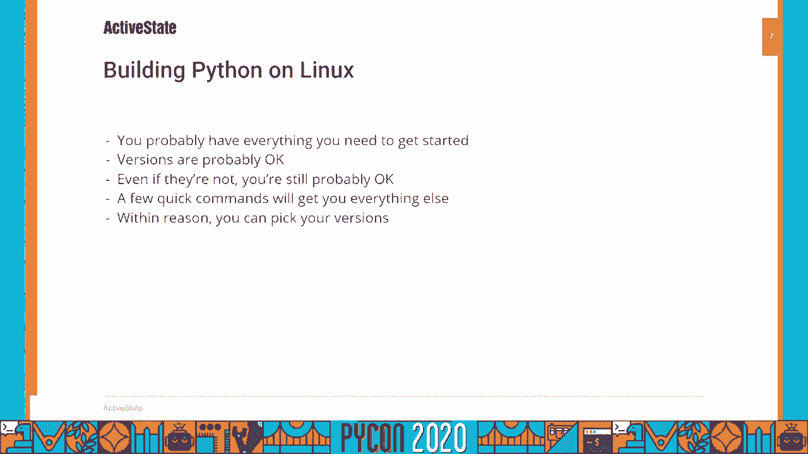
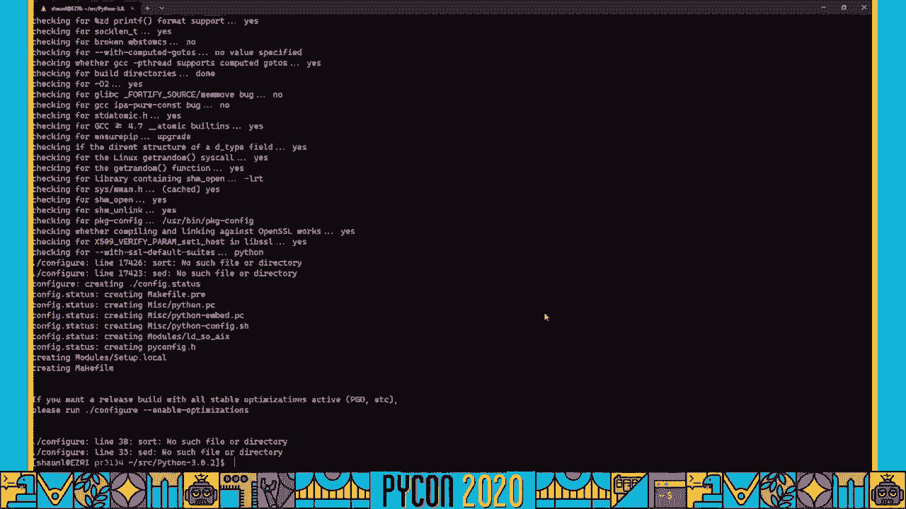
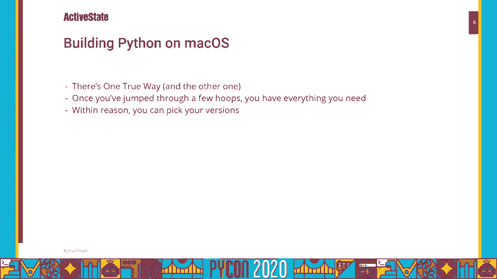
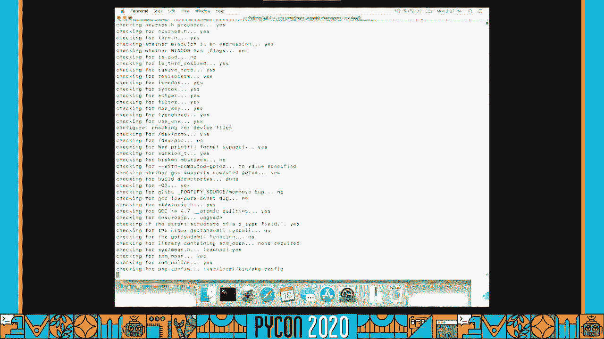
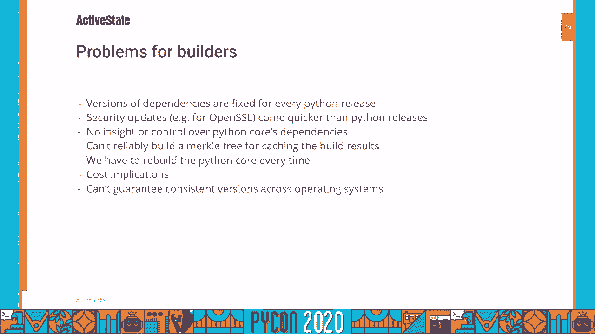
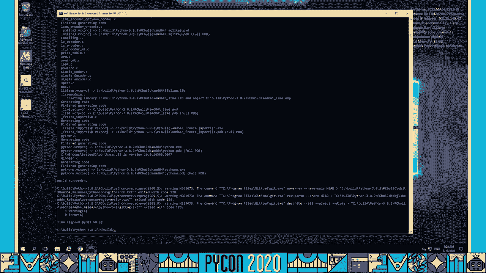
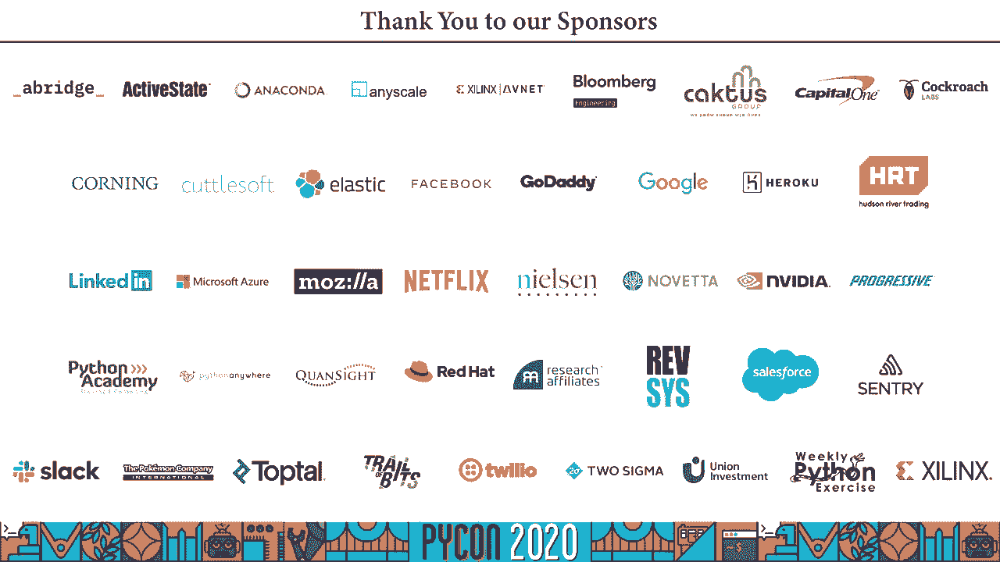

# P9：Sponsor Workshop ActiveState - Shaun Lowry - We need to talk about Windows - 程序员百科书 - BV1rW4y1v7YG

我们需要谈谈窗户，或者更具体地说，我们需要谈谈蟒蛇是如何建在窗户上的，以及如何改进这一过程。我是扎克·格兰特，我是活跃状态，我来介绍肖恩·劳瑞，Active State 的语言工程团队负责人。

在我们进入肖恩的陈述之前，让我们快速讨论活动状态，或者用不同的框架来描述它，为什么活跃的国家可信谈论这个问题。我们已经构建自由和开源的语言运行时 20 年，并为他们在蟒蛇战线上提供企业级支持。我们是 python 软件基金会的创始成员之一，我们的团队成员对蟒蛇核心做出了贡献。我们制造活动蟒蛇，它是一个跨平台的 Python 运行时，捆绑了企业运行软件所需的许多依赖项，我们为三大平台提供了运行时：mac、linux、windows，以及大铁平台等企业需要的平台。我们还为蟒蛇 2 号提供生命结束后的维护和支持，这主要适用于那些还不能迁移到 python3 的企业，因一个原因或另一个。在过去的几年里，我们的许多工作都集中在利用我们的技能、经验，以及我们用于 Python 和其他语言的企业构建的工具，把它们变成一个平台。毫不奇怪，我们称之为活动状态平台。

它允许您在选择的地方构建自定义的跨平台运行时，你需要的依存关系，你得到的线性分布有一个较小的攻击面。我们在后端做重活，比如自动依赖解析，我们的求解器穿过的地方，寻找所有可能的依赖关系组合，以及他们满足你要求的版本，并随着时间的推移增加更多。您可以通过 Web 界面使用该平台，命令行界面，很快通过一个应用程序接口。我们支持蟒蛇、Pearl 和 Tickle 与更多的语言即将到来。因为我们正在添加一个 api，我们还将为其他人添加一个 api，把他们自己的语言和他们自己的依赖添加到平台上。你需要，你可以自己加，账目，都是免费的。你可以在 platform activestate 注册，COM，它还在测试阶段，有很多组合，有时事情不起作用，当它们不起作用的时候，我们要求你跳转到社区活动状态网站，让我们知道。

我们将尽最大努力解决这个问题，最后，该平台为基于 python 的开源项目提供了早期访问程序，这是针对那些需要分发到 mac、windows 和 linux 的项目，想要为他们的项目提供一个运行时。很可能是为了让它，这样你的最终用户就更容易使用它，也许你的最终用户不一定想建立自己的项目，也可能他们没有合适的技能，或者在这些平台上很难，这可能是为了让你的贡献者帮助他们更快地起床和运行。可能是因为你想要更稳定的发布，无论您需要什么，请查看活动状态点程序，前进，斜杠开放连字符源，连字符，早期连字符访问，连字符程序，通读好处，如果你有兴趣，也上论坛让我们知道，我们会尽力让你们上船。在所有这些背景和背景下，我想把你转给肖恩，希望你们觉得这次演讲有趣又有用，非常感谢，在加入活跃状态之前，我做了很长时间的企业开发人员，要么在企业内工作，要么为企业开发软件，所以我感受到每个人的痛苦。

我是 Active State 的语言工程团队负责人，我的工作是建造，来创建我们平台中实际执行数千个单个组件构建的部分，我们的平台需要有能力，我给大家简要介绍一下活跃状态平台。所以你可以看到我们面临的一些挑战，它有许多需要实现的基本目标，为了让我们为开发人员和最终用户提供一些真正有用的东西，对我们来说，以一种成本效益高的方式提供它，这是一个作为服务提供的构建。它超越了传统的连续集成系统所能提供的，它将允许您构建项目，从他们的生态系统，它将允许你创造、下载和运行时 linux 发行版、mac、windows 和一系列大型离子平台，它将利用先前的账单提供快速的可重复智能按需构建服务。为了可靠地提供这项服务，并更好地为开发人员和消费者服务，我们正在创建一组核心功能，它将适用于我们现在和未来所有的开源软件构建。我们不会依赖外部二进制文件，因为我们有赔偿的义务。

因为我们希望每个交付的运行时都是内部一致的，所以我们从源头建立一切，我们会让你更容易了解最新情况，通过管理依赖关系来处理你关心的事情，例如，它依赖于巨蟒生态系统之外的一个 c 库，我们将建立依赖关系模型。与他在皮皮告诉我们的狼群一起，我们的运行时将被下载并运行，所以我们会提供你使用它们所需的一切，从生态系统之外，但我们会拆除脚手架，除非您想让它保持运行时的清洁。该平台旨在利用我们的基础设施。将创建运行时的工作分布到一系列容器中、虚拟机和物理机器，我们利用多层缓存来重用构建输出。现在，我要说的是，在我们的三大操作系统上构建 python 核心，Linux、Mac OS X 和 Windows，在 linux 上构建 python 非常简单，一旦你安装了基本的迪斯科构建工具，您可能已经具备了在最近的 linux 上创建一个工作构建所需的一切。

安装在系统上的 python 依赖项的版本可能还可以，即使它们不是，你可能会得到一条工作的蟒蛇，添加对 ffi 和 bsd db 之类的支持，如果你想，你可以轻松地提供自己版本的 python 先决条件。一系列不错的版本将与任何给定的版本的蟒蛇都很好地工作。

所以让我们来看一个典型的 linux 构建，这是一个汽车补偿风格的建立，所以我们会有一个配置脚本，我们来看看你能看到的帮助。我们可以提供各种各样的选择，我们可以告诉它在哪里找到打开的 ssl。我们可以告诉它哪里可以找到依赖项，TK，呃，有大量的选项可以调用系统库，也是，我们将继续运行 configure，只使用默认选项，我们会加快速度，所以你不必看完。

它似乎做了很多正确的事情，所以现在我们要建造它，它再次加快了你的观看速度，快乐，好了，它完成了一个完整的构建，在 macOS 上，一切都被封锁了，但蟒蛇的构造很相似，除了有一个真正的框架构建方式。与更传统的 UNIX 构建，一旦你安装了 xcode，你差不多准备好了，感谢酿造，可以使用自定义版本安装一系列 python 依赖项。如果您乐于从源构建依赖关系，我们是你。与 linux 上的依赖关系版本的选择几乎相同。

好的，所以让我们来看看 mac 的构建，这里的区别在于我们启用了 enable 框架选项，这给了我们在苹果电脑上制造蟒蛇的唯一真正方法。

它似乎做了正确的事情，所以我们会继续构建它，基本上与 Linux 构建相同。我们需要讨论使用本地 Visual Studio 构建系统的 Windows，偏离标准构建是相当困难的，不像 Linux 和 Mac。你的常规 Windows 安装可能没有你需要的，即使你有一个带有 Visual Studio 的开发者设置，所有的铃铛和哨子，你可能仍然缺少必要的工具，甚至有可能你拥有的工具版本最适合 Python 构建。除非你有推荐版本的 Visual Studio，以及特定的工作负载和适合的 Windows SDK，某些情况下，多个 SDK 版本的正确组合，否则你不太可能得到一个优秀的构建，安装干净的机器几乎是强制性的，或者从零开始的虚拟机。仅仅为了进行 Python 构建，我们很幸运，活跃状态对我们每个版本的 Python 都这样做一次，您已经在开发环境中设置了如何处理所有这些依赖项，Windows 并没有开启，SSL、B、二号拉链等，不用担心。

Visual Studio Python 构建系统由许多 Visual C++ 项目构成，其中一个是核心本身，项目中还有一堆测试和辅助项目，每一个 C 库依赖项，包括 OpenSSL、tkinter、zipfile 等等，这些项目允许您从源构建 Python 及其依赖项，还有许多用于自动化构建的批处理文件，从命令行利用活跃状态运行无人参与的构建，您将遇到的这些批处理文件中的第一个是。这是进入 Visual Studio 命令行 Python 构建系统的主要入口点，它在很大程度上使用 MSBuild，使用可视化的 C++ 项目文件，它有配置各种构建参数的选项，如发布、调试，对核心功能的一些控制。其中一个允许您排除外部源库的构建，例如 OpenSSL，但这也完全禁用了依赖于它们的特性。如果您真的想要这些功能，您可以从外部获取，它将下载源代码或二进制文件，可用于您需要的所有依赖项的地方。

而不是去这些库的各个主页，从一个专门为托管它们而设置的 Git 存储库中，或者，对于旧版本，会在可能的情况下，使用现有的 Python 构建来进行下载，如果你没有。它甚至可以为这个目的下载 Python 构建，不幸的是，这种方法对人们来说有许多缺点，使用 Visual Studio 构建系统时，C 库依赖项的版本在发布时是固定的，永远不能更改，依赖项需要安全更新的地方，例如 OpenSSL。这些更新的频率比 Python 点发布更频繁，而用户将经常无法升级到最新的 Python 版本，只需修复其依赖项。外部构建系统，如活跃状态，既不能控制也不能洞察 Python 对 Windows 的核心依赖。这些依赖只是一个在发布时硬编码的黑匣子，这意味着在 Windows 上的 Python，我们无法计算出准确的默克尔树用于缓存目的，因此，我们不能可靠地缓存构建输出以供重用，我们最终为每一个 Windows 构建重建 Python 核心。

这对 Windows 构建的计算时间和磁盘空间有成本影响，更糟的是，我们不能保证这些依赖项的版本一致性，尤其是在跨多个操作系统时。

所以让我们来看一个典型的 Windows 构建，我们会要求一个 64 位的构建使用 Visual Studio 215，您可以看到它正在获取外部依赖项，我们又一次受够了，所以你不用看着整个构建，但你可以看到它基本上只是把所有的东西。一切都结束了。

我们迫切需要能够，至少更频繁地替换我们的 Python 构建的 OpenSSL。为此，我们把每一个版本的 Python 核心都替换成外部信息，从我们使用的云存储中下载所有依赖项。对于我们所有其他的缓存源代码，我们下载运行时需要的 OpenSSL 版本，将其解压缩到同一目录，Visual C++ 项目希望它能在构建系统中运行。然后在目录中找到一个更新版本的 OpenSSL，它假设是针对旧版本的，例如，零点两个 T 代替一个点，某些版本的 OpenSSL 的零点 2p，这也意味着要重组源树，以符合 Visual C++ 项目的预期。显然这并不理想，我们需要对所有其他核心依赖项进行复制，因此我们计划采用不同的方法，创造一个新的 Visual C++ 和 MS 的 Python 构建系统，使其更加灵活。

并且可以选择使用预先构建的库作为其依赖项，这将允许我们使用活跃状态平台来满足这些依赖性，同时允许其他用户使用传统的构建系统或任何他们选择的其他方式来满足这些依赖性。我们计划将这个新的构建系统贡献给 Python 社区，希望上游能够接受，作为我们创造可靠、可重复的 Linux 和 macOS 上的可升级版本，这样我们就能避免修补 Python 的核心，并保持我们的 Python 分发干净和兼容的社区建设。我们希望让它们成为开发者了解最新安全可靠的 Python 版本的最佳途径，我们的目标是让每个人在 Windows 上有更好的 Python 使用体验。

