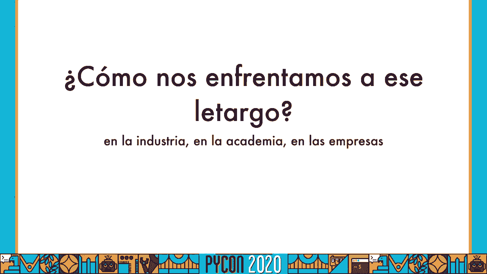
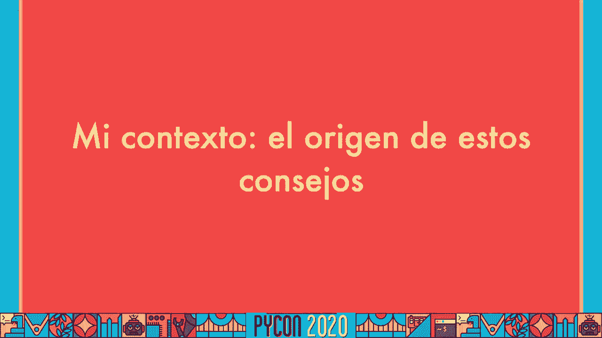
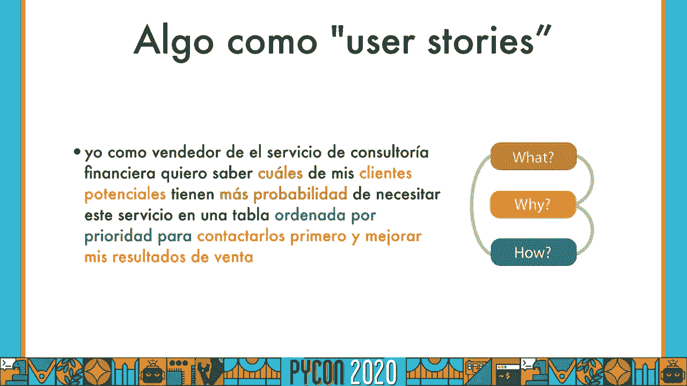
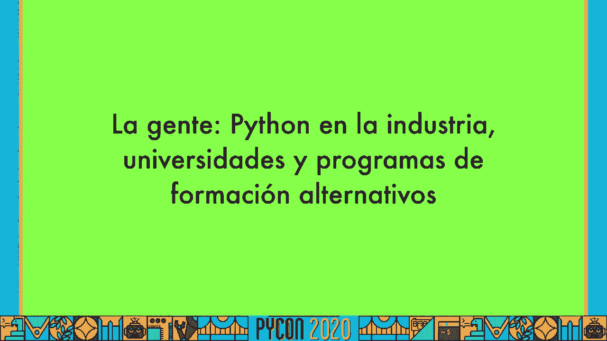
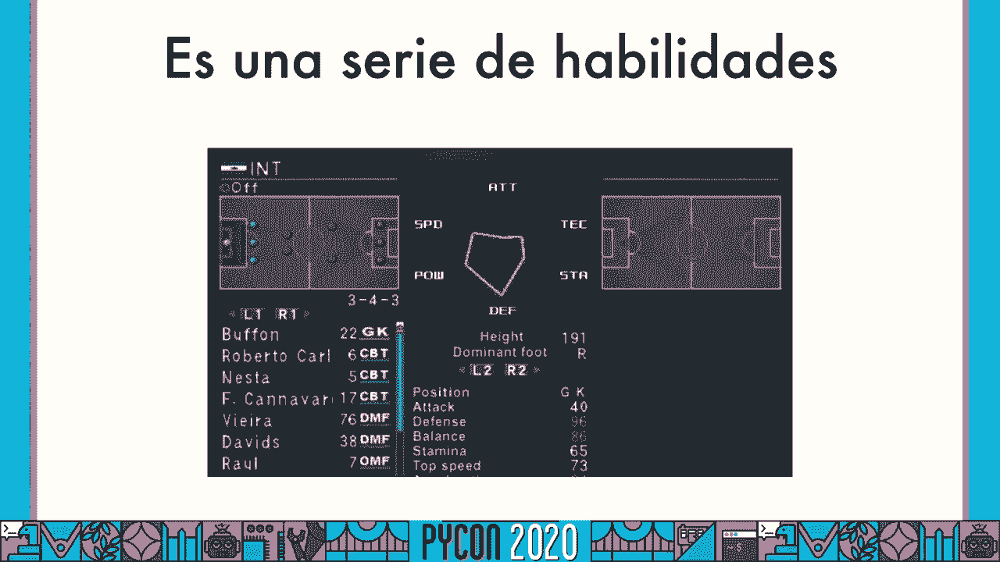

# 002：编程基础入门 🐍


在本节课中，我们将要学习编程的基础概念，特别是如何通过Python语言与数据进行交互。我们将从最核心的“数据”概念开始，逐步了解编程的基本结构，并最终理解如何通过代码来操控信息。

## 概述

编程的核心是处理数据。数据可以是数字、文字、图像或任何能被计算机理解的信息。Python是一种强大且易学的编程语言，非常适合初学者用来探索数据世界。本节课程将引导你理解数据在编程中的角色，并掌握用Python表示和操作数据的基本方法。

---



## 数据：一切的基础 💾



数据是信息的载体。在编程中，我们首先需要理解如何表示数据。

上一节我们介绍了课程的整体目标，本节中我们来看看最基础的元素——数据。

### 数据的类型

数据有不同的类型，每种类型在计算机中都有特定的表示方式和操作规则。以下是几种基本的数据类型：

*   **整数**：没有小数部分的数字，例如 `1`, `-5`, `100`。
*   **浮点数**：包含小数部分的数字，例如 `3.14`, `2.0`, `-0.5`。
*   **字符串**：由字符组成的文本，在Python中用单引号或双引号包围，例如 `‘你好’`, `“Python”`。
*   **布尔值**：表示真或假，只有两个值：`True` 和 `False`。

在Python中，你可以直接为变量赋值来存储数据：

```python
# 整数
age = 25
# 浮点数
price = 19.99
# 字符串
name = "查尔拉"
# 布尔值
is_learning = True
```

---

## 变量：数据的容器 📦

变量就像是一个贴有标签的盒子，用于存储数据。你可以通过变量名来访问或修改盒子里的数据。

上一节我们了解了数据的几种形式，本节中我们来看看如何用变量来存放它们。

### 变量的命名与使用

给变量起名需要遵循一些简单的规则：
*   名称只能包含字母、数字和下划线。
*   名称不能以数字开头。
*   名称是区分大小写的（`myVar` 和 `myvar` 是两个不同的变量）。

以下是使用变量的基本操作：

```python
# 将数据存入变量
message = “欢迎学习Python！”
# 打印变量中的数据
print(message)
# 修改变量中的数据
message = “数据很有趣！”
print(message)
```

---

## 基本操作：与数据交互 ⚙️

有了数据和变量，我们就可以对它们进行各种操作，比如数学计算、文本连接和逻辑判断。

上一节我们学会了如何用变量保存数据，本节中我们来看看如何操作这些数据。

### 常见的操作

以下是几种对数据的基本操作：





*   **算术运算**：对数字进行加、减、乘、除等。
    ```python
    a = 10 + 5  # 加法，结果是15
    b = 10 * 2  # 乘法，结果是20
    ```
*   **字符串连接**：将多个字符串组合在一起。
    ```python
    greeting = “你好，” + “世界！”  # 结果是“你好，世界！”
    ```
*   **比较运算**：比较两个值，结果是布尔值（`True`或`False`）。
    ```python
    result = 10 > 5  # 判断10是否大于5，结果是True
    ```

---

## 控制流程：让程序做决定 🧭



程序并非总是直线执行。我们可以通过条件判断，让程序根据不同的情况选择执行不同的代码块。

上一节我们学习了如何操作数据，本节中我们引入“控制流程”的概念，让程序变得更智能。

### 条件判断：if语句

`if`语句是控制程序流程的基础工具。它的基本结构如下：

```python
if 条件:
    # 如果条件为True，执行这里的代码
    执行操作
else:
    # 如果条件为False，执行这里的代码
    执行其他操作
```

例如，我们可以根据分数判断成绩等级：

```python
score = 85
if score >= 90:
    print(“优秀”)
elif score >= 60:
    print(“及格”)
else:
    print(“不及格”)
```

---

## 总结

本节课中我们一起学习了编程的四个核心基础概念：
1.  **数据**：信息的多种表示形式，如整数、字符串。
2.  **变量**：用于存储和引用数据的命名容器。
3.  **基本操作**：对数据进行计算、连接和比较的方法。
4.  **控制流程**：使用 `if` 语句让程序根据条件做出不同反应。


理解这些概念是学习任何编程语言的第一步。它们就像积木，组合起来就能构建出功能丰富的程序。在接下来的学习中，你将运用这些基础去处理更复杂的数据和逻辑。