# 005：如果没有文档记录，您的项目


## 概述 📖

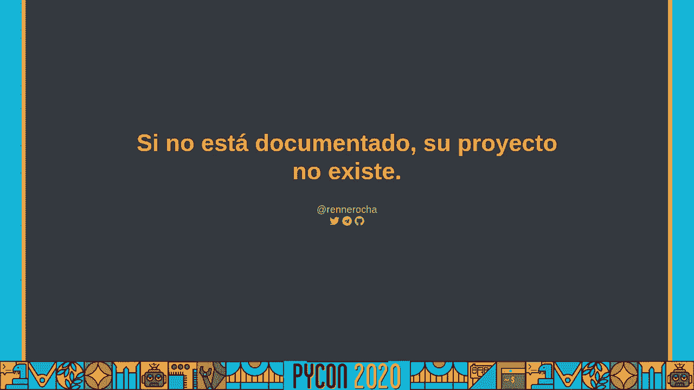

在本节课中，我们将学习项目文档的重要性以及如何有效地编写和维护文档。一个没有文档的项目就像一本没有目录和索引的百科全书，难以被他人理解和维护。我们将探讨文档缺失的后果、优秀文档的核心要素以及实用的编写策略。


---

## 文档缺失的后果 🚨

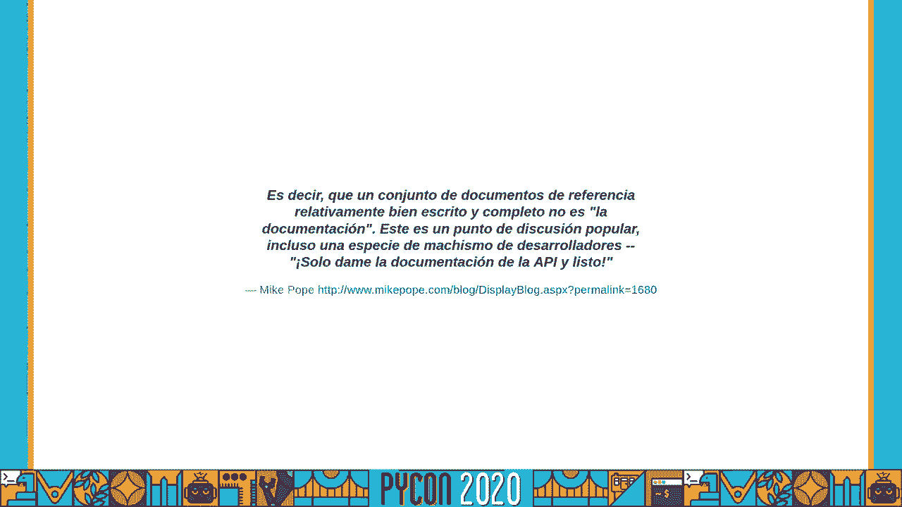

上一节我们概述了课程目标，本节中我们来看看如果项目缺乏文档，会带来哪些具体问题。

没有文档记录的项目会面临一系列挑战。新成员加入团队时需要花费大量时间理解代码和业务逻辑。项目交接变得异常困难，知识仅存在于少数核心成员的头脑中。当出现问题时，排查和修复的效率会大大降低，因为缺乏对系统设计和历史决策的参考。


以下是文档缺失可能导致的主要问题：

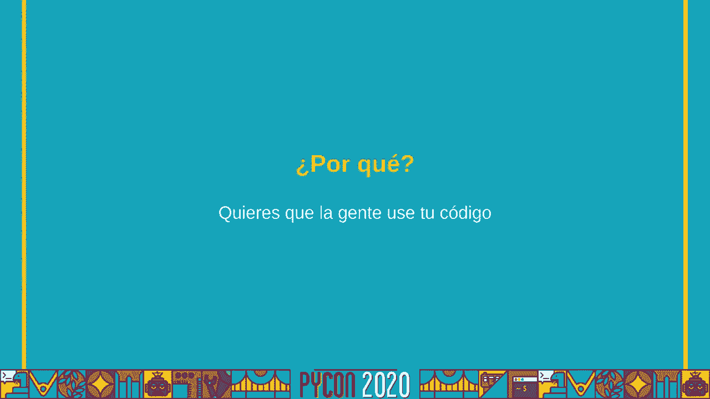

*   **知识孤岛**：关键信息仅由个别开发者掌握，形成单点故障风险。
*   **上手成本高**：新成员需要逆向工程代码来理解项目，延长了产出时间。
*   **维护困难**：随着时间推移，即使是原作者也可能忘记某些复杂逻辑的设计初衷。
*   **协作低效**：团队成员对系统理解不一致，容易产生沟通误解和重复工作。
*   **项目风险**：核心成员离职可能导致项目陷入停滞或需要推倒重来。

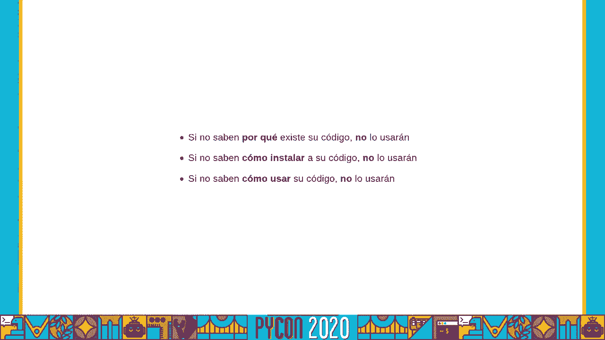

---


## 优秀文档的核心要素 ✨

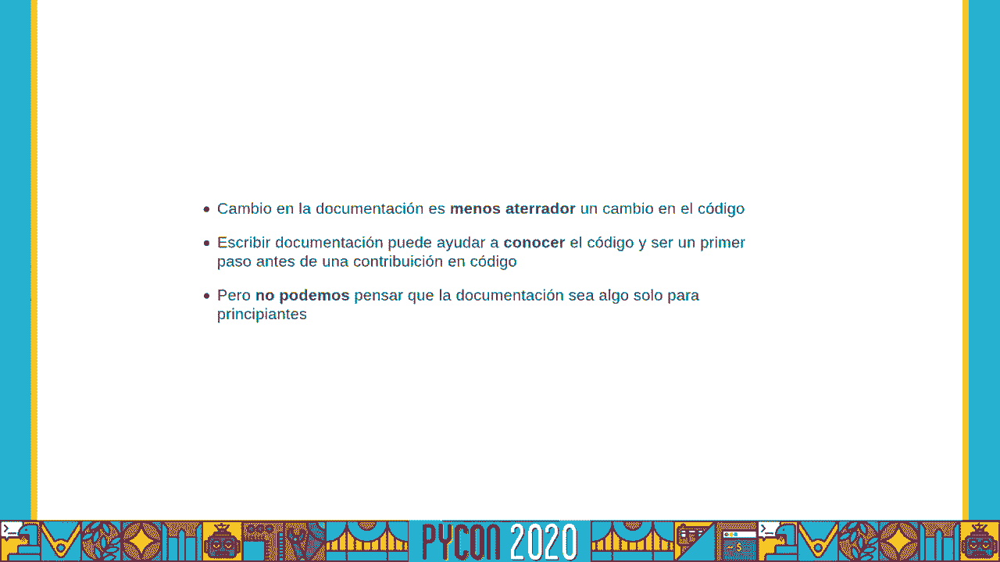


了解了缺乏文档的危害后，我们来看看一份优秀的项目文档应该包含哪些核心内容。

优秀的文档不仅仅是代码注释的堆砌，它是一个多层次、面向不同读者的知识体系。它应该解释“为什么”要这样设计，而不仅仅是“是什么”和“怎么做”。

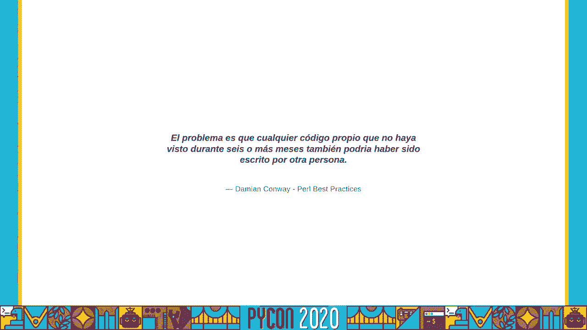

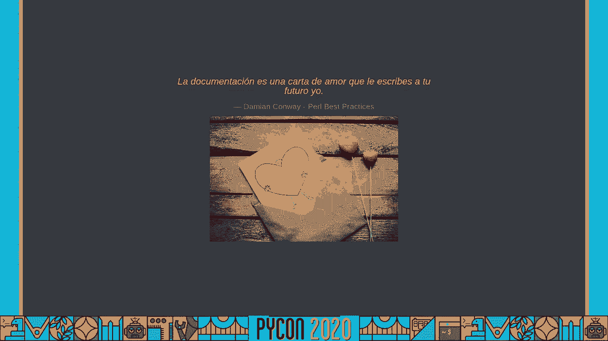

一份完整的项目文档通常包含以下几个层次：

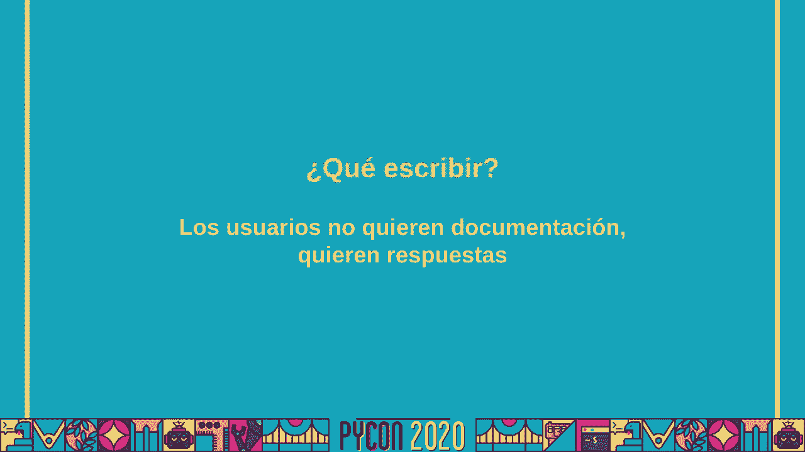

*   **项目概述**：用一两句话说明项目是做什么的，解决什么问题。
    *   **公式**：`项目价值 = 解决的问题 - 使用成本`
*   **快速开始指南**：让用户或新开发者能在几分钟内搭建环境并运行一个最简单的例子。
    *   **代码示例**：
        ```bash
        git clone <项目地址>
        cd <项目目录>
        npm install
        npm start
        ```
*   **架构设计**：描述系统的主要组件、模块划分以及它们之间的交互关系。
*   **API 文档**：清晰说明每个接口的用途、输入、输出和错误码。
*   **部署与运维手册**：包含环境配置、构建步骤、发布流程和监控指标。
*   **常见问题与解决方案**：记录在开发和使用过程中遇到的实际问题及其解决方法。

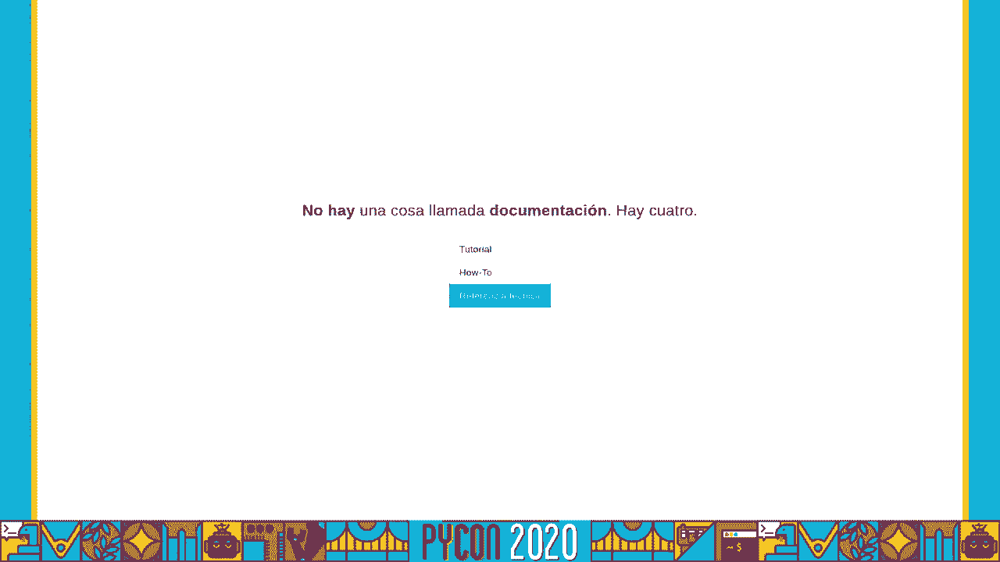

---

## 如何开始编写与维护文档 📝

上一节我们列出了优秀文档的要素，本节中我们来看看如何具体着手编写并长期维护这些文档。


开始编写文档的关键是克服“从零开始”的恐惧，并建立可持续的习惯。不要追求一次性写出完美的文档，而应采用迭代的方式。

以下是开始和维持文档工作的实用步骤：

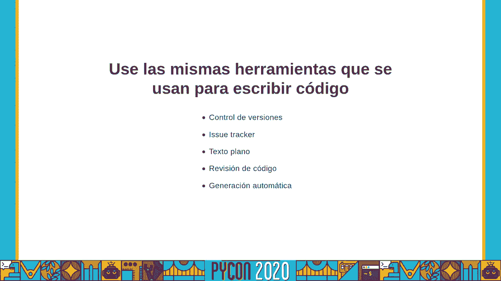

1.  **从“README”文件开始**：这是项目的门面，至少应包含项目概述和快速开始指南。
2.  **采用“文档即代码”的理念**：将文档和代码放在同一个仓库管理，便于同步更新和版本控制。
3.  **在代码审查中包含文档**：将相关文档的更新作为合并代码的前提条件。
4.  **设立文档“守护者”**：可以轮流指定团队成员负责定期检查并更新文档。
5.  **使用合适的工具**：根据项目类型，选择 Markdown、Swagger、Sphinx 或 MkDocs 等工具来降低编写成本。
6.  **保持简洁与准确**：文档应直达要点，并确保与代码实际行为保持一致。过时文档比没有文档更具误导性。

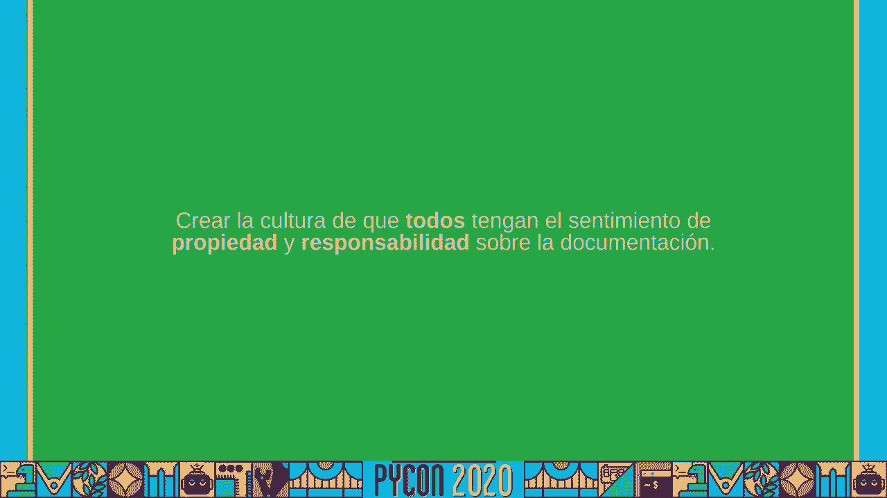

---

## 总结 🎯

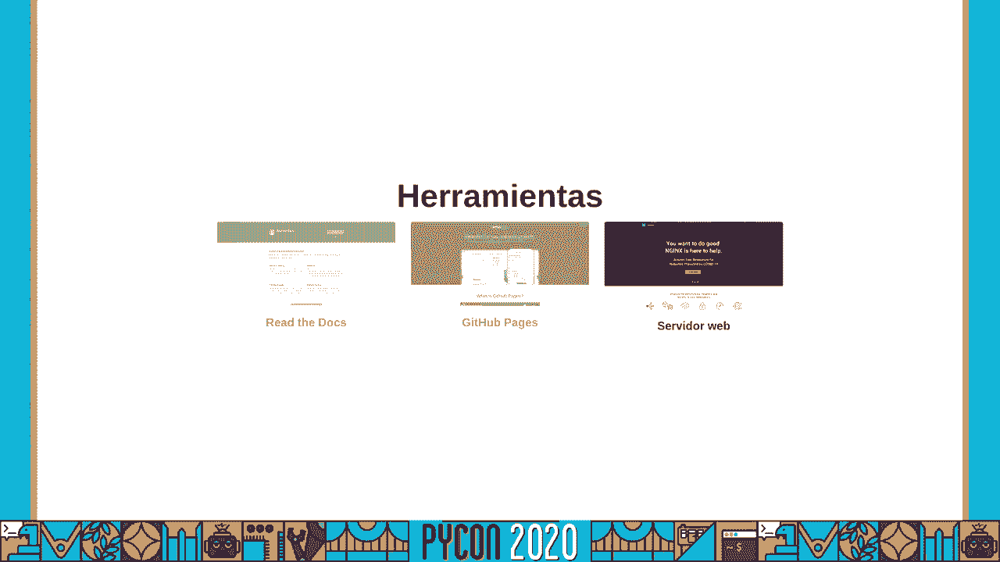

本节课中，我们一起学习了项目文档的关键作用。我们认识到，没有文档的项目会阻碍团队协作、增加维护成本并带来业务风险。我们探讨了优秀文档应具备的核心要素，包括从概述到运维的全方位内容。最后，我们学习了如何通过从小处着手、结合开发流程以及利用合适工具来启动并持续维护文档工作。


请记住，编写文档不仅是为了他人，也是为了未来的自己。它是项目长期健康发展的基石。开始为您负责的项目添加上第一份文档吧。