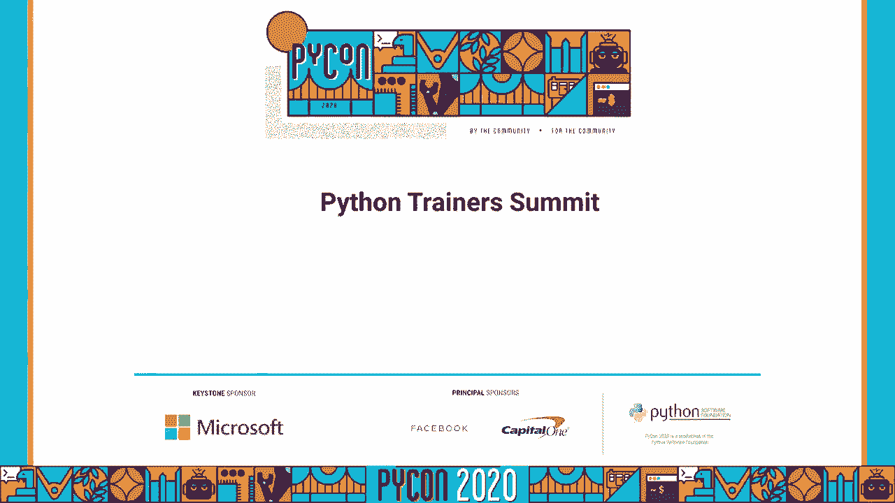
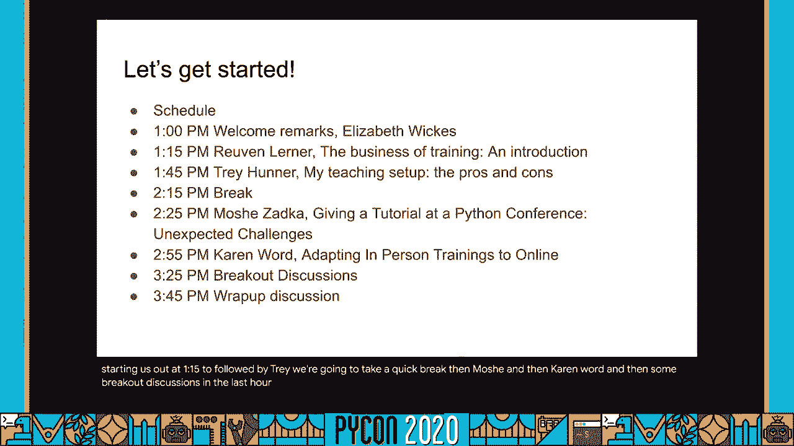
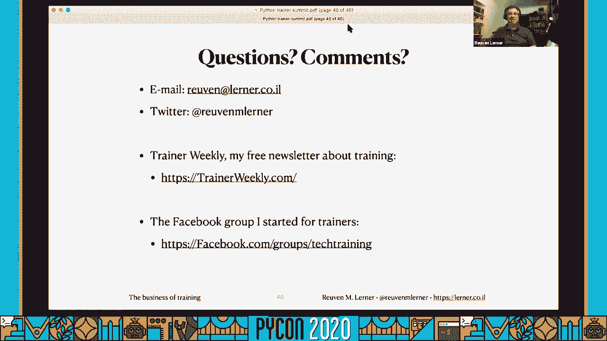
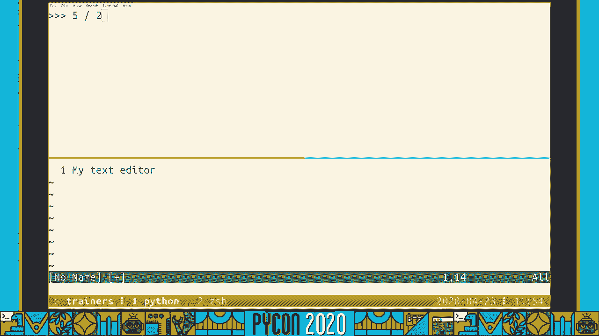
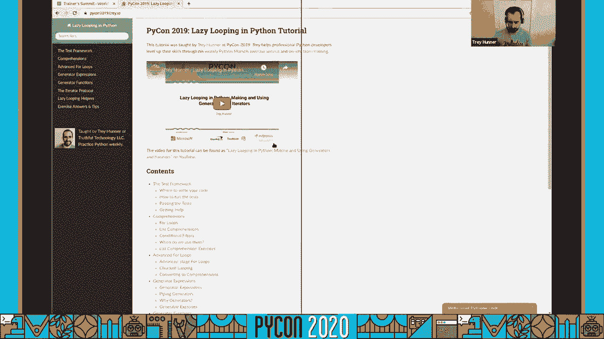
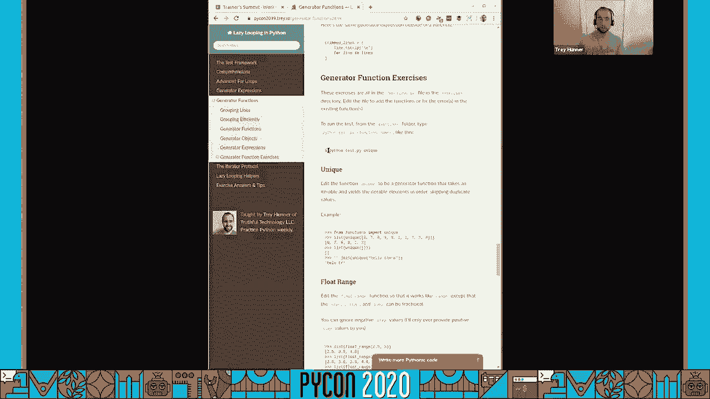
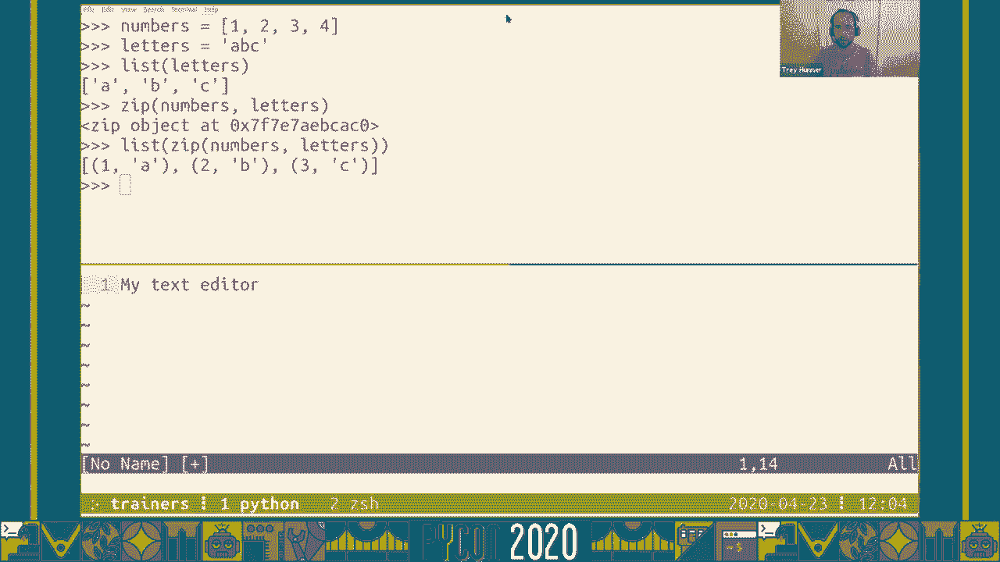
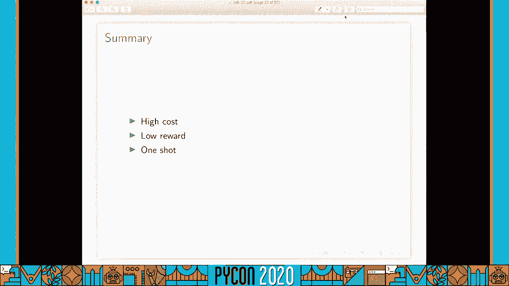
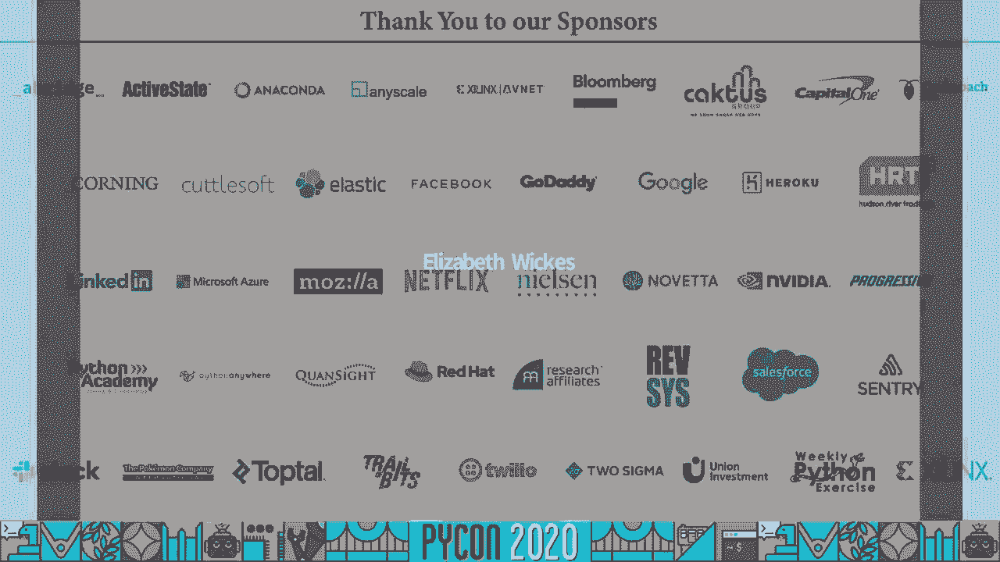
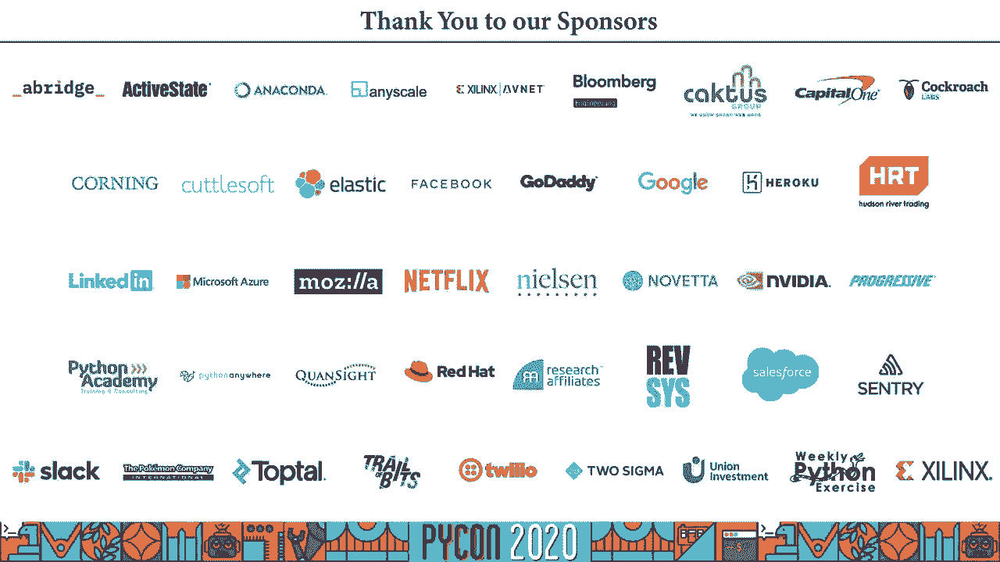

# 008：培训师孵化器2020




## 概述
在本教程中，我们将学习如何成为一名成功的Python培训师。内容涵盖培训业务的建立、有效的现场编码教学技巧、应对会议教程的挑战，以及将面对面研讨会成功迁移到在线环境的策略。我们将通过具体的公式、代码示例和最佳实践，帮助初学者理解并应用这些概念。

---



## 培训业务：建立与运营


上一节我们概述了课程内容，本节中我们来看看如何将Python培训作为一项业务来建立和运营。

培训应被视为一种产品，而非单纯的服务。公司将其视为一项投资，旨在帮助员工提升技能，从而提高效率、减少成本并增强员工留任率。

### 核心公式：培训的价值
公司评估培训价值的一个简单方式是计算其投资回报。假设：
*   一名工程师年薪为 `$100,000`。
*   培训使其效率提升 `10%`。
那么，公司每年可从该工程师身上节省：
`$100,000 * 10% = $10,000`
如果一场培训有20名工程师参加，潜在年节省额为：
`$10,000 * 20 = $200,000`
因此，公司愿意支付一笔可观的费用（例如 `$24,000`）来获取这项长期收益。

### 关键策略
以下是开展培训业务的关键步骤：

1.  **专业化定位**：专注于特定领域（如Python数据科学、网络安全），能吸引更有针对性的客户。
2.  **建立权威**：通过写博客、在技术会议演讲、参与开源项目来展示你的专业知识。
3.  **明确提案**：向客户提交清晰的提案，需包含：
    *   目标受众
    *   课程大纲
    *   学员需具备的先验知识
    *   预期学习成果
    *   课程人数上限
    *   动手实践环节的比例（建议>30%）
    *   取消条款
4.  **定价策略**：通常按天收费，并设定学员人数上限。价格因地区、专业领域和讲师声誉而异。
5.  **重视评估**：课程结束后的评估分数对客户（培训经理）至关重要。高分和积极的书面反馈是获得回头客的关键。
6.  **增值销售**：根据学员反馈，开发并推荐相关的高级或专题课程。

### 代码示例：简单的投资回报计算
```python
def calculate_training_roi(engineer_salary, efficiency_gain_percent, num_engineers, training_cost):
    """
    计算培训的潜在投资回报。
    """
    yearly_saving_per_engineer = engineer_salary * (efficiency_gain_percent / 100)
    total_yearly_saving = yearly_saving_per_engineer * num_engineers
    net_gain = total_yearly_saving - training_cost
    return net_gain

# 示例计算
salary = 100000
gain = 10
engineers = 20
cost = 24000

net = calculate_training_roi(salary, gain, engineers, cost)
print(f"培训后公司年净收益: ${net}")
# 输出: 培训后公司年净收益: $176000
```



---

## 教学技巧：互动式现场编码


上一节我们介绍了培训的商业层面，本节中我们来看看一种高效的教学方法：互动式现场编码。

现场编码是指讲师在课堂上实时编写并解释代码，而非使用预先准备好的幻灯片。这种方法鼓励互动和主动学习。



### 教学设置
一个有效的设置是使用终端复用器（如Tmux）或IDE的分屏功能：
*   **屏幕A（讲师视图）**：包含教学笔记和辅助终端。
*   **屏幕B（学员视图）**：仅共享一个全屏终端或代码编辑器窗口，学员只看到编码过程。




### 核心技巧
1.  **持续提问**：在每行代码执行前，询问学员预测结果。这促进回忆和思考。
    ```python
    # 讲师问：“你们认为这段代码会输出什么？”
    result = 5 / 2
    print(result)  # 在Python 3中，输出 2.5
    ```
2.  **探索可能性**：对于开放性问题，先引导学员列出所有可能的结果，再验证。
    ```python
    numbers = [1, 2, 3, 4]
    letters = ['a', 'b', 'c']
    # 讲师问：“zip(numbers, letters) 可能返回什么？截断？报错？用None填充？”
    zipped = list(zip(numbers, letters))
    print(zipped)  # 输出: [(1, 'a'), (2, 'b'), (3, 'c')]
    # 然后讨论Python设计者为何选择“截断至最短序列”的行为。
    ```
3.  **重视错误答案**：营造安全氛围，强调猜测和犯错是学习过程的一部分。
4.  **动手练习**：安排学员结对编程完成练习。讲师在教室中巡视，使用“便利贴”系统（绿色=顺利，红色=需要帮助）来识别需要援助的学员。

### 在线教学调整
在线教学时，需调整互动方式：
*   **替代便利贴**：使用Zoom的“举手”功能、聊天框输入特定符号（如`?`表示问题，`✓`表示完成）或表情符号。
*   **管理聊天**：指定助教监控聊天频道，过滤问题，让讲师能专注于教学。
*   **分组讨论室**：用于练习和社交，助教可以进入不同房间提供帮助。
*   **开启摄像头**：鼓励但不强制，有助于营造课堂氛围。



---



## 挑战应对：会议教程实战

上一节我们探讨了理想的教学方法，本节中我们来看看在现实世界的Python大会上进行教程教学时会遇到的具体挑战。

会议教程通常是收费的、为期半天的密集型课程，学员背景差异巨大。


### 主要挑战
1.  **环境多样性**：学员使用不同的操作系统（Windows, macOS, Linux各版本），安装软件（Python, 依赖包）的过程复杂且易出错。
2.  **技能水平差异**：学员从初学者到专家都有，目标和子专业领域（数据科学、Web开发、运维等）也不同。
3.  **时间与经济效益**：教程时间短（约3小时），讲师报酬固定，但需承担大量课前准备（编写材料、测试安装说明）和课后支持工作。

### 实用建议
以下是应对这些挑战的策略：

1.  **课前准备**：
    *   提供详尽、分操作系统的安装说明文档。
    *   举办一次“安装派对”，提前帮助学员搭建环境。
    *   准备云环境或虚拟机镜像作为备用方案，供安装失败的学员使用。
2.  **降低预期**：明确告知学员，由于环境多样性，可能无法为所有人100%解决所有安装问题。
3.  **结对编程**：鼓励学员结对，这样只需一半的电脑能成功安装即可进行实践。
4.  **简化内容**：聚焦核心概念，避免涉及需要复杂环境配置的尖端工具。
5.  **管理沟通**：与会议组织方明确责任，设定对学员支持范围的合理预期。

---

## 模式迁移：从线下到线上研讨会

上一节我们讨论了会议教程的挑战，本节中我们来看看如何将成熟的面对面研讨会模式（如Carpentries）系统性地迁移到在线环境。

在线教学不是简单地将线下内容搬到网上，需要重新设计互动、支持和社交环节。

### 核心原则
1.  **保持同步互动**：尽管有异步选项，但初期建议保持实时视频教学，以维持互动性。
2.  **强化教学团队**：在线教学更需要团队协作。明确角色：
    *   **主讲师**：专注教学。
    *   **助教/共同讲师**：监控聊天、解答技术问题、管理分组讨论室。
    *   **主持人**：管理会议设置（静音、分组）、应对突发状况（如讲师断线）。
3.  **刻意规划社交**：安排固定的社交时间，利用分组讨论室进行破冰或主题讨论。




### 具体实施方案
以下是实施在线研讨会的关键点列表：

*   **技术选择**：使用稳定的视频会议工具（如Zoom），并优先利用其内置功能（投票、非语言反馈、举手）。
*   **沟通渠道**：
    *   **主聊天**：用于学员提问和快速反馈。
    *   **后台频道**：教学团队使用Slack、Discord或Zoom私聊进行协调。
*   **替代便利贴**：
    *   要求学员在聊天中输入特定词（如“help”、“done”）。
    *   使用Zoom的“赞成/反对”非语言反馈图标。
    *   使用第三方互动工具（如Mentimeter）进行实时投票和问答。
*   **反馈收集**：使用在线表单（如Google Forms）替代纸面反馈卡，进行匿名课后反馈。
*   **录制策略**：如果录制，需提前告知所有参与者，并明确录制用途。注意录制可能抑制学员的参与意愿。

### 代码示例：使用Zoom API自动创建分组讨论（概念）
```python
# 注意：此为概念性示例，实际需使用Zoom API SDK
import requests

def create_zoom_breakout_rooms(api_token, meeting_id, room_assignments):
    """
    通过Zoom API创建分组讨论室。
    room_assignments: 列表，包含每个房间的学员邮箱列表。
    """
    url = f"https://api.zoom.us/v2/meetings/{meeting_id}/breakout_rooms"
    headers = {"Authorization": f"Bearer {api_token}"}
    data = {
        "settings": {
            "enable": True,
            "rooms": [{"participants": participants} for participants in room_assignments]
        }
    }
    response = requests.put(url, headers=headers, json=data)
    return response.json()

# 在实际教学中，可能需要更动态的分组逻辑。
```


---

## 总结
在本教程中，我们一起学习了成为Python培训师的多个关键方面。我们从**建立培训业务**开始，理解了如何将培训产品化、定价并与客户沟通。接着，我们深入探讨了**互动式现场编码教学技巧**，强调了提问、探索和动手实践的重要性。然后，我们直面了在**会议教程教学**中遇到的环境多样性和时间限制等现实挑战，并给出了应对策略。最后，我们系统性地研究了如何将高质量的面对面研讨会模式**成功迁移到在线环境**，重点关注团队协作、互动设计和工具使用。






希望本教程为你提供了实用的见解和可操作的步骤，帮助你在Python培训与教育的道路上迈出坚实的一步。记住，成功的教学不仅在于深厚的专业知识，更在于理解学员需求、创造互动环境并持续反思与改进。