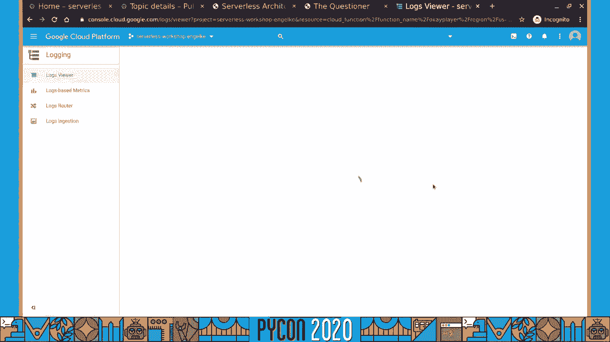
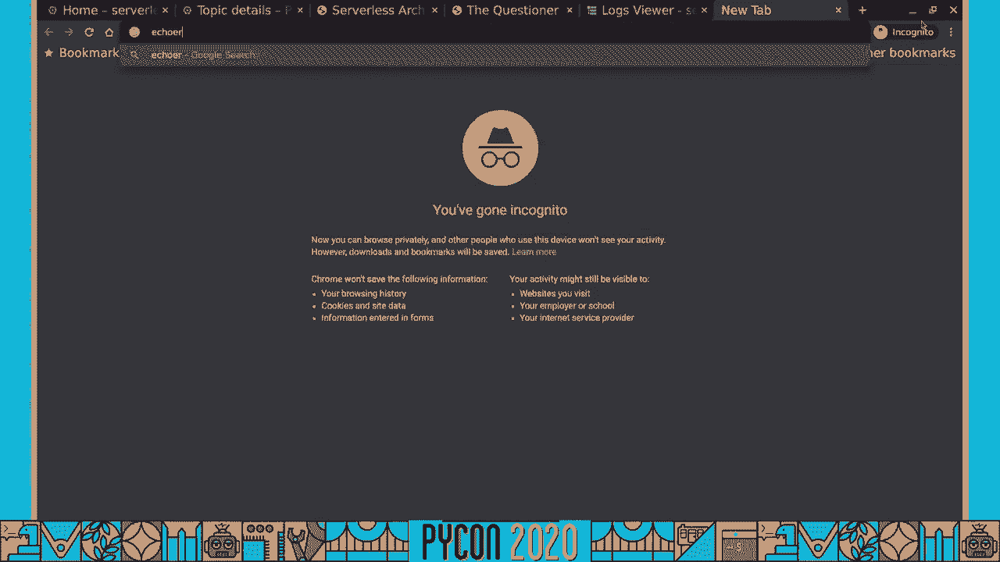
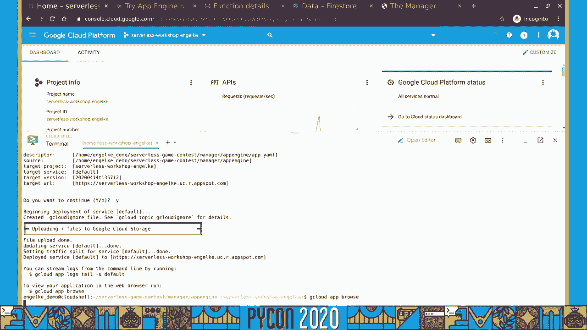
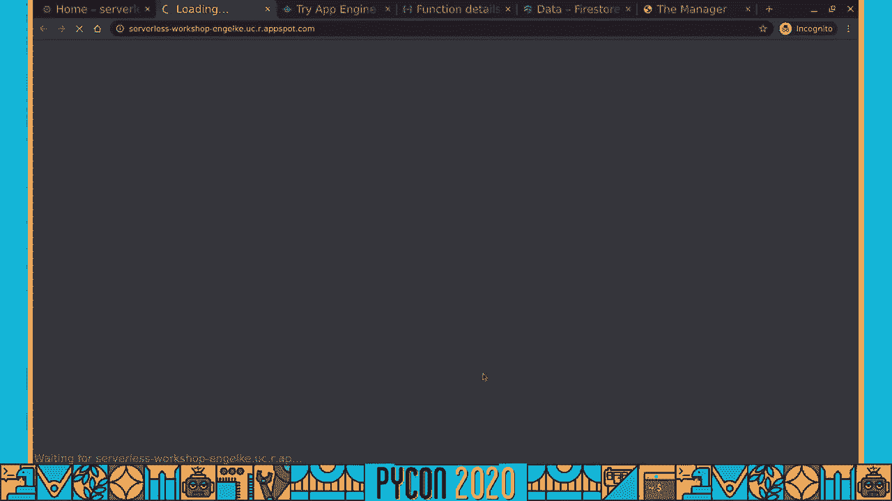
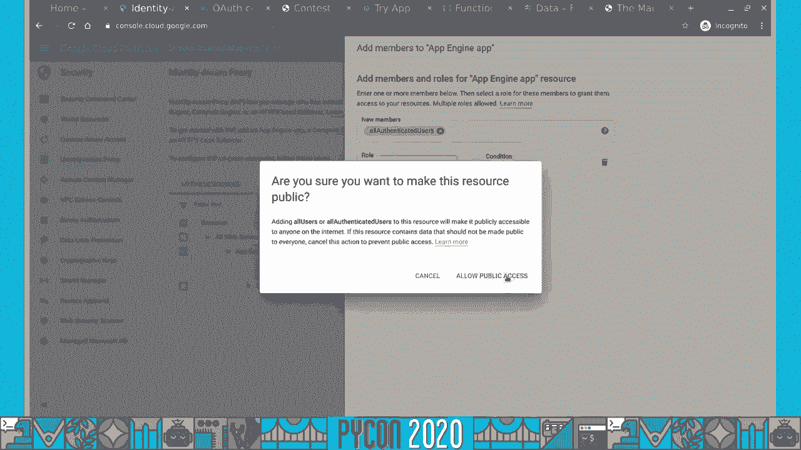
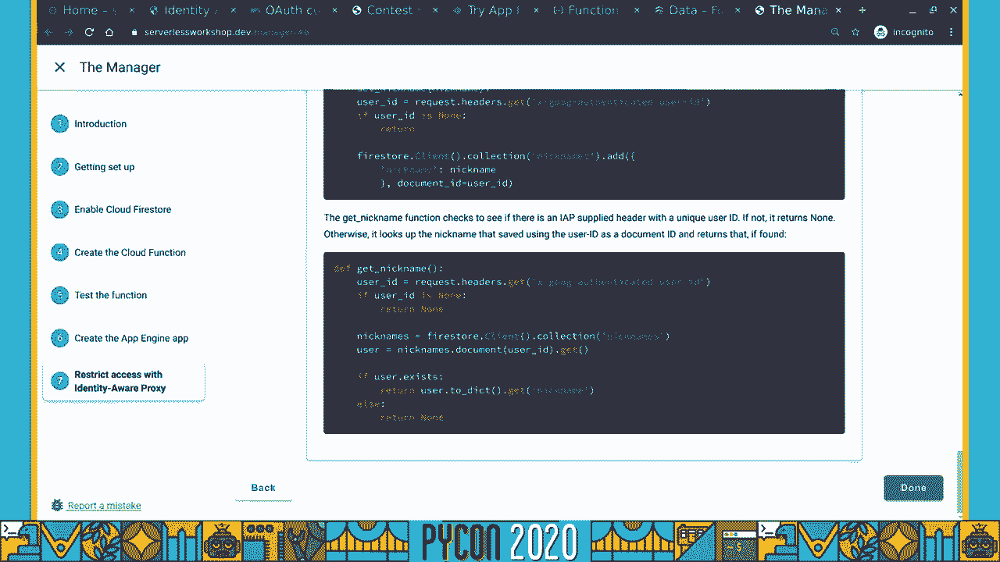
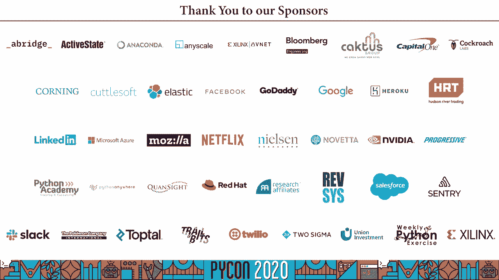

# 011：使用Go构建无服务器Python应用


在本课程中，我们将学习如何构建一个松耦合、事件驱动的分布式无服务器系统。我们将通过创建一个编程竞赛评判系统作为示例，涵盖无服务器概念、架构设计以及使用Google Cloud Platform（GCP）的具体实现。课程内容分为三个主要部分：构建参赛者解决方案、构建评判组件以及构建系统管理核心。

## 概述

我们将创建一个管理编程竞赛的系统。参赛者需要编写一个能玩“猜数字”游戏的程序。评判系统会测试这些程序，并跟踪排名。整个系统将基于无服务器架构，使用多个通过消息传递松散连接的组件。

## 什么是无服务器计算？

无服务器计算并不意味着没有服务器，而是指开发者无需管理服务器基础设施。服务器由云平台提供商（如Google Cloud Platform）管理。开发者只需关注应用程序代码。

无服务器计算的主要优势包括：
*   **快速部署**：从构思到部署运行速度很快。
*   **成本效益**：通常可以缩减到零，只为实际使用的资源付费。
*   **免运维**：无需配置、备份、监控或扩展服务器。

无服务器应用通常具有以下特征：
*   **无状态性**：代码不应依赖内存或磁盘中的本地状态，任何需要持久化的信息必须存储在外部的数据存储中。
*   **松散耦合**：系统由多个处理明确定义任务的独立组件组成。
*   **事件驱动**：代码由特定事件（如HTTP请求、存储更新、消息到达）触发执行。
*   **异步通信**：组件之间通常通过消息进行异步通信，发送者不等待即时响应。

## 问题描述：编程竞赛系统

传统编程竞赛中，参赛者提交源代码，评审需要在自己的环境中编译、运行并测试这些代码，过程繁琐且容易出错。

我们的解决方案是：让参赛者将自己的解决方案部署为Web服务（一个URL）。评审系统通过向该URL发送HTTP请求（包含游戏状态）来测试程序，并接收程序返回的响应（游戏操作）。这样，参赛者负责维护自己的运行环境，评审工作得以简化。

**高层系统架构**：
1.  **参赛者**：在本地编写游戏程序，并将其部署为无服务器Web服务（云函数），获得一个可公开访问的URL。
2.  **提交**：参赛者通过网页表单将URL提交给评判系统。
3.  **评判**：评判系统向该URL发送HTTP请求，模拟游戏过程，进行多轮测试。
4.  **排名**：评判系统根据测试结果更新数据库，参赛者可以查看实时排名页面。

## 我们将使用的工具

*   **Google Cloud Platform (GCP)**：作为云服务平台。
*   **Google Cloud Functions**：用于运行事件触发的无服务器代码（参赛者程序和部分评判组件）。
*   **Google Cloud Pub/Sub**：用于可靠的异步消息传递。
*   **Google Cloud Firestore**：无服务器NoSQL文档数据库，用于持久化存储。
*   **Google App Engine**：用于构建和托管Web应用程序（管理后台）。
*   **Identity-Aware Proxy (IAP)**：用于为Web应用添加身份验证层。

准备工作：您只需要一台连接互联网的笔记本电脑、一个现代网页浏览器和一个Google账户。

---

## 第一部分：构建参赛者（玩家）程序

上一节我们介绍了无服务器的概念和整体系统设计，本节中我们来看看如何构建参赛者需要提交的游戏程序。

参赛者需要编写一个能玩“猜数字”游戏的程序，并将其部署为Web服务。游戏规则如下：评判系统会给出一个数字范围（最小值`min`和最大值`max`）以及之前的猜测历史。程序需要返回一个新的整数猜测。

### 游戏交互示例

**第一次请求 (来自评判系统):**
```json
{
  "min": 1,
  "max": 10,
  "history": []
}
```
**玩家响应:**
```json
5
```

**第二次请求 (如果正确答案大于5):**
```json
{
  "min": 1,
  "max": 10,
  "history": [
    {"guess": 5, "result": "higher"}
  ]
}
```
玩家需要根据历史记录做出新的猜测。

我们将使用 **Google Cloud Functions** 来部署这个玩家程序。它是一个完全托管的无服务器执行环境。

### 动手步骤

以下是创建和部署玩家云函数的关键步骤：

1.  **创建GCP项目**：在 [Google Cloud Console](https://console.cloud.google.com) 中创建一个新项目。
2.  **启用Cloud Functions API**。
3.  **创建函数**：
    *   在Cloud Console中，导航到 **Cloud Functions**。
    *   点击 **创建函数**。
    *   名称：`player`。
    *   触发器：选择 **HTTP**。
    *   认证：选择 **允许未通过身份验证的调用**（以便评判系统可以访问）。
    *   运行时：**Python 3.7**。
    *   源代码：使用内联编辑器，粘贴以下Python代码：

    ```python
    import json

    def make_guess(request):
        """HTTP Cloud Function. 处理猜数字请求。"""
        request_json = request.get_json()

        min_num = request_json['min']
        max_num = request_json['max']
        history = request_json['history']

        # 这是一个非常简单的玩家：总是猜最小值。
        # 在实际竞赛中，参赛者会在这里实现更智能的逻辑。
        guess = min_num

        # Cloud Functions 期望返回一个字符串、元组或Response对象
        return str(guess)
    ```
    *   入口点：填写 `make_guess`（与代码中的函数名一致）。
    *   **requirements.txt** 留空，因为代码只使用了标准库 `json`。
4.  **部署并测试**：点击“部署”。部署完成后，您可以在“触发器”选项卡中找到函数的URL。您可以使用 `curl` 命令或云控制台内的测试功能来测试它。

### 代码说明

*   函数 `make_guess` 由HTTP请求触发。
*   `request.get_json()` 解析请求中的JSON数据。
*   程序从JSON中提取 `min`, `max`, `history`。
*   这个示例玩家总是返回最小值 `min_num`。参赛者可以在此处实现更复杂的算法（如二分查找）。
*   函数返回一个字符串格式的数字。

**关键点**：玩家程序是**无状态**的。它不记得之前的请求。游戏状态完全由评判系统通过每次请求中的 `history` 字段来维护。

---

## 第二部分：构建评判组件（提问者）

现在我们已经有了参赛者的程序，本节我们来构建评判系统的核心组件之一——**提问者**。它的职责是与参赛者的程序进行完整的游戏对局。

提问者不应由评审系统同步调用而阻塞其进程。相反，我们将使用异步消息传递。评审系统发布一个“玩游戏”的任务消息，提问者订阅该消息并独立完成任务，最后将结果报告回去。

### 系统交互设计

1.  **触发**：评审系统向一个Pub/Sub主题（例如 `play-game`）发布一条消息。消息体包含：
    ```json
    {
      "player_url": "https://us-central1-your-project.cloudfunctions.net/player",
      "result_url": "https://us-central1-your-project.cloudfunctions.net/manager",
      "round_id": "unique-round-123",
      "secret": "a-random-secret-key"
    }
    ```
2.  **执行**：一个或多个提问者（Cloud Functions）订阅了 `play-game` 主题。当消息到达时，它们被自动触发。
3.  **游戏过程**：提问者读取 `player_url`，开始与玩家程序进行HTTP对话（发送游戏状态，接收猜测），直到游戏结束（猜对、超时、错误）。
4.  **报告结果**：游戏结束后，提问者将结果（如步数、胜负）以HTTP POST请求的形式发送到 `result_url`，并附上 `round_id` 和 `secret` 以供验证。





### 动手步骤

以下是创建提问者云函数的关键步骤：

1.  **创建Pub/Sub主题**：
    *   在Cloud Console中，导航到 **Pub/Sub** > **主题**。
    *   点击 **创建主题**，名称填写 `play-game`。
2.  **创建提问者云函数**：
    *   导航到 **Cloud Functions**，点击 **创建函数**。
    *   名称：`easy-questioner`（例如，用于简单难度）。
    *   触发器：选择 **Cloud Pub/Sub**，并选择刚才创建的 `play-game` 主题。
    *   运行时：**Python 3.7**。
    *   源代码：粘贴提问者逻辑代码。代码主要结构包括：
        *   从Pub/Sub消息中解码并提取 `player_url`, `result_url`, `round_id`, `secret`。
        *   实现一个循环，通过 `requests` 库向 `player_url` 发送POST请求（包含游戏状态JSON），并解析响应。
        *   根据响应更新游戏状态（例如，根据“higher”/“lower”缩小范围）。
        *   当猜中或达到最大尝试次数时结束循环。
        *   将最终结果（提问者名称、步数、结果）POST到 `result_url`。
    *   入口点：填写处理函数名（如 `question_player`）。
    *   **requirements.txt**：需要添加 `requests` 库。
        ```
        requests>=2.20.0
        ```
3.  **测试**：您可以在Pub/Sub主题页面手动发布一条测试消息，然后查看提问者函数的日志和结果URL的接收情况。

**优势**：这种设计允许多个提问者并行工作，处理不同的测试场景或大量提交，且与评审系统核心逻辑解耦。

---

## 第三部分：构建系统管理核心

在前两部分，我们构建了玩家和提问者。本节我们将完成系统的“大脑”——管理核心。它负责与用户交互、接收提交、触发评判以及展示排名。

我们将把管理核心拆分为两个部分，通过共享的Firestore数据库连接：
1.  **Web应用 (Manager App)**：使用 **App Engine** 构建。提供网页表单供参赛者提交URL，并展示实时排名。
2.  **结果接收服务 (Manager Service)**：一个 **Cloud Function**，提供API端点供提问者上报游戏结果。

### 组件详解与动手步骤

#### 1. 创建数据库 (Firestore)
*   导航到 **Firestore**。
*   选择以**原生模式**创建数据库。
*   选择一个位置（如多区域）。
*   数据库将用于存储：
    *   `rounds` 集合：每个文档代表一次提交（`round_id`），包含提交者、玩家URL、密钥(`secret`)等字段。
    *   `rounds/{round_id}/runs` 子集合：存储该次提交对应的各个提问者的评判结果。

#### 2. 创建结果接收服务 (Cloud Function)
*   创建HTTP触发的Cloud Function，例如命名为 `manager`。
*   函数逻辑：
    *   接收提问者POST来的结果JSON。
    *   验证 `round_id` 和 `secret` 是否与数据库中记录匹配。
    *   将结果（提问者名、步数、结果）作为新文档存入对应 `round` 的 `runs` 子集合中。
*   **requirements.txt** 需要包含Firestore库：
    ```
    google-cloud-firestore>=2.0.0
    ```

#### 3. 创建Web应用 (App Engine)
*   准备应用代码：一个Python Flask应用。
    *   `main.py`：包含路由处理。
        *   `GET /`：从Firestore查询所有 `rounds` 及其 `runs`，计算排名，渲染主页。
        *   `GET /round`：显示提交URL的表单。
        *   `POST /round`：处理表单。将新的提交（用户、URL）存入Firestore的 `rounds` 集合，生成 `round_id` 和 `secret`，然后向 `play-game` Pub/Sub主题发布消息，触发提问者。
    *   `app.yaml`：配置App Engine运行环境。
        ```yaml
        runtime: python37
        ```
    *   `requirements.txt`：列出依赖（如 `flask`, `google-cloud-pubsub`, `google-cloud-firestore`）。
*   使用 `gcloud app deploy` 命令部署应用到App Engine。

#### 4. 添加用户身份验证 (Identity-Aware Proxy - IAP)
*   在Cloud Console中导航到 **Security** > **Identity-Aware Proxy**。
*   为您的App Engine应用启用IAP。
*   配置OAuth同意屏幕。
*   设置访问权限，例如添加“所有已登录用户”作为有权访问的成员。
*   启用后，用户访问您的App Engine网址时，会被重定向到Google登录。登录后，IAP会在转发给应用的请求头部添加用户身份信息（如 `X-Goog-Authenticated-User-Email`）。
*   您的应用代码可以利用这个头部来唯一标识用户，防止昵称冒充，实现更公平的竞赛。

### 完整工作流
1.  参赛者访问受IAP保护的App Engine网站，登录。
2.  在表单中输入自己部署的玩家云函数URL，并提交。
3.  App Engine后端：
    *   将此次提交信息存入Firestore。
    *   生成唯一 `round_id` 和 `secret`。
    *   向 `play-game` Pub/Sub主题发布消息。
4.  订阅了该主题的提问者云函数被触发，开始与参赛者URL进行游戏。
5.  提问者游戏结束后，将结果POST到结果接收服务（Manager Service）的URL。
6.  结果接收服务验证 `secret` 后，将结果存入Firestore对应 `round` 的 `runs` 子集合。
7.  参赛者刷新App Engine主页，应用从Firestore中读取所有结果，计算并显示最新排名。

---

## 总结





在本课程中，我们一起学习并实践了如何构建一个完整的分布式无服务器应用。我们以编程竞赛系统为例，实现了以下目标：

1.  **理解了无服务器计算**的核心优势：免运维、弹性伸缩、按需付费和事件驱动。
2.  **设计了松耦合架构**：将系统拆分为玩家、提问者、管理应用、管理服务等独立组件，通过HTTP和Pub/Sub进行通信。
3.  **实践了多种GCP无服务器服务**：
    *   **Cloud Functions**：用于部署无状态、事件触发的业务逻辑（玩家、提问者、结果接收器）。
    *   **Cloud Pub/Sub**：实现了组件间可靠的异步消息传递。
    *   **Cloud Firestore**：作为共享的、无服务器的持久化存储。
    *   **App Engine**：快速构建和部署了完整的Web应用。
    *   **Identity-Aware Proxy**：轻松为Web应用添加了企业级身份验证。
4.  **掌握了关键设计模式**：如事件驱动、异步处理、无状态设计，这些是构建可扩展、可维护云应用的基础。



通过这个项目，您不仅学会了具体工具的使用，更重要的是掌握了利用无服务器服务构建复杂分布式系统的设计思路。您可以将此模式应用到其他领域，如数据处理流水线、物联网后端、微服务架构等。





**所有课程材料（幻灯片、代码实验室、源代码）均可在 [serverlessworkshop.dev](https://serverlessworkshop.dev) 获取。**