# 015：用Postgres优化Python和Django应用


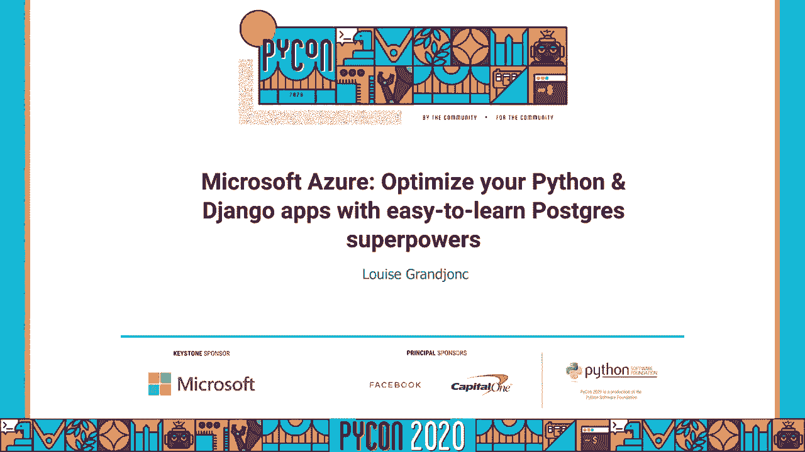


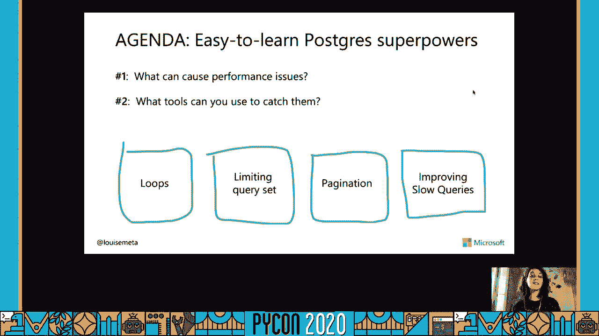


在本教程中，我们将学习如何优化你的Python和Django应用程序，特别是利用Postgres数据库的强大功能。我们将探讨导致性能问题的常见原因、识别问题的工具，并通过四种典型场景来学习具体的优化策略。

## 性能问题的根源与识别工具

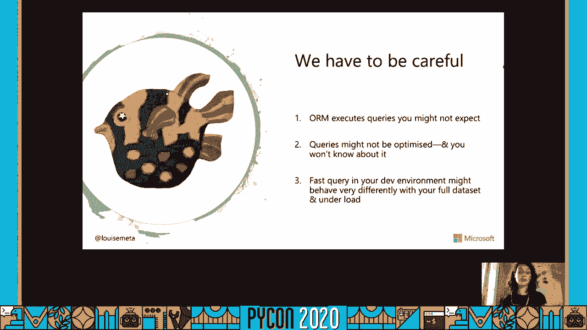


上一节我们介绍了课程概述，本节中我们来看看为什么会出现性能问题以及如何发现它们。

使用ORM（对象关系映射）可以快速构建应用程序，但也可能导致性能问题。ORM可能执行你未预料到的查询。如果你不检查日志，就不会知道这些查询的存在。查询可能未经优化。如果你只查看Python代码，你不会知道数据库层面发生了什么。开发环境中的快速查询，在数据量巨大或高负载的生产环境中可能表现迥异。

那么如何防止这种情况呢？Postgres的超能力如何帮助你？

以下是识别性能问题的三个核心工具：

1.  **pg_stat_statements**
    这是Postgres的一个扩展，用于跟踪服务器上执行查询的统计信息。它将查询保存到一个表中，并告诉你查询执行的次数和速度。建议在生产环境和开发环境中都启用它。你可以通过PostgreSQL配置文件来调整要跟踪的查询数量。在云服务（如Azure Database for PostgreSQL）中，此扩展通常默认安装。

    使用示例：你可以执行类似 `SELECT * FROM pg_stat_statements ORDER BY total_time DESC LIMIT 100;` 的查询来找出最慢的100个查询。Azure的“查询性能洞察”工具就基于此扩展，它能提供创建索引或删除冗余索引等性能建议。

2.  **Django Debug Toolbar**
    这个工具可以列出在模板和视图中执行的所有查询，并提供查询的执行计划（EXPLAIN）。它还能帮助追踪查询在代码中的来源。**注意：** 应仅在调试模式（`DEBUG = True`）下使用，切勿在生产环境中启用。

3.  **Postgres 日志**
    当你的环境复杂（如多语言应用）或使用AJAX/React调用API时，Django Debug Toolbar可能无法捕获所有查询，此时Postgres日志更为有用。

    配置Postgres日志需要修改以下设置：
    ```sql
    log_statement = 'all'
    log_duration = 0
    logging_collector = on
    ```
    **注意：** 在开发环境中可以记录所有查询，但在生产环境中应谨慎使用，避免日志文件过大。

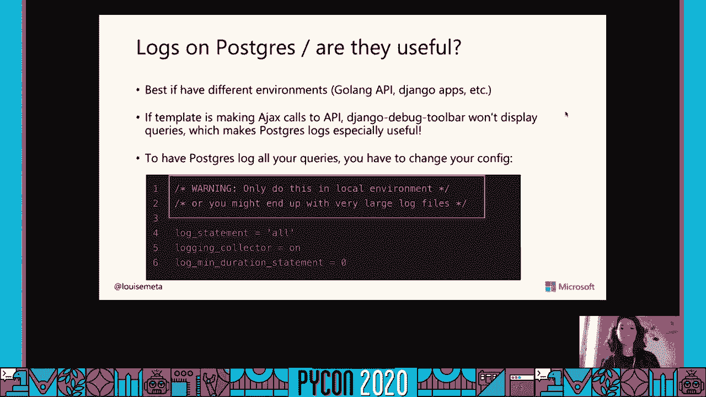

## 场景一：避免N+1查询循环 🔄


上一节我们介绍了识别问题的工具，本节中我们来看看第一个常见性能陷阱：循环导致的N+1查询问题。

循环通常是性能问题的根源。我们将通过一个示例应用来演示。该应用包含公司（Company）、员工（Employee）、活动（Campaign）和广告（Ad）等模型。员工可以查看其所属公司的活动列表。

以下是活动列表视图的初始代码：
```python
# 初始视图，存在N+1问题
def campaign_list_view(request):
    campaigns = Campaign.objects.filter(company=request.user.employee.company)
    return render(request, 'campaign_list.html', {'campaigns': campaigns})
```
对应的模板中，循环遍历每个活动并显示其广告：
```html

    <h2>{{ campaign.name }}</h2>
     <!-- 这里每次循环都会产生一次数据库查询 -->
        <a href="{{ ad.url }}">{{ ad.name }}</a>
    

```
使用Django Debug Toolbar检查，会发现执行了96个类似的查询（假设有96个活动）。这是因为在模板循环中，`campaign.ad_set.all` 为每个活动都执行了一次独立的数据库查询。

**解决方案：使用 `prefetch_related`**
`prefetch_related` 用于优化“一对多”或“多对多”关系的查询。它通过单独的查询预先获取相关对象，然后在Python中进行“连接”，从而将多次查询减少为两次。

优化后的视图代码如下：
```python
# 优化后的视图，使用prefetch_related
def campaign_list_view(request):
    campaigns = Campaign.objects.filter(
        company=request.user.employee.company
    ).prefetch_related('ad_set') # 预先获取所有相关广告
    return render(request, 'campaign_list.html', {'campaigns': campaigns})
```
优化后，查询数量从约100个减少到6个。在生产环境中，循环问题会非常严重，务必在开发阶段通过检查查询来避免。

## 场景二：限制查询字段 📊

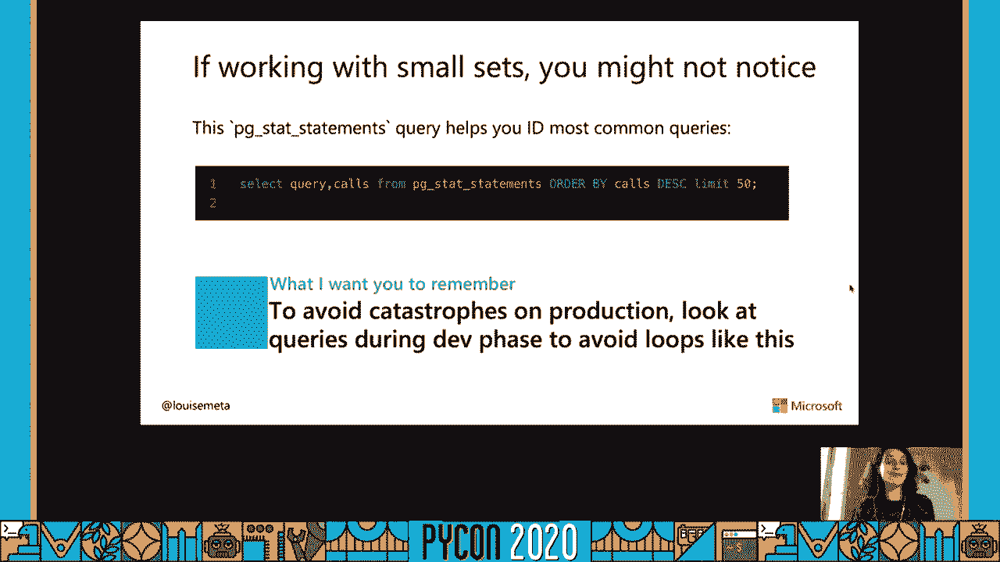


上一节我们解决了循环查询问题，本节中我们来看看如何通过限制查询字段来进一步提升性能。

Django ORM默认会查询所有列（`SELECT *`）。但在许多情况下，我们只需要部分字段。查询不必要的列（尤其是大文本字段）会拖慢查询速度并消耗更多内存。

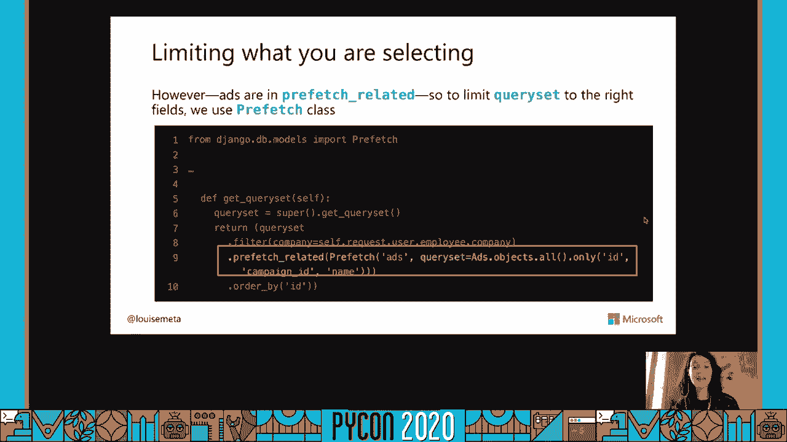

在之前的例子中，即使我们只需要广告的`id`和`name`，查询仍然获取了所有列。我们可以使用`only()`或`defer()`方法来限制字段，但更优雅的方式是在使用`prefetch_related`时配合`Prefetch`对象进行精细控制。


优化示例如下：
```python
from django.db.models import Prefetch

def campaign_list_view(request):
    # 使用Prefetch对象，指定只获取广告的id和name字段
    ads_prefetch = Prefetch(
        'ad_set',
        queryset=Ad.objects.only('id', 'name', 'campaign_id')
    )
    campaigns = Campaign.objects.filter(
        company=request.user.employee.company
    ).prefetch_related(ads_prefetch)
    return render(request, 'campaign_list.html', {'campaigns': campaigns})
```
这样，查询广告的SQL语句将变为 `SELECT id, name, campaign_id FROM ads WHERE ...`，从而减少了数据传输量。

## 场景三：高效分页 📄

上一节我们优化了单次查询，本节中我们来看看当数据量巨大时，如何通过高效分页来提升页面加载速度。

当公司拥有上百万个活动时，一次性加载所有数据会导致页面极其缓慢。分页将数据分成多个页面加载，是解决此问题的关键。

Django内置了`Paginator`类。基本用法如下：
```python
from django.core.paginator import Paginator

def campaign_list_view(request):
    campaign_list = Campaign.objects.filter(company=request.user.employee.company).order_by('id')
    paginator = Paginator(campaign_list, 25) # 每页25条
    page_number = request.GET.get('page')
    page_obj = paginator.get_page(page_number)
    return render(request, 'campaign_list.html', {'page_obj': page_obj})
```
然而，传统的`OFFSET/LIMIT`分页（`Paginator`默认使用）存在两个问题：
1.  **`COUNT(*)` 查询慢**：为了计算总页数，`Paginator`会执行`COUNT(*)`，在数据量大时非常慢。
2.  **`OFFSET` 效率低**：`OFFSET 1000000 LIMIT 20` 意味着数据库需要先扫描并跳过前100万行，再返回20行。页码越靠后，速度越慢。

**解决方案：键集分页（Keyset Pagination）**
键集分页不依赖`OFFSET`，而是利用索引字段（如`id`）进行过滤。例如，获取第一页后，记录最后一行的`id`为20，那么第二页的查询条件就是 `WHERE id > 20 LIMIT 20`。这种方式效率极高。

在Django中，可以使用第三方库 `django-keyset-pagination` 来实现：
1.  安装：`pip install django-keyset-pagination`
2.  在视图中使用：
```python
from keyset_pagination import KeysetPaginator

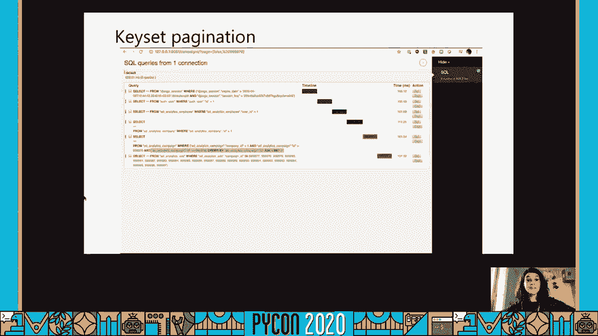

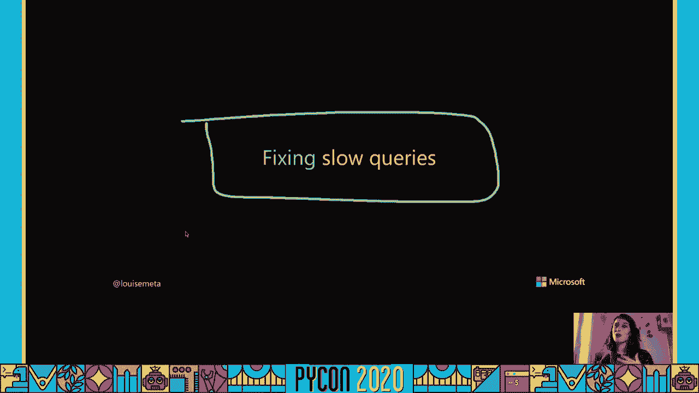

def campaign_list_view(request):
    campaign_list = Campaign.objects.filter(company=request.user.employee.company).order_by('id')
    paginator = KeysetPaginator(campaign_list, per_page=25)
    page_obj = paginator.get_page(request)
    return render(request, 'campaign_list.html', {'page_obj': page_obj})
```
使用键集分页后，不再需要`COUNT`查询，并且翻页速度稳定，不受页码影响。

## 场景四：分析与优化慢查询 🐌

上一节我们解决了大数据集的分页问题，本节中我们来看看如何分析和优化具体的慢查询。

我们可以使用`pg_stat_statements`找到慢查询。例如，发现一个查询：`SELECT * FROM campaigns WHERE archived = FALSE AND company_id = ?` 执行缓慢。

使用Postgres的`EXPLAIN`命令分析该查询：
```sql
EXPLAIN ANALYZE SELECT * FROM campaigns WHERE archived = FALSE AND company_id = 1;
```
分析结果可能显示“Seq Scan”（顺序扫描，即全表扫描），这表明缺少合适的索引。

**创建部分索引（Partial Index）**
如果`archived=FALSE`是常用过滤条件，可以为其创建部分索引，只索引需要的行，效率更高。
在Django中可以通过迁移文件创建：
```python
# 在Campaign模型的Meta类中
class Meta:
    indexes = [
        models.Index(
            fields=['company', 'archived'],
            condition=models.Q(archived=False),
            name='idx_campaign_active_for_company'
        )
    ]
```
或者使用原始SQL：
```sql
CREATE INDEX idx_campaign_active_for_company ON campaigns (company_id) WHERE archived = FALSE;
```
创建索引后，查询速度会显著提升。

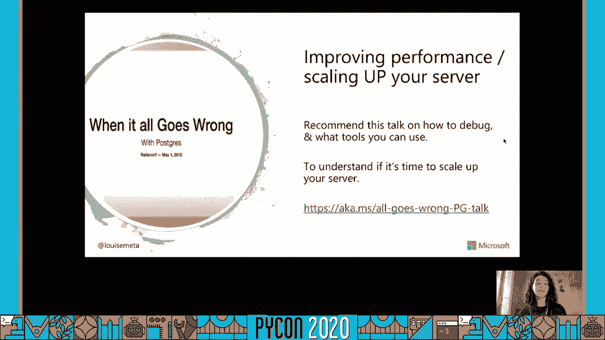


**何时考虑扩展硬件（Scaling Up）**
如果代码和索引都已优化，但性能仍然随着数据量或流量增长而下降，可能是硬件资源（CPU、内存、磁盘）达到瓶颈。此时需要考虑垂直扩展（升级服务器硬件）。

**何时考虑水平分片（Scaling Out）**
当单个数据库节点无法容纳数据（如TB/PB级）时，需要考虑水平扩展。**Citus** 是PostgreSQL的一个开源扩展，它可以将数据和查询分布到多个节点（分片）上。对于多租户应用尤其有效。使用Citus后，应用层几乎无需修改，只需连接至Citus协调器节点即可。

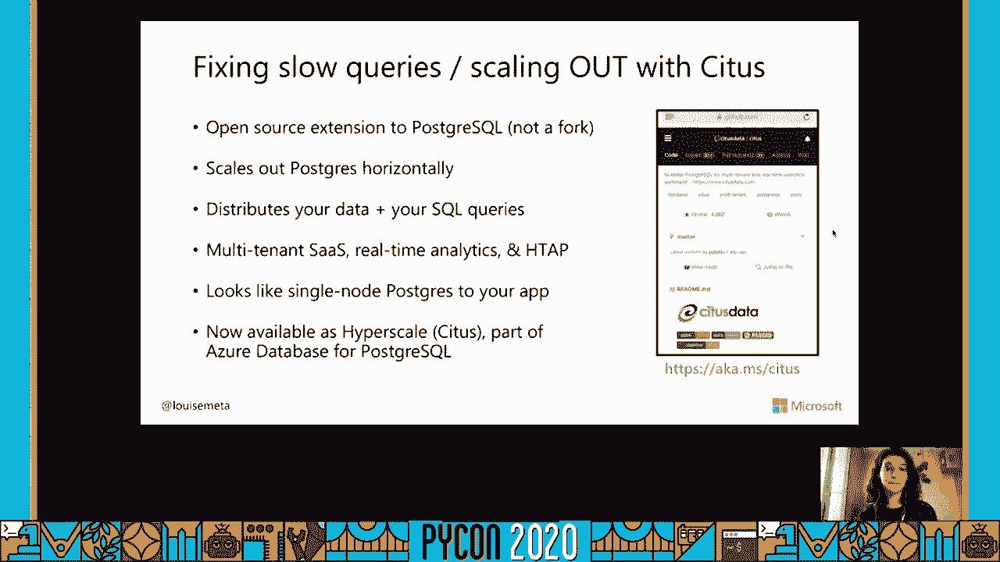

## 总结与核心要点 🎯

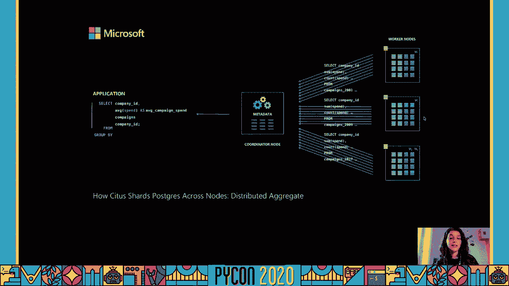


本节课中，我们一起学习了利用Postgres优化Python和Django应用的全过程。以下是需要记住的八个核心要点：

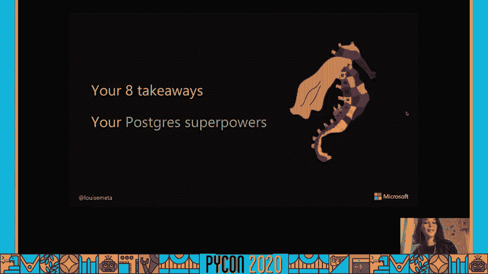

1.  **使用 `pg_stat_statements`**：在生产环境中启用，用于发现慢查询和高频查询。
2.  **善用 Django Debug Toolbar**：在开发时检查查询数量和来源，但注意其局限性。
3.  **配置 Postgres 日志**：始终在开发环境中打开查询日志，全面审视所有数据库交互。
4.  **警惕 N+1 查询循环**：务必使用 `select_related` 和 `prefetch_related` 来优化关联查询。
5.  **主动限制查询字段**：不要依赖ORM的默认`SELECT *`，使用 `only()`、`defer()` 或 `Prefetch` 对象精确控制。
6.  **采用高效的键集分页**：对于大数据集，放弃传统的 `OFFSET/LIMIT` 分页，改用键集分页以获得稳定性能。
7.  **深入理解并创建合适索引**：学习Postgres的索引类型（B-tree, GiST, SP-GiST, GIN, BRIN），并考虑使用部分索引等高级特性。
8.  **适时进行扩展**：优化达到瓶颈后，考虑垂直扩展（升级硬件）或水平扩展（使用如Citus这样的分片方案）。

通过应用这些策略，你可以显著提升应用的数据库性能，为用户提供更流畅的体验。

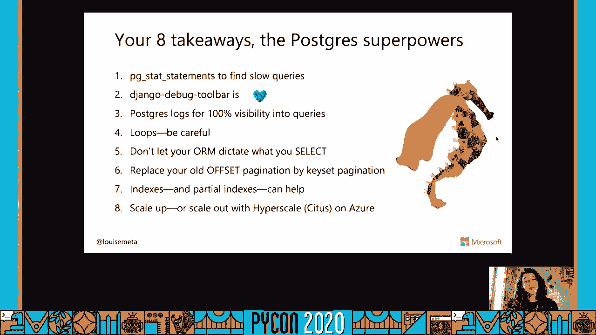


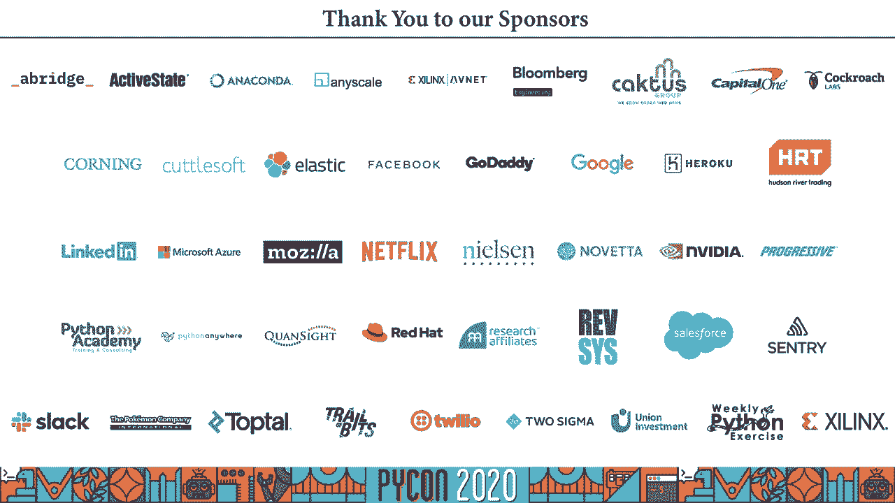

