# 016：使用Crypten进行安全多方计算


## 概述
在本节课中，我们将学习如何使用加密技术在多方之间安全地训练机器学习模型，而无需共享任何一方的原始敏感数据。我们将重点介绍一个名为Crypten的框架，它基于安全多方计算技术，允许我们在加密数据上执行计算。

---

## P16：1：机器学习与数据隐私挑战

机器学习模型通过从大量示例中学习模式来工作。例如，一个区分猫和狗的模型会查看许多带有标签的图片，并调整其内部参数以识别特征。

为了训练一个好的模型，通常需要大量数据。可以想象，如果许多宠物爱好者聚集在一起贡献猫狗图片，就能训练出优秀的模型。

然而，在涉及敏感数据的场景中，这种方法效果不佳。例如，三家医院希望联合训练一个模型来更好地理解某种疾病。但每家医院都拥有不能与其他医院共享的敏感患者数据，这使得联合训练一个好的模型变得困难。

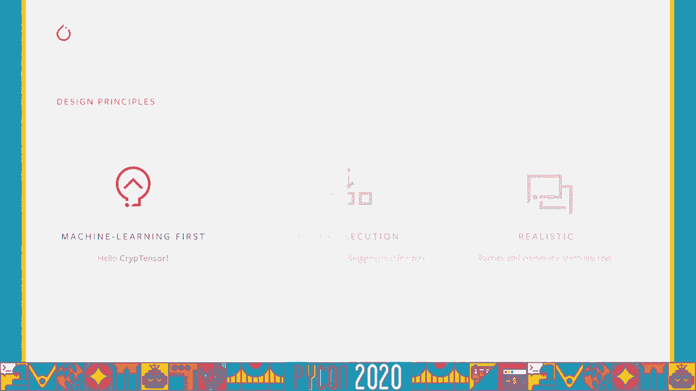

幸运的是，密码学中有一个名为**安全多方计算**的子领域，专门研究如何在多个参与方之间计算一个函数，同时保证各方原始输入数据的安全。

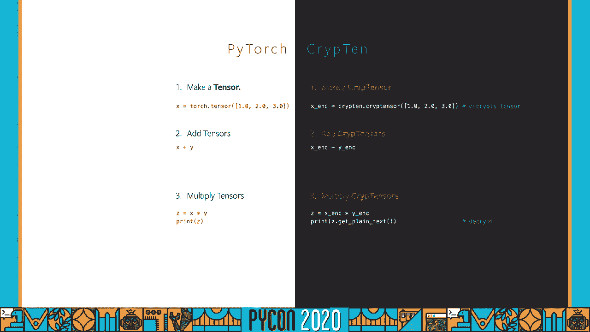

**安全多方计算示例**：
假设三个参与方拥有数字 `3`、`4` 和 `2`。安全多方计算允许我们计算它们的和 `9`，而无需向任何一方透露其他方的原始输入（`3`、`4`、`2`）。

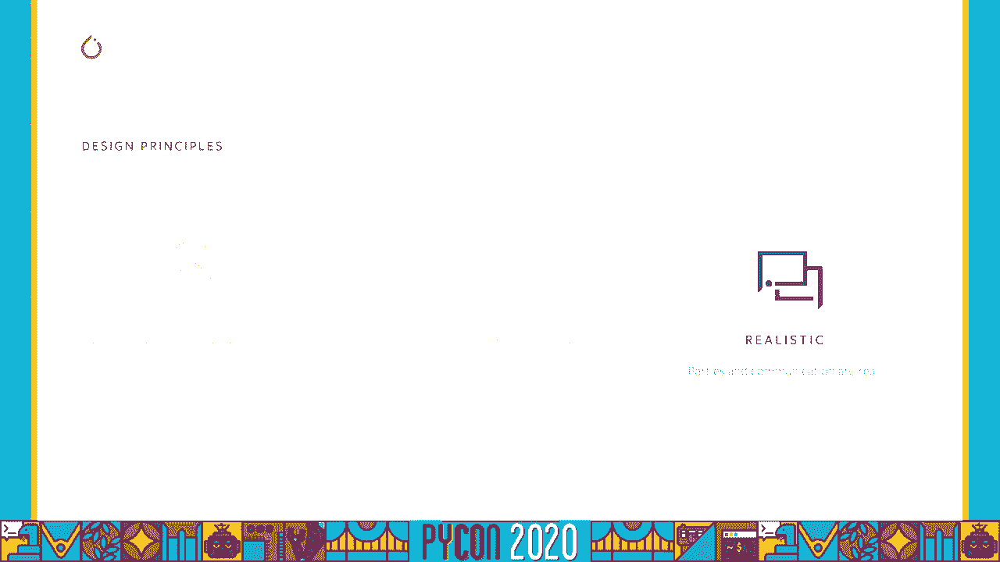

这为解决医院系统联合训练模型而不暴露患者数据的问题提供了可能。

---

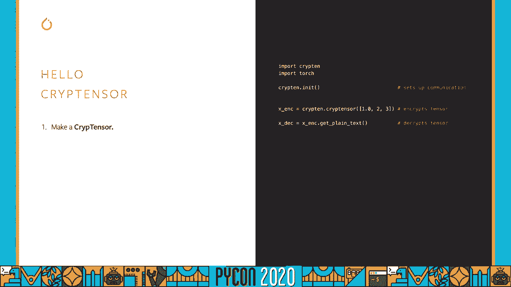

## P16：2：Crypten框架介绍 🛡️

得益于相关研究人员的辛勤工作，我们现在有了Crypten这样一个框架来实现加密计算。该框架旨在连接机器学习和密码学两个社区，因此它需要具备易用的语法。

我们希望框架的语法与流行的机器学习库（如PyTorch）相似，以降低学习成本。同时，框架需要支持简单的调试和实验，因此它采用Python编写并强调强执行力。此外，框架需要模拟真实场景中各方之间的通信方式。

---

## P16：3：Crypten基础：加密张量

现在让我们开始实际操作。在Crypten的世界里，核心概念是**加密张量**。

创建一个加密张量非常简单。以下代码展示了基本操作：

```python
import crypten

# 初始化通信（模拟多方设置）
crypten.init()

# 创建加密张量
x = crypten.cryptensor([1, 2, 3])
print(“加密张量 x:”, x) # 输出是加密的随机数，不是原始值

# 解密以查看原始输入
plain_text_x = x.get_plain_text()
print(“解密后的 x:”, plain_text_x) # 输出: [1, 2, 3]
```

如你所见，语法与PyTorch的`torch.tensor`非常相似。当你打印加密张量`x`时，看到的是一堆随机数，而不是原始的`[1, 2, 3]`。只有调用`.get_plain_text()`方法时，才能获取解密后的原始值。

让我们创建另一个加密张量并进行运算：

```python
y = crypten.cryptensor([4, 5, 6])

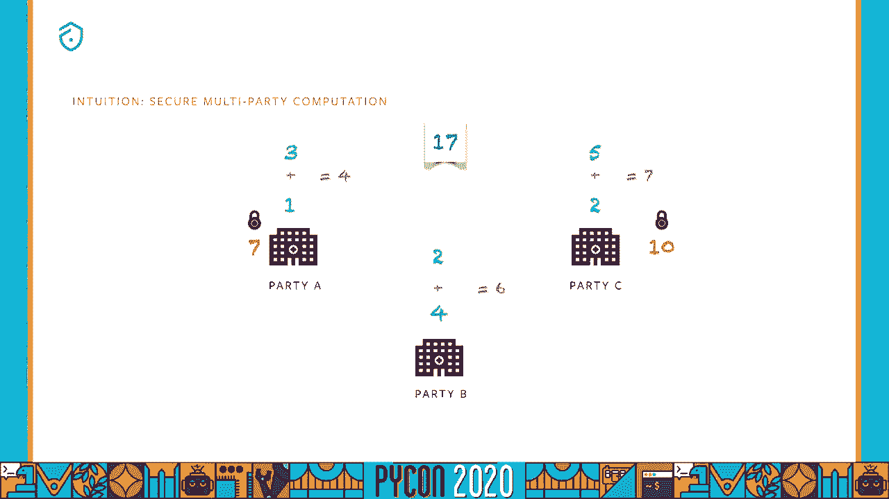

# 加法运算
result_add = x + 2
print(“x + 2 的解密结果:”, result_add.get_plain_text()) # 输出: [3, 4, 5]

# 两个加密张量相加
result_sum = x + y
print(“x + y 的解密结果:”, result_sum.get_plain_text()) # 输出: [5, 7, 9]
```

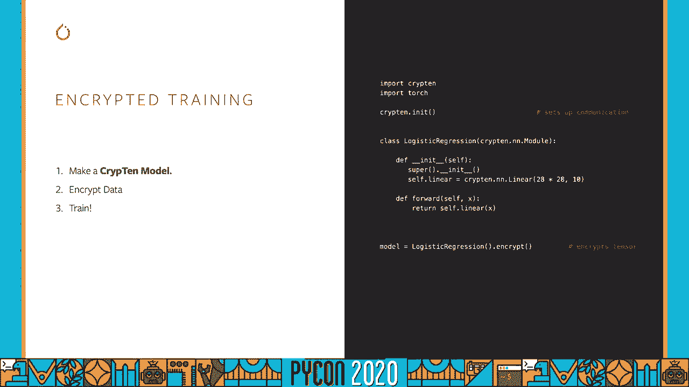

在整个计算过程中，所有值都保持加密状态，直到我们显式地调用解密方法。

除了加法，Crypten还支持更多复杂操作，如点积、对数、softmax等。框架在很大程度上模仿了PyTorch的API。

**计算示例：均方误差损失**
```python
# 计算加密数据上的均方误差
diff = y - x
squared = diff ** 2
mse_loss = squared.mean()
print(“加密计算出的MSE损失:”, mse_loss.get_plain_text()) # 输出: 9.0

# 与纯文本PyTorch计算对比
import torch
x_plain = torch.tensor([1., 2., 3.])
y_plain = torch.tensor([4., 5., 6.])
mse_plain = ((y_plain - x_plain) ** 2).mean()
print(“纯文本计算出的MSE损失:”, mse_plain) # 输出: tensor(9.)
```
可以看到，加密计算与纯文本计算的结果完全一致。

---

## P16：4：安全多方计算原理简述

上一节我们使用了加密张量，现在我们来简单了解其背后的安全多方计算原理。

假设有两个参与方：Alice拥有数字 `7`，Bob拥有数字 `10`。他们想计算总和，但不想让对方知道自己的具体数字。

**加密过程（以Alice的数字7为例）**：
1.  Alice生成两个随机数，例如 `2` 和 `4`。
2.  她将这两个随机数分别秘密发送给Bob和另一个假设的第三方Charlie。
3.  Alice自己保留剩余部分：`7 - (2 + 4) = 1`。
4.  现在，Alice持有份额 `1`，Bob持有份额 `2`，Charlie持有份额 `4`。单独看每个份额，都无法得知原始数字 `7`。

Bob用同样的流程加密他的数字 `10`。

**安全求和过程**：
当需要计算 `7 + 10` 时，各方只需将自己持有的对应份额相加：
-   Alice计算：`1 + (Bob加密10时Alice得到的份额)`
-   Bob计算：`2 + (Alice加密7时Bob得到的份额)`
-   Charlie计算：`4 + (双方加密时Charlie得到的份额)`

然后他们将这三个结果公开相加，得到最终和 `17`。在整个过程中，没有任何一方直接暴露自己的原始输入 `7` 或 `10`。

乘法运算则使用一种名为 **Beaver Triple** 的协议，原理类似但更复杂一些。

---

## P16：5：在Crypten中定义与训练模型

了解了基础原理后，我们来看看如何在Crypten中定义和训练模型。其步骤与PyTorch非常相似。

以下是定义一个简单的加密模型（逻辑回归）的示例：

```python
import crypten.nn as cnn

class EncryptedLR(cnn.Module):
    def __init__(self):
        super(EncryptedLR, self).__init__()
        # 使用Crypten的线性层，而非torch.nn.Linear
        self.fc = cnn.Linear(28*28, 10) # 输入28x28图像，输出10个类别

    def forward(self, x):
        x = x.view(-1, 28*28) # 展平图像
        x = self.fc(x)
        return x
```

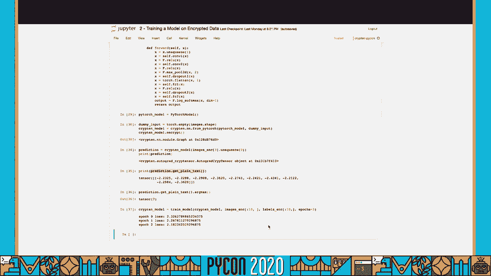

接下来，我们将通过一个交互式教程，学习如何在加密的MNIST手写数字数据集上训练模型。

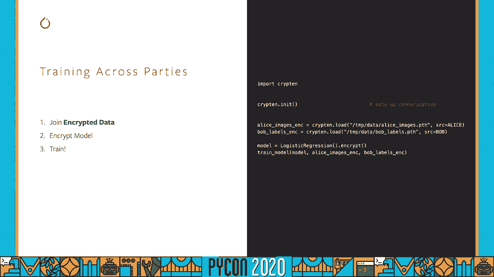

**准备工作：加载并加密数据**
```python
# ... 加载MNIST数据，获得图像和标签 ...
# 假设 `images` 和 `labels` 已加载

# 加密数据
encrypted_images = crypten.cryptensor(images)
encrypted_labels = crypten.cryptensor(labels, src=0) # 指定标签来源

print(“加密图像（看到的都是随机数）:”, encrypted_images)
```

**训练循环**
训练循环的结构与PyTorch几乎相同：
```python
model = EncryptedLR()
model.encrypt() # 加密模型参数

criterion = cnn.CrossEntropyLoss()
optimizer = crypten.optim.SGD(model.parameters(), lr=0.01)

for epoch in range(10):
    optimizer.zero_grad()
    output = model(encrypted_images)
    loss = criterion(output, encrypted_labels)

    loss.backward()
    optimizer.step()

    # 监控损失（需要解密）
    print(f”Epoch {epoch}, Loss: {loss.get_plain_text().item()}”)
```
训练完成后，我们可以使用模型进行加密预测，并在需要时解密查看结果。

---

## P16：6：多方联合训练实战

现在，让我们回到最初的挑战场景：数据分布在多方。例如，Alice拥有所有图像，Bob拥有所有对应的标签。他们希望联合训练一个模型，但Alice不能看到标签，Bob也不能看到图像。

以下是模拟这一过程的步骤：

**步骤1：各方保存加密数据**
```python
import crypten
from crypten import mpc

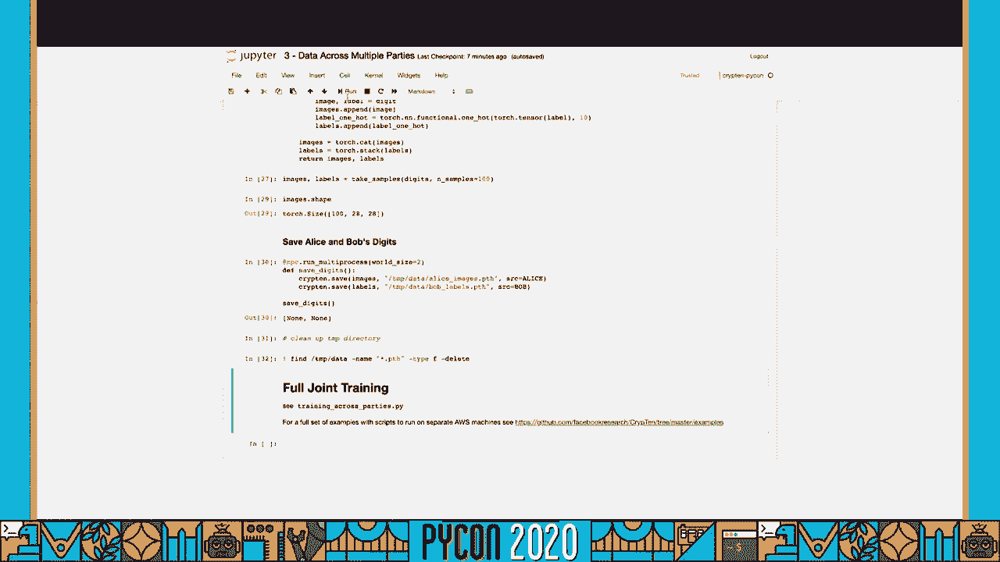

@mpc.run_multiprocess(world_size=2)
def save_encrypted_data():
    # 进程0代表Alice
    if crypten.comm.get().get_rank() == 0:
        alice_data = torch.tensor([1, 2, 3])
        crypten.save(alice_data, ‘alice_data.pth’, src=0) # src=0 表示数据归Alice所有
    # 进程1代表Bob
    else:
        bob_data = torch.tensor([4, 5, 6])
        crypten.save(bob_data, ‘bob_data.pth’, src=1) # src=1 表示数据归Bob所有

save_encrypted_data()
```
保存后，`alice_data.pth` 和 `bob_data.pth` 文件中存储的是加密后的数据。

**步骤2：加载加密数据进行联合训练**
各方加载属于自己的加密数据，然后共同执行训练脚本。训练过程中，加密的图像和加密的标签在加密状态下进行计算，模型参数也保持加密更新。任何一方都无法从中间数据推断出另一方的原始信息。

Crypten的GitHub仓库中提供了完整的端到端示例脚本，展示了如何在模拟的或多台真实机器上运行这种联合训练。

---

## 总结

在本节课中，我们一起学习了如何使用Crypten框架进行安全的加密机器学习计算。

我们首先了解了在隐私敏感场景下联合训练模型所面临的挑战。接着，我们介绍了**安全多方计算**这一密码学解决方案的核心思想。然后，我们深入探讨了Crypten框架，学习了如何创建和操作**加密张量**，其语法与PyTorch高度相似。

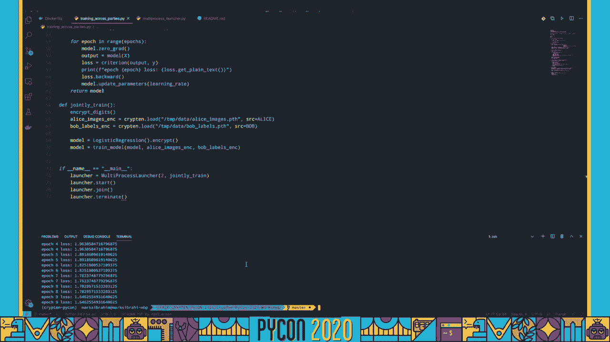


我们通过实例演示了如何在加密数据上定义模型、执行训练循环并进行预测。最后，我们模拟了数据分布在Alice和Bob两方时，如何进行**联合训练**，确保在整个过程中，各方的原始数据始终保持加密和私密状态。

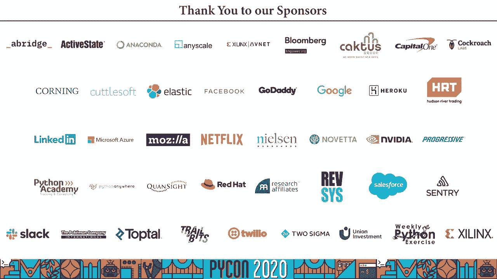

通过Crypten，我们能够在保护数据隐私的前提下，利用多方数据的力量来构建更强大的机器学习模型。