# 017：Sponsor Workshop Xilinx, Inc. Patrick Lysaght

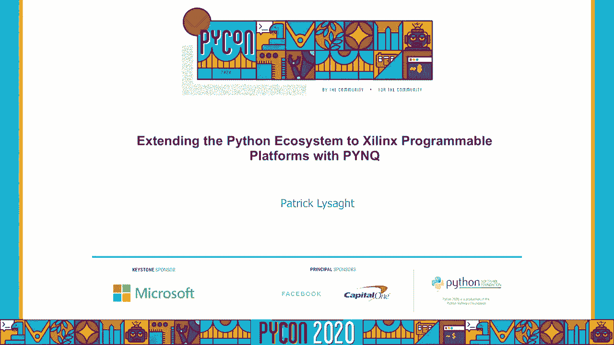

在本教程中，我们将学习如何利用开源框架Pynq，将Python生态系统扩展到Xilinx的可编程平台。我们将探讨Pynq如何让Python开发者、数据科学家和硬件工程师能够轻松地在集成了ARM处理器和FPGA的Zynq系统级芯片上进行开发与创新。

## 1：平台演进与动机 🚀

上一节我们介绍了本教程的主题。本节中，我们来看看推动Pynq框架发展的平台演进趋势。

本次回顾并非全面，但旨在突出过去十年中的一些主要趋势。最大的趋势之一是树莓派的兴起。树莓派是典型的功能强大的ARM微处理器，部署在小型嵌入式开发板上。其新颖之处在于微处理器现已足够强大，可以运行完整的桌面Linux系统和庞大的软件栈。这意味着我们可以在目标设备上进行开发，无需交叉编译或交叉调试，因此开发过程更简单、更快速。

相比之下，Arduino是另一种现象，它针对更底层的软件栈，部署更接近硬件。Arduino通常用于控制传感器或读取传感器数据，以及控制电机或执行器。Arduino的微控制器侧重于底层操作，可被描述为“位敲击”设备。

我们考虑的第三类是FPGA。FPGA增加了一个新的维度。FPGA不是冯·诺依曼架构。FPGA代表现场可编程门阵列，意思是用户或客户可编程的逻辑门集合。其区别在于用户可以针对目标应用定义所需的架构。这允许开发出高度并行、高度优化的快速解决方案，并提供了另一种程度的创新。

所有这些平台经常被单独使用，但也越来越多地结合在一起。对于更复杂、更具挑战性的项目，拥有多个平台供你使用是非常有利的。

为了展示这一趋势的一个例子，这里有一个树莓派。在底层是树莓派板，拥有强大的ARM微处理器，可以运行完整的Linux和庞大的软件栈。在最上层，通过HAT扩展板，我集成了一个FPGA，可以在其中设计定制解决方案来解决我关注的问题。这可以带来巨大的差异化、高性能和独特性，使我的项目或产品脱颖而出。因此，这些不同平台的结合使用越来越普遍，这体现在更高性能和更具创新性的解决方案中。

在进一步讨论之前，我将花一点时间回顾FPGA的工作原理，因为并非所有Python程序员都同样熟悉它们。这张图从概念上很好地表达了FPGA的工作原理。本质上，FPGA有两个“平面”。上层是配置存储器，下面的平面是逻辑电路。如果上层平面未初始化，那么下面的电路实际上没有配置，不可用。然而，如果我们对配置存储器进行编程，并在其中放入一个比特流，我们就可以确定逻辑平面上提供的电路。在这种情况下，你可以看到这种确定性模式：我们配置了一个电路，逻辑平面上的电路就准备就绪。这就是FPGA的美妙之处：通过简单地改变SRAM存储器中的位，我们现在可以在逻辑平面上实现不同的电路。从前这些都是小电路，但现在你可以在逻辑平面上拥有数百万个门，因此可以在FPGA上构建非常复杂的电路，这只会进一步增强其能力。

例如，在许多计算机体系结构课程中，学生可以更深入地了解流水线或架构的工作原理，并首次体验构建自己的处理器、编写自己的汇编代码和更高级语言代码的过程。

现在我们已经讨论了三种环境：Arduino、树莓派和FPGA。想象一下，如果我们能拥有世界上最好的部分。想象一下，如果我们能把所有这些设备组合成一个系统级芯片。这就是我们在左边所描绘的。这张图显示了Arduino、树莓派模型和FPGA集成在一个设备中。除此之外，还有可编程的输入和输出，以及两个子系统之间的高速连接。这就是系统级芯片带给我们的能力。

事实上，这种能力现在可以在Xilinx的Zynq可编程平台上使用。这些Zynq设备集成了ARM微处理器、Xilinx FPGA作为高速可编程逻辑、许多软核微控制器以及组件与输入/输出之间的快速互连。我们称这个产品为Xilinx的Zynq-7000系列。现在它不是我们唯一的Zynq系列，这个家族有更大的兄弟Zynq UltraScale+，但为了简单起见，我们将关注Zynq-7000本身。

为了以略有不同的方式强调Zynq可编程平台的优势，这个对照表显示了Zynq可编程平台的本质：它具备树莓派的所有特性、Arduino的能力以及集成的FPGA功能。当然，因为它是一个系统级芯片，所有东西都集成到单一设备中，你还能获得所有额外的好处，例如更低的功耗、更小的尺寸等。

到目前为止，Zynq在市场上非常成功，被用于一系列非常创新的产品中。例如自动驾驶系统和高级驾驶辅助系统、过程控制（尤其是在要求高精度的场景）、高性能无人机、视觉处理和人工智能应用、视频处理、医疗仪器、独特的仪器以及一个非常令人兴奋的领域——远程机器人手术。

看看这些并在此总结一下，例如精密机器人技术。你可以想象，如果你在进行远程机器人手术，你不会想用Arduino，因为你可能会有点紧张。你会希望有专门的电路来确保缝合或其他手术过程精确进行，因为你希望它们是实时的。高分辨率视频处理是另一个主要领域。此外，许多研究小组使用FPGA，因为他们可以设计全新的架构，而无需自己制造芯片。FPGA在教学中也应用广泛，尤其是Zynq，允许在一个设备中教授一系列主题，例如逻辑设计、计算机体系结构、信号处理、数字控制。当然，对于毕业设计项目来说也是巨大的。

随着越来越多的嵌入式应用向边缘计算过渡，出现了更多的Python开发人员和数据科学家，以及硬件和嵌入式软件工程师。这些数据科学家和Python开发人员中的许多人可以从可编程平台中受益，但大多数人对这项技术不熟悉。Pynq框架的第一个目标是让更多的人能够使用Xilinx可编程平台，并利用这项技术，尤其是在边缘设备等应用中。

我们还希望为硬件设计师创造一种利用Python的更高生产力的方法。我们希望这些硬件设计师能更容易地与更多人分享他们的设计。我们希望消除不同利益相关者之间的一些人为障碍或层级，同时鼓励一个更敏捷的环境，在所有利益相关者之间开辟新的渠道，这样每个人都可以直接互动，并通过早期反馈来改进他们的设计。

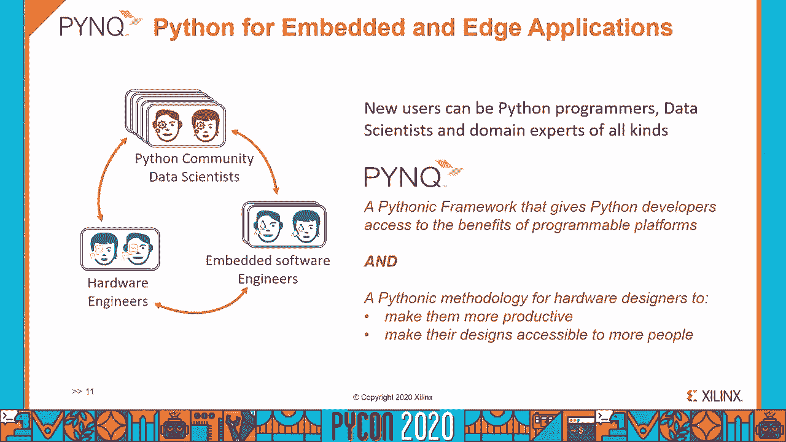

## 2：从开源社区汲取灵感 💡

上一节我们探讨了平台演进的动机。本节中，我们来看看设计Pynq时从开源社区，特别是Python和Jupyter项目中汲取的灵感。

在设计Pynq时，我们向开源社区寻求灵感。例如，我们借鉴了Python的一些重要思想和最佳实践。

过去十年最大的趋势之一是Python语言在开源社区中越来越受欢迎，尤其是在学术界的广泛使用。第二个趋势是将Python用于嵌入式或边缘系统。现在，随着越来越多的嵌入式系统连接到云端，在物联网领域，我们将这些系统称为边缘系统。这张图表由IEEE于2018年7月制作，是他们首次注意到Python被列为嵌入式语言。嵌入式语言通常是C和C++，这些语言几十年来一直主导着嵌入式系统。因此，这是一个重要的认可：Python开始被用于嵌入式和边缘系统。这反映了树莓派的影响，以及连接回云端的边缘系统所需的额外智能。

在边缘和嵌入式系统中使用Python有相当大的好处。据估计，目前全球活跃的Python开发者多达800万。你可以在目标设备上进行开发，正如我们之前提到的，这意味着你不必像使用C和C++那样进行交叉编译和交叉调试。这让设计感觉更简单、更有生产力，结果是更快的迭代周期。Python拥有一个巨大的生态系统和一个非常活跃的社区。Python可以非常有效地与C和C++互操作，以便在嵌入式系统中与它们共存。这为我们带来了敏捷的软硬件协同设计流程的好处。最后，有很多可移植的代码可以在桌面、嵌入式和边缘系统之间重用，这是因为Python在虚拟机上执行。

这就是Python社区的力量以及第三方生态系统。一位Python核心开发者说过一句名言：“我为语言而来，但我为社区而留下。”这些类别中的每一个都有大约40%或更高的复合年增长率。因此，除了Python附带的标准库，PyPI上还有大量的第三方库。所以，你真的可以说，普通的Python开发者站在一个庞大社区的肩膀上。一个巨大的Python社区就像艾萨克·牛顿说的那样：“我看得更远，因为我站在巨人的肩膀上。”

它们实际上并不都是用Python写的，其中许多是用其他语言写的，例如C、C++、Java、Fortran。这是非常值得注意的。Python的主要优点之一是它与其他语言编写的代码接口的效果和频率。这并不完全令人惊讶，既然我们说的是Python，最受欢迎的Python版本当然是用C写的。但这仍然是一个重要的优势。

我们看到Python与其他语言一起使用的例子。通常，Python调用用其他语言编写的代码有两个原因：第一个是重用其他代码，只需将其封装在Python API中；第二个是加速Python代码，其性能通常需要通过使用预编译的C代码来改进。例如，SciPy实际上是用Python和C/Fortran混合编写的。当程序之间共享数据时，尤其是出于性能原因，重要的是避免不必要的复制。Python依赖于它的缓冲区协议，NumPy和数组可以有效地交换数据。这些都是我们在设计Pynq框架时借鉴和重用的想法。

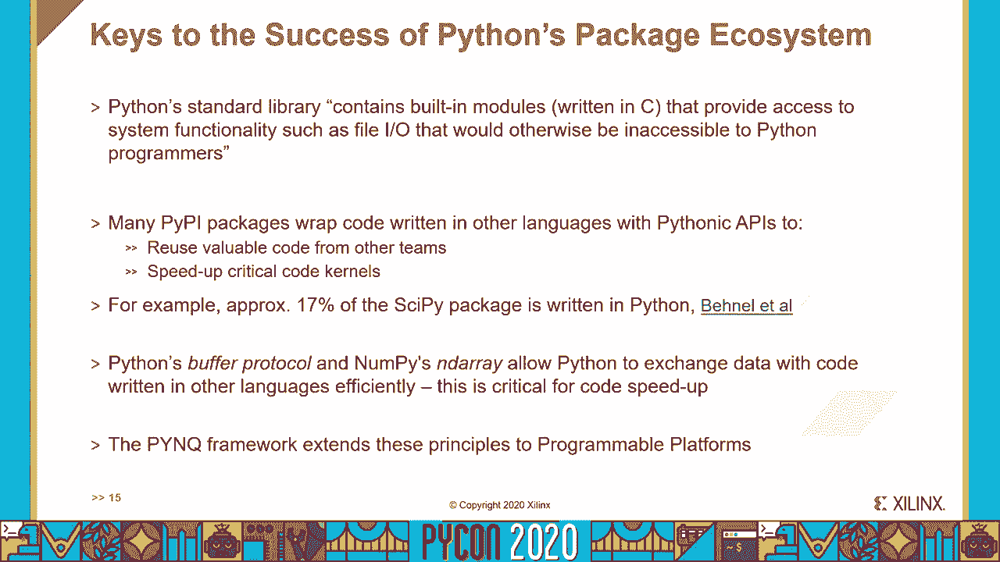

## 3：Jupyter项目的核心作用 📓

上一节我们了解了Python生态系统的力量。本节中，我们来看看过去十年最激动人心的Python项目之一——Jupyter项目，以及它如何成为Pynq架构的核心部分。

正如你将在下一张幻灯片中看到的，Pynq的架构广泛使用了Jupyter。

IPython是交互式Python的简称，是一个项目，最初是为了创造一个更好的REPL（读取-求值-打印循环）。然而，在Mathematica和Sage Mathematics等浏览器界面的影响下，IPython演变成了IPython Notebook。笔记本是网络文档，以及所有其他由现代浏览器支持的富媒体。设计背后的一个关键动机是为了解决科学论文缺乏可重复性的问题，通过提供一种新的可执行、因此可复制的文档。我发现笔记本被证明是一个巨大的成功，并被许多人、许多其他编程语言所采用。因此，它的名字从IPython改为了Jupyter，是Julia、Python和R三种编程语言的缩写。据估计，目前GitHub上大约有700万本笔记本，且使用量呈指数级增长。这项技术每年被教授给成千上万的大学生。

也就是说，许多开发者真的很喜欢Jupyter Notebook，但他们也想要更多他们在常规集成开发环境中熟悉的工具。这促使了JupyterLab的建立。JupyterLab是基于IDE的下一代浏览器界面，由学术界和工业界合作开发。JupyterLab成功的关键之一是开源库，它支持可调整大小的子窗口或窗格。如果我们看左手边的图表，代码编辑器、外壳终端，JupyterLab从设计之初就是可扩展的，每个窗口只是一个插件的实例。因此，开发人员可以在使用更熟悉的IDE工具的同时使用笔记本，使整体价值主张更有说服力。

Jupyter真正的天才在于它的系统架构。它由客户端、服务器和语言内核组成，如图所示。块之间的接口定义良好，并基于开放标准。因为它使用浏览器界面，所以不需要支持很多不同的窗口系统。相反，通过使用浏览器，它受益于可能是世界上最先进和广泛使用的计算机接口。例如，今天Jupyter支持多达100种语言。Jupyter项目被授予2017年ACM软件系统奖，有点像软件系统的诺贝尔奖，TCP/IP、Java和Eclipse也曾获此奖，所以这是一家非常好的公司。

这促使我们思考：如果我们能在可编程平台上运行Jupyter会怎么样？使其成为Pynq框架架构中不可或缺的一部分。消费级和专业产品多年来一直使用内部网络服务器，主要用于托管嵌入式配置门户。网络路由器、激光打印机就是很好的例子，可以通过这些内部网络服务器进行配置。相比之下，JupyterLab通常运行在桌面或服务器类机器上。这里的想法是直接在可编程平台上托管JupyterLab IDE的Web服务器和语言内核。然后，我们可以从任何联网计算机的浏览器在目标设备上进行开发。

这里显示的板子是Pynq-Z2，尤其是Pynq项目。Pynq-Z2具有Zynq可编程平台，它是Jupyter的主机。当然，如你所见，我们为Pynq框架设计了一个Pynq板，为了让开发更有趣。这张幻灯片显示了在Zynq可编程平台上运行的Pynq系统架构。我们在ARM处理器上运行的Linux下运行JupyterLab和IPython内核。然后，我们在可编程逻辑上创建覆盖电路。覆盖层本质上是FPGA上高度可参数化的设计，在概念上与软件库相似。接下来，我们为覆盖创建C驱动程序，并将它们封装在Python API中，就像处理任何其他库一样。注意，所有浏览器都托管在通过网络连接的外部机器上。这种分区还具有将任何图形渲染卸载到更强大的网络计算机的优点。

该体系结构允许直接对目标进行软件开发，多亏了Pynq框架，而且不需要在客户端机器上安装特殊软件，一个现代浏览器就是全部所需。

现在是时候看看Pynq的实际行动了。为了这次演示，我们有一个Pynq-Z2板，其上的Zynq可编程平台通过网络连接到一个带有浏览器界面的客户端。在本片中，我们首先通过网络从浏览器访问Pynq-Z2板。板子的响应是启动JupyterLab页面。这和我们如果在桌面上运行JupyterLab看到的着陆页完全一样。我们要在文件浏览器中选择一个文件夹，我们可以在笔记本上滚动并检查它的输出，就像我们接下来在台式机上一样。

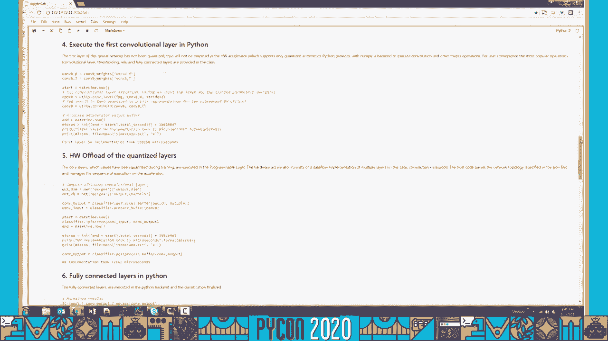

我们打开Linux shell和CPU信息，以确认我们确实是在Zynq设备中的ARM嵌入式微处理器上运行。然后，我们可以执行一个`tree`命令，来检查目标系统上的一些文件。

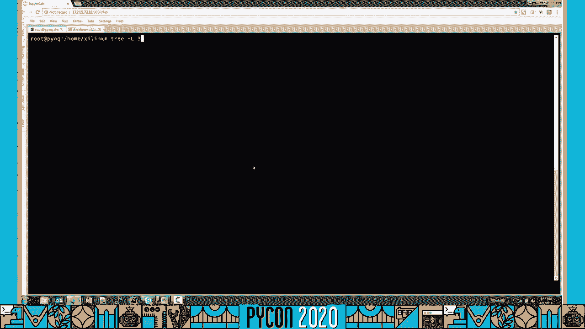

离开终端shell，我们可以查看matplotlib的在线帮助，找到一个雷达图的例子。我们现在可以将示例notebook和Python脚本下载到外部主机（在这种情况下是一台电脑）。我们可以确认我们拿到了新的笔记本和脚本。我们可以简单地将下载的文件拖放到Pynq可编程平台上，在目标上重新打开它们。为了验证我们有笔记本和脚本版本的雷达图库，最后，我们可以在目标上重新执行Python代码，无需编写任何额外的代码。如你所见，JupyterLab IDE在Zynq可编程平台上工作得非常好，已经了解JupyterLab的Python开发者可以立即开始研究Zynq。

接下来让我们更详细地看看Pynq框架。

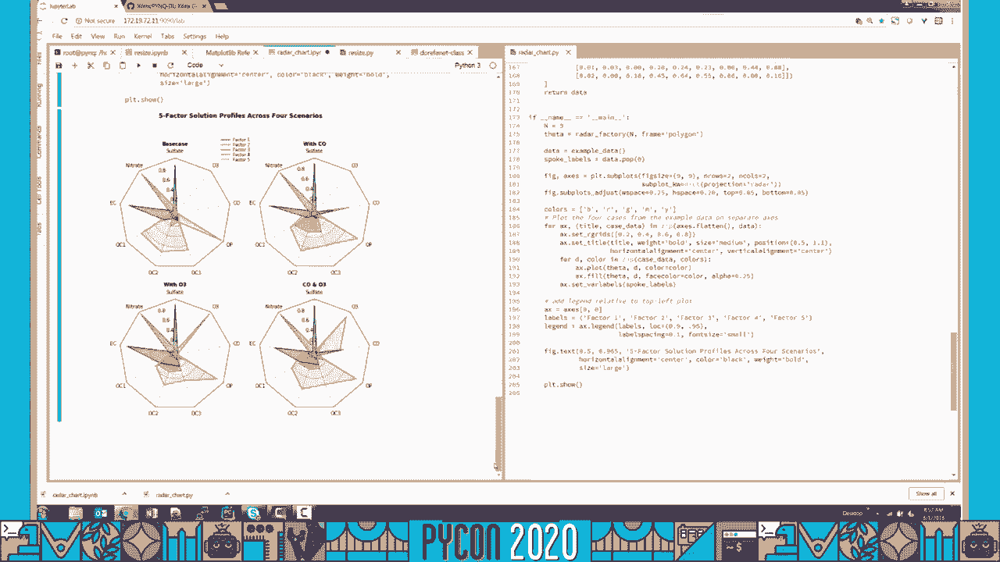

## 4：Pynq框架详解与演示 🛠️

上一节我们看到了Jupyter在Pynq上的运行。本节中，我们将深入探讨Pynq框架的架构，并通过一个图像调整示例来演示其工作流程。

GitHub是一个优秀的Jupyter笔记本存储库，因为它会显示渲染过的笔记本，这很有帮助。我们把它作为我们Pynq框架的一部分。所以在最左边，旁边是一个在硬件中实现的电机控制示例。这是PID控制器电机控制算法。为了训练和推断，最后一个例子是一个OpenCV过滤器，也在硬件中实现。稍后我们将更仔细地观察图像调整器。我们只需一个`pip install`命令就可以做到这一点。这会部署设计到我们目标开发板上的硬件和软件元素。

在这张幻灯片中，我们会看得更详细。当我们开始使用刚从GitHub获取的笔记本时，我们从运行在ARM微处理器上的JupyterLab开始。注意在这一点上，可编程逻辑未配置。所以我们从打开笔记本开始。然后我们继续创建一个覆盖类的实例，参数化地指定要加载到可编程逻辑中的调整大小位流。一旦完成，我们现在就有了FPGA的硬件设计。当然，我们可以运行笔记本，让它控制软件和硬件。有很多细节，但这些是Python开发者或数据科学家需要知道的主要概念。

在这张幻灯片中，我们展示了图像调整器笔记本的两个部分。在左手边，笔记本上显示图像大小的部分是纯粹用软件完成的。而在右手边，调整大小的两个部分显示初始图像和调整大小后的图像。软件唯一的调整大小使用众所周知的Python图像库Pillow。在右手边，我们可以看到可编程平台设计的框图。硬件主要由一个图像调整块、一些缓冲器和一个DMA（直接内存访问）单元组成，用于有效地在DRAM和可编程逻辑之间移动数据。

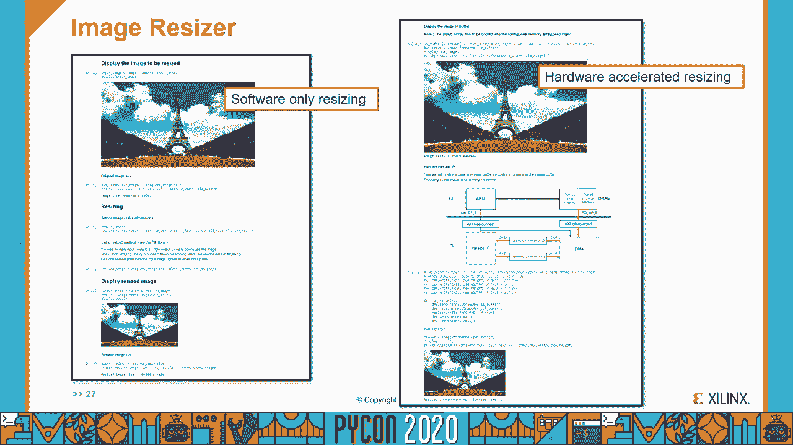

在我们的第二次演示中，我们将显示图像调整大小正在执行，首先作为一个纯粹的Python程序，然后把结果与硬件加速版本进行对比。

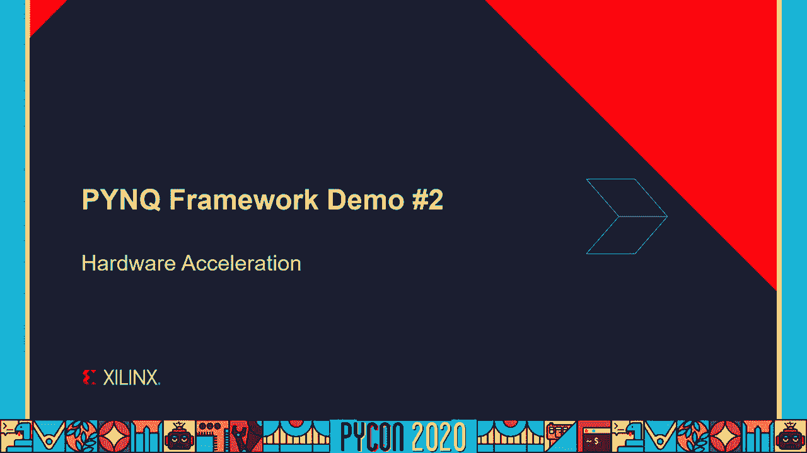

在本片中，我们会下载、安装，然后运行图像调整器。我们首先检查设计是否已经下载。

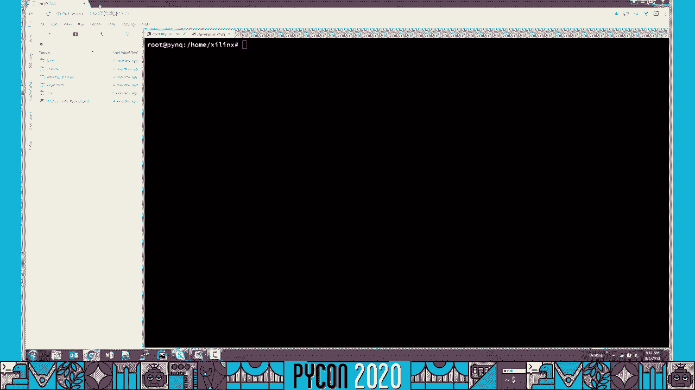

然后我们打开一个新的浏览器窗口，转到Pynq的GitHub仓库。

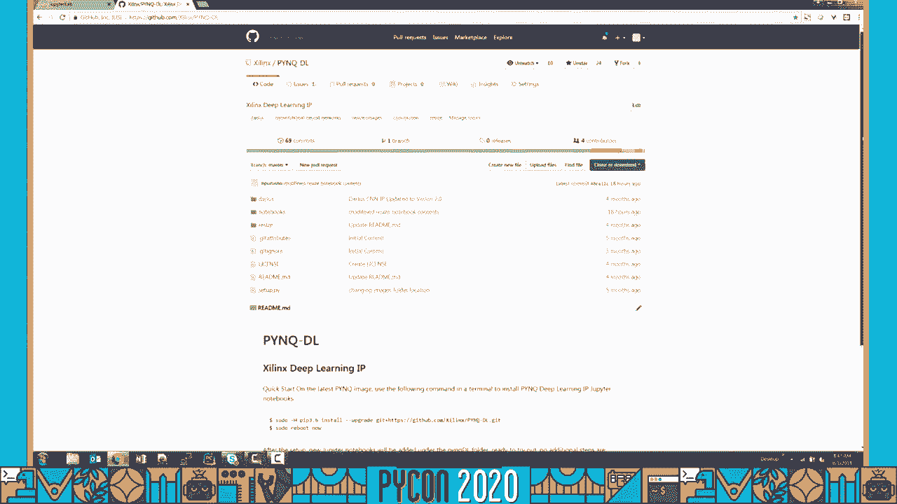

在这里我们得到了`pip install`命令。注意，我们使用的硬件配置与第一个演示中使用的完全相同。为了节省时间，我们缩短了下载时间。我们打开文件夹取出Jupyter笔记本。

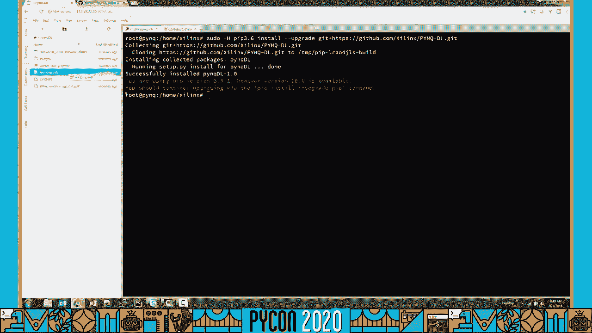

我们之前讨论过，尽管更详细，这种级别的细节完全是可选的。在这里我们可以看到笔记本单元格是相关的。所以我们运行所有的单元格。一旦我们这样做了，我们看到活动状态指示器显示“忙”，指示正在处理。现在我们可以看到调整大小的结果。首先我们看到软件调整大小，然后我们看到硬件调整大小。你可以看到结果是相同的。在这种情况下，我们可以利用`timeit`来测量它在硬件中花费的时间，这大约是四毫秒。对于这个相对简单的例子来说，相对于其软件等价物，它的速度大约提高了三到四倍。

在我们看下一步之前，让我们缩小一会儿来总结一下Pynq能带来什么。Pynq是一个开源框架，由软件和硬件组件组成。它基于Python、JupyterLab、NumPy以及许多其他的Python库。它可以在一系列不同的板子上运行，但我们应该注意到，Pynq本身并不是一块板子，它是管理兼具硬件和软件元素的设计的Python方法开源框架。Pynq还通过消除不同专业知识的开发人员之间协作的不必要障碍，鼓励更敏捷的开发。它允许数据科学家与硬件和嵌入式软件工程师在同一个平台上直接交流与互动。Pynq还通过向更多的Python开发人员提供可编程平台的好处，扩展了Python生态系统。

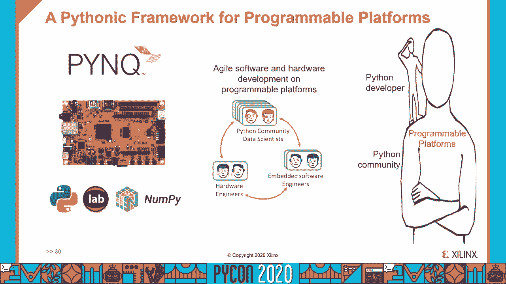

## 5：下一步与总结 🏁

这是演讲的最后一部分，让我们看看下一步，特别是如何开始使用Pynq。

要了解更多，我们建议你去**Pynq官网**，这是Pynq框架的主要位置。我们的**Read the Docs**站点上也有大量的文档。当然，所有我们在这次演讲中分享的硬件和软件设计都是开源的，可在我们的**GitHub**仓库中使用。我们有一个活跃的社区页面，托管在**Discourse**上，在那里你可以提交问题，看看社区里的趋势是什么。要获取受支持的开发板的完整列表，请看Pynq网站主页的相关部分。虽然Pynq始于**Zynq**设备，但它现在可以在一系列的板子上运行，其中一些使用不同类型的可编程平台。并不是所有支持的板子都是Pynq品牌的。在这张幻灯片上，我们在社区网页上展示了一张快照。它以来自世界各地的一系列令人兴奋和新颖的项目为特色，我们鼓励你去看看。

有一件事我们没有谈过，那就是如何设计**FPGA**电路。这是一个有意识的决定，因为这次演讲的重点不是逻辑设计。然而，有一点需要注意：在Pynq中，我们不是用`Python`合成电路。我们展示给你的所有**FPGA**设计都是用**Xilinx Vivado**工具创建的。如果你想了解更多关于设计可编程平台的知识，**Xilinx**使这些**Vivado**设计工具可用，对于Zynq板是免费的。这里的链接可以让你下载软件。也有很多很多好的资源在那里，可以帮助你理解你需要做什么才能成为一个成功的逻辑设计师。

这里有一些非常有用的Pynq资源的链接：Pynq的主页、Read the Docs页面、**GitHub**站点，以及你还可以去哪里买一个Pynq-Z2板。

总结一下，我们已经看到`Python`的流行，以及在嵌入式和边缘系统中的持续增加。我们已经展示了**Zynq**可编程平台如何在一个系统级芯片设备中实现微处理器、微控制器和**FPGA**的所有好处及更多方面。我们分享了开源**Pynq**框架如何让`Python`开发人员可以访问可编程平台，即使只有最少的硬件经验。我们还看到了Pynq是如何让硬件设计师更有效率的，使他们能够与更大的`Python`群体分享他们的设计。最后，Pynq是每个人的，我们邀请你去探索它。我们期待着你将来成为Pynq社区的贡献者。

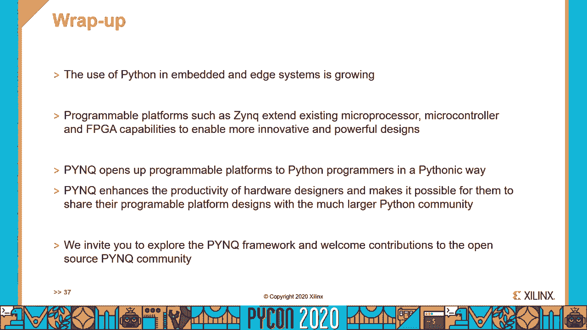

感谢您今天与我们分享您的时间。我希望你觉得关于Pynq框架的讨论很有趣，对你很有价值。我代表Xilinx的所有同事，希望你和亲人平安、健康、快乐。

---

**本节课中我们一起学习了：**
1.  **平台演进**：了解了从树莓派、Arduino到FPGA，再到集成所有功能的Zynq系统级芯片的发展趋势。
2.  **灵感来源**：认识到Python生态系统的强大和Jupyter项目的革命性，它们是Pynq框架设计的思想基石。
3.  **Pynq架构**：掌握了Pynq如何在Zynq平台上集成JupyterLab，允许通过浏览器直接进行软硬件协同开发。
4.  **框架演示**：通过图像调整器的例子，直观地看到了Pynq如何简化硬件加速功能的调用和对比。
5.  **入门指南**：获得了开始使用Pynq所需的资源链接和下一步行动方向。

Pynq框架降低了硬件可编程平台的门槛，为Python开发者打开了通往高性能边缘计算和嵌入式创新的大门。