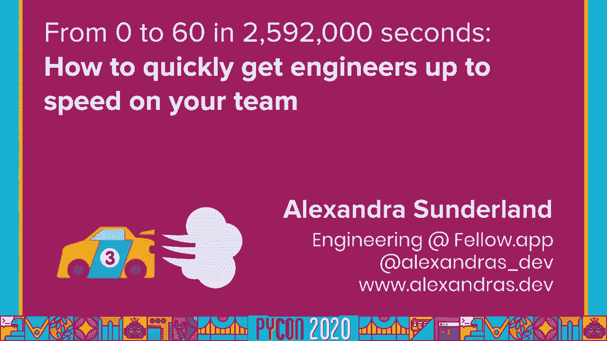
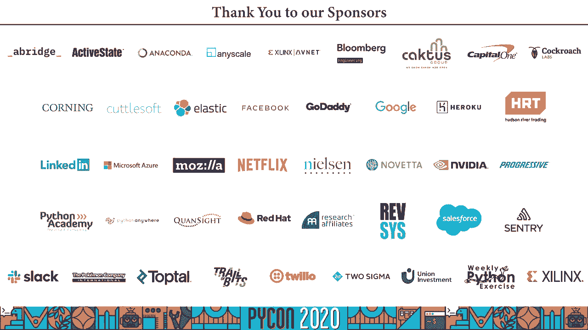

# 019：构建高效的工程师入职流程 🚀


在本节课中，我们将学习如何为你的团队设计和实施一个高效、人性化的工程师入职流程。我们将探讨如何从零开始构建一个框架，确保新成员能够快速融入团队，建立信心，并尽早开始创造价值。

---

## 概述

入职是每位新工程师加入团队的关键第一步。一个设计良好的流程不仅能加速新人的生产力，还能培养积极的团队文化。特别是在远程工作日益普遍的今天，传统的入职方法需要调整以适应新的挑战。本节内容基于多年的实践经验，旨在为你提供一个可操作的框架。

---

## 从个人经历到通用框架

上一节我们概述了课程目标，本节中我们来看看讲师分享的个人经历，这些经历揭示了糟糕的入职体验带来的问题，并最终促成了一个通用框架的形成。

讲师亚历山德拉·桑德兰分享了她作为新工程师时的艰难经历：在没有入职流程的情况下，她感到迷茫，不敢提问，花费大量时间自行搜索基础知识。这种体验是不可扩展的。

她作为导师的早期尝试也遇到了问题：例如，一次性灌输过多代码细节而缺乏业务背景，或者教授与多数新员工无关的通用技术课程。这些经历让她意识到，一个有效的流程需要**同理心**和**策略**。

核心教训是：**永远不要假设新人已经了解对你而言显而易见的事情**。无论新人的技术水平如何，他们都缺乏你团队的特定背景知识。重复一些他们可能知道的内容是无害的，关键在于提供他们寻找答案的路径。

在经历了更多错误并收集了大量反馈后，她提炼出了现在使用的入职框架。这个框架的核心支柱是：**关系、知识、常见问题解答、目标、空间和反馈**。

---

## 第一步：建立关系 🤝

在介绍了框架的由来后，本节我们来看看第一步，也是最重要的一步——建立关系。这对于远程入职尤为关键。

入职最重要的部分是尽早建立正确的人际关系。这能帮助新人打开沟通渠道，让他们在遇到问题时知道该找谁。

以下是建立关系的几个关键行动：

*   **安排一对一会议**：确保尽早与新成员进行第一次一对一交流，并保持规律周期。这为他们提供了讨论职业目标、想法和顾虑的安全空间。
*   **团队介绍**：提前让团队知道有新成员加入，并鼓励大家表示欢迎。务必向新人介绍他们将密切合作的同事（如设计师、产品经理）。
*   **指定伙伴**：为新人安排一位“伙伴”（Buddy）。这位伙伴是他们可以随时提问的专属联系人，能有效减轻新人在初期不敢打扰他人的压力。
*   **精心安排首次互动**：对于远程入职，不要仅仅通过邮件介绍。安排一对一的视频通话，让新人能感受到对方的语气和沟通风格，减少误解。

**注意**：避免在第一天安排背靠背的视频会议，这会让新人（尤其是内向者）筋疲力尽。

---

## 第二步：沉淀与共享知识 📚

建立了初步的人际网络后，下一步是确保新成员能够获取到完成任务所需的知识。本节我们探讨如何将团队的“隐性知识”转化为“显性文档”。

你的团队拥有大量外人无法轻易获知的“隐性知识”，这构成了新人上手的瓶颈。目标是识别这些知识并将其记录下来。

以下是创建团队知识库的建议：

*   **记录特有流程**：文档内容应专注于团队特有的内容，而非通用技术。例如：如何运行特定测试、如何设置本地环境、团队代码规范等。
*   **鼓励集体贡献**：这是一个协作项目。鼓励每位团队成员在遇到问题并解决后，将方案记录下来。可以使用在线协作工具（如Notion、Confluence）或内部Wiki。
*   **建立团队FAQ**：除了代码，还应记录非代码的团队惯例。例如：
    *   如何创建Pull Request？
    *   团队的Jira工作流程是怎样的？
    *   开发会议的礼仪是什么？
    *   如何申请休假？

**公式**：**团队知识 = 代码库文档 + 团队FAQ**

这些文档对远程工作者尤其宝贵，因为他们无法通过“旁听”来获取背景信息。一个可搜索的FAQ能极大增强他们的自信和独立性。

---

## 第三步：设定清晰且可实现的目标 🎯

拥有了关系和知识库，新人还需要明确的方向感。本节我们来看看如何通过设定目标来管理期望并减少不确定性。

新人常常因不确定自己应该完成什么而感到压力，可能过度工作以证明自己。通过设定清晰、渐进的目标，你可以引导他们稳步成长。

以下是设定目标的方法：

*   **分解任务**：将“搭建开发环境”这样的大任务分解成一系列可检查的小步骤。
*   **设定短期目标**：例如，“在第一周内完成第一个小型工单并提交Pull Request”。
*   **规划长期路线图**：为前三个月设定清晰的里程碑，明确在每个阶段结束时他们应掌握哪些知识和技能。
*   **确保目标可达成**：目标应该是容易实现的，让新人在完成每个小目标时都能获得成就感，保持动力。

**代码示例**（一个简化的目标清单）：
```markdown
## 第一周目标
- [ ] 完成本地开发环境搭建
- [ ] 熟悉代码库结构
- [ ] 提交第一个文档修正的Pull Request
- [ ] 与团队成员完成一轮一对一交流

## 第一个月目标
- [ ] 独立完成一个简单的功能工单
- [ ] 参与一次代码评审
- [ ] 在团队会议上做一次简短分享
```

清晰地定义期望，能防止新人把自己累垮，并让他们看到明确的成长路径。

---

## 第四步：保障工作空间与硬件 💻

目标明确了，但实现目标需要工具。本节我们关注常被忽略但至关重要的一环：为新成员提供合适的工作条件。

在办公室，这可能意味着一张干净的桌子和一台电脑。远程工作时，你需要考虑更多。

以下是需要准备的方面：

*   **提前准备硬件**：确保在新人入职日前，电脑和所需硬件（如显示器、键盘）已准备就绪并完成基本设置。
*   **远程配送**：对于远程员工，制定将硬件安全配送到家的流程。
*   **支持家庭办公环境**：考虑公司是否能为员工报销或提供基本的办公家具（如桌椅、显示器），这能显著提升长期工作的舒适度和效率。
*   **网络支持**：确认员工家中有足够快速和稳定的网络连接，以支持视频会议和大型软件下载。

忽视这些物理条件，会直接影响到新人的工作效率和身心健康。

---

## 第五步：持续寻求与整合反馈 🔄

流程建立后，并非一成不变。本节是框架的闭环步骤——通过反馈来持续改进流程。

征求反馈是优化入职流程的关键。如果你不问，你可能会错过关于哪些环节无效的重要信息。

以下是实施反馈机制的方法：

*   **发送标准化调查**：在新工程师工作满一周后，发送一份简单的反馈调查。包含评分问题和开放式问题。
    *   **示例问题**：“第一周，哪些部分对你最有帮助？”、“如果重来一遍，你希望如何调整第一周的安排？”
*   **跟踪指标**：通过星级评分等问题，可以量化跟踪入职体验的改进趋势。
*   **开放修改渠道**：鼓励新人（和所有团队成员）直接对团队文档和FAQ提出修改意见或提交更新。这不仅能保持信息最新，也能让新人立即感受到自己是团队的一份子。

**核心思想**：每一次入职都是对流程的一次测试。收集的每一条反馈都让下一位新人的体验更好。

---

## 实践模板与总结

在详细讲解了六个核心步骤后，本节我们将看到一个如何将它们整合到实际日程中的模板示例，并对全课内容进行总结。

以下是一个用于新人第一天的日程模板示例，它以一个全天日历事件的形式存在，整合了前述所有步骤：

```
**新人 [姓名] 入职第一天**
- **上午**
  - 9:00 与经理一对一（欢迎，了解背景）
  - 10:00 硬件设置与账户激活
  - 11:00 与伙伴（Buddy）视频通话
- **下午**
  - 13:00 团队欢迎午餐（视频会议）
  - 14:00 阅读“团队入门”文档 & FAQ
  - 15:00 开始“第一周目标”清单任务1：环境搭建
- **资源列表**
  - 团队文档链接：[链接]
  - 团队FAQ链接：[链接]
  - 同事联系方式列表
- **工程任务清单**（可勾选）
  - [ ] 克隆代码库
  - [ ] 安装依赖
  - [ ] 运行测试套件
  - [ ] ...
```

经理可以通过此共享日程轻松了解进展，无需频繁打扰新人。日程中穿插了关系建立、知识传递和目标执行。

---

## 总结与行动起点

本节课中，我们一起学习了构建高效工程师入职流程的六个核心步骤：**建立关系 (🤝)、沉淀知识 (📚)、设定目标 (🎯)、保障空间 (💻)、寻求反馈 (🔄)**，并看到了如何用一份日程模板将它们实践出来。

无论你的团队规模大小，都可以立即开始行动：
1.  **从文档开始**：为代码库创建基础文档，或建立一个团队FAQ。
2.  **收集内部反馈**：询问现有团队成员他们入职时的体验和改善建议。
3.  **从小处着手**：不必追求完美。从一页文档、一个伙伴制度开始，然后逐步迭代。

记住，入职流程的目标是创造公平的竞争环境，让每位新成员都能获得成功所需的支持、知识和信心。这是一个值得你精心设计和持续投入的过程。





---
**本节课中我们一起学习了如何通过一个包含六个步骤的框架（关系、知识、目标、空间、反馈）来设计和实施一个有效的工程师入职流程，并了解了如何通过日程模板将其付诸实践，最终确保新成员能够顺利、自信地融入团队。**