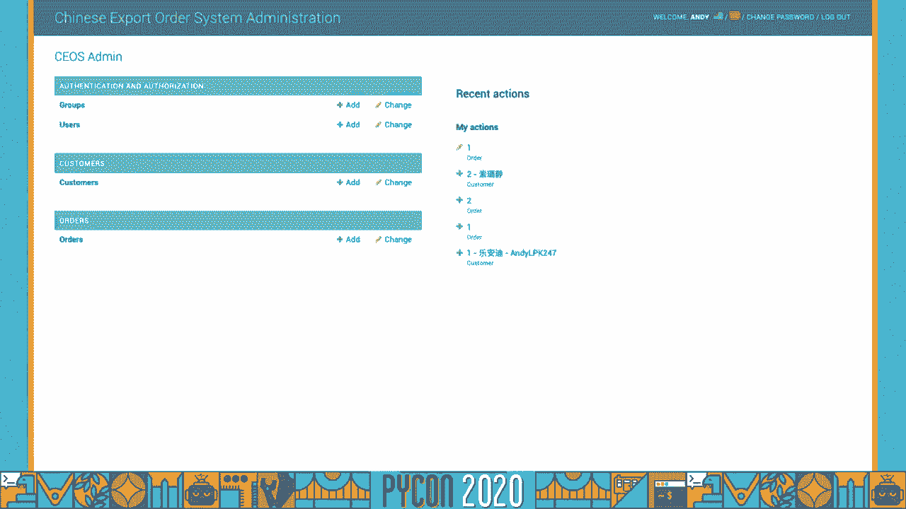
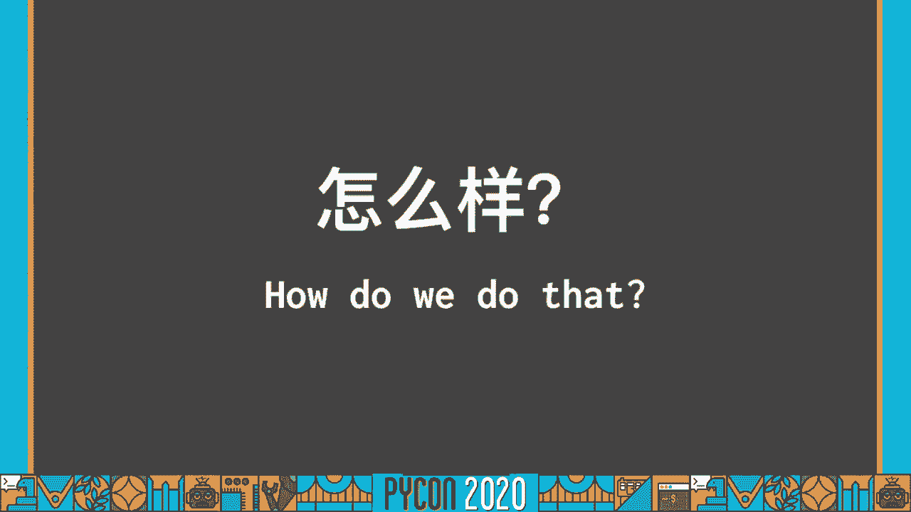
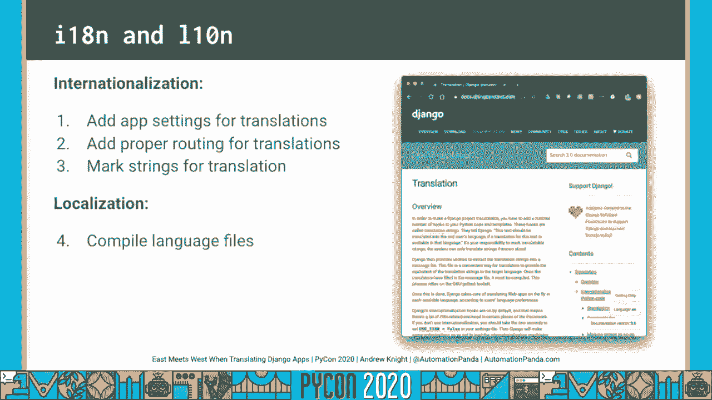
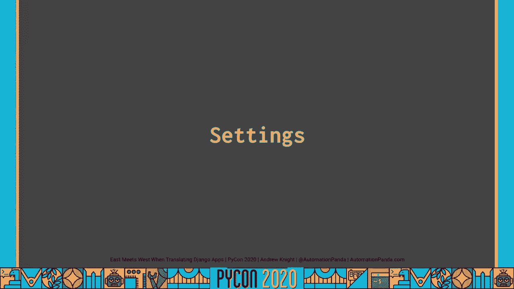
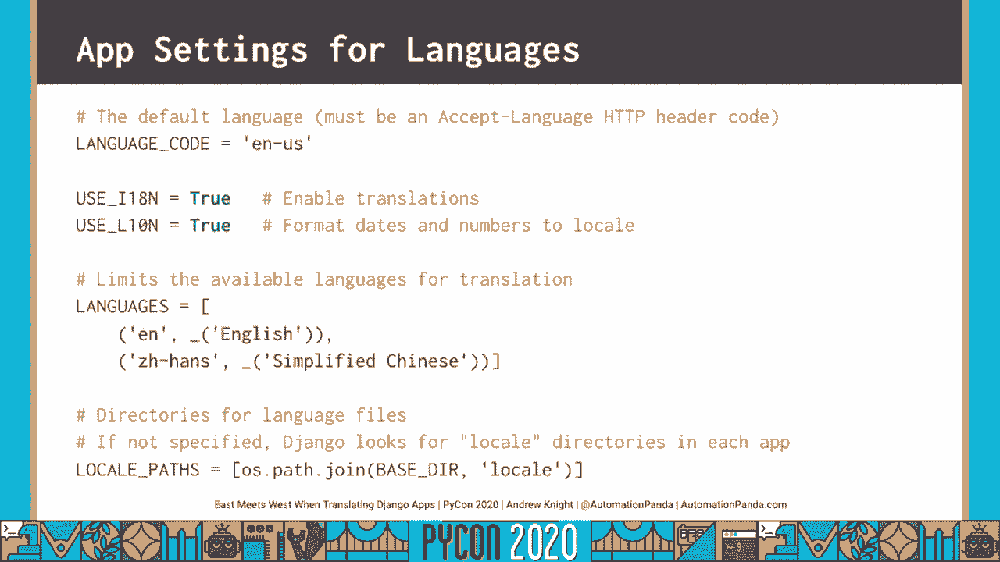
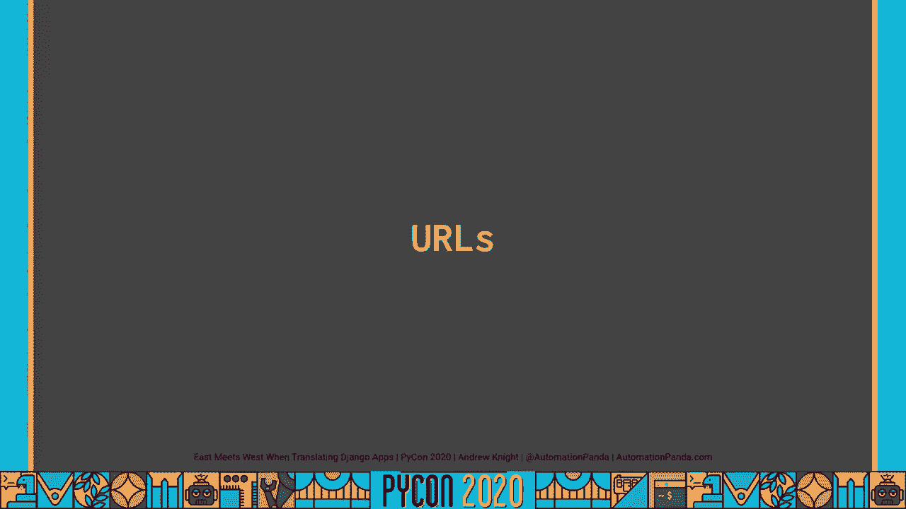
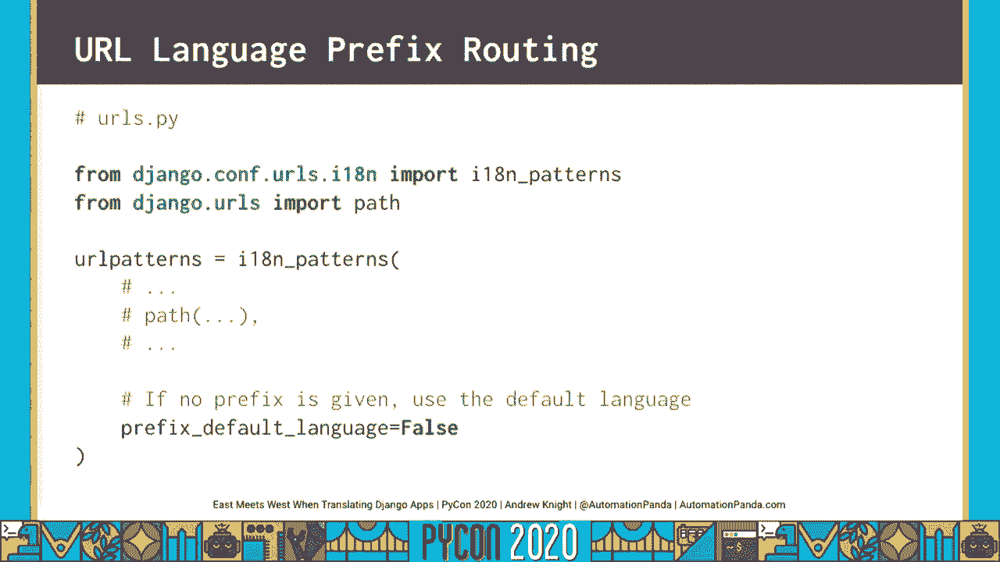
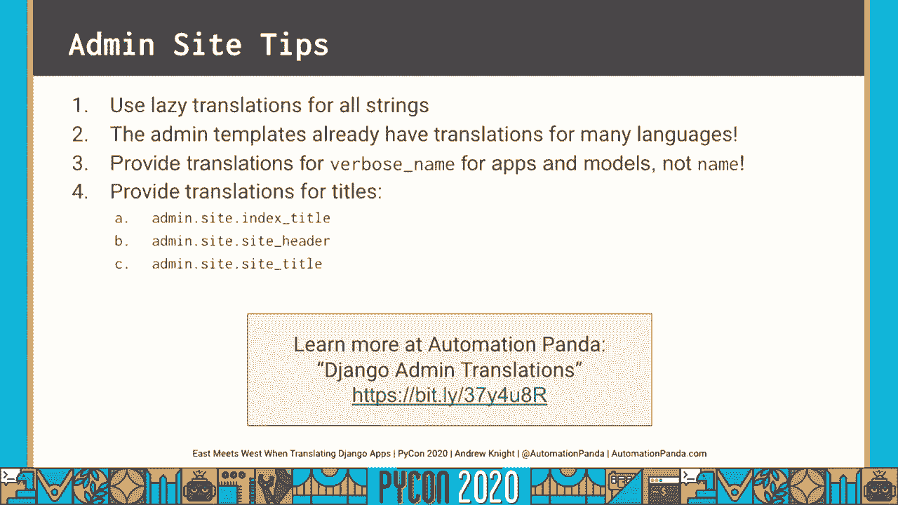
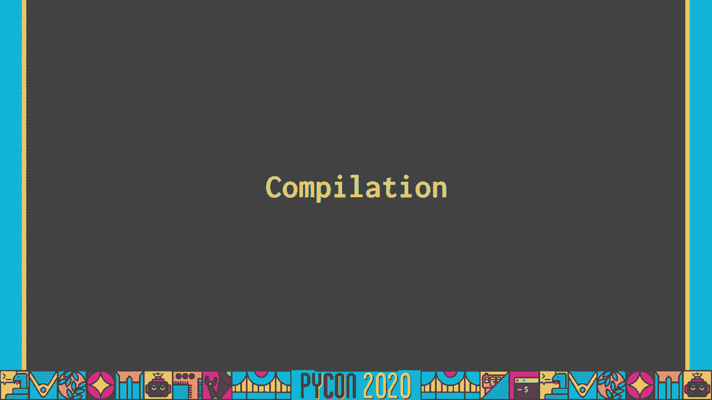
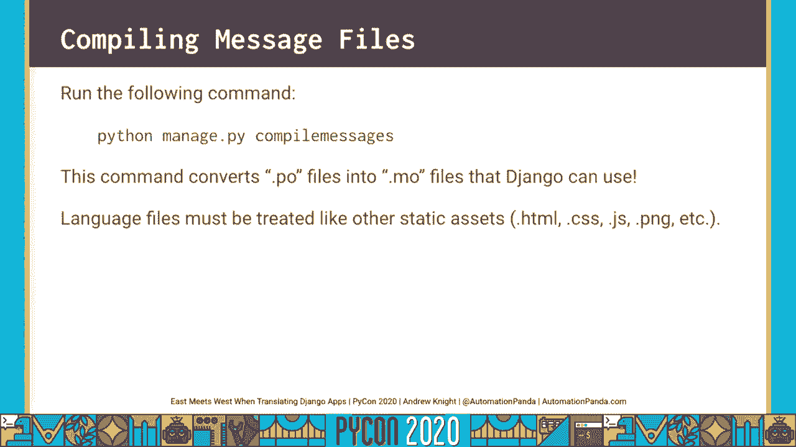

# 021：东西方交汇的Django应用翻译


## 概述
在本节课中，我们将学习如何为一个Django Web应用添加多语言支持。我们将跟随一位开发者的真实故事，了解他如何为家庭小生意开发的应用实现从英语到中文的翻译，并详细拆解Django框架提供的国际化与本地化工作流程。

---

## 背景故事：一个翻译需求
当你不理解他人语言时，会感到沮丧。语言障碍在今天不应成为问题。我将分享一个家庭如何克服语言障碍的故事。

我为家庭小生意开发了一个Django应用。我的妻子杰西卡曾用复杂的电子表格跟踪订单，耗时费力。我使用Django Web框架创建了数据模型，利用Django ORM管理订单和客户数据，并将Django管理后台作为前端来追踪订单。整个应用部署在Heroku上，图片存储在Amazon S3。

这个应用存在一个问题。杰西卡是家里唯一会说双语的人。我不会说中文，岳母不会说英语。我们日常最通用的语言是中式英语。因此，所有使用该应用的家庭成员都需要它从英语翻译成中文。

## 应用演示
我创建的应用以Django管理后台作为前端。应用包含客户和订单的数据模型。

订单页面是Django记录的标准视图，包含字段、操作、过滤器和标题等标准组件。需要注意页面右上角，我添加了语言切换部件。



整个页面已被翻译成中文，包括中文标题、操作、数据标签和过滤器。打开一个订单详情，可以看到记录表单及其按钮也已完全转换。



点击切换，页面可以改回英文。

## 核心问题
如何将应用在英语和中文之间进行翻译？Django框架内置了国际化支持，让这一切变得容易。

---

## Django翻译工作流程 🛠️
在Django应用中进行翻译包含四个步骤。前两步简单，第三步工作量较大，第四步是编译。

1.  **添加应用设置**以启用翻译。
2.  **配置URL路由**以支持语言前缀。
3.  **标记所有可见字符串**以便翻译。
4.  **提供翻译并编译**成语言文件。

Django官方文档详细记录了这些步骤。在深入之前，我们先定义关键术语。

### 关键术语定义
*   **字符串**：指需要在应用中进行翻译的文本，可位于Python代码或Django模板中。
*   **翻译**：指将字符串从一种语言映射到另一种语言的过程。
*   **国际化**：缩写为 **i18n**。指使应用程序适应不同地区的开发工作和工具。Django的翻译框架属于国际化范畴。
*   **本地化**：缩写为 **l10n**。指国际化过程的产出物，即针对特定地区（如中文）的语言文件。



工作流的前三步（设置、路由、标记）属于**国际化**。第四步（语言文件）属于**本地化**。



---

## 第一步：应用设置 ⚙️
配置位于 `settings.py` 文件。

以下是需要添加或检查的设置：

**1. 添加中间件**
将 `LocaleMiddleware` 添加到 `MIDDLEWARE` 列表。它使Django能自动检测语言偏好。顺序很重要：需在 `SessionMiddleware` 之后，`CommonMiddleware` 之前。
```python
MIDDLEWARE = [
    # ...
    'django.contrib.sessions.middleware.SessionMiddleware',
    'django.middleware.locale.LocaleMiddleware',  # 添加此行
    'django.middleware.common.CommonMiddleware',
    # ...
]
```

**2. 设置默认语言**
`LANGUAGE_CODE` 设置应用的默认语言，格式需符合HTTP Accept-Language头代码。
```python
LANGUAGE_CODE = 'en-us'  # 美式英语
```

**3. 启用翻译和本地化格式**
`USE_I18N` 和 `USE_L10N` 应设为 `True` 以启用翻译和本地化日期/数字格式。
```python
USE_I18N = True
USE_L10N = True
```

**4. 指定支持的语言**
`LANGUAGES` 列表限定了可供翻译的语言。这很重要，可以防止用户请求未支持的语言时出现错误或显示英文占位符。
```python
from django.utils.translation import gettext_lazy as _

LANGUAGES = [
    ('en', _('English')),
    ('zh-hans', _('Simplified Chinese')),
]
```



**5. 设置语言文件路径**
`LOCALE_PATHS` 指定Django查找翻译文件（.mo文件）的目录列表。建议在项目根目录下创建 `locale` 文件夹集中管理。
```python
import os
BASE_DIR = os.path.dirname(os.path.dirname(os.path.abspath(__file__)))



LOCALE_PATHS = [
    os.path.join(BASE_DIR, 'locale'),
]
```

---

## 第二步：URL路由 🌐
URL中的语言前缀可以直接指示加载页面所需的语言。



例如：
*   `/en/orders/` 加载英文订单页面。
*   `/zh-hans/orders/` 加载简体中文订单页面。
*   `/orders/` 无前缀，将加载默认语言（英语）页面。


在 `urls.py` 中配置非常简单：

```python
from django.conf.urls.i18n import i18n_patterns
from django.urls import path, include
from django.views.generic import TemplateView

urlpatterns = [
    # 非国际化URL（如API）可以放在这里
]

# 使用 i18n_patterns 包装需要国际化的URL
urlpatterns += i18n_patterns(
    path('orders/', include('orders.urls')),
    path('admin/', admin.site.urls),
    # ... 其他需要翻译的视图
    prefix_default_language=False, # 重要：不为默认语言添加前缀
)
```
设置 `prefix_default_language=False` 后，访问默认语言（如英语）页面时无需URL前缀。

---

## 第三步：标记字符串 🏷️
这是工作量最大的一步，需要标记所有面向用户的字符串。

### 在Python代码中标记
使用 `django.utils.translation` 模块的函数。

**导入约定**
```python
from django.utils.translation import gettext as _
from django.utils.translation import gettext_lazy as _
```
通常别名为下划线 `_`，因为输入更短。

**即时翻译 `gettext`**
用于在视图等执行时即需翻译的字符串。
```python
from django.http import HttpResponse
from django.utils.translation import gettext as _



def my_view(request):
    output = _("Welcome to my site.") # 字符串被标记
    return HttpResponse(output)
```



**惰性翻译 `gettext_lazy`**
用于在模型等定义时不需要，但在访问（如展示）时才需要翻译的场景。**对模型字段必须使用惰性翻译**。
```python
from django.db import models
from django.utils.translation import gettext_lazy as _

class MyThing(models.Model):
    name = models.CharField(_('name'), help_text=_('This is the help text')) # 使用惰性翻译

    class Meta:
        verbose_name = _('my thing')
        verbose_name_plural = _('my things')
```

### 在Django模板中标记
**翻译单个字符串**
使用 `` 标签。
```html
<!-- 翻译字面量 -->
<title></title>

<!-- 翻译变量 (谨慎使用，可能不会被makemessages自动提取) -->
<p></p>

<!-- 未来翻译占位符 -->
<p>{{ noop }}</p>
```

**翻译文本块**
使用 `` 标签，支持占位符。
```html

Hello, {{ user_name }}! You have {{ count }} message.

Hello, {{ user_name }}! You have {{ count }} messages.

```

### 翻译Django管理后台
管理后台的许多字符串已有翻译。在自定义时需注意：
1.  为模型翻译 `verbose_name` 和 `verbose_name_plural`，而非 `name` 字段。
2.  在 `settings.py` 中为管理后台标题提供翻译：
    ```python
    from django.utils.translation import gettext_lazy as _
    ADMIN_SITE_INDEX_TITLE = _('My Admin Home')
    ADMIN_SITE_HEADER = _('My Administration')
    ADMIN_SITE_TITLE = _('My Site Admin')
    ```

**标记字符串的建议**
*   **默认使用惰性翻译**：使用 `gettext_lazy` 通常无害，且能避免在模型等地方出错。
*   **仔细检查管理后台**：许多模板已有翻译，注意不要重复工作或冲突。
*   **保持界面整洁**：确保所有标题、按钮文本都被标记。

---



## 第四步：提供翻译并编译 📦
此步骤涉及创建翻译文件、填入译文，并编译供Django使用。


### 1. 创建消息文件 (.po)
在命令行中运行以下命令，为特定语言创建或更新消息文件：
```bash
django-admin makemessages -l zh_Hans
```
*   `-l` 后跟的是**地区代码**，不是语言代码。例如，简体中文的语言代码是 `zh-hans`，但地区代码是 `zh_Hans`。
*   此命令会扫描项目中的所有Python文件和模板，提取被标记的字符串。
*   在 `LOCALE_PATHS` 指定的目录下（如 `locale/zh_Hans/LC_MESSAGES/`）生成 `.po` 文件。

`.po` 文件示例：
```
#: orders/models.py:12
msgid "name"
msgstr "名称"

#: orders/templates/orders/detail.html:5
#, fuzzy
msgid "Order Details"
msgstr "订单详情"
```
*   `msgid`: 源字符串（英文）。
*   `msgstr`: 目标语言翻译。
*   `#, fuzzy`: 表示Django找到了可能的翻译建议，但需人工确认。
*   如果 `msgstr` 为空，Django将保留字符串不翻译。

### 2. 填写翻译
打开生成的 `.po` 文件，为每个 `msgid` 在 `msgstr` 中填入准确的翻译。这通常需要人工或借助专业翻译服务完成。

### 3. 编译消息文件 (.mo)
翻译填写完成后，运行编译命令：
```bash
django-admin compilemessages
```
此命令将 `locale` 目录下所有 `.po` 文件编译成Django运行时使用的 `.mo` 文件。`.mo` 文件是二进制格式，效率更高。

**重要**：编译后的 `.mo` 文件需要像其他静态文件（CSS, JS）一样被部署到服务器。

---

## 总结与思考 💭
本节课我们一起学习了为Django应用添加多语言支持的完整四步工作流程：配置设置、路由、标记字符串、编译翻译。Django的国际化框架使这个过程标准化且相对直接。

### 为何翻译至关重要
1.  **连接人群**：翻译能弥合语言鸿沟，让信息无障碍流通，对于家庭、社区乃至全球用户都至关重要。
2.  **易于实现**：借助Django等框架，实现翻译虽有工作量，但并无难以克服的技术挑战。
3.  **早期规划**：在应用开发初期就规划国际化，远比后期添加更容易。
4.  **人工智能辅助**：AI翻译工具可提高效率，但仍需人工校对以确保准确性，尤其是处理俚语或特定语境时。
5.  **即时翻译的局限**：浏览器即时翻译（如Chrome的翻译功能）并非完美，可能曲解意思。对于需要精确性的应用（如管理后台、法律、医疗），预设的静态翻译更可靠。
6.  **开发者的道德责任**：翻译的真实性和准确性至关重要。错误的翻译，尤其是故意的误译，会误导用户、传播错误信息。作为开发者，我们有责任确保技术（包括翻译）被合乎道德地使用。


通过本教程，希望你能掌握Django国际化的核心技能，并理解其背后的重要意义。现在，你可以开始为你自己的Django应用打破语言壁垒了。