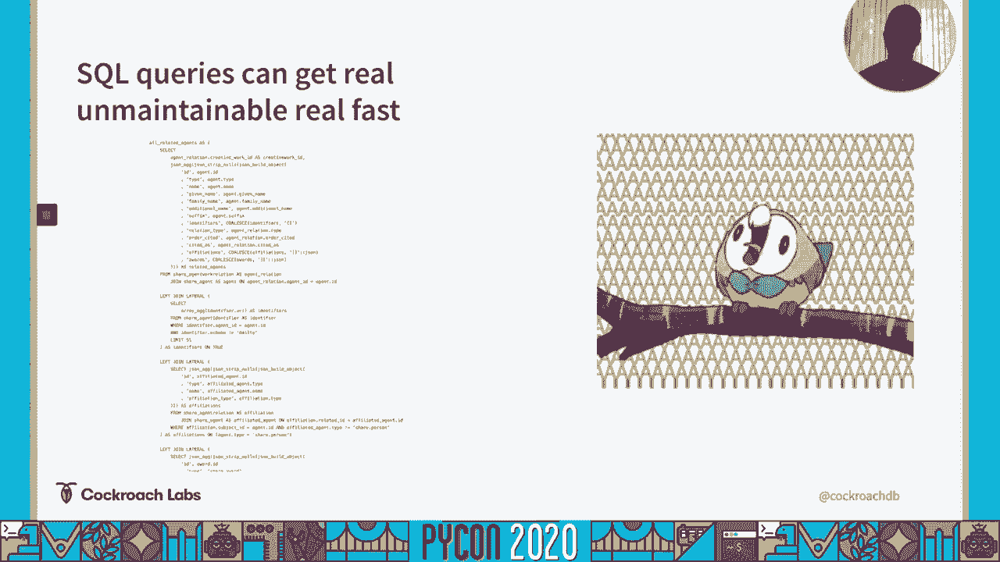
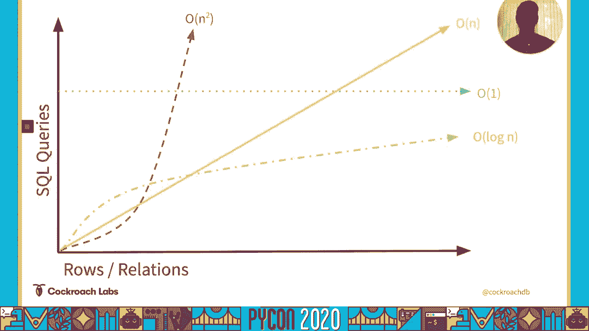
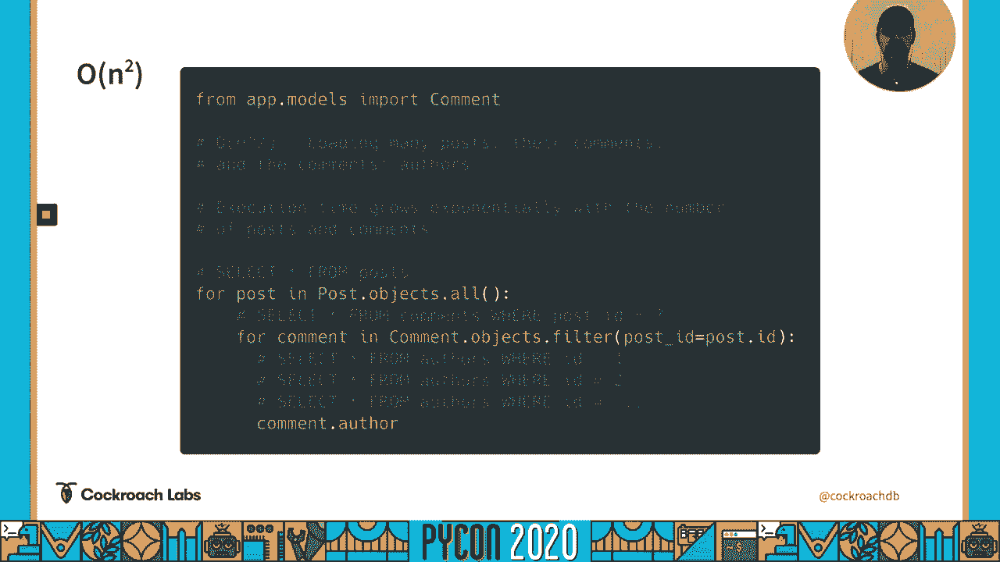
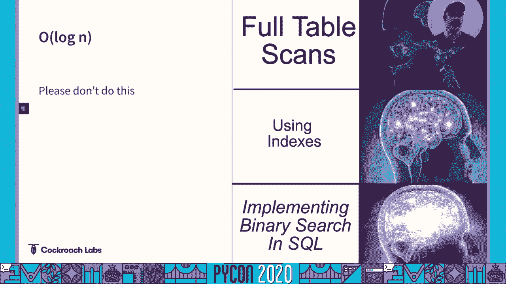
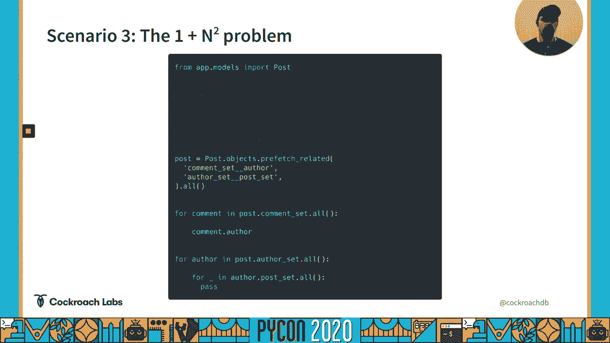
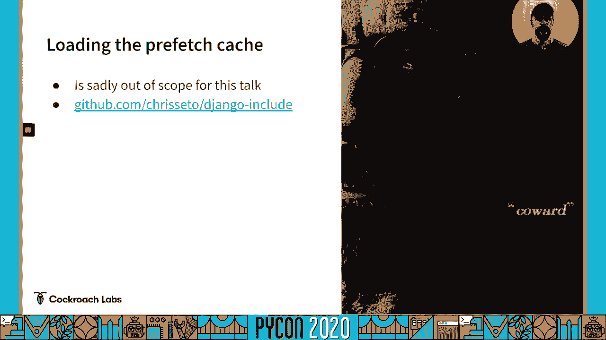

# 027：大 O 符号、N+1 问题与高级查询技巧 🚀


在本教程中，我们将学习如何分析和优化 Django ORM 的运行时性能。我们将从理解大 O 符号开始，深入探讨常见的 N+1 查询问题，并介绍一种使用 SQL 聚合和横向连接来减少查询数量的高级技巧。

## 概述 📋


Django ORM 极大地简化了数据库操作，但如果不加注意，很容易产生性能问题，尤其是在处理大量数据时。本次课程将引导你理解 ORM 查询背后的复杂度，识别低效模式，并学习如何利用 Django 的内置功能和高级 SQL 技巧来编写更高效的代码。

---



## 大 O 符号与 ORM 性能 📈


上一节我们概述了课程目标，本节中我们来看看如何量化代码的性能特征。大 O 符号是描述算法或函数性能随输入规模（n）增长而变化的一种方法。

*   **O(1)**：表示操作时间与数据量无关，是常数时间。例如，通过主键查找单个记录：`Post.objects.get(id=1)`。
*   **O(n)**：表示操作时间与数据量成线性关系。例如，遍历一个列表并对每个元素执行一次数据库查询。
*   **O(n²)**：表示操作时间与数据量的平方成正比。这通常发生在嵌套循环中，每个循环都可能触发数据库查询。
*   **O(log n)**：表示操作时间随数据量呈对数增长，效率很高，例如二分查找。

对于 Django ORM，我们主要关注的特征是**执行的 SQL 查询数量**，而不是单个查询的执行时间。这是因为建立数据库连接、编译 SQL、网络传输等开销，对于大量快速查询（如主键查找）来说，往往比数据库实际执行查询的时间更长。

---

## 识别 N+1 查询问题 🔍



理解了性能度量的基础后，我们来看一个 Django 开发中最常见的性能陷阱：N+1 查询问题。

假设我们有一个博客系统，要获取所有帖子及其对应的评论和评论作者。

```python
# 低效的方式：触发 N+1 查询
posts = Post.objects.all()
for post in posts:
    for comment in post.comments.all():  # 第一次查询帖子，然后对每个帖子查询评论
        print(comment.author.name)       # 对每个评论查询作者
```

上面的代码会先执行 1 次查询获取所有帖子，然后对每个帖子执行 1 次查询获取其评论，再对每个评论执行 1 次查询获取作者。如果有 N 个帖子，每个帖子平均有 M 条评论，那么查询总数将是 **1 + N + (N * M)**，这是一个 **O(n²)** 级别的操作。

---



## 使用 `select_related` 和 `prefetch_related` 优化 ✅



幸运的是，Django 提供了强大的工具来避免 N+1 问题。


**`select_related`** 用于优化“一对一”或“多对一”关系（使用 SQL JOIN）。
```python
# 优化：使用 select_related 获取外键关联的作者
comments = Comment.objects.select_related('author').all()
for comment in comments:
    print(comment.author.name)  # 不会触发额外查询
```
这个操作只产生 **1** 次查询。

**`prefetch_related`** 用于优化“多对多”或反向“一对多”关系（执行两次查询并在 Python 内存中连接）。
```python
# 优化：使用 prefetch_related 获取帖子及所有评论
posts = Post.objects.prefetch_related('comments').all()
for post in posts:
    for comment in post.comments.all():  # 访问预取缓存，无额外查询
        print(comment.text)
```
这个操作通常产生 **2** 次查询（一次取帖子，一次取所有相关评论）。

---

## 高级优化：SQL 聚合与横向连接 ⚡

当需要跨越多层复杂关系时，即使使用 `prefetch_related`，也可能因为预取多个关系而产生多个查询（O(关系数量)）。本节我们介绍一种更高级的技巧，旨在使用单个查询完成复杂的数据获取。




其核心思想是使用 SQL 的 **`JSON` 聚合函数** 和 **关联子查询（Lateral Join 的思想）**，将嵌套的关系数据“打包”到主查询的每一行中。


假设我们想在一个查询中获取所有帖子，以及每篇帖子的所有评论（以 JSON 数组形式嵌入）。

对应的 SQL 思路如下（概念性代码）：
```sql
SELECT
    post.*,
    (
        SELECT JSON_AGG(comment_data)
        FROM (
            SELECT * FROM comments WHERE comments.post_id = post.id
        ) AS comment_data
    ) AS comments_json
FROM posts post;
```
这个查询会为每一篇帖子执行一个子查询，将该帖子的所有评论聚合成一个 JSON 数组。

在 Django 中，我们可以使用 `django-cte` 或编写原始 SQL 片段，再通过自定义方法将返回的 JSON 数据加载到 Django 模型缓存中，模拟 `prefetch_related` 的效果。这可以将查询复杂度从 **O(关系数量)** 降低到 **O(1)**（仅一次查询）。

> **注意**：有一个名为 `django-postgres-extra` 或类似功能的库可能提供此类封装。手动实现需要对 Django 内部机制有较深理解。


---

## 技术选型与基准测试 ⚖️


那么，我们应该总是使用这种高级技巧吗？答案是否定的，这取决于具体情况。

以下是需要考虑的因素：



*   **数据库支持**：`JSON_AGG` 和高效的 Lateral Join 对数据库（如 PostgreSQL）有要求。
*   **查询类型**：这种模式生成的是“分析型查询”。像 CockroachDB 这类为事务处理优化的数据库，可能在此类查询上表现不佳。
*   **数据量**：当顶层数据量（如帖子数量）非常大时，`prefetch_related`（执行少量查询，传输数据高效）的性能可能优于打包所有数据到一行的单个大查询。
*   **复杂度与维护**：高级技巧增加了代码复杂度，可能降低可读性和可维护性。


**最佳实践是进行基准测试**。在你的实际数据模型、数据量和数据库环境下，对比 `prefetch_related` 和自定义聚合查询的性能。使用 Django 的 `django.db.connection.queries` 或在数据库端分析查询计划，以数据驱动决策。

---

## 总结 🎯

本节课我们一起学习了 Django ORM 性能优化的核心知识：


1.  **理解大 O 符号**，将其应用于分析 ORM 查询数量。
2.  **识别 N+1 查询问题**，这是导致性能瓶颈的常见原因。
3.  **掌握基础优化工具**：使用 `select_related` 和 `prefetch_related` 解决大部分关联查询的性能问题。
4.  **了解高级优化技巧**：认识通过 SQL 聚合和横向连接在单次查询中获取嵌套数据的可能性及其权衡。


记住，没有银弹。在追求性能的同时，务必权衡代码的简洁性、可读性以及数据库的特性。始终基于实际场景进行测量和优化。