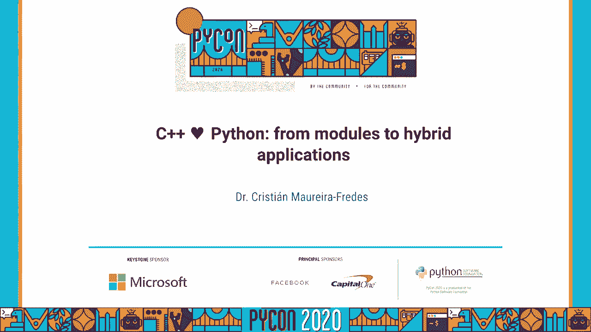
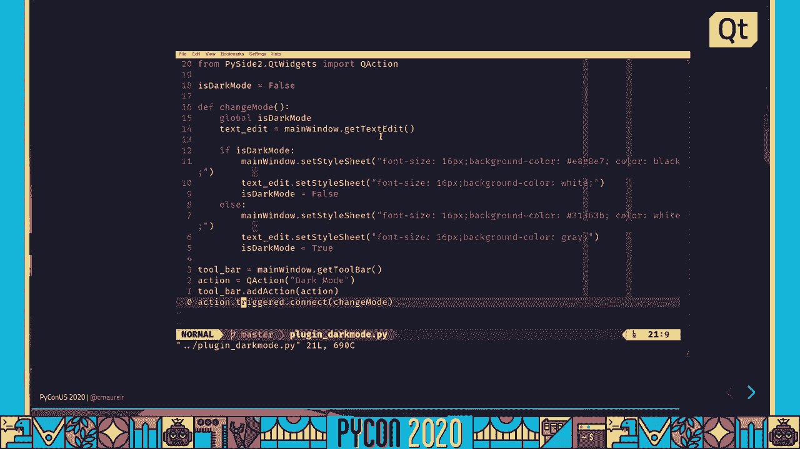
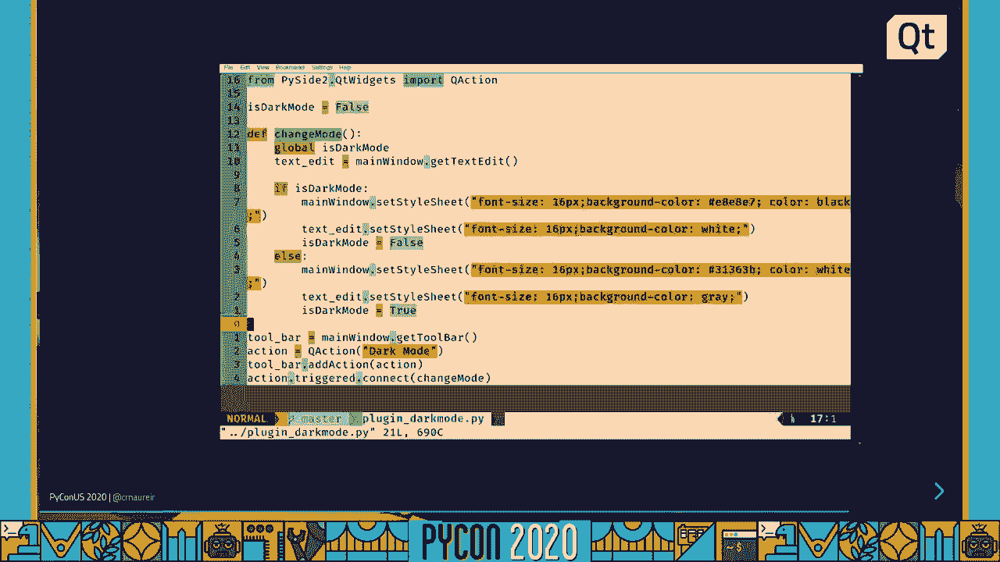
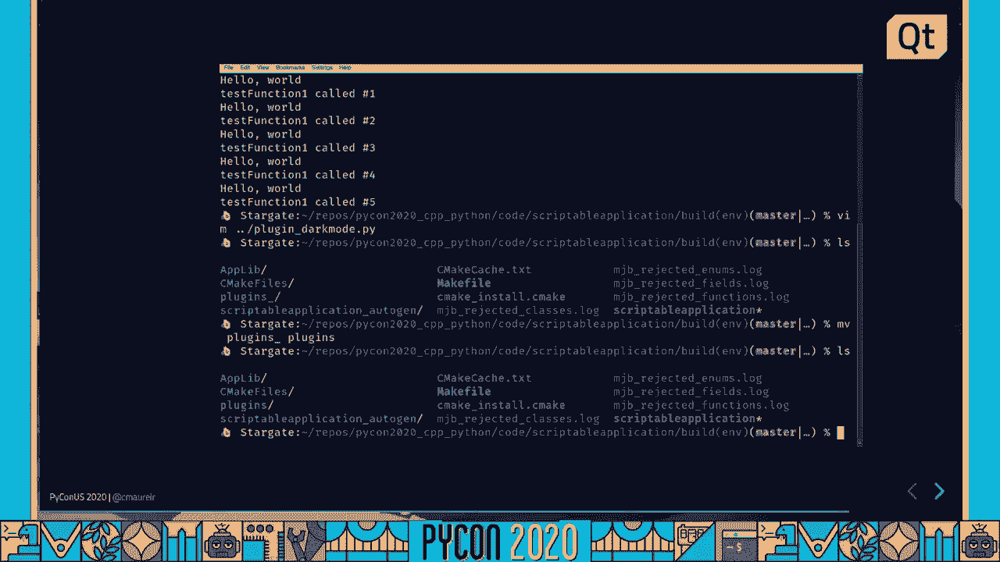
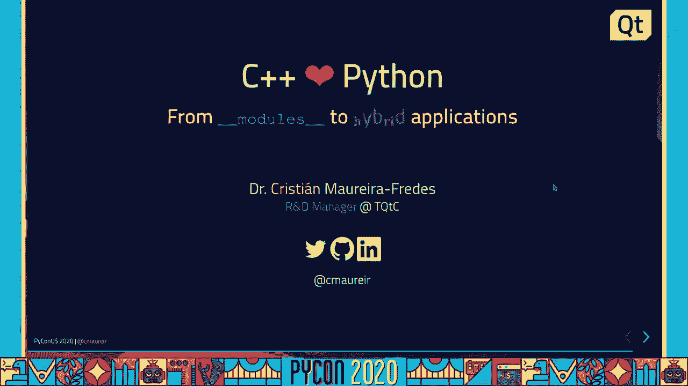

# 033：从模块到混合应用程序 🚀




## 概述

在本教程中，我们将学习如何将 C++ 与 Python 结合使用。我们将从编写简单的 C 扩展模块开始，逐步深入到将 Python 解释器嵌入到现有的 C++ 桌面应用程序中。通过这种方式，我们可以利用 C++ 的性能优势和 Python 的灵活性与丰富的生态系统。

---

## 章节 1：C++ 与 Python 的异同 🤝

C++ 和 Python 都是通用、多范式的编程语言，支持面向对象和函数式编程。然而，它们也存在显著差异。

C++ 是一种静态类型语言，需要编译。Python 则是一种动态类型语言，通常通过解释器执行。一个常见的观点是 C++ 复杂但速度快，而 Python 简单但速度较慢。但好消息是，我们不必在两者中只选其一，它们可以协同工作。

Python 的成功很大程度上源于其设计哲学和实现。其语法深受 ABC 语言启发，易于阅读。更重要的是，Python 解释器本身是用 C 语言编写的。这种“C 语言胶水”的特性，使得我们可以轻松地将用 C 或 C++ 编写的高性能代码、现有库或特定功能集成到 Python 中。

许多流行的 Python 库都利用了这一点。例如，NumPy 的后端大量使用了 Fortran 和 C 代码以实现高性能。PyTorch 则是一个将庞大 C++ 库（libtorch）暴露给 Python 的绝佳例子。

---

## 章节 2：C++ 快速入门 📖

如果你不熟悉 C++，以下是一个快速概览，帮助你理解后续的代码示例。

C++ 代码与 Python 代码的主要区别在于类型声明。在 C++ 中，你需要为变量和函数指定类型。

**Python 示例：**
```python
def add(a, b):
    return a + b

result = add(5, 3)
print(result)
```

**C++ 示例：**
```cpp
#include <iostream>
#include <string>

int add(int a, int b) {
    return a + b;
}

int main() {
    int result = add(5, 3);
    std::cout << result << std::endl;
    return 0;
}
```

关键点：
*   `int`、`float`、`std::string` 是类型。
*   函数使用大括号 `{}` 定义，并需要声明返回类型（如 `int`）。
*   `main()` 函数是程序的入口点，是强制性的。
*   输出使用 `std::cout`。
*   C++ 代码需要先编译成二进制文件才能执行。

---

## 章节 3：现代 C++ 中的 Python 风味 🍬

现代 C++ 标准（C++11/14/17/20）引入了许多让代码更简洁、更类似 Python 的特性。

上一节我们介绍了 C++ 的基本语法，本节中我们来看看它如何变得更“Pythonic”。

以下是几个例子：

*   **自动类型推断 (`auto`)**：类似于 Python 的动态类型，让编译器推断变量类型。
    ```cpp
    auto x = 5; // x 是 int
    auto y = 3.14; // y 是 double
    auto z = std::string("hello"); // z 是 std::string
    ```

*   **元组 (`std::tuple`)**：可以返回多个值。
    ```cpp
    #include <tuple>
    std::tuple<int, int, std::string> get_values() { return {1, 2, "hello"}; }
    auto [a, b, c] = get_values(); // 结构化绑定 (C++17)
    ```

*   **映射 (`std::map`, `std::unordered_map`)**：类似于 Python 的字典。
    ```cpp
    #include <unordered_map>
    std::unordered_map<std::string, int> scores = {{"Alice", 10}, {"Bob", 20}};
    ```

*   **Lambda 表达式**：可以方便地定义匿名函数。
    ```cpp
    auto square = [](int x) { return x * x; };
    ```

*   **模块 (C++20)**：引入了类似 Python 的模块系统。
    ```cpp
    // math.cpp
    export module math;
    export int add(int a, int b) { return a + b; }

    // main.cpp
    import math;
    int result = add(5, 3);
    ```

*   **范围 (Ranges) 和算法 (C++20)**：支持类似 Python 生成器表达式的链式操作。
    ```cpp
    #include <ranges>
    #include <vector>
    std::vector<int> numbers = {1, 2, 3, 4, 5};
    auto result = numbers | std::views::filter([](int n){ return n % 2 == 0; })
                          | std::views::transform([](int n){ return n * n; });
    // result 包含 [4, 16]
    ```

这些特性使得 C++ 代码更易读、更易写，并且与 Python 的设计哲学更加接近。

---

## 章节 4：场景一：用 C++ 扩展 Python (编写 C 扩展) ⚙️

现在，让我们进入实践环节。第一个场景是使用 C++ 来编写 Python 扩展模块，以提升性能或集成现有 C++ 库。

以下是创建一个简单 C 扩展所需的步骤：

1.  **包含头文件**：需要 `Python.h`。
2.  **编写 C 函数**：实现你想要暴露给 Python 的功能。
3.  **定义模块方法表**：将 Python 函数名与你实现的 C 函数关联起来。
4.  **定义模块结构**：指定模块名、文档和方法表。
5.  **定义模块初始化函数**：Python 导入模块时调用的函数。

**示例：一个简单的 “hello” 模块**

```c
// simple.c
#include <Python.h>

// 1. 实现 C 函数
static PyObject* simple_hello(PyObject* self, PyObject* args) {
    const char* msg = "Hello from C extension!";
    return PyUnicode_FromString(msg);
}

// 2. 定义方法表
static PyMethodDef SimpleMethods[] = {
    {"hello", simple_hello, METH_NOARGS, "Print a hello message."},
    {NULL, NULL, 0, NULL} // 哨兵，表示结束
};

// 3. 定义模块结构
static struct PyModuleDef simplemodule = {
    PyModuleDef_HEAD_INIT,
    "simple", // 模块名
    NULL, // 模块文档
    -1,
    SimpleMethods
};

// 4. 模块初始化函数
PyMODINIT_FUNC PyInit_simple(void) {
    return PyModule_Create(&simplemodule);
}
```

**编译与安装**

你需要一个 `setup.py` 文件来编译这个扩展：

```python
# setup.py
from setuptools import setup, Extension

module = Extension('simple', sources=['simple.c'])

setup(
    name='SimpleExtension',
    version='1.0',
    ext_modules=[module]
)
```

在终端中运行：
```bash
pip install .
```

然后就可以在 Python 中使用：
```python
import simple
print(simple.hello()) # 输出：Hello from C extension!
```

---

## 章节 5：场景一实战：性能对比示例 🏎️

为了展示 C 扩展的性能优势，我们实现一个遍历目录并收集所有文件路径的函数，分别用纯 Python 和 C 扩展实现。

**Python 实现 (`os.walk`):**
```python
import os
def list_files_py(path):
    file_list = []
    for root, dirs, files in os.walk(path):
        for file in files:
            file_list.append(os.path.join(root, file))
    return file_list
```

**C++ 扩展实现 (使用 `<filesystem>` 库):**
```cpp
// fastlist.c
#include <Python.h>
#include <filesystem>
namespace fs = std::filesystem;

static PyObject* fastlist_listfiles(PyObject* self, PyObject* args) {
    const char* path;
    int recursive = 1; // 默认递归

    if (!PyArg_ParseTuple(args, "s|p", &path, &recursive)) {
        return NULL;
    }

    PyObject* result_list = PyList_New(0);
    try {
        if (recursive) {
            for (const auto& entry : fs::recursive_directory_iterator(path)) {
                if (entry.is_regular_file()) {
                    PyList_Append(result_list, PyUnicode_FromString(entry.path().c_str()));
                }
            }
        } else {
            for (const auto& entry : fs::directory_iterator(path)) {
                if (entry.is_regular_file()) {
                    PyList_Append(result_list, PyUnicode_FromString(entry.path().c_str()));
                }
            }
        }
    } catch (...) {
        PyErr_SetString(PyExc_OSError, "Error reading directory");
        return NULL;
    }
    return result_list;
}
// ... (方法表和模块初始化部分与上例类似)
```

**性能对比：**
在一个包含大量文件的目录下测试，C++ 扩展的实现速度通常会显著快于纯 Python 的 `os.walk`，尤其是在递归遍历时，因为 `std::filesystem` 是原生实现，避免了 Python 层的开销。

---

## 章节 6：场景二：将 Python 嵌入 C++ 应用程序 🖥️

现在，让我们看看反向操作：将 Python 解释器嵌入到一个现有的 C++ 应用程序中。这允许 C++ 程序动态执行 Python 脚本，从而增加灵活性和可扩展性。

上一节我们让 Python 调用 C++，本节中我们来看看如何让 C++ 程序运行 Python。

嵌入 Python 解释器出奇地简单，只需要几个关键步骤：

1.  初始化 Python 解释器。
2.  执行 Python 代码或脚本。
3.  可选的：清理 Python 解释器。

**一个最简单的嵌入示例：**

```cpp
// embed_simple.cpp
#include <Python.h>

int main() {
    // 1. 初始化 Python 解释器
    Py_Initialize();

    // 2. 执行一段 Python 代码字符串
    PyRun_SimpleString("print('Hello from embedded Python!')");

    // 3. 关闭 Python 解释器
    Py_Finalize();
    return 0;
}
```

**编译与链接：**
编译此程序时，需要链接 Python 库。例如，使用 CMake：

```cmake
cmake_minimum_required(VERSION 3.10)
project(EmbedPythonDemo)

find_package(Python3 REQUIRED COMPONENTS Development)

add_executable(embed_simple embed_simple.cpp)
target_link_libraries(embed_simple Python3::Python)
```

运行编译后的程序，它会在控制台输出 `Hello from embedded Python!`。

---

## 章节 7：场景二实战：在 C++ GUI 应用中嵌入 Python 🎨

让我们看一个更激动人心的例子：一个用 C++ 框架（如 Qt）编写的桌面应用程序，它嵌入了 Python，允许用户通过 Python 脚本实时修改 GUI 或添加功能。



以下是核心思路：



1.  **C++ 主程序**：创建基本的 GUI 窗口。
2.  **暴露 C++ 对象**：将关键的 C++ 对象（如主窗口、按钮）暴露给 Python 解释器。这通常需要为这些类创建 Python 绑定（可以使用 PyBind11 等工具简化）。
3.  **Python 脚本**：用户编写脚本，通过访问已暴露的 C++ 对象来操作界面。
4.  **执行脚本**：应用程序提供一种方式（如一个文本框和“执行”按钮）来运行用户输入的 Python 代码。



**概念性代码结构：**


*   **C++ 主窗口 (简化):**
    ```cpp
    class MainWindow : public QMainWindow {
        Q_OBJECT // Qt 宏
    public:
        QPushButton* button;
        QTextEdit* textEdit;
        MainWindow() {
            button = new QPushButton("Click Me", this);
            textEdit = new QTextEdit(this);
            // ... 布局代码
            // 执行按钮的槽函数
            connect(runButton, &QPushButton::clicked, this, &MainWindow::executePythonCode);
        }
    public slots:
        void executePythonCode() {
            QString code = textEdit->toPlainText();
            // 这里将 code 传递给嵌入的 Python 解释器执行
            // 解释器已能访问 `self` (即这个 MainWindow 实例)
        }
    };
    ```

*   **用户 Python 脚本示例:**
    ```python
    # 假设 `window` 是暴露出来的 MainWindow 对象
    window.button.setText("Hello from Python!") # 修改按钮文字
    window.button.setStyleSheet("background-color: red;") # 改变按钮颜色
    # 甚至可以动态添加新组件
    new_label = QLabel("Dynamic Label")
    window.layout().addWidget(new_label)
    ```

通过这种方式，用户无需重新编译 C++ 程序，就能通过 Python 脚本无限扩展应用程序的功能，比如创建新的工具栏按钮、改变主题、导入数据分析库处理程序中的数据等。

---

## 总结

在本教程中，我们一起探索了 C++ 与 Python 两种语言协同工作的强大能力。



我们首先了解了它们的异同，并学习了现代 C++ 中类似 Python 的语法特性。然后，我们深入实践了两种主要场景：
1.  **用 C++ 扩展 Python**：通过编写 C 扩展模块，我们将高性能的 C++ 代码集成到 Python 中，用于提升关键函数的速度或封装现有库。
2.  **将 Python 嵌入 C++**：我们将 Python 解释器嵌入到 C++ 应用程序中，这使得成熟的 C++ 软件（特别是 GUI 应用）获得了动态执行脚本、运行时扩展和插件化的能力。


核心思想是打破语言壁垒，利用每种语言的优势。你不必只选择一种语言，而是可以设计一个混合技术栈，让 C++ 处理性能关键部分和底层系统交互，让 Python 负责快速原型设计、脚本编写和高级逻辑。希望本教程能帮助你减少对 C++ 的畏惧，并激发你在项目中尝试这种强大组合的兴趣。