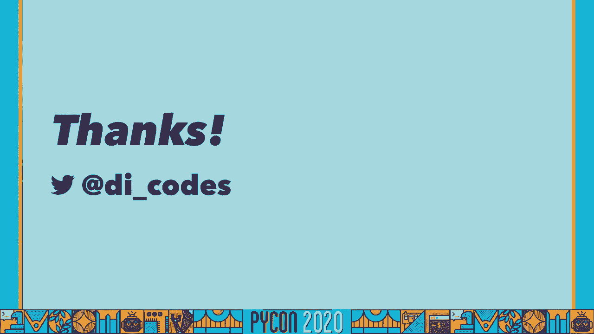

# 034：静态类型详解


在本教程中，我们将学习Python中的静态类型。我们将从Python的基础类型系统开始，逐步理解动态类型与静态类型的区别，并最终掌握如何在Python项目中应用静态类型检查。

## Python静态类型入门：1：Python中的类型

首先，我们需要理解Python中的类型。在Python中，每个值都有一个类型。我们可以使用内置的`type()`函数来查看。

```python
type(42)        # <class 'int'>
type(42.0)      # <class 'float'>
type('foo')     # <class 'str'>
type([1, 2, 3]) # <class 'list'>
```

这些`int`、`float`、`str`、`list`等不仅是内置函数，也是Python中的内置类型类。除了这些，Python的`types`模块还包含许多其他类型，例如`NoneType`、`FunctionType`等，它们不一定有直接对应的内置转换函数。

上一节我们介绍了Python中的基本类型，本节中我们来看看Python类型系统的核心特征：动态类型。

## Python静态类型入门：2：动态类型

当我们说Python是一种动态类型语言时，它主要包含两层含义。

第一层含义是，变量本身没有固定的类型，其类型可以在程序运行时改变。

```python
a = 42      # a 现在是 int 类型
a = 42.0    # a 现在是 float 类型
a = "42"    # a 现在是 str 类型
```

第二层含义是，函数的参数和返回值可以是任何类型。

```python
def add(a, b, c):
    return a + b + c

# 可以传入整数
result = add(1, 2, 3)  # 返回 6
# 也可以传入字符串
result = add('a', 'b', 'c')  # 返回 'abc'
# 但不能混合类型
result = add(1, 'b', 3)  # 引发 TypeError
```

这种灵活性带来了便利，但也使得代码意图不清晰，并可能在运行时产生错误。为了改善这一点，开发者可能会尝试编写详细的文档字符串或在函数内部使用`assert`进行类型断言，但这两种方法都有其局限性。

因此，Python社区更常用的是“鸭子类型”（Duck Typing）：我们通过一个对象的行为（它有什么方法）来推断其类型，而不是通过其声明的类型。

理解了动态类型的优缺点后，我们来看看它的对立面：静态类型。

## Python静态类型入门：3：静态类型简介

静态类型意味着变量或函数参数的类型在定义时就被确定，并且在程序运行期间不会改变。许多语言是静态类型的，例如C、Java、Rust和TypeScript。

以下是不同语言中相同加法函数的静态类型声明示例：

```c
// C
int add(int a, int b, int c) {
    return a + b + c;
}
```

```java
// Java
public static int add(int a, int b, int c) {
    return a + b + c;
}
```

```rust
// Rust
fn add(a: u8, b: u8, c: u8) -> u8 {
    a + b + c
}
```

```typescript
// TypeScript
function add(a: number, b: number, c: number): number {
    return a + b + c;
}
```

那么，Python能否实现静态类型呢？答案是肯定的，这得益于一系列PEP提案的引入。

## Python静态类型入门：4：Python静态类型发展史

Python实现静态类型的故事始于2006年的PEP 3107，它为Python 3引入了函数注解（Function Annotations）。

```python
def add(a: int, b: int, c: int) -> int:
    return a + b + c
```

需要注意的是，这些注解只是元数据，不影响运行时行为。它们存储在函数的`__annotations__`属性中。

真正的突破来自Jukka Lehtosalo在2011年的博士研究，他创建了`mypy`项目。`mypy`最初是Python的一个实验性变体，旨在无缝混合动态和静态类型。后来，在Guido van Rossum等人的推动下，`mypy`的理念被整合回标准Python。

以下是推动Python静态类型化的关键PEP：
*   **PEP 483**：阐述了类型提示的理论基础，引入了“渐进式类型”和“可选类型”等核心概念。
*   **PEP 484**：正式定义了类型提示规范，引入了`typing`模块，提供了`Any`、`Union`、`Optional`、`Tuple`、`Callable`等基础类型构造器。
*   **PEP 526**：为Python 3.6引入了变量注解语法，允许我们直接注解变量，而不仅仅是函数参数。

```python
# 使用 PEP 484 引入的类型
from typing import List, Dict, Union

def process_items(items: List[int]) -> int:
    ...

def get_value(data: Dict[str, int], key: str) -> Union[int, None]:
    ...

# 使用 PEP 526 引入的变量注解
name: str
count: int = 0
```

有了语法和规范，我们还需要工具来检查类型是否正确，这就是类型检查器。

## Python静态类型入门：5：类型检查器

类型检查器分为静态检查器和动态检查器。静态检查器（如`mypy`）在不运行代码的情况下分析类型；动态检查器则在程序运行时进行检查。

目前主流的Python静态类型检查器包括：
*   **mypy**：最早的静态类型检查器，由Dropbox支持。
*   **pytype**：由Google开发。
*   **pyre**：由Facebook开发。
*   **pyright**：由Microsoft开发。

这些检查器大多支持PEP 484规范，并能与代码编辑器（如VS Code、PyCharm）集成，提供实时的类型错误提示。

它们之间也存在一些差异，主要体现在“跨函数推断”和“运行时宽容度”上。例如，`mypy`在跨函数调用时的类型推断可能不如`pyre`严格；而`pytype`更倾向于允许那些在运行时不会出错的代码，即使它违反了类型注解。

现在我们已经了解了静态类型的工具，接下来探讨何时以及为何要使用它。

## Python静态类型入门：6：何时使用静态类型

首先，需要明确静态类型不能替代单元测试。它们各有侧重，应结合使用。

**你应该在以下情况使用静态类型：**
1.  **代码库规模庞大**：当项目有数百万行代码时，缺乏类型提示会使代码难以理解和维护，严重影响开发效率。静态类型是管理大型代码库的利器。
2.  **代码逻辑复杂**：类型注解可以看作是被机器验证的文档。当函数意图不清晰时，添加类型提示能极大地提升代码可读性。
3.  **开发公共API**：如果你开发供他人使用的库，类型注解能帮助用户清楚地了解如何正确使用你的函数和类。
4.  **进行大型重构或迁移**：在重构前，为关键部分添加类型提示。重构过程中，类型检查器能帮你提前发现潜在的错误。
5.  **进行试验**：静态类型是渐进式的。你可以从代码库的一小部分开始尝试，感受其带来的好处。

**开始使用静态类型永远不会太早**，它几乎没有任何坏处。你可以自由地选择在多少代码上应用它。

## Python静态类型入门：7：如何开始使用静态类型

以下是开始使用Python静态类型的五个简单步骤：

1.  **迁移到Python 3.6或更高版本**：虽然旧版本也能用，但新版本支持更好的语法（如变量注解）。
2.  **安装并配置类型检查器**：选择一个检查器（如`mypy`）并在本地安装。将其集成到你的编辑器中以获得即时反馈。
    ```bash
    pip install mypy
    ```
3.  **渐进式地添加类型注解**：不要试图一次性注解所有代码。从最简单的文件（如`__init__.py`）或最核心的模块开始。
4.  **将类型检查加入CI流程**：像运行linter一样，在持续集成（CI）中运行类型检查器，确保新增代码符合类型规范。
5.  **说服你的团队**：向同事展示静态类型带来的好处，如更好的代码提示、更少的运行时错误和更清晰的文档。

## 总结

在本教程中，我们一起学习了Python静态类型的方方面面。我们从Python的动态类型特性出发，探讨了其灵活性与潜在问题。随后，我们回顾了Python通过一系列PEP引入静态类型支持的历史，认识了`typing`模块和类型注解语法。我们还了解了不同的类型检查器工具及其差异。最后，我们明确了静态类型的适用场景，并给出了上手实践的五个步骤。

静态类型是提升Python代码可维护性、可靠性和开发体验的强大工具。它允许你以渐进的方式，在享受动态类型灵活性的同时，获得静态类型系统的安全保障。




感谢阅读。希望本教程能帮助你开始在Python项目中使用静态类型。