# 036：构建图像数据的交互式应用


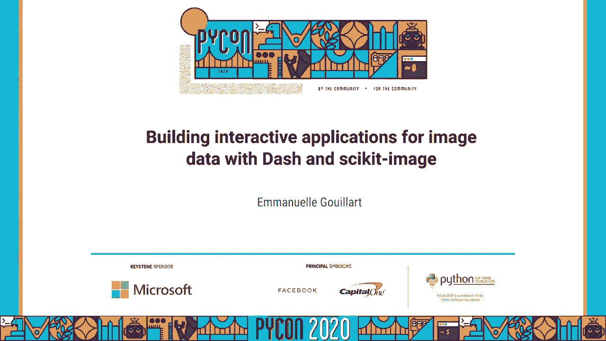

## 概述

在本节课中，我们将学习如何利用 **Dash** 和 **scikit-image** 这两个强大的 Python 库，来构建用于图像数据标注和处理的交互式 Web 应用程序。我们将从了解图像处理在科学和工业中的重要性开始，逐步介绍 Dash 框架的核心概念，并展示如何结合 scikit-image 的图像处理能力来创建实用的工具。

---

## 图像处理的重要性 📷

图像是科学和商业领域中非常广泛的数据来源。从这些图像中提取精确的测量数据，并将其转化为自动驾驶汽车所需的数字和科学知识，是许多应用的核心。例如，在自动驾驶中，需要实时、可靠地检测物体和距离。在遥感领域，如卫星成像，同样需要从图像中提取关键信息。

如今，神经网络算法被广泛用于图像分类和目标分割。训练这些网络需要一个带有“真实标签”的训练集，这就需要用户对图像进行标注，例如绘制边界框或精确勾勒物体轮廓。因此，构建一个高效、易用的图像标注工具至关重要。

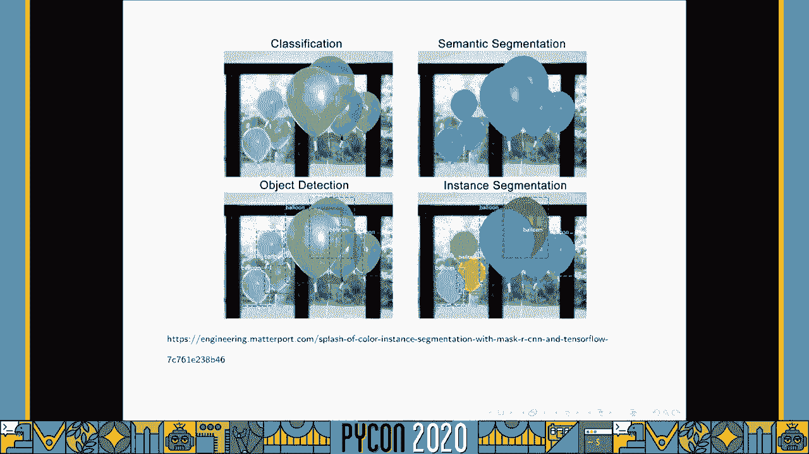

---

## 什么是 Dash？ 🚀

上一节我们了解了图像处理的需求，本节中我们来看看实现交互式应用的核心工具——Dash。

**Dash** 是一个用于构建分析型 Web 应用程序的 Python 框架。它是开源软件，采用 MIT 许可证。Dash 的最大承诺是：开发者只需编写 Python 代码，无需了解任何 JavaScript，即可创建功能丰富的交互式应用。

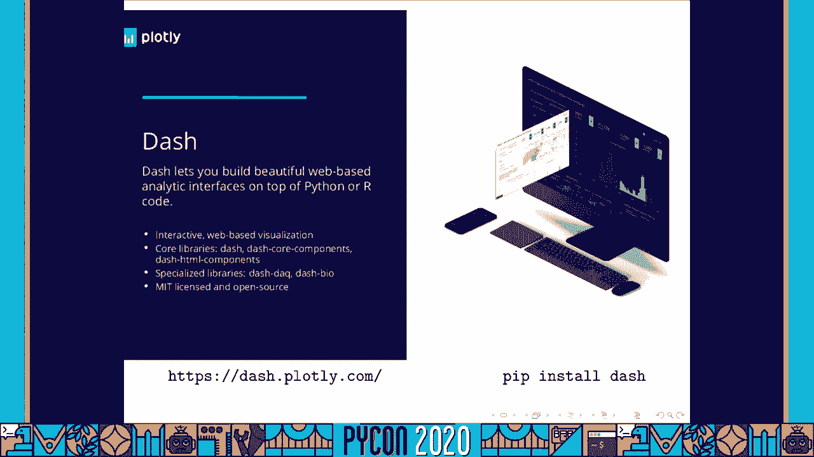

以下是一个简单的 Dash “Hello World” 应用代码片段：

```python
import dash
from dash import html, dcc
from dash.dependencies import Input, Output

app = dash.Dash(__name__)

app.layout = html.Div([
    dcc.Input(id='my-input', value='初始值', type='text'),
    html.Div(id='my-output')
])

@app.callback(
    Output('my-output', 'children'),
    [Input('my-input', 'value')]
)
def update_output(value):
    return f'你输入了：{value}'

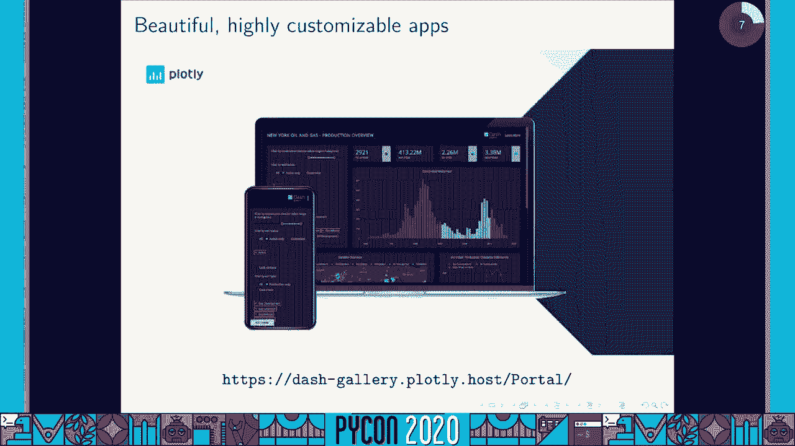

if __name__ == '__main__':
    app.run_server(debug=True)
```

如你所见，代码完全是 Python。开发者定义应用布局（包含各种组件如输入框、滑块、图表）和回调函数（当输入组件发生变化时触发的函数）。虽然底层有 JavaScript 运行，但开发者无需直接编写。

通过访问 [Dash 示例库](https://dash.gallery/Portal/)，可以看到更多复杂的应用，它们通常包含交互式图表，这些图表本身也能触发回调，更新应用的其他部分。

---

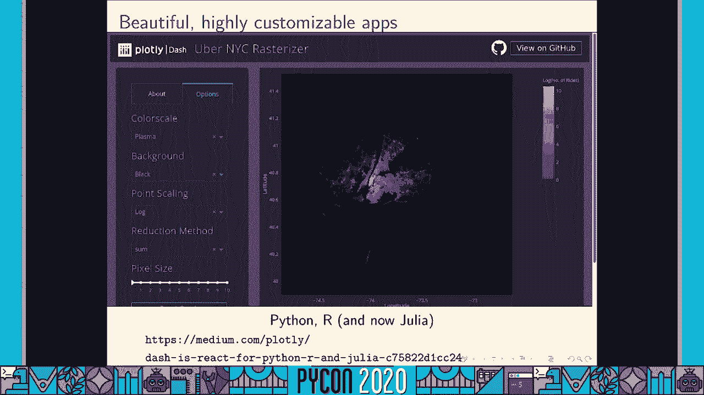

## Dash 的核心组件 🧩

了解了 Dash 的基本概念后，我们来看看构成 Dash 应用的核心组件有哪些。

Dash 提供了丰富的组件库：
*   **HTML 组件**：对应所有常见的 HTML 元素。
*   **核心交互组件**：例如滑块 (`dcc.Slider`)、下拉菜单 (`dcc.Dropdown`)、按钮 (`html.Button`)。
*   **交互式图表 (`dcc.Graph`)**：这是 Dash 应用的核心部分，基于 Plotly 库构建，图表本身支持点击、选择、悬停等交互事件。
*   **交互式数据表 (`dash_table.DataTable`)**：用于展示和操作表格数据。
*   **专业组件库**：如用于生物信息学的 `dash-bio`。

此外，由于 Dash 基于 React.js 框架构建，社区开发了成千上万的 React 组件（发布在 npm 上）。开发者可以轻松地将这些组件“包装”成 Dash 可用的 Python 组件，这极大地扩展了 Dash 的能力。

---

## 为图像标注构建 Dash 组件 🎨

上一节介绍了 Dash 的通用组件，本节我们聚焦于一个特定需求：图像标注。

为了快速实现图像标注功能，我们利用了现有的 JavaScript 库 **react-sketch**（其本身基于 fabric.js），并将其封装成了 Dash 组件 **`dash-canvas`**。

`dash-canvas` 组件提供了一个画布窗口，用户可以在背景图像上绘制曲线、矩形等几何图形。当用户绘制时，会触发 Dash 回调函数，该函数可以读取这些几何注释的坐标数据，供后续处理使用。

该组件同样采用 MIT 许可证，可以通过 pip 安装 (`pip install dash-canvas`)。它的 API 非常简单：

```python
import dash_canvas
from dash_canvas.utils import array_to_data_url

# 将图像数组转换为 Data URL 作为背景
img_data_url = array_to_data_url(image_array)

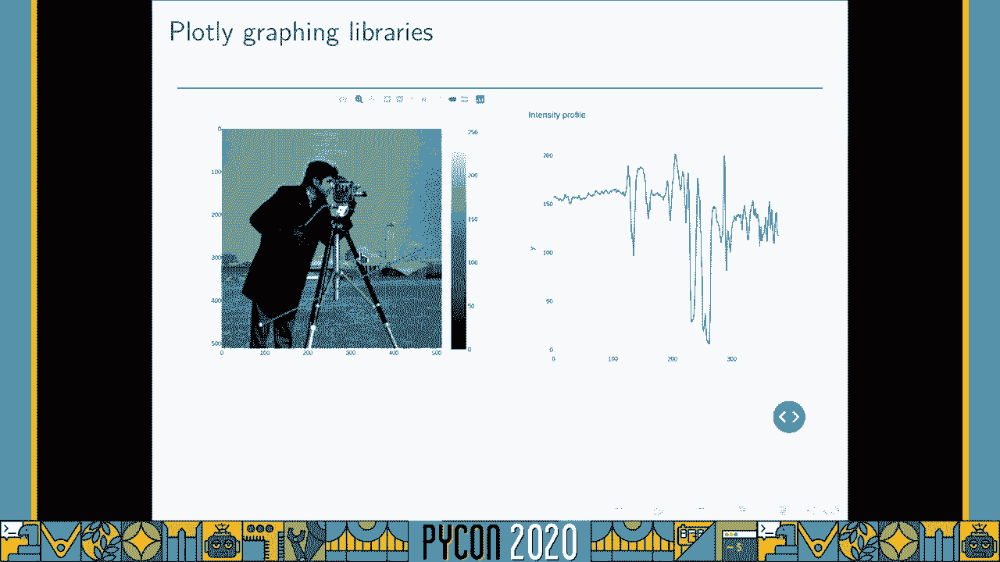

canvas = dash_canvas.DashCanvas(
    id='canvas',
    tool='line',  # 设置绘图工具，如 ‘line‘, ‘rectangle‘, ‘polygon‘
    lineWidth=5,
    lineColor='red',
    image_content=img_data_url
)
```

组件还提供了一些工具函数，用于处理画布上的注释数据。

---

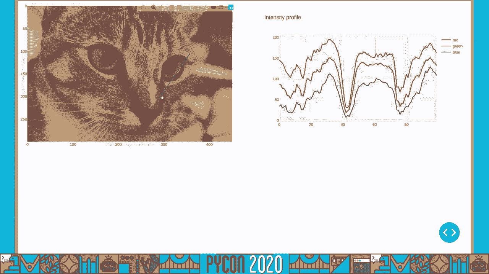

## 集成到 Plotly：更强大的交互图表 📈

我们有了专门的标注组件，但能否将标注功能直接集成到更流行的 Plotly 图表库中呢？答案是肯定的。

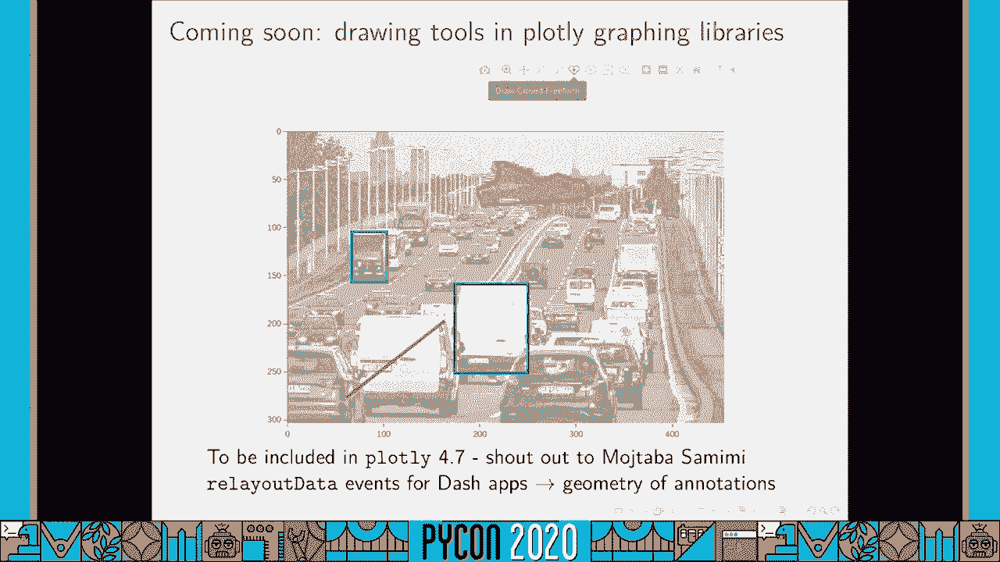

**Plotly** 本身就是一个高度交互的 Python 图表库。例如，在散点图中选择一部分数据点，可以同步高亮其他关联图表中的数据。它支持丰富的悬停信息展示。

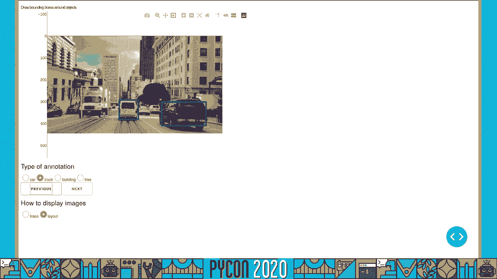

在现有版本的 Plotly 中，已经可以通过 `layout.shapes` 在图表上叠加几何形状（如线、矩形），并且这些形状是可编辑的。当形状被移动时，可以触发回调来更新其他内容（如图像强度剖面图）。

然而，用户无法通过 UI 界面直接添加新形状。

**即将发布的新版 Plotly** 将引入一个“绘图模式”工具栏，提供开放的路径、闭合路径、矩形、圆形等绘图工具。当用户绘制这些形状时，会触发 Dash 应用的回调，并捕获注释的几何数据。这意味着，未来直接在 Plotly 图表上进行图像标注将变得非常简单和原生。

---

## 图像处理引擎：scikit-image 🔬

我们已经能够捕获图像上的注释了，那么如何处理这些注释和图像本身呢？这就需要强大的图像处理库。

**scikit-image** 是 Python 中用于科学图像处理的工具箱。它是一个库，而非终端用户应用程序，专注于科学图像（如显微镜图像、遥感图像）的处理，支持二维和三维图像。

一个常被问到的问题是：scikit-image 和 OpenCV 有什么区别？
*   **scikit-image** 是纯 Python 库，与 Python 科学栈（NumPy, SciPy）集成更紧密，对 Python 用户更友好，拥有完善的文档和示例库。
*   **OpenCV** 主要用 C++ 编写，通过 Python 绑定调用，在速度上通常更优，但架构上更偏向计算机视觉的实时应用。

scikit-image 拥有一个庞大的贡献者社区和活跃的核心维护团队。

以下是一个使用 scikit-image 的简单示例：

```python
from skimage import io, filters

# 读取图像
image = io.imread('image.jpg')
# 应用高斯滤波去噪
filtered_image = filters.gaussian(image, sigma=1)
# 显示或保存处理后的图像
```

---

## 结合 Dash 与 scikit-image 进行图像处理 ⚙️

现在，让我们把前端交互（Dash）和后端处理（scikit-image）结合起来。

在 Dash 回调函数中，我们可以轻松调用 scikit-image 的功能来处理从 `dash-canvas` 或 Plotly 图表中获取的注释数据。

以下是几个结合使用的场景示例：

1.  **几何变换**：如果用户画了一条线来校正倾斜的地平线，回调函数可以计算倾斜角度，并调用 `skimage.transform.rotate` 来旋转图像。
2.  **测量工具**：当用户画了一条测量线，回调函数可以使用 `skimage.measure.profile_line` 函数获取该线上所有像素的坐标和强度值，从而绘制强度剖面图。
3.  **高级处理**：scikit-image 提供了丰富的功能，如图像去噪 (`skimage.restoration`)、特征提取 (`skimage.feature`)、图像分割 (`skimage.segmentation`) 和对象测量 (`skimage.measure`)。

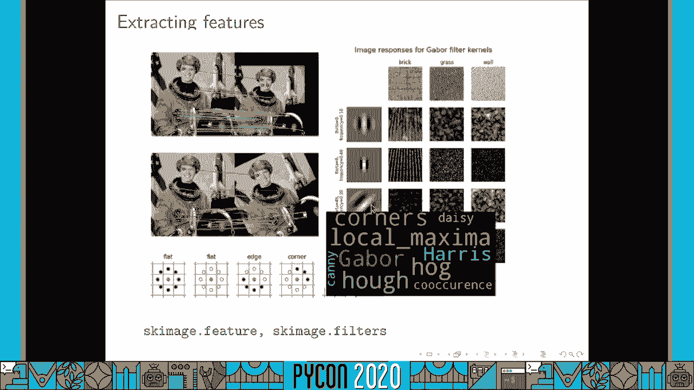

一个强大的演示是“智能剪刀”分割工具：用户粗略勾勒物体轮廓，回调函数调用 scikit-image 算法（如基于随机森林分类器的分割方法），自动计算出精确的物体边界。

---

## 文档与社区支持 📚

为了帮助你更好地开始，Dash 和 scikit-image 都投入了大量精力构建基于示例的文档。

*   **scikit-image 示例库**：网站上有大量示例，每个示例都包含代码和运行结果截图，是学习的绝佳资源。
*   **Dash 文档与社区**：Plotly 官方文档提供了大量教程和示例应用代码。此外，活跃的社区论坛是寻求帮助和分享经验的好地方。

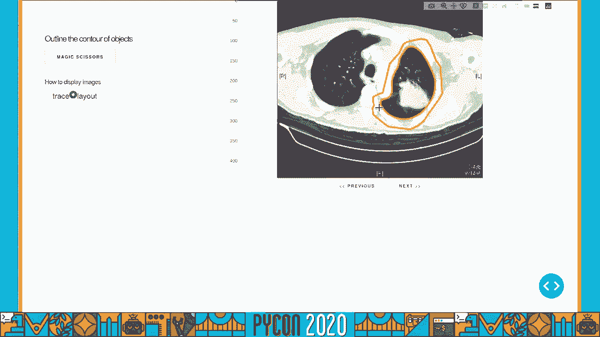

如果你想了解更多或参与贡献，可以通过以下方式联系：
*   **Emmanuelle Gouillart 的 Twitter**: [@EGouillart](https://twitter.com/EGouillart) （注：根据视频内容推测，实际ID请以视频显示为准）
*   **scikit-image 社区**：欢迎多样化的贡献者加入。

---

## 总结

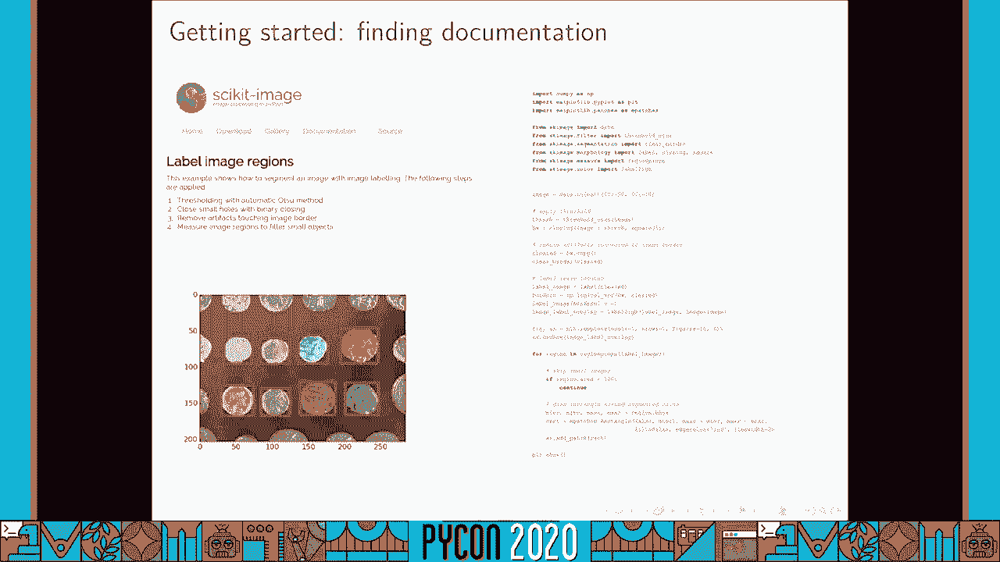

在本节课中，我们一起学习了如何构建用于图像数据的交互式应用。

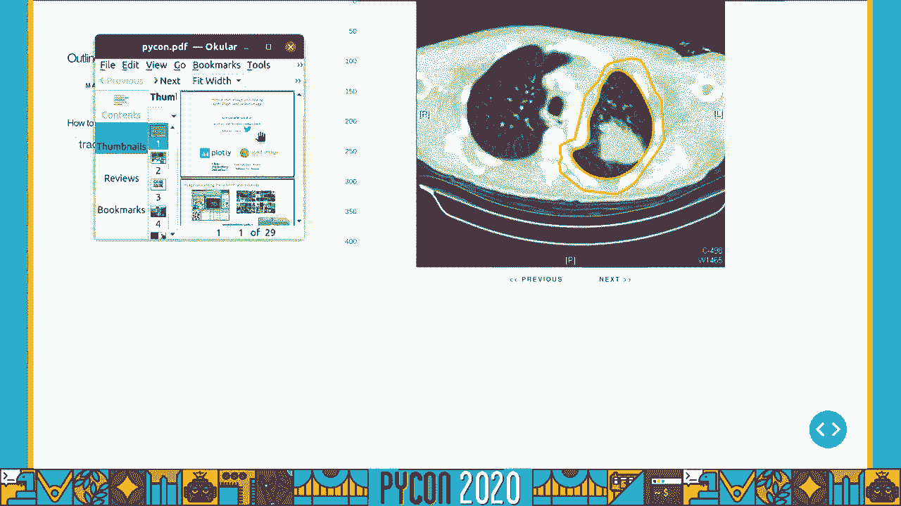

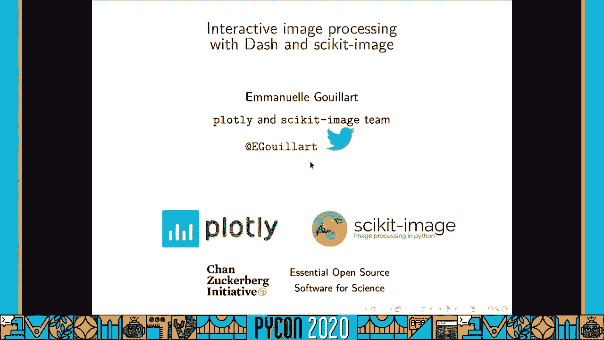

1.  我们首先认识了图像标注在机器学习和科学研究中的关键作用。
2.  接着，我们介绍了 **Dash** 框架，它允许我们仅用 Python 就创建出功能丰富的交互式 Web 应用。
3.  我们探讨了用于图像标注的专用 Dash 组件 `dash-canvas`，以及未来将直接集成到 **Plotly** 图表中的绘图工具。
4.  然后，我们引入了强大的图像处理库 **scikit-image**，它提供了从基础到高级的各类图像处理算法。
5.  最后，我们展示了如何将 Dash 的交互前端与 scikit-image 的处理后端无缝结合，通过具体的回调函数示例，实现了从图像标注到实时处理的全流程。

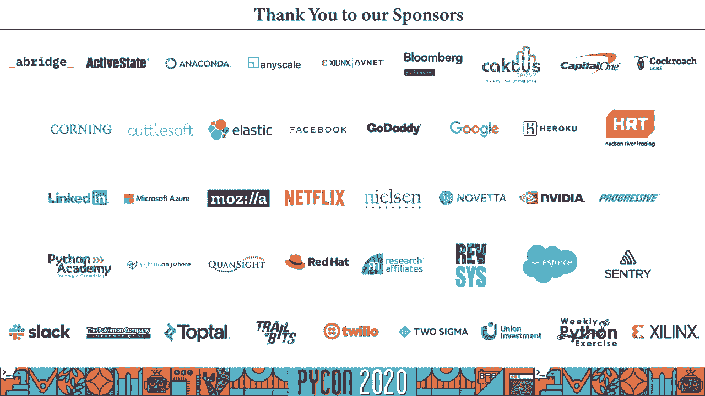

通过结合 Dash 和 scikit-image，你可以为各种图像分析任务创建出强大、易用且可定制的交互式工具，从而加速你的研究和开发流程。