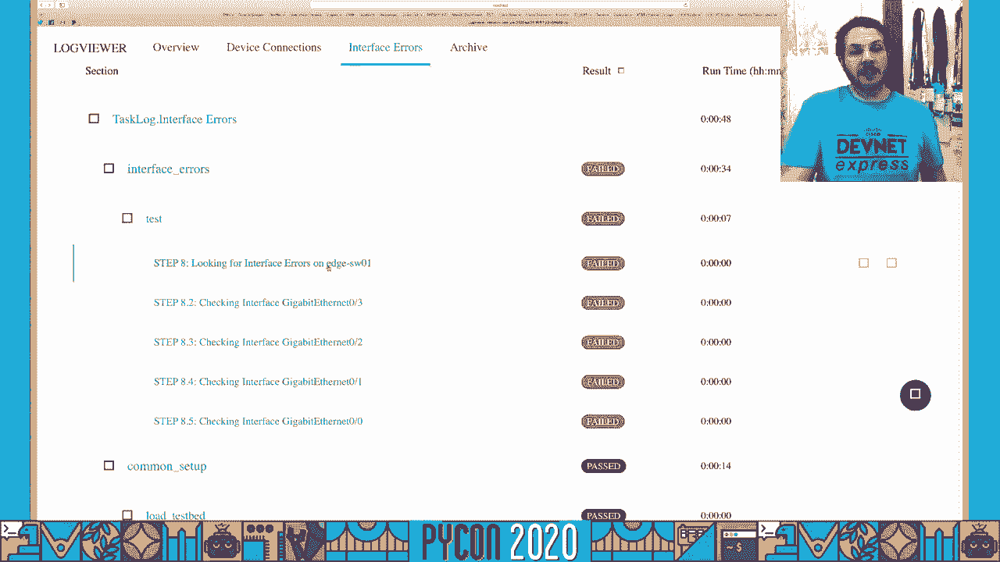
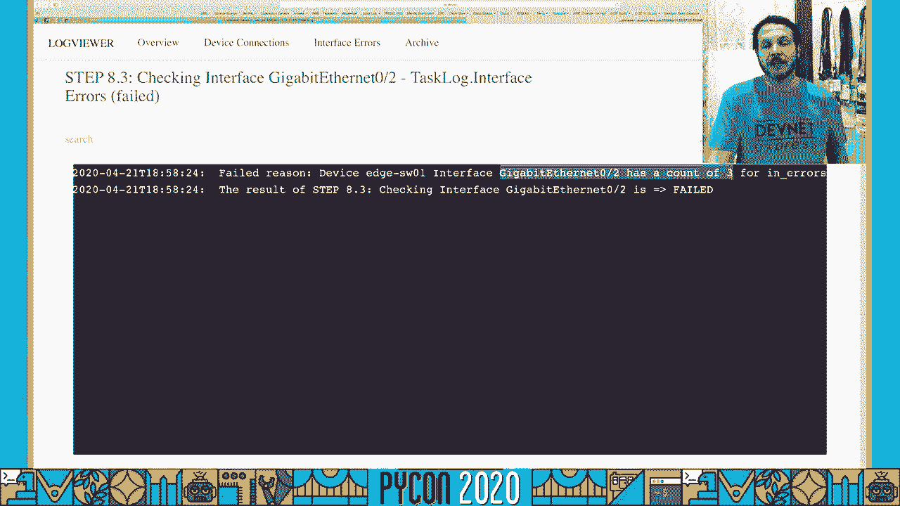
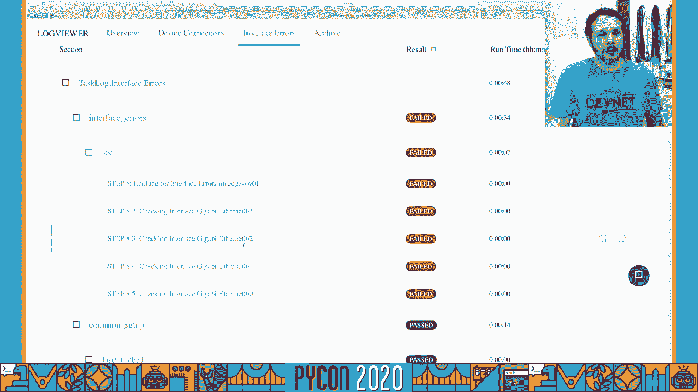
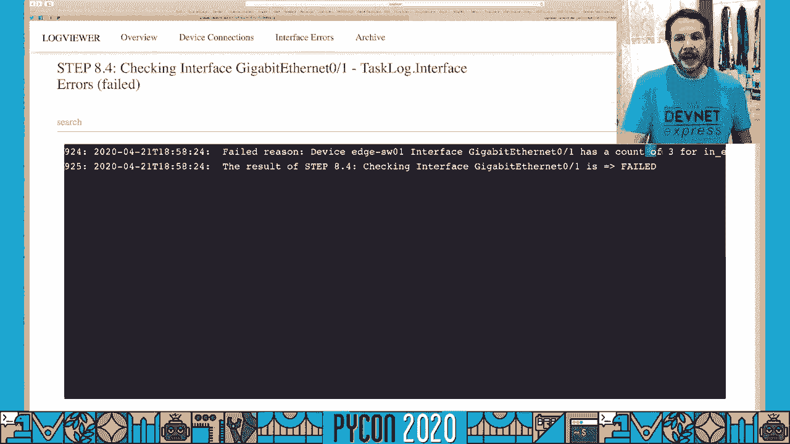
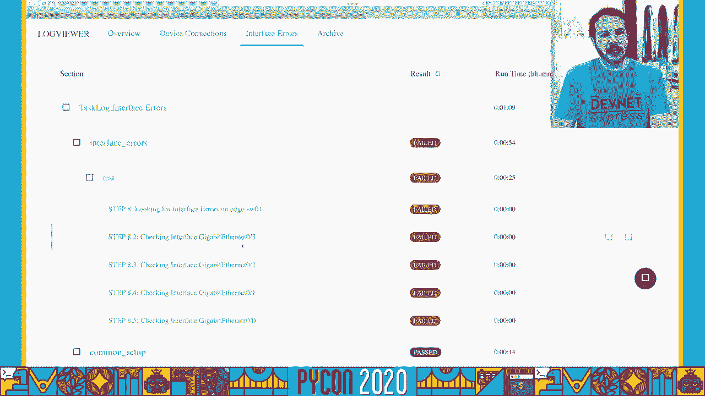
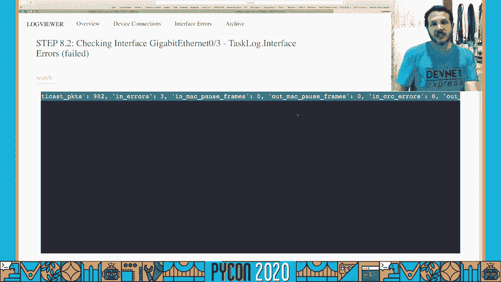
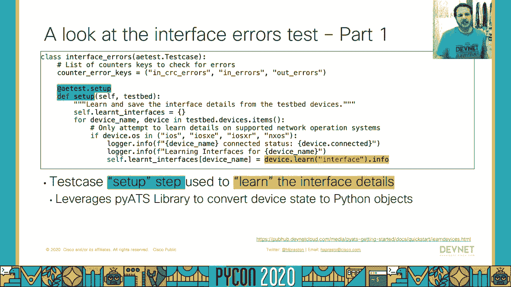

# 039：使用pyATS编写网络测试入门教程


## 概述

在本节课中，我们将学习如何使用思科的pyATS框架来编写和运行网络自动化测试。我们将了解pyATS的核心概念、项目结构，并通过一个实际演示来学习如何验证网络设备的连通性和接口状态。

## 什么是pyATS？它解决什么问题？

在深入探讨之前，让我们先思考一个经典问题：**现在网络瘫痪了吗？** 无论是网络工程师、自动化工程师还是依赖网络的软件开发人员，都可能遇到需要判断问题是否出在网络本身的情况。

传统的网络测试工具（如ping）虽然能验证基本连通性，但无法回答更深层次的问题，例如：是否存在延迟？链路上是否有拥塞？流量是否按预期路径转发？这些只是判断网络是否按预期运行的一小部分。

**pyATS** 及其生态系统就是为了解决这些问题而生的。它的核心思想是建立一个现代化的平台和框架，让我们能够编写可靠、全面的网络测试用例，以确保网络按照我们的期望运行。

pyATS生态系统在Apache License 2.0下开源，这意味着你可以访问其源代码，并为生态系统的各个部分做出贡献。

## pyATS生态系统剖析

pyATS生态系统是一个分层结构，让我们来深入了解其具体构成。

### 核心测试基础设施 (pyATS Core)

这是框架的基础层，即 `pyats` 库本身。它负责定义测试拓扑、跟踪测试执行、收集结果、生成日志，甚至发送邮件通知。它是运行测试所必需的框架，但本身不包含针对特定网络功能的测试逻辑。

### 可重用组件库 (Genie)

在核心基础设施之上是 **Genie** 库（以前称为“精灵”库）。它提供了一系列可重用的组件，可以轻松地插入到你的测试中。例如，如果你对BGP或OSPF等路由协议的状态感兴趣，使用Genie库功能可以轻松地在Python中查询网络设备，了解其运行或配置状态。

你无需担心解析CLI文本输出或在不同平台间规范化数据，所有这些都由Genie库自动处理。

### 业务逻辑与集成

在SDK和库之上，可以集成业务逻辑。许多团队正在研究如何将网络测试集成到更大的测试框架和CI/CD流水线中。pyATS生态系统可以轻松地与Jenkins、TestRail等工具系统集成，也可以作为Robot Framework或Ansible等基础设施即代码解决方案的一部分。

在本次教程中，我们将重点关注**核心测试基础设施**、**如何连接网络**以及**如何编写测试用例**。

## 如何获取与运行pyATS

和任何优秀的Python程序一样，你可以通过pip安装pyATS：

```bash
pip install pyats
```

pyATS需要在Linux或macOS上运行。如果你是Windows用户，可以通过Docker或虚拟机来支持。思科提供了包含运行pyATS所需一切的最新Docker容器。

pyATS现在推荐使用Python 3.5或更高版本，以充分利用Python和pyATS生态系统的所有功能。

## 网络测试项目包含什么？

一个最小的pyATS网络测试项目通常包含三个核心组件。

以下是这三个组件的简要介绍。

1.  **测试床文件 (Testbed YAML)**
    这是一个YAML文件，用于描述你的网络拓扑。它定义了你想测试哪些设备、它们的平台类型、连接细节（如IP地址、端口、使用Telnet还是SSH、认证凭证等）。你还可以选择性地描述设备之间的链路连接，这对于高级测试非常有用。

2.  **AE测试脚本 (aetest Script)**
    这是一个或多个Python文件，用于描述测试的设置、执行单个或多个测试用例以及清理工作。你可以将不同的测试逻辑分解到不同的AE测试脚本中，例如一个脚本检查设备连通性，另一个检查二层配置。

3.  **pyATS任务文件 (Job File)**
    这是一个Python文件，用于将**测试床文件**和**一个或多个AE测试脚本**组合在一起，定义一个完整的测试任务。任务文件负责运行所有指定的测试，并以可消费的方式报告结果。

安装pyATS后，CLI中内置了一些便捷命令来帮助你创建这些组件：
*   `pyats create testbed`：帮助你构建测试床YAML文件。
*   `pyats create project`：为你提供项目模板，包括任务文件和测试脚本的起点。

接下来，让我们更深入地看看每个组件。

### 深入理解测试床文件

测试床文件定义了网络中的所有设备。设备类型可以是路由器、交换机、防火墙，也可以是用于流量生成或验证的Linux终端主机。


每个设备都必须绑定到特定的平台和操作系统。pyATS支持多种思科网络操作系统（如IOS-XE, IOS-XR, NX-OS, ASA），也支持Linux以及其他厂商如Juniper和F5。

除了设备本身，还需要定义如何连接到设备。`Unicon`（通用连接器库）支持通过SSH、Telnet、NETCONF等多种协议进行连接，也支持通过终端服务器或代理连接。

### 深入理解AE测试脚本

AE测试脚本是一个Python文件。如果你使用过`pytest`或其他测试库，会发现一些相似之处。

每个AE测试脚本都包含三个阶段：

1.  **公共设置 (CommonSetup)**：在运行实际测试前需要完成的所有准备工作。通常在这里使用测试床文件连接到所有设备。
2.  **测试用例 (Testcase)**：脚本可以包含一个或多个测试用例，它们将按顺序执行。
3.  **公共清理 (CommonCleanup)**：测试执行完成后需要进行的清理工作。

这些阶段通过继承特定的类来定义：
*   `CommonSetup` 类用于公共设置。
*   继承自 `aetest.Testcase` 的类用于定义实际的测试用例。
*   `CommonCleanup` 类用于公共清理。

在每个测试用例类中，你可以使用装饰器定义任意数量的测试方法。因为是Python，所以你可以在测试脚本中做任何Python能做的事情。

### 深入理解任务文件

任务文件是一个简单的Python文件，它将我们希望作为单个任务运行的所有测试脚本集合在一起。你可以为不同的网络组件编写多个测试脚本，然后将它们合并到一个任务文件中运行。

任务文件通常非常简短，只需通过 `pyats.run` 函数执行每个测试脚本即可。你可以为每个测试脚本指定一个任务ID，用于在日志和通知中标识。如果未提供，pyATS会自动生成一个。



## 运行测试与查看结果





使用 `pyats run job` 命令来运行你的测试任务，你需要指定任务文件和要使用的测试床文件。



运行完成后，pyATS不仅会在CLI上显示输出，还会自动生成一个HTML日志视图。这个视图提供了更清晰、更易分析的结果展示，包括：
*   主仪表板：显示任务运行的关键统计信息和条形图。
*   任务详情：可以深入查看每个独立任务（即每个AE测试脚本）的执行情况。
*   测试步骤详情：点击特定测试步骤，可以查看pyATS在执行该测试时收集的所有实际输出。

这对于分析大型或复杂的测试运行结果尤其有用。

## 实战演示：验证网络健康状态

现在，让我们通过一个真实的演示来了解pyATS的实际应用。我们将测试一个由DevNet沙箱提供的示例网络，这是一个典型的三层网络（接入-分发-核心），并配置了基本的路由协议。



**演示目标：**
1.  **测试一：设备连通性** - 确认测试床中的所有设备（交换机、路由器、防火墙）均可访问。
2.  **测试二：接口错误检查** - 验证所有已连接接口上没有报告任何错误（如CRC错误、输入/输出错误）。在一个健康的网络中，通常不应看到接口错误。



### 演示步骤概述

1.  **准备环境**：设置包含网络设备凭证的环境变量。
2.  **运行测试任务**：使用 `pyats run job` 命令执行定义好的测试任务。
3.  **分析CLI结果**：初步观察测试通过和失败的情况。在演示中，我们发现某些接口的测试失败了。
4.  **使用HTML日志深入分析**：通过 `pyats logs view` 命令打开HTML日志查看器。我们可以清晰地看到：
    *   “设备连通性”测试全部通过。
    *   “接口错误”测试部分失败。点击失败项，可以精确看到是哪个设备的哪个接口出了问题，以及错误计数（例如，错误数=3）。
5.  **增强测试脚本以获取更多上下文**：为了更好排错，我们修改了测试脚本，在日志中额外输出接口的所有计数器信息（如广播包计数、八位字节计数等）。
6.  **重新运行并分析**：重新运行测试后，在HTML日志中，我们不仅能看到错误计数，还能看到完整的接口计数器状态，为网络故障排除提供了更丰富的上下文信息。

### 代码片段解析

让我们看一下演示中使用的部分关键代码概念。

**连接验证测试片段：**
pyATS核心基础设施提供了“步骤”的概念，用于组织测试逻辑。你可以使用 `aetest.loop.mark` 装饰器或上下文管理器来为每个设备或接口创建子步骤。在每个步骤中，根据条件（如 `device.connected` 是否为真）决定该步骤是通过还是失败。



**接口错误检查测试片段：**
这里展示了Genie库的强大之处。我们使用 `Interface` 这个Genie模型来获取设备的所有接口信息。该模型知道针对不同设备平台该执行什么命令，并自动将输出解析为易于操作的Python字典。

在测试逻辑中，我们：
1.  遍历测试床中的每个设备。
2.  使用Genie模型获取该设备的所有接口信息。
3.  遍历每个接口，检查我们感兴趣的错误计数器（如`in_crc_errors`）。
4.  如果任何错误计数器大于0，则将测试步骤标记为失败。
5.  对于没有计数器的接口（如环回接口），则将该步骤标记为跳过，以避免误报。

## 总结与后续步骤


本节课我们一起学习了使用pyATS进行网络自动化测试的基础知识。我们了解了pyATS生态系统（Core, Genie），掌握了构建测试项目的三个核心组件（测试床、AE脚本、任务文件），并通过实战演示学会了如何编写和运行测试来验证网络连通性与接口健康状态。

pyATS的功能远不止于此。如果你想继续深入学习，可以参考以下资源：
*   **官方文档**：访问 [pyATS官网](https://developer.cisco.com/pyats/) 阅读入门指南。
*   **代码仓库**：在 [GitHub](https://github.com/CiscoTestAutomation) 或 [PyPI](https://pypi.org/project/pyats/) 上探索代码。
*   **社区支持**：加入Cisco Webex Teams中的社区空间，与pyATS开发人员和其他用户交流。

如果你对网络自动化感兴趣，可以关注思科DevNet团队，获取更多学习资源和最新动态。


希望本教程能帮助你开始使用pyATS构建可靠、自动化的网络测试！