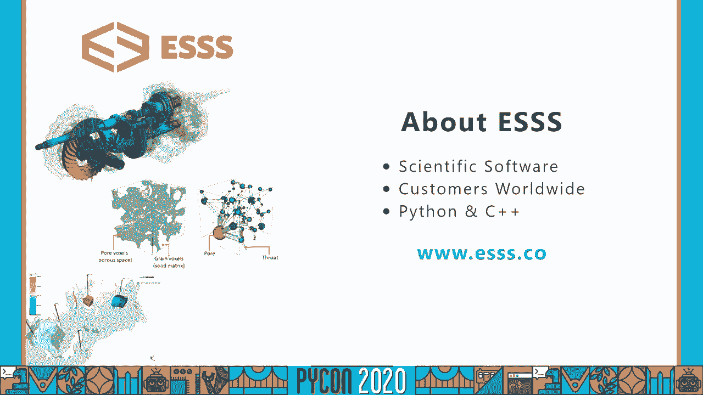
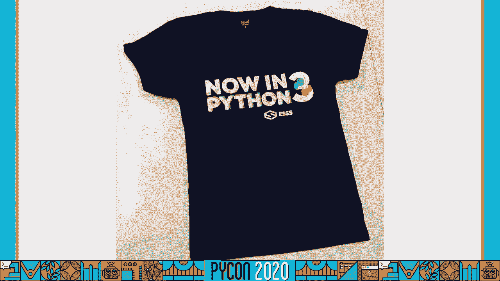
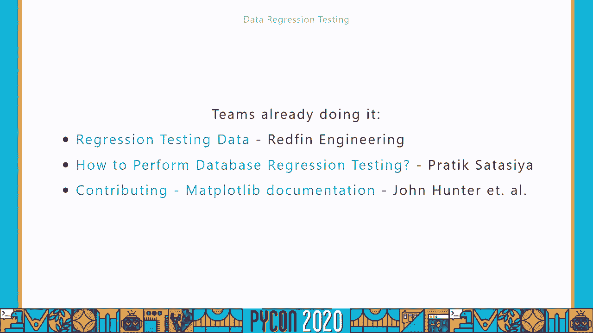
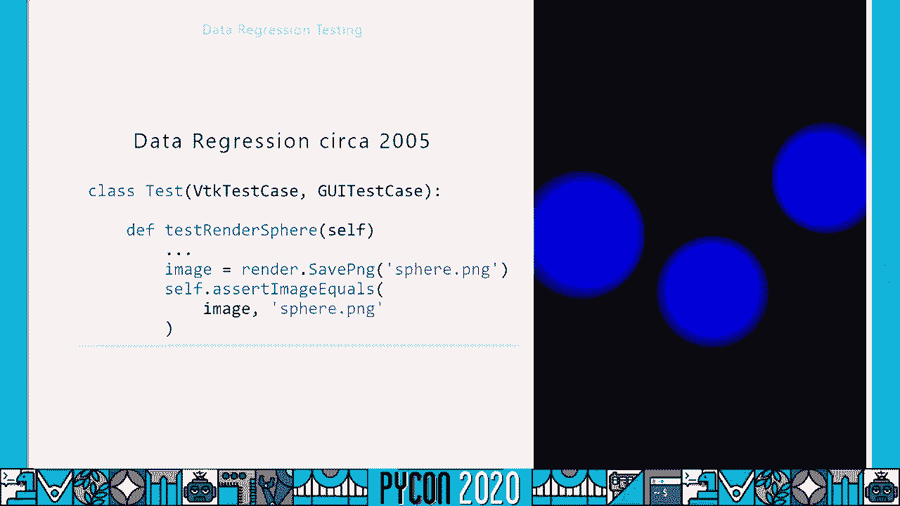
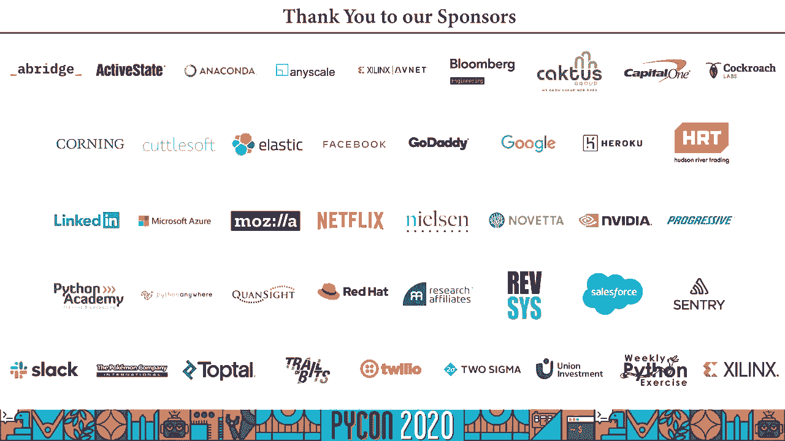

# 042：用更少的代码进行更全面的测试 🧪


在本教程中，我们将学习一种名为“数据回归测试”的测试方法。这种方法通过比较代码修改前后的输出数据，来高效地防止软件缺陷。我们将借助 `pytest` 框架及其插件 `pytest-regressions` 来实践这一方法，让测试变得更简洁、更健壮。

---

## 概述与背景

我叫 Igor T. Ghisi，来自巴西。我从2004年开始使用Python，并将其与C++结合用于计算流体动力学等领域的数值模拟。在2018年，我们成功地将一个大型代码库从Python 2迁移到Python 3，这主要得益于我们完善的测试覆盖。没有因迁移而产生的错误进入生产环境，整个过程花费了大约十个月。



为了庆祝这次成功的迁移，我们甚至制作了一件特别的T恤。




在本次分享中，我将介绍一种能显著提升测试效率和质量的实践：数据回归测试。

---

## 什么是数据回归测试？ 🤔

通常，回归测试的定义是：确保代码更改不会引入新的缺陷。但这几乎适用于所有测试。我一直在寻找一个更具体的定义，最终提出了“数据回归测试”这个概念。

**数据回归测试**通过比较被修改代码的输出数据与之前版本代码生成的数据，来防止软件功能回退。

虽然这个概念在经典软件测试书籍中不常见，但实践中已有广泛应用。例如，一些团队会进行“数据库回归测试”，比较不同代码分支填充的数据库。著名的绘图库 `matplotlib` 则使用“图像比较测试”，将生成的图像与参考图像进行比对。

接下来，我们将看到如何利用工具来轻松实现这种测试。

---



## 引入 `pytest-regressions` 工具 🛠️

我们最初为了测试3D渲染算法创建了一个辅助工具，后来将其发展为 `pytest` 的一个插件，并开源为 `pytest-regressions` 库。




本教程将展示如何利用 `pytest` 和 `pytest-regressions` 创建数据回归测试。即使你使用其他测试框架，这些概念也是通用的，你可以据此构建自己的工具。

为了更好地理解后续示例，建议你具备 `pytest` 基础知识和夹具（fixture）的使用经验。

你可以通过 `pip` 或 `conda` 安装 `pytest-regressions`：
```bash
pip install pytest-regressions
```

该插件主要提供四种夹具（fixture）：
1.  `file_regression`: 用于通用文本内容。
2.  `data_regression`: 用于基本Python数据类型（如字典、列表）。
3.  `image_regression`: 用于图像二进制数据。

我们将通过例子逐一了解它们。

---

## 示例一：数据回归测试基础 📊

上一节我们介绍了数据回归测试的概念和工具。本节中，我们来看看一个基础示例，了解如何用一行代码替换繁琐的断言。

假设我们有一个存储汽车规格的类，并且有一个根据名称创建汽车对象的方法。

**传统单元测试**可能像这样，需要逐一检查每个属性：
```python
def test_create_car_naive():
    car = create_car("Model S")
    assert car.name == "Model S"
    assert car.brand == "Tesla"
    assert car.range_km == 600
    # 很容易遗漏某个属性，例如 `displacement`
```

这种方法不仅繁琐，而且在属性众多或存在嵌套对象时难以维护。

**使用数据回归测试**，我们可以简化为：
```python
def test_create_car(data_regression):
    car = create_car("Model S")
    data_regression.check(car.to_dict()) # 假设car可序列化为字典
```

`data_regression.check()` 方法会将 `car.to_dict()` 的输出与一个参考文件进行比对。首次运行时，它会创建参考文件；后续运行时，若输出不一致，测试便会失败。

这使测试更完整、更易维护，并且在失败时能提供清晰的差异对比，便于调试。

---

## 示例二：处理无法“测试先行”的场景 🔄

在测试驱动开发（TDD）中，我们要求在编写生产代码前先写测试。但在许多场景（如数值模拟）中，我们无法预先知道精确结果。开发者通常通过可视化图表与已知基准进行对比来验证正确性。

在这种情况下，测试主要用于防止后续的回归错误，而数据回归工具就非常方便。

我们以**二次贝塞尔曲线**的实现为例。即使我知道算法原理，手动计算100个点的坐标也不现实。我唯一的参考可能是一张来自维基百科的示意图。

我实现了算法并绘制了曲线，它“看起来”是对的。但如何用测试确保其正确性呢？

1.  **弱测试**：只检查起点和终点。
2.  **稍好的测试**：手动选取并断言曲线上的几个中间点坐标，但这不优雅且覆盖不全。
3.  **数据回归测试**：将算法生成的整条曲线（100个点的坐标）全部进行回归检查。

以下是使用 `data_regression` 的测试代码：
```python
def test_quadratic_bezier(data_regression):
    points = quadratic_bezier([(0,0), (1,1), (2,0)], num_points=100)
    # 将点列表转换为可序列化的格式，例如字典列表
    data = [{"x": p[0], "y": p[1]} for p in points]
    data_regression.check(data)
```
首次运行，插件会在特定目录创建参考文件（一个CSV或JSON文件）。测试通过。
如果后续代码引入bug，导致输出变化，测试将失败，并显示详细的差异对比。

你还可以为数值比较设置容差（tolerance），以应对浮点数精度变化：
```python
data_regression.check(data, tolerances={‘x‘: 1e-3, ‘y‘: 1e-3})
```

---

## 示例三：文件与文本回归测试 📄

上一节我们使用 `data_regression` 处理了结构化数据。本节中，我们来看看 `file_regression` 夹具，它适用于任何文本内容。

假设我们有一个将HTML片段转换为Markdown的函数。
```python
def test_html_to_markdown(file_regression):
    html = "<h1>Title</h1><p>Hello <strong>World</strong></p>"
    markdown = html_to_markdown(html)
    file_regression.check(markdown, extension=".md")
```
`extension` 参数确保生成的文件具有正确的后缀。首次运行创建参考文件，后续运行进行比对。

当测试失败时，错误信息会打印出文本差异，并生成一个HTML格式的差异对比文件链接，这在使用CI/CD系统时尤其利于调试。

---

### 在Web框架测试中的应用 🌐

`file_regression` 也非常适合测试基于模板的Web视图（如Flask、Django）。一个简单但脆弱的测试是直接断言整个HTML响应字符串。

更好的方法是使用如 `BeautifulSoup` 这样的解析库，只提取需要回归测试的核心内容（如`<body>`标签），忽略样式、脚本等可能频繁变动但不影响功能的元数据。
```python
def test_hello_view(file_regression):
    client = app.test_client()
    response = client.get(‘/hello‘)
    html = response.get_data(as_text=True)

    soup = BeautifulSoup(html, ‘html.parser‘)
    body_content = str(soup.body) # 只回归测试body部分

    file_regression.check(body_content, extension=".html")
```
这样能减少回归文件的大小，并使测试更专注于业务逻辑。

---

## 示例四：测试Web API 🔌

数据回归测试同样适用于测试RESTful API。假设我们有一个返回英雄列表的API。

使用 `pytest-flask` 或类似的工具可以轻松获取API的JSON响应，然后使用 `data_regression` 进行检查。
```python
def test_get_single_hero(client, data_regression):
    response = client.get(‘/api/hero/1‘)
    data_regression.check(response.get_json())

def test_get_all_heroes(client, data_regression):
    response = client.get(‘/api/hero‘)
    data_regression.check(response.get_json())
```
这确保了API端点返回的数据结构始终符合预期。

---

## 示例五：图像回归测试 🖼️

最后，我们来看 `image_regression` 夹具，它用于比较图像。

假设我们要测试一个用 `matplotlib` 生成3D图形的函数。
```python
def test_3d_plot(image_regression):
    fig = create_complex_3d_plot()
    # 将图形保存到内存缓冲区
    buf = io.BytesIO()
    fig.savefig(buf, format=‘png‘)
    buf.seek(0)
    image_data = buf.read()

    image_regression.check(image_data)
```
首次运行生成参考图像。后续运行时，插件会逐像素比较RGB值。

你可以通过 `diff_threshold` 选项设置一个阈值，以忽略微小的、可接受的差异（例如不同操作系统间字体渲染的细微差别）。

---

## 高级技巧与配合工具 🧰

### 1. 批量更新回归文件
当你进行了一项影响广泛的更改（如修改了CSS类名），需要更新所有相关回归文件时，可以使用 `--force-regen` 选项运行测试套件，强制重新生成所有参考文件。

### 2. 与 `pytest-datadir` 配合使用
`pytest-datadir` 插件能方便地管理测试所需的支持文件。你可以创建一个与测试文件同名的文件夹，将支持文件放入其中，在测试中通过 `datadir` 夹具访问。
```python
def test_count_lines(datadir):
    file_path = datadir / "input.txt"
    line_count = count_lines(file_path)
    assert line_count == 42
```
它会在临时目录中操作文件，避免污染源文件。

### 3. 与 `SQLAlchemy` 和 `marshmallow` 配合使用
`marshmallow` 是一个序列化库。结合 `SQLAlchemy` 模型和 `marshmallow`，可以轻松地将数据库模型实例序列化为字典，然后进行数据回归测试。
```python
class UserSchema(ma.SQLAlchemyAutoSchema):
    class Meta:
        model = User
        include_fk = True # 序列化外键关联对象

def test_user_model(data_regression):
    user = User(...) # 创建测试用户对象
    schema = UserSchema()
    data = schema.dump(user)
    data_regression.check(data)
```
这极大地简化了复杂数据模型的测试。

---

## 总结与资源 📚

在本教程中，我们一起学习了数据回归测试。我们定义了其概念，并通过 `pytest-regressions` 插件实践了四种主要的回归测试：
*   `data_regression`: 用于基本Python数据类型。
*   `file_regression`: 用于通用文本内容。
*   `image_regression`: 用于图像二进制数据。
我们还介绍了如何与 `pytest-datadir` 和 `marshmallow` 等工具配合使用，以应对更复杂的测试场景。

如果你想深入学习 `pytest`，官方文档是极好的起点。我也推荐 Bruno Oliveira 的《*pytest Quick Start Guide*》一书，它由一位 `pytest` 核心开发者撰写，内容非常详实。

感谢Python社区和组织者。如果你有任何问题，可以通过Twitter或视频评论区联系我。本教程的幻灯片和示例源代码可以在我的GitHub主页找到。



