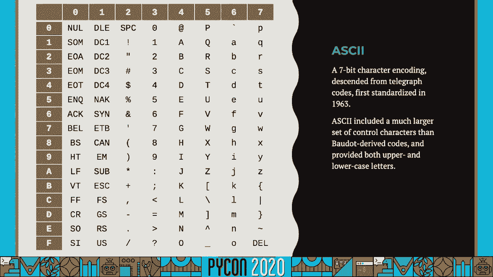
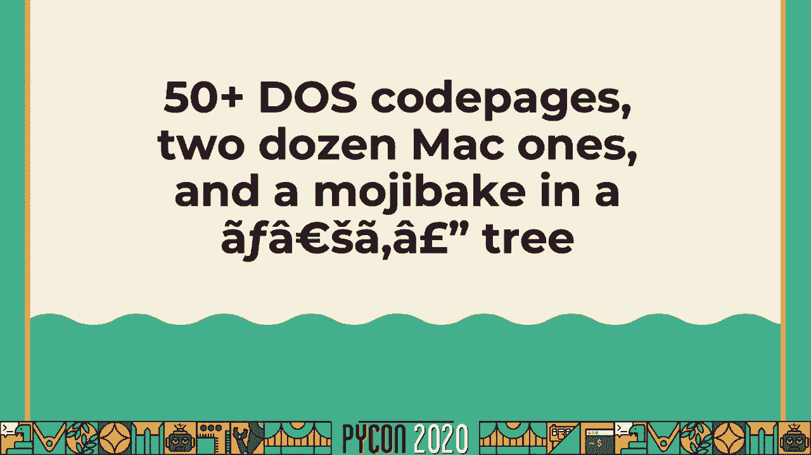
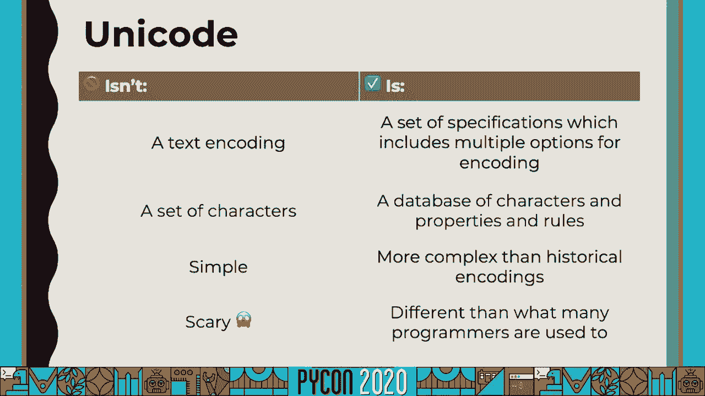
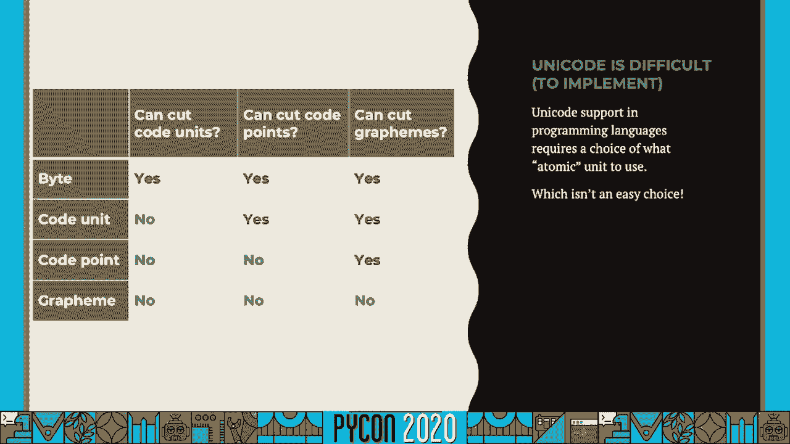
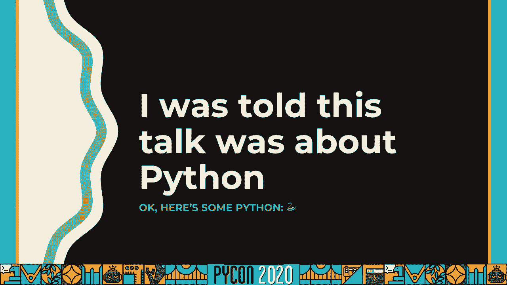
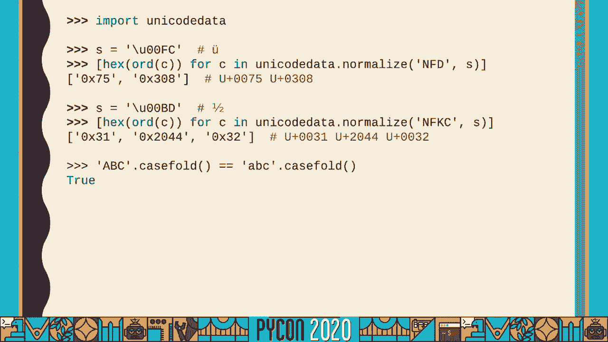
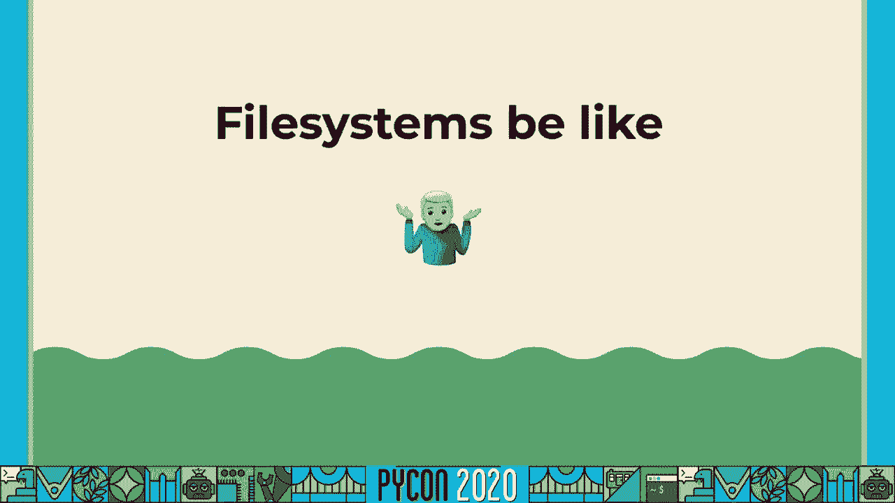
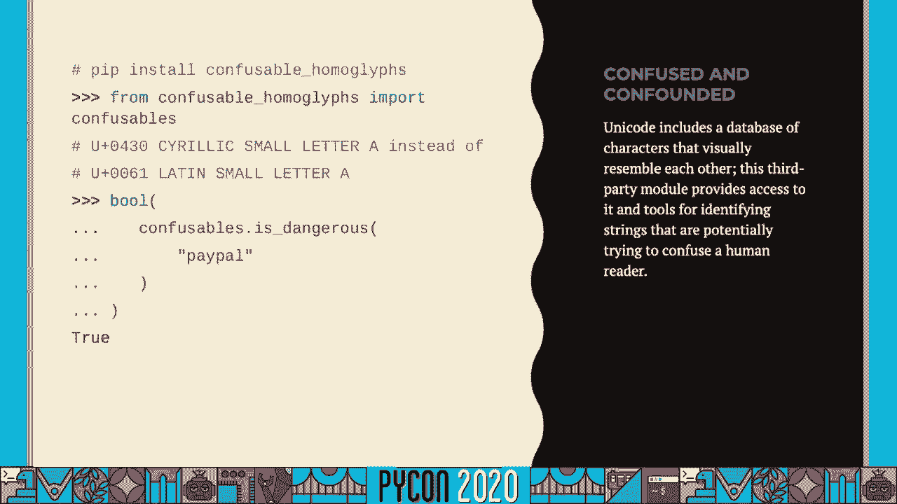

# 044：一条🐍的 Unicode 指南


在本教程中，我们将学习 Unicode 的基础知识、它的复杂性，以及如何在 Python 中有效地处理 Unicode 文本。我们将从历史背景开始，逐步深入到核心概念和实际应用，帮助你消除对 Unicode 的恐惧，并编写更健壮的代码。


## 概述：为什么需要 Unicode？

Unicode 是一个旨在为世界上所有书写系统的每个字符提供唯一数字代码的标准。在计算机早期，存在许多互不兼容的字符编码（如 ASCII、GBK、ISO-8859 系列），导致文本交换时出现乱码。Unicode 的出现就是为了解决这个问题，它提供了一个统一的字符集。



然而，Unicode 的复杂性常常让人望而生畏。本教程将解释这些复杂性的来源，并展示 Python 如何帮助我们管理它们。




---

## 历史背景：从电报到 Unicode



上一节我们概述了 Unicode 的目标，本节中我们来看看 Unicode 是如何从早期的文本表示系统演变而来的。

书写系统历史悠久且多样，但计算机文本处理的历史相对较短。早期的电子文本传输系统，如摩尔斯电码和博多码（ITA2），引入了使用点和划（或穿孔纸带）来表示字符和控制信号的概念。这些系统影响了后来的计算机编码。

ASCII（美国信息交换标准代码）是早期计算机中占主导地位的编码。但它只能表示128个字符，主要针对英语。世界其他地区开发了各自的编码（如 GB2312、Shift_JIS、KOI8-R），导致了“编码地狱”——你无法确定一段字节流使用的是哪种编码。

如果我们能有一个普遍认可的解决方案就好了？这就是 Unicode 的目的。

---

## Unicode 核心概念解析

上一节我们了解了编码混乱的历史，本节中我们来看看 Unicode 究竟是什么，并澄清一些关键术语。

许多人误以为 Unicode 就是一种编码（如 UTF-8）。更准确的理解是：**Unicode 是一个描述字符及其属性的标准数据库和规范**。它定义了字符的标识、名称、属性以及如何编码成字节流（如 UTF-8、UTF-16）的规则。

为了深入讨论，我们需要明确几个核心术语：

*   **代码点**：Unicode 给每个字符分配的唯一数字标识。通常写作 `U+` 后跟十六进制数字，例如 `U+0041` 代表拉丁字母 ‘A’。代码点是抽象的概念。
*   **编码**：将代码点转换为字节序列的规则。**UTF-8** 是最常见的编码。
*   **代码单元**：在特定编码中使用的固定大小的基本单元。例如，UTF-8 的代码单元是 8 位（1字节），UTF-16 的是 16 位（2字节）。
*   **字位簇**：对用户来说的一个“可视字符”。它可能由一个或多个代码点组成（例如 `‘é’` 由 `U+0065` (e) 和 `U+0301` ( ́ ) 组成）。

一个重要结论是：**一个“字符”（对用户而言）并不总对应一个代码点，一个代码点也不总对应一个“字符”**。理解这一点是掌握 Unicode 复杂性的关键。

---

## Unicode 的复杂性体现

上一节我们定义了核心概念，本节中我们通过具体例子来看看 Unicode 的复杂性体现在哪里。



以下是 Unicode 复杂性的几个主要方面：



1.  **组合字符**：同一个可视字符可能有多种表示方式。
    *   **预组合形式**：用一个代码点表示，如 `U+00E9` (é)。
    *   **分解形式**：用多个代码点（基础字符 + 组合标记）表示，如 `U+0065` (e) + `U+0301` ( ́ )。
    *   这两种形式在 Unicode 中被认为是**规范等价**的。

2.  **规范化**：为了处理等价序列，Unicode 定义了**规范化**。主要有四种形式：
    *   **NFC**：尽可能使用预组合字符。
    *   **NFD**：尽可能使用分解形式。
    *   **NFKC**：在兼容性等价基础上进行组合（更激进，可能丢失信息）。
    *   **NFKD**：在兼容性等价基础上进行分解。
    *   对于大多数用途，**NFKC** 是一个安全的选择。

3.  **大小写处理**：大小写转换并非简单的一对一映射。
    *   Python 中的 `.upper()` 和 `.lower()` 方法用于大小写转换。
    *   对于不区分大小写的比较，应使用 **`.casefold()`** 方法，它比 `.lower()` 更彻底、更一致。

4.  **可变宽度编码**：不同的编码使用不同数量的字节存储代码点。
    *   **UTF-8**：兼容 ASCII，英文字符1字节，中文通常3字节。
    *   **UTF-16**：对于基本多语言平面（BMP）内的字符用2字节，之外的（如许多表情符号）用4字节（代理对）。
    *   **UTF-32**：每个代码点固定使用4字节，简单但空间效率低。

---

## Python 中的 Unicode 支持

上一节我们探讨了 Unicode 本身的复杂性，本节中我们来看看 Python 是如何处理这些问题的。




Python 3 极大地简化了 Unicode 处理。与 Python 2 不同，Python 3 的 `str` 类型直接表示 **Unicode 代码点序列**。还有一个独立的 `bytes` 类型用于处理原始字节。

**编码与解码**：
*   **解码**：将字节序列 (`bytes`) 根据特定编码转换为字符串 (`str`)。`bytes_obj.decode(‘utf-8’)`
*   **编码**：将字符串 (`str`) 根据特定编码转换为字节序列 (`bytes`)。`str_obj.encode(‘utf-8’)`

**黄金法则**：在程序的**边界**（如读写文件、网络通信）进行编码/解码。在程序内部，始终使用 `str` 对象进行处理。

Python 标准库提供了强大的 Unicode 工具：
*   `unicodedata` 模块：查询字符名称、类别等属性。
    ```python
    import unicodedata
    print(unicodedata.name(‘A’)) # 输出：LATIN CAPITAL LETTER A
    print(unicodedata.category(‘9’)) # 输出：Nd (数字，十进制)
    ```
*   `str` 方法：`.isalpha()`, `.isdigit()` 等都是基于 Unicode 属性的。
*   规范化：`unicodedata.normalize(form, unistr)`
    ```python
    from unicodedata import normalize
    combined = ‘é’ # U+00E9
    decomposed = normalize(‘NFD’, combined) # 得到 ‘e\u0301’
    ```



**注意**：Python 字符串按代码点索引和切片。对于由多个代码点组成的字位簇（如 `‘👨👩👧👦’`），直接 `len()` 或切片可能会得到意外结果。此时可以使用第三方库（如 `regex`）来按字位簇处理。

---

## 常见陷阱与最佳实践

上一节我们介绍了 Python 提供的工具，本节中我们总结一些常见的陷阱和应对的最佳实践。

1.  **文件系统路径**：在某些系统上，文件名可能是无效的字节序列。Python 会尽力处理（使用“代理转义”机制），但最安全的方式是尽早知晓系统的文件系统编码。
2.  **网络数据**：始终明确指定编码。HTTP 头、数据库连接等都应设置正确的字符集（通常是 UTF-8）。
3.  **正则表达式**：默认的 `\d`, `\w`, `\s` 等匹配的是 **Unicode 字符类别**，而不仅仅是 ASCII 范围。如果需要限制，请明确写出，例如 `[0-9]` 匹配 ASCII 数字，`\d` 匹配任何语言的数字字符。
4.  **比较与排序**：简单的 `==` 比较可能因为规范化形式不同而失败。在比较前考虑是否需要先进行规范化。对于标识符（用户名、变量名）的比较，可能需要更复杂的规则（如 Unicode 技术报告 #36）。
5.  **安全考虑**：警惕**视觉混淆字符**（如 `Cyrillic` 字母 ‘а’ 看起来像拉丁字母 ‘a’）。有第三方库（如 `confusable-homoglyphs`）可以帮助检测。

---

## 总结



在本教程中，我们一起学习了 Unicode 的完整图景：


1.  **起源与目标**：Unicode 是为了解决多种编码并存的问题而生的统一字符标准。
2.  **核心概念**：理解了**代码点**、**编码**（如 UTF-8）、**代码单元**和**字位簇**的区别，这是驾驭 Unicode 的基础。
3.  **复杂性来源**：认识了**组合字符**、**规范化**、**大小写映射**和**可变宽度编码**带来的挑战。
4.  **Python 3 的支持**：Python 3 将 `str` 定义为 Unicode 代码点序列，并通过 `encode`/`decode`、`unicodedata` 模块等提供了强大支持。
5.  **黄金法则与最佳实践**：在程序边界处理编码/解码，内部使用 `str`；注意文件系统和网络数据的编码；谨慎使用正则表达式和进行字符串比较。


记住，Unicode 的复杂性源于人类书写系统的丰富性。Python 提供了良好的工具来管理这种复杂性。理解这些原理后，你就能更有信心地编写出能够正确处理全球文本的应用程序。不必再害怕 Unicode！