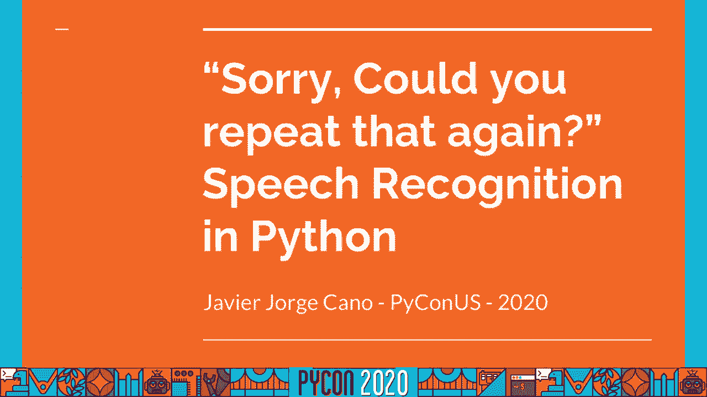
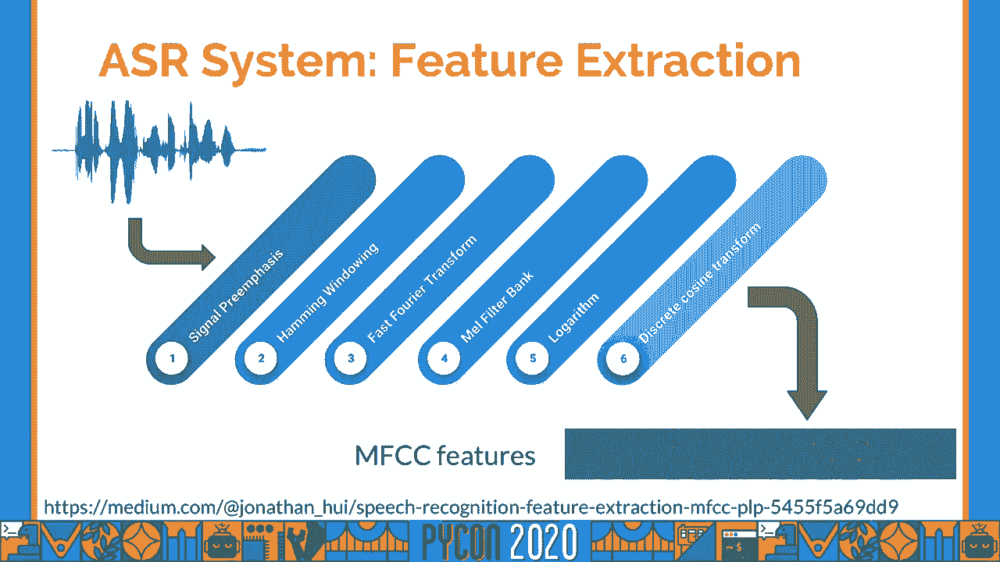
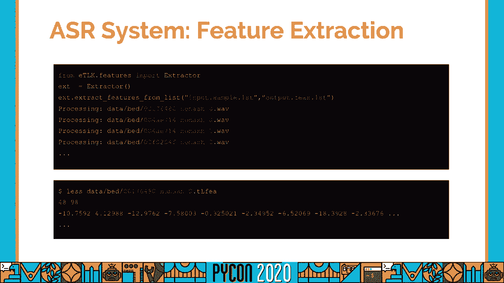
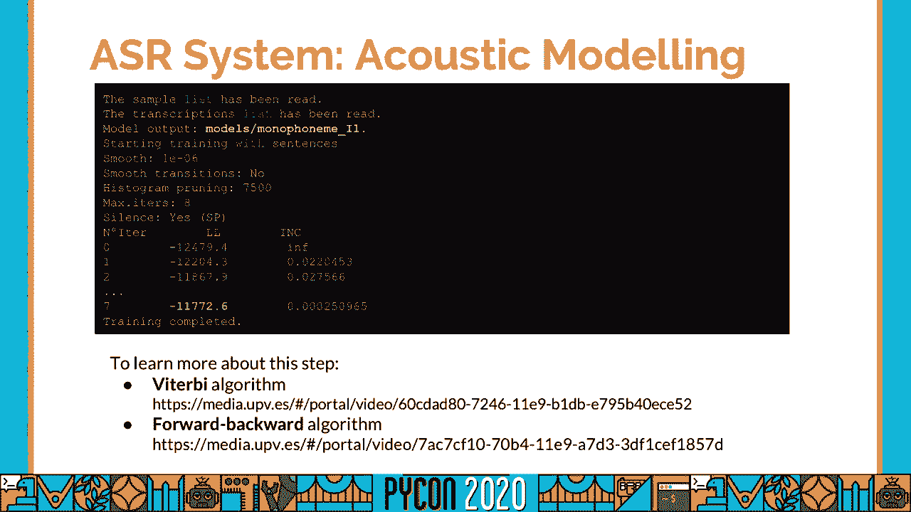
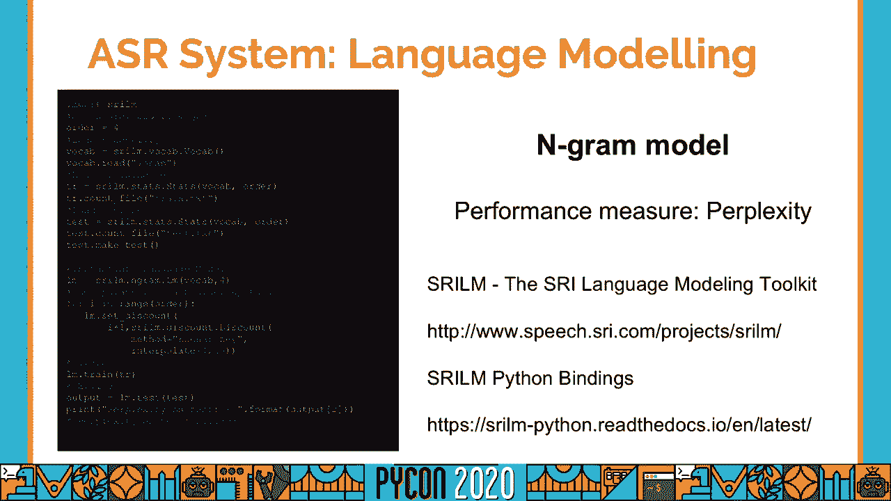
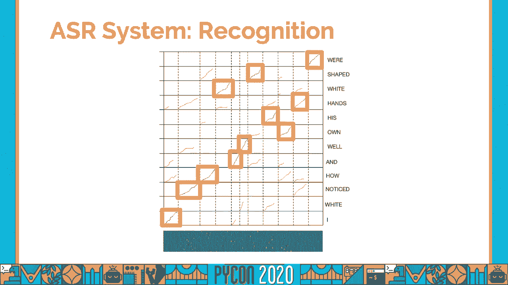
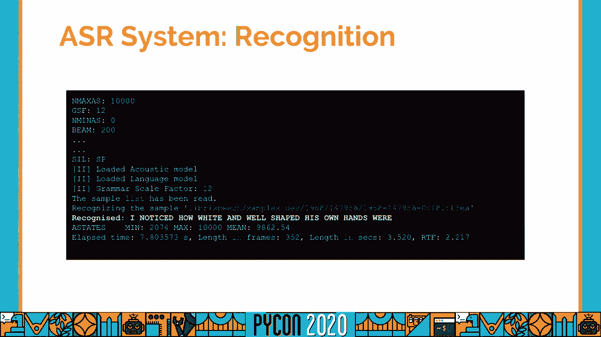

# 045：与哈维尔·豪尔赫·卡诺对话


## 概述
在本教程中，我们将学习自动语音识别的基本概念、核心组件和开发流程。我们将了解如何获取和处理数据，如何构建声学模型和语言模型，以及如何将它们结合起来进行语音识别和系统评估。



---

## 语音识别简介：为何重要？

语音识别，或称自动语音识别，其目标是将语音信号转换为文本。虽然市面上已有许多成熟的语音助手，但该领域仍面临诸多挑战。

语言多样性是主要挑战之一。全球有数千种语言，但主流语音服务仅支持其中一小部分。许多语言缺乏相应的语音识别工具，这影响了文化的传承与多样性。

技术层面也存在挑战。例如，在教育内容场景中，系统需要处理复杂的专业词汇、不同的硬件录音条件、多人对话以及多语言混合的情况。

此外，语音识别是更宏大语言技术图景的一部分。更好的ASR系统可以提升语音翻译、自动字幕生成等下游任务的性能。

---

## 构建ASR系统：所需资源

上一节我们介绍了语音识别的意义与挑战，本节中我们来看看构建一个ASR系统需要哪些基础资源。

构建ASR系统主要需要三类资源：
1.  **音频文件**：包含语音信号的原始数据。
2.  **转录文本**：与音频文件对应的、准确的文字内容。
3.  **词典**：为所考虑的单词提供音素级别的语音转录。

以下是获取这些开放资源的途径：
*   **语音命令数据集**：来自谷歌，适合初学者入门，任务是识别孤立的单词或短语。
*   **LibriSpeech**：包含大量朗读语音，适合进行更复杂的句子级识别任务。
*   **Common Voice项目**：由Mozilla发起，涵盖多达40种不同的语言，是探索多语言ASR的宝贵资源。

---

## 数据准备与特征提取



既然我们知道了在哪里可以找到资源，接下来我们需要学习如何准备这些数据以供模型使用。



数据准备步骤包括下载数据、进行质量控制（检查音频质量与文本格式），以及对原始数据执行必要的转换。

以下是执行数据准备可以使用的工具：
*   **音频转换**：可以使用 `pydub` 或 `sox` 库。
*   **文本规范化**：可以直接使用Python字符串处理，或使用 `NLTK` 进行更复杂的操作。
*   **词典获取**：如果数据集中未提供，可以使用 `LTK` 等工具获取额外的语言资源。

原始音频波形数据包含的信息不够丰富，模型难以直接理解。因此，我们需要进行特征提取，将数据转换为更有意义的表示，例如从时域转换到频域。

一个常用的特征是**梅尔频率倒谱系数**。特征提取过程将原始音频转换为一系列特征向量（或称“帧”），这些向量能更好地反映声音的模式。

```python
# 特征提取示例（概念性代码）
# 输入：原始音频波形
# 过程：通过预加重、分帧、加窗、FFT、梅尔滤波、DCT等步骤
# 输出：MFCC特征向量序列
mfcc_vectors = extract_mfcc(audio_signal)
# 输出形状可能为 (98, 13)，表示98帧，每帧13维MFCC特征
```

---

## 声学模型：从声音到音素

我们已经讨论了资源及其转换方法，现在进入模型构建环节。首先从声学模型开始。

声学模型负责将声音特征映射到音素或单词。考虑到同一单词的发音存在时间上的变化，我们需要一个能建模时序的模型。



隐马尔可夫模型是传统ASR中常用的声学模型。HMM将语音产生过程模拟为一个有限状态机，包含状态、状态间的转移以及从状态发射出观测特征（如MFCC向量）的概率。

一个音素可以用一个三状态的HMM来建模，分别对应音素的开始、中间和结束部分。这些HMM可以串联起来形成单词的模型。

发射概率最初可以用高斯混合模型来建模，但当前最先进的方法是使用**深度神经网络**与HMM结合的混合系统。

```python
# HMM训练示例（概念性代码）
# 定义HMM参数：状态数、转移概率、发射概率分布（如GMM）
hmm_model = initialize_hmm(num_states=3, gmm_components=16)
# 使用提取的特征和对应的音素标注进行训练
trained_hmm = train_hmm(hmm_model, mfcc_vectors, phone_labels)
```

---



## 语言模型：从单词到句子

上一节我们介绍了如何用声学模型识别音素和单词，本节我们来看看如何将这些单词组织成合乎语法的句子，这就需要语言模型。

语言模型的核心是为一个词序列分配概率，即评估一个句子在语言中出现的可能性。它根据上文来预测下一个词出现的概率。

最经典的语言模型是 **n-gram模型**，它基于前n-1个词来预测第n个词。更先进的方法则使用**循环神经网络**或**Transformer**等神经网络，将上文编码为向量后再进行预测。

语言模型还可以被表示为一个图结构，其中节点代表上下文，边代表单词及其概率，这便于与声学模型结合进行解码。

```python
# 语言模型评估示例（概念性代码）
# 训练一个n-gram模型
lm = train_ngram_lm(text_corpus, n=3)
# 计算一个句子的概率
sentence_prob = lm.score("the black dog")
# 评估模型性能常用“困惑度”，越低越好
perplexity = lm.perplexity(test_sentences)
```

---

## 解码：结合声学与语言模型

我们已经看到了建模部分的两个主要组件，现在进入识别步骤的核心：解码。解码的目标是将声学模型和语言模型结合起来，找到与输入语音最匹配的文本序列。

具体方法是构建一个**加权有限状态换能器**（WFST）搜索图。这个图综合了以下信息：
1.  **声学模型**（HMM状态级）
2.  **词典**（单词到音素的映射）
3.  **语言模型**（单词级概率）



解码过程就是在该巨大的搜索图中，为输入的特征向量序列找到一条最优路径（累积得分最高）。路径得分由两部分构成：
*   **声学得分**：特征向量与HMM状态发射概率的匹配程度。
*   **语言模型得分**：单词序列的流畅度概率。

由于搜索空间巨大，我们使用**束搜索算法**进行近似最优解码，它仅保留每个时间步得分最高的若干条路径，从而大幅减少计算量。



```python
# 解码识别示例（概念性代码）
# 构建解码图（整合声学模型、词典、语言模型）
decoding_graph = build_wfst(acoustic_model, lexicon, language_model)
# 对输入特征进行束搜索解码
best_hypothesis, alignment = beam_search_decode(decoding_graph, mfcc_vectors, beam_width=100)
print(f"识别结果: {best_hypothesis}")
```

---

## 系统评估与前沿方向

最后，我们需要评估ASR系统的性能。主要的评估指标有两个：

1.  **词错误率**：这是最核心的指标。通过计算识别结果与标准答案之间的编辑距离（考虑插入、删除、替换操作）得出。
    *   **公式**：`WER = (S + D + I) / N * 100%`
    *   其中 S=替换数，D=删除数，I=插入数，N=参考文本总词数。
    *   例如，WER为15%表示每100个词中约有15个错误。通常WER低于20%的系统被认为可用。

2.  **实时因子**：衡量系统效率，指处理一段音频所需时间与该音频时长的比值。RTF小于1表示能实时处理。

当前ASR领域的前沿方向包括：
*   **端到端模型**：如基于**序列到序列**的模型，它试图将声学模型、发音模型和语言模型整合到一个神经网络中统一训练。
*   **自适应技术**：使系统能适应特定的说话人或领域。
*   **无监督/自监督学习**：利用大量未标注语音数据提升模型性能。

---


## 总结
在本教程中，我们一起学习了自动语音识别的基础知识。我们了解了ASR的应用价值与现存挑战，熟悉了构建ASR系统所需的音频、文本和词典资源。我们深入探讨了系统的两大核心组件：**声学模型**（将声音映射为音素）和**语言模型**（约束单词组成合理句子），并学习了如何通过**解码**过程将它们结合，以搜索出最优的识别文本。最后，我们掌握了用**词错误率**和**实时因子**评估系统性能的方法，并简要了解了该领域的**端到端模型**等前沿方向。希望这篇教程能帮助你建立起对语音识别技术的基本认识。