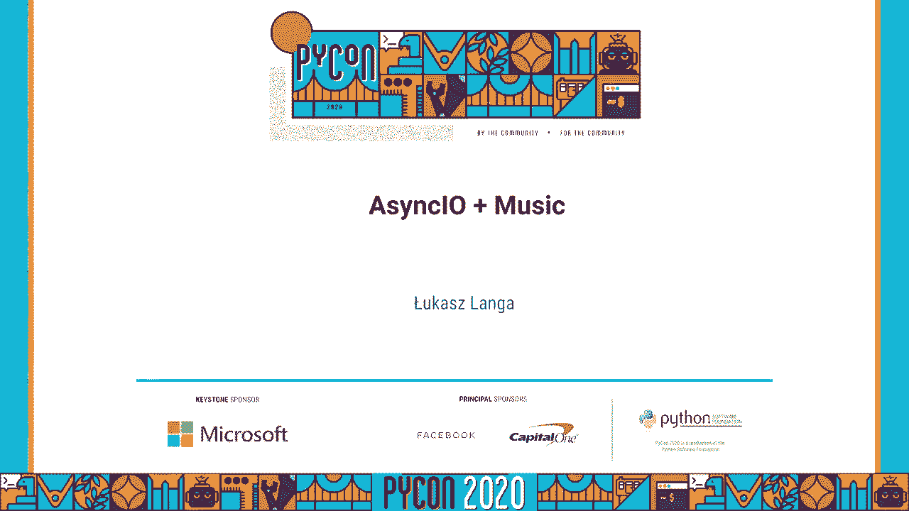
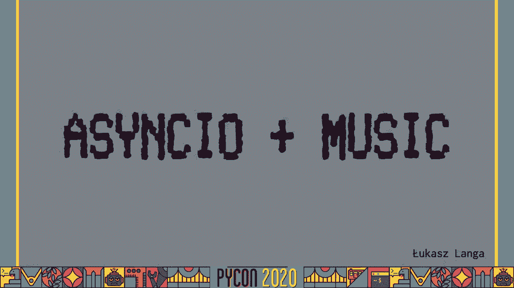
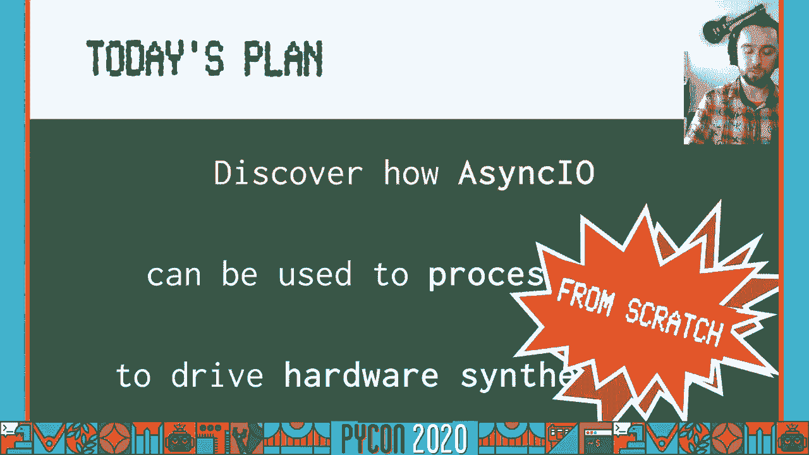
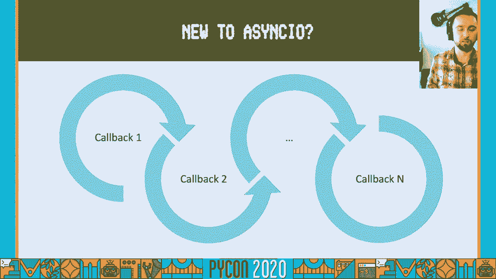
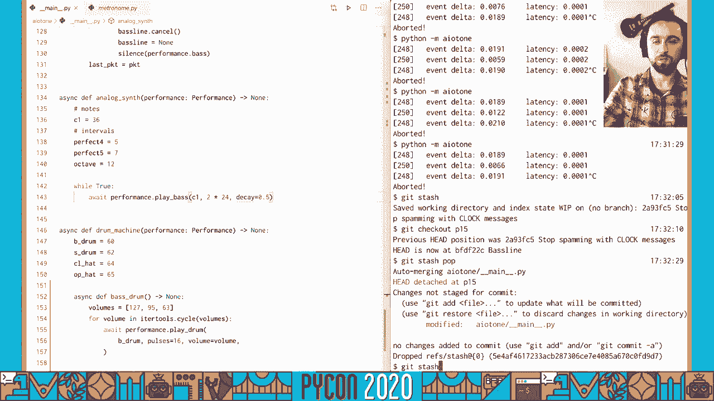
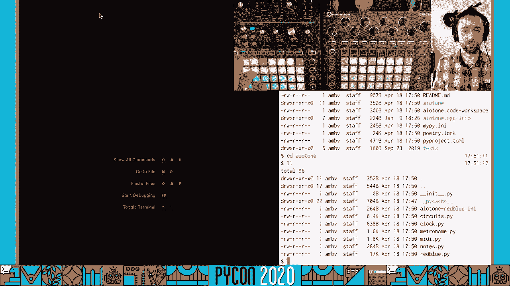
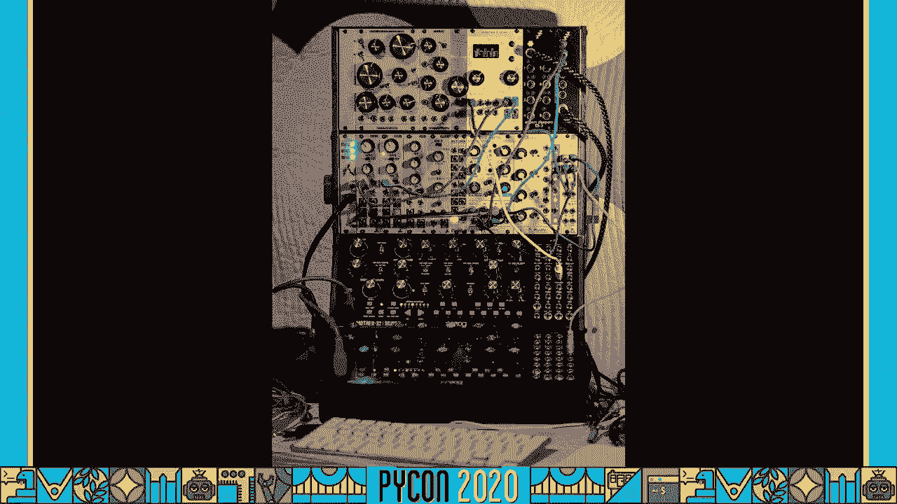
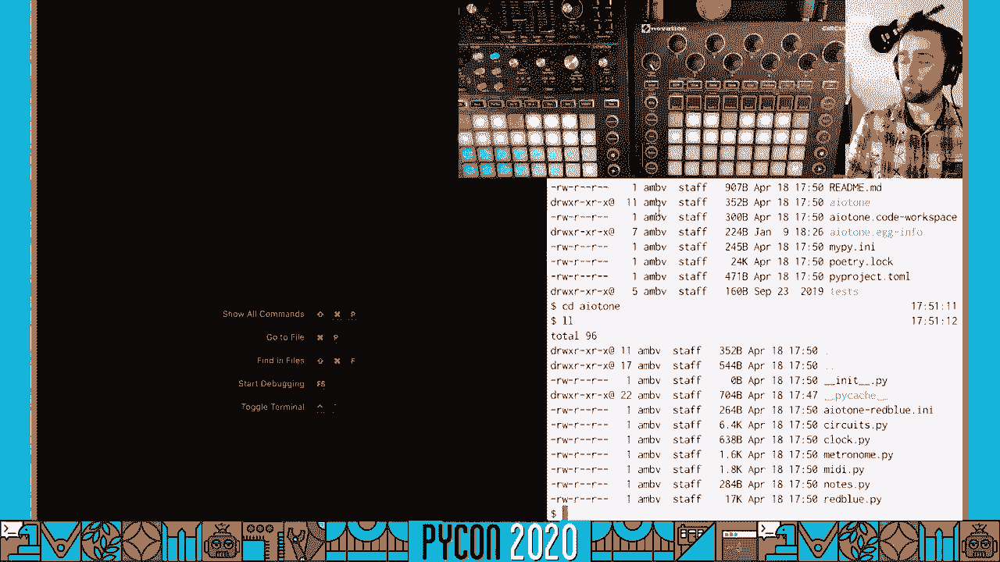

# 053：使用Python和MIDI硬件制作音乐








在本教程中，我们将学习如何使用Python的AsyncIO库与MIDI硬件合成器进行交互，从而创作音乐。我们将从零开始构建一个程序，该程序能够接收外部时钟信号、驱动鼓机和贝斯合成器，并实现多轨同步播放。整个过程将展示AsyncIO在实时、并发任务处理中的强大能力。

---

## 硬件介绍



在深入代码之前，我们先了解一下将要使用的硬件设备。


*   **Circuit**：一个功能完整的“音乐工作站”硬件。它内置鼓机、合成器和音序器，可以独立创作音乐。我们将用它作为我们的鼓机和**主时钟源**。
*   **Mono Station**：一个单声道模拟合成器，专门用于演奏贝斯音色。它是“模拟”的，意味着其声音由真实的电子电路产生，会受环境因素影响，这也带来了独特的“温暖”音色。

这两款设备都支持USB-MIDI协议，这意味着我们可以用一根USB线将它们连接到电脑，并用Python程序进行控制。

## 核心概念：AsyncIO 和 MIDI

上一节我们介绍了硬件，本节中我们来看看编程所需的核心概念。

### AsyncIO 基础

AsyncIO 是 Python 用于编写并发代码的库，使用 `async/await` 语法。其核心是**协程**，它们类似于函数，但可以在等待外部操作（如I/O）时暂停，让出控制权给其他协程，从而实现协作式多任务。

一个简单的协程示例：
```python
async def example_coroutine():
    print("开始")
    await asyncio.sleep(1)  # 等待1秒，期间其他协程可以运行
    print("结束")
```

要同时运行多个协程，可以使用 `asyncio.gather`：
```python
async def main():
    await asyncio.gather(
        coroutine_one(),
        coroutine_two(),
        coroutine_three()
    )
```

### MIDI 协议

MIDI 是一种在80年代早期由音乐硬件厂商制定的通信协议，用于电子乐器之间的对话。它的伟大之处在于其简单性和广泛的行业支持。

MIDI消息是实时、单向的。最常见的消息类型包括：
*   **Note On**：按下琴键，开始发声。消息包含**音符编号**（0-127）、**力度**（击键速度，影响音量）和**通道**（0-15）。
*   **Note Off**：松开琴键，停止发声。
*   **Clock**：同步时钟信号。标准定义每四分音符会发送24个时钟脉冲。所有设备遵循同一时钟源才能同步演奏。

在代码中，我们可以用简单的数据结构表示这些消息：
```python
@dataclass
class MidiMessage:
    message_type: str  # 例如 ‘note_on‘, ‘clock‘
    channel: int
    data1: int  # 例如 音符编号
    data2: int  # 例如 力度
    delta: float  # 距离上一条消息的时间
```

---

## 项目搭建：连接与通信

上一节我们了解了AsyncIO和MIDI的基础，本节中我们来看看如何搭建项目框架，让Python能够与硬件对话。

首先，我们需要一个库来处理底层的MIDI通信。这里我们使用 `python-rtmidi`。同时，为了获得更好的性能，我们将使用 `uvloop` 作为AsyncIO的事件循环替代品。

以下是初始的项目结构：

```python
import asyncio
import click
from rtmidi.midiutil import open_midiinput, open_midioutput

# 安装uvloop以获得更好性能
import uvloop
asyncio.set_event_loop_policy(uvloop.EventLoopPolicy())

@click.command()
def main():
    """主命令行入口点"""
    asyncio.run(async_main())

async def async_main():
    # 1. 查找并打开MIDI输入（接收来自Circuit的时钟）和输出（向合成器发送音符）端口
    # 2. 设置回调函数，处理接收到的MIDI消息
    # 3. 运行主事件循环
    pass

if __name__ == "__main__":
    main()
```

### 处理MIDI回调：使用队列

`rtmidi` 在C++线程中监听硬件消息，并通过回调函数通知Python。为了避免在回调中进行复杂处理，我们使用一个**线程安全队列**作为桥梁。

以下是实现方案：
1.  MIDI回调函数：将接收到的原始数据包装成 `MidiMessage` 对象，并放入队列。
2.  AsyncIO消费者协程：在Python主线程中运行，从队列中获取消息并进行处理（如转发时钟、触发音符）。

```python
import asyncio
from queue import Queue
from threading import Thread

# 创建线程安全队列
midi_queue = Queue()

def midi_callback(message, time_stamp):
    """由rtmidi在C++线程中调用"""
    # 解析message，创建MidiMessage
    midi_msg = create_midi_message(message, time_stamp)
    # 放入队列
    midi_queue.put(midi_msg)

async def midi_consumer():
    """在AsyncIO事件循环中运行，消费队列中的消息"""
    while True:
        # 等待队列中出现新消息
        if not midi_queue.empty():
            msg = midi_queue.get()
            # 处理消息，例如打印或转发
            print(f"收到消息: {msg}")
        # 短暂让出控制权，避免阻塞事件循环
        await asyncio.sleep(0.001)
```

---

## 实现核心功能：时钟同步与音序器

上一节我们建立了硬件通信的基础，本节中我们来实现最核心的部分：时钟同步和音序器。

### 状态管理：Performance 类

我们将创建一个类来管理整个表演的状态，包括使用的设备、当前节奏和最后一个播放的音符等。

```python
from dataclasses import dataclass
from typing import Optional

@dataclass
class Performance:
    clock_port: Any  # 接收时钟的MIDI端口（Circuit）
    drum_port: Any   # 发送鼓音符的MIDI端口（Circuit）
    bass_port: Any   # 发送贝斯音符的MIDI端口（Mono Station）
    last_note: int = 36  # 最后播放的音符，默认为C1
    # 我们稍后会在这里添加节拍器
```

### 节拍器与同步

为了让我们的Python音序器与外部硬件时钟完美同步，我们需要实现一个**节拍器**。它的作用是：每收到一个外部时钟脉冲，就通知所有正在等待特定脉冲数的协程。

我们使用 `asyncio.Future` 来实现这个同步机制。`Future` 代表一个尚未完成的异步操作结果。

以下是简化的节拍器实现：

```python
class Countdown:
    """一个倒计时器，在达到零时完成一个Future"""
    def __init__(self, pulses: int):
        self.pulses = pulses
        self.future = asyncio.Future()

    def tick(self):
        """每收到一个时钟脉冲调用一次"""
        self.pulses -= 1
        if self.pulses <= 0 and not self.future.done():
            self.future.set_result(True)  # 标记完成

class Metronome:
    """管理多个倒计时器的节拍器"""
    def __init__(self):
        self.countdowns = set()

    def tick(self):
        """通知所有倒计时器脉冲已到"""
        for cd in list(self.countdowns):
            cd.tick()
            if cd.pulses <= 0:
                self.countdowns.remove(cd)

    async def wait_for_pulses(self, pulses: int):
        """等待指定数量的脉冲"""
        countdown = Countdown(pulses)
        self.countdowns.add(countdown)
        await countdown.future  # 在此等待，直到倒计时完成
```

在 `Performance` 类中初始化节拍器，并在每次收到 `Clock` 消息时调用 `metronome.tick()`。这样，任何协程调用 `await performance.metronome.wait_for_pulses(24)` 时，都会精确等待一个四分音符的时间（24个脉冲）。

### 鼓机音序器

现在我们可以实现一个简单的鼓机循环。它将在指定的通道上，按照节奏播放音符。

以下是鼓机协程的示例：

```python
async def drum_machine(performance: Performance):
    """鼓机音序器协程"""
    while True:
        # 播放底鼓（音符36），通道9（MIDI鼓通道通常是9）
        performance.note_on(performance.drum_port, channel=9, note=36, velocity=127)
        # 等待一个四分音符（24个脉冲）
        await performance.metronome.wait_for_pulses(24)
        # 停止底鼓
        performance.note_off(performance.drum_port, channel=9, note=36)

        # 播放军鼓（音符38），等待半个四分音符
        performance.note_on(performance.drum_port, channel=9, note=38, velocity=95)
        await performance.metronome.wait_for_pulses(12)
        performance.note_off(performance.drum_port, channel=9, note=38)
```

### 贝斯音序器与交互

对于贝斯合成器，我们可以创建一个更复杂的音序器，例如一个循环播放特定音符序列的“琶音器”。



```python
async def bass_arp(performance: Performance):
    """贝斯琶音器协程"""
    # 定义一个音符序列（以半音为单位偏移）
    sequence = [0, 7, 12, 19, 24]  # C, G, C（高八度）, G（高八度）, C（两个八度）
    index = 0

    while True:
        # 计算要播放的音符：基础音符（C1） + 序列中的偏移
        note_to_play = 36 + sequence[index % len(sequence)]
        performance.note_on(performance.bass_port, channel=0, note=note_to_play, velocity=90)
        # 等待一定脉冲数
        await performance.metronome.wait_for_pulses(24)
        performance.note_off(performance.bass_port, channel=0, note=note_to_play)

        index += 1
        # 每4个音符，将基础音符更新为最后接收到的外部键盘音符，实现交互
        if index % 4 == 0:
            note_to_play = performance.last_note
```

为了让贝斯线能够响应现场演奏，我们需要在MIDI回调中，当收到 `Note On` 消息时，更新 `performance.last_note`。

---

## 整合与运行

上一节我们实现了各个独立的音序器，本节中我们将它们整合起来，并处理启动/停止逻辑。

在主异步函数中，我们需要：
1.  创建 `Performance` 实例。
2.  启动MIDI消费者任务。
3.  监听来自Circuit的 `Start`/`Stop` 消息。
4.  当收到 `Start` 时，创建并启动鼓机和贝斯音序器的后台任务。
5.  当收到 `Stop` 时，取消这些任务，并向所有合成器发送“所有音符关闭”消息，防止音符卡住。

```python
async def async_main():
    # ... （初始化硬件端口）
    performance = Performance(clock_port=in_port, drum_port=out_port_circuit, bass_port=out_port_mono)

    # 启动消息消费者
    consumer_task = asyncio.create_task(midi_consumer(performance))

    # 用于存储音序器任务
    sequencer_tasks = []

    def handle_midi_message(msg):
        if msg.type == 'clock':
            performance.metronome.tick()
            # 将时钟转发给贝斯合成器，保持其同步
            performance.bass_port.send_message([0xF8])
        elif msg.type == 'start':
            # 启动音序器
            drum_task = asyncio.create_task(drum_machine(performance))
            bass_task = asyncio.create_task(bass_arp(performance))
            sequencer_tasks.extend([drum_task, bass_task])
        elif msg.type == 'stop':
            # 停止音序器
            for task in sequencer_tasks:
                task.cancel()
            sequencer_tasks.clear()
            # 静音所有设备
            performance.all_notes_off()
        elif msg.type == 'note_on':
            # 更新最后一个音符，用于交互
            performance.last_note = msg.data1

    # ... （将handle_midi_message注册为回调或放入消费者逻辑）

    try:
        await consumer_task
    except asyncio.CancelledError:
        # 优雅关闭
        performance.all_notes_off()
```

---

## 总结与扩展

本节课中我们一起学习了如何使用Python的AsyncIO库控制MIDI硬件合成器来制作音乐。我们从零开始，逐步构建了一个能够：



1.  **与硬件通信**：通过 `rtmidi` 库连接并控制Circuit和Mono Station。
2.  **处理并发**：利用AsyncIO的协程和任务，让鼓机、贝斯音序器以及MIDI消息处理同时进行。
3.  **实现精确定时**：通过自定义的节拍器类，将Python音序器与外部MIDI时钟源同步，达到专业级的时序精度。
4.  **创作音乐**：编写了简单的鼓循环和交互式贝斯琶音器，生成了富有节奏感和变化的声音。





这个项目只是一个起点。基于此框架，你可以轻松地：

*   **添加更多轨道**：创建更多的协程来控制其他合成器或采样器。
*   **实现复杂算法**：用Python生成更复杂的旋律、和声或节奏模式。
*   **增加交互性**：响应更多的MIDI控制器信息（如旋钮、滑块）来实时改变音序参数。
*   **连接软件**：让你的Python程序作为插件或扩展，与Ableton Live、Logic等数字音频工作站协同工作。


希望本教程让你看到了AsyncIO在实时交互和创意编程中的强大潜力。音乐与代码的结合，为表达和探索开辟了全新的可能性。