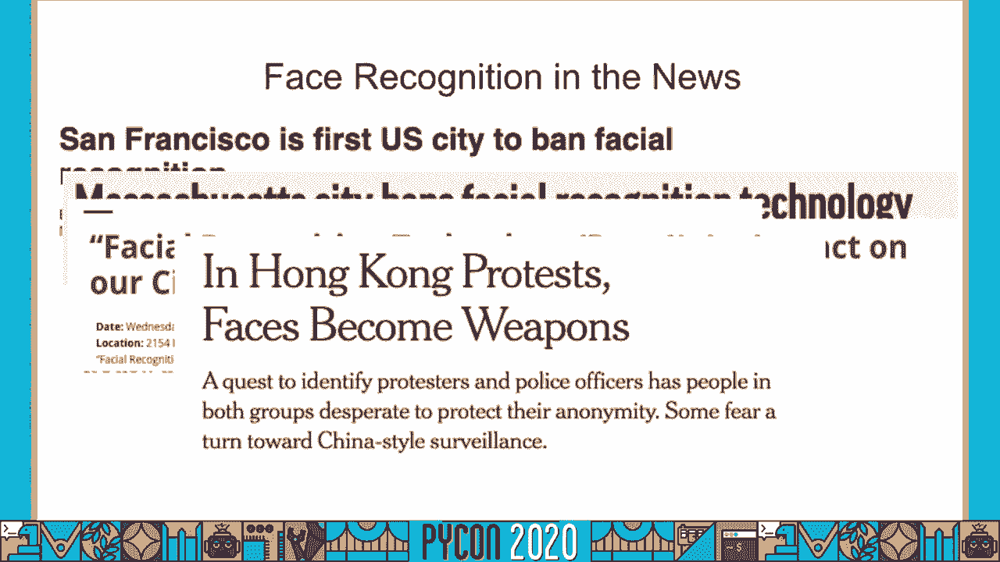
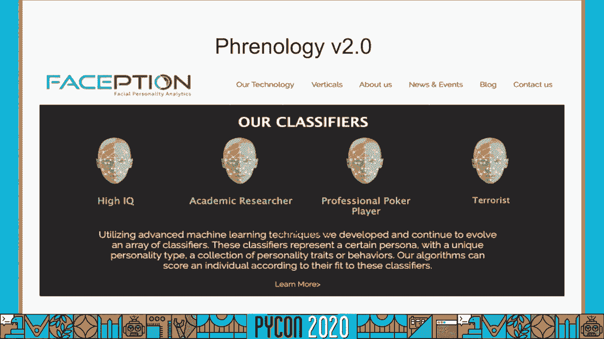
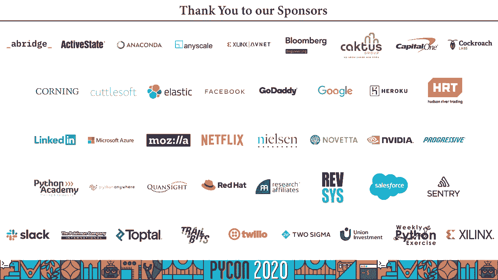

# 054：局限性与社会风险

## 概述
在本节课程中，我们将探讨面部识别技术的核心争议、其技术局限性以及可能带来的社会危害。我们将从算法偏见、情感识别、性别识别等具体问题入手，分析这些技术如何在现实中被应用，并讨论开发者应承担的责任。

---

## 免责声明与背景
本次演讲中的所有观点仅代表演讲者个人立场，与其雇主无关。演讲内容源于个人研究兴趣，与工作职责无涉。

自去年五月以来，我们观察到全球多个城市和执法机构开始部署面部识别技术。这引发了关于公民自由、安全与隐私的广泛担忧。

近期，随着COVID-19大流行，一些国家开始讨论利用面部识别技术来识别违反居家隔离令的个人，或追踪确诊患者以确保其自我隔离。

---

## 超越监控：面部分析与“新颅相学”
上一节我们提到了监控应用，本节中我们来看看面部分析技术的兴起。这种技术声称能通过扫描人脸来分析个人的内在特质，例如智商或是否是一名好员工。

这种理念基于一种古老的伪科学——**颅相学**。颅相学在18、19世纪曾被用来宣扬种族主义，声称不同种族的大脑结构存在差异，并由此决定个人能力。

如今，我们给这种有害思想披上了技术的外衣。通过所谓的“面部特征分析”，我们正在用科技手段延续种族主义和社会偏见。当我们讨论人工智能的危险时，所指的并非科幻电影中的超级AI，而是算法**今天**就在加剧社会不平等、伤害具体人群的现实。

---

## 算法偏见：以“性别阴影”研究为例
以下是关于算法偏见的一个著名案例研究。

波拉伊尼·乔伊在麻省理工学院媒体实验室就读时，曾遇到一个无法识别她面孔的机器人，直到她戴上一个白色面具。这次经历促使她开展了名为“性别阴影”的研究。

在该研究中，她审计了多个商用面部分析系统对不同人群的识别准确率。她采用了**交叉性**审计方法，不仅单独考察种族或性别，还考察了它们的交叉影响（例如：黑人女性）。

**研究关键发现**：
*   这些系统对深色皮肤女性的误识别率，比浅色皮肤男性高出**20%到35%**。
*   如果一个数据科学家训练的模型仅有67%的准确率，很可能无法投入生产。然而，这些存在严重偏见的商用系统却被广泛部署。

这项研究产生了巨大影响，促使IBM、谷歌等公司承诺改进其系统，并催生了相关立法讨论。

---

## 数据伦理：如何“公平”地收集数据？
上一节我们看到了算法偏见的问题，本节中我们来看看试图解决该问题的方法及其伦理困境。

为了纠正偏见，公司需要构建更具多样性的人脸数据集。然而，其数据收集方式往往存在严重伦理问题。

**不道德的数据收集案例**：
*   **IBM**：通过爬取Flickr上肤色较深个人的度假照片来构建数据集。
*   **谷歌**：曾尝试付费让黑人和棕色人种提供自拍，或雇佣人员在亚特兰大拍摄无家可归者的照片。

作为回应，“性别阴影”研究的原作者们创建了“名人面孔”数据集子集。该数据集使用白人男性、白人女性、黑人男性、黑人女性名人的照片，从而避免了侵犯普通人隐私的问题。

这项后续研究揭示了**隐私**与**公平**之间的张力，并为希望进行算法审计的研究人员提供了重要指导，例如：如何设计有意义的审计，以鼓励目标公司真正改进其软件。

---

## 情感识别：技术能否“读懂”情绪？
接下来我们将讨论情感识别，或称自动情绪识别技术。其核心问题是：我们能否仅凭一张面部照片来准确估计一个人的情绪状态？

该领域的基础理论源于心理学家保罗·艾克曼。他提出了人类共有六种基本情绪：**快乐、悲伤、恐惧、愤怒、惊讶、厌恶**。他还提出了“微表情”概念，并开发了**面部动作编码系统**。该系统将面部划分为不同的动作单元，一种情绪被定义为特定动作单元的组合。

例如，在FACS中，**愤怒**可能被编码为：嘴唇收紧、双眼瞪大、眉毛皱起。

然而，去年一项对1000多篇论文的综述得出结论：**面部表情并不能正确代表情绪状态**。

**原因有三点**：
1.  **表达方式的多样性**：同一种情绪可以通过多种不同的面部表情来表达。
2.  **缺乏特异性**：面部构造与特定情绪之间不存在唯一映射。一种表情可能对应多种情绪。
3.  **缺失上下文**：仅凭一张静态照片，我们无法了解情绪产生的背景（例如，哭泣可能是因为悲伤，也可能是喜极而泣）。

---

## 自动性别识别：对跨性别与非二元性别人群的排斥
现在我们来探讨计算机如何看待性别，特别是自动性别识别系统对跨性别和非二元性别人群的影响。

这类系统的一个常见应用场景是：出租车后座的平板电脑扫描乘客面部，估计其性别，然后推送“最相关”的广告。

2018年，Os Keyes 的一项文献回顾发现，这些系统存在根本性问题：
*   性别总是被定义为**二元变量**（男/女）。
*   性别完全由**外表**决定（看起来像男性即为男，看起来像女性即为女）。

这种定义本质上**排斥了跨性别和非二元性别人群**，因为他们的性别认同可能与其外表不一致。例如，优步的司机验证系统就曾因无法识别经历激素替代疗法的跨性别司机而将其账户锁定。

跟进Os Keyes的理论研究，科罗拉多大学的三名研究人员进行了实证审计。他们从Instagram收集了代表七种性别身份的2400张图片，并测试商用性别识别系统的表现。

**审计发现**：
*   带有“跨性别男性”或“跨性别女性”标签的图片，被错误识别性别的比例，比顺性别个体高出**10%至30%**。
*   这些系统常在未经同意的情况下，通过监控摄像头对人脸进行扫描和性别标记，可能导致个体违背自身意愿被错误对待，造成情感和身体伤害。

---

## 实践中的滥用、危害与开发者责任
前面我们讨论了面部识别技术在种族、情绪、性别识别方面的局限性。现在让我们探讨这些系统在实践中的应用，以及我们为何不能将技术与它的使用场景割裂看待。

凯特·克劳福德有一句有力的论断：“这些工具在失败时是危险的，在成功时是有害的。”

**滥用案例**：纽约警察局曾被曝出丑闻，警员将名人的照片或手绘草图输入面部匹配系统以“生成线索”，并据此进行逮捕。这完全背离了系统的设计用途，且缺乏问责机制。

**正确使用造成的伤害**：即使技术被“正确”使用，也可能造成巨大伤害。例如，有报道称面部识别技术被用于特定地区的监控与压迫。目前，国际上缺乏关于如何使用（或禁止使用）面部识别和生物识别数据的标准与问责制。

**关键在于权力**：技术是一种力量。我们作为软件开发人员必须认识到，我们构建的算法和技术存在于人类社会的权力结构中。如果我们只是让技术更好地识别黑人和棕色人种的面孔，然后将其卖给一个旨在残酷对待有色人种社区的机构，那么我们就是在为他们提供更高效的压迫工具。

制造这些工具的技术人员（多为享有特权的群体）与受这些技术伤害最深的人群（常为边缘化群体）往往是分离的。这就是为什么科技领域和人工智能领域的**多样性至关重要**——是房间里的人决定用技术解决什么问题、如何使用技术。不同的生活经历能带来不同的视角。

---

## 核心问题：我们是否应该建造它？
在讨论如何构建或设计一项技术之前，我们应该先问自己一个根本性的问题：**我们是否应该建造这个系统？**

在人工智能伦理和负责任创新的领域，我们必须能够提出这个问题。如果我们相信某项技术会造成严重伤害，那么答案应该是否定的——我们根本不应该建造它。

现在，我们开始看到这种反思转化为行动：
*   软件工程师联合抗议其公司对气候的影响。
*   超过1000名大学生签署承诺，拒绝为某些制造伤害性技术的公司（如Palantir）工作。

一个重要议题随之出现：**我们如何赋予开发者、数据科学家和工程师“拒绝的权利”？** 如何让他们能够安全地集体组织起来，对有害的技术说“不”？

这项工作可以从政府法规（如京都议定书）和组织管理策略中汲取灵感，研究何种组织结构能让员工感到安全，敢于提出担忧。同时，也需要研究如何设计系统，使得当发现其会造成伤害时，能够被轻易关闭或撤销。

在研究层面，我们希望设计出通用的框架，以支持科技从业者为此目标而努力。

---

## 总结
本节课中，我们一起学习了面部识别技术的多个关键议题：
1.  技术存在严重的**算法偏见**，对不同种族、性别的人群识别准确率差异巨大。
2.  试图修正偏见的数据收集过程，本身可能涉及**严重的伦理问题**。
3.  **情感识别技术**的科学基础存在争议，面部表情与情绪状态之间并非一一对应。
4.  **自动性别识别系统**基于二元的、外表至上的性别定义，**排斥并伤害**跨性别与非二元性别人群。
5.  技术在实践中的**滥用**和**正确使用都可能造成危害**，且缺乏有效问责。
6.  技术的开发与使用关乎**权力结构**，开发者的背景多样性影响技术发展的方向。
7.  最根本的问题是，在建造之前，我们必须勇于提问：**这项技术是否值得建造？** 并赋予开发者集体拒绝建造有害技术的权利。

作为技术的创造者，我们有责任思考其社会影响，并努力确保技术不被用于巩固压迫性的社会权力不平等。