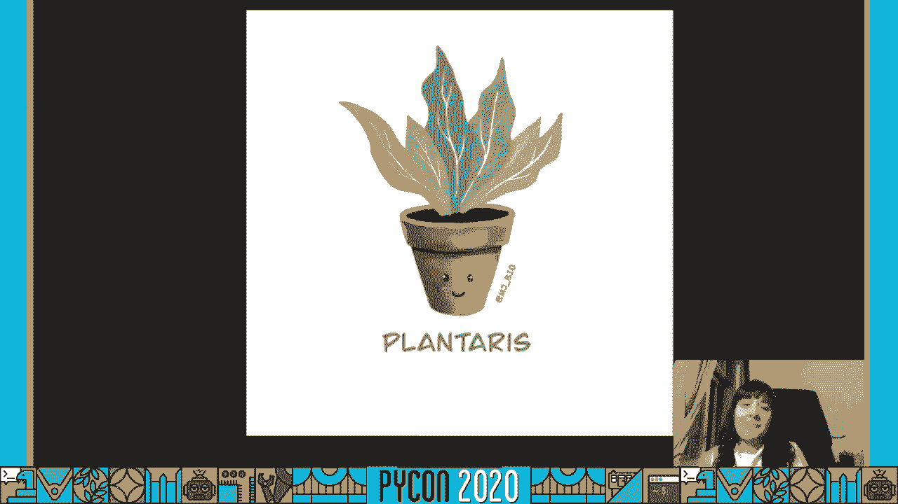
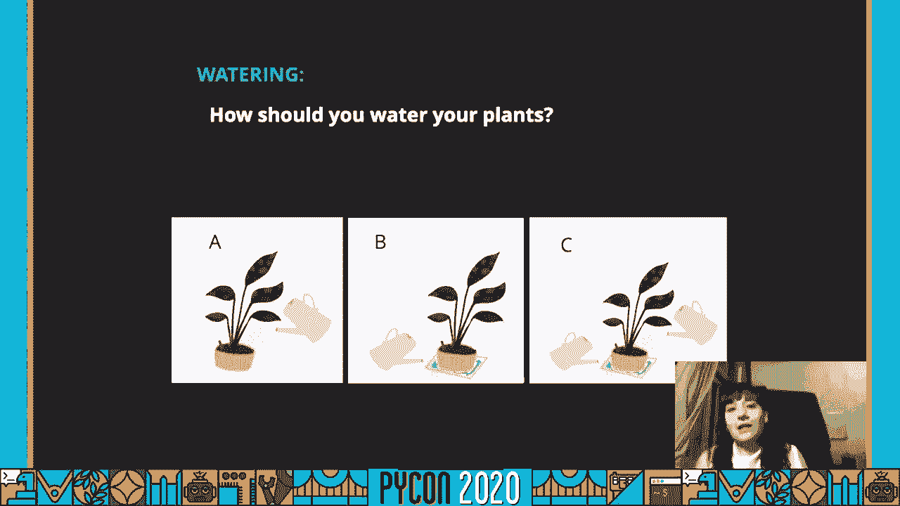
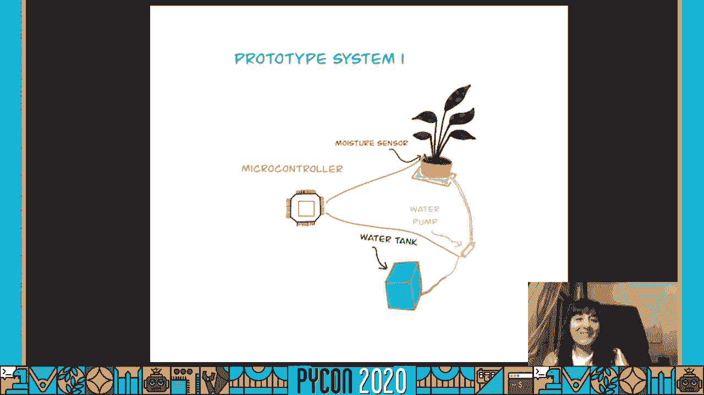
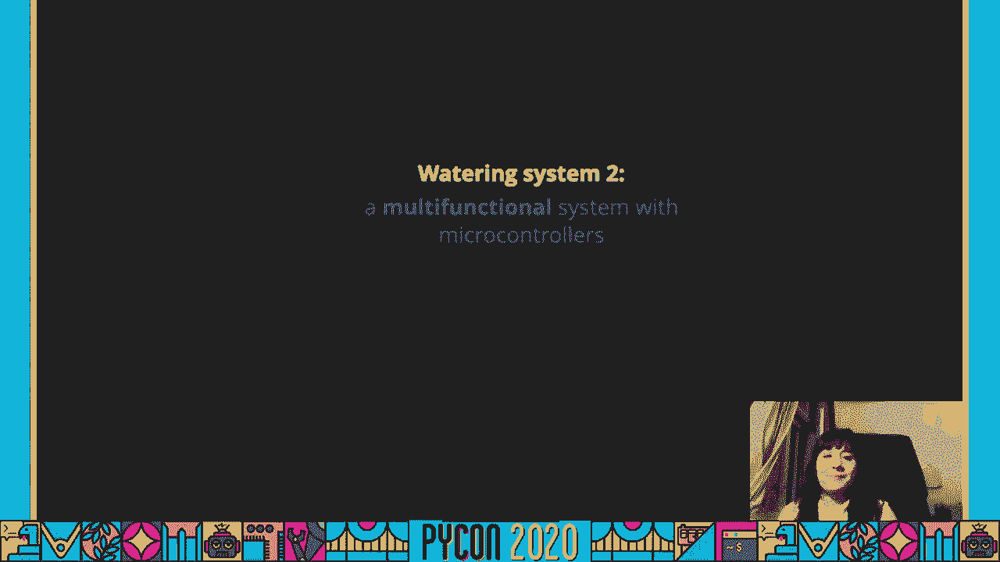
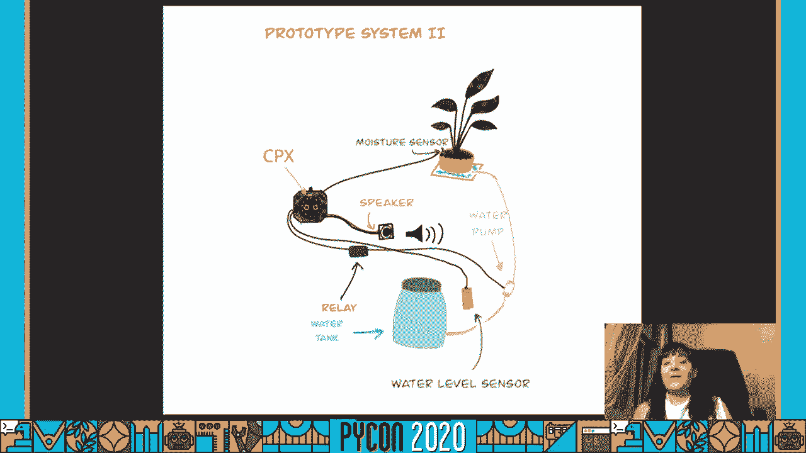
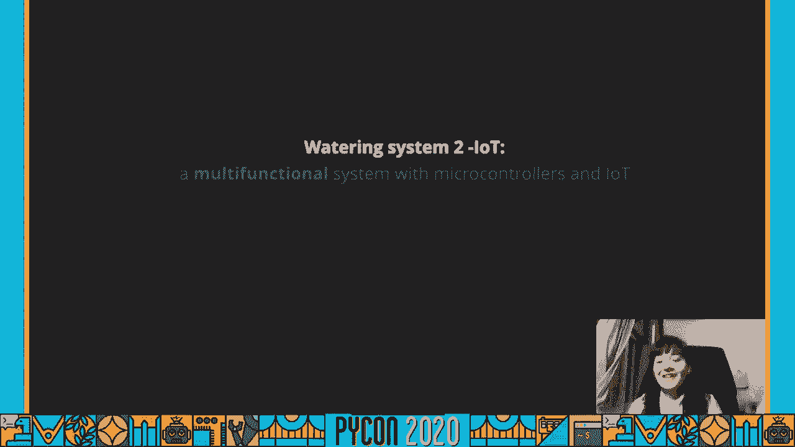
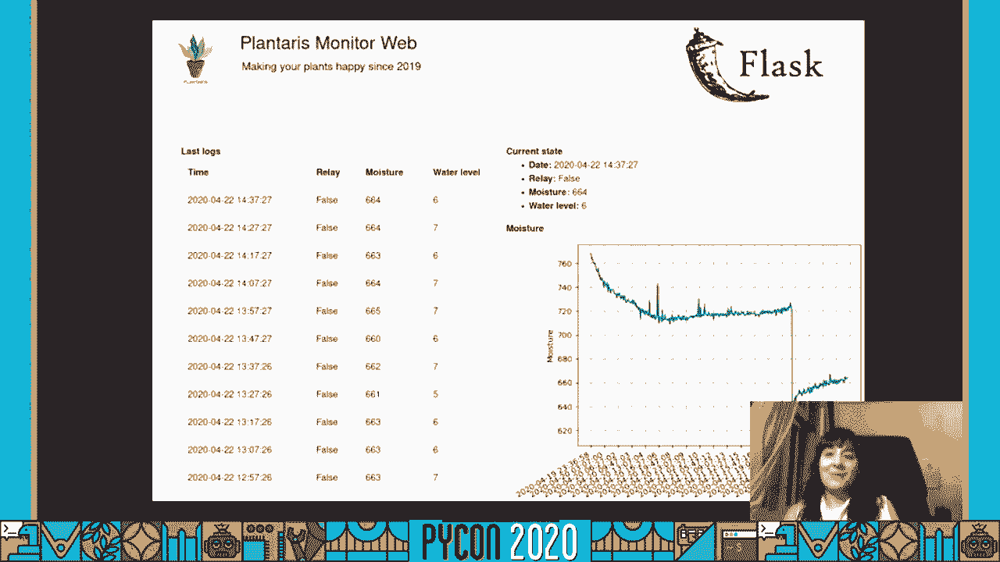
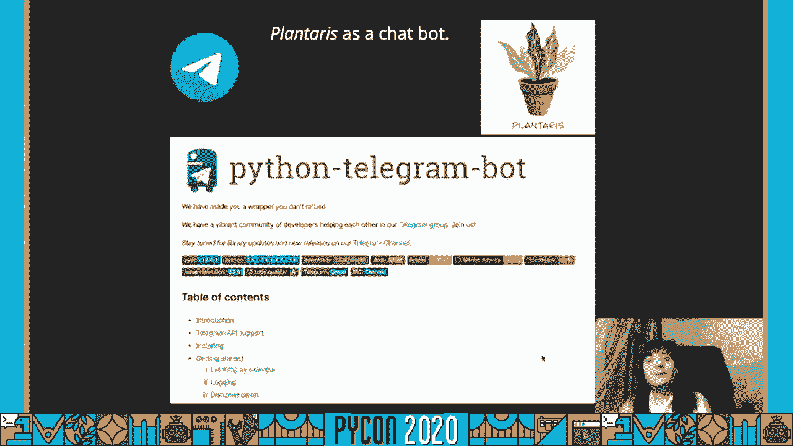

# 055：如何建立一个智能“室内花园”


在本节课中，我们将跟随演讲者玛丽安（Maria José Molina-Contreras）的分享，学习如何从零开始构建一个智能室内花园系统。我们将了解项目背景、核心概念、硬件选择、代码实现以及系统的迭代升级过程。


## 项目背景与动机

大家好，今天我们将讨论如何建立一个智能室内花园。


在开始之前，先简单介绍一下我自己。我的全名很长，但可以叫我玛丽安。我拥有植物分子生物学博士学位。四年前，我带着梦想搬到柏林，计划开始新生活。那是一段艰难时期，但得益于柏林Python社区的支持，我坚持了下来，并找到了数据科学家这条新的职业道路。

不仅如此，我还开始在家中用Python进行实验。本次演讲就是一个例子。我想感谢Python社区给予我的每一份支持和信任。请记住，分享就是关怀，让我们分享知识，支持更多人加入这个美好的社区。

我将要谈到的项目源于一位朋友的想法。凭借我的植物学背景和Python知识，我决定探索一个全新领域：微控制器。这个世界逐渐变得清晰，我构建了一个最简单且实用的植物浇水系统，让没有软硬件背景的人也能在家中复制。当然，我也想激励新人进入Python世界。

在进行生物实验时，我从未有机会为任何硬件编程，因此我对此一无所知。幸运的是，我的一位朋友参加了2018年的Python大会，得到了一个微控制器。他把它给了我，并告诉我：“你会喜欢这个的，试试这些微控制器。”我记得我回答说：“但我不知道怎么用，我会把它弄坏吗？我需要安装什么？需要焊接吗？”

他告诉我：“只需把它连接到你的笔记本电脑。它里面已经有Python了，看看主题演讲。”我非常震惊，因为这一切如此简单。而尼娜的主题演讲太棒了，我立刻开始构思新的项目创意。那一刻，我并没有明确说“好吧，很明显，我需要开发这个浇水系统”，但我有了实现它的关键希望。

## 项目启动与核心概念

但在开始一个项目时，最重要的是什么？


不，这只是个玩笑。我开始以正确的方式看待这个项目。同时，我开始画项目草图自娱自乐。最后我画了植物图，因为我觉得这很有趣、很可爱，这也算是这个项目的形象。好了，不再谈论logo了，让我们回顾一些在开始构建浇水系统之前的重要概念。

老实说，有时让植物保持生长状态是很难的。




快乐，而浇水是关键，但并非唯一因素。

第一件事，根据你的环境条件选择植物是成功的关键。并非所有植物都适合户外。如果想创建室内花园，你需要有足够的光照。考虑使用人造光，注意温度、相对湿度和房屋朝向。

但这并非我们需要考虑的唯一因素。我们还需要考虑湿度传感器。我们需要了解植物土壤的特性，以及如何测量土壤湿度。有许多类型的传感器，但我只尝试了两种：电阻型和电容型。

我尝试了电阻型，尽管知道它们有腐蚀问题，因为这适用于短时间接触水的情况。但如果你需要长期放置，请使用电容型。因此，你会看到在某些时候我使用第一种，而在其他时候我使用第二种，以便从土壤湿度传感器中获得更可靠的读数。

建议你首先根据计划监测的特定土壤类型进行校准。因为不同类型的土壤会影响传感器读数。因此，你的传感器可能对使用的土壤类型更敏感或不敏感。

当然，在开始项目之前，第一件要做的事是取样。例如，在这个案例中，我取了三个装有水和土壤的杯子，分别是相当湿润和非常干燥的土壤。我测量了从干燥到湿润的球形物质变化。然后你需要进行实验，获取数据，用数字参数定义什么是干燥，什么是湿润。

现在唯一的问题是，谁告诉你你的计划是什么？如果我问你哪个是正确的方法，A、B还是C？答案是：取决于植物物种和生长状态。并非所有植物都喜欢相同的浇水方法。你可能会想，但为什么？一个重要因素是根系分布。

表层生长的植物偏好方法A。深层生长的植物，A、B、C都可以。方法A可能会导致额外的土壤矿物流失。方法B有时不足以让植物充分吸收水分。或者，这两种方法结合可能是个好主意，情况C能够保持良好的矿物浇水平衡。

但让我们开始考虑将方法A和B作为我们的浇水系统。经过这样的考虑，我们可以去制作一个在这方面表现良好的标志或原型。

## 构建第一个原型

在这一切过半的时候，事情变得清晰。最后，我设计了我的第一个原型。就是这样。




在这里你可以看到我最初的想法。我想，我有一个计划，一个连接到微控制器的湿度传感器，以及一个能够启动水泵的方式。我觉得这看起来真的很简单，于是我开始研究如何做到这一点，并开始购买一些组件，但有些情况需要很多组件。

以下是我为第一个系统使用的所有元素。




微控制器是我得到的，是左下角的锥形松果状设备（Circuit Playground Express）。湿度传感器是一个花朵形状的设备（图中C）。水泵是中间的一个白色水槽（图中D）。需要使用五个小电池（图中E）。顶部的蓝色部件是一个继电器，简单来说，它是一个开关信号。不错，所以我能够连接它来控制浇水的时间。当然，还有一些电缆连接了不同的部分。

我使用的微控制器叫做 **Circuit Playground Express**，由Adafruit开发。这个微控制器在不同项目中具有巨大潜力，因为它集成了运动、温度、光、声音等传感器。运行在其中的Python版本叫做 **Circuit Python**，是Micro Python的一种形式，使用起来非常简单，完全适合初学者。它有许多传感器的库和驱动程序，你可以通过USB连接它，然后启动Python控制台与之交互，这太神奇了。

在这里你可以看到最后一切是如何连接的。我知道有很多电缆，并且将手掌放在继电器旁边并不安全。我知道这一点，但没关系。这只是为了展示。请在家里不要这样做。保持安全。尝试，但不要这样做。

## 系统工作原理与代码

好吧，让我们在视频中看看系统是如何工作的。[音乐]

那代码呢？我在这里跳过了导入部分，但我只是想向你展示如何与设备交互。由于我向继电器发送信号，所以我有一个数字输出连接。湿度传感器是一个模拟输入，因为我需要从中读取一个数字。

主循环非常简单。你获取传感器值，如果低于定义的阈值，你只需启用继电器并给植物浇水几秒钟。简单吧？

```python
# 伪代码示例
while True:
    sensor_value = read_analog_input()
    if sensor_value < THRESHOLD:
        enable_relay()  # 打开水泵
        sleep(WATERING_TIME)
        disable_relay() # 关闭水泵
```

你可以在我的GitHub账号中找到完整代码，以防你想尝试一下。

## 系统迭代：增加功能

在我完成这个项目或这个方法后，我提供了一些工具，很多人对此感兴趣，并开始给我反馈，询问新功能。所以我决定构建一个具有更多功能的更大系统。



由于Circuit Playground Express的端口不多，我找到了另一个设备。




它站在那里连接，所以我有添加更多东西的选项。如你所见，我在系统中包含了扬声器和水位传感器。这里是所有组件和新的组件。


在图中D层，电路板接地下的绿色电路称为 **Crickit**，它包括许多额外的端口，可以连接更多东西到你的Circuit Playground。我还买了一个扬声器，并把它放在盒子里（图中A，红色部分）。水位传感器位于B层。当然，我们还有旧组件，比如继电器、电池、水泵和状态良好的湿度传感器（图中C）。如你所见，对于这个项目，我使用了电容型传感器。

以下是新系统的功能：
*   注意水位低，请填充水容器。
*   注意水位低，请填充水容器。

这里是代码，层次有点长，但仍然足够简单，适合每个想尝试的人。我写了一个Python类来封装系统的所有功能。所以我做的第一件事是创建一个名为`plantaris`的对象。

主循环有几个步骤，你可以在右侧看到函数的实现。首先，你可以看到方法`water_level_ok`做的事情与我们在系统一中做的类似，只是检查值并返回真或假。当水位不正常时，我们在那里播放一条消息。我只是打开一个WAV文件并通过扬声器播放。所以这就是你需要的全部内容，以便在水位过低时获得语音通知。

第二个条件是检查湿度值是否正常。这是系统一中的相同代码。我检查湿度水平是否正常，如果不正常，我就执行浇水计划。

这里给植物浇水就是打开继电器几秒钟，然后关闭它。如果你认为这是个错误，因为我写了`False`来打开，那是因为继电器有两种状态：常闭或常开。由于我不想让水泵一直工作，所以我使用了常闭阀门，因此需要为保持打开状态写`False`。这就是为什么写`False`意味着继电器将处于打开状态。

当然这不是完整代码，你可以在我的GitHub账户中找到它。

## 连接互联网与数据可视化

由于我生成了大量数据，我决定做点什么。我想，我应该把我的系统连接到互联网。因此，我开始寻找能帮我解决这个问题的组件，我注意到Adafruit有一个新的系统叫做PyPortal，所以我去了商店并得到了它，开始尝试。

这是一个非常有趣的组件，允许你进行I/O操作，并且还有一个屏幕。虽然我尽了最大努力，但由于经验不足，我在将组件连接到设备时遇到了很多问题。我花了很多时间阅读关于GST连接器的内容，也看到了孔洞甚至Wi-Fi微芯片。我仍在弄清楚这些东西的细节，但那是另一个话题或其他时刻的故事。不过，我认为这真的是一个非常有趣的组件，如果你有使用PyPortal的经验，请与我联系，因为我想将其纳入我的系统中。

但是由于我遇到了一些困难和挑战，我也想通过物联网改进我的系统。我在物联网中找到了另一条道路。我非常幸运，因为当我在寻找选项时，来自柏林和汉堡的PyLadies决定在PyCon DE之后组织一个关于同一主题的工作坊，猜猜我得到了什么？树莓派！太棒了。

这是我的Pi的基础系统。



是的，为了使用寿命，我通过SSH连接到它，所以我能够安装Python。但后来我想，我可以安装很多其他东西，那么如果我在树莓派上运行一个网络服务器会怎样呢？这样我就不必再担心系统上有限的存储空间，因为我有我的Pi的SD卡。所以我开始检查他们是如何连接树莓派和微控制器的。

我发现了一个Pi串口。说实话，我开始尝试不同的代码，翻来覆去，最终找到了一种将所有微控制器引脚数据导出为CSV文件的方法。哇，这就是全部。


在某个时刻，我做了一些快速教程。我有一些设置简单网络应用程序的经验，所以考虑到当前处理数据的需求，构建一个监控系统是一个简单的决定。

你可以在图片中看到，我在一个表格上显示日志，右侧可以看到随着时间推移的湿度数据，以及设备在顶部小表格中的最后报告。正如你所看到的，图表上的下降意味着植物被浇了水。真是太神奇了。




## 远程访问与Telegram机器人

好吧，这很好，但当我开始研究如何从家外访问我的树莓派时，事情变得非常复杂。我问了很多人，尽管我通过一个叫做`no-ip`的服务设法实现了它，但我并不觉得安全，因为保护网站或服务器太困难了。所以我想，如何才能在不设置复杂事物的前提下通过互联网访问它。


哦，抱歉，我收到了一条消息。哦，让我们看看，是植物眼。好的，数据看起来不错。让我们看看家里发生了什么。好吧，一个看起来不错。Telegram。我使用Telegram已经很久了，我知道理论上这是可行的。


设置一个机器人很简单，我有一些朋友也有一个，所以我上网查找，教程真的很简单。你告诉机器人爸爸（BotFather），你想要一个新的机器人，就这样。他给你一个令牌。当然，Python又一次帮助了我，因为有一个库可以在Python中为你的机器人添加功能，就像你在幻灯片中看到的那样。这就是故事，希望你喜欢。这也是一个机器人。


## 未来计划与总结

我有很多疯狂的想法，关于我想开始研究的话题，但是……




当然，一次只做一件事。目前我正在尝试理解PyPortal板，因为拥有一个屏幕将大大改善系统。但我也在考虑是否应该购买一个Raspberry Pi的屏幕，并尝试将其集成到我的系统中，但这需要我慢慢考虑。

同时，我仍然在处理几个附近的数据，所以我不相信云服务。这将改善我当前的状况，但在某些情况下我已经审查了一些，以防我需要更好的基础设施。我尝试了谷歌云存储和其他服务。让我们看看未来会发生什么，但目前我认为我不需要它。

由于隔离，我无法建立我设计的外壳基础设施，但相信我，很快就会准备好。目前我正在使用一个并行系统建立高效的浇水系统，所有的继电器和湿度传感器都在其中。你可以在右侧的并行系统中看到，这仍然是一个原型，但很快就会推出。我已经有两个或三个想法了，所以请保持关注。我会尽量通过社交媒体与大家沟通所有新内容。


相信我，我已经准备好了很多传感器，我甚至没有时间去尝试它们。希望你能找到几个组件，获取它们并开始尝试，但最重要的是让我们的植物快乐。

感谢观看我的演讲。我希望现在你能有动力开始在家中为你的植物自动化更多系统。如果你有更多问题或评论，请告诉我。如果你想查看代码、组件和实施细节，请查看我的GitHub。


非常感谢。谢谢。(嗡嗡声)


[蜂鸣器响]

---

**本节课总结**

在本节课中，我们一起学习了如何从零开始构建一个智能室内花园系统。我们从项目背景和动机出发，了解了选择合适植物和传感器的重要性。接着，我们逐步探索了如何利用 **Circuit Playground Express** 微控制器和 **Circuit Python** 构建第一个自动浇水原型，其核心逻辑是通过读取土壤湿度传感器的模拟输入值，控制继电器的数字输出来开关水泵。


随后，我们看到了系统如何迭代升级，增加了水位监测、语音提示等更多功能，并学习了如何通过编写Python类来组织代码。为了处理数据和实现远程监控，我们引入了树莓派来搭建本地Web服务器进行数据可视化。最后，为了更安全便捷地远程访问，我们介绍了通过Python库创建Telegram机器人的方法。


整个项目展示了如何将植物学知识、硬件（微控制器、传感器、执行器）和软件（Python编程）结合起来，解决实际问题，并在此过程中不断学习、实验和优化。希望这个教程能激发你动手创造自己的智能花园项目。