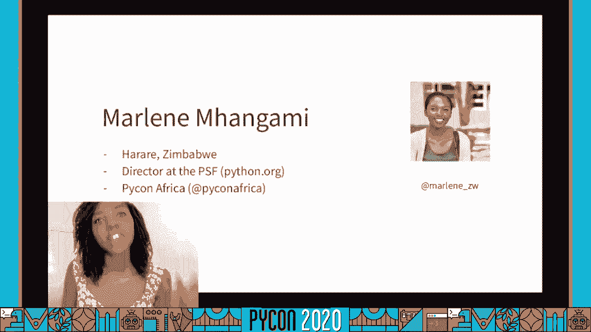
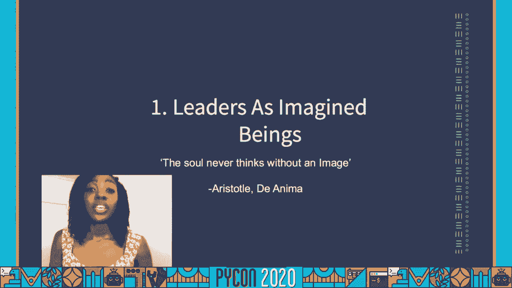
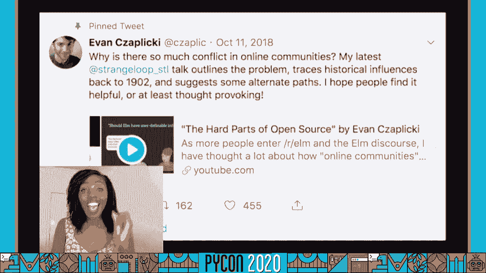
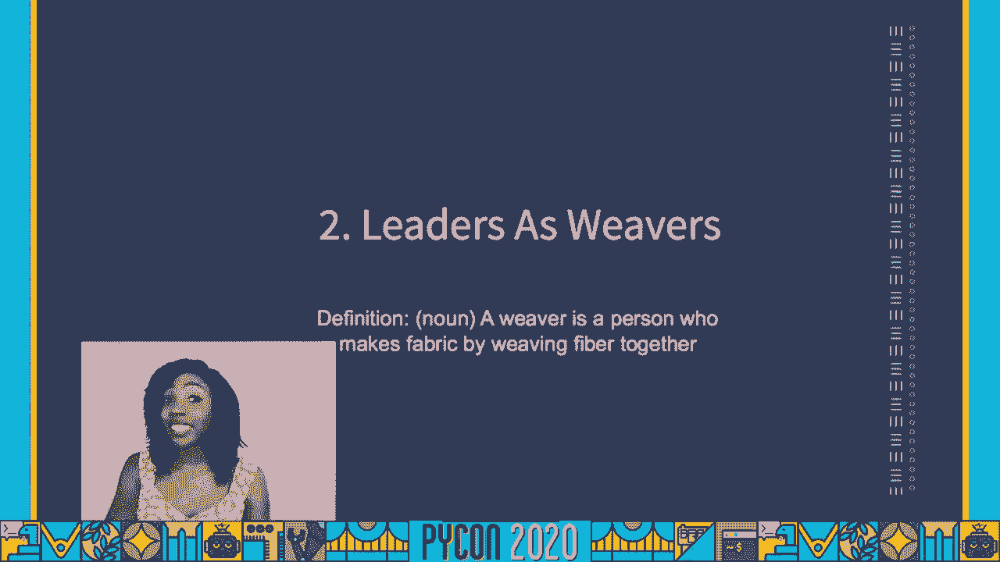
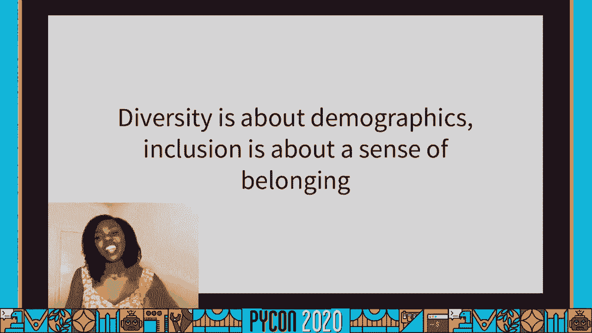
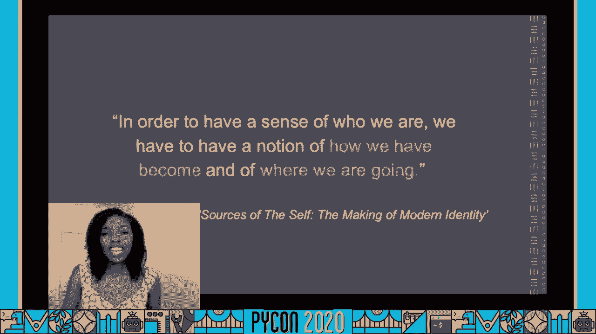
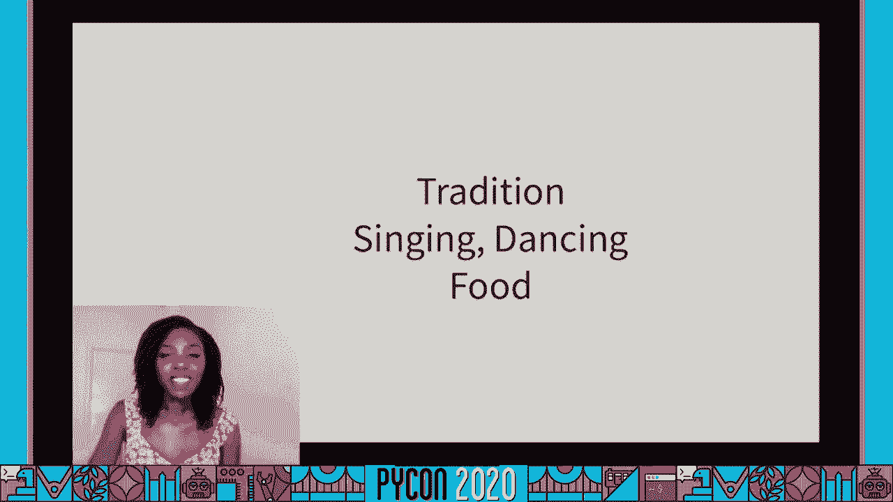
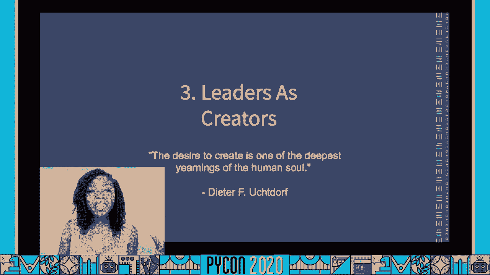
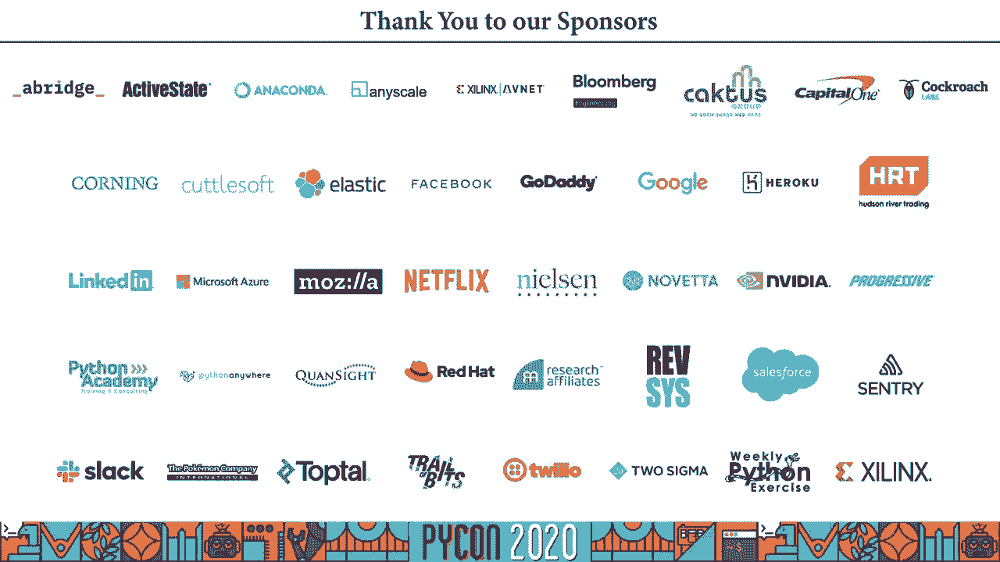

# 056：领导力、身份与社区构建

在本节课中，我们将学习 Marlene Mhangami 关于领导力与身份的见解。我们将探讨领导者如何被想象、身份认同的重要性，以及如何通过包容性构建统一的社区。课程将结合哲学概念与 Python 社区的实践案例，帮助初学者理解领导力的本质。

## 课程概述

大家好，我是 Maureen。今天我们将讨论领导力，以及它在泛非洲 Python 运动中的角色。我居住在津巴布韦的哈拉雷，并担任 Python 软件基金会董事和 PyCon Africa 主席。这些经历让我对领导力有了深刻的思考。

## 领导者作为想象中的存在

上一节我们介绍了课程主题，本节中我们来看看人们对领导者的固有印象。亚里士多德曾说：“灵魂从不在没有形象的情况下思考。”这意味着我们在思考“领导者”时，脑海中会自然浮现出一个形象。

2014年《纽约时报》报道的一项研究显示，当被要求描绘“领导者”时，约90%的参与者画出了男性形象。这引出了一个核心问题：我们脑海中的领导者原型从何而来？

研究人员 Elizabeth McClean 指出：“人们脑海中对领导者的原型有自己的定义。当我们看到一个个体时，会问，他们是否符合这个原型？”

## 领导力观点的历史演变

为了理解领导者原型的来源，我们需要回顾历史。古希腊哲学家柏拉图提出了“哲学王”的概念，认为领导者应是社区中最聪明、最有道德的人。他早期曾用“牧羊人”比喻领导者，但后来认为这个比喻不妥，因为它暗示领导者与追随者是不同物种，强化了等级观念。

快进到信息时代的今天，领导者与追随者之间的知识差距正在缩小。2018年，Elm 语言创造者 Evan Czaplicki 在演讲中指出，许多在线社区对等级制度持负面看法，普遍不信任试图建立结构的领导者。

我们看到了两种极端的领导力观点：一种是浪漫化的完美领导者，另一种是负面的控制型暴君。两者都不理想。

## 领导者作为统一者：织布工的比喻

那么，什么才是恰当的领导者比喻呢？柏拉图提出了一个深刻的比喻：**领导者就像织布工**。

织布工将两种不同的羊毛——柔软的“纬纱”和粗糙的“经纱”——编织成一块完整的布料。同样，优秀的领导者能够将持有不同观点、来自不同背景的人们团结起来，围绕一个共同目标协作。

**好领导者 = 统一者**

然而，在全球化的 Python 社区中，随着成员背景日益多样，统一工作变得更具挑战性。在深入探讨如何成为统一者之前，我们需要明确统一不等于同质化，也不仅仅是表面上的多样性。

以下是统一社区的两个关键点：
*   **统一不是同质化**：统一不要求所有人观点、经历相同。
*   **统一超越多样性**：仅有 diverse 的人群不足以形成统一体，关键在于包容性与归属感。

## 身份认同与社区归属感

如何让人们感到归属？理解人们的身份是关键。哲学家查尔斯·泰勒认为：“为了了解我们是谁，我们必须对我们如何成为现在的自己以及我们要去往何处有一个概念。”

“我们如何成为”指向我们的历史和传统。以我个人的 Shona 族身份为例，我们的问候方式、聚会时的歌舞、传统食物 Sadza 都是身份的重要组成部分。在 PyCon Africa 2019 上，加纳的传统美食、开幕舞蹈和集体舞环节，都让来自非洲各地的人们感受到了文化共鸣和归属感。

然而，身份不仅关乎历史（“我们如何成为”），也关乎未来（“我们要去往何处”）。这引出了领导者的另一个核心角色。

## 领导者作为创造者：构建多彩的未来

我认为领导者的第三个角色是**创造者**，他们塑造未来。未来应该是多彩而充满活力的，就像 RGB 色彩模型。

**RGB 模型**：红、绿、蓝三原色本身是美丽的。但当它们混合统一时，能创造出无限丰富的新色彩。

同样，当我们的社区汇聚了来自不同背景、拥有不同视角的成员，并通过有效的领导将他们统一起来时，创造力、创新和发现的潜力将会呈指数级增长。

## 未来领导者的特质

那么，未来的领导者应具备哪些特质？以下是三个关键特征：

以下是未来领导者的三个关键特征：
1.  **好奇**：主动了解他人的信仰、传统和文化，甚至踏入令自己不适的领域。
2.  **谦逊**：不总是坚持自己的观点最正确，能够与意见不同者合作。
3.  **开放**：不仅倾听和学习，也愿意分享自己的经历，展现脆弱性，以此建立同理心。

通过培养这些特质，我们可以建立更强大、更统一的社区。

## 课程总结

本节课中我们一起学习了领导力与身份在构建社区中的作用。我们探讨了领导者从“想象中的存在”到“统一者”（织布工）再到“创造者”的角色演变。我们明白了身份认同（历史与未来）对归属感的重要性，并指出了未来领导者应具备好奇、谦逊和开放的特质。在泛非洲乃至全球 Python 社区中，包容性地统一多样性，是创造创新、多彩未来的关键。