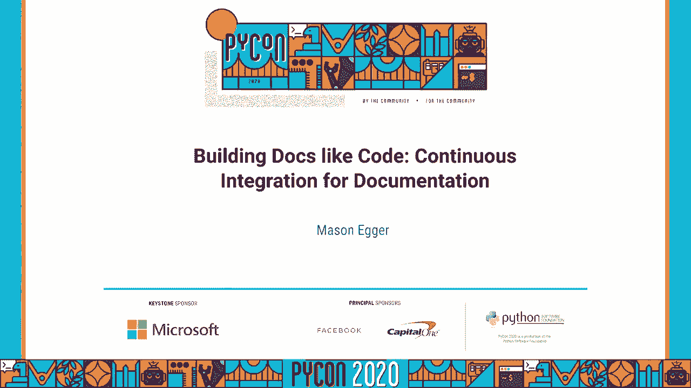
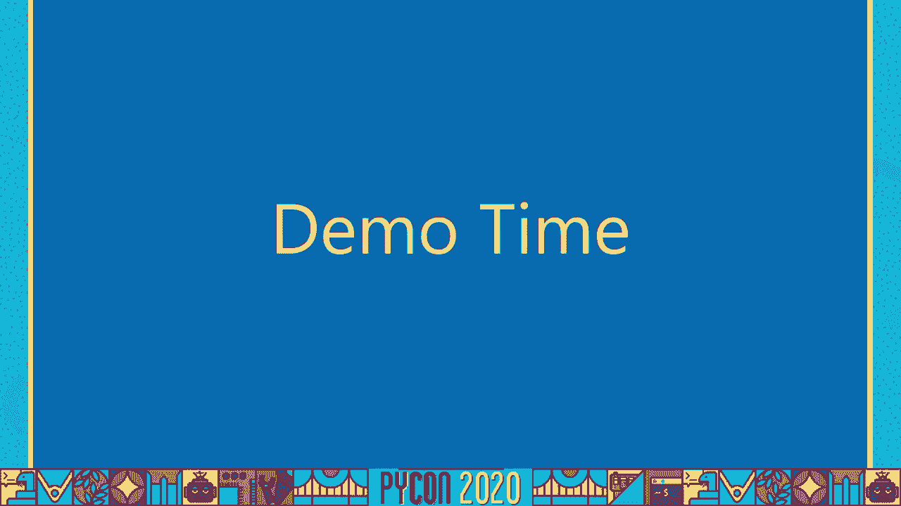
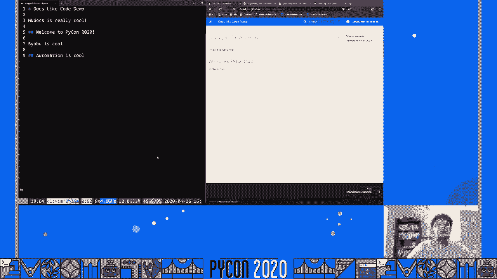
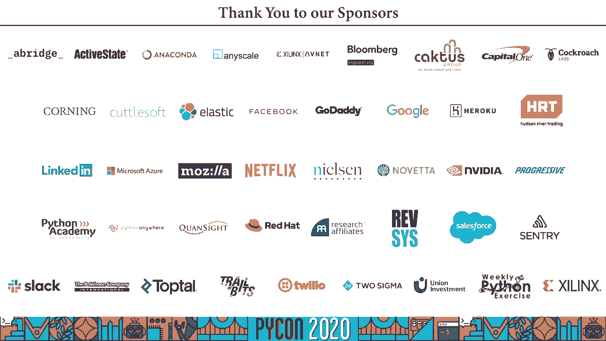

# 057：持续集成文档教程 🚀

## 概述
在本教程中，我们将学习如何将文档视为代码，并为其建立持续集成（CI/CD）流程。我们将探讨传统文档管理方式的弊端，介绍“文档即代码”的理念、核心工具以及如何通过自动化流程提升文档质量和开发体验。

---

## 章节 1：传统文档管理的问题

上一节我们介绍了本教程的主题，本节中我们来看看传统文档管理方式存在哪些问题。

这是一种常见的文档处理流程。开发人员编写代码，提交代码，代码经过审查和测试以确保质量。如果测试通过，代码就准备发布。如果未通过，开发人员则返回修改代码。

当代码准备发布时，就需要有人来编写文档，因为用户期望有文档与代码配套。编写文档的人可能是开发者、技术写手，甚至是项目外的新员工。这有时会导致文档质量参差不齐。

当前做法的问题在于，文档几乎是事后才想到的。在漫长的发布周期中，事情容易被遗忘。例如，如果发布周期长达8个月，开发者很难记得最初的工作细节和需要记录的内容。

此外，实施者（开发者）和文档作者之间的分离层越多，文档不准确的可能性就越大。有些公司让技术写手与工程师紧密合作，这很好。但如果让不熟悉代码的工程师写文档，这层隔离很可能导致不准确。

最大的问题是，许多开发者不喜欢编写文档。开发者喜欢编写代码、讨论代码，但往往不喜欢编写文档。真正的问题在于，大多数开发者并非讨厌文档本身，而是讨厌被迫使用的工作流程。开发者需要切换工具，离开熟悉的代码编辑器和终端，转而去使用可能并不顺手的Word或Wiki工具。这种上下文切换让他们不愿意写文档，导致任务被推迟到最后。

---

## 章节 2：将文档视为代码的解决方案

上一节我们讨论了传统工作流的痛点，本节中我们来看看如何通过改变思路来解决问题。

我们换个角度思考。与其将文档视为独立产物，不如像对待代码一样对待文档。这意味着：
*   文档文件存储在版本控制系统（如Git）中。
*   文档可以与源代码存放在同一目录。
*   文档的构建和部署是自动化的。
*   每次提交或拉取请求时，都会自动构建文档工件。

我们通常如何运行单元测试？我们会从测试中获取报告。同样，我们也可以构建文档，以便查看每次变更对文档的影响。

我们可以建立一套可信的评审流程，确保对文档的审查一丝不苟。我们一直对代码进行代码审查，为什么不对文档也进行同样细致的审查呢？

我们可以检查文档的准确性和功能性。是的，文档是可以测试的。例如，Sphinx工具可以测试超链接是否有效，代码片段是否能产生预期的输出。

这还允许我们在无需人工干预的情况下发布文档。

---

## 章节 3：“文档即代码”的优势

上一节我们介绍了核心理念，本节中我们来看看这样做能带来哪些具体好处。

如果我们像对待代码一样对待文档，将获得以下优势：

以下是“文档即代码”的主要优势列表：
1.  **促进协作**：GitHub等平台促进了源代码的协作，同样也能促进文档的协作。任何人（如其他团队成员、支持人员或开源社区成员）发现文档错位或破损，都可以提交拉取请求来修复。
2.  **跟踪文档错误**：文档中的错误应被视为重要的Bug。因为它们可能导致用户错误使用产品，进而引发抱怨。应将文档错误视为优先级较高的Bug。
3.  **强制文档更新**：很多时候，添加新代码时需要更新文档。如果你修复了Bug、增加了新功能或进行了性能优化，文档可能需要相应更新。将此作为流程的一部分，能确保文档同步。
4.  **构建统一美观的文档**：可以创建流程，确保整个公司或项目的文档具有一致的外观和良好的体验。
5.  **利用开发者工具和工作流**：我们可以利用一直在使用的敏捷、GitOps等开发工具和工作流，将这些高效实践应用到文档管理中，例如使用Git进行版本控制。
6.  **赋能开发者编写文档**：当文档成为代码评审的一部分时，开发者会逐渐习惯编写文档。这种方式让开发者更愿意并持续地更新文档。

---

## 章节 4：案例研究与工作流转变

上一节我们列举了诸多优势，本节中我们通过案例来看看实际效果，并对比工作流的变化。

有两个案例可以证明其效果。第一个案例来自Vero公司，一个网站可靠性工程团队。在开始开发产品之前，他们在GitHub组织中添加的第一个仓库就是文档仓库。所有架构讨论和决策都被记录并推送到Markdown文件，然后自动更新到网站。这使得文档始终保持最新且维护良好。

第二个案例是，在引入“文档即代码”工作流后，团队内部文档得到了极大改善。新成员 onboarding 所需时间从两个月缩短到几天，因为所有流程和知识都已妥善记录。

这将如何改变我们之前讨论的传统工作流呢？
1.  开发者编写代码，同时也编写文档。
2.  开发者提交代码和文档（它们可能在同一个仓库）。
3.  代码和文档一同经过审查和测试。
4.  如果通过，只需按下一个按钮即可发布，因为文档已是流程的一部分。
5.  如果未通过，开发者返回修改代码和文档。

开发者无需中断编码流程去专门编写文档。如果你曾进行过“文档冲刺”，强烈建议尝试此工作流，你将获得更高效的迭代周期。

---

## 章节 5：什么是文档的 CI/CD？

上一节我们看到了工作流的转变，本节中我们来明确一下核心概念：CI/CD。

CI/CD 是持续集成和持续部署的缩写。
*   **持续集成**：代码被持续测试并与其他代码变更集成。
*   **持续部署**：代码被持续部署到测试或生产服务器。

对于文档而言，**CI/CD 意味着用每一个补丁构建一个完整的文档工件**。每次提交都会生成新版本的文档。实际上，文档版本应与代码版本完美对齐。你可以持续测试每个补丁的内容，例如测试代码片段或确保链接有效。文档可以自动发布，并且拥有版本号。

版本文档非常有用，用户可以明确知道他们正在查看的文档对应哪个API或软件版本。

---

## 章节 6：文档类型与工具

上一节我们定义了CI/CD，本节中我们来看看有哪些文档类型和工具可以应用此理念。

文档主要分为长格式文档（如用户指南、常见问题解答）和基于源代码的API文档（如Swagger、SDK手册）。

对于长格式文档，常用的工具是静态站点生成器，数量非常多。对于基于源代码的文档，有像Sphinx、Javadoc这样的工具，它们可以从代码注释生成文档。有些工具甚至能生成API测试客户端。

文档工具通常有一个特点：工具功能越强大，使用可能越复杂。例如，Microsoft Word易于使用但功能有限；而LaTeX或Sphinx功能强大但学习曲线较陡。

---

## 章节 7：核心工具介绍：MkDocs 与 Sphinx

上一节我们了解了文档工具生态，本节中我们重点介绍两个强大的工具。

我们将讨论两个我喜欢的文档工具：一个用于静态站点（MkDocs），一个用于代码文档生成（Sphinx）。

**MkDocs**
MkDocs 是基于Markdown和YAML配置的静态站点生成工具。它非常简单，从零到“Hello World”大约只需30秒。它易于配置，支持许多扩展和主题（如Material主题），并具有出色的站内搜索功能。它是基于Python的，因此易于扩展。我最喜欢的一点是，它可以与`flowchart.js`和`sequence.js`等JavaScript库结合，直接从Markdown生成流程图，将图表也纳入版本控制。

**Sphinx**
Sphinx 是一个基于reStructuredText（也支持Markdown）的文档工具，是创建Python代码文档最常用的工具。它功能极其强大，几乎可以生成任何格式的输出。Sphinx一个非常棒的功能是**文档测试**，它可以解析文档中的代码示例，实际执行它们，并验证输出是否与声明的一致，这为文档准确性提供了另一层保障。

---

## 章节 8：实战演示：自动化文档流水线

上一节我们介绍了核心工具，本节中我们通过一个演示来看看如何搭建自动化流水线。

演示目标：创建一个开源项目文档站点，要求格式统一、开箱即用、构建发布自动化，让非技术人员也能轻松贡献。

解决方案如下：
以下是实现自动化文档流水线的步骤：
1.  **生成文档框架**：使用`cookiecutter`模板工具生成一个预配置的MkDocs项目结构。
2.  **编写文档**：作者在生成的`docs`目录中编写Markdown文件。
3.  **提交与推送**：作者通过Git提交并推送更改到GitHub仓库。
4.  **自动构建与发布**：配置CI/CD工具（如Travis CI），在每次推送时自动构建文档站点，并发布到GitHub Pages（或其他托管服务）。

演示步骤简述：
1.  运行 `cookiecutter` 命令，回答项目名称、作者等问题，生成项目。
2.  进入项目目录，可以看到`mkdocs.yml`配置文件、`docs`文档文件夹等。
3.  本地运行 `mkdocs serve`，即可在浏览器实时预览文档，编辑文件后页面会自动刷新。
4.  在GitHub创建新仓库，将项目推送上去。
5.  配置Travis CI，添加GitHub Token以允许其向GitHub Pages推送构建结果。
6.  此后，每次向GitHub仓库推送更改，Travis CI都会自动构建并更新在线文档站点。

---

## 章节 9：如何开始与最终建议

上一节我们完成了整个流程的演示，本节中我们提供一些起步资源并总结核心建议。

你可以自己尝试！UnlockEDU是一个开源项目，致力于创建免费教育资源。他们提供了一个`cookiecutter`模板，可以用一个命令设置完整的文档管道，就像演示中一样。

本次演讲的很多灵感来源于《Docs Like Code》这本书，强烈推荐阅读以深入了解。

最后的一些建议：
*   实施此工作流后，团队 onboarding 更容易，客户更满意，支持工单更少。
*   **让文档变得有趣**，将其作为流程的一部分，而不是在最后进行的“惩罚性”的文档冲刺。
*   如果你的文档很糟糕，人们会放弃你的项目。在当今时代，如果某物不能立即工作，用户就会转向下一个。
*   **版本文档非常棒**，我们应该更多地使用它。所有文档都应该有版本，这样用户就能知道他们对API的期望是什么。
*   请务必对你的文档进行版本控制。

---

## 总结
在本教程中，我们一起学习了“文档即代码”的理念。我们分析了传统文档管理的弊端，探讨了将文档纳入版本控制、自动化构建和测试、以及建立CI/CD流程的诸多好处。我们还介绍了MkDocs和Sphinx等实用工具，并通过一个演示展示了如何搭建从编写到发布的全自动文档流水线。记住，优秀的文档是项目成功的关键，通过像对待代码一样对待文档，我们可以让文档编写变得更高效、更协作、也更愉快。