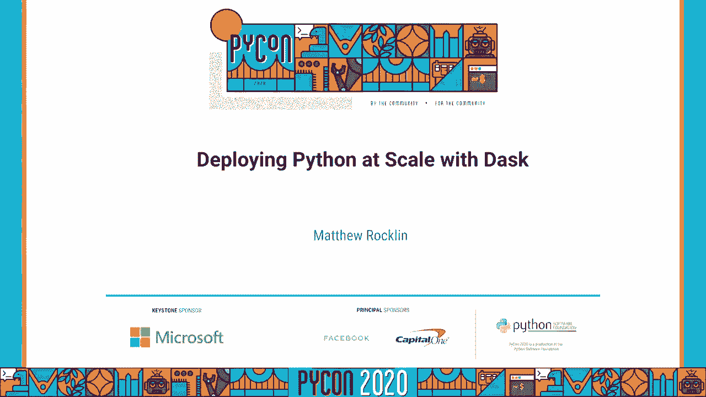
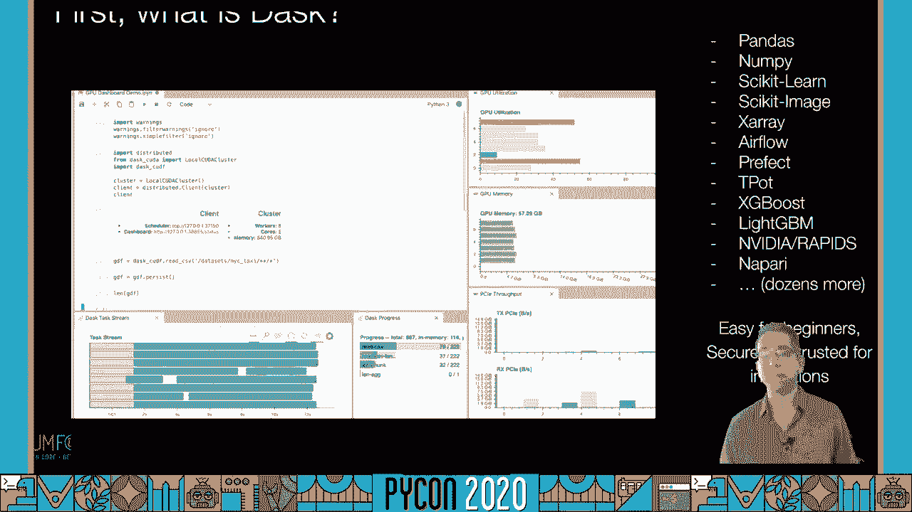
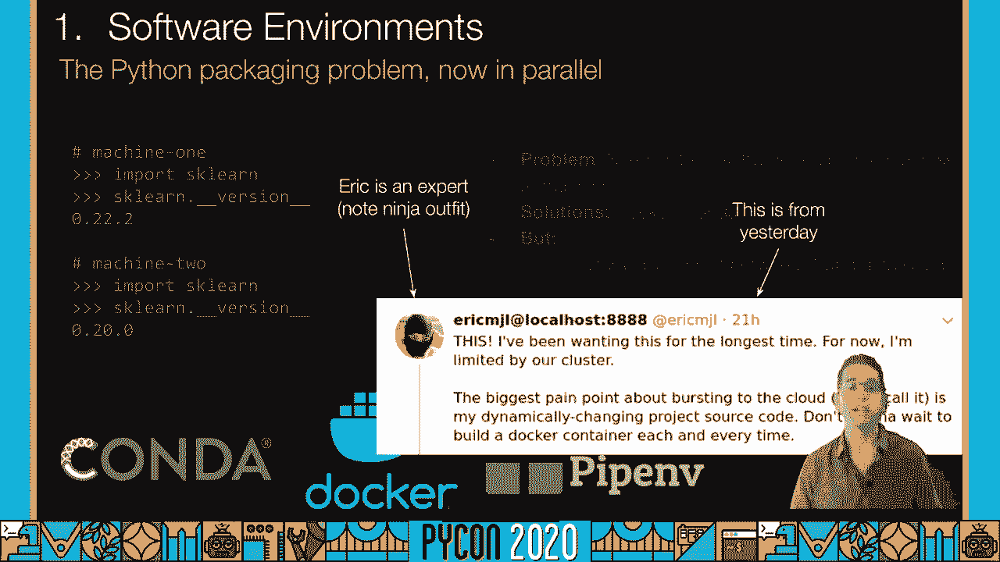
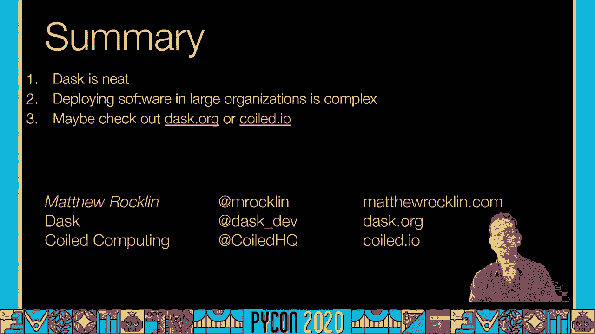
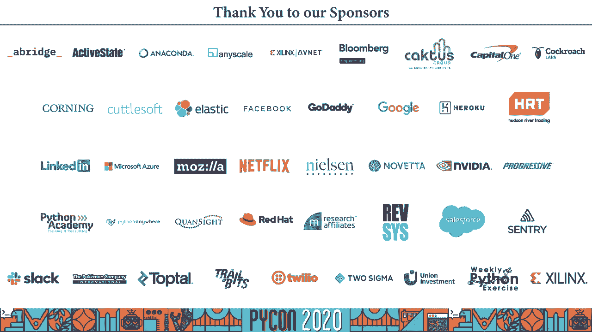

# 059：在规模化环境中部署 Dask




在本教程中，我们将学习如何在分布式硬件上部署 Dask，并探讨在企业或机构环境中可能遇到的挑战。我们将重点关注环境管理、安全合规以及成本控制等核心问题，帮助初学者理解如何安全、高效地使用 Dask 进行大规模数据科学计算。

## 什么是 Dask？🤔


在深入探讨部署挑战之前，让我们先了解 Dask 是什么以及它能做什么。


Dask 是一个用于 Python 的并行计算库，它能够将计算任务扩展到多台机器上。其核心思想是模仿单机体验，但在分布式环境中运行。Dask 的架构包含三个主要组件：

*   **调度器**：一个中心化的协调者，负责管理任务和工人。
*   **工人**：多个执行实际计算任务的 Python 进程。
*   **客户端**：用户与之交互的接口（如 Jupyter Notebook 或 Python 脚本）。


一个简单的 Dask 集群设置流程如下：

1.  在一台机器上启动调度器：`dask scheduler`
2.  在其他机器上启动工人并连接到调度器：`dask worker tcp://scheduler-address:8786`
3.  在客户端代码中连接调度器：`from dask.distributed import Client; client = Client('tcp://scheduler-address:8786')`



## 环境管理：让集群像一台电脑 🖥️


上一节我们介绍了 Dask 的基本概念，本节中我们来看看如何管理分布式环境，使其对数据科学家而言像使用一台笔记本电脑一样简单。这主要涉及三个挑战。

### 统一的软件环境

所有机器（调度器、工人、客户端）必须运行相同版本的 Python、Dask 以及其他依赖库。在动态变化的数据科学工作中，这尤其具有挑战性。

**解决方案**：使用容器化技术（如 Docker）或环境管理工具（如 Conda）来打包和分发一致的软件环境。

### 资源共享

在多人协作的机构中，集群需要在不同用户和工作负载之间共享。

**解决方案**：利用资源管理器，例如：
*   Kubernetes
*   Hadoop YARN
*   作业调度系统（如 Slurm, PBS, LSF）

这些系统可以动态分配和回收计算资源。

### 数据访问

在单机上，数据通常存储在本地硬盘。在分布式集群中，数据可能位于远程对象存储（如 Amazon S3）或网络文件系统。

**解决方案**：使用共享存储系统，并确保 Dask 配置了正确的凭据来访问这些数据源。

## 安全与合规：保护数据和资源 🔒

环境管理确保计算能够进行，而安全合规则确保计算在受控和授权的环境下进行。以下是需要关注的重点。



### 认证与授权

必须确保只有正确的用户才能访问集群和数据。在云环境中，需要安全地管理凭据（如 AWS 密钥），避免将其硬编码或明文传输。

**解决方案**：集成企业的身份认证系统（如 Kerberos），并使用密钥管理服务安全地传递凭据。

### 网络安全

像 Dask 这样的系统会在网络间传输代码和数据。如果没有保护，恶意用户可能窃听或冒充他人。

**解决方案**：为 Dask 集群启用传输层安全协议。Dask 支持 TLS/SSL 加密，需要为其配置证书。

## 成本管理：避免意外账单 💰

在云端，计算资源直接与成本挂钩。赋予数据科学家强大的伸缩能力的同时，也需要建立机制来控制成本。

### 避免资源闲置

数据科学工作负载通常是突发性的：短时间使用大量机器进行计算，然后长时间进行分析。闲置的机器会产生不必要的费用。

**解决方案**：
*   **自适应伸缩**：配置 Dask 集群根据负载自动增加或减少工人数量。
*   **自动空闲超时**：设置规则，在工人空闲一段时间后自动关闭它们。

### 监控与追踪

需要了解资源的使用情况，以便优化和问责。

**解决方案**：使用监控系统（如 Prometheus、Datadog 或云服务商的控制台）来追踪每个用户、团队或任务的实际资源消耗和成本。

### 性能剖析

低效的代码在单机上可能问题不大，但在成百上千台机器上运行时，会显著放大成本。

**解决方案**：定期使用 Dask 的内置性能分析工具来识别和优化计算瓶颈。代码示例如下：
```python
from dask.distributed import performance_report
with performance_report(filename="dask-report.html"):
    # 执行你的 Dask 计算
    result.compute()
```

## 总结与解决方案 🎯

本节课中我们一起学习了在规模化机构中部署 Dask 时会遇到的主要挑战：环境管理、安全合规和成本控制。

对于这些问题，存在许多成熟的解决方案：
*   **环境与资源**：Kubernetes、Docker、YARN 等。
*   **安全**：TLS、企业身份认证集成。
*   **成本与监控**：自适应伸缩、Prometheus、Dask 性能分析器。

你可以选择组合这些开源工具来自行搭建和管理平台，也可以考虑采用**托管解决方案**（如 Coiled）。托管服务提供了开箱即用的集成，但可能会产生额外费用并有一定程度的供应商锁定。对于刚起步的团队，托管服务通常是快速上手的有效途径。





总之，在大型组织中部署分布式数据科学计算是复杂的，但通过理解这些核心挑战并利用现有工具，完全可以构建出既强大又可控的 Dask 计算环境。