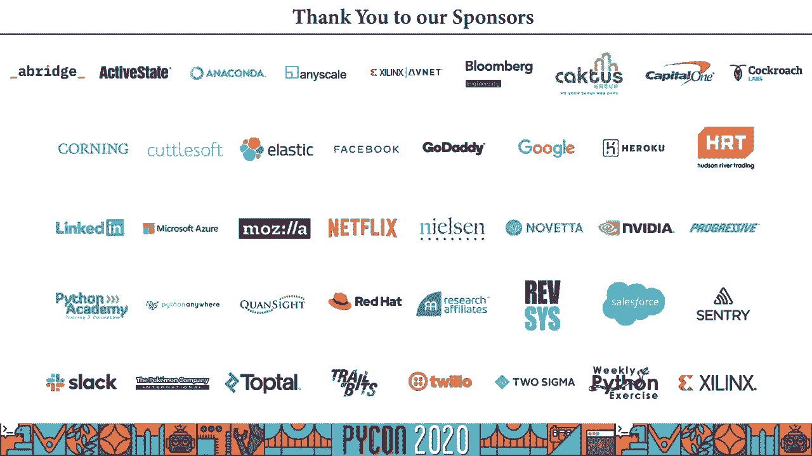

# 066：装在箱子里的蛇 🐍📦


## 概述

在本节课中，我们将学习如何使用 Briefcase 工具来打包 Python 应用程序。我们将了解为什么需要专门的打包工具，Briefcase 是如何工作的，以及如何用它来为不同平台（如 Windows、macOS、Linux、iOS 和 Android）创建独立的、用户友好的应用程序安装包。

---

## 为什么需要打包 Python 应用程序？ 🤔

上一节我们介绍了 Python 打包的背景，本节中我们来看看分发 Python 代码的不同场景及其挑战。

Python 生态系统为库的分发提供了良好的解决方案（如 `pip` 和 PyPI）。然而，当我们需要将 Python 代码作为独立的应用程序分发给最终用户时，情况就变得复杂了。这些用户可能不是 Python 开发者，他们不关心虚拟环境或依赖管理，他们只希望像安装其他软件一样轻松地安装和运行你的应用。

以下是几种常见的分发场景及其面临的挑战：

*   **库分发**：例如 `requests`。用户通过 `pip install` 安装，然后在代码中 `import` 使用。Python 对此有成熟的工具链（`setuptools`, `pip`, `twine`）。
*   **项目分发**：例如一个 Django 网站或 Jupyter 笔记本集合。通常通过复制代码仓库来分发，运行环境（依赖、解释器）的设置留给用户，这需要用户具备一定的 Python 知识。
*   **命令行工具分发**：例如 `pytest` 或 `black`。虽然可以通过 `pip` 安装并生成命令行入口点，但对于非 Python 开发者或希望全局安装的用户来说，体验并不友好。
*   **图形界面应用程序分发**：例如一个用 Python 编写的桌面应用（如 Slack）。最终用户希望以熟悉的方式（如安装程序、应用商店）安装和运行，完全无需感知 Python 的存在。

目前，只有第一种场景（库分发）在 Python 生态中有完善的解决方案。Briefcase 的目标就是解决后两种场景，特别是图形界面应用的分发问题，让 Python 代码能像原生应用一样被交付给最终用户。

---

## 什么是 Briefcase？ 🧰

上一节我们探讨了应用程序分发的难题，本节中我们来看看 Briefcase 提供的解决方案。

Briefcase 是 BeeWare 项目下的一个工具，专门用于将 Python 项目打包成可以独立分发的应用程序。它的核心目标是：**让没有 Python 经验的最终用户能够安装和运行你的应用，而无需知道它背后是 Python。**

Briefcase 是一个符合 **PEP 518** 的构建工具，使用 `pyproject.toml` 文件进行配置。它的工作原理可以概括为一个简单的公式：

> **Briefcase 应用 = 你的代码 + 所有依赖 + 完整的 Python 解释器**

它将这些组件一起打包，形成适合目标平台的格式：
*   **Windows**: 生成 `.msi` 安装程序。
*   **macOS**: 生成 `.dmg` 磁盘映像或 `.app` 应用包。
*   **Linux**: 生成 AppImage 等格式。
*   **iOS / Android**: 生成可提交到相应应用商店的项目。

Briefcase 具有高度可扩展性，理论上可以支持任何需要打包 Python 代码的平台。

---

## Briefcase 工作流程 🔄

上一节我们介绍了 Briefcase 的概念，本节中我们通过一个“Hello World”示例，一步步了解使用 Briefcase 打包应用的生命周期。

### 1. 创建新项目

首先，你需要安装 Briefcase 并创建一个新项目。

```bash
# 创建虚拟环境并安装 briefcase (可选但推荐)
python -m venv venv
source venv/bin/activate  # Windows: venv\Scripts\activate
pip install briefcase

# 使用向导创建新项目
briefcase new
```

运行 `briefcase new` 后，会启动一个交互式向导，询问项目信息：
*   **正式名称**：展示给用户的名称（如 `Hello World`）。
*   **应用名称**：内部使用的 Python 标识符（如 `hello-world`）。
*   **Bundle ID**：应用商店使用的唯一标识符，通常是反向域名（如 `com.example.helloworld`）。
*   **项目名称**：包含多个应用的父项目名称。
*   **作者、描述、URL、许可证**：项目元数据。
*   **GUI 框架**：选择模板（如 `Toga`, `PySide`, 空项目）。

向导会生成一个包含基础代码、图标和配置文件的项目目录。

### 2. 项目配置文件 `pyproject.toml`

生成的项目核心是 `pyproject.toml` 文件，它包含了项目的所有配置。

```toml
[build-system]
requires = ["briefcase"]
build-backend = "briefcase.backend"

[tool.briefcase]
# 项目级配置
version = "0.0.1"
description = "A simple Hello World application."

[tool.briefcase.app.hello_world] # 应用配置
formal_name = "Hello World"
description = "A simple Hello World application."
sources = ['hello_world'] # 源代码目录
requires = [] # Python 依赖列表
icon = "icon" # 图标基名（不包含扩展名）

# 平台特定配置（覆盖应用级配置）
[tool.briefcase.app.hello_world.macos]
requires = ["toga-cocoa==0.3.0.dev31"] # macOS 特定依赖
```

**关键配置项说明：**
*   `sources`: 指定要打包的源代码目录列表。**必须有一个目录与应用名称匹配**。
*   `requires`: 定义 Python 依赖，格式与 `pip install` 相同。
*   配置具有继承和覆盖关系：平台配置 > 应用配置 > 项目配置。
*   `sources` 和 `requires` 是累积的（追加），而其他配置是覆盖的。

### 3. 开发模式运行

在开发过程中，你可以使用 `briefcase dev` 命令快速运行应用，它会在本地虚拟环境中安装依赖并启动应用。

```bash
briefcase dev
```
这相当于执行了 `pip install` 你的依赖，然后运行 `python -m hello_world`。修改代码后，重新运行此命令即可。

### 4. 为分发创建、构建和打包应用

当你准备好分发应用时，需要执行以下步骤：

**a. 创建 (Create)**
```bash
briefcase create
```
此命令会：
1.  获取当前平台（如 macOS）的应用模板。
2.  下载一个包含完整 Python 解释器的“支持包”。
3.  将支持包解压到模板中。
4.  将你的应用代码和所有依赖安装到模板里。
生成一个位于 `macOS` 或 `windows` 等平台文件夹下的、可执行的应用程序骨架。

**b. 构建 (Build)**
```bash
briefcase build
```
此命令执行平台特定的编译步骤（在 macOS 上可能什么都不做，因为 `.app` 目录已是可执行格式）。

**c. 运行测试 (Run)**
```bash
briefcase run
```
运行你刚刚打包好的应用程序，确保它能正常工作。

**d. 打包 (Package)**
```bash
briefcase package
```
此命令生成最终的分发包，如 `.dmg` (macOS)、`.msi` (Windows) 或 AppImage (Linux)。它还会处理一些收尾工作，如代码签名（部分平台支持）。

### 5. 更新应用

如果你修改了代码或依赖，不需要从头开始。使用 `update` 命令：

```bash
briefcase update # 仅更新应用代码
briefcase update -d # 更新依赖
briefcase update -r # 更新资源（如图标）
```

更高效的开发循环是直接使用：
```bash
briefcase run -u # 运行前先更新应用代码
```

---

## Briefcase 的优势与当前限制 ⚖️

上一节我们走完了打包流程，本节中我们总结一下 Briefcase 的特点和需要注意的地方。

### 优势

1.  **简单直接**：Briefcase 采用最直观的方式运行 Python——在一个包含解释器的目录中执行。这避免了其他工具（如 PyInstaller）将代码打包进可执行文件可能带来的复杂性和兼容性问题。
2.  **真正的跨平台**：一份 `pyproject.toml` 配置文件，可以为所有支持的平台生成安装包。
3.  **对用户友好**：最终用户获得的是一个标准的、平台原生的应用程序，安装和运行体验与任何其他软件无异。
4.  **可扩展性**：架构支持轻松添加新的目标平台（如游戏主机、电视）或新的打包格式（如 Flatpak、Snap）。

### 当前限制与待改进之处

1.  **应用体积较大**：由于捆绑了完整的 Python 解释器和标准库，生成的应用包体积较大（约 200MB）。**解决方案**：可以创建自定义的、精简过的“支持包”，将体积减小到 30MB 左右。
2.  **平台功能完善度**：某些平台的特定功能尚在开发中，例如：
    *   Linux 桌面图标集成。
    *   Windows 代码签名。
    *   iOS 部署到物理设备。
    *   macOS 公证。
3.  **命令行工具支持不足**：Briefcase 主要面向 GUI 应用，对纯命令行工具的分发模式尚不明确。
4.  **对其他 GUI 框架的测试**：虽然支持（如 PySide、Tkinter），但主要测试集中在 Toga 框架上。对其他框架（特别是游戏库如 PyGame）的兼容性需要更多社区验证。

---

## 总结

本节课中我们一起学习了如何使用 Briefcase 工具来打包 Python 应用程序。

我们从**为什么需要专门的应用程序打包工具**开始，分析了 Python 代码分发给最终用户时的不同场景和挑战。然后，我们介绍了 **Briefcase** 的核心概念，它通过将你的代码、依赖和完整的 Python 解释器一起打包，来解决图形界面应用的分发问题。

我们详细走过了使用 Briefcase 的典型工作流程：从通过 `briefcase new` **创建新项目** 并配置 `pyproject.toml` 文件，到使用 `briefcase dev` 进行**开发测试**，再到使用 `create`、`build`、`run`、`package` 命令为分发**创建、构建和打包应用**。我们还了解了如何使用 `update` 命令来快速迭代。

最后，我们讨论了 Briefcase 的**主要优势**（简单、跨平台、用户友好）和**当前的限制**（应用体积、平台特定功能待完善），这些信息可以帮助你评估它是否适合你的项目。



Briefcase 是让 Python 突破开发环境，进入普通用户桌面和移动设备世界的重要工具。虽然仍有改进空间，但它已经为分发独立的 Python 应用程序提供了一个强大而可行的解决方案。