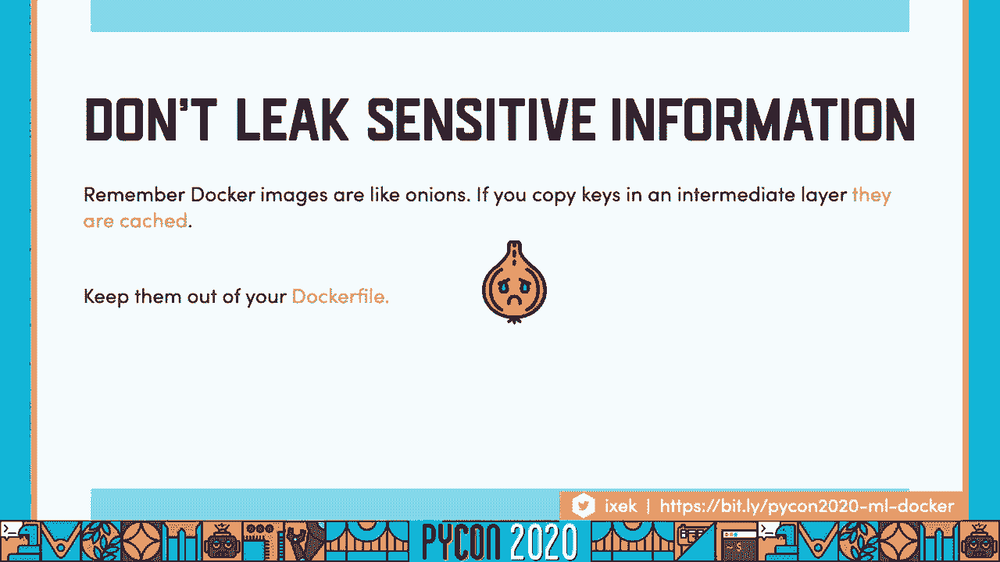
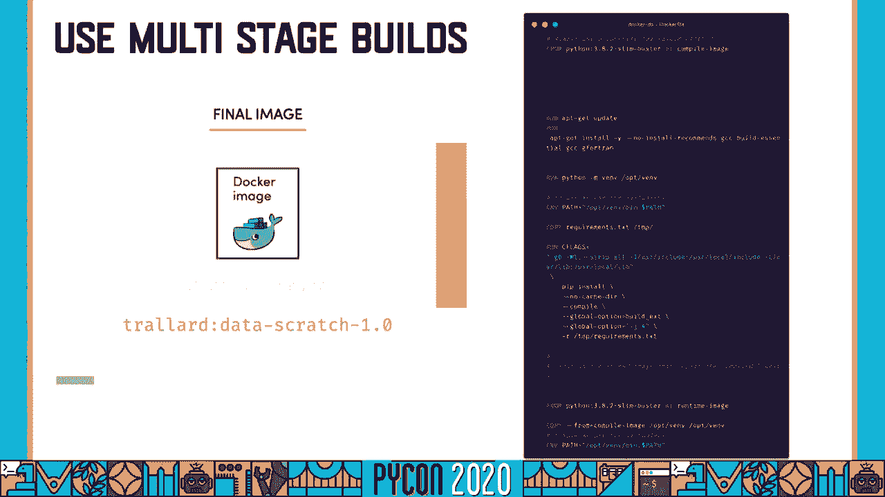
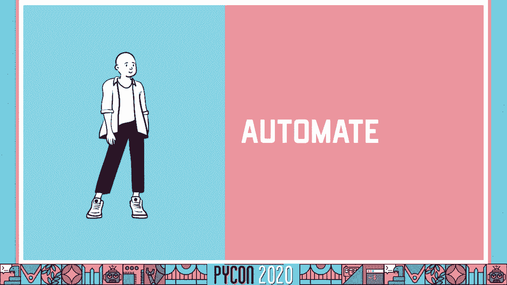
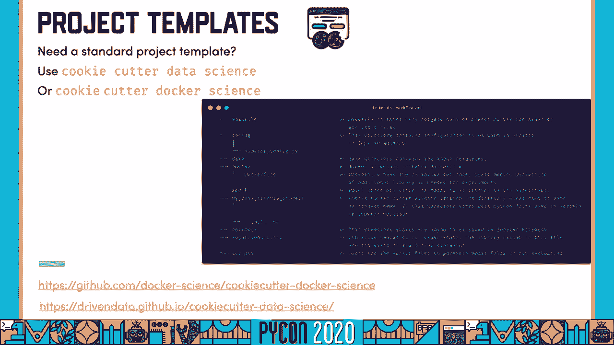
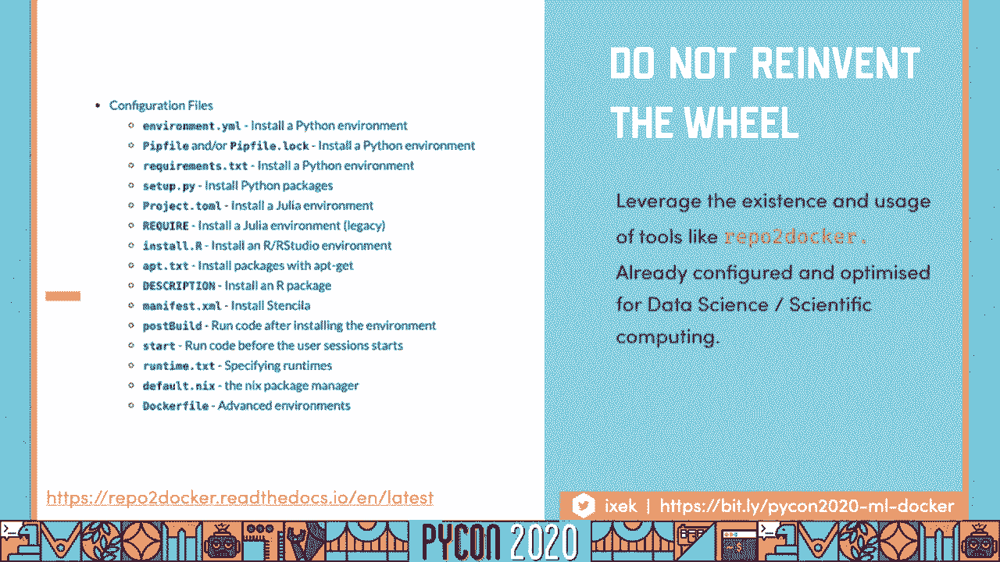
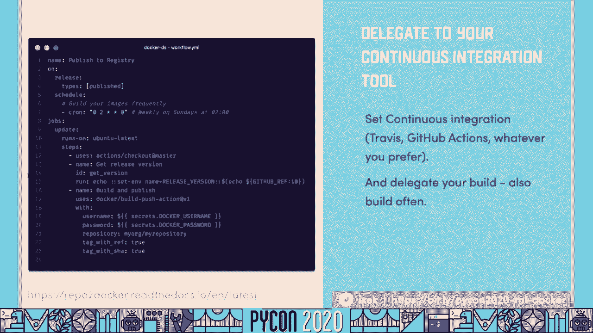
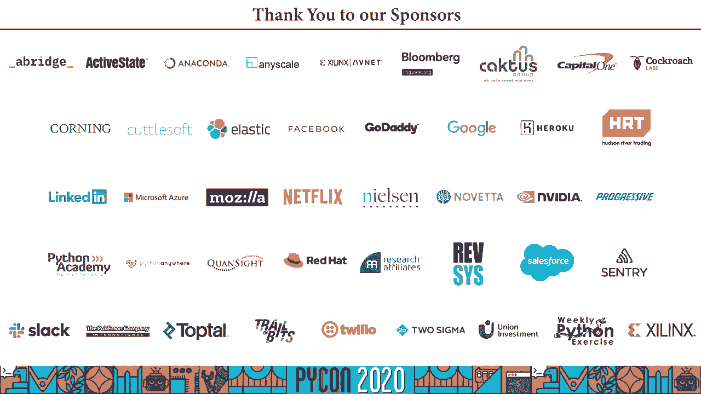

# 070：核心概念与最佳实践


## 概述

在本教程中，我们将学习如何让Docker与Python在数据科学和机器学习项目中安全、高效地协同工作。我们将从理解Docker的核心概念开始，探讨数据科学场景下的常见痛点，并深入一系列关于安全性、性能优化和自动化的工作流程与最佳实践。

---

## Docker与Python安全协作教程：1：为什么选择Docker？

在数据科学或机器学习项目中，开发通常在本地计算机上进行。然而，当需要将应用程序、模型或研究项目交付给他人（如客户或同事）时，常常会遇到环境依赖问题。

例如，您可能遇到“模块不存在”的错误。如果用户使用不同的Python运行时（如Python 2.7与Python 3），或者不同的操作系统（如Ubuntu、Red Hat、Windows），问题会更加复杂。用户可能不清楚需要安装哪些依赖项或如何配置环境。

Docker正是解决此类问题的工具。Docker允许您创建、部署和运行容器化的应用程序或项目。**容器提供了一种解决方案**，可以将您的软件、模型或应用程序从一个计算环境可靠地转移到另一个计算环境。

这种转移可以是从您的笔记本电脑到测试、预发布或生产环境，也可以是在不同人员的笔记本电脑之间。

---

## Docker与Python安全协作教程：2：容器与虚拟机

如果您熟悉虚拟机，可能会觉得容器有些相似。让我们来比较两者的架构。

在Docker容器的工作方式中，您的基础设施（可能是服务器、云或您的电脑）上运行着主机操作系统。Docker引擎安装在操作系统之上。然后，您可以运行许多不同的、容器化的应用程序。

在这种设置中，每个应用程序都被封装。Docker和容器在应用程序级别工作，每个应用程序作为一个独立的进程运行。整个操作系统和基础设施都被抽象化了。因此，无论您是在Ubuntu还是Red Hat上开发，而其他人在Windows上使用，都没有关系。

另一方面，虚拟机从基础设施开始，在其上运行虚拟机管理程序。因此，虚拟机管理程序位于物理服务器的顶部，您可以在其上运行两个完全独立的操作系统。

虚拟机在硬件层面工作，这意味着您不仅虚拟化了应用程序，还虚拟化了整个操作系统、二进制文件、依赖项以及所有在基础设施上工作的东西。

---

## Docker与Python安全协作教程：3：镜像与容器

当您深入Docker世界时，可能会遇到“镜像”和“容器”这两个术语，它们在开始时可能令人困惑。

镜像是一个存档文件，包含了运行应用程序所需的所有数据。它需要有一个标签，可以是“latest”，也可以是具体的版本号（如语义版本`v1.2.3`或日历版本`2023.01`），或者是提交的引用哈希。

当您从仓库（如Docker Hub或您的私有仓库）拉取镜像后，使用`docker run`命令运行该镜像时，Docker实际上会创建一个容器。您所有的开发工作都将在这个隔离的容器中进行。

---

## Docker与Python安全协作教程：4：数据科学与Docker的常见痛点

上一节我们介绍了Docker的基本概念，本节中我们来看看在数据科学和机器学习项目中结合使用Docker时，有哪些常见的挑战。

首先，我们倾向于使用复杂的设置或依赖项，这源于Python生态系统的特性。一些软件包和库高度依赖特定的系统库或编译环境。

其次，数据科学项目严重依赖数据和数据库。数据是我们最宝贵的资产之一。

第三，数据科学和机器学习项目往往发展非常迅速，处于研究和开发阶段时，我们倾向于采用快速迭代的过程。随着项目深入，环境管理会变得复杂，可能需要大量时间来扩展和学习。

另一个常见问题是容器的安全性。当处理医疗保健数据、金融数据或任何其他可能轻松识别个人身份的敏感数据时，我们必须确保容器足够安全。

---

## Docker与Python安全协作教程：5：创建Docker镜像的基础

如果您从未使用过Docker镜像，让我们深入了解基础知识，这将帮助您更好地理解工作流程，特别是如果您之前使用过Docker，本节也可作为复习。

我们通过`Dockerfile`文件来指定构建镜像的所有指令和要求。以下是一个简单的示例（并非最佳实践，但足够说明问题）：

```dockerfile
# 使用Python官方镜像作为基础
FROM python:3.9-slim

# 设置工作目录
WORKDIR /app

# 复制依赖文件
COPY requirements.txt .

# 安装依赖
RUN pip install --no-cache-dir -r requirements.txt

# 复制应用程序代码
COPY . .

# 定义容器启动命令
CMD ["python", "./your_script.py"]
```

`Dockerfile`中包含的每个指令都会创建一个层。最接近的类比是想象一个洋葱：您的基础镜像将是核心，每次运行一个指令（如`RUN`），它就会产生一个新层，包裹住之前的层。

您得到的指令越多，您的“洋葱”或容器就越大，层数也越多。因此，您必须明智地创建这些层以优化镜像大小和构建速度。

---

## Docker与Python安全协作教程：6：选择基础镜像与社区镜像

构建容器时，一个关键部分是选择最佳的基础镜像。您可能会在很多地方读到，Alpine Linux是最佳选择，因为它非常轻量。

但请注意，如果您要从头开始构建所有镜像，请确保使用官方的Python镜像。您可以在[Docker Hub](https://hub.docker.com/_/python)上找到不同版本和标签的镜像。

回到Alpine Linux的问题，它是一个非常轻量级的基础镜像，但这也意味着您可能需要花费大量时间来构建库和依赖项。如果这种复杂性不值得，对于Python项目，建议使用`slim`变体，例如`python:3.9-slim-buster`。它基于Debian，并且有长期支持，因此很可能会有持续的安全更新。

从头创建Docker镜像可能需要很长时间。如果您发现需要Conda、Jupyter Notebook以及整个科学Python生态系统（这在数据科学和机器学习中很常见），可以考虑使用社区维护的镜像。

例如，Jupyter社区在制作这些容器和镜像上付出了很多努力。Jupyter Docker Stacks包含了一系列镜像，它们都从Ubuntu基础镜像开始，一层层叠加了科学计算环境。

如果您需要更复杂的设置，例如包含TensorFlow或PySpark，也可以使用`jupyter/tensorflow-notebook`或`jupyter/pyspark-notebook`作为基础镜像来构建。

---

## Docker与Python安全协作教程：7：Dockerfile最佳实践

以下是构建Docker容器的一些通用最佳实践，这些实践会让您受益匪浅。

首先，始终使用具体的镜像标签。避免使用“latest”标签，因为当创建下一个推送或下一个镜像时，它可能会改变您的构建结果。例如，使用`jupyter/base-notebook:python-3.9.7`而非`jupyter/base-notebook:latest`。

使用标签提供上下文很重要。您可以添加重要信息，例如维护者、环境（如`prod`、`staging`）等。

有时我们可能觉得有必要使用非常复杂的`RUN`语句，但可读性非常重要。确保拆分`RUN`片段并对它们进行排序。也更倾向于使用`COPY`而不是`ADD`命令来添加文件。

Docker擅长使用缓存。如果某一层中的依赖项或文件没有改变，Docker会保留该层以加快构建速度。因此，在组织您的`Dockerfile`时要非常小心，将变动频繁的指令（如复制源代码）放在后面，将安装依赖项等相对稳定的指令放在前面。

只安装必要的软件包。有时我们会觉得有必要添加额外的包“以防万一”，但这会使您的镜像膨胀，同时增加潜在的安全风险。

使用`.dockerignore`文件明确忽略不需要的文件。这类似于Git的`.gitignore`文件，可以帮助您避免将不必要的文件（如虚拟环境目录、本地数据、日志文件）打包进镜像。

永远不要将敏感数据或秘密（如密码、API密钥）硬编码到`Dockerfile`或镜像层中。我们将在安全章节详细讨论。

---

## Docker与Python安全协作教程：8：数据管理与容器运行

我已经告诉过您不要将数据添加到您的`Dockerfile`中。那么如何让容器访问数据呢？有以下几种方式。

您可以配置容器访问远程数据库，确保容器能够通过网络连接到数据库。

对于本地开发，您可以使用**绑定挂载**将主机上的目录挂载到容器中。这样，您可以在容器内进行开发，所有更改将直接保存在主机的本地文件中。例如：

```bash
docker run -v /path/on/host:/path/in/container my-image
```

您还需要确保以非root用户身份运行容器。默认情况下，以root身份运行容器可能会带来安全风险，并且在访问或更改文件权限时可能遇到问题。我们将在下一节深入讨论安全问题。

---



## Docker与Python安全协作教程：9：容器安全核心要点

使用Docker和容器的主要问题之一是安全性。我之前提到过，运行容器时应使用非特权用户，这主要是为了遵循**最小权限原则**。

这对于最大限度地减少或防止攻击非常重要。默认情况下，第一次运行`docker run`时可能需要root权限来更新内核库，但之后应切换到非root用户。

确保最小化用户的能力。例如，在您的`Dockerfile`中，可以显式创建一个名为`appuser`的非特权用户：

```dockerfile
RUN groupadd -r appuser && useradd -r -g appuser appuser
USER appuser
```

如果您使用Jupyter Stack容器中的任何一个，则无需担心，因为Jupyter社区已经确保您不是以特权用户身份运行。

处理敏感信息时要非常小心。保护您容器的第一道防线是将包含这些秘密的文件添加到`.dockerignore`中，这样它们就无法进入镜像。



不要将这些秘密写入`Dockerfile`。您可以通过运行时环境变量（使用`-e`标志）或Docker Secrets等其他机制来提供。

请注意，即使您在某一层中复制了秘密文件，然后在后续层中删除它，由于镜像层的缓存机制，这些文件仍然可能被访问到。一个更强大的方法是使用**多阶段构建**。

---



## Docker与Python安全协作教程：10：多阶段构建

一个非常强大的方法来保护您的Docker容器和秘密，是使用多阶段构建。如果您在中间层获取和管理机密，那么该层或该镜像会被丢弃，因此它们不会在最终的镜像中持续存在。

另一个优势是，特别是在科学Python生态系统中，并非所有的依赖项都会以预编译的“wheel”格式提供。您可能需要一个编译器（如`gcc`）来编译二进制文件。

使用多阶段构建时，您可以在一个“构建”镜像中安装编译器和所有构建依赖项，执行编译，然后仅将编译好的成品（如Python包、可执行文件）复制到一个干净的“运行时”镜像中。这有助于创建更小的最终镜像。

以下是一个简化的多阶段构建示例：

```dockerfile
# 第一阶段：构建阶段
FROM python:3.9 AS builder
WORKDIR /app
COPY requirements.txt .
RUN pip install --user -r requirements.txt



# 第二阶段：运行时阶段
FROM python:3.9-slim
WORKDIR /app
# 从构建阶段复制已安装的包
COPY --from=builder /root/.local /root/.local
# 复制应用程序代码
COPY . .
# 确保使用用户安装的包
ENV PATH=/root/.local/bin:$PATH
CMD ["python", "./your_script.py"]
```

最终的镜像是运行时镜像，它不包含编译器和其他构建时文件，因此更小、更安全。

---

## Docker与Python安全协作教程：11：自动化与可复现性

到目前为止，我给了您很多建议，但手动完成这一切可能会非常令人生畏，尤其是如果您只为个人用途构建容器。

使用Docker容器的主要优点之一是**可复现性**。在机器学习研究和科学计算中，我们非常关心这一点。我们通常希望与他人分享我们的资产，以便他人可以验证我们的研究和发现。



因此，我们能做的最好的事情之一就是标准化。每当我谈到可复现性时，我一直推荐的是使用标准模板。这样，每个人都有一个已知的起点，并且项目的结构是清晰一致的。

如果您正在为数据科学项目寻找好的项目模板，可以尝试使用`cookiecutter-data-science`。如果您对它的Docker版本感兴趣，可以使用`cookiecutter-docker-science`。这些工具将为您创建一个健壮的项目模板，包含预定义的目录结构、`Dockerfile`示例等。

---

## Docker与Python安全协作教程：12：利用社区工具（Repo2Docker）

第二步是不要重新发明轮子。社区中已经开发出了非常好的软件包。

我最喜欢的包之一是**Repo2Docker**。它接受一个代码仓库（可以是本地的或远程URL），并自动构建一个适用于该仓库的Docker镜像。

主要优点是它已经为数据科学和科学计算进行了配置和优化。常见的工作流程是，您拥有一个配置文件（如`environment.yml`, `requirements.txt`, `Pipfile`）来描述项目的依赖项。

一旦您运行`jupyter-repo2docker`命令并提供路径（本地目录或Git仓库URL），它将使用Jupyter社区维护的Docker基础镜像为您构建Docker容器。



最妙的是，您甚至不用写一个`Dockerfile`，也不必花很多时间完善它。因此，如果您在寻找一种可靠的方法来创建Docker容器，Repo2Docker是一个极好的工具。

---

## Docker与Python安全协作教程：13：持续集成与自动构建

最后，将构建过程委托给持续集成系统。我提到过您可以创建并标记您的镜像。在很多情况下，您需要创建新版本的Docker镜像，例如当您发布了新版本的包、模型或应用程序时。

一个非常好的做法是定期重建您的镜像。如果您广泛使用Docker进行研究、开发、测试和生产，建议每周重建一次，以确保获得所有安全更新。

手动完成这件事可能很麻烦，因此最佳方法是使用持续集成工具，如GitHub Actions、GitLab CI/CD、Travis CI等。将构建过程自动化，这样您就可以将精力集中在代码上。

以下是一个GitHub Actions工作流的简化示例，它会在创建新Git标签或每周日触发镜像构建：

```yaml
name: Build and Push Docker Image

on:
  push:
    tags:
      - ‘v*’ # 当推送v开头的标签时触发
  schedule:
    - cron: ‘0 2 * * 0’ # 每周日凌晨2点 (UTC)

jobs:
  build:
    runs-on: ubuntu-latest
    steps:
      - name: Checkout code
        uses: actions/checkout@v2

      - name: Log in to Docker Hub
        uses: docker/login-action@v1
        with:
          username: ${{ secrets.DOCKER_USERNAME }}
          password: ${{ secrets.DOCKER_PASSWORD }}

      - name: Build and push Docker image
        uses: docker/build-push-action@v2
        with:
          context: .
          push: true
          tags: |
            your-username/your-image:latest
            your-username/your-image:${{ github.ref_name }} # 使用标签名
```

在这个工作流中，您的代码和配置文件（如`requirements.txt`）存储在版本控制中。当触发事件发生时，CI系统会自动构建镜像并将其推送到镜像仓库。

---

## Docker与Python安全协作教程：14：顶级技巧总结

本节课中我们一起学习了Docker与Python协作的完整工作流。最后，让我为您提供与Docker和数据科学协作的顶级技巧总结。

1.  **定期重建镜像**：如果您要使用您的容器，应该定期重建它。这确保了您能获得安全更新，并且依赖项不会过时。
2.  **最小化权限**：永远不要以root身份运行容器。您的权限越低越好。同时，注意跟踪您正在使用的所有端口以及如何将它们绑定到容器。
3.  **明智选择基础镜像**：不建议盲目使用Alpine Linux。对于Python，考虑`slim-buster`或Jupyter Stack镜像。始终知道您期望什么，使用具体的版本标签。
4.  **利用构建缓存**：优化`Dockerfile`指令顺序以充分利用Docker的缓存层，这能显著影响镜像构建的性能。
5.  **专镜专用**：确保每个项目使用一个`Dockerfile`。您可以有一个基础镜像，然后针对不同项目进行扩展。避免创建包含大量不必要依赖项的“万能”大镜像。
6.  **使用多阶段构建**：如果您选择从头开始创建自己的容器，并且需要编译代码或缩小镜像大小，多阶段构建是一个非常好的选择。
7.  **标识镜像环境**：确保您的镜像是可识别的。通过标签区分是用于测试、生产还是研发。
8.  **安全访问数据**：访问数据库时要小心。使用环境变量和密钥管理工具，不要硬编码秘密。
9.  **善用社区工具**：如果您不需要非常复杂的设置，使用Repo2Docker或Jupyter生态系统堆栈可以让您快速开始，无需从头手动完成所有事情。
10. **自动化一切**：如果您已经在使用GitHub，尝试探索GitHub Actions。如果使用GitLab，它也有出色的CI/CD集成。利用它们自动化构建和部署流程。
11. **使用Linter**：在编写`Dockerfile`时，可以尽早发现错误。VS Code等编辑器具有出色的Docker扩展，可以帮助进行语法检查、镜像检查和代码提示。



如果您遵循这些顶级技巧，我可以保证您的工作流程和镜像将与机器学习、Python和数据科学更好地协作。明智地自动化，明智地重用现有工具和模式。