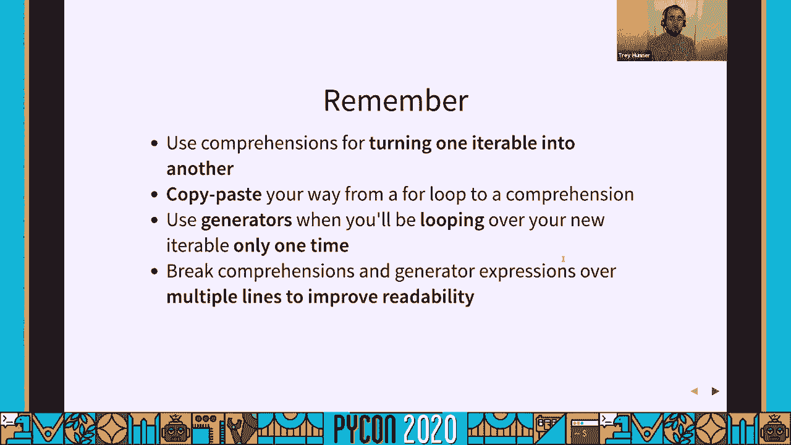

# 072：从循环到推导式


在本教程中，我们将学习 Python 中的列表推导式。这是一种将循环转换为更简洁、更具描述性代码的强大工具。我们将从基础的 `for` 循环开始，逐步展示如何将其重构为列表推导式，并探讨其优势、语法变体以及最佳实践。

## 概述

列表推导式是 Python 中用于将一个列表（或任何可迭代对象）转换为另一个列表的特殊语法。它的核心目的是：**修改元素**、**筛选元素**，或两者兼有。虽然 `for` 循环也能完成这些任务，但列表推导式通常更简洁，并能更清晰地表达“创建新列表”的意图。

## 为什么在 Python 中常见“创建新列表”？

在 Python 中，将旧列表转换为新列表是非常普遍的操作，主要有两个原因：

1.  **避免修改原列表**：直接修改正在遍历的列表（如删除元素）容易出错且代码复杂。Python 鼓励我们创建新列表。
2.  **变量是引用**：Python 变量是指向对象的引用。如果通过一个变量修改了列表，所有指向该列表的变量都会看到变化。为了避免意外的副作用，创建副本或新列表是更安全的选择。

因此，将 `for` 循环用于“创建新列表”是 Python 中的常见模式。

## 从 `for` 循环到列表推导式

让我们从一个简单的 `for` 循环开始，它遍历一个列表，对每个元素进行平方，并将结果存入新列表。

```python
# 使用 for 循环
numbers = [1, 2, 3, 4, 5]
squared_numbers = []
for n in numbers:
    squared_numbers.append(n ** 2)
```

上面的循环可以等价地写成一个列表推导式：

```python
# 等价的列表推导式
numbers = [1, 2, 3, 4, 5]
squared_numbers = [n ** 2 for n in numbers]
```

这个推导式将四行代码浓缩为一行，但包含了相同的核心组成部分。

## 推导式的组成部分

我们可以将 `for` 循环中的关键部分映射到列表推导式中：

*   **新列表变量名**：在推导式中，我们直接将结果赋值给 `squared_numbers`。
*   **方括号 `[]`**：表示正在创建一个新列表。
*   **循环逻辑 (`for n in numbers`)**：定义了遍历的来源。
*   **要附加的表达式 (`n ** 2`)**：定义了如何转换每个元素。
*   **筛选条件 (`if` 语句)**：可选，用于过滤元素（稍后介绍）。

列表推导式的语法可以概括为：
`[`**`表达式`** `for` **`元素`** `in` **`可迭代对象`** `if` **`条件`**`]`

## 转换秘诀：复制粘贴法

如果你有一个格式正确的 `for` 循环，可以遵循以下步骤将其转换为列表推导式：

1.  写下空列表的方括号 `[]`。
2.  将 `append()` 方法中的**表达式**复制到方括号的开头。
3.  将 `for` 循环行（从 `for` 到 `in` 的部分）复制到表达式之后。
4.  如果循环中有 `if` 条件，将其复制到 `for` 子句之后。

例如，从下面的筛选循环开始：

```python
result = []
for n in numbers:
    if n % 2 == 1:  # 筛选奇数
        result.append(n ** 2)
```

应用复制粘贴法：
1.  `[]`
2.  表达式是 `n ** 2` -> `[n ** 2`
3.  `for` 子句是 `for n in numbers` -> `[n ** 2 for n in numbers`
4.  `if` 条件是 `if n % 2 == 1` -> `[n ** 2 for n in numbers if n % 2 == 1]`

最终得到等价的列表推导式：`[n ** 2 for n in numbers if n % 2 == 1]`

## 提高可读性：使用多行格式

列表推导式通常写在一行，但这有时会降低可读性。Python 允许在括号内换行，我们可以将推导式分成多行以提升清晰度。

```python
# 单行推导式（可能较难阅读）
squared_odds = [n ** 2 for n in numbers if n % 2 == 1]

# 多行推导式（推荐）
squared_odds = [
    n ** 2
    for n in numbers
    if n % 2 == 1
]
```

**建议**：开始时都在多行编写推导式，只有在确实能提高可读性时才合并为一行。善用空格是写出好 Python 代码的关键。

使用列表推导式不仅是为了减少行数，更是为了**明确代码的意图**。当看到推导式时，读者能立刻明白这是在基于旧的可迭代对象创建一个新的列表。

## 列表推导式的变体

上一节我们介绍了基础的列表推导式，本节中我们来看看它的几种常见变体。

### 1. 仅映射（无筛选）

如果只需要转换元素而不进行筛选，可以省略 `if` 条件。

```python
# 仅映射：将所有单词转为小写
words = [‘Hello‘, ‘World‘, ‘Python‘]
lowercase_words = [word.lower() for word in words]
```

### 2. 仅筛选

如果只需要筛选元素而不修改它们，表达式部分直接使用元素本身。

```python
# 仅筛选：只保留奇数
numbers = [1, 2, 3, 4, 5]
odd_numbers = [n for n in numbers if n % 2 == 1]
```

### 3. 嵌套循环

可以在推导式中使用多个 `for` 子句来扁平化嵌套结构或生成笛卡尔积。

```python
# 扁平化一个二维列表
matrix = [[1, 2], [3, 4], [5, 6]]
flattened = [item for row in matrix for item in row]
# 结果: [1, 2, 3, 4, 5, 6]
```

**注意**：`for` 子句的顺序与在嵌套 `for` 循环中写的顺序一致。对于复杂的嵌套推导式，务必使用多行格式。

## 其他类型的推导式

Python 不仅支持列表推导式，还支持**集合推导式**和**字典推导式**。

### 集合推导式

使用花括号 `{}`，用于创建不包含重复元素的集合。

```python
# 创建一个包含单词长度的集合
words = [‘apple‘, ‘banana‘, ‘cherry‘]
word_lengths = {len(word) for word in words}
# 结果: {5, 6} (注意 ‘apple‘ 和 ‘cherry‘ 长度都是5)
```

### 字典推导式

同样使用花括号 `{}`，但表达式部分是 `键: 值` 对。

```python
# 创建一个将单词映射到其长度的字典
words = [‘apple‘, ‘banana‘, ‘cherry‘]
length_map = {word: len(word) for word in words}
# 结果: {‘apple‘: 5, ‘banana‘: 6, ‘cherry‘: 5}
```

对于字典推导式，通常也建议使用多行格式以提高可读性。

## 生成器表达式：惰性的推导式

生成器表达式在语法上与列表推导式极其相似，只是用圆括号 `()` 代替方括号 `[]`。

```python
# 列表推导式 - 立即计算并生成列表
list_comp = [x**2 for x in range(10)]

# 生成器表达式 - 惰性计算，返回一个生成器对象
gen_exp = (x**2 for x in range(10))
```

生成器是**惰性**和**一次性**的可迭代对象：
*   **惰性**：只有在被请求时（例如在循环中）才会计算下一个值，不会一次性占用大量内存。
*   **一次性**：遍历一次后，生成器就会耗尽，再次遍历将得不到任何元素。

**核心规则**：如果你创建了一个列表推导式，但**只对其进行一次遍历**，那么应该使用生成器表达式。这样可以避免创建不必要的临时列表。

### 生成器表达式的常见用法

生成器表达式经常直接传递给会遍历它的函数。

```python
# 例子1：拼接字符串
words = [‘Hello‘, ‘World‘]
# 先转列表再拼接
result = ‘ ‘.join([w.lower() for w in words])
# 更好的方式：直接使用生成器表达式
result = ‘ ‘.join(w.lower() for w in words)

# 例子2：计算平方和
numbers = [1, 2, 3, 4, 5]
# 先列清单再求和
total = sum([n**2 for n in numbers])
# 更好的方式：使用生成器表达式
total = sum(n**2 for n in numbers)
```

在第二个例子中，`sum(n**2 for n in numbers)` 比原始的 `for` 循环更能清晰地表达“求平方和”的意图。

## 何时不使用推导式

推导式虽好，但并非万能。以下情况应避免使用：

1.  **代码有副作用**：推导式应用于创建新数据，而不是执行如打印之类的操作。
    ```python
    # 不好：推导式产生了无用的 None 列表
    [print(n) for n in numbers]
    # 好：使用 for 循环来执行操作
    for n in numbers:
        print(n)
    ```

2.  **有更简单的内置方法**：某些情况下，内置函数或构造函数更简洁、更高效。
    ```python
    # 情况1：将元组列表转为字典
    pairs = [(‘a‘, 1), (‘b‘, 2)]
    # 使用推导式
    my_dict = {k: v for k, v in pairs}
    # 更好：使用 dict() 构造函数
    my_dict = dict(pairs)

    # 情况2：将文件行读入列表
    # 使用推导式
    with open(‘file.txt‘) as f:
        lines = [line.rstrip(‘\n‘) for line in f]
    # 更好：使用 list() 构造函数（意图更明确）
    with open(‘file.txt‘) as f:
        lines = list(f) # 或 lines = f.readlines()
    ```

## 总结与速查表

本节课中我们一起学习了 Python 推导式的核心知识：

*   **列表推导式** `[expr for item in iterable if cond]` 是创建新列表的简洁方式。
*   **集合推导式** `{expr for item in iterable if cond}` 用于创建新集合。
*   **字典推导式** `{key_expr: value_expr for item in iterable if cond}` 用于创建新字典。
*   **生成器表达式** `(expr for item in iterable if cond)` 是惰性的，适用于只需单次遍历的场景。
*   **转换秘诀**：对于格式为 `新建空列表 -> for循环 -> (可选if) -> append(表达式)` 的循环，可以使用复制粘贴法转为推导式。
*   **提高可读性**：对于复杂的推导式，使用多行格式。
*   **使用时机**：推导式最适合“转换数据”。避免在其中执行带副作用的操作，并优先使用更简单的内置函数（如 `dict()`, `list()`, `sum()` 配合生成器表达式）。

记住，空白是你的朋友。合理使用多行格式能让你的推导式代码更清晰、更易维护。




希望本教程能帮助你更好地理解和使用 Python 推导式，让代码更加 Pythonic！


