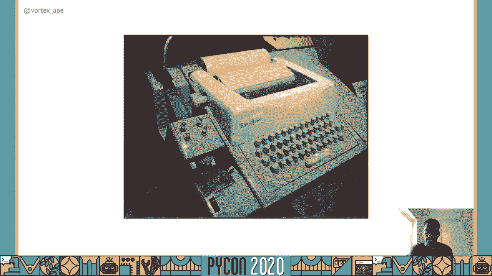
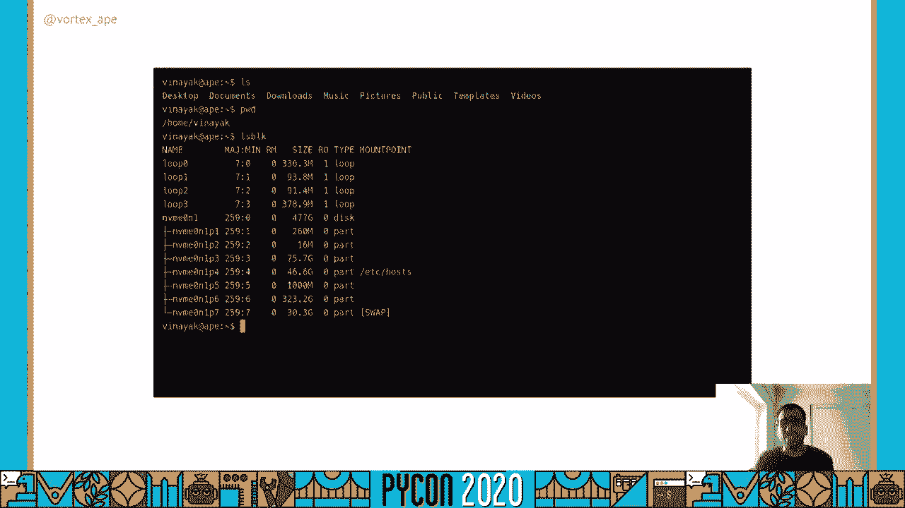
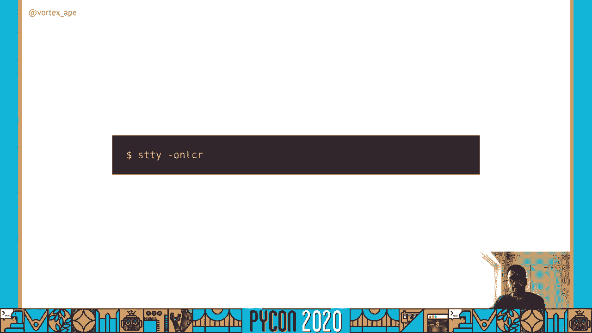
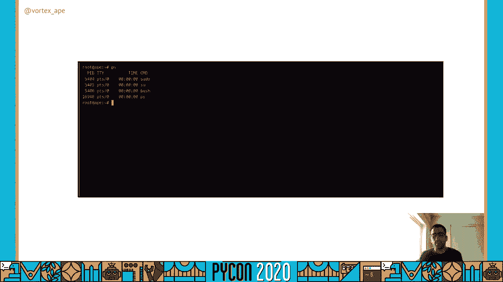
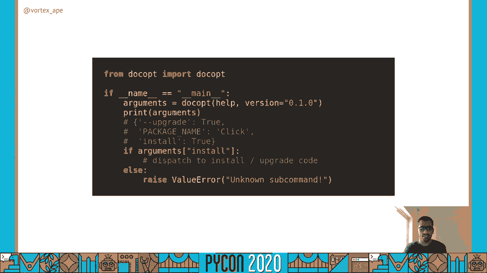
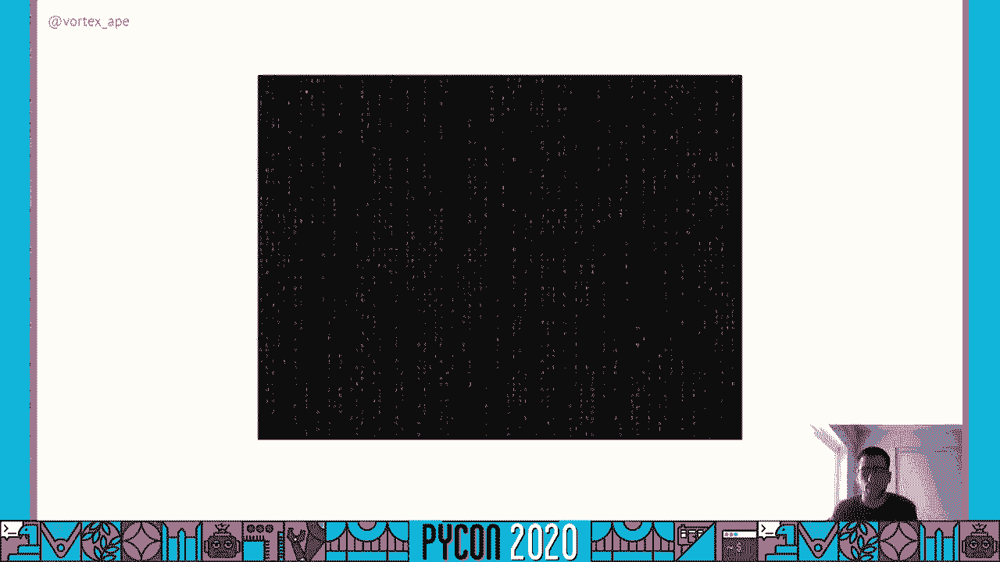
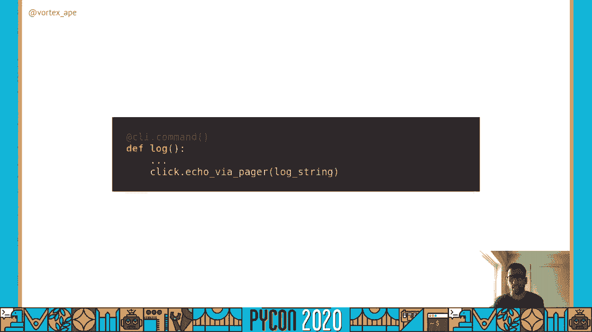
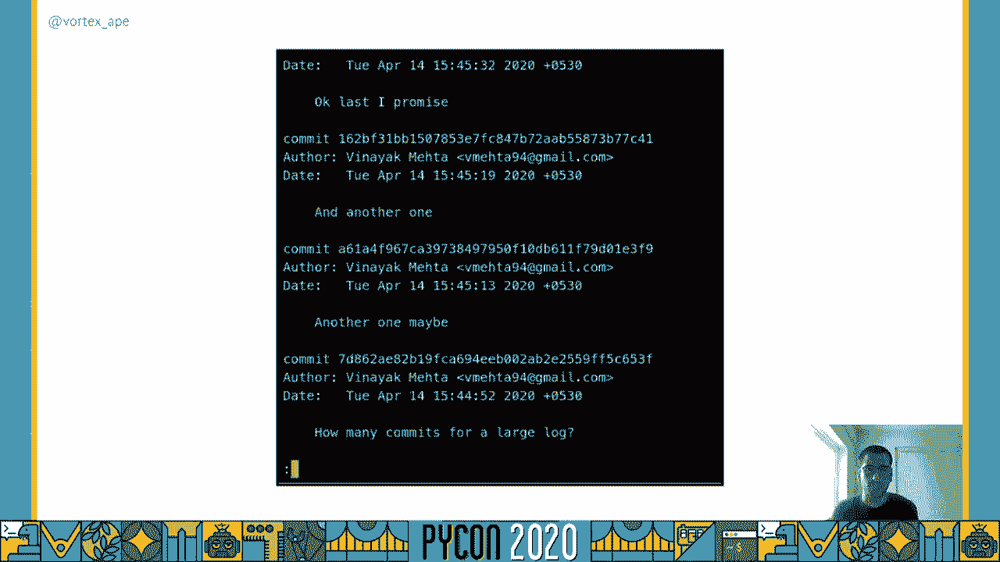

# 073：CLI的起源与Python实现


## 概述

在本教程中，我们将学习命令行界面（CLI）的起源、工作原理以及如何使用Python构建功能强大的CLI应用程序。我们将从终端的历史讲起，逐步深入到Python中实现CLI的各种工具和最佳实践。

---

## 命令行界面的历史：P73：1：从电传打字机到终端模拟器

CLI的起源可以追溯到电传打字机时代。最初，人们使用莫尔斯电码进行通信。后来，有人将打字机与通信线路连接起来，创造了电传打字机。操作员无需再手动处理莫尔斯电码，从而极大地提高了信息键入和发送的速度。

在1932年的一段视频中，叙述者描述电传打字机仅需几秒钟就能将信息从伦敦传递到爱丁堡。这与早期需要一名男教练花费一周时间进行四百英里旅行的通信方式形成了鲜明对比。



与此同时，计算机变得足够强大，可以处理多任务并与用户实时交互。于是，又有人想到将电传打字机与计算机连接起来，使用户能够远程与计算机交互。

电传打字机因其坚固和灵活的特性，被适配为早期计算机的用户界面，这就是命令行界面的起源。用户在对输入感到满意后，在纸上打印的提示符后键入命令，将指令发送到计算机。最后，计算机的输出又会被印在纸上。



电传打字机作为计算机的接口一直使用到20世纪70年代末，直到视频显示器变得广泛可用。视频终端迅速流行起来，成为许多不同类型计算机上的I/O设备。一旦制造商转向一套共同的标准，只需一个串口就能将终端连接到计算机。

如今，物理电传打字机和视频终端已经过时，我们使用终端模拟器来代替。终端模拟器是真实硬件的软件模拟。现代终端模拟器继承了许多旧式硬件的特性。

一个明显的遗产是名字。如果你从“teletype”（电传打字机）中提取“tty”，它就变成了基于Unix操作系统的虚拟终端的前缀和名称。

在虚拟终端上运行的基本应用程序类型是Shell。Shell提示用户输入命令，并在用户按下回车键后将其发送给系统执行，这与电传打字机的工作流程类似。

直观地看，Shell的工作流程如下：键盘将输入传递到终端，终端将其传递给进程。进程执行工作，并将输出返回给终端，终端将其显示在显示器上。

在终端和进程之间，有一个称为“tty”（终端）的抽象层。它有点像接口，用于设置套接字通信的一些默认参数。`stty` 是一个实用工具，可以用来查看或更改这些设置。

例如，使用 `stty -a` 可以显示所有设置及其当前值，例如串行通信的速度以及行和列的数量。

---

## 终端设置详解：P73：2：规范模式、回显与信号

上一节我们介绍了终端的历史和基本概念，本节中我们来看看一些关键的终端设置，了解它们如何影响CLI的行为。

以下是 `stty` 工具可以控制的一些重要设置：



**icanon（规范模式）**
此设置启用基本的行编辑功能，例如在命令被发送到程序之前，允许用户使用退格键删除字符或前后移动光标。大多数交互式应用程序（如文本编辑器）会关闭此设置，自行处理所有的行编辑。默认情况下，规范模式是开启的。我们可以用 `stty -icanon` 把它关掉。

让我们看看它的作用。首先，我们打开 `cat` 命令。因为规范模式是开启的，输入会被缓冲，直到我们按下回车键。我们还可以使用退格键来删除字符。
```bash
cat
```
现在，我们用 `stty -icanon` 关掉规范模式，并再次使用 `cat`。
```bash
stty -icanon
cat
```
如你所见，文本没有被缓冲。现在我们一输入一个字符，`cat` 就会立即收到它并打印出来，而不是一次处理一行。



我们可以通过 `stty icanon` 重新打开规范模式。

**onlcr（将换行转换为回车换行）**
此设置查找输出中的换行符（`\n`），并为每个换行符添加一个回车符（`\r`）。回车确保光标在换行后回到第一列，类似于电传打字机将纸张 carriage return（回车）到第一列的操作。

没有换行符的字符用于在现代终端上制作进度条。程序通过将光标移回第一列，然后用新的进度信息覆盖先前的信息来更新进度。默认情况下，此设置是开启的，可以使用 `stty -onlcr` 关闭。

让我们看看关闭后的效果。我们输入 `ps` 命令。
```bash
ps
```
输出看起来是结构化的。现在让我们用 `stty -onlcr` 关闭它，再看看 `ps` 的输出。
```bash
stty -onlcr
ps
```
我们可以看到效果消失了。光标不会返回到第一列，即使这些行被打印在新的行上。许多应用程序都假设终端会自动将光标移回新行的第一列。

**echo（回显）**
默认情况下，回显是开启的。`echo` 会指示终端将我们键入的每个字符打印回显示器上。如果我们把它关掉会怎么样？

我们再看一次 `cat`。我们可以看到我们键入的“hello world”。
```bash
cat
# 输入 hello world
```
但当我们用 `stty -echo` 把它关掉时，会发生这种情况：
```bash
stty -echo
cat
# 输入 hello world
```
我们没有看到字符被打印出来，甚至直到 `cat` 在后面将我们的输入字符串打印出来时，我们才看到输入。关闭回显常用于向用户询问密码时。

如果你尝试更改了太多设置，可以使用 `reset` 命令将所有设置恢复到默认值。你还可以查看Python标准库中的 `termios` 模块，从Python代码中打开或关闭这些设置。

改变终端状态的另一种方法是通过带内和带外信号。

*   **带内信号**：意味着你在输入流中加入一些特殊字符。终端将这些特殊字符解释为命令，而不打印它们，相反，它执行预期的操作。
    *   实现带内信令的一种方法是使用**控制字符**。例如，`Ctrl+H` 将执行退格操作，`Ctrl+C` 将中断正在运行的进程。
    *   另一种方法是使用**转义序列**，它可以控制光标位置和文本颜色。例如，打印 `\033[2J` 序列将清除屏幕。在字符串前打印 `\033[1m` 序列会使字符串变为粗体。

终端还预先配置了输入和输出流：
*   `stdin`（标准输入）映射到键盘，程序从这里读取输入数据。
*   `stdout`（标准输出）是输出流，程序在这里写入输出数据。
*   `stderr`（标准错误）是错误信息流，程序在这里写入错误信息。

这种默认自动将输入和输出映射到键盘和显示器的能力是Unix操作系统的一个突破。在Unix之前，程序需要显式连接到适当的I/O设备，这是一件乏味的事情，因为缺乏跨系统的标准。

当然，可以使用重定向操作符来改变数据流：
*   `>`：重定向操作符，将程序的输出重定向到文件（覆盖）。
*   `>>`：重定向操作符，将程序的输出重定向到文件（追加）。
*   `|`：管道操作符，使一个程序的输出成为另一个程序的输入。

---

## 命令行界面基础：P73：3：命令、参数与选项

现在我们已经了解了终端是如何进化的以及它是如何工作的，让我们看看在终端内部运行的程序：命令行界面（CLI）。

“命令行界面”、“应用程序”、“程序”、“工具”这些词经常互换使用，但在大多数时候，它们指的是同一件事。CLI使得通过Shell脚本自动化重复任务变得容易。

使用CLI的一般模式如下：
1.  Shell显示提示符，作为准备接受输入的标志。
2.  用户输入要运行的命令，以及一些选项和参数。
3.  这构成了命令行文本，然后命令被执行。
4.  输出打印在终端上。

但是，这些程序所需的参数和选项是什么呢？
*   **参数**：程序运行所必需的信息。没有它们，程序通常无法工作。它们通常是**位置性**的，这意味着参数在命令行中的位置决定了其含义。
    *   例如，`cp`（复制）命令需要源和目标参数。第一个位置的参数永远是源，第二个位置的永远是目标。
    *   代码示例：`cp source_file.txt destination_folder/`
*   **选项（或标志）**：用于修改命令的操作。顾名思义，它们是可选的，并且可能有一些默认值。一般惯例是在字符或单词前面使用连字符（`-`）或双连字符（`--`）来标识选项。
    *   例如，在 `cp` 命令中，`-r` 选项可以改变其操作，要求它递归地复制源目录中的所有文件到目标。
    *   代码示例：`cp -r source_folder/ destination_folder/`

对CLI的一个批评是，它没有向用户提供关于其所有可用操作的提示，这与图形用户界面（GUI）形成对比，GUI通常通过菜单、图标或其他视觉线索来通知用户这些操作。

为了克服这个局限，许多CLI程序会围绕它们所支持的参数和选项显示一些简短的文档。可以通过使用 `--help` 选项调用CLI来查看此文档。

其中一些CLI还有手册页（`man pages`），是“manual pages”的简称。默认情况下，`man` 命令使用一个终端分页程序（例如 `less` 或 `more`）来显示CLI的详细手册，这使得用户很容易滚动和搜索它。

你可能会想，这里有很多活动部件，每个程序员可以以不同的方式编写CLI。例如，他们可能使用 `-x` 而不是 `-h` 来显示帮助文本。有没有什么标准来确保CLI遵循一些基本惯例？

是的，有标准。例如，符合POSIX（可移植操作系统接口）标准的命令行接口需要遵循一些规范。还有基于XDG的目录规范，它规定了应用程序应该如何存储其功能所需的不同类型的文件（如配置文件、数据文件或程序缓存），这样大家就不会把文件到处存放。这些文件应该进入用户文件系统上的特定目录。

---

## 使用Python构建CLI：P73：4：标准库与第三方方案

现在，让我们看看如何使用Python实现命令行界面。有几种选择，包括Python标准库和第三方包（PyPI）。我们举一个小例子，称之为 `smallpip`，看看我们如何使用所有这些不同的选项来实现它。

`smallpip` 只有一个子命令 `install`，我们可以用它从PyPI安装包。它还有一个 `--upgrade` 选项。

**1. 使用 `sys.argv` 和 `getopt`（标准库）**
Python标准库有 `sys` 模块，它带有 `sys.argv` 变量。`sys.argv` 是一个列表，包含调用CLI时传递给它的命令行参数。

`getopt` 模块用于解析并创建命令行选项列表。其API被设计成类似于Unix `getopt` 函数，它遵循POSIX标准。

让我们看看一些代码：
```python
import sys
import getopt

def main():
    # sys.argv[0] 是脚本本身的名称
    args = sys.argv[1:]

    try:
        opts, args = getopt.getopt(args, "hv", ["help", "version"])
    except getopt.GetoptError as err:
        print(err)
        sys.exit(2)

    for opt, arg in opts:
        if opt in ("-h", "--help"):
            print_help()
            sys.exit()
        elif opt in ("-v", "--version"):
            print_version()
            sys.exit()

    # 检查被调用的子命令
    if len(args) > 0 and args[0] == "install":
        handle_install(args[1:])  # 分发控制权
    else:
        print("Unknown command")
        sys.exit(1)

def handle_install(install_args):
    # 处理 install 子命令的逻辑
    # 需要手动解析 install_args 中的 --upgrade 等选项
    pass

def print_help():
    print("Help text here")



def print_version():
    print("Version 1.0")

if __name__ == "__main__":
    main()
```
直到Python 3.2，标准库还有 `optparse` 模块。从那时起，它被 `argparse` 取代。`optparse` 只支持解析选项，而不支持位置参数。`argparse` 更强大，能够自动生成更好的帮助信息，还允许自定义用于标识选项的字符（例如使用加号而不是减号），甚至支持斜杠（`/`）。`argparse` 还增加了对子命令的支持，这是一种常见模式（例如 `pip install`， `pip freeze`）。



**2. 使用 `argparse`（标准库）**
让我们看看 `smallpip` 代码如何使用 `argparse`：
```python
import argparse

def main():
    parser = argparse.ArgumentParser(description="A small pip clone")
    parser.add_argument("-v", "--version", action="version", version="1.0")

    subparsers = parser.add_subparsers(dest="command", help="Available commands")

    # install 子命令
    install_parser = subparsers.add_parser("install", help="Install a package")
    install_parser.add_argument("package", help="Package name to install")
    install_parser.add_argument("--upgrade", action="store_true", help="Upgrade the package")

    args = parser.parse_args()

    if args.command == "install":
        # 控制权自动分发到相关代码
        handle_install(args.package, args.upgrade)
    else:
        parser.print_help()

def handle_install(package, upgrade):
    print(f"Installing {package}, upgrade={upgrade}")
    # 实际的安装逻辑

if __name__ == "__main__":
    main()
```
`argparse` 自动生成了帮助信息。

**3. 使用 `docopt`（第三方库）**
`docopt` 由Vladimir Keleshev编写，它采用“文档优先”的方法来编写CLI。它只需要一个符合POSIX惯例的帮助字符串作为输入，并从中推断出子命令、选项和参数。

这次我们首先创建一个头部字符串，它显示了我们CLI的描述和用法。当CLI被调用时，我们调用 `docopt`，传入头部字符串和版本。
```python
"""Smallpip.

Usage:
  smallpip install <package> [--upgrade]
  smallpip (-h | --help)
  smallpip (-v | --version)

Options:
  -h --help     Show this screen.
  -v --version  Show version.
  --upgrade     Upgrade the package.
"""

from docopt import docopt

def main():
    args = docopt(__doc__, version="Smallpip 1.0")

    if args["install"]:
        handle_install(args["<package>"], args["--upgrade"])

def handle_install(package, upgrade):
    print(f"Installing {package}, upgrade={upgrade}")
    # 实际的安装逻辑

if __name__ == "__main__":
    main()
```
在所有示例中，我们看到除了解析结果，我们还必须编写一些样板代码来将控制权分发到相关的安装和升级代码。如果我们要验证这些参数，还需要再增加一些样板。对于大型应用程序，这个样板可能非常庞大。我们可能还需要添加一些共同特性，例如进度条和颜色。

---

## 使用Click构建高级CLI：P73：5：装饰器与常见用例

`Click` 是由Armin Ronacher编写的第三方库，最初是为了支持Flask项目。`Click` 被设计成嵌套和可组合的，这意味着它支持任意嵌套的命令（例如 `python setup.py sdist bdist_wheel`，其中 `bdist_wheel` 是 `sdist` 的子命令）。`Click` 也会根据子命令自动将控制权分发到相关代码。它支持回调函数，可用于验证解析后的命令行选项。

让我们看看使用 `Click` 的 `smallpip` 代码是什么样子的：
```python
import click

@click.group()
@click.version_option("1.0")
def cli():
    """A small pip clone."""
    pass

@cli.command()
@click.argument("package")
@click.option("--upgrade", is_flag=True, help="Upgrade the package.")
def install(package, upgrade):
    """Install a package."""
    click.echo(f"Installing {package}, upgrade={upgrade}")
    # 实际的安装逻辑

if __name__ == "__main__":
    cli()
```
`Click` 使用基于装饰器的方法。`@click.group()` 装饰器使函数成为一个可以添加子命令的命令组。`@cli.command()` 装饰器将函数转换为子命令。`Click` 自动生成帮助信息，基于函数文档字符串和选项帮助文本。



`Click` 承诺，当使用 `Click` 编写的多个应用程序被串联在一起时，它们将无缝地工作。这对于快速迭代和大型项目协作非常有用。



现在，让我们看看一些常见的用例，以及如何使用 `Click` 实现它们。我们将使用另一个小例子，叫做 `smallgit`，顾名思义，是一个小的Git克隆，有六个子命令：`clone`， `config`， `log`， `status`， `commit` 和 `push`。

首先，我们用 `@click.group()` 装饰器定义一个CLI函数。

**用例1：显示进度条**
当用户调用 `clone` 子命令时，我们应该让他们知道克隆了多少文件的进度。`Click` 提供了一个进度条实用工具。
```python
@cli.command()
@click.argument("source")
@click.argument("destination")
def clone(source, destination):
    """Clone a repository."""
    files_to_clone = ["file1.txt", "file2.txt", "file3.txt"]  # 假设的文件列表
    with click.progressbar(files_to_clone, label="Cloning files") as bar:
        for file in bar:
            # 模拟下载每个文件
            time.sleep(0.1)
            # 实际下载逻辑
    click.echo(f"Cloned from {source} to {destination}")
```

**用例2：使用特定配置文件**
我们应该在应用程序文件夹中保存用户名和电子邮件之类的配置。`Click` 提供了 `click.get_app_dir()` 函数来帮助完成此操作。
```python
@cli.command()
@click.argument("key")
@click.argument("value")
def config(key, value):
    """Set configuration."""
    app_dir = click.get_app_dir("smallgit")
    config_path = os.path.join(app_dir, "config")
    os.makedirs(app_dir, exist_ok=True)
    # 存储配置 (简化示例)
    with open(config_path, "w") as f:
        f.write(f"{key}={value}")
    click.echo(f"Set {key} to {value}")
```

**用例3：分页输出**
对于 `log` 命令打印的大型提交日志，我们可以通过调用终端分页程序来支持分页输出。
```python
@cli.command()
def log():
    """Show commit logs."""
    log_output = "commit 1\ncommit 2\n" * 50  # 模拟长日志
    click.echo_via_pager(log_output)
```

**用例4：为输出添加颜色**
在使用 `status` 子命令打印时，我们应该为添加或修改的文件添加颜色。`Click` 支持为文本添加颜色。
```python
@cli.command()
def status():
    """Show the working tree status."""
    added_files = ["new_file.txt"]
    modified_files = ["changed_file.py"]
    output = []
    for file in added_files:
        output.append(click.style(f"added:    {file}", fg="green"))
    for file in modified_files:
        output.append(click.style(f"modified: {file}", fg="yellow", bold=True))
    click.echo("\n".join(output))
```

**用例5：获取多行输入（启动编辑器）**
当用户调用 `commit` 子命令时，可能需要输入多行提交消息。`Click` 可以为此启动编辑器。
```python
@cli.command()
@click.option("-m", "--message", help="Commit message.")
def commit(message):
    """Record changes to the repository."""
    if not message:
        message = click.edit("\n\n# Enter your commit message above.")
        if message is None:
            click.echo("Commit aborted.")
            return
        # 清理注释行
        message = "\n".join([line for line in message.split("\n") if not line.startswith("#")]).strip()
    click.echo(f"Committing with message: {message}")
    # 实际提交逻辑
```

**用例6：交互式提示（如输入密码）**
对于 `push` 子命令，可能需要用户提供凭据。`Click` 提供了 `click.prompt` 功能。
```python
@cli.command()
@click.argument("remote")
@click.argument("branch")
def push(remote, branch):
    """Update remote refs along with associated objects."""
    username = click.prompt("Username")
    password = click.prompt("Password", hide_input=True)
    click.echo(f"Pushing to {remote}/{branch} as {username}")
    # 实际推送逻辑
```
`Click` 内部使用 `getpass` 模块或通过 `termios` 模块关闭回显来处理密码输入。

`Click` 还允许我们测试所编写的CLI。我们可以使用 `CliRunner` 在代码中调用CLI的每个子命令，并根据预期输出检查结果。

要分发CLI，我们需要创建一个 `setup.py` 文件，并向其添加 `console_scripts` 入口点。`console_scripts` 允许将Python函数注册为命令行程序。然后可以将其打包并上传到PyPI，以便其他人安装和使用。

---

## CLI设计原则与总结：P73：6：保持简单与用户体验

既然我们知道如何用Python编写CLI，我们需要明白我们在一个相对有限的设计空间里运作，与图形用户界面（GUI）相比，GUI为用户提供了更多的视觉线索和指导。

有一些原则可以帮助我们为编写的CLI创建一个良好的用户体验（UX）：

1.  **保持简单，遵循Unix哲学**：程序应该只做一件事，并把它做好。编写程序，以便它们可以一起工作（通过管道和重定向操作符处理文本流）。遵循Unix哲学，确保当用户与CLI交互时没有意外。

2.  **让功能可以被发现**：通过对功能的坦率展示，类似于GUI提供的功能。我们可以通过存储用户的命令行历史记录，并让他们在其中搜索来实现这一点。也许根据CLI所支持的功能，给他们一些关于自动完成的建议。J. R. Ramanujam在2017年的一个演讲中详细讨论了这一点。

有一些资源可以帮助你实现我们刚才谈到的一些历史和自动完成功能，例如 `prompt_toolkit` 库，它被IPython和许多其他CLI工具使用。

## 总结

在本教程中，我们一起学习了：
1.  **CLI的起源**：从电传打字机到现代终端模拟器的演变历程。
2.  **终端的工作原理**：包括规范模式、回显、信号以及输入/输出流重定向等核心概念。
3.  **CLI的基本构成**：命令、位置参数和可选标志的区别与用法。
4.  **使用Python构建CLI**：探索了从标准库的 `sys.argv`/`argparse` 到第三方库 `docopt` 和 `Click` 的多种方案。
5.  **高级CLI特性实现**：使用 `Click` 库实现了进度条、彩色输出、分页、配置文件管理、编辑器集成和交互式提示等常见功能。
6.  **CLI设计原则**：强调了保持简单、遵循Unix哲学以及提高功能可发现性的重要性。


希望你现在对CLI生态系统有了更深入的了解，并且能够使用Python自信地构建自己的命令行工具。你现在可以进一步探索 `Click` 等库的文档，以发现更多强大的功能。