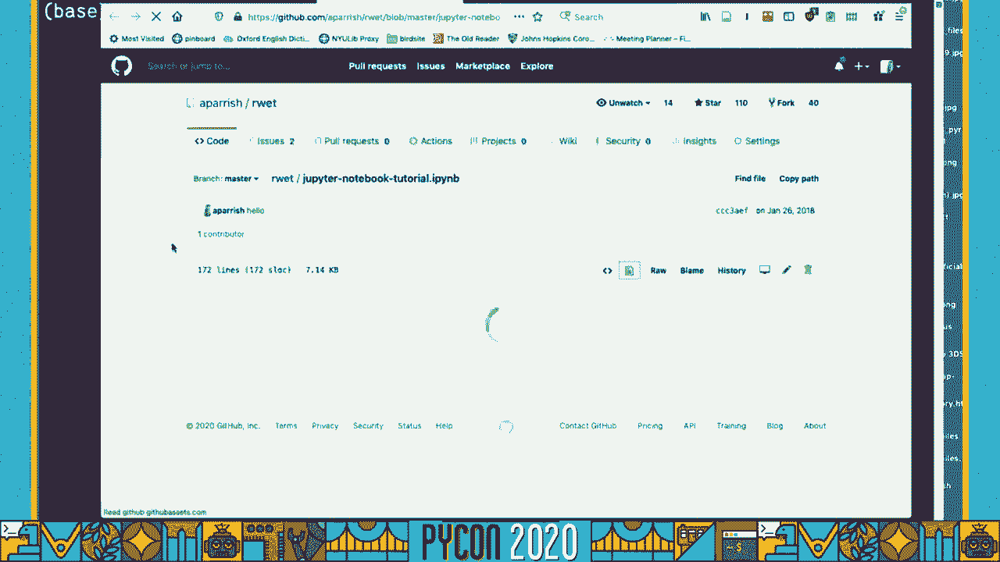
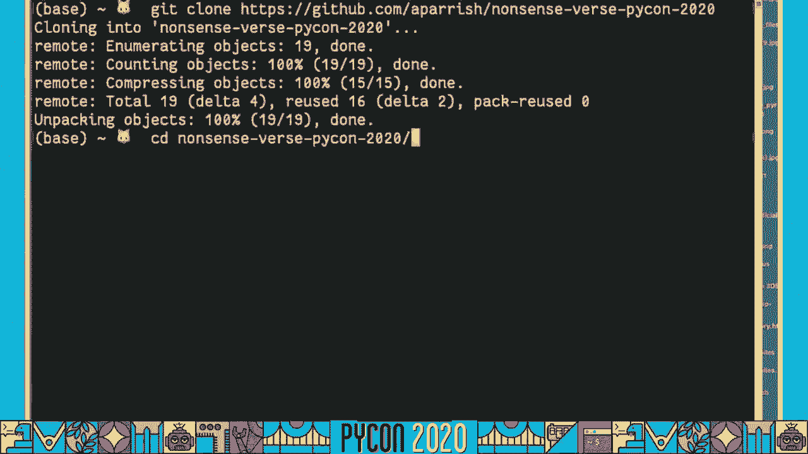

# 075：使用 Python 与机器学习 🎭


## 概述
在本教程中，我们将学习如何利用 Python 和机器学习模型来创作和探索“无意义诗”。我们将从理解声音诗歌的美学基础开始，逐步深入到使用 `pronouncing` 库分析单词发音，以及使用 `Pinsulate` 机器学习模型来生成和操控虚构单词的拼写与发音。通过本教程，你将掌握一套计算工具，用于探索语言的声音层面，并创作出具有独特音韵效果的诗歌。

---

## 第 1 节：声音诗歌与音韵美学 🎶

声音诗歌是一种强调语言音响效果，而忽视传统语法和语义的诗歌形式。它让我们关注词语本身的声音质感，而非其字典含义。

路易斯·卡罗尔的《杰伯沃基》是著名的无意义诗范例。诗中如“Brilig”和“Gimbal”这样的虚构词汇，虽然不在字典中，但通过其上下文和声音，依然能传达出某种意义和情感。

研究表明，声音本身能引发特定的联觉反应。例如，当被要求将“kiki”和“booba”这两个词与尖锐或圆润的形状配对时，来自不同语言背景的人几乎总将“kiki”与尖锐形状、“booba”与圆润形状联系起来。这被称为**音韵美学**，即研究词语声音如何引发情感和感官反应。

奇幻作家索非亚·萨马塔在创造虚构语言时，也着重于组合“听起来美妙”的音节。将这种为音韵特性发明词汇的理念推向极致，就产生了**声音诗**。这种诗歌形式将语言的声学材料作为核心，例如达达主义诗人艾尔塞万·弗里塔克和俄罗斯未来主义诗人亚历克谢·克鲁恰尼克的作品。

克鲁恰尼克支持的“Zam”诗歌形式，旨在通过解构和重构传统诗歌，创造出基于声学逻辑而非指称逻辑的新文本。这个过程被称为“Zam-nification”。

声音诗歌学者史蒂夫·麦卡弗里指出，声音诗能“绕过皮层，直接作用于中枢神经系统”。这启发了我们使用计算机程序来创作此类诗歌，以探讨其美学机制，并为我们提供创作新声音诗的工具。

---

## 第 2 节：挑战与工具——从拼写到发音 🔤

上一节我们探讨了声音诗的理念。本节中，我们来看看在实践层面面临的具体挑战：如何用程序处理虚构词汇的拼写和发音。

传统工具（如拼写检查器）会将《杰伯沃基》中的词标记为错误。然而，即使这些词不在字典中，我们依然知道如何发音并感知其意义。因此，我们需要一个能双向工作的程序：
1.  将声音（音素）转换为字母（正字法）。
2.  将字母（正字法）转换为声音（音素）。

一个基础资源是 **CMU 发音词典**。它包含了超过10万个英语单词及其音标（使用ARPABET音标系统）。我们可以用它来查询已知单词的发音。





然而，CMU词典的局限在于它是固定的，无法处理不在其中的虚构词汇（如声音诗中的词）。因此，我们需要一个统计模型来预测任意字母序列的发音，以及任意音素序列的拼写。

这就是 **Pinsulate** 库的作用。它是一个基于序列到序列机器学习模型的Python库，能够实现音素与拼写之间的双向转换，即使对于词典中不存在的词也能给出合理的猜测。

---

## 第 3 节：模型原理与核心功能概览 🤖

Pinsulate 的核心是基于递归神经网络（RNN）的序列到序列模型。

**序列到序列模型** 包含两个主要部分：
*   **编码器**：将一种语言（如拼写）的序列编码为一个固定长度的特征向量。
*   **解码器**：基于该特征向量，预测另一种语言（如音素）序列中的下一个标记。

在 Pinsulate 中，我们训练了两个这样的模型：
1.  **拼写 -> 音素模型**（编码器：拼写，解码器：音素）
2.  **音素 -> 拼写模型**（编码器：音素，解码器：拼写）

这两个模型连接起来，形成了一个循环：`拼写 -> 音素 -> 拼写`。这个架构的关键在于，我们可以获取并操控中间的特征向量（即单词声音的压缩表示），然后再将其解码回拼写，从而创造出各种音韵效果。

Pinsulate 将音素进一步分解为**音韵特征**（如：双唇音、塞音、浊音）。这种表示为我们提供了更精细的控制能力。

以下是 Pinsulate 能实现的一些核心功能演示：
*   **拼写与发音虚构词**：对如“Pikachu”、“MIMSI”等词进行发音和拼写。
*   **操控解码概率**：通过滑块降低或提高特定字母（如‘E’）或音韵特征（如“鼻音化”）在生成过程中出现的概率。
*   **调整“温度”**：控制模型预测时的随机性，从而生成更保守或更出人意料的拼写变体。
*   **单词插值**：取两个单词（如“paper”和“plastic”）的音素状态向量，计算其中点，并生成一个在发音上介于两者之间的新词。
*   **拉伸与压缩**：将单词的音素特征数组像音频一样拉长或缩短，从而改变其拼写长度。

这些功能让我们能够将语言的声音视为一种可塑的材料进行实验和创作。

---

## 第 4 节：实战开始——环境配置与基础分析 💻

现在，让我们开始动手实践。首先需要设置好编程环境。

**环境配置步骤：**
1.  克隆教程仓库：`git clone https://github.com/aparish/nonsense-pycon-2020`
2.  进入目录并创建虚拟环境：`python -m venv venv`
3.  激活虚拟环境（Linux/Mac: `source venv/bin/activate`，Windows: `venv\Scripts\activate`）。
4.  安装依赖包：`pip install -r requirements.txt`
5.  启动 Jupyter Notebook：`jupyter notebook`

我们将首先使用 `pronouncing` 库进行基础的音韵分析。

**使用 `pronouncing` 库：**
`pronouncing` 库提供了访问 CMU 发音词典的简单接口。

```python
import pronouncing as pr

# 获取单词“programming”的发音（音素列表）
phones = pr.phones_for_word("programming")
print(phones[0])  # 输出第一个发音
# 输出类似：P R AA1 G R AE2 M IH0 NG

# 计算音节数
syllable_count = pr.syllable_count(phones[0])
print(f"Syllables: {syllable_count}")  # 输出：3

# 获取重音模式
stress_pattern = pr.stresses(phones[0])
print(f"Stress: {stress_pattern}")  # 输出：1 2 0

# 查找与“cheese”押韵的词
rhymes = pr.rhymes("cheese")
print(rhymes[:5])  # 输出前5个押韵词，如 ['fleece', 'gees', 'greece', ...]

# 根据声音模式搜索单词（例如，包含“AY1 Z”音素的词）
search_results = pr.search("AY1 Z")
print(search_results[:5])
```

**分析文本的音韵特征：**
我们可以对一段文本进行简单的音素频率分析。

```python
from collections import Counter
import re

text = "April is the cruelest month breeding lilacs out of the dead"
words = re.findall(r'\b\w+\b', text.lower())  # 提取单词

phoneme_counter = Counter()
for word in words:
    pronunciations = pr.phones_for_word(word)
    if pronunciations:
        # 取第一个发音，拆分成音素并计数
        phonemes = pronunciations[0].split()
        phoneme_counter.update(phonemes)

print(phoneme_counter.most_common(5))  # 打印最常见的5个音素
```

---

## 第 5 节：使用 Pinsulate 进行高级操控 🧩

上一节我们使用了静态词典。本节中，我们来看看如何用 Pinsulate 模型处理任意字符串。

首先，导入并初始化 Pinsulate。

```python
from pinsulate import Pinsulate
import numpy as np

pin = Pinsulate()  # 加载预训练模型（首次使用可能需要一点时间）
```

**基础功能：发音与拼写**

```python
# 1. 为已知或未知单词发音
print(pin.sound_out("allison"))  # -> ['AH0', 'L', 'IH0', 'S', 'AH0', 'N']
print(pin.sound_out("pikachu"))  # 不在CMU词典中，但模型会预测

# 2. 根据音素列表拼写单词
spelling = pin.spell(['M', 'IH1', 'M', 'Z', 'IY0'])
print(spelling)  # 可能输出：'mimsy'

# 3. 拼写一个即兴创造的词
print(pin.spell(['B', 'L', 'AA1', 'R', 'F']))  # 可能输出：'blarf'
```

**操控音韵特征**
Pinsulate 在内部使用音韵特征数组。我们可以直接修改这些特征。

```python
# 获取单词“pug”的音韵特征数组
features = pin.phoneme_features("pug")
print(features.shape)  # 例如 (5, 32)，5个音素（含起止），32个特征维度

# 将首音素的特征从清音改为浊音（p -> b）
from pinsulate.featurephoneme import FEATURE_INDEX
voiced_idx = FEATURE_INDEX['voi']  # 浊音特征索引
unvoiced_idx = FEATURE_INDEX['cns']  # 清音特征索引（示例，需确认具体特征名）

features[1, voiced_idx] = 1.0   # 设置为浊音
features[1, unvoiced_idx] = 0.0 # 取消清音

# 从修改后的特征拼写单词
new_spelling = pin.spell_features(features)
print(new_spelling)  # 可能输出：'bug'
```

**使用 manipulate 函数进行便捷操控**
`manipulate` 函数封装了常见操作。

```python
# 调整温度：增加随机性
print(pin.manipulate("spelling", temperature=1.5))

# 抑制某些字母的出现
print(pin.manipulate("spelling", letters={'e': 5.0, 'i': 5.0})) # 降低e和i的概率

# 增强某些音韵特征（如使所有音更“鼻音化”）
print(pin.manipulate("spelling", features={'nas': 2.0})) # 增加鼻音特征权重
```

**单词插值与生成**
利用音素状态向量进行创作。

```python
# 获取两个单词的状态向量
state_a = pin.phoneme_state("paper")
state_b = pin.phoneme_state("plastic")

# 计算中点向量
mid_state = (state_a + state_b) / 2

# 从中点状态生成新词
new_word = pin.spell_state(mid_state)
print(f"Between 'paper' and 'plastic': {new_word}")

# 从随机噪声生成新词
random_state = np.random.normal(size=256)  # 256维向量
random_word = pin.spell_state(random_state)
print(f"Random word: {random_word}")
```

---

## 第 6 节：创作实践——在语料库中寻找诗歌 📜

掌握了工具后，我们可以将其应用于现有文本，进行“发现式”创作。

**示例1：在散文中寻找“俳句”**
俳句是一种三行诗，音节模式为5-7-5。我们可以在长文本中寻找恰好能按此模式分割的17音节句子。

```python
import nltk
nltk.download('punkt')  # 下载分词数据
from nltk.tokenize import sent_tokenize, word_tokenize

def find_haikus(text):
    sentences = sent_tokenize(text)
    haikus = []
    for sent in sentences:
        words = [w.lower() for w in word_tokenize(sent) if w.isalpha()]
        syllable_counts = []
        for w in words:
            prons = pr.phones_for_word(w)
            if prons:
                syllable_counts.append(pr.syllable_count(prons[0]))
            else:
                # 如果词典没有，用Pinsulate估算（略）
                break
        # 检查音节总数是否为17，并能按5-7-5分割（此处需实现分割逻辑）
        # ... (分割逻辑实现)
        # if is_haiku(syllable_counts):
        #     haikus.append((sent, break_indices))
    return haikus

# 加载《弗兰肯斯坦》文本并运行
with open('frankenstein.txt', 'r', encoding='utf-8') as f:
    novel_text = f.read()
potential_haikus = find_haikus(novel_text[:5000])  # 在前5000字符中查找
for h in potential_haikus[:3]:
    print(h[0])
    print("---")
```

**示例2：重构十四行诗的韵脚**
莎士比亚十四行诗有严格的押韵格式。我们可以从诗集中随机抽取行，并匹配押韵的尾词，生成新的对句。

```python
from collections import defaultdict
import random

# 加载十四行诗，每行一个列表项
with open('sonnets.txt', 'r') as f:
    sonnet_lines = [line.strip() for line in f if line.strip()]

# 构建韵脚索引：{韵脚部分: {尾词1: [行索引1, ...], 尾词2: ...}}
rhyme_index = defaultdict(lambda: defaultdict(list))

for idx, line in enumerate(sonnet_lines):
    words = [w.lower() for w in word_tokenize(line) if w.isalpha()]
    if words:
        last_word = words[-1]
        prons = pr.phones_for_word(last_word)
        if prons:
            rhyme_part = pr.rhyming_part(prons[0])
            rhyme_index[rhyme_part][last_word].append(idx)

# 过滤掉只有一种尾词的韵脚
rhyme_index = {rp: d for rp, d in rhyme_index.items() if len(d) > 1}

# 生成几对押韵的对句
for _ in range(3):
    rp = random.choice(list(rhyme_index.keys()))
    word_dict = rhyme_index[rp]
    word_a, word_b = random.sample(list(word_dict.keys()), 2)
    line_idx_a = random.choice(word_dict[word_a])
    line_idx_b = random.choice(word_dict[word_b])
    print(sonnet_lines[line_idx_a])
    print(sonnet_lines[line_idx_b])
    print()
```

---

## 总结 🏁

在本教程中，我们一起学习了：
1.  **声音诗歌的理念**：理解了无意义诗和音韵美学，认识到语言声音本身的表现力。
2.  **核心工具**：掌握了 `pronouncing` 库（用于CMU发音词典查询）和 `Pinsulate` 库（用于基于机器学习的拼写-发音转换与操控）。
3.  **模型原理**：了解了序列到序列模型和音韵特征的基本概念，这是 Pinsulate 实现灵活操控的基础。
4.  **实践技能**：
    *   进行基础的音素和韵律分析。
    *   使用 Pinsulate 为虚构词汇发音和拼写。
    *   通过调整概率、温度、音韵特征来操控单词的输出。
    *   实现单词插值、状态向量拉伸等高级创作技巧。
    *   在现有文本语料库中发掘符合特定格律（如俳句）的诗句或重构押韵模式。


这些工具和技术为你打开了一扇新的大门，让你能够以计算和实验的方式探索语言的音乐性，并创作出属于自己的、注重声音质感的新颖文本。