# 078：装饰器简介，增强你的Python代码


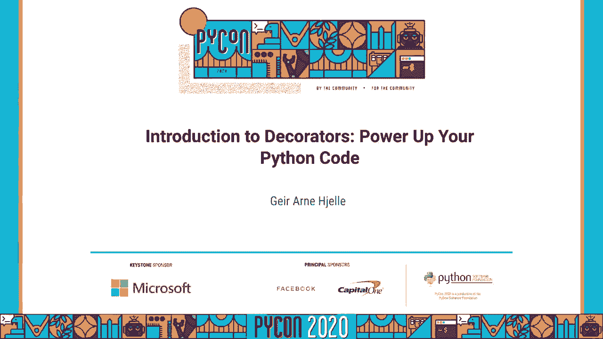

在本教程中，我们将学习Python装饰器的核心概念。从基础开始，逐步深入到创建高级装饰器。我们将通过一系列练习来巩固所学知识，最终你将能够创建自己的装饰器来增强代码功能。

## 第一部分：装饰器简介 🧱

上一节我们概述了课程内容，本节中我们将介绍装饰器的几个核心构建模块。

### 函数作为一等对象

在Python中，函数是一等对象。这意味着你可以像处理变量一样处理函数：为函数分配多个名称、将函数作为参数传递给其他函数、从函数中返回函数。

以下是一个简单示例，展示了如何将函数作为参数传递：

```python
def say_hello(logger):
    logger("Hello, World!")

# 使用不同的记录器函数
say_hello(print)  # 使用 print 函数
```

### 内部函数

内部函数是定义在其他函数内部的函数。它们可以访问其外部（封闭）作用域中的变量。

```python
def outer():
    pi_con = 2020
    def inner():
        print(f"Python is {pi_con}")
    inner()
    return inner

inside = outer()  # 调用 outer，返回 inner 函数
inside()          # 可以调用返回的内部函数
```

### 操作函数

我们可以通过添加属性等方式来操作函数对象。

```python
def hello(func):
    print(f"Hello {func.__name__}")
    return func

def outer():
    print("Hi from outer")

new_outer = hello(outer)  # 打印函数名并返回原函数
new_outer()               # 调用原函数
```

### 创建装饰器

装饰器的本质是：一个接受函数作为参数并返回一个（通常是包装过的）函数的函数。

以下是一个简单的装饰器模板，它在调用函数前后执行一些操作：

```python
import functools

def wrapper(func):
    @functools.wraps(func)  # 保留原函数的元数据
    def _wrapper(*args, **kwargs):
        # 在调用函数前做一些事情
        print("Before calling function")
        # 调用原函数
        result = func(*args, **kwargs)
        # 在调用函数后做一些事情
        print("After calling function")
        # 返回原函数的返回值
        return result
    return _wrapper

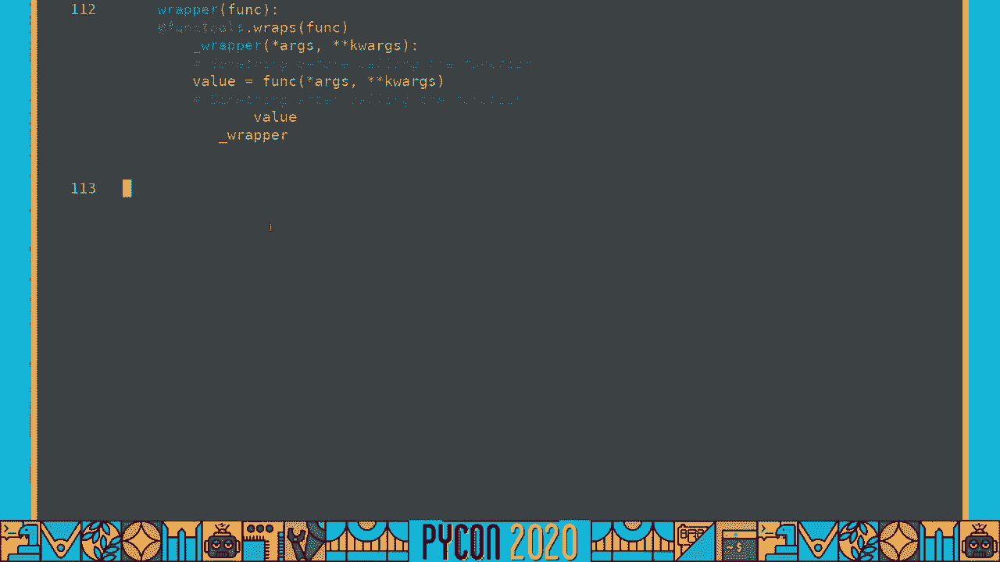

@wrapper
def say_hello(name):
    print(f"Hello {name}")

say_hello("World")
```

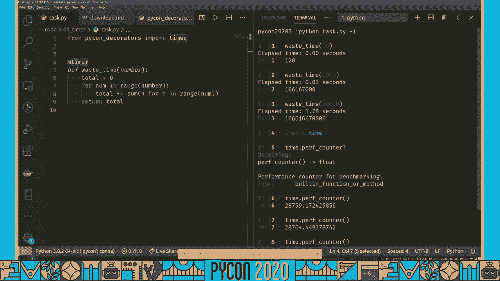

`@wrapper` 语法是 `say_hello = wrapper(say_hello)` 的语法糖。

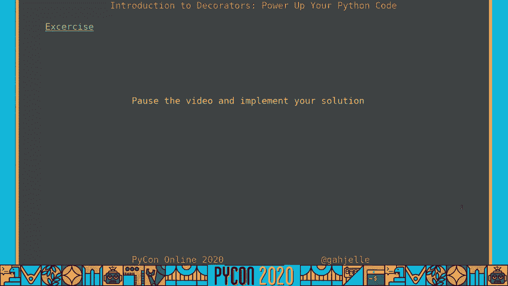

## 第二部分：基础练习 🏋️

上一节我们介绍了装饰器的基本模板，本节中我们通过三个练习来实践。

### 练习1：计时器装饰器

以下是实现一个计时器装饰器的步骤，该装饰器用于测量函数运行时间。

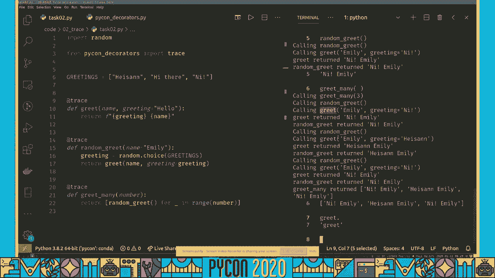

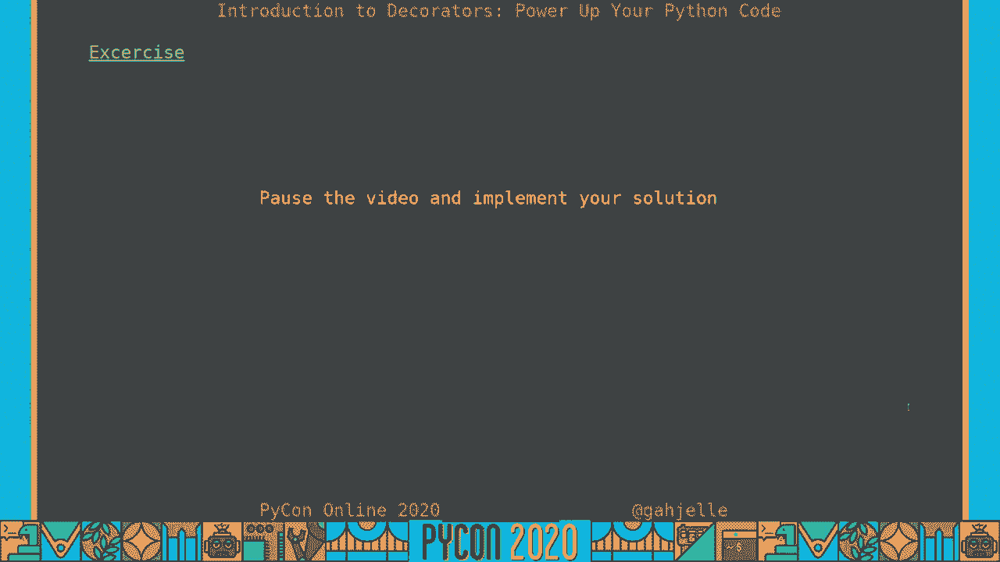

1.  导入 `time` 模块。
2.  在包装函数内部，调用函数前记录开始时间。
3.  调用原函数。
4.  调用函数后记录结束时间。
5.  计算并打印耗时。

```python
import time
import functools

def timer(func):
    @functools.wraps(func)
    def _timer(*args, **kwargs):
        start = time.perf_counter()
        result = func(*args, **kwargs)
        end = time.perf_counter()
        print(f"Elapsed time: {end - start:.6f} seconds")
        return result
    return _timer

@timer
def waste_time(num):
    total = 0
    for i in range(num):
        for j in range(i):
            total += j
    return total

print(waste_time(1000))
```

### 练习2：追踪装饰器

以下是实现一个追踪装饰器的步骤，该装饰器用于打印函数的调用和返回信息。

1.  在包装函数内部，打印函数名和传入的参数。
2.  调用原函数并保存结果。
3.  打印函数的返回值。
4.  返回结果。

```python
import functools

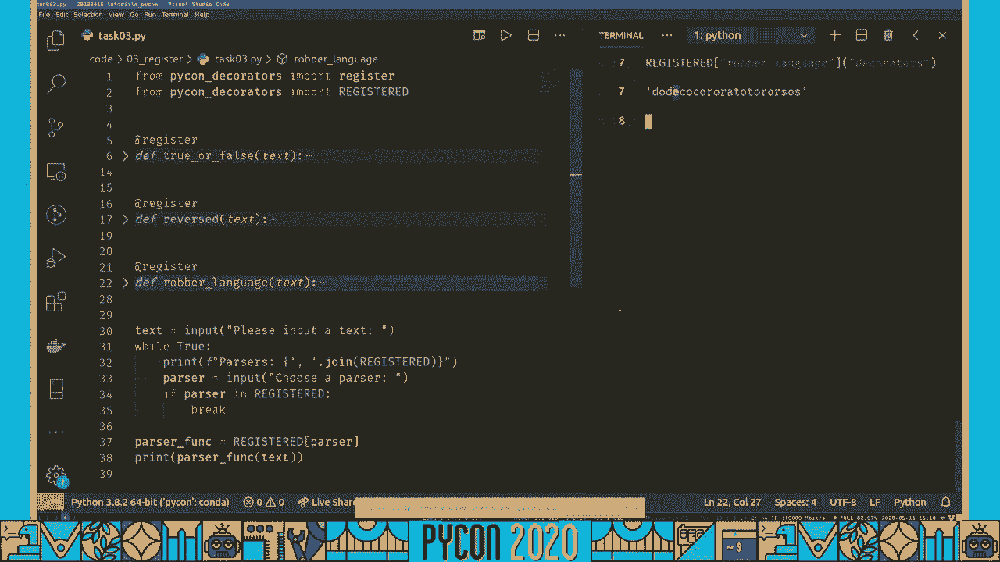

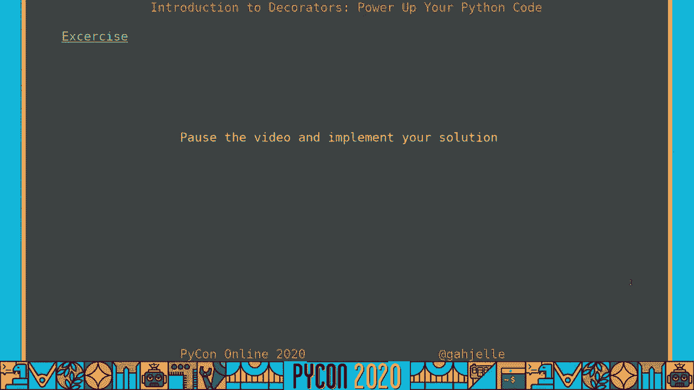

def trace(func):
    name = func.__name__
    @functools.wraps(func)
    def _trace(*args, **kwargs):
        # 格式化参数和关键字参数
        args_repr = [repr(a) for a in args]
        kwargs_repr = [f"{k}={repr(v)}" for k, v in kwargs.items()]
        signature = ", ".join(args_repr + kwargs_repr)
        print(f"Calling {name}({signature})")
        result = func(*args, **kwargs)
        print(f"{name}() returned {repr(result)}")
        return result
    return _trace

@trace
def greet(name, greeting="Hello"):
    return f"{greeting} {name}"

greet("World", greeting="Hi")
```

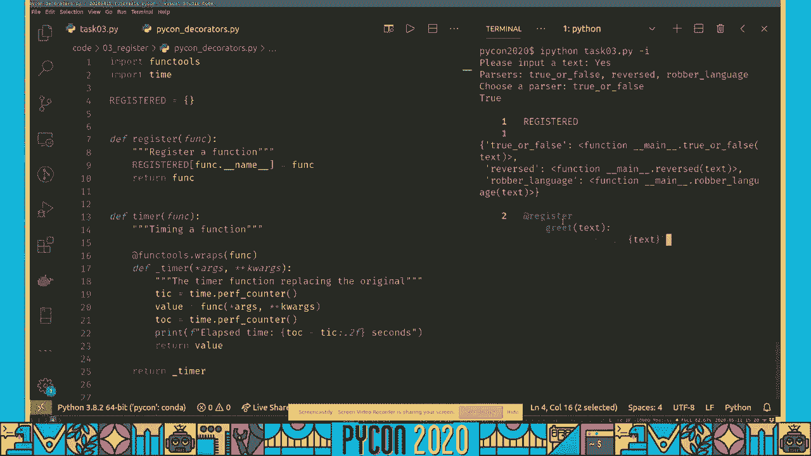

### 练习3：注册装饰器

以下是实现一个注册装饰器的步骤，该装饰器将函数注册到一个全局字典中。

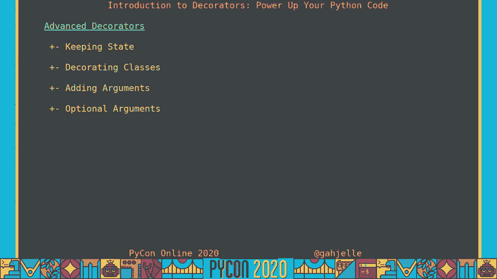

1.  创建一个模块级的空字典。
2.  装饰器函数接受一个函数作为参数。
3.  将函数以其名称作为键，函数对象本身作为值，添加到字典中。
4.  返回原函数（不进行包装）。

```python
REGISTRY = {}

def register(func):
    REGISTRY[func.__name__] = func
    return func

@register
def true_or_false(text):
    if text.lower() in ("yes", "true", "1"):
        return True
    elif text.lower() in ("no", "false", "0"):
        return False
    return None

print(REGISTRY)  # 查看已注册的函数
```

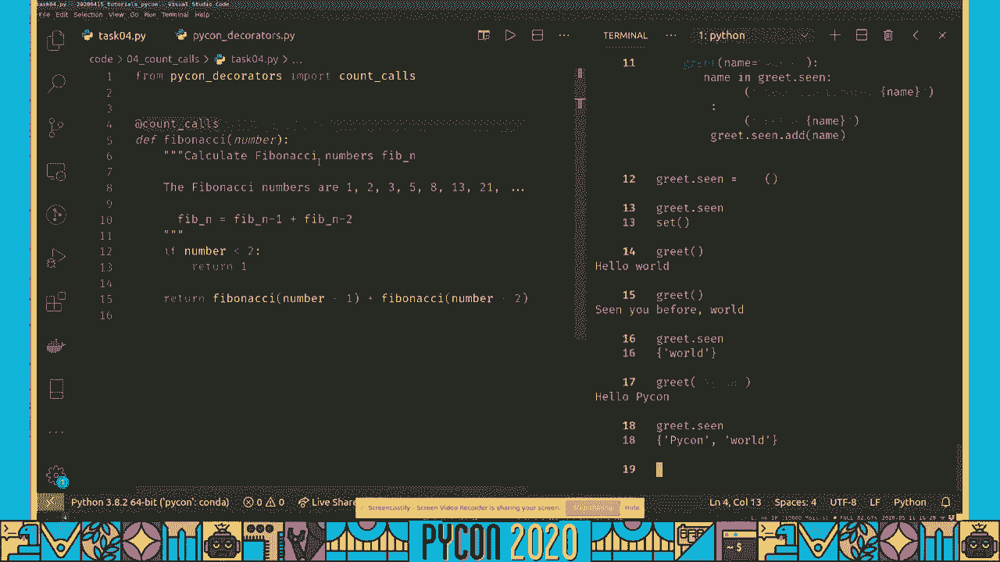

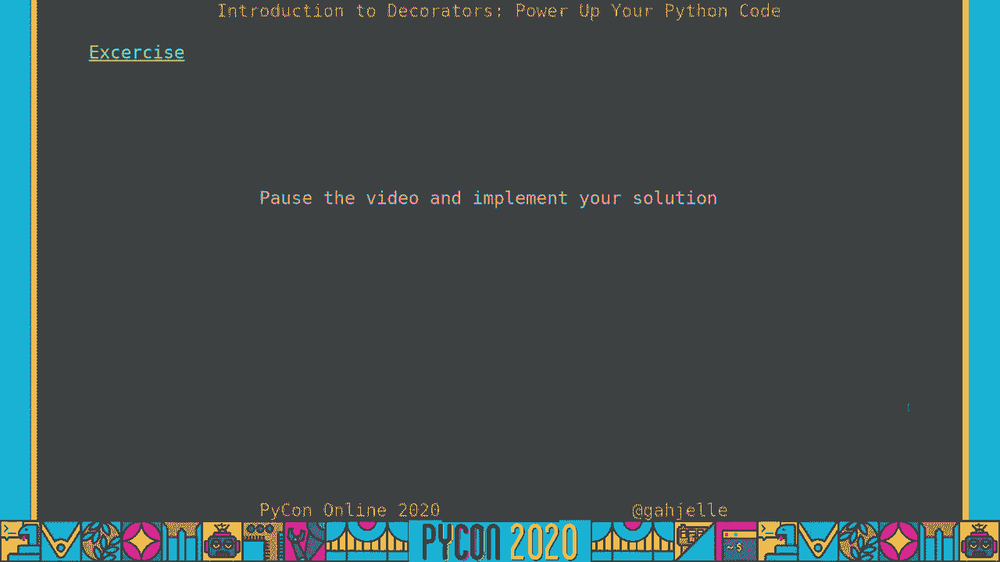

## 第三部分：高级装饰器概念 🚀

上一节我们完成了三个基础练习，本节中我们来看看更高级的装饰器概念。

### 保持状态的装饰器

装饰器可以通过函数属性或类来保持状态。

以下是一个使用函数属性来统计函数调用次数的装饰器：

```python
import functools

def count_calls(func):
    @functools.wraps(func)
    def _count_calls(*args, **kwargs):
        _count_calls.num_calls += 1  # 递增调用计数
        return func(*args, **kwargs)
    _count_calls.num_calls = 0  # 初始化调用计数
    return _count_calls

@count_calls
def fibonacci(n):
    if n < 2:
        return 1
    return fibonacci(n - 1) + fibonacci(n - 2)

print(fibonacci(7))
print(f"fibonacci was called {fibonacci.num_calls} times")
```

### 将类用作装饰器

任何可调用对象（如实现了 `__call__` 方法的类）都可以用作装饰器。

以下是将 `CountCalls` 实现为类的示例：

```python
import functools

class CountCalls:
    def __init__(self, func):
        functools.update_wrapper(self, func)
        self.func = func
        self.num_calls = 0

    def __call__(self, *args, **kwargs):
        self.num_calls += 1
        return self.func(*args, **kwargs)

@CountCalls
def fibonacci(n):
    if n < 2:
        return 1
    return fibonacci(n - 1) + fibonacci(n - 2)

print(fibonacci(7))
print(f"fibonacci was called {fibonacci.num_calls} times")
```

### 装饰类

你也可以装饰类。通常，你需要确保装饰后的类仍然保持其类型。

以下是一个装饰类的简单示例，它在类实例化时打印一条消息：

```python
def hello(cls):
    original_init = cls.__init__
    def new_init(self, *args, **kwargs):
        print(f"Instance of {cls.__name__} created.")
        original_init(self, *args, **kwargs)
    cls.__init__ = new_init
    return cls

@hello
class Thing:
    def __init__(self, value):
        self.value = value

t = Thing(42)
```

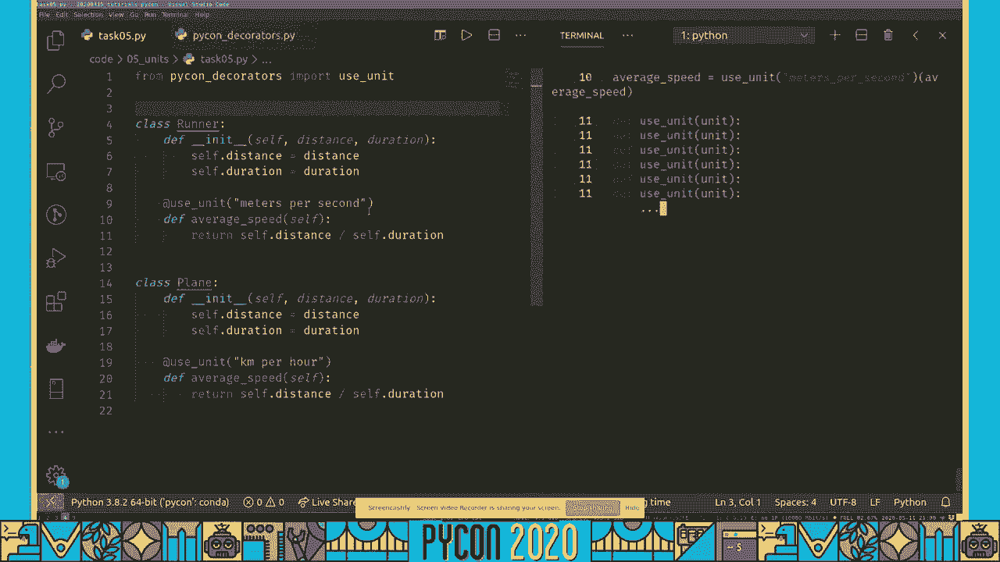

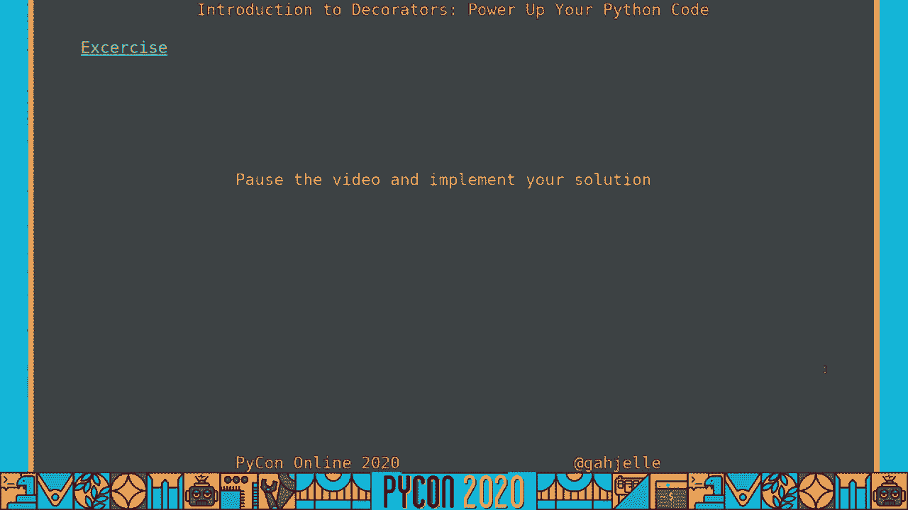

## 第四部分：带参数的装饰器 🛠️

上一节我们探讨了状态和类装饰器，本节中我们学习如何创建接受参数的装饰器。

### 练习5：使用单位的装饰器

带参数的装饰器实际上是一个“装饰器工厂”，它返回真正的装饰器。

以下是实现一个 `use_unit` 装饰器的步骤，该装饰器为函数返回值附加物理单位。

1.  定义装饰器工厂 `use_unit`，它接受单位字符串作为参数。
2.  在工厂内部，定义真正的装饰器 `decorator`。
3.  在装饰器内部，使用 `pint` 库将函数的返回值与指定单位相乘。
4.  返回装饰器。

```python
import pint
import functools

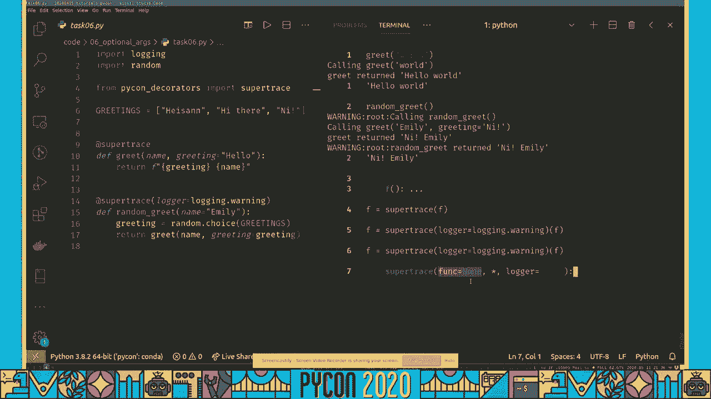

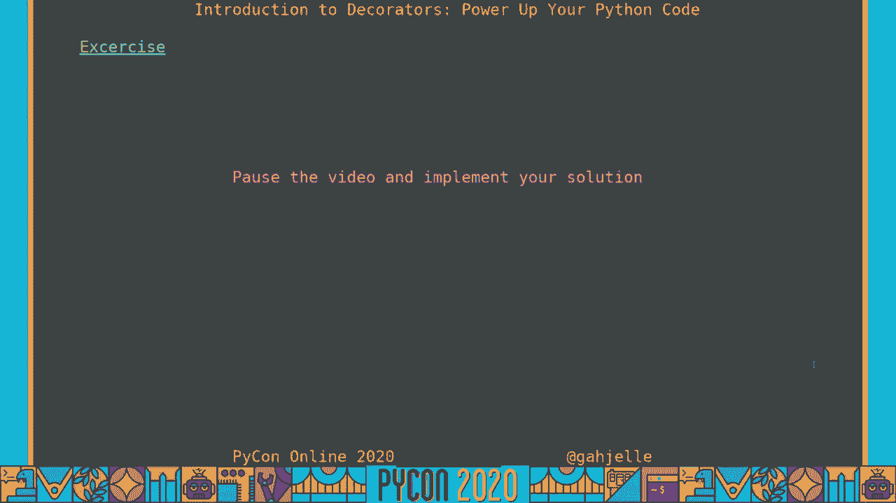

# 创建全局单位注册表
_unit_registry = pint.UnitRegistry()

def use_unit(unit):
    """装饰器工厂，返回一个为函数返回值附加单位的装饰器。"""
    def decorator(func):
        @functools.wraps(func)
        def _decorator(*args, **kwargs):
            result = func(*args, **kwargs)
            # 将结果与单位相乘
            return result * _unit_registry(unit)
        return _decorator
    return decorator

@use_unit("meters per second")
def average_speed(distance, duration):
    return distance / duration

bolt_speed = average_speed(100, 9.58)
print(bolt_speed)  # 输出带单位的值
print(bolt_speed.to("km per hour"))  # 转换单位
```

### 练习6：带可选参数的超级追踪装饰器

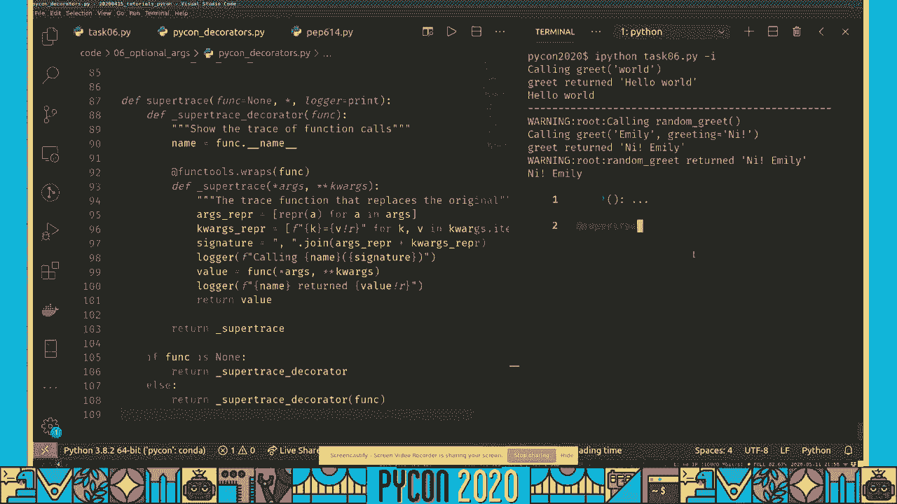

以下是实现一个 `super_trace` 装饰器的步骤，该装饰器可以带参数（指定记录器）或不带参数（使用默认记录器）使用。

1.  定义 `super_trace` 函数，其参数为 `func=None` 和 `logger=print`，并使用 `*` 强制后续参数为关键字参数。
2.  判断 `func` 参数。如果 `func` 是 `None`，说明装饰器被以 `@super_trace(logger=...)` 形式调用，此时应返回一个装饰器。
3.  如果 `func` 不是 `None`，说明装饰器被以 `@super_trace` 形式调用，此时应直接装饰该函数。
4.  内部定义真正的追踪装饰器逻辑。

```python
import functools

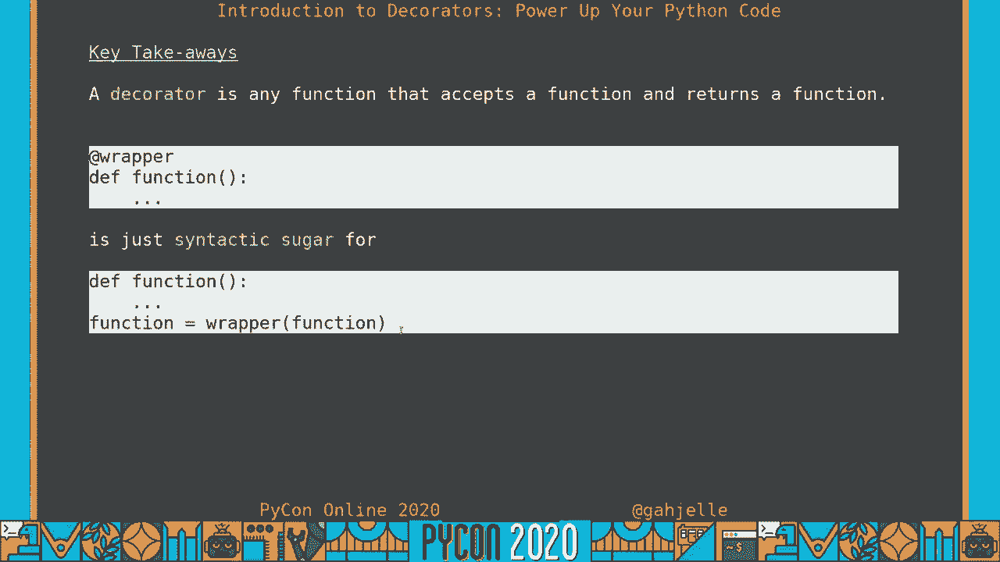

def super_trace(func=None, *, logger=print):
    def decorator(f):
        @functools.wraps(f)
        def _decorator(*args, **kwargs):
            args_repr = [repr(a) for a in args]
            kwargs_repr = [f"{k}={repr(v)}" for k, v in kwargs.items()]
            signature = ", ".join(args_repr + kwargs_repr)
            logger(f"Calling {f.__name__}({signature})")
            result = f(*args, **kwargs)
            logger(f"{f.__name__}() returned {repr(result)}")
            return result
        return _decorator

    if func is None:
        # 被以 @super_trace(logger=...) 形式调用
        return decorator
    else:
        # 被以 @super_trace 形式调用
        return decorator(func)

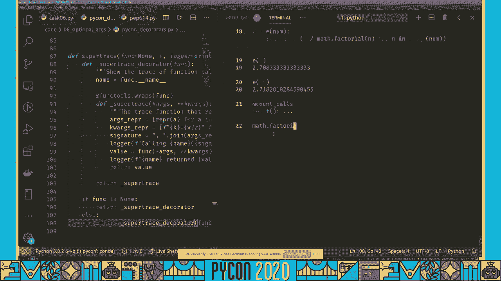

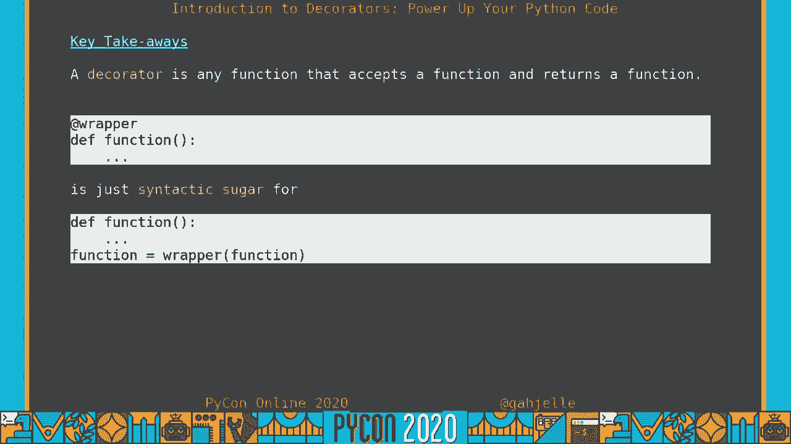

# 使用方式1：不带参数
@super_trace
def greet(name):
    return f"Hello {name}"

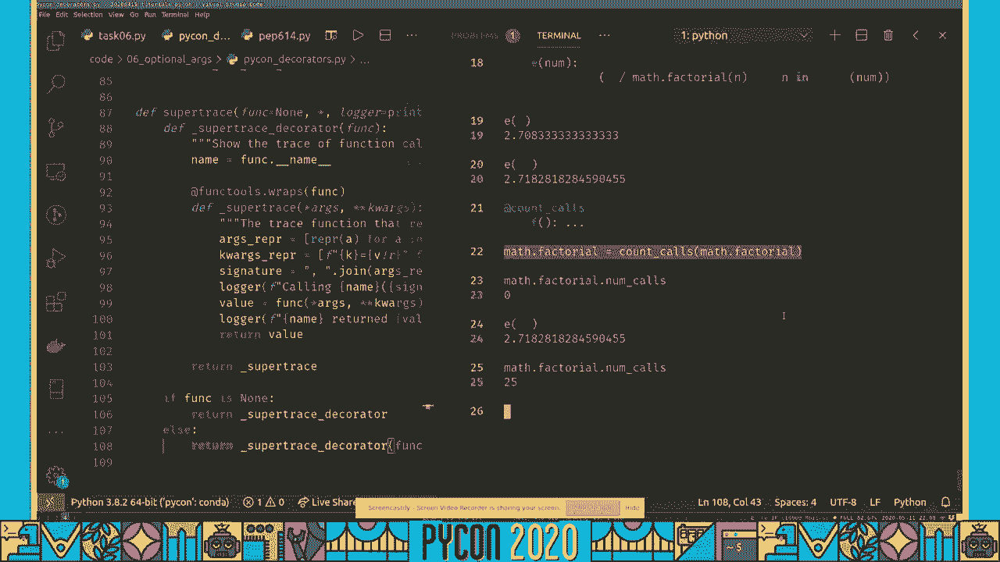

# 使用方式2：带参数
import logging
@super_trace(logger=logging.warning)
def random_greet():
    # ... 函数实现
    pass
```

## 总结 📝

在本教程中，我们一起学习了Python装饰器的核心概念和应用。

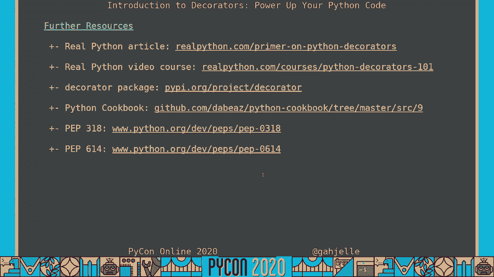

我们首先了解了装饰器的基本构建模块：函数作为一等对象、内部函数和函数操作。接着，我们学习了装饰器的标准模板，它使用 `*args`、`**kwargs` 来传递参数，并使用 `functools.wraps` 来保留原函数的元数据。

通过三个基础练习（计时器、追踪器、注册器），我们实践了创建基本装饰器。然后，我们探索了更高级的主题，包括使用函数属性或类来保持状态的装饰器、将类本身用作装饰器，以及如何装饰类。

最后，我们深入研究了带参数的装饰器，这通过“装饰器工厂”模式实现。我们完成了两个相关练习：为函数返回值附加单位，以及创建支持可选参数的超级追踪装饰器。

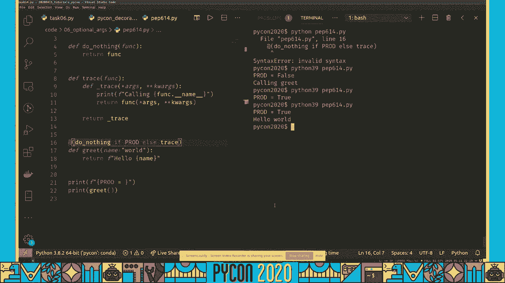

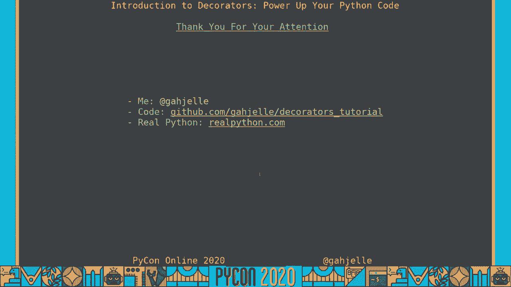


装饰器是Python中强大而优雅的工具，广泛用于日志记录、权限检查、性能测试、注册插件等场景。掌握装饰器将极大地提升你编写简洁、可复用和声明式代码的能力。