# 079：教程


在本教程中，我们将学习如何使用 Python 进行有效的数据可视化。我们将从数据探索开始，逐步深入到密度估计、高维数据可视化、交互式图表以及如何通过图表设计有效传达信息。本教程假设您熟悉基本的 Python 语法和编程，以及使用 Python 进行基础绘图的经验。

## 有效数据可视化：1：数据探索 🕵️

上一节我们介绍了本教程的概述，本节中我们来看看数据探索。数据探索是接触新数据集时的首要步骤，通过可视化可以直观地了解数据的结构和特征。

我们将首先使用 Anscombe 的四组数据集。这四组数据具有相同的均值和标准差，但分布却截然不同。


```python
import seaborn as sns
anscombe = sns.load_dataset("anscombe")
print(anscombe.groupby('dataset').describe())
```

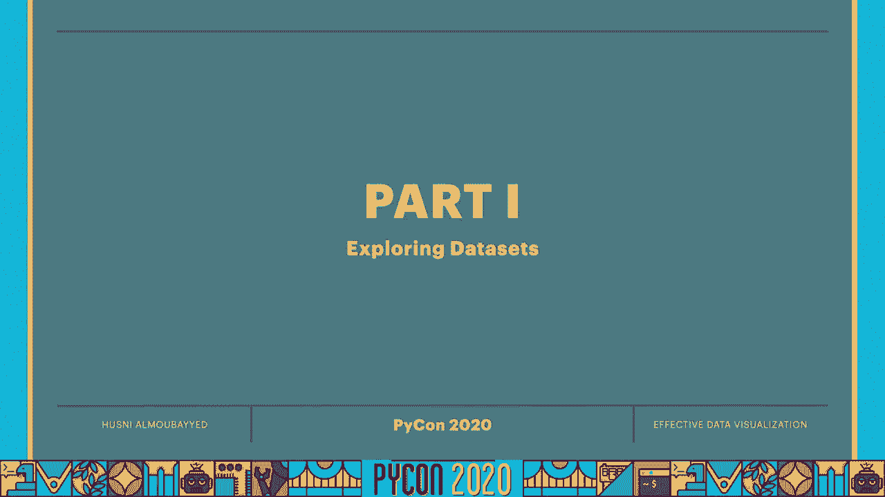

以下是绘制第一个数据集的散点图：

```python
import seaborn as sns
anscombe = sns.load_dataset("anscombe")
dataset_1 = anscombe[anscombe['dataset'] == 'I']
sns.scatterplot(x='x', y='y', data=dataset_1)
```

我们可以为数据集拟合线性回归模型：

```python
sns.lmplot(x='x', y='y', data=dataset_1, height=8)
```

对于第二个数据集，线性模型不适用，我们可以尝试二次拟合：

```python
dataset_2 = anscombe[anscombe['dataset'] == 'II']
sns.lmplot(x='x', y='y', data=dataset_2, order=2, height=8)
```

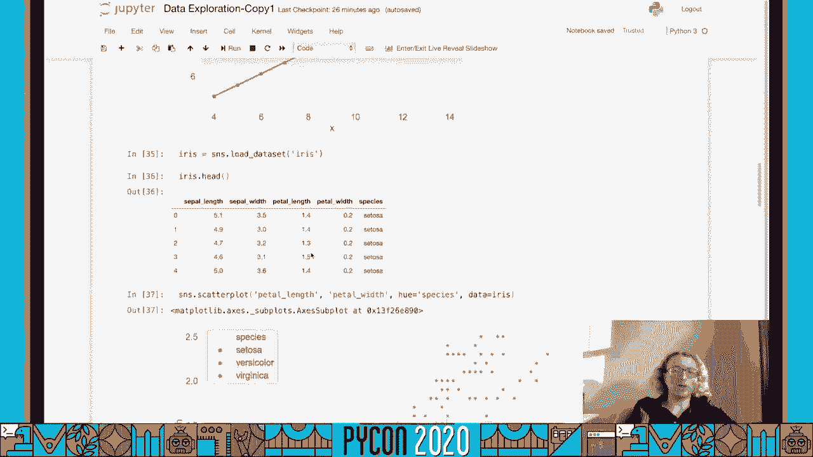


第三个数据集包含一个异常值，我们可以使用稳健回归来减少其影响：

```python
dataset_3 = anscombe[anscombe['dataset'] == 'III']
sns.lmplot(x='x', y='y', data=dataset_3, robust=True, ci=None, height=8)
```

接下来，我们使用鸢尾花数据集进行多维度探索。

```python
iris = sns.load_dataset("iris")
print(iris.head())
```

以下是绘制花瓣长度与宽度的散点图，并按物种着色：

```python
sns.scatterplot(x='petal_length', y='petal_width', hue='species', data=iris)
```

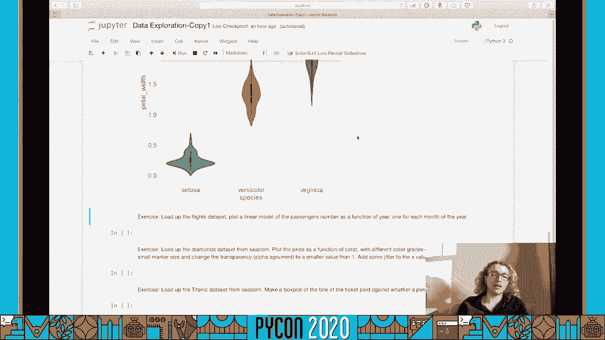


我们可以为每个物种分别拟合线性模型：

```python
sns.lmplot(x='petal_length', y='petal_width', hue='species', data=iris, height=8)
```

为了同时查看边缘分布和联合分布，我们可以使用联合图：

```python
sns.jointplot(x='petal_length', y='petal_width', data=iris, kind='kde')
```

对于多维数据，配对图可以展示所有维度两两之间的关系：

```python
sns.pairplot(iris, hue='species', height=2.5)
```

对于分类数据，我们可以使用分类图。例如，绘制不同物种的花瓣宽度：

```python
sns.catplot(x='species', y='petal_width', data=iris, kind='point', height=6)
```

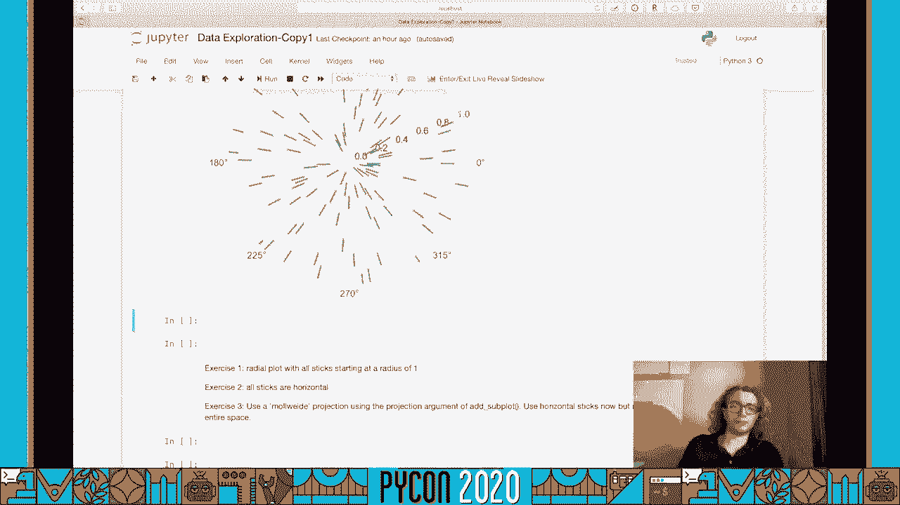


小提琴图可以展示分布的更多细节：


```python
sns.catplot(x='species', y='petal_width', data=iris, kind='violin', height=6)
```

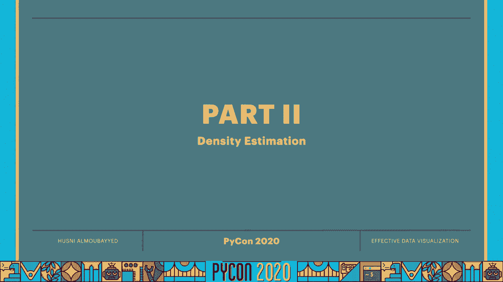

## 有效数据可视化：2：密度估计 📊

上一节我们介绍了如何探索数据，本节中我们来看看密度估计。密度估计旨在理解生成数据的潜在分布。

最简单的方法是绘制数据的直方图。

```python
import matplotlib.pyplot as plt
import seaborn as sns
iris = sns.load_dataset("iris")
sepal_length = iris['sepal_length']
plt.hist(sepal_length, bins=5, density=True)
plt.show()
```

直方图的分箱数量会影响其外观：

```python
fig, axes = plt.subplots(1, 2, figsize=(12, 4))
axes[0].hist(sepal_length, bins=5, density=True)
axes[0].set_title('5 Bins')
axes[1].hist(sepal_length, bins=100, density=True)
axes[1].set_title('100 Bins')
plt.show()
```

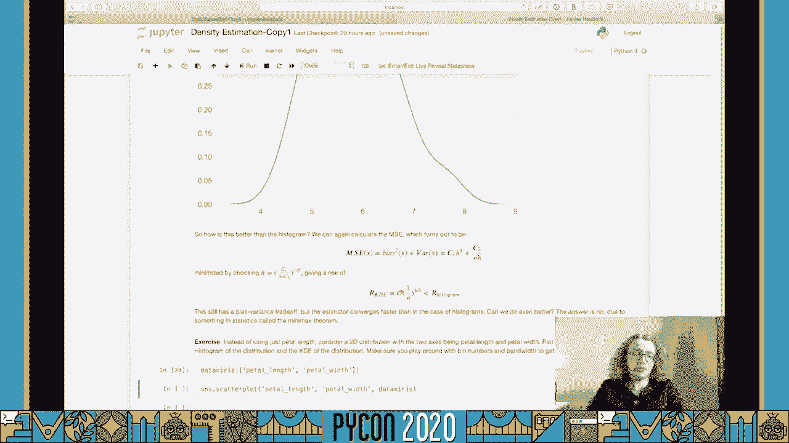


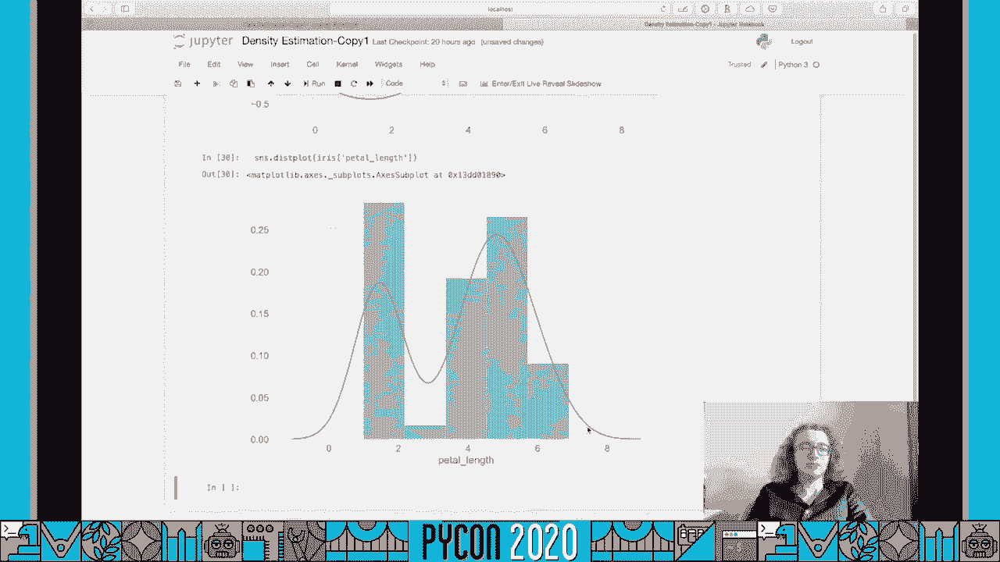

直方图存在偏差-方差权衡。核密度估计（KDE）是一种更平滑的替代方法。

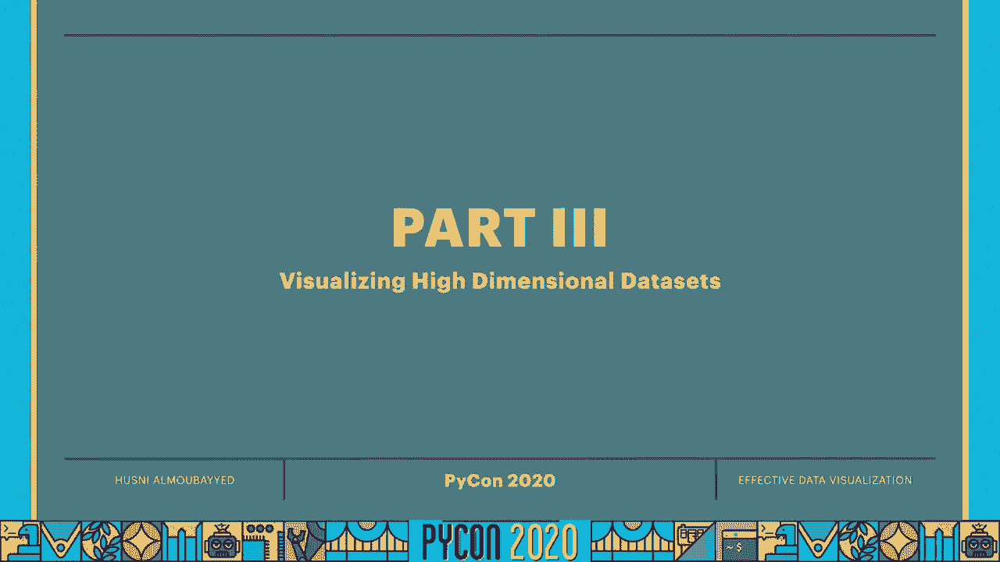

```python
sns.kdeplot(sepal_length, bw_adjust=0.5)
```

KDE 通过将每个数据点替换为一个核函数（如高斯函数）来工作。核的带宽是一个重要参数。

```python
sns.kdeplot(sepal_length, bw_adjust=0.2, label='Bandwidth=0.2')
sns.kdeplot(sepal_length, bw_adjust=1.0, label='Bandwidth=1.0')
plt.legend()
```

对于二维数据，我们可以绘制二维 KDE 图：


```python
sns.kdeplot(x='petal_length', y='petal_width', data=iris, fill=True)
```


`distplot` 函数可以同时绘制直方图和 KDE：

```python
sns.histplot(sepal_length, kde=True)
```

## 有效数据可视化：3：高维数据可视化与降维 📉

上一节我们讨论了密度估计，本节中我们来看看如何可视化高维数据。降维技术可以帮助我们将高维数据投影到低维空间进行可视化。

我们将使用手写数字数据集。

```python
from sklearn.datasets import load_digits
digits = load_digits()
images = digits.images
data = digits.data
print(data.shape)
```

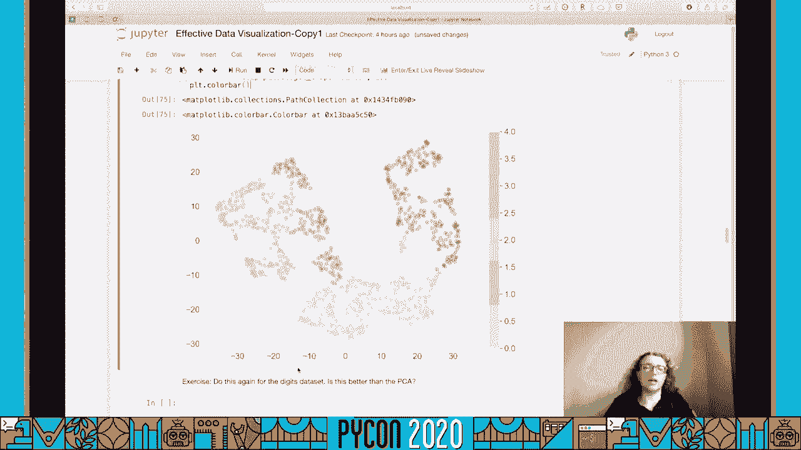


首先，我们查看一张图像：

```python
import matplotlib.pyplot as plt
plt.imshow(images[0], cmap='gray')
plt.show()
```

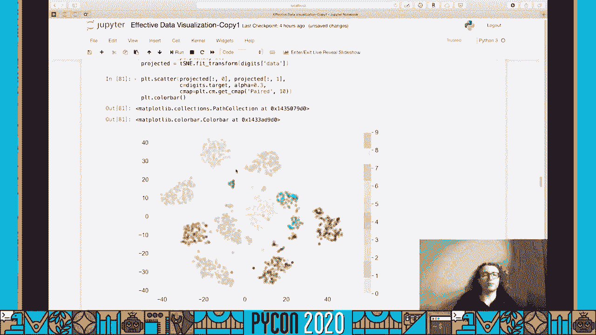


主成分分析（PCA）是一种线性降维方法，它寻找方差最大的投影方向。

```python
import numpy as np
from sklearn.decomposition import PCA
# 创建一个简单的二维数据集
x = np.arange(10)
y = np.arange(10)
data_2d = np.column_stack((x, y))
# 应用PCA降至1维
pca = PCA(n_components=1)
components = pca.fit_transform(data_2d)
print(components.flatten())
```

现在，我们将PCA应用于数字数据集，将其从64维降至2维。

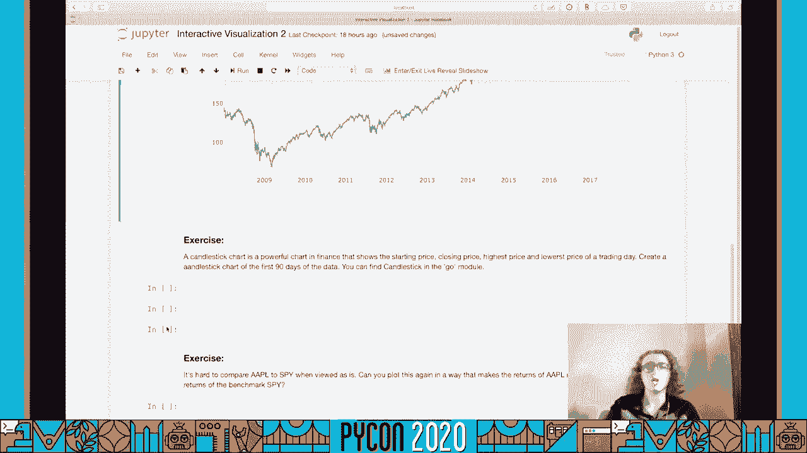


```python
pca = PCA(n_components=2)
components = pca.fit_transform(data)
plt.scatter(components[:, 0], components[:, 1], c=digits.target, cmap='tab10', alpha=0.5)
plt.colorbar()
plt.show()
```

PCA对于非线性数据可能失效。t-SNE是一种处理非线性数据集的降维方法。

```python
from sklearn.manifold import TSNE
tsne = TSNE(n_components=2, random_state=42)
components_tsne = tsne.fit_transform(data)
plt.scatter(components_tsne[:, 0], components_tsne[:, 1], c=digits.target, cmap='tab10', alpha=0.5)
plt.colorbar()
plt.show()
```

## 有效数据可视化：4：交互式可视化 🎮

上一节我们介绍了降维，本节中我们来看看交互式可视化。交互式图表允许用户探索数据，获取更多细节。

我们将使用 `plotly` 库来可视化金融市场数据。

```python
import pandas as pd
import plotly.graph_objects as go
from pandas_datareader import data as pdr
import datetime
import yfinance as yf
yf.pdr_override()
# 获取标普500 ETF数据
start = datetime.datetime(2020, 1, 1)
end = datetime.datetime(2020, 12, 31)
spy = pdr.get_data_yahoo('SPY', start, end)
spy.reset_index(inplace=True)
# 创建散点图
fig = go.Figure(data=go.Scatter(x=spy['Date'], y=spy['Close'], mode='markers'))
fig.show()
```

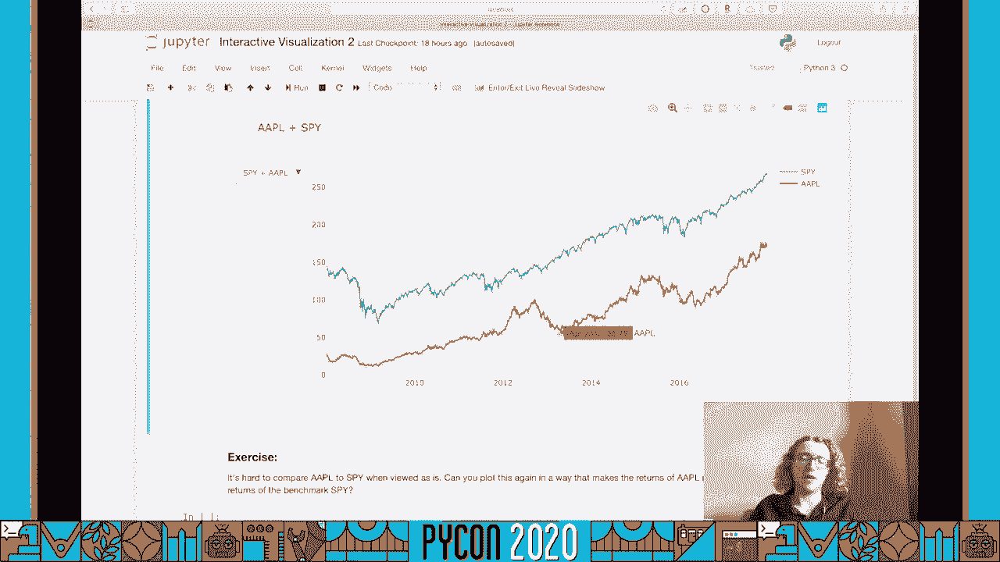


我们还可以创建烛台图：

```python
fig = go.Figure(data=[go.Candlestick(x=spy['Date'][:90],
                open=spy['Open'][:90],
                high=spy['High'][:90],
                low=spy['Low'][:90],
                close=spy['Close'][:90])])
fig.show()
```

可以在一个图表中绘制多个数据序列并添加控件：

```python
aapl = pdr.get_data_yahoo('AAPL', start, end)
aapl.reset_index(inplace=True)
fig = go.Figure()
fig.add_trace(go.Scatter(x=spy['Date'], y=spy['Close'], name='SPY'))
fig.add_trace(go.Scatter(x=aapl['Date'], y=aapl['Close'], name='AAPL'))
fig.update_layout(title='Yahoo Finance Data',
                  updatemenus=[...]) # 按钮定义省略
fig.show()
```

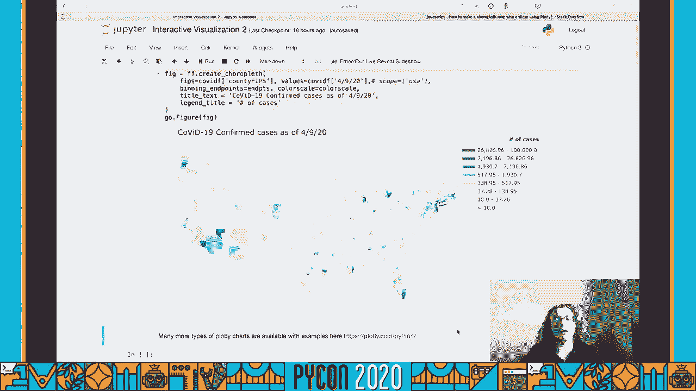


`plotly` 还可以用于创建地图。例如，可视化 COVID-19 确诊病例数据。

```python
import plotly.express as px
# 假设 `df` 是一个包含 FIPS 代码和病例数的 DataFrame
fig = px.choropleth(df,
                    locations='fips',
                    color='cases',
                    color_continuous_scale=px.colors.sequential.Blues,
                    scope='usa')
fig.show()
```

## 有效数据可视化：5：通过图表进行交流 📢

上一节我们介绍了交互式可视化，本节是最后一节，我们将学习如何通过图表设计有效地传达信息。不当的设计可能导致误解。

首先讨论颜色。Jet 色彩映射是历史上常用的，但它在感知上不一致。

```python
import seaborn as sns
import numpy as np
data = np.tile(np.arange(100), (10, 1))
sns.heatmap(data, cmap='jet', square=True)
```

更有效的色彩映射类型包括：
1.  顺序色彩映射：用于表示从低到高的数据。
2.  发散色彩映射：用于突出显示与中间值的偏差。
3.  分类色彩映射：用于区分不同类别的数据。

以下是使用感知均匀的顺序色彩映射 `viridis` 的示例：

```python
flights = sns.load_dataset("flights").pivot("month", "year", "passengers")
sns.heatmap(flights, cmap='viridis')
```

标记形状的选择也很重要。当需要区分不同类别的数据点时，应使用明显不同的形状。

```python
import matplotlib.pyplot as plt
import numpy as np
np.random.seed(0)
data1 = np.random.randn(100, 2)
data2 = np.random.randn(5, 2) + 3
plt.scatter(data1[:, 0], data1[:, 1], marker='s', label='Dataset 1')
plt.scatter(data2[:, 0], data2[:, 1], marker='*', s=100, label='Dataset 2')
plt.legend()
plt.show()
```

在二维图表中，我们可以利用颜色、大小和形状来编码额外的维度。

最后，确保为整个项目或笔记本设置一个合适的、色盲友好的调色板。

```python
sns.set_palette("colorblind")
sns.set_context("notebook", font_scale=1.2)
```

---


本节课中我们一起学习了数据可视化的五个核心方面：数据探索、密度估计、高维数据降维、交互式可视化以及通过设计进行有效沟通。掌握这些技能将帮助您更清晰、更有力地通过数据讲述故事。