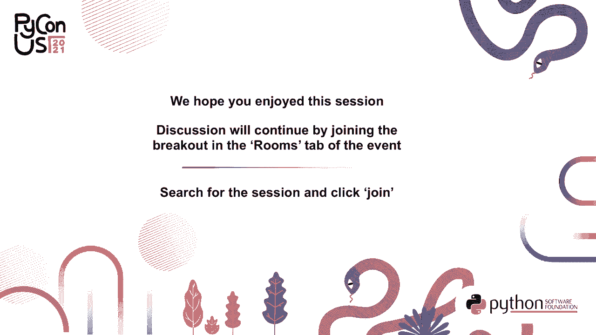

# P1：演讲 _ Alexander Hultnér _ Pydantic 简介，Python 数据类的运行时类型检查 - VikingDen7 - BV19Q4y197HM

[音乐]。

嗨，我是 Alexander Halzner。我来自瑞典哥德堡。今年我在 PyCon US，很高兴能在这里为大家发言。我将谈谈 Pydantic。我的演讲标题是《Pydantic 简介：Python 数据类的运行时类型检查》。那么，让我们开始吧。正如我告诉你的。

我叫 Alexander Hartner，是 Halzner Technologies 的创始人，同时也是 prepare.io 的创始人，这是我和我的同事 Magnus 过去一年一直在工作的服务。右下角可以看到一个小截图。我还在很多会议上发言，是不同会议的常客。例如，PyCon Sweden，多年前我参加过几次。

Europiphon，当然我这次在 PyCon US 是第一次。所以这很不错。我做一些自由咨询，也进行一些培训和研讨会，如果你对此感兴趣，可以联系我。我的推特账号是 @ahoutner，你也可以通过 contact@houtner.sc 给我发邮件。我的所有幻灯片都可以在 slides.com/houtner 找到。

并且你可以在这些幻灯片中看到的所有链接都是可点击的，所以你可以通过 slides.com 找到它们。只需向下滚动，直到找到 PyCon US 幻灯片，它们现在可能在顶部。你也可以在 LinkedIn 上找到我，我的用户名也是 houtner。那么，我们开始吧。今天的演讲大纲如下。

我们将从 Python 数据类的快速回顾开始，如果你忘记了一些细节，或者想看看我们将要覆盖的内容，这将是有益的。然后我将向你介绍 Pythonic。我会简单谈谈运行时类型。

正在检查。我将展示一些非常酷的 JSON 相关内容。我会展示一些自定义验证器以及内置验证器。我还会简单介绍一下如何在运行时使用 Pythonic 对你的函数进行类型检查。

基本上，如果你有一个函数，你也可以检查它。我将介绍一些框架集成，以及如何与许多不同的框架一起使用 Pythonic。我还会展示一个小示例。

自动化测试，我不会深入探讨，但我会给出一些提示，供你们进一步了解。如果你对此感兴趣，还有一些很酷的特性值得提及，最后我们将总结今天的演讲。让我们不再等待，开始吧。数据类部分结束。这里有一个快速回顾。

我们有@DataClass 装饰器，在这个讲座中，我们将想象一个华夫饼店作为我们的例子，因为谁不喜欢华夫饼呢？无论如何，我们虚构的公司是一家名为 WaffleBistro 的咖啡馆。WaffleBistro 需要对他们的华夫饼进行建模。

让我们看看这样一个数据类可能是什么样的。这里我们有一个华夫饼。我们有一些风格。我们有一些配料，并且我们在上面有一些类型注解。现在让我们试试看。因此，正如你所见，我们试图创建一个瑞典风格的华夫饼，配巧克力酱和火腿。虽然这不是我最喜欢的配料组合，但我不太确定。

这正是 WaffleBistro 想要提供的。但正如你所看到的，这在我们的华夫饼类中是完全允许的。因此，这是我们可能想要避免的事情。也许我们想对这件事施加一些更严格的类型限制，因为字符串基本上可以是任何东西。那么让我们继续，看看我们能否对其进行约束。

我们提供的配料类型和风格。所以我们提供几种基于奶油的配料。你可以看到我们有打发奶油，还有冰淇淋。我们还提供几种甜点酱。你可以看到我们有丁香浆果酱。这是我个人最喜欢的之一。这是一种在瑞典的啤酒，非常好喝。

如果你有机会，你应该尝试一下。覆盆子酱，经典的选择。为我们的比利时风格华夫饼提供巧克力酱。你可以看到，我们有两种风格，瑞典风格和比利时风格。我们更新了数据类，使用华夫饼风格来表示风格，和几种配料来表示配料。

那么，如果我们尝试创建一个带火腿配料的华夫饼会发生什么呢？如你所见，用户提供了一个华夫饼订单，其中有瑞典风格的华夫饼和巧克力酱，外加火腿。好的。那么另一种类型是否阻止了这一点？首先，使用我的 pie 进行静态类型检查，这可能就足够了。你会在静态类型验证中捕获到类型错误。

但在运行时，这仍然没有停止。特别是如果你在处理运行时数据时，这可能会成为问题。因此，你可以看到我们完全可以创建一个带火腿的华夫饼。没有任何东西阻止我们。那么我们该如何解决这个问题呢？

这就是 Python 的用武之地。所以 Python 库允许你在运行时强制执行类型注解。它与数据类兼容。如果你想更深入，你还有一些额外的内容。你会得到非常友好的错误提示，没有特殊语法。它只是纯粹的 Python 类，没什么奇怪的。

我们内置了这种序列化，和类的序列化。它甚至支持嵌套结构。有一些前辈，如数据类，Smoshmallow，Valadier 和 Orm 库。这些可能是了解使得 pedantic 突出的内容的好选择，因为它只是使用标准类型注解。

文档真的很棒。正如你所看到的，它在幻灯片中是蓝色的。这意味着如果你进入幻灯片软件，你可以点击链接，自己找到所有不错的文档。那么让我们进入讲究细节的时间。运行类型检查当然非常不错。这正是我们想做的。

那么让我们依靠房间里的巨人，即在这种情况下的 pedantic。现在我们稍微改变一下我们的代码。我们从 pedantic 导入数据类，而不是标准库的数据类。然后我们并没有真正改变其他内容。我们的 waffle 类保持不变。但是当我们现在尝试初始化 waffle 时。

你可以看到我们得到了一个验证错误。实际上，我们得到了两个验证错误。它们提供了一个易读的值。你可以看到索引在顶部的引用。顶部的内容实际上都是无效的。所以在索引一的位置是无效的。它给了我们一个错误，解释了出错的原因。这非常有帮助。

我们可以看到它既不是搜索源，也不是奶油。所以这是不允许的。通过这个简单的更改，我们已经在我们的类上实现了一些运行时类型检查。所以我们可以在这里停下来。但是当然，我们想进一步看看还能做什么。所以让我们尝试创建一个有效的华夫饼，也许加上 Cloud Vergium。

你可以在这里的图片中看到 Cloud Vergium 的样子。它看起来像橙色的覆盆子，但味道完全不同。那么让我们制作一种瑞典风格的华夫饼，配上奶油和 Cloud Vergium。看看我如何为奶油使用 cream 枚举。

但是字符串是其他字段的表示。Pedantic 是一个解析库，它会尝试解析你实际想要的数据。所以它会自动将其转换为枚举。如你所见，Cloud Vergium 自动解析为搜索源。如果你想要比这更严格的东西。

你可以通过严格类型实现其中一些，这在文档中也可以看到。或者如果你想要更严格，正在开发一个完全严格模式。所以这可能在未来推出。具体什么时候不确定，但如果这对你很重要，请保持关注。那么 JSON 呢？

数据类的替代品真的很棒，使得开始非常快速。你不需要更改任何内容。但是有时你想做得更多。而使用 pedantic 基础模型，你可以做到。因此，你拥有内置的一流 JSON 支持。而我们现在唯一需要更改的是。

如你所见，我们移除了数据类装饰器，而是从基础模型继承。当然，你也可以有自己的基础类，从基础模型继承。然后稍后，你可以继承那个类，你会自动得到所有功能。但我们现在不深入讨论这一点。那么让我们看看。

我总是需要指定参数，你可以在使用我们的基本模型时看到关键字参数。而且正如你在这里看到的，我们使用样式等于瑞典风格。配料等于之前的相同数据。正如你所见，我们得到了与之前相同的华夫饼对象，所以一切都运作良好。但现在我们可以轻松地对这个整个对象进行编码。

作为 JSON 并解码它。还有对 Dicks 和 Pickle 的内置支持，并且有一个不可变的复制方法。但它们也可以反序列化或序列化子类，并且如果你在 pedantic 类的属性中引用另一个 pedantic 类，这也将为你处理。

所以这对于这些事情真的很方便。那么让我们看看我们的 JSON 对象。我们可以轻松创建。你可以看到我们只需对它运行 JSON 函数。我们可以看到我们得到 JSON 输出。那么重建又怎么样呢？

那么让我们尝试从 JSON 输出重建我们的对象。我们将使用 parse_raw 函数。你也可以解析一组 pedantic 项目。但现在我们不这样做。所以我们可以使用 parse_raw。正如你所见，我们又得到了原始的华夫饼对象。这真的很好。那么让我们看看错误会发生什么。

所以我们有可读的验证错误，而异常也很好。但当你与第三方客户或 API 等打交道时。也许你想以结构化的格式公开这些错误。当然，异步也可以在这里使用。那么在这里我们创建一个无效的华夫饼。并且在这种情况下。

我们有样式 42，这在 WaffleBist 组中不是一个允许的样式。我们指向错误。在这里你可以看到我们有相同的错误数据，但以一个结构化的对象呈现，在这里我们可以获得错误的位置。我们可以以更人性化的方式获取告诉我们出错的消息。我们还获得了一些上下文数据和错误类型。这真的很有用。

我曾在 React 和其他前端库中使用这个，来包装并轻松获得一些非常不错的输出。也许可以自动标记在表单中，比如错误的位置。是的，我觉得这真的很好。所以 JSON 架构完成了。也许你听说过 JSON 架构。我们还可以直接从我们的模型导出 JSON 架构。

这就是 pedantic 对我来说几乎变得神奇的地方。因为我是说，这真的很有用。你可以用它来创建 swagger 或开放 API，正如现在所称的。以及你数据的规范。所以在这里我们有华夫饼类。我们对它运行架构函数。正如你所见，我们得到了这个大型架构。

实际上是一个 JSON 架构。请记住，pedantic 确实使用 ASIN 架构的第 7 个草案，这是开放 API 3.1 中的标准，该标准在今年早些时候发布。但也许如果你仍在使用常见的 3.0，你可能会遇到一些轻微的兼容性问题。通常没问题。但我遇到过几次。所以知道这一点是好的。

区别非常小，但确实存在一些。如果你想与草稿 4 保持完全兼容，你可以创建 ASIN 额外函数，帮你处理这个问题。所以那是内置的验证器。但也许你想创建一些自定义的。

并且编码我们自己的业务逻辑。而华夫饼小馆当然会这样做。所以我们有自己的业务逻辑，想要实施。在这种情况下，我们希望稍微限制一下可以创建什么类型的华夫饼。所以现在我们创建一个华夫饼订单，这是华夫饼的子类。唯一的区别是我们实际上强制了一些要求。

当顾客点我们的华夫饼时。例如，对于瑞典风格的华夫饼，我们只想允许果酱甜点酱，所以是覆盆子果酱或云障碍果酱。对于比利时风格的华夫饼，我们允许巧克力酱。此外，我们不希望有同时添加冰淇淋和奶油的华夫饼。

所以他们必须选择冰淇淋或奶油。你可以看到我们在这里创建了一些函数。基本上，我们有这个根验证器。告诉我们应该运行这些预等于假。告诉我们在完成所有其他验证器后应该运行这个，所以我们知道已经解析了所有数据。

还有这样的东西。这会很有用。我们检查风格，基本上查看配料和风格。我们可以看到我们遵循这些规则，没有问题。奶油也是一样。所以在这里我们可以看到，我们检查过，配料列表中只有一种奶油。

如果有更多的情况，我们会抛出一个友好的错误。那么让我们继续。那么现在看看会发生什么。我们尝试根据这些新规则创建一个无效的华夫饼。所以我会创建一个同时含有冰淇淋和奶油的。我今天真的想要很多奶油。如你所见，订单没有被接受。

它告诉我们，只允许有一种奶油配料，但我们给了冰淇淋和奶油。所以这样不行。基本上，这给了我们一种很好的方式去了解情况。然后你可以看到，我们在根验证器上得到了一个错误。这是因为之前的验证器没有通过。

我们可以添加一个例外，或者以更智能的方式处理。但在这种情况下，就这个讨论而言，我的意思是保持简单。所以如果我们现在尝试创建一个华夫饼订单，包含云障碍果酱和巧克力酱，并且是瑞典风格的。那么我们不允许瑞典风格的华夫饼上加巧克力酱。

我们也可以看到我们在这里说，两个华夫饼小馆不出售这种类型的华夫饼。如果我们想的话，这里还可以创建更好的错误，但对于自定义的来说，就看你了。所以这些运行时函数或类型检查器，对很多事情都非常有用。所以也许你想把它们用于函数。有时你在类中的边界。

所以实际上，我终于在这里也覆盖了你，因为有一个验证器参数装饰器，仍在 beta 版本中。它是在 2020 年 4 月 18 日以 1.5 版本发布的，但它非常稳定。知道这个或看到它可能会很有趣。因此这里我们有有效参数的导入。

然后我们有我们的函数 make order，里面有一些未定义的业务逻辑，接收一个华夫饼。实际上是我们的华夫饼订单，并确保传入的参数是一个华夫饼订单。因此我们尝试在这里制作一个华夫饼，并创建一个早餐风格的华夫饼。在这里你可以看到我们添加了一个字典。

如果字典是有效的，它实际上会为你创建 waffle 对象。如你所见，我们收到错误提示，告知我们样式不正确，因为我们不销售早餐华夫饼，仅销售瑞典和比利时风格。我们也可以看到我们得到了根验证器错误。

说我们不销售这种类型的华夫饼。这非常好。现在你看到了这一点，可能在想要将其集成到你的框架中。这也是 pedantic 的一个很好的地方。许多框架与 pedantic 有很好的集成。因此，你可以使用它，例如。

与 flask、Falcon 或 Stollet，使用框架无关的 spectra。还有一个 quartz schema，它是一个异步的，或者说 quartz 是 flask 的异步重实现，而 quartz schema 是第一个官方的 pedantic 集成。还有 fast API，非常有名，它在所有方面都使用 pedantic。因此在那里真的是一流的。

我们有一个叫 Django NINIA 的东西，供你在 Django 外部使用。我自己还没有使用过，但我看过，它与其他的非常相似。应该相当容易使用。还有另一个我喜欢提到的酷东西是 Proberry，它实际上是一个 GraphQL 框架，但对 pedantic 类有实验性支持。

对于你的 GraphQL 图形，这非常好。就像一个拼图块，可以在各处适当放置。而我非常喜欢的另一件事是自动测试。有一个严格的 hypothesis 插件，你可以用它进行自动测试。我在这里链接了一篇 Phil Jones 的文章。

他使用了一种非常类似于我使用的技术，通过这个 hypothesis 插件自动测试 API。基本上，如果你使用过 hypothesis，当你构建策略时，你只需引用模型，就可以了。如果你想了解更多关于 hypothesis 的内容。

你可以观看我在 2019 年 PyCon Suite 的演讲，链接在这里。另一个很棒的库是 schema thesis，它接受开放的 API 规范，并确保你的 API 实际能够处理规范所说的一切。因此，它生成了很多测试，非常不错的库。如果你想了解更多，可以观看我去年 Europil 的演讲，链接在这里。

或者直接查看这个库。我强烈推荐它。现在我会非常快速地展示一个使用 Fast API 的超小示例。基本上是用它来创建一个围绕我们的 Waffle 的小 API。Fast API 与 pedantic 紧密集成，并且它是异步 ASCII 框架，但也可以以同步模式使用。

这就是我们创建一个围绕我们的 API 的应用程序所需的一切。在这里我们有两个函数，实施我们的业务逻辑，基本上是创建订单和派发订单。所以我们可以创建一个 Waffle 订单，并在 Waffle 完成时派发它。我们在这里引用我们的 Waffle 模型，简单地使用它。

你可以获得自动 API 文档，还可以在运行时对所有内容进行类型验证。这仅仅是个开始。这只是冰山一角，还有更多内容。如果你想知道更多，可以通过会议上的聊天、Twitter、LinkedIn 或电子邮件联系我。

这里简单介绍一下你可以查看的一些内容，但我没有时间详细讲解。例如，内置支持 `.n`，你可以用它来进行设置管理，非常不错。还有带注释的类型，PyCharm 的插件，以及一个 MyPy 插件，使 MyPy 的支持更好。

当然，MyPy 也有原生支持。我们有非常快速的处理方式。所以如果你查看基准测试，它与其他方案相比非常快速。当然，你应该自己去使用。如果你要使用它，有很多内置类型可以使用，当然你也可以创建自己的类型。总结一下这次演讲。

我们有纯 Python 语法。我们获得了一些更好的验证，对于 API 来说非常有用的 JSON 工具，如果你有标准数据类，迁移非常简单，还有很多实用功能。更多的功能总是在不断推出，开发非常活跃，他们一直在研究严格模式，你真的应该试试。

随便玩玩吧。我从生产应用到小型实验都用过它。所以如果你有任何进一步的问题，可以在会议上问我，或者通过这些链接联系我。我这里还有一个链接到我的 GitHub，那里有这个演讲的 GitHub 页面。

在这里我有更多信息，还有一些链接。我有一个 Jupyter notebook，里面包含所有示例，你可以自己运行。如果你对基于属性的测试感兴趣，可以报名参加我在这里开发的课程，也可以关注 papier.io 的测试版。

如果你对优化 PDF 工作流程感兴趣，能够使用 HTML、CSS 和 JavaScript 创建 PDF。同时，如果你想了解更多，我也可以提供培训工作坊和自由咨询。所以如果你想知道，别犹豫，联系我。

非常感谢大家今天观看我的演讲。这是我的荣幸，希望你们喜欢。再见。

（轻声笑），（轻声笑），（轻声笑），（轻声笑），（轻声笑），（轻声笑），（轻声笑）。 （轻声笑），（轻声笑），（轻声笑），（轻声笑），（轻声笑），（轻声笑），（轻声笑）。 （轻声笑），（轻声笑），（轻声笑），（轻声笑），（轻声笑），（轻声笑），（轻声笑）。 （轻声笑），（轻声笑），（轻声笑），（轻声笑），（轻声笑），（轻声笑），（沉默）。

