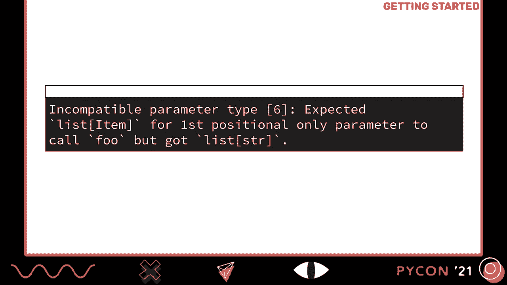
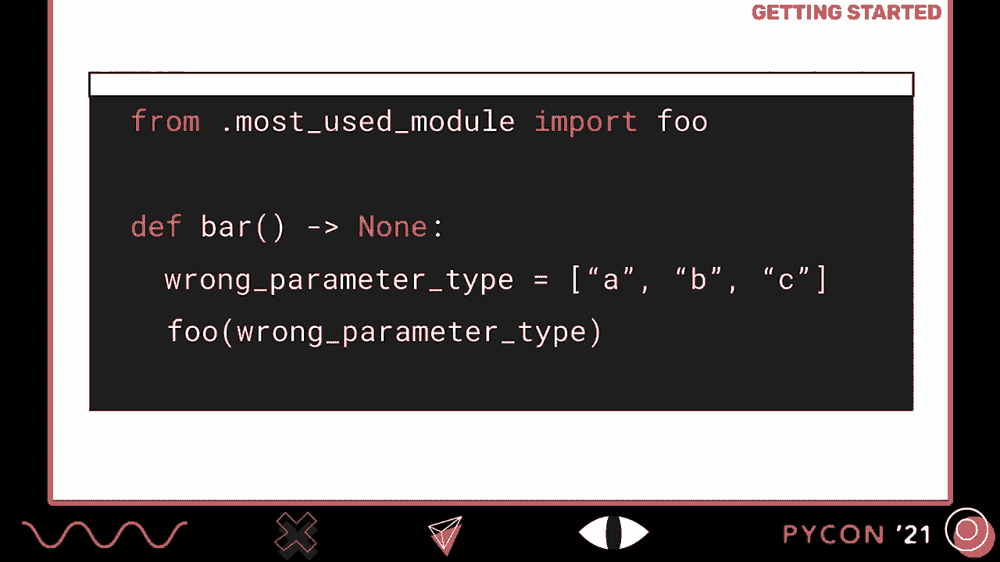
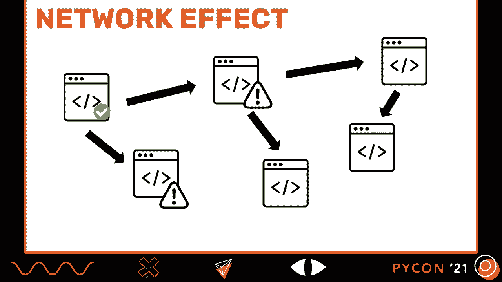
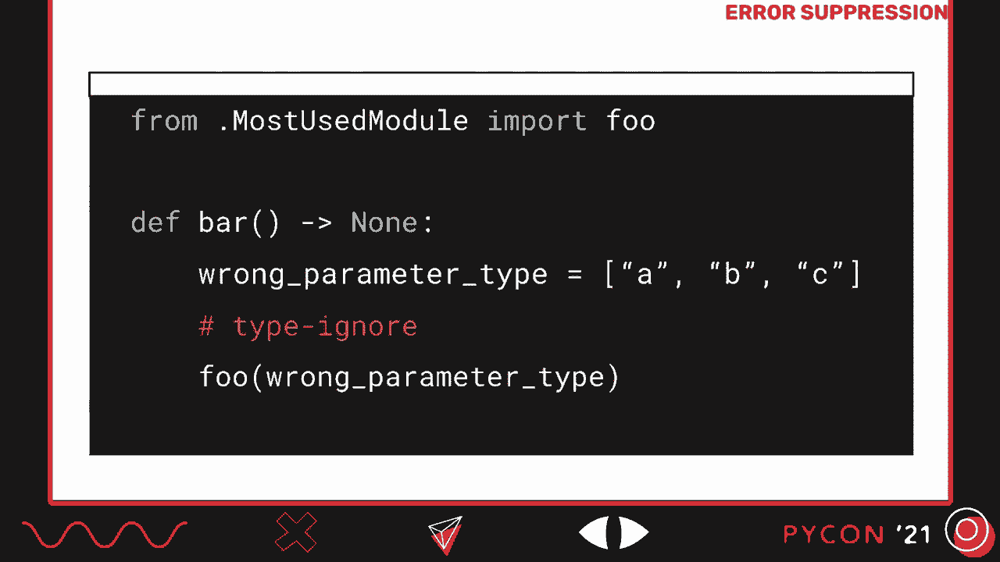
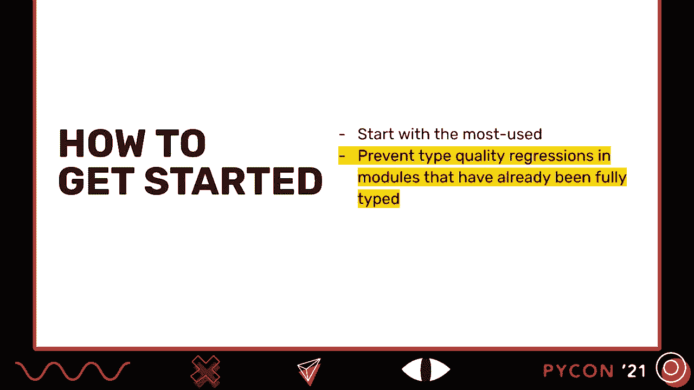
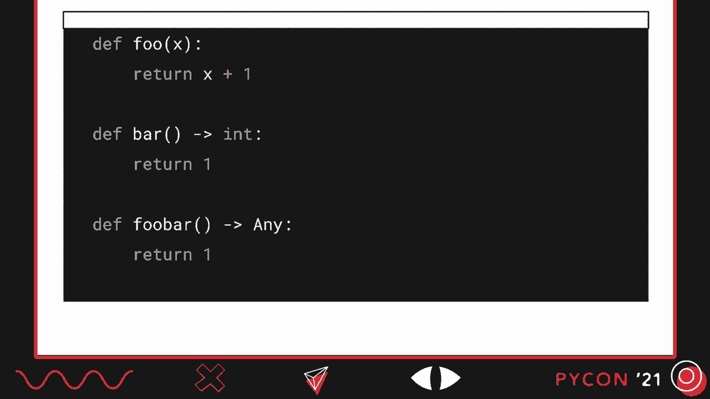
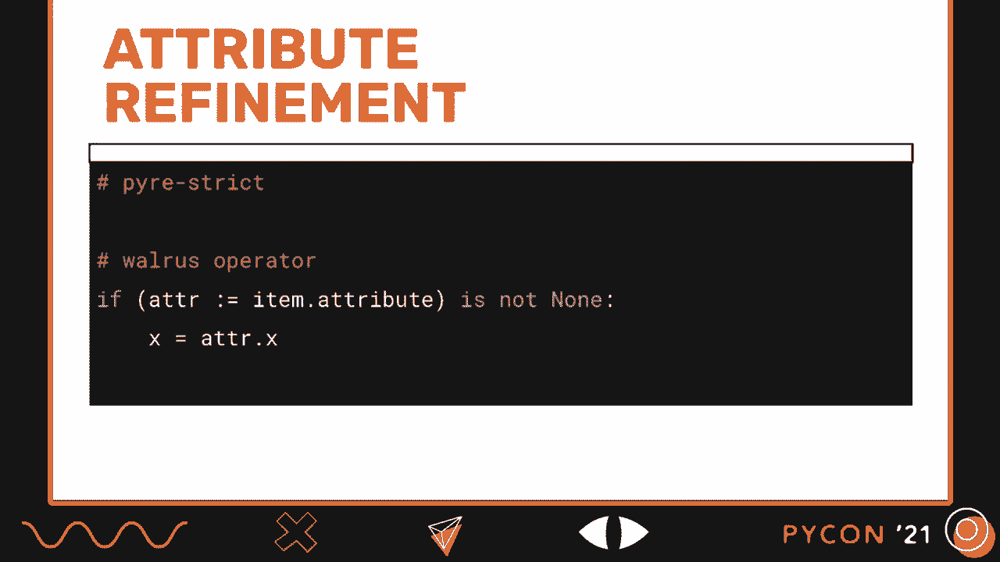
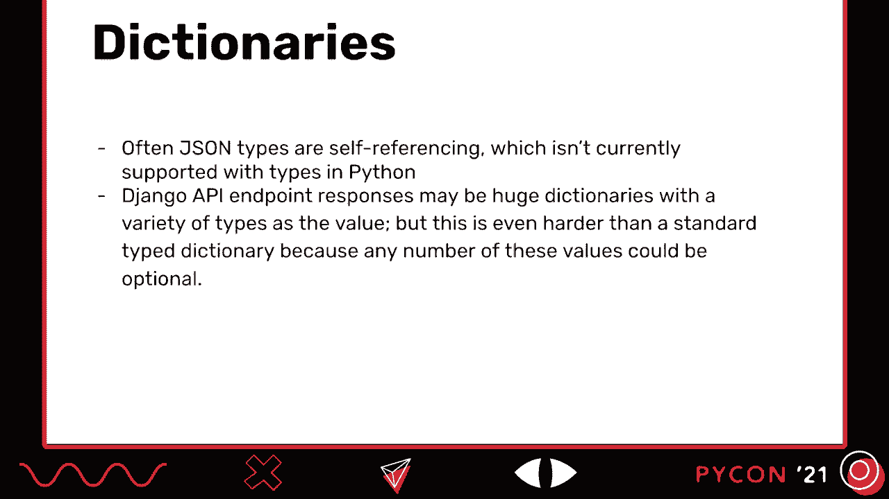
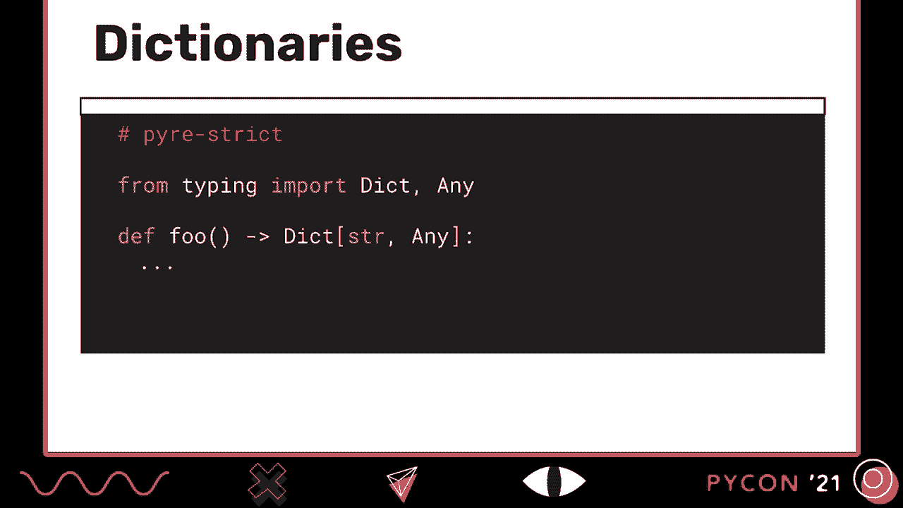
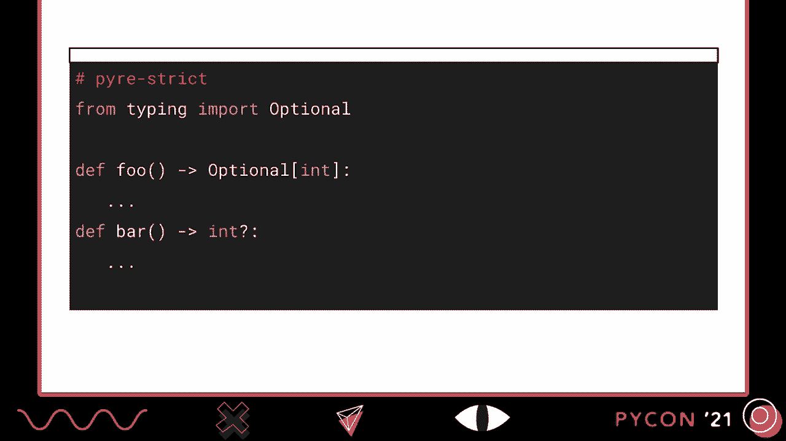

# Python渐进式类型实践：P10：演讲 _ Maggie Moss _ 渐进式类型实践


在本教程中，我们将学习什么是渐进式类型，以及如何在Python项目中实践它。我们将探讨添加类型的好处、使用的工具、具体的实施策略，以及处理复杂代码模式的方法。通过本教程，你将能够开始为自己的Python代码库添加类型，并享受类型安全带来的诸多优势。

## 什么是渐进式类型？ 🧐

上一节我们介绍了本教程的概述，本节中我们来看看渐进式类型的基本概念。

类型可以被视为描述一组具有共同操作的值。例如，`int`类型描述了一组支持加法和减法等操作的数字。当我们尝试对错误类型的值应用某个操作时，就会发生类型错误。

在静态类型语言（如Java、C）中，类型错误在程序运行前就会被编译器捕获。变量、参数、返回类型等都需要明确的类型注解。

在动态类型语言（如Python）中，值有类型，但变量和函数没有。类型检查发生在程序执行期间，这使得处理运行时依赖的类型变得容易，但也可能导致运行时才暴露的类型错误。

渐进式类型系统允许程序的某些部分是动态类型，而其他部分是静态类型。在Python中，只有带注解的函数才会进行类型检查。未注解的函数被假定为可以接受任何类型并返回任何类型（即`Any`类型）。这意味着你可以逐步为代码添加类型，在此过程中持续获得类型检查带来的好处。

## 为什么要在Python中添加类型？ 🤔

上一节我们了解了渐进式类型的概念，本节中我们来看看为Python代码添加类型的具体好处。

假设你正在修复一个在线商店的bug，需要理解一个函数是否会返回`None`。如果函数体复杂，有多个返回路径，手动分析会非常耗时且容易出错。

以下是添加类型注解后的示例：
```python
def get_products(cart: ShoppingCart) -> List[Product]:
    ...
```
通过运行类型检查器，你可以快速发现返回类型不兼容的错误，从而自信地进行代码更改。类型注解提供了以下核心优势：
*   **内置的最新文档**：函数签名清晰地说明了输入和输出的类型。
*   **提前捕获错误**：在代码运行前发现类型不匹配的问题。
*   **简化单元测试**：测试可以更专注于业务逻辑，而非类型错误。
*   **增强IDE支持**：获得更好的代码补全和实时错误提示。
*   **赋能开发工具**：使代码修改工具（如LibCST）和安全分析工具（如Pysa）更强大。

## 如何开始为项目添加类型？ 🚀

上一节我们探讨了添加类型的好处，本节中我们来看看如何迈出第一步。

我们的首要建议是：**为你最常用的模块添加类型注解**。类型覆盖具有网络效应，为核心模块添加类型能最大程度地揭示代码库中的潜在类型错误，从而以最小的投入获得最大的覆盖度。

当你首次添加类型并运行类型检查器时，可能会看到大量来自其他文件的错误。这是因为之前未注解的调用现在与新的具体类型产生了冲突。这是正常现象，表明类型检查器正在工作。

此时，你可能没有时间立即修复所有错误。Python类型系统允许你使用`# type: ignore`注释来暂时抑制特定行的错误。**这应被视为临时解决方案**，目的是为了逐步推进，而非永久忽略问题。



为了方便这一过程，Pyre提供了`pyre-upgrade`工具，可以自动为项目中的所有错误添加或移除`# type: ignore`注释。



## 如何防止类型质量倒退？ 🛡️

上一节我们讨论了如何开始添加类型，本节中我们来看看如何保护已取得的成果。



为了防止已类型化的代码出现倒退（例如有人移除了类型注解），你需要利用类型检查器的严格模式设置。以Pyre为例：



*   **默认模式**：允许函数缺少参数或返回类型注解。带有返回注解的函数会进行类型检查。
*   **严格模式**：要求函数、参数、属性和全局变量都必须有类型注解。显式使用`Any`类型也会报错。

实施策略如下：
1.  开始时将所有文件置于默认模式。
2.  随着你逐步为一个文件添加完整的类型注解，将其切换到严格模式。这能防止他人无意中破坏该文件的类型完整性。
3.  当项目成熟时，可以考虑将严格模式设为新文件的默认模式。

通过跟踪处于严格模式的文件比例，你可以清晰地衡量向完全类型化代码库迈进的进度。





## 推动类型采用的策略与工具 📈


上一节我们介绍了保护类型质量的机制，本节中我们来看看如何有效地在团队中推动类型采用。

在Facebook和Instagram的实践中，我们总结了一些有效策略：

以下是成功推动类型采用的关键步骤：
*   **获取团队认同**：清晰传达类型化代码库的好处。
*   **设定明确目标**：例如“到Q2末，使60%的函数具备返回类型注解”，这比模糊的“添加类型”更有效。
*   **认可与激励**：通过仪表板展示贡献，举办“代码关爱日”等活动。
*   **引导新成员**：让新工程师通过完成类型任务（如修复`# type: ignore`）来熟悉代码库。

为了衡量进展，可以使用`pyre statistics`命令来获取项目的类型覆盖率数据，包括注解数量、严格模式文件比例等。

此外，还可以利用自动化工具来加速这一过程：
*   **Pyre Infer**：静态推断代码类型并自动添加注解。
*   **MonkeyType** / **PyAnnotate**：根据运行时信息（如测试）生成类型注解。

## 处理棘手的代码模式与未来展望 🔮

上一节我们讨论了推广策略，本节中我们来看看实践中常见的挑战和类型系统的未来发展。

在为大型代码库添加类型时，会遇到一些棘手的模式：

**1. 空容器初始化**
```python
# 可能被推断为 List[Any]
items = []
# 推荐的写法
items: List[str] = []
```

**2. 细化可选属性**
```python
# 直接检查可能不够安全
if self.optional_attribute is not None:
    use(self.optional_attribute) # 类型检查器可能仍认为它是可选的
# 更好的做法（Python 3.9+可使用海象运算符）
if (attr := self.optional_attribute) is not None:
    use(attr)
```

**3. 复杂的数据结构**（如来自API响应的字典）
对于结构不清晰或值类型多样的字典，有时使用`Dict[str, Any]`在严格模式下也是一种务实的例外。





Python的类型系统正在不断进化，以提供更优雅的语法：
*   **新的联合类型语法**（Python 3.10）：`int | str` 替代 `Union[int, str]`。
*   **更简洁的可调用对象和字典类型注解**等提案也在讨论中。




## 总结 🎯

本节课中我们一起学习了Python渐进式类型的完整实践路径。



我们了解到，渐进式类型能为项目带来内置文档、减少生产错误等诸多好处。实施的关键在于：先从核心模块入手，利用严格模式保护成果，并通过设定明确目标、利用自动化工具和团队激励来有效推动。同时，Python类型生态的持续发展（如更简洁的语法）将使得这一实践越来越容易。


记住，为目标Python代码库添加类型是一个旅程，而非一次性的任务。通过逐步、系统地应用本教程中的策略，你可以显著提升代码的健壮性和可维护性。