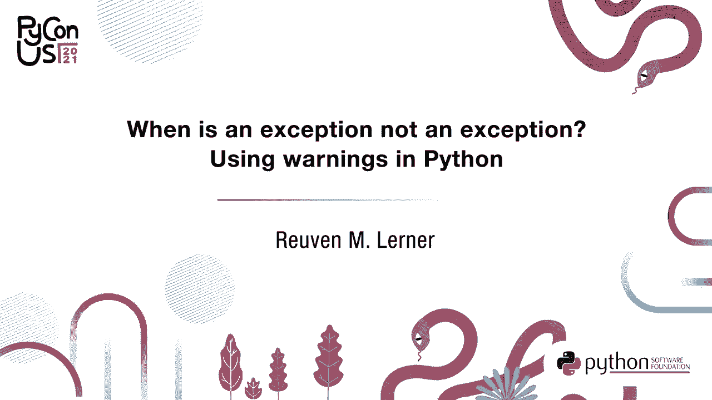
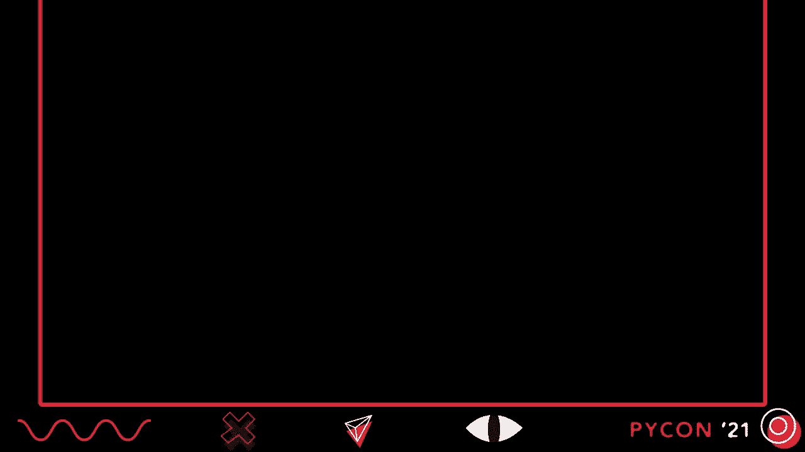
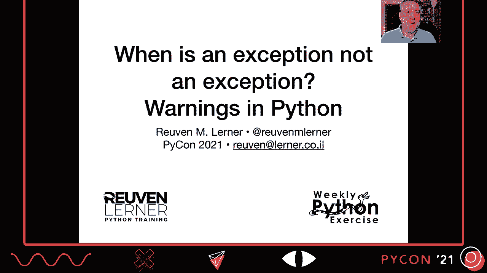
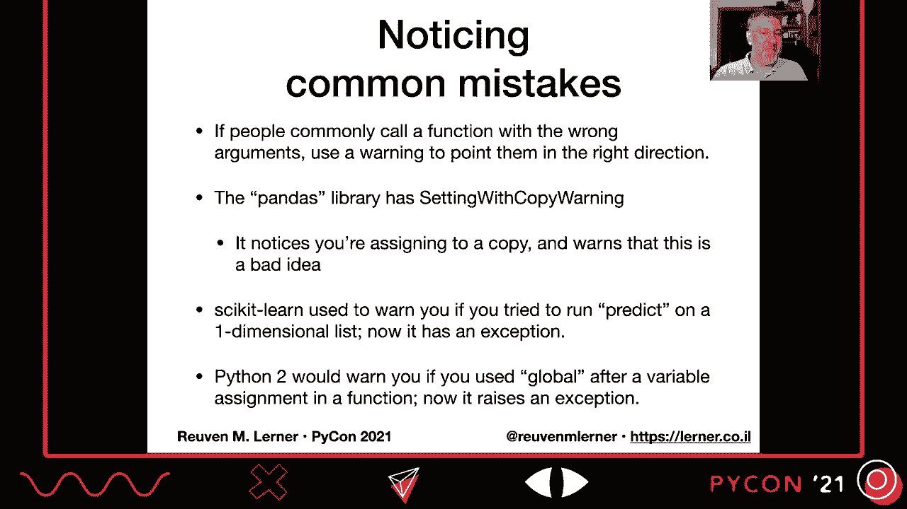

# P14：讨论 _ Reuven M. Lerner _ 何时异常不是异常 _ 使用警告 - VikingDen7 - BV19Q4y197HM

[音乐]。

嗨，我是 Reuben Lerner，欢迎来到我为 Python 2021 的演讲。何时异常不是异常？Python 中的警告。

所以我们先从现实生活中的一个例子开始。你的车，需要汽油。嗯，我们大多数人在车上都需要汽油。而汽油会用完。你真的不想在路上没油。所以你的车有一个燃油表，燃油表从空到满。

当你的车接近空时，你应该去加油。因为再说一次，你不想让它没油。如果你的车接近空，几乎没油，但你没有加油？没错，黄灯亮起。现在，仪表盘上的灯，有时被称为傻瓜灯。

这个灯确实在说，嘿，傻瓜，你真的不想在路边没油。你现在真的应该给车加油。放下你正在做的其他事情，去加油。好吧，这很好，因为车试图阻止我们做一些在我们实际上对自己或车造成伤害之前可能并不危险的事情。

想想在我们的代码中，我们的程序多么频繁地遇到各种非常危险的情况，或者用户将要做一些潜在危险的事情。他们还没有做任何危险的事情，但如果他们坚持这种行为，事情可能会变糟。所以我们需要某种低燃油灯为我们的软件发出警告，就像傻瓜灯一样。

嘿，傻瓜，如果你不尽快改变你的做法，坏事就会发生。而如此低的燃油灯，如此警告，确实需要让人感到恼火。它需要足够持续，以促使我们改变。我们需要说，不要再这样了。我真的应该改变我的做法。但它不应该对程序造成致命影响。

它应该让人恼火，但不应该阻止我们继续进行我们正在做的事情。好吧，这就是我在这里要谈论的。警告和警告在 Python 中已经存在很长时间了。自 2000 年 11 月起，它在 PEP 230 中被引入，并且首次出现在 Python 2.1 中。最初的动机是让 Python 开发者因不当行为而感到足够烦恼。

以便他们改变做事的方式，使其与 Python 3 兼容。当时，Python 核心开发者真的担心人们不会切换到 Python 3。坦率地说，他们有理由担心，考虑到事情的发展以及人们继续使用 Python 2 的时间。

所以他们想做的是说，别这样做，换一种方式。你当然可以通过采用新的最佳实践来消除警告。现在你可能已经看到了一些警告。这里有一个在 Python 3.9 中的警告，这是最新版本。如果你尝试从 collections 导入 mapping，你会收到这个消息。

弃用警告，使用或导入来自 collections 的 ABC，而不是从 collections ABC 导入，自 Python 3.3 起已被弃用。在 3.10 中将停止工作。所以这基本上是在说，看吧，傻瓜，改变你的行为。这也是在说你应该之前注意到这个。

我们真的在试图拯救你自己。因为下次我们发布新的 Python 版本，Python 3.10，你代码中的某些内容将不再有效。不要耗尽油，靠边停车。给你的车加油，或者只需更改导入语句，这实际上非常简单。所以你真的需要警告吗，Python 中不是还有其他机制吗？

那我们可以用什么来代替它们呢？一个就是我们可以使用异常。而异常实际上有很多优点。它们是独立的通信渠道。人们并没有充分认识到这一点。异常不仅仅是不同的，它们为我们提供了一种指示某些东西出错的方法。它们是一种不与赋值混淆的独立沟通方式。

不会和其他任何东西混在一起，我们可以捕获它们。我喜欢将异常看作是一部手机。如果你在和一个好朋友聊天，也许在听到我的例子后，这个朋友就没那么好了。你在和朋友聊天时，手机响了。你会对朋友说。

等一下，让我确认一下，对的，我们大家都是这样做的，对吧？

你接听手机。然后当手机通话结束时，那段对话也结束了。你放下手机，继续和你的朋友交谈。假设他们在你这么无礼之后仍然和你是朋友。嗯，基本上你可以把你的异常和代码看作是一部手机。

你必须接电话。你必须处理它。然后在你处理完之后，你可以回到程序中。所以异常真的很好。此外，我们可以通过名称捕获它们。我们可以区分它们，然后决定是否想要忽略它们。是的。

但是异常并不是我们希望用于这种警告的原因，因为如果你不捕获异常，程序就会结束。这不是崩溃，对吧？

这可能就像崩溃一样，因为程序以未处理的异常退出并不会让任何人感觉更好。这只是意味着我们使用了不同的术语来描述它的退出。现在在一些其他语言中，你必须捕获可能被引发的任何异常。它们必须明确提到，但在 Python 中，任何人可以在任何时间引发任何异常。

为了捕获这类警告，你会有各种等价的接受子句。这对我们来说并不真正奏效。我们可以走到另一个极端。我们可以尝试打印，对吧？为什么不直接打印呢？嘿，这里出了一些问题。问题是，这并不严重或令人害怕。我们希望有些东西能真正震撼人心，让人说。

嘿，你真的应该改变你的行为。另一件事是打印。它可能会和常规程序输出混淆。是的。我们可以开始打印标准错误，但这并不是我们想要的。另一件事是我们无法过滤或捕获打印语句。我想是打印函数，对吧？

你无法过滤屏幕上打印的内容。我们确实需要某种机制。正是警告为我们提供了这种机制。它在异常和打印之间提供了一种东西，我们可以过滤、捕获，甚至重定向到其他地方，以避免它。

被干扰或不干扰我们的代码。那么我们如何使用警告呢？假设我维护一个包含 Python 函数 hello 的模块。我的模块叫 hello，我的函数也叫 hello，它相当简单，对吧？

所以定义 hello 名称并返回 F hello，然后 F 字符串大括号名称。现在我要更改这个函数。我不打算更改所有用户的 API，这并不是最聪明的做法，但没关系。现在我想接受一个输入列表，而不是一个单独的字符串。我该如何通知我的用户，他们应该开始传递一个输入列表而不是单个输入？

字符串？好吧，我要进行这个更改，这个更改将会很剧烈。所以我最好提前警告人们。在它生效之前，这是关于警告的一个非常关键的点，你想提前警告他们，给他们足够的时间做点什么，就像低油灯一样，对吧？

如果你在他们快要耗尽燃料的 30 秒前告诉他们，他们最好做好准备。这并不那么有帮助。那么我们该怎么办呢？

在这个更改生效之前，我们将向函数添加警告。警告看起来是这样的。首先，我必须导入警告。它不在内置模块中。在提案中，他们实际上表示这被考虑过，但他们决定开发者，知道，我们可以处理一点导入。

所以导入警告。然后我将调用函数 warnings.warn。这是我们。这种方式类似于引发异常。这是我们指示出问题的方法。我们在那里传递一个参数，一个字符串，表示我们想向用户显示的消息。那么这如何运作呢？好吧，现在在我的程序中，我要说从 hello 导入 hello。

我将调用 print hello world。当我运行它时，这就是我得到的。这是我们看到的输出。现在，输出被分为几个不同的部分。我们看到在哪个文件中得到了这个警告，以及该文件的哪一行。然后我们看到这是什么类型的警告。你会发现有许多不同类型的警告或类别。

我们可以发出警告。然后是消息，作为第二个参数传递给 warnings.warn 的消息。最后，我们看到确实是这个警告由函数 warnings.warn 引发。这并不奇怪。我们稍后会详细讨论这个。最后，你会看到我们的程序确实运行了。我们没有退出。你知道的。

崩溃没有这样的事情。程序仍然运行。警告只是冒出来，他们在说，嘿，不要忘记我。现在确实，警告的输出是发送到标准错误，而不是标准应用程序。这意味着如果你正在从程序重定向标准应用程序，你仍然会看到。

屏幕上的警告。它将与打印的其他错误一起出现。这是非常好的。当然，你会重定向标准错误。这并不是一件坏事，因为它会，如我所说，和所有其他错误一起显示。所以如果我现在说使用 hello.py 并将其重定向到 hello.txt，我们仍然会看到。

屏幕上的警告是好的。因此，需要记住的是，警告要求你提前计划。你需要提前告知用户他们做错了什么，以及事情将如何崩溃。我们在维护良好的开源项目中看到这一点。他们提前规划，以便能说，好吧，在接下来的两个版本中，这将不再。

将会工作。因此这个版本，下一版本，我们将给他们越来越严厉的警告，告诉他们，嘿，傻瓜，你最好继续说傻瓜，对吧？你想要尊重我们的用户。是的。嘿，用户，我们真的希望你提前计划，考虑正在发生的事情。你要给用户留出过渡的时间。所以真的要考虑一下你是否需要做这样的改变。

你可以提前多长时间发出警告，以及你能提前多长时间告知用户。所以我们之前看到的是发送的用户警告。正如我所说，用户警告是类似于异常类的一个类别，它为我们提供了两个不同的好处，其中之一是语义的力量。作为一个人，我会阅读并说。

哦，这是一个用户警告。我理解它的意思。我知道如何将其与其他类型的警告区分开。但另一个好处是，通过拥有这个类别，这有点像异常类。我可以检测并过滤它。警告系统实际上确实帮助我们实现这一点。顺便说一下。

警告类别是异常类。我怎么知道这一点？好吧。如果我去查看用户警告，问道，你的`dunder`基类是什么，`dunder`基类是如何定义的。一个 Python 类表明它从哪里继承，继承自警告类。好的。所以警告在所有警告中是总体的父类。但随后我去查看警告，问。

嘿，警告，你的基类是什么？它说，哦，我继承自异常。因此，警告是异常，至少在典型意义上，但它们被单独处理，并且有所不同。通常你不会引发警告。尽管我们会看到如果你真的想的话，如何将警告转变为异常。

内置警告类别有很多，对吧？有常规警告。这是父类，如我所说。还有用户警告、弃用警告、语法警告、运行时警告和待弃用警告。所以弃用警告意味着你真的不应该使用这个。

待弃用警告意味着，嘿，不久之后你将不想使用这个。因此，我实际上可以将其作为第二个参数传递给`warnings.warn`。所以当我调用`warnings.warn`时，我将传递一条消息。我会说，我想传递什么类型的警告。这是待弃用警告，因为这算是适当的，对吧？

问题是如果我们实际上运行这段代码，突然间我们的警告不再出现了。它消失了。这是因为弃用警告默认被过滤掉了。所以它不会出现。你必须明确表示你希望它出现。我们稍后将讨论过滤。问题是，正如你可能知道的，在 Python 中。

当你只是编写代码并想要引发异常以指示某些事情出了问题时，你不应该引发内置的异常。这似乎非常诱人，对吧？

我会在这里引发类型错误。我会在那里引发索引错误。但通常来说，引发内置异常是不被赞成的。你应该创建自己的异常类并引发这些异常。再一次，这些给我们额外的语义能力，并允许我们进行更好的过滤。类似地。

创建你自己的自定义警告类别真的是个好主意。现在，你的新警告可能应该从现有类型中继承，以便能够被适当地过滤。但是你可以随意处理。只要你创建一个继承自警告的类，就可以了。那么我们来看看这在这里如何运作。好吧，我要创建我的类，如我所说。

类正在交换警告，继承自用户警告。那么我的类的内容是什么呢？什么也没有。只是路径。为什么？因为我并不想提供任何内容，对吧？

因此，警告作为一个类并不是有用的，我将实例化它，然后调用一个方法。我不需要存储任何额外的状态。我只想能够将它与其他警告区分开来。然后我们可以做的——除了路径，我们还可以将我们的交换警告作为第二个参数传递给 warnings。war。那么，当我们被警告时发生了什么呢？

我们已经看到警告将被发送到标准错误，像消息一样将其打印出来。但我们实际上可以定制特定类别警告的处理方式。这是通过警告过滤器或 Python 的警告过滤器完成的。我们可以指定应该如何处理特定类型的警告，特别是类别。

但是我们不仅可以基于类别进行指定，我们还可以根据消息内容、引发的模块以及许多其他因素进行过滤。现在，默认过滤器就是，如果你什么都不做，Python 默认会在给定文件的特定行第一次出现时打印警告。

因此，如果你多次遇到相同的调用警告。war，那么你只会看到一条消息。但是，如果相同的警告出现在代码的多个地方，你会看到多条消息。让我们看看这将如何工作。因此，我现在将在我的程序中调用 hello 两次，在我的使用 hello 中。

我将说 hello world 一和 hello world 二。如果我只说使用 hello。py，看看。即使你看到我们输出了两次，我们也只会收到一次警告。因此，我们确实调用了这个函数两次，但由于 Python 对这种警告的默认行为，只会警告我们一次。等等，hello。py 九。好的。

比如我可以看到警告是在哪里引发的。它是由警告引发的，这很明显吗？我们难道不知道警告是由警告引发的，这没有给我们添加任何有用的信息。但当我们调用那个时候，我们实际上可以传递一个栈级别。这个栈级别是一个整数，表示应该传递哪个函数的消息。那么要回溯多少呢？

我们应该回溯多少个栈帧以提取关于函数的信息并在标准输出上打印出来。因此，默认的栈级别等于一。我的意思是，调用警告本身的警告，你将看到它们在第几行被调用。

但通常来说，栈级别等于二。所以你将看到是谁调用了生成警告的东西。实际上，如果我调用我们的交换警告，逗号二。现在我们将看到 hello 的调用触发了它，而不是 warnings 的调用。

警告。而且，如果我调用 use hello.py，我们将看到现在是新的 solo.py。第 5 行，它将说，嘿，当你调用 hello 时发生了这一点。这样多次会更加有用。好吧，回到我们的过滤器。当 Python 遇到警告时，实际上可以采取六种不同的操作。

我们可以选择这些中的哪些。因此我们可以说总是，意味着无论警告被引发多少次，我们都想打印出来。另一个选项是忽略。我不需要这个警告。我对此不在乎。对我来说不重要。而另一个方向的选项是错误，意味着将其转化为异常。这就是将警告作为异常子类的优势。

Python 可以立即处理它。如果你想非常严格，你可以直接说总是引发异常，对所有内容产生错误。例如，假设我们希望每次发生交换警告时都显示它，无论如何。所以每次总是进行的操作。那么我怎么说这个警告应该总是显示，无论选择多少次？

好吧，如果我想从命令行，它可以传递大写 W 选项，那个开关有一个参数，而那个参数就是我们想要的操作。因此我可以说大写 W 总是。顺便说一下，每个操作以不同的字母开头。所以你可以缩写为大写 W 小写 a。因此如果我现在说 Python 3 大写 W 总是使用 hello 2。

py，对吧？所以现在它将显示两次，我们调用 hello world 的两次。它会告诉我，嗯，我只说它的堆栈级别为 1。所以它将向我们显示警告，而最终那是可以的。现在问题是你可以用很多不同的方式进行过滤。

我们已经看到如何根据操作进行过滤，但你也可以根据消息进行过滤，并且有一个不区分大小写的消息开头的正则表达式匹配。我知道这听起来很复杂，但基本上我们可以使用正则表达式来匹配消息的开头。你可以根据类别进行过滤。

你可以根据我们有警告的模块名称进行过滤。你也可以根据行号进行过滤。所以你可以说我想过滤。我想为这个类别、这个消息、这个模块和这个行号提供这个操作。问题是如果你想为多种类别传递多种操作，你只需要。

传递大写 W 多次。例如，如果我想给出弃用警告，但不需要其他任何内容，并且总是采取行动，不论消息如何，我可以说大写 W 操作：：：双冒号。这意味着我要忽略消息弃用警告。如果我想让这些弃用警告可见，但仅当消息以...开头。

而且我应该再次添加，忽略大小写。所以我会在这两个代码之间放一个 A。如果我想生成 Unicode 警告。每当我发出 Unicode 警告，将其转为异常时，我会说减号大写 W 错误：：Unicode 警告。默认情况下，警告系统是这样工作的。

这些是设置的过滤器。它显示弃用警告，主有默认设置。但我们将忽略一般的弃用警告，你可以看到你可以设置过滤器以在同一警告类别上工作，但可以对不同的匹配使用不同的操作。现在，为什么他们会这么做？弃用警告难道不重要吗？

我们不想知道它们吗？答案当然是，有和没有。我们希望知道我们自己代码和正在运行的程序中的弃用警告。但如果我导入一个模块，而那个模块没有更新并给我一个弃用警告。我真的想看到别人代码的警告吗？可能不想。

如果你曾经遇到过这样的情况，当你导入某些内容时，有些警告会淹没你，你知道这有多烦人。因为你不可能去维护别人的代码。而且你却在承受后果，因为他们没有维护它。

这就是为什么弃用警告传统上被忽略，除非它不会保持，因为那是你的错。我们还将忽略待处理的弃用警告、导入警告和资源警告。当然，你可以更改所有这些，但这些是默认设置。现在，还有另一种选择，你可以设置 Python 警告环境变量。

所以我们可以说 Python 警告等于 e 弃用警告和 d 资源警告。因此我们可以做所有这些事情。现在的问题是你不能使用我们刚才看到的内容。你不能使用减号大写 W 开关或 Python 警告的环境变量。你不能为自定义警告类别这么做。这是因为我们的自定义警告类别是在代码中定义的类。

而且因为这些警告开关在我们的代码加载和运行之前完成，它就是。无法知道这件事。问题是我们可以从 Python 内部做这件事，还有一些不同的函数我们可以调用。有过滤警告的警告，五种不同的过滤元素。不过很多时候你可能不想这么做。因此对于我们这样的人。

像道德人一样，他们会有简单的过滤器，然后仅指定操作。类别行号。然后还有重置警告。如果你有一部分代码真的希望以某种方式使用警告，并且想稍后更改过滤器，只需执行重置过滤器，重置警告。

他们会这样做。这是一个如何在代码中做到这一点的示例。所以我将导入警告，然后从 hello 导入 hello，并交换警告。我将导入一个自定义类别。现在我可以为我的自定义类别设置过滤器。

我要说的是，为此设置默认值。当我调用 hello world 一和 low world 二时将没问题。你甚至可以使用上下文管理器来捕获警告。如果你想暂时仅对一段简单代码更改过滤器。那么我们可以关闭所有警告，如果我调用某个表现不佳的函数。对吧。

我知道这会导致警告，但我不在乎。所以我只需用警告捕获警告，然后将简单过滤器设置为忽略。我将忽略一切。就像我四处走动时，嗯，没看到任何问题，那应该就没有问题，调用表现不佳的函数。那么我们应该在哪里使用警告？拥有这些是非常不错的，你知道的。

我们可以使用的技术，但应该在哪里使用呢？一个例子是，如果你有一个模块，人们在使用，而它要消失或其 API 要改变。如果你在理解这些变化，你可以在模块的顶部放置警告。记住。

记住，模块在被导入时会被执行。现在，通常我不喜欢在模块中放置可执行代码或至少打印东西。但这是个例外。其实并不是例外，而是警告。好吧，但我喜欢。记住，弃用警告默认是被忽略的。

所以你可能想要改变这个，或者你可能想明白也许不应该为使用你模块的其他人打开警告。你需要弄清楚你想怎么做。但再一次，你想在为时已晚之前告知人们。另一个很好的做法是如果你注意到常见错误。

所以人们常常因为使用了错误的参数而调用函数。使用警告来引导他们走向正确的方向。因此，如果你有一个函数，人们总是用一个整数调用，而你真正期望的是一个字符串，你可以对此发出警告。这可能会很有帮助。

在 PANDAS 中最著名的警告是“设置副本警告”。这基本上发生在你使用双方括号时。你试图在数据框上设置数据。问题是你并没有在那个数据框上设置，而是在第二组方括号返回的对象上设置。

所以很多人犯这个错误。因此 PANDAS 在全世界不断发出这些设置副本警告。很多人。我怎么知道这发生得很频繁？因为如果你查看 Stack Overflow，满是人们抱怨设置副本警告，我们该怎么办？

所以与其让人们犯这些错误，PANDAS 说，“嘿，这是一个警告。”。甚至在警告文本中给你提供 PANDAS 文档的 URL，你可以在那里解决问题。Scikit-learn 曾经会警告你，如果你试图在一维列表或数组上运行预测。现在它是一个异常。因此，他们试图让人们摆脱不良行为。

还有 Python 2，我希望你没有在使用它，在一个函数内部，如果你在已经赋值给一个变量后使用 global 语句，那么这个变量会给你一个警告。现在它会引发一个异常。我想这就是一个例子，某种程度上回到了 Python 2 的起点。

尝试警告我们一些在 Python 3 中无法工作的不良行为。

说到回到开始，记得我们的燃油表吗？作为车的司机，车的拥有者，你应该注意当你燃油不足时。如果你没有注意到，那么你会看到黄灯，这就像在尖叫，“嘿，你真的应该做点什么。”，但是如果你忽略了黄灯？猜猜会发生什么？还有另一个警告会启动。

很多哔哔声。很多哔哔声告诉你，“听着，你没有注意到燃油表。你没有注意到黄灯。是时候加油了，否则你就会被困在路边。”，对你的用户要友好。给他们警告。建议他们如何改进，他们会感谢你的。

如果你有任何问题或意见，我很乐意听取。如果你愿意，可以随时给我发邮件，你可以在 Twitter 上找到我，访问我的网站，了解我的课程、书籍和企业培训。你还可以注册我的更好开发者每周免费邮件列表。全球大约有 20,000 名其他 Python 开发者会收到关于 Python 的文章。

每周帮助他们提高流利度。非常感谢你来听我的演讲，我真的希望明年在盐湖城的 Python 2022 见到你。非常感谢。[沉默]。

[沉默]，[沉默]，[沉默]，[沉默]，[沉默]，[沉默]，（沉默）。

