# P15：演讲 _ Sebastiaan Zeeff _ _self_ 的魔法 _ 如何在方法中插入 _self_ - VikingDen7 - BV19Q4y197HM

大家好，让我们谈谈 Python 中的魔法，因为 Python 中有很多魔法。

Python 具有层层叠叠的魔法抽象和功能，使其成为如此高层次的编程语言。实际上，最近一些人开始抱怨语言中添加了太多的魔法。对此，Hido Verusum 在推特上回应说，Python 中一直存在很多魔法。

从一开始，它就在这里默默地帮助我们，Python 用户。这是真的。这种魔法旨在帮助你我专注于代码的业务逻辑，关注我们实际想做的事情，而不是我们否则需要处理的低级细节。同时，使用“魔法”这个词让人感觉我们无望能理解它。

理解这种魔法背后的机制。我们只需要习惯于事实，那就是事情是为我们完成的，而我们从未希望能真正理解它是如何发生的，甚至如何创造自己的魔法。在这次演讲中，我希望向你展示这并不真实。许多魔法是你我都可以表演的那种魔法。为此，我们将研究我认为在 Python 中最神奇的事物之一。

self 的插入到方法中。为此，我们将会遇到一种叫做描述符协议的东西。但是，在深入探讨 self 之前，我想简要介绍一下我自己。我的名字是 Westian。我 35 岁，住在荷兰。我喜欢弹吉他，这在这次演讲中你会注意到。

我还喜欢和女朋友玩桌游或者散步。我在 Ordina 担任 Python 开发者，Ordina 是一家位于荷兰的咨询公司。我在这里工作不久，大约六个月左右，但到目前为止我真的很喜欢。这里有一个非常强大的 Python 团队，我总是从与其他优秀开发者的合作中学到最多。

我也是 Python Discord 的三位创始人之一，这是一个在线 Python 爱好者社区。我们主要关注 Python 教育和讨论，但我们也组织与 Python 相关的活动。此外，由于我们有很多积极的志愿者，我们还努力帮助其他组织。

在 Python 生态系统中。想想像 PSF、Pyweek 或各种 Python 大会这样的组织。我还想提到的最后一件事是，我也是欧洲 Python 的志愿者。我之所以特别提到欧洲 Python，是因为今年将是欧洲 Python 的 20 周年纪念版。

由于这个活动在线举行，我们正在尝试适应不同的时区，因此参加这个周年版应该非常简单。所以你可能想去看看。无论如何，关于我就够了。让我们谈谈 self。在谈论 Python 中的 self 时，我认为首先回到基础是很重要的。

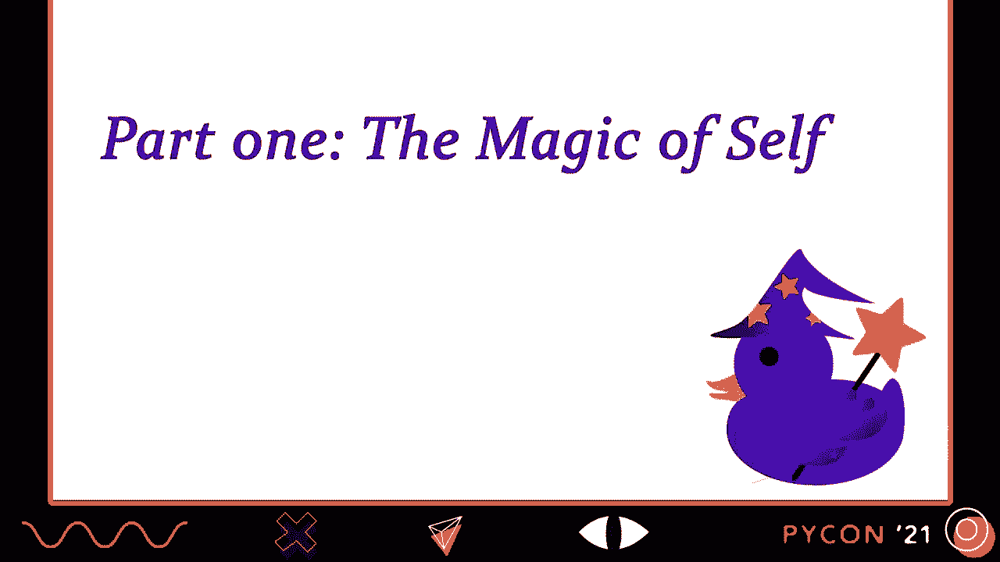

这样做的原因之一是容易习惯于 self。以至于不再注意发生的魔力，尤其是如果你已经在 Python 中编程一段时间了。我还想回到基础，以确保我们在同一页上，无论我们可能有何种经验水平。

我将通过创建一个简单的吉他类来做到这一点，这样我可以用它来跟踪我多年来收集的所有吉他。如你所见，这非常简单。你可以给吉他起一个名字，构造方法将把属性 name 分配给你给它的名字。就这些了。对于那些对类不熟悉的人。

这意味着我们现在可以创建单独的吉他实例。在这个例子中，我正在为我最喜欢的低音吉他，Warwick streamer，创建一个实例。创建实例后，我们可以查找该名称属性，并看到它确实被分配给了我给吉他起的名字。

这显然还不是很有趣，所以我打算添加一个方法。这个新方法 play note 期望一个参数，即吉他应该演奏的音符，然后它会打印一个简单的信息，说明吉他正在演奏那个音符。所以当我像这样调用这个方法，并给它一个音乐音符 C#作为参数时，Python 会打印我的 Warwick streamer。

演奏音符 C#。虽然这本身看起来并没有什么魔力，但这里有一些有趣的事情。如果你仔细查看 play note 方法的函数定义和参数列表，你会看到函数期望两个参数：self 和 note。但如果你再看看我是如何调用这个方法的，你会发现我只给了它一个参数。

音符 C#。显然 C#被作为参数 note 使用，但这个值来自哪里呢？这就是 self 的魔力。当你像这样调用一个方法时，Python 会负责为你插入实例。但 Python 所做的是，它插入了我们所调用的具体吉他 Warwick。

方法作为函数的第一个参数。要理解这个特殊的魔力，我们需要看看方法是什么以及它们如何运作。

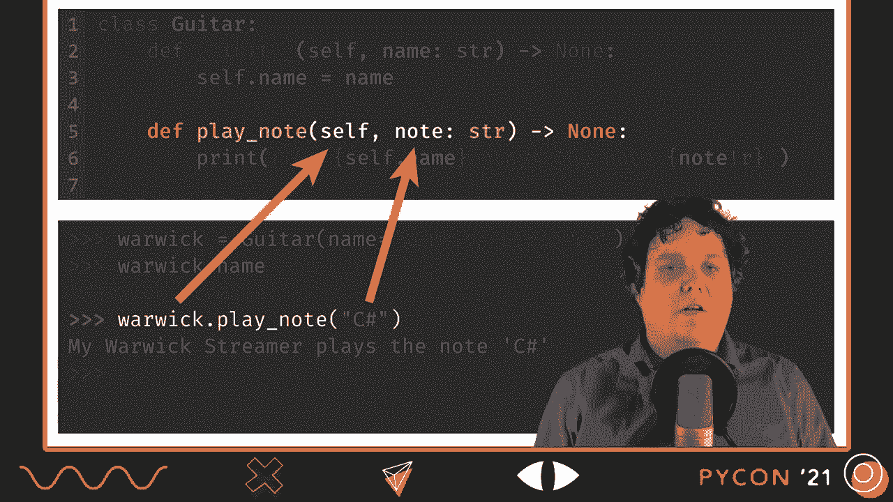

与函数相关。

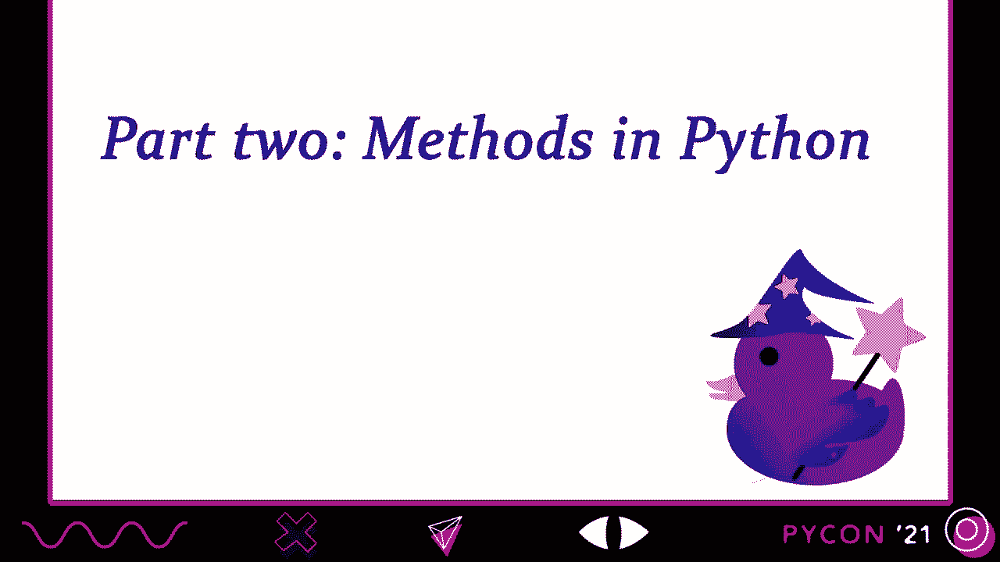

要查看方法是什么以及它们与普通函数的关系，我们需要看看定义带有方法的类时会发生什么。这就是我将讨论 Python 在读取吉他类定义时所做的原因。由于 Python 中的每个东西都是对象，包括类。

我们知道的是，我们最终会得到一个类对象，一个类型的实例，以表示吉他类。我画了这个框来表示那个类对象。现在让我们放大看看当 Python 读取 plain note 方法的定义时发生了什么。有些人认为因为这个函数定义语句，death plain note 等等。

位于类的主体内，这意味着我们在这里创建了一种特殊的对象，方法对象。但事实并非如此。这只是一个普通的函数定义语句，就像你在类外使用的那样。因此，当 Python 读取这个函数定义语句时，它将创建一个普通的函数。

内存中的对象。这里没有什么特别的事情。但重要的是，函数定义语句也给函数对象分配了一个名称。这显然是有意义的，因为我们需要一个名称来能够在后面引用那个对象。既然我们在类中定义了某些内容。

这个名称将在该类的命名空间内被赋值。更具体地说，我们将把吉他类的一个属性 plain note 赋值给内存中的函数对象。这是拼图的重要第一部分。我们将类属性赋值给了函数对象。所以简而言之。

通过在类中定义一个函数，你并没有创建一种特殊的对象。你只是创建了一个普通的函数。但重要的是，它将类属性分配给函数。当我们尝试获取时，我们将发现这为什么重要。

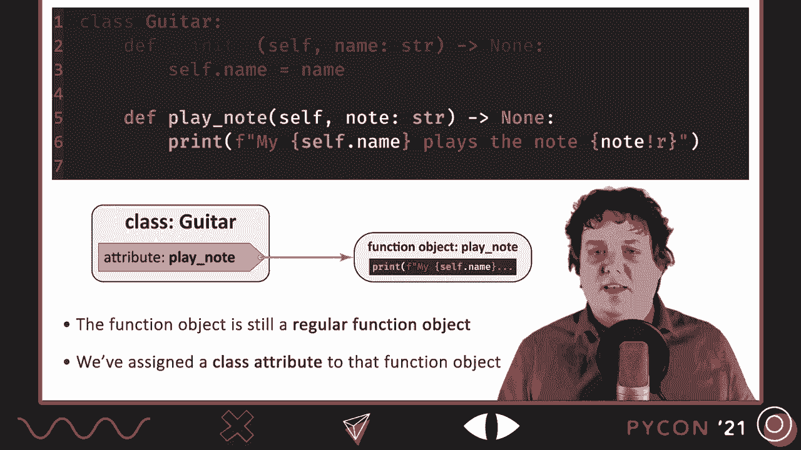

使用属性来访问该函数。好吧，让我打开我的 Python shell，演示当你访问时发生的魔法。

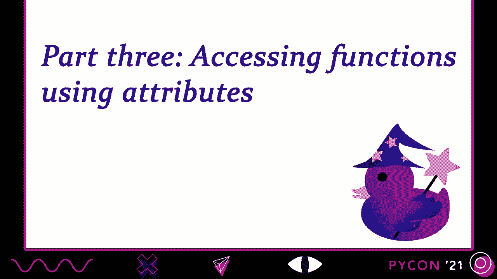

使用属性访问函数。首先，我将通过类属性访问函数。guitar.plainnote。当我按下回车时，你会看到这只返回函数本身。现在还没有任何特别的魔法。但在 Python 中，这并不是访问类属性的唯一方法。

你也可以使用类的实例访问它们。这就是我将重新创建我的 Warwick 实例的原因。然后。我将把类属性 playnote 作为该实例的属性来访问。现在。如果你想想，这有点奇怪。我的 Warwick 实例甚至没有名为 playnote 的属性。

这是类的一个属性。但正如我们将很快看到的，这样也能正常工作。大致发生的情况是，Python 在 Warwick 实例上查找属性 playnote，当它找不到时，它会继续查找类。实际的查找顺序要复杂一些，但大致上就是这样发生的。

这正是我们现在需要的细节。好吧，让我们按下回车键，看看会得到什么。好吧，成功了。但这里也发生了一些有趣的事情。我们现在得到的不是原始函数对象，而是被称为绑定方法的东西。这正是魔法发生的地方。当你在 Python 中查找属性时。

你并不是直接查找这些属性，仿佛它们是标签。你实际上可以通过使用称为描述符协议的东西来挂钩这个查找过程。而 Python 的函数使用这个描述符协议，在你使用实例访问该函数时，将实例绑定到方法上。因此，在这种情况下。

既然我们将方法作为 Warwick 实例的属性访问，Warwick 实例就被绑定到该函数，以创建一种称为绑定方法的东西。在这个绑定方法中，Warwick 已经作为第一个位置参数插入，这个参数最终将成为 self。因此，这就是为什么你不再需要自己插入实例的原因。

每当你使用一个绑定方法时，实例已经为你插入了。好吧，现在。既然我不是魔术师，我要通过引入描述符协议来揭示这段魔法背后的窍门。请注意，这不会是对整个协议的深入讨论，但至少可以让你体验一下它是如何工作的。

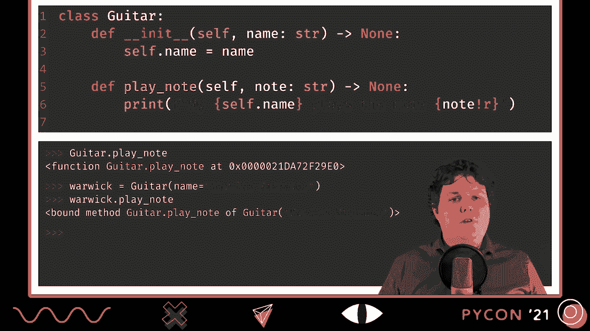

好吧，让我们谈谈描述符。当我第一次听到这个术语时，我觉得它听起来相当困难。至少，这个术语的意思和描述符的作用对我来说并不是很明显。现在我已经使用描述符一段时间了，我仍然认为它们不是 Python 中最容易学习的东西。确实有很多细节需要学习，Python 的设计原则也需要掌握。

你想要有效地使用它们。与此同时，我认为理解描述符的大致概念并不难。这正是我现在要关注的内容。我想给你一个关于描述符的粗略概念，并仅关注我们需要理解的部分。所以，什么是描述符？

描述符是修改我们在 Python 中与属性交互时发生的事情的对象。更具体地说，描述符可以自定义我们如何查找属性、如何赋值给属性以及如何删除属性。描述符通过实现描述符协议来完成这一点。描述符可以实现三个特殊的双下划线方法。

第一个是 dunder get 方法，它可以用来自定义当你获取或查找属性时发生的事情。第二个是 dunder set 方法。它允许你修改当你将某些东西分配给属性时发生的事情，就像我们在这里将某些东西分配给 play note。最后，还有 dunder delete 方法。

除非名称暗示，否则它允许你自定义当有人尝试删除属性时发生的事情。正如你可能已经猜到的，Python 中的所有函数都是这样的描述符。现在，描述符不必实现所有三个方法，实际上。

函数仅实现其中之一，即 dunder get 方法。因此，我们将重点关注接下来的讲座中的 dunder get 方法。我们将从实现一个我们自己的 dunder get 方法的描述符开始。

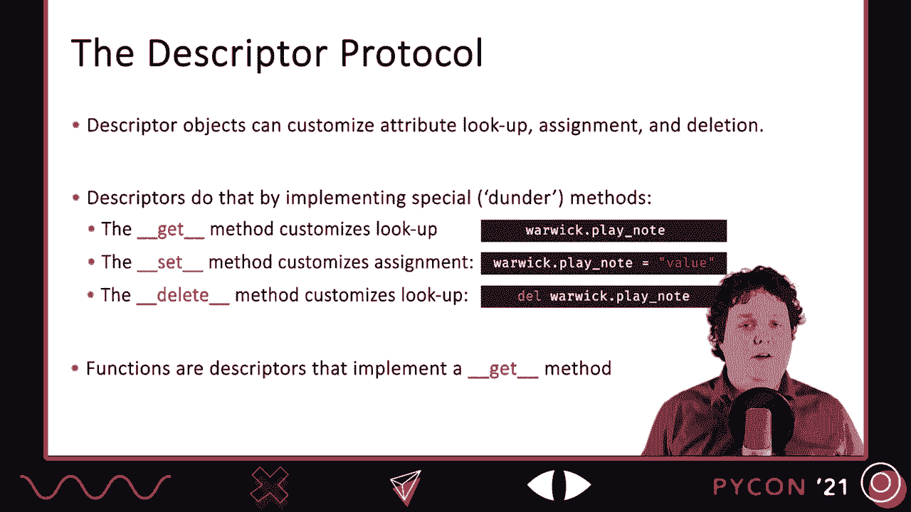

我想实现的描述符是一个可以帮助我识别我最喜欢的吉他。目标是我可以创建一个名为 is my favorite 的类属性，将其分配给我的描述符。我们称之为 favorite descriptor。然后当我在吉他实例上访问该属性时，它会告诉我该实例是否是我最喜欢的吉他。

这不会做任何复杂的事情。它只是将吉他的名称属性与 Warick streamer 进行比较。那是我目前最喜欢的吉他。因此，如果我创建一个名称为 Warick streamer 的吉他实例，就像这样，然后打印 Warick.dot is my favorite，我们应该看到 true。作为一个反例，如果我为我的 fender jazz bass 创建一个实例，然后打印 fender.dot is my favorite。

它应该打印球。这就是全部。它不会是可配置的，也不会有选项。它只是会检查静态名称 Warick streamer。这是为了方便演示。现在，有些人可能会想，为什么我不直接使用属性，这是通常的做法。但这里的目标是手动实现一个描述符。

属性在底层也使用描述符协议。但这里的重点是向你展示 get 方法是如何工作的，而不是展示最佳和最典型的做法。因此，我们将在这里手动实现它。要编写描述符，你只需编写一个类并实现所需的描述符方法。在我们的例子中，我们只想在访问属性时执行某些操作，所以我们只需要实现 done 或 get 方法。在这里我们不需要做其他任何事情。done 或 get 方法有三个参数，self、instance 和 owner。

instance 参数将接收你访问属性的实例。在我们上面的例子中，我们在 fender 实例上访问属性，所以 instance 将接收 fender。owner 参数将接收拥有该属性的类。在我们的案例中，由于它是我的最爱，它是类 guitar 的一个属性，我们将。

我们在 `done` 或 `get` 方法中需要做的第一件事是考虑到实例为 none 的可能性。这可能在你直接在类上访问描述符时发生，比如 `class.isMyFavorite`。然后显然还没有实例，因此实例将是 none。处理这个问题的一种常见方法是检查实例是否为 none，然后简单地返回。

描述符本身通过返回 self。这也是 Python 3 中函数所做的。一旦我们通过那个 `if` 块，我们知道我们正在处理一个实例，我们可以简单地将实例的名称属性与 Warick 的颤音进行比较并返回结果。显然，这里还有几种方法可以改善代码，比如不只是简单地假设 `get guitar` 是 `owner` 的值。

实例将始终具有一个名称属性，但这对于我们的演示来说是可以的。我想做的最后一件事是展示描述符的实际操作。所以首先，我为我的 Warick 的颤音创建一个实例，然后当我访问 `isMyFavorite` 属性时，你会看到它返回 true。如果我反过来做，所以如果我为我的 Fender 创建一个实例。

基于 js 的，并且我随后访问该属性时，你会看到它返回 false。现在，为了测试第一个 `if` 块，我们也可以看看当我们直接在类上访问属性时会发生什么。所以 `guitar.isMyFavorite`，我们看到它只返回描述符本身。好吧，现在我们已经看到描述符的一个实现，我们已经看到了一个实现。

对于 `done` 或 `get` 方法，我认为是时候查看函数的实现了。

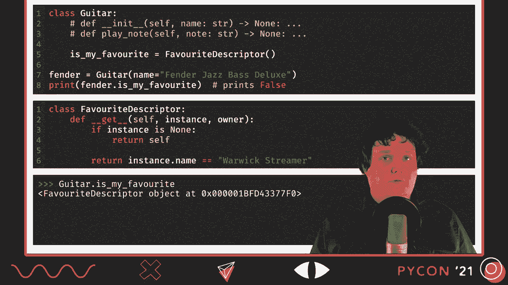

在 Python 中。因此，这是函数的 `get` 方法的实现，或者至少是 Python 版本的实现。

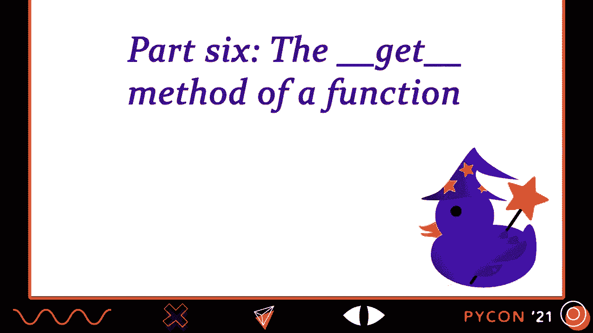

因为原始版本是用 C 编写的。不过，这个 Python 版本大致相当。C 版本需要额外处理引用计数，因为它在较低级别上操作。它所做的相当简单。它会首先检查实例是否为 none。如果是，它将只返回函数本身。

这不会生成一个绑定方法。现在，记住，当你通过类属性而不是实例属性访问描述符时，这种情况就会发生。这意味着，如果我执行 `guitar.play`，我只是在返回函数本身，而不是一个绑定方法。这显然是有道理的，因为还没有实例。这里还没有什么可以绑定的。

这确实强调了要点。我们也可以手动调用 `get` 方法，将实例设置为 none。如果我执行 `guitar.play`，这会给我函数，然后我添加调用 `get`，得到 none 的 `guitar`。我应该得到函数的返回。是的，我们得到了。所以，如果实例是 none，我们只会得到函数返回。如果实例不是 none。

我们将通过那个 if 语句，然后我们实际上会创建一个绑定方法并返回它。我们可以看到，首先创建一个吉他实例，我的 Warwick 在这里，然后通过手动调用 get 方法，现在提供 Warwick 而不是 none。正如你所看到的。

现在我们得到的是一个绑定方法，而不是函数。这确实是 self 的魔力。当你将它们作为属性获取时，函数是绑定实例的描述符。

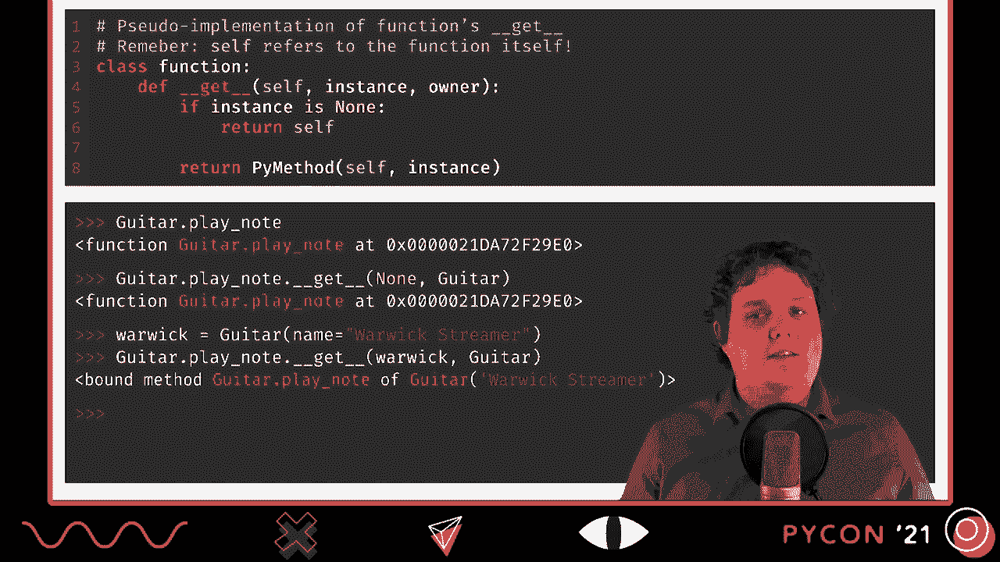

这是一个实例。Python 内置了一些与方法相关的描述符。你可能已经相当熟悉这一点。一个很好的例子是类方法描述符。它通常用作装饰器，装饰一个方法，如下面的示例。它的作用是将函数包装在类方法对象中，以提供替代。

他们的 get 方法。这样做后，他们的 get 方法也会创建一个绑定方法，但它将函数绑定到类而不是实例。无论你是直接在类上访问还是在实例上访问，这种情况都会发生。你总是会得到一个绑定到类的方法。类似地，还有一个静态方法类，通常也用作装饰器。

请看下面的示例。它也包装了函数，提供一个替代的 get 方法，但这一次总是返回函数本身，而不绑定任何东西。因此，无论你是直接在类上访问静态方法对象，还是在类的实例上访问，你总是会得到原始函数，而不是绑定方法。

我想提到的最后一个装饰器是属性类。这也是通常用作装饰器，但正如我提到的所有装饰器一样，你并不一定需要使用这个装饰器。如前所述，属性允许你非常轻松地为属性添加 getter、setter 和删除器。

属性的一个有趣方面是，它们允许你在项目生命周期的后期实现这样的 getter 和 setter，而无需更改属性的公共接口。这意味着你可以一开始直接暴露属性，而只有在实际需要自定义查找和赋值逻辑时，才需要添加 getter 和 setter。

这是 Python 属性的一个重大优势，是其他语言所没有的。好了，我们快到这个讲座的尾声了。希望你们喜欢这个内容。总结一下，我们看到了描述符协议如何允许你自定义 Python 中属性的工作方式。它们让你在访问或删除属性时在后台做一些酷炫的事情。

函数就是这样的描述符，这是 self 背后的魔法。每当你将函数作为方法访问时，描述符魔法就会启动，为你插入实例，所以你不必这样做。我们在 Python 中见过一些其他很酷的描述符，它们允许你影响方法的行为。比如属性、类方法和静态方法，它们都围绕着函数展开。

对象提供了一个自定义的 done-and-all-get 方法，其行为不同。这些工具都非常强大，让你能专注于其他事情，而不必担心它们是如何在底层工作的。同时，我跳过了很多与描述符相关的内容。

虽然我提到过它们，但我并没有解释 done-their-set 和 done-their-delete 方法是如何工作的，以及它们与 done-their-get 方法的不同。这是一个有趣的话题，但也许是将来另一次演讲的内容。谁知道呢？

然后是数据描述符与非数据描述符之间的区别。或者如《流利的 Python》所称，重写描述符与非重写描述符。这与实例属性与类属性的特定查找顺序有关，但这是你需要理解的一件事。我认为用书本或好的教程以及你的编辑器学习这个区别要好得多。

另一方面。我个人强烈推荐一本关于 Python 的书。我认为这本书的新版本将在未来几个月内发布，所以一定要抓紧时间买一本。另外，Raymond Hettinger 在 Python 文档中写了一篇非常好的教程，Real Python 也有很多相关资源。最后。

还有一个方便的方法叫做“done-their-set name”，它常常与描述符方法一起使用。你或许可以找时间查一下。我想用李·C·盖尔（Lee C. Gell），一位魔术师的话来结束这次演讲。“我在写一本关于魔法的书，”我解释道。而我被问到“真正的魔法？”

人们提到奇迹、魔术行为和超自然力量。现在我回答的是变戏法，而不是现实中的魔法。换句话说，真正的魔法指的是不真实的魔法，而实际上可以做到的魔法则不是现实的魔法。在 Python 中，我们看到的那些“魔法”方法有时被称为“魔法”方法。

似乎它们允许你做一些神奇的事情。并不是每个人都对这个名称感到满意。他们声称 Python 最初是魔法的。说某样东西是神奇的意思是说我们这些凡人将永远无法掌握这种力量，而 Python 特别是一种确实允许的语言。

你几乎可以做解释器能做的所有事情。所以他们说称其为魔法是不对的。我喜欢这个“魔法”的说法。我认为在 Python 中有很多魔法，这通常让我们能够专注于我们的业务逻辑，以及更高层次的抽象。就像 Leacy Cole 一样。

我认为真正的魔法是我们能够触摸、使用的魔法，是我们拥有咒语书的魔法。在 Python 中，我们就有这些。所以我希望这次演讲让你感受到 Python 的魔法。希望你现在想要去学习更多。我的分享就到这里。

感谢你陪伴我直到最后。再见。[空白音频]，[空白音频]，[空白音频]。[空白音频]，[空白音频]，[空白音频]，[空白音频]。

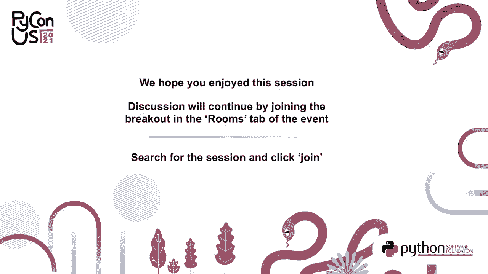

[空白音频]。
