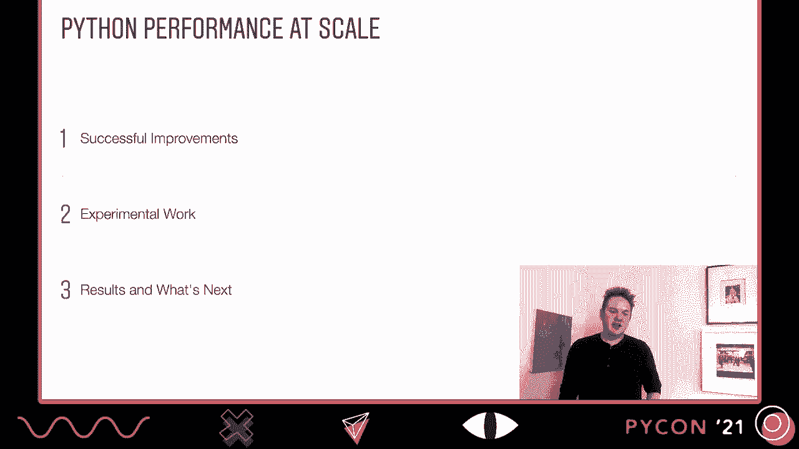
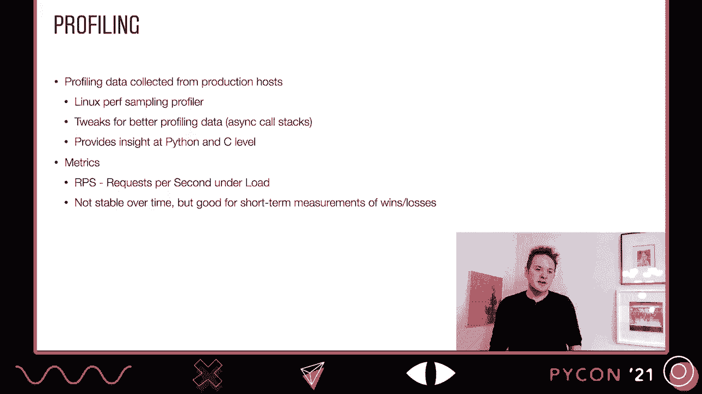
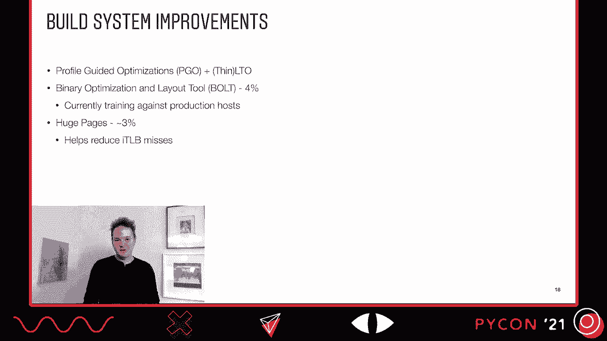
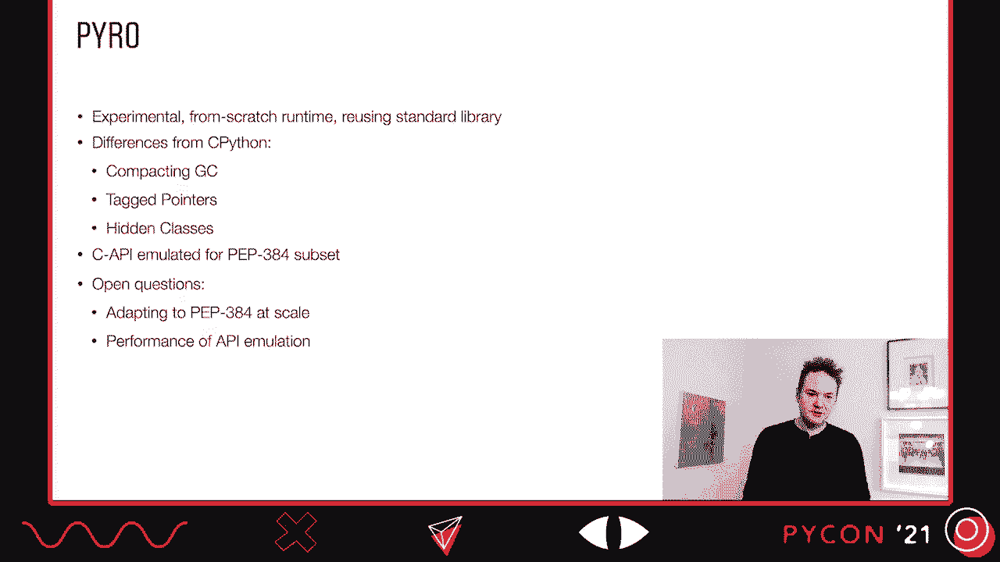
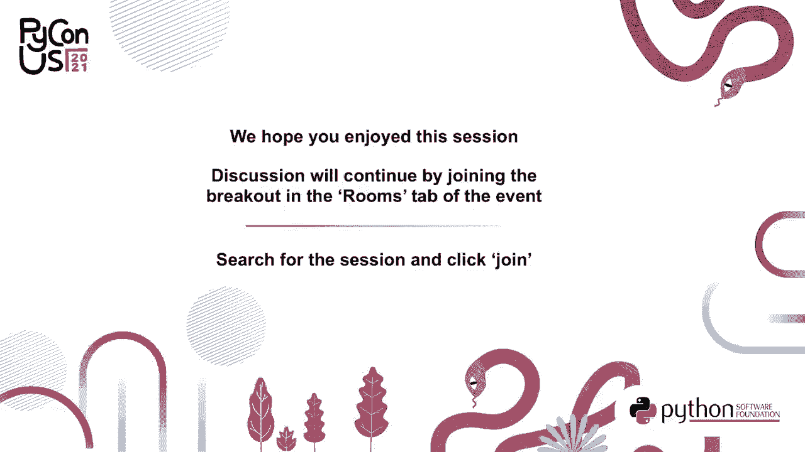

# Python性能优化：P3：大规模Python性能优化实践




在本教程中，我们将学习Instagram团队如何通过一系列优化手段，显著提升其大规模Python（Django）应用的性能。我们将深入探讨他们对CPython的定制分支（Cinder）所做的改进、实验性工作以及最终的成果。


---

## 概述：Instagram的技术栈与性能分析

Instagram是一个运行在Django上的单体Web应用，使用Python 3.8，并以UWSGI作为Web服务器。UWSGI采用主进程（父进程）管理多个工作进程（子进程）的模型来处理请求。



为了提升性能，团队使用Linux Perf采样分析器对工作负载进行了深入分析，重点关注在90%服务器负载下的每秒请求数（RPS）这一核心指标。这个指标虽然会随时间波动，但对于衡量单次优化的效果非常有效。


---

## 核心优化：Cinder分支的成功改进

上一节我们介绍了Instagram的技术栈和分析方法，本节中我们来看看他们对CPython分支Cinder所做的几项关键优化。

### 利用UWSGI进程模型：不朽对象

UWSGI的父进程与子进程会共享大量内存。为了最大化共享、减少因写入导致的“写时复制”，团队修改了引用计数机制。

**核心概念**：将分叉前堆中的对象标记为“不朽”，使其在子进程中永远不会被释放。这需要修改`Py_INCREF`和`Py_DECREF`宏，避免更新这些对象的引用计数。

```c
// 简化概念：在分叉前，遍历堆并将对象标记为不朽
mark_objects_immortal(heap);
```

这项优化在生产环境中带来了约5%的RPS提升。

### 异步I/O优化

异步I/O是性能优化的重点领域。

1.  **避免StopIteration异常**：在异步函数中，使用`StopIteration`传递值会创建异常对象，带来开销。团队优化了相关机制，在简单基准测试中获得了1.6倍的性能提升。此项改进已并入Python 3.10，并为生产环境带来额外5%的RPS收益。

2.  **急切求值（Eager Evaluation）**：许多异步调用会同步完成。团队优化了事件循环，对于能立即完成的操作，避免创建协程对象，而是返回一个单例等待句柄。结合`asyncio.gather`的新向量调用标志，这项优化带来了3%的RPS收益。

### 字节码内联缓存

团队为字节码引入了内联缓存机制。热门方法会获得一个包含优化后字节码和缓存数据结构的“影子副本”。

**工作原理**：当遇到可优化的操作码（如属性加载）时，将其替换为更具体的操作码。新操作码能快速进行类型检查和方法派发，绕过完整的动态查找过程。

以下是部分被优化的操作码及其替换目标：
*   `LOAD_ATTR`：优化属性查找，涵盖方法、实例字典、分裂字典等多种情况。
*   `STORE_ATTR`：优化属性存储，情况相对简单。
*   `LOAD_GLOBAL`：优化全局变量和内置函数查找。
*   `BINARY_SUBSCR`：优化下标操作。

这项优化整体带来了约5%的RPS提升。

### 全局变量查找优化：字典版本观察者



为了加速`LOAD_GLOBAL`，团队实现了“字典版本观察者”机制。


**核心概念**：为函数中使用的每个全局变量建立独立的缓存点。当模块或内置字典被修改时，对应的观察者会更新这些缓存。通过复用字典版本标签的低位来标记被观察的字典，实现了低开销的更新机制。

```python
# 概念示例：函数内全局变量的缓存
# 内置字典观察者 -> 缓存 `min`, `len` 等
# 模块字典观察者 -> 缓存模块内定义的 `x`, `max` (可能覆盖内置)
```

将此机制与影子字节码结合，在原有优化基础上额外带来了5%的性能提升。

### 其他针对性优化

1.  **`__builtins__`处理**：移除了CPython中关于`__builtins__`的一个实现细节限制，获得了约1%的RPS提升。
2.  **PyType查找优化**：对类型对象查找进行了微优化，在某些基准测试中提速达1.19倍。此项改进已并入Python 3.10。
3.  **减少线程状态查找**：避免了运行时的线程状态查找开销，改进已上游化。
4.  **内存预取**：在框架创建时预加载属性，减少内存访问延迟。
5.  **构建系统优化**：
    *   **基于生产数据的PGO**：使用来自线上生产主机的性能数据，而非标准测试集，来指导基于配置文件的优化，使生成的二进制布局更优。
    *   **BOLT优化器**：使用BOLT工具进一步优化二进制布局。
    *   **巨页（Huge Pages）**：将UWSGI二进制文件迁移到巨页上，减少指令缓存未命中，带来了约3%的收益。

---

## 实验性工作：探索未来

上一节我们介绍了已投入生产的稳定优化，本节中我们来看看一些仍在探索中的实验性项目。

### 自定义JIT编译器

Cinder开发了一个按需编译的JIT编译器，覆盖了绝大多数操作码。

**工作流程**：
1.  **前端**：将字节码转换为高级中间表示（HIR），进行单静态赋值（SSA）等转换，并运行引用计数插入等优化传递。
2.  **后端**：将HIR转换为低级中间表示（LIR），进行寄存器分配和针对性优化（如直接调用已知函数），最终通过JIT引擎生成x64机器码。

这种模式在特定基准测试（如Richards）中显示出显著的性能提升。

### 静态Python

静态Python旨在提供类似MyPy-C或Cython的类型性能，但允许直接运行普通的`.py`文件。

**核心特性**：
*   **静态导入**：通过`from __static__ import ...`启用静态编译和类型注解。
*   **原生类型**：支持如`int64`等原生类型，允许进行高效的原始整数运算。
*   **新字节码**：引入如`CALL_FUNCTION`、`LOAD_FIELD`等静态操作码，直接操作类型描述符。
*   **类型安全**：在静态代码与普通Python代码边界强制执行类型检查。
*   **编译器**：使用基于Python 3的编译器包，完全用Python编写。




```python
from __static__ import int64

def compute(a: int64, b: int64) -> int64:
    return a * b  # 可编译为高效的机器指令
```

### Pyro：实验性运行时

Pyro是一个从零开始编写的实验性Python运行时，旨在重用CPython标准库。

**主要区别**：
*   **紧凑型垃圾回收**。
*   **类型指针**：允许将整数等基本类型视为非对象。
*   **隐藏类**：为属性访问提供高效的内联缓存支持。
*   **C扩展支持**：通过PEP 384 C API子集支持C扩展。

目前面临PEP 384适配和API模拟性能等挑战。

---

## 成果总结与未来展望

本节课中我们一起学习了Instagram在大规模Python性能优化上的综合实践。

**性能成果总结**：
通过不朽对象、异步I/O优化、字节码内联缓存、全局查找优化、构建系统改进等一系列组合拳，团队估计在生产环境中获得了约20%到30%的RPS提升。在PyPerformance基准套件中，部分测试（如Richards）显示有接近4倍的加速。


**未来方向**：
1.  **代码上游化**：继续将稳定的优化贡献回CPython上游，减少版本升级的维护成本。
2.  **推进实验项目**：进一步完善JIT编译器、静态Python和Pyro运行时，探索更大的性能潜力。
3.  **优化基准测试表现**：调整JIT编译策略（如避免对只运行一次的函数进行JIT），以提升在标准基准测试中的表现。



Instagram的Cinder项目已在GitHub开源，他们的工作为大规模Python应用性能优化提供了宝贵的实践经验和方向。