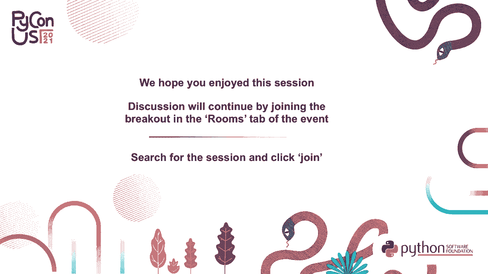

# P5：演讲 _ Itamar Turner-Trauring _ 从零到生产就绪的最佳实践流程 - VikingDen7 - BV19Q4y197HM

嗨，我的名字是 Itamar Turner-Troning。今天我将讨论最佳实践。

将你的应用程序，Python 应用程序，打包为 Docker 的过程，供生产使用。你可以在我的网站 pythonspeed.com 上找到更多信息。Docker 打包的事情是相当复杂的。第一个原因是历史。Docker 建立在追溯到 50 年前的原始 Unix 设计的技术之上，例如。

信号。接下来的 50 年里，所有这些技术的构建，包括网络、Python 等。为了让你的打包工作正常，你需要处理所有这些技术在一个地方的交汇。所有的设计决策，导致它们的某些设计错误，这种事情时有发生。因此所有。

这些不同的事物在一个地方交汇，这使得事情变得相当复杂。Docker 打包复杂的另一个原因是它在你组织内部多个流程的交集。因此，当你编写软件时，必须有人编写实际的代码，你将对软件进行测试。一旦打包，它就会被部署。

它在生产中运行，你可能需要在有限的停机时间内升级软件。当事情出错时，你有错误报告和反馈，你想知道生产中发生了什么。打包与所有这些不同的流程相互作用。这也是复杂性的另一个来源。因为它不是一个孤立的事情。

打包几乎与你对软件所做的所有事情都有关系。因此，这种复杂性的结果是，我实际上无法在 25 分钟的演讲中教你如何进行生产级的 Docker 打包。就最佳实践而言，我有一个个人清单，随着时间的推移不断增加，目前已经超过 70 条最佳实践，并持续增长。

我将这作为一个培训课程，持续一天半，仅覆盖其中一些最佳实践。无法覆盖你需要了解的所有细节。因此，在这次演讲中，我想覆盖并帮助你了解大局。特别是当你处理打包时，这是你在软件中所做的任何事情的案例。

你只有有限的时间来完成任何特定任务。在任何时候，你可能会被叫走，可能会被打断，也许是一个关键的错误，或者其他你必须交付的事情。因此，不是因为有一个复杂的过程，你希望能够一次性完成它。所以我要谈。

今天讨论的是一种装饰、装饰化你的应用程序的过程，这个过程是迭代的。所以你将经历多个步骤，在每个步骤中，你会得到基本上可用的东西。这个过程是有优先级的，因此你首先处理最重要的部分。然后每一步都建立在前面的基础上。

这个想法是，你经历一个逻辑推进的过程，在每一步中你都在改善文档和包装过程。如果在任何时候被打断，你都在一个好的停顿点。因此，这是一个大致的过程。这就是接下来演讲的结构，每一步都会解释。

我可能会举一个最佳实践的例子。再次说明，我并不涵盖所有最佳实践。在演讲结束时，我会给你一些资源的链接，你可以在这些链接中了解更多细节。这更关乎整体思路，你应该首先做什么。这是一个通用的顺序。

我选择了我认为适合大多数人的顺序。也许在你的特定情况下，你可能想要以不同的顺序进行。但例如，通常人们会查看他们的第一版 Docker 镜像并说，哦，不，这是一个两千兆字节的镜像，构建需要 20 分钟。所以我要花一些时间来加快这个过程。

还有让镜像更小。这是一个不错的做法，我们会讨论这个问题。问题在于，如果你首先这样做，可能会耗尽时间，然后不得不去处理其他事情，结果你创建了一个不安全的镜像。因此，对于大多数应用程序来说，安全性可能比小镜像更重要。因此，这是一个优先顺序。

最终，你应该尝试涵盖所有内容。但我们确实想从最重要的事情开始。因此，这是我的提议，你可以考虑一下，为你的特定应用程序和特定情况确定最重要的顺序。当你为 Docker 打包应用程序时，第一步是。

首先要让某些东西能运行。如果你的应用程序无法运行，那么整个过程就毫无意义。你可以拥有一个安全的镜像，构建快速且具备所有你需要的配置，但如果它实际上不能运行你的应用程序，那整个过程都是浪费时间。因此，第一件事是搞清楚如何让你的应用程序运行。

让应用程序能够运行。当你这样做时，你会考虑像如何配置你的应用程序的问题。Docker 鼓励你通过环境变量配置内容。但有些情况，根据你的运行环境，挂载配置文件可能是另一种选择。Kubernetes 使得这一点更容易。你需要考虑为什么这是下一步合理的选择。

哪些端口将是公开的，哪些端口将是私有的。你需要经历这个决策过程，以确定你的应用程序如何与 Docker 互动，同时确保它能正常工作。因此，安装正确的依赖项和软件包，确保它能够启动，等等。以下是一个示例 Docker 文件。

对于一个简单的应用程序，这就是你能写的最基本的 Docker 文件。虽然这并不是最好的打包方式，但这只是第一步，我们还有五个步骤。当我们完成时，我们可以做得比这更好。一旦你有了一个可以工作的东西，下一步就是关注安全性。在你可以在任何地方部署应用程序之前，你真的希望它是安全的。

在你将镜像推送到公共镜像注册表之前，在它离开你的计算机之前，你希望它是安全的。例如，如果你有一些秘密用于构建镜像，你不希望这些秘密泄露在镜像中。因此，在你可以。

在你能真正使用镜像之前，几乎无法对其做任何事情。对于大多数应用程序，安全性是下一步。这是一个示例。再次说明，有许多最佳实践我无法覆盖所有，但在演讲结束时我会给你一些链接。因此，这里是其中之一的示例。

最佳安全实践。当你运行一个 Docker 镜像时，默认情况下，它会以 root 用户身份运行。尽管容器确实提供了一定程度的隔离，并且容器内的 root 用户通常比主机上的 root 用户受到更多限制，但这一点仅在某种程度上是正确的。而以 root 用户身份运行确实让你的容器在某些方面更强大。

攻击者潜在能做的事情。因此，如果攻击者以某种方式获得对你的容器的访问并接管它。如果他们接管了以 root 身份运行的容器，他们将获得更多的访问权限，逃离容器或接管整个主机机器将更容易。因此，不以 root 身份运行容器是一个好的最佳实践。因此在这个 Docker 文件中。

我们所做的是创建一个新的用户，称为 app 用户。然后我们使用用户命令，告诉 Docker 文件后面的所有命令都将以该用户身份运行。因此，当你执行 pip install 时，它将以该用户身份运行。当你最终启动生成的镜像并启动你的进程时。

它将作为新用户运行。因此现在你有一个默认情况下不以 root 身份运行的镜像。因此，你的镜像在本质上更安全。这并不需要太多工作，但这是个好主意。因此，除了正确配置你的应用程序文件，例如 Docker 文件、启动脚本等，打包的一部分也是创建流程。

组织流程。例如，涉及安全时，你真正需要的是一个关于如何处理安全更新的流程。问题是，Docker 镜像是不可变的。每次启动时，容器的文件系统都是完全相同的。因此，安全更新通常需要一个新镜像。从某种意义上说，你可以。

解决这个问题，但不可变工件实际上是 Docker 的一个特性，它们在许多方面使推理变得简单。因此，当安全更新发布时，你需要知道这件事的发生，像你需要知道 OpenSSL 中可能存在的漏洞会让某人利用你的服务器。然后你需要更新你的镜像，以获取最新的内容。

版本的 OpenSSL 并重建镜像后，如果是某种服务器，你必须重新部署应用程序。因此，这并不总是你可以仅通过一些配置来管理的事情，而不仅仅是配置文件。这是一个持续的过程，你需要继续进行，甚至在你完成工作之后。

前期打包。一旦你承诺进行打包，你也承诺要有一个安全更新的过程。因此，重要的是要记住，这不仅仅是编写一些配置文件就完成了，你需要持续的过程，否则在这种情况下，你将面临安全缺失的问题。

因此，一旦你安全地打包了镜像，下一步就是尝试自动化构建，与 CI 系统集成。原因在于此时你不想继续手动构建镜像，这对测试来说可以，但对于真实的软件开发而言，你可能会有一个团队在持续工作。

软件，你希望自动化这一过程。因此，你不需要教你的队友如何构建 Docker 镜像，并给予他们镜像注册表的所有凭证。你希望它能够自动工作。因此接下来你要与构建系统集成。最简单的方式是像 Shell 脚本那样。

你在主分支的每次检查中自动运行的测试，构建镜像，然后将镜像推送到注册表。因此，这就是最简单的自动化构建。然而，超越这一点，你仍然需要考虑如何与你的组织流程集成。

它们的打包与团队如何开发代码互动。例如，测试。你是否会使用 Docker 镜像运行集成测试，那么你必须弄清楚这如何与 CI 配合。如果你有多个分支，多个分支将如何与 Docker 构建互动。

你会为所有分支还是仅为生产分支生成镜像？你可能需要开始考虑，是否会成为瓶颈，在这种情况下，稍后我们会讨论性能，这将成为一个问题。因此，作为最佳实践的示例，为特定功能拥有功能分支是相当普遍的。然后你打开一个拉取。

请求并运行测试，然后将该拉取请求合并到主分支中。假设你正在为功能分支 123 “更多铃铛”构建镜像，针对票据编号 123。你希望为每个拉取请求构建一个 Docker 镜像，因为你希望使用 Docker 镜像运行集成测试。你不希望功能分支的 Docker 镜像覆盖。

你的 Docker 镜像来自主分支，因此你真正想要做的是根据代码的不同分支，拥有不同名称的 Docker 镜像。下面是一个示例，说明你如何在构建脚本中，使用这个来自 Stack Overflow 的 git 命令，找出当前的 git 分支。然后，当你。

构建你的镜像，冒号后面的部分是标签，取自分支的名称。因此，如果你的分支是主分支，它将是你的镜像：主分支。如果是 123 分支“更多铃铛”，它将是你的镜像：123 更多铃铛。因此，仅通过查看 Docker 镜像，你现在就能知道它来自哪个分支，此外。

来自你的功能分支的 Docker 镜像不会破坏，不会覆盖你用于生产的 Docker 镜像。一旦你开始自动构建镜像，你将开始排队，随着你构建它们而生成更多的镜像。此时你可能正在生产环境中运行。因此，你可能会出现更多的错误。

需要从生产环境中提取。因此你希望可调试性。希望你的镜像能够合理地启动和关闭，并且可能更容易监控，因为它们运行在生产环境中。因此，这就是一个很好的。下一步是操作正确性和可调试性，使其在生产中运行良好，并在出现问题时更易于调试。下面是一个示例。

当你在 Python 代码中遇到错误时，如果没有使用任何异常处理程序，你会得到一个回溯。该回溯会显示在你的日志中，或者你可能有某个服务来收集所有的回溯并将它们集中到一个地方。这样你就可以查看你的回溯，并说，哦，服务器模块的第 230 行发生了值错误。

这为调试错误提供了一个很好的起点。如果你在 C 代码中发现错误，记住，Python 本身是用 C 编写的，很多扩展模块都是用 C、C++ 或 Python 编写的。如果你在其中一个模块中发现错误，通常你的程序会崩溃，这就是所谓的故障。当它崩溃时，你不会得到 Python 的回溯，而只会得到沉默。

然后你就不知道如何调试它。但是 Python 有一个称为故障处理程序的功能可以解决这个问题。基本上，你所要做的就是设置这个环境变量 `Python fault handler`。在这种情况下，我们在 Docker 文件中使用命令的末尾进行设置。然后仅仅通过设置这个环境变量，当你发生段错误时。

你会得到一个漂亮的 Python 堆栈跟踪，显示它来自哪个包。所以你可能会说，哦，它是 `matplotlib`，或者是你的数据库适配器，或者其他的。这在调试崩溃时非常有用，因为你不再沉默，而是确切知道从哪里开始。因此，在你的 Docker 文件中仅仅加一行代码。

当事情出错时，这会让你的生活轻松很多。因此再举个例子，当你启动 Python 时，它会加载所有的 `.py` 文件并将其转换为 `.pyc` 文件，这些是字节码编译步骤。这并不像 C 编译器，因为基本上是逐一对应的，但这基本上是一个必要步骤。

然后 Python 会存储 `.pyc` 文件。下次你启动服务器或应用程序时，它就不必再进行编译步骤，启动会更快。问题在于 Docker 镜像是不可变的。第二次运行时，你会得到一个新的容器，而这正是相同的文件系统。第一次运行时也是如此。

因此，如果你的 Docker 镜像没有 `.pyc` 文件，启动将会更慢。对于某些应用程序来说，这无关紧要。但在其他应用程序中，这可能是有意义的。你实际上希望快速启动。因此在你的 Docker 镜像中，如果你对镜像大小不太在意，更在乎启动时间。

你可以使用 Python 的 `compileall` 模块，基本上确保在创建 Docker 镜像时为你的所有源代码创建 `.pyc` 文件，这将使你启动更快。因此在这一点上，你只是确保它在操作环境中运行良好。构建是自动化的。这大概不会花太长时间。

如果你没有分心，请执行这些初始步骤。但是很有可能在你使用 Django 的那一周中，可能没有新的发布。在你为 Docker 镜像工作几天的过程中，Django 可能没有进行过重要的新发布。但是如果你等六个月，可能会有一个重大的 Django 发布。如果你等两年，Django 肯定会有一个重大发布。

所以你希望，如果你总是安装最新版本的 Django，从短期来看，这没问题。但从长远来看，这会破坏你的应用程序。然后你会重建你的 Docker 镜像，突然间它使用的是不同版本的 Django，结果会因为不兼容而变得很糟糕。所以你希望构建是可重复的。

你希望在重建时，尽可能获得相同的镜像和相同的包。因此，当你升级时，你可以以一种可控的方式升级，而不是基于 Django 的发布计划。所以，拥有可复现镜像的一部分是拥有你依赖的系统包。像 glibc 和 open SSL 等，确保它们的稳定性。

而最简单的方法是使用一个保证向后兼容性和稳定性的 Linux 基础镜像，同时也提供安全更新。所以它可能是长期支持版本，或者像 CentOS，这些天可以考虑企业 Linux。一旦你做到这一点，你可以依赖于简单的事情，就是安装安全更新。

然后依赖于操作系统保证向后兼容的事实。这个问题在于，它们通常有旧版本的 Python。因此，我推荐的默认选项是由 Docker 创建的官方 Python 基础镜像。例如，Python colon 3.9 slim buster，这意味着 Debian buster 上最新的 Python 3.9 迷你版本，这是一个稳定版本。

而且给我 slim 意味着更小的版本。如果你使用这个版本，你可以依赖基础镜像不会随意更改，比如你不会得到一个完全不同的版本的 open SSL，但你也可以获取安全更新。再说一次，可复现性不仅仅关于你正在创建的工件，它也是一个过程。

所以，如果你更新你的依赖项，这主要是指你的 Python 依赖项，但如果你真的很敏感，也可能是你的系统依赖项，比如你的应用程序包或 RPM。如果你更新了你的依赖项，重建的最新版本，你将失去可复现性。你会得到一个不同版本的 Django，而不需要新的 Django 版本发布。

所以你真的想要使用像 PIP tools 或 poetry，或 contact 这样的工具来固定或冻结你所有的依赖项。然后每当你重建镜像时，你将安装相同的依赖项。然后你会面临一个新问题。如果你不更新，随着时间的推移，最终会运行所有的依赖项。如果你等得够久，你就会陷入那种情况。

我们不得不一次性升级五个主要依赖项。然后你不知道是什么导致了你的代码出错，这是一团糟。所以你需要一个组织流程，比如每三个月，我会说，我要升级到最新版本的依赖项。这样，在短期内。

你有稳定性，或者在这三个月内，你使用的是同一个版本的 Django。但因为你每三个月就升级一次，所以你并不会真正落后太多。这是一个组织过程，它需要人工干预。你需要为此做计划，并定期执行。这个过程的最后一步是优化你的。

包装使得构建速度更快，图像也更小。包装需要 30 分钟。每次你提交一个拉取请求时，都必须等待 30 分钟来构建 Docker 镜像。这会减慢你的开发进程，导致成本增加。如果你有一个大的镜像，下载会很慢。再次会拖慢进度，或者仅仅是让你在带宽上付出更多。

所以下一步也是最后一步就是优化你的图像。例如，在构建时间方面。Alpine Linux 通常被推荐作为 Docker 镜像的基础镜像。但在 Python 的上下文中，这非常有问题，因为它无法使用来自 PIPI 的预编译轮子。这意味着所有通常由其提供的东西都无法使用。

包装作者提供的预编译格式，你必须从头编译。例如，如果你想在 Mac 上安装 pandas，如果你安装一个基于 Debian 的 Docker 镜像，如 SlimBuster，它会只下载预编译包，只需 30 秒。在 Alpine 上，你必须自己编译，这需要 1500 秒，慢了 50 倍。这真是太麻烦了。

我认为有一个 PEP 656 会解决这个问题。在一两年后，可能会真的有 Alpine 的预编译轮子，那时你可以使用 Alpine。但目前，我建议如果你想要快速构建 Docker 镜像，就不要使用它。这是整个过程的概况。首先，你需要让某个东西能够工作，然后再确保它的安全。

然后你自动化构建，使其在 CI 中运行，然后进行所有你想要的调优和正确性，以便于调试，满足生产需求，然后进行可重复构建，接着优化你的构建。在你的具体情况下，你可能想要以不同的顺序来处理。在许多应用中，可重复性可能比你想象的更重要，你可能想要早些进行。

一旦你对此掌握得很好，你实际上会开始更多地利用这个。但作为你需要做的事情的地图，以及一种初步优先排序，这是一个很好的起点。我在你进行时指出了这一点，但我想重申一下。Docker 化不仅仅是编写 Docker 文件、构建脚本或 Docker 忽略文件。

这也是一个涉及过程并与开发流程互动的事情。你需要考虑它如何与分支和特性分支等事物协同工作。同时，这也要求你为安全更新或依赖更新创建新的流程。因此，在软件开发的许多方面，重要的不仅是确保实际的工件正确，还需要考虑整体流程以及它们与组织和组织目标的互动。

就是这样。这就是整个流程，也是我的演讲内容。在我的网站上，你可以找到这个演讲的专业版以及更多扩展内容，网址是 pythonspeed.com/products。

或者堆叠处理。这种形式更详细地阐述了这些思想，你可以阅读。此外，我还有一份免费的指南，包含你需要注意的所有细节，包括安全性和图像大小、构建和可重复性。它位于 pythonspeed.com/dakard。这里有很多文章，涵盖了所有这些最佳实践的详细信息，你可以了解更多。

你可以通过访问这两个网址了解你需要做的事情。如果你有任何问题、建议或想讨论的内容，请随时给我发邮件或发推文。我相信会有一个问答环节。谢谢。[沉默]，[沉默]，[沉默]。[沉默]，[沉默]，[空白音频]。

