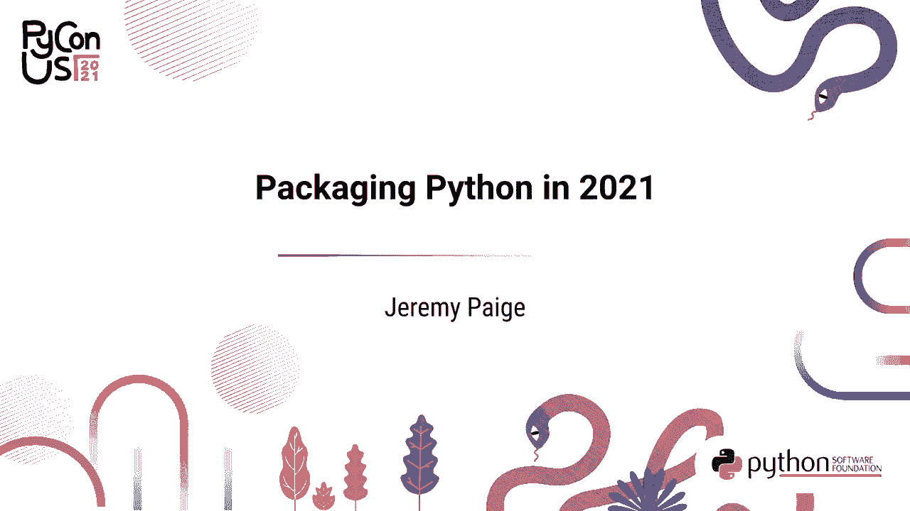
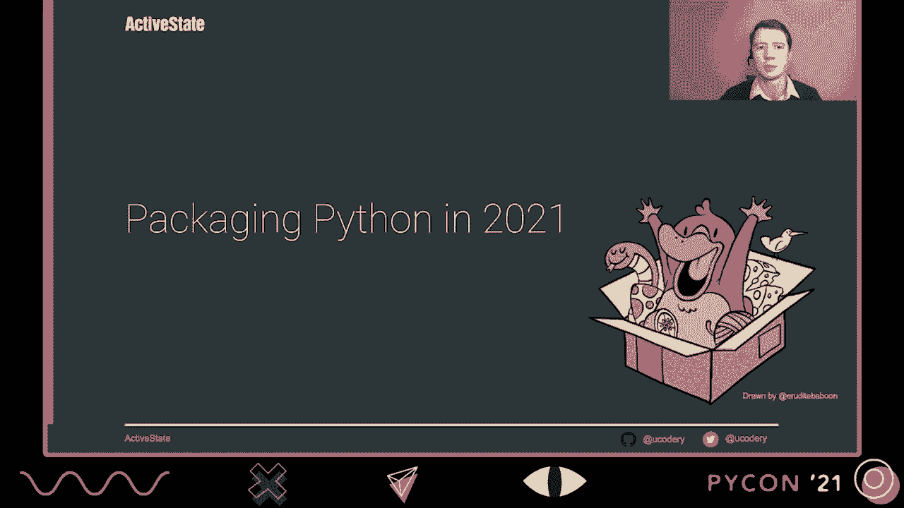
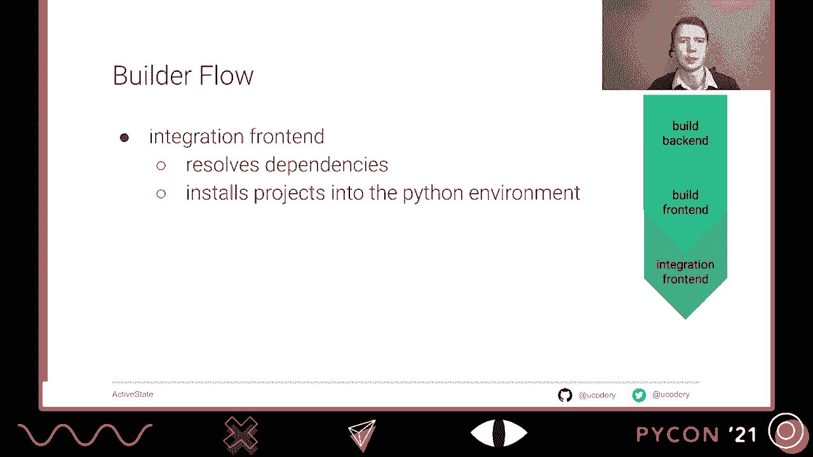
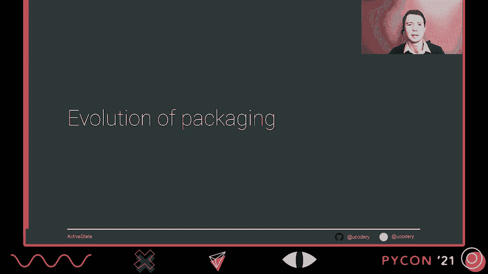
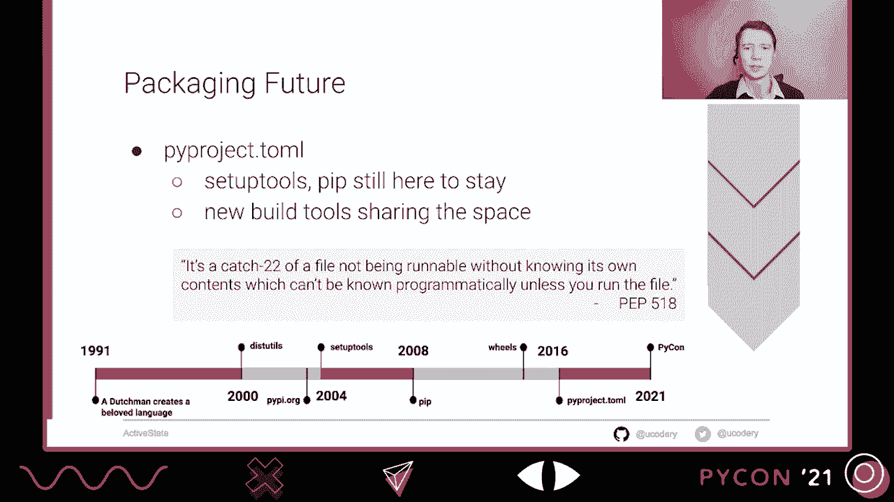
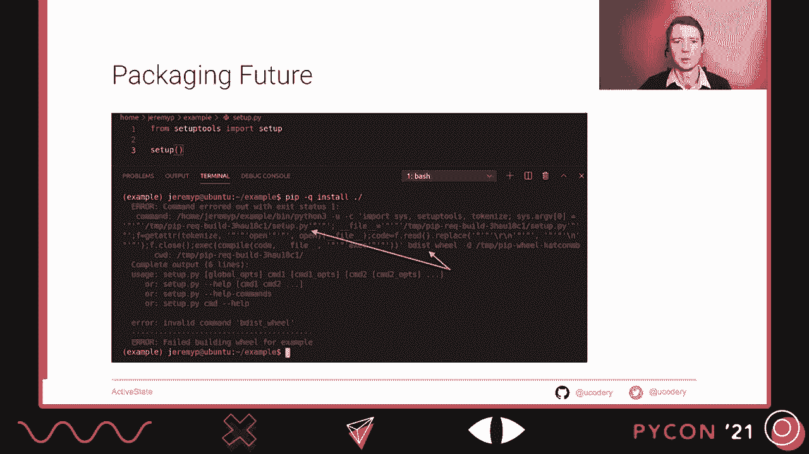
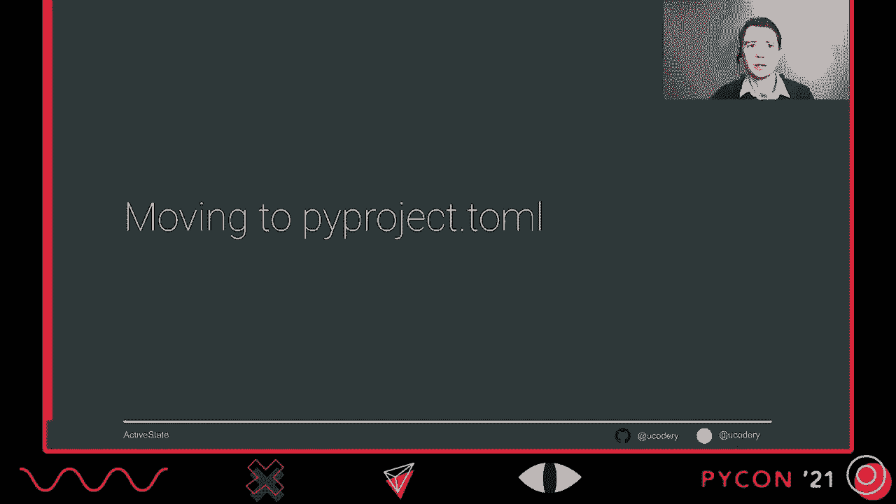
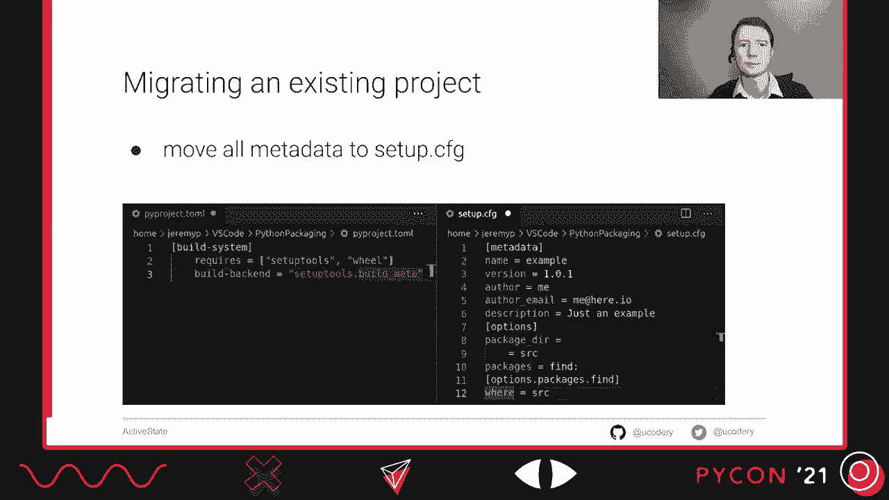
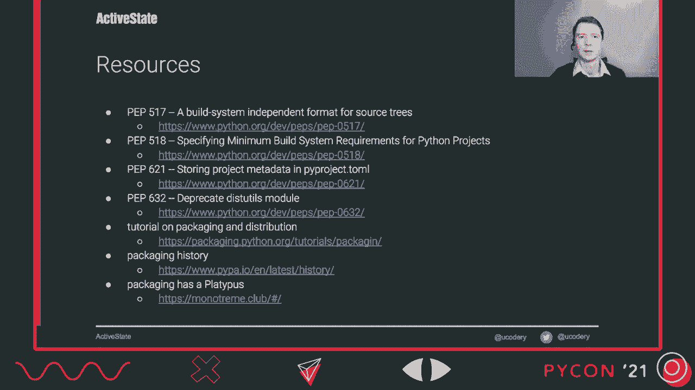
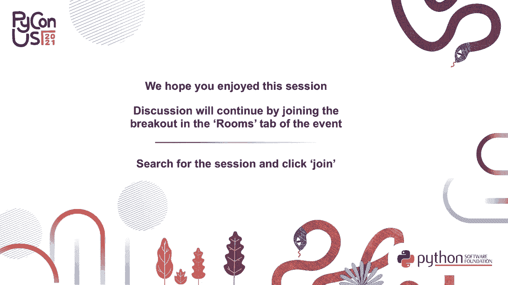

# P6：演讲 _ Jeremy Paige _ 2021 年 Python 打包 - VikingDen7 - BV19Q4y197HM

[音乐]。

早上好，欢迎大家。我很高兴能在 PyCon 上和你们虚拟相聚。

这就是 2021 年的 Python 打包。这是你需要了解的关于最新标准的所有信息，以及如何编写易于构建的项目。我将详细说明如何维护明确、可预测和可读的构建信息。这些信息可以被人类和机器使用，以更好地理解你的项目。

今天我将重点介绍如何使用新的 PyProject.toml 配置，以及随之而来的现代构建前端和后端范式。该文件在五年前首次引入生态系统，但经历了一些变化，最近才被标记为最终标准。PyProject.toml 旨在以可预测的方式保存核心项目元数据。

位置。它并不意味着是一个逐步描述如何构建项目的蓝图。相反，它更像是一个指示，指向读者一些特定工具和其他环境，以便项目准备自己的蓝图。尽管它可能不包含足够的信息来完全构建你的项目，但无论如何。

元数据应视为项目的权威内容。然后，由此文件指定的实际构建工具可以继续要求额外的配置，既可以在同一个 PyProject.toml 中，也可以在其自己的配置文件中。如果你不知道，Toml 代表 Tom 的明显配置语言。这是一种配置。

这种格式类似于 YAML 或 INI。它已成为许多编程语言中打包系统的流行选择。然而，最终出现在 PyProject.toml 中的不仅仅是构建元数据。尽管在构思时这是一个单一目标，但拥有一个众所周知的存在于所有 Python 项目中的单一配置文件对许多工具维护者来说实在太有吸引力了。

为了避免。随着时间的推移，Toml 布局为任意 Python 工具腾出了空间，以便彼此共享而不发生冲突。一些项目例如 Black 只允许作者在 PyProject.toml 中指定配置，而其他项目例如 ISDOR 则允许作者选择在 PyProject.toml 中写入配置并与其他工具合并，或将其全部写出到其特定工具中。

文件。PyProject.toml 合法地包含这种工具配置，但没有构建系统。然而，在这种情况下，该项目被创建为遗留项目，对于构建工具而言，它就像根本没有 PyProject.toml 文件一样。这是一个 Menmul PyProject.toml 可能的样子示例。然后，在中间。

项目表仅包含任何发行版所需的静态数据，无论其类型或使用何种工具创建。该表中还有其他可能的项目字段，但并不是所有字段都必须填写。项目表非常新，并且不仅受到所有工具的支持。

但请关注未来，所有项目可能包含其核心元数据。你可以看到下面黑色配置在工具下的子表中。在这个空间内，黑色可以自由定义它想要的任何选项接口。回到顶部，你会看到构建系统配置表，其中包含所有后端构建器。

需求被列出，并且有一个单一的入口点进入特定的构建后端。构建后端可能并不是你在定义如何构建项目时习惯选择的，但它实际上为你和项目的消费者提供了更多灵活性，以选择每个人想要使用的工具。过去总是一个工具链的情况现在已正式分为三个类别。

旧的巨型构建工具通常会将下游消费者（如包、安装程序或其他维护者）锁定在必须始终选择与作者首次构建项目时使用的相同工具。但这些新的类别，连接器具有独立于任何一个项目的标准 API，允许每个部分独立运作。即使在。

其他情况下，它们都在某个更大的项目中定义。将源代码转换为可以作为包导入的内容使用的三种主要工具类别。构建后端是第一个。它将源代码转换为分发格式，如 wheel 文件。项目构建后端由项目作者选择，并记录在 PyProject 中。

Tomo。这是这些工具中唯一一个实际被记录的。接下来是构建前端，它处理用户交互。例如，它可能提供命令行界面，向用户显示进度，或显示来自不良元数据或构建后端问题的错误。构建前端还必须在一个实际适合的环境中执行后端。

用于构建。因此，这可能涉及安装构建后端的依赖项，创建虚拟环境，设置其工作目录，以及其他类似任务。虽然这并不常见，但希望构建项目的用户可以选择与作者使用的不同前端，只要这两个构建前端和后端都遵循这些新的 API。

集成前端实际上并不直接参与构建过程，因为到这个时候，已经存在构建发行文件。但它确实会将这个发行文件安装到你的 Python 环境中。我认为我们与发行版互动的频率，可能就是通过导入它们。

一个集成前端不仅能够安装分发包，还能解析这些分发包的依赖关系，可能会在本地或互联网上查找它们，甚至下载并安装这些分发包。项目作者对实际使用的集成前端没有控制权。

稳固的分发。实际上，目前所有公共项目都通过多个集成前端进行安装。对许多人来说，只有一个工具完成了所有这些任务，那就是 PIP。PIP 通常一次性处理所有这些，为你隐藏了必须做的复杂性。

在幕后进行不同的工作。然而，PIP 实际上并不是一个打包工具。尽管它很棒，我相信它作为一个用于满足 Python 各类需求的历史性命令行工具的使用，模糊了 Python 需要看到这些不同类别的方式。在某些情况下，可能会使他们看到这些需求根本存在。

因此，为了展示为什么最初需要 PIP 以及 Python 为什么现在需要超越 PIP，我们将简要回顾打包是如何与 Python 语言共同发展的。

一切都始于磁盘细节。磁盘细节是最初的打包库，作为 Python 语言 1.6 版本的一部分发布。它还为我们提供了当前的 `.py` 约定和构建项目的顶级目录。公共的 `.py` 脚本可以充当构建前端或某种集成前端。

通过导入磁盘细节提供的 CLI，可以从源代码构建并将该构建安装到你的环境中。然而，磁盘细节最初并没有声明任何方式来声明需求，更不用说解决这些依赖关系了。这超出了构建前端的范围。

但在我看来，这并不完全是一个集成前端的结束。因此，磁盘细节有点像构建后端，作为项目作者，你每次编写新的 `setup.py` 时都需要编写自己的构建前端。此外，请注意，磁盘细节在最新版本的 Python 中已被标记为弃用。

这绝对使其不适合新项目。在经过多年仅使用磁盘细节后，一套工具作为流行的替代方案出现在标准库之外。它继续为所有项目使用 `.py`，这意味着项目作者仍然在某种程度上编写自己的组件。

然而，这套工具还引入了一个名为 EasyInstall 的脚本，它确实充当了集成前端，显然比直接调用 `setup.py` 脚本要好。它能够解析依赖关系并从 PyPI.org 下载分发版，而 PyPI.org 在最初发布设置工具时大约同时上线。

这些设置工具最初发布是为了复制和扩展所有功能。现在，它作为任何一种前端的使用实际上正在减少。最初提供的功能，例如运行测试或声明需求的脚本已被移除。

用于设置你的代码或使用那些特殊要求构建你的代码的方式不再受支持。不久后，setup 工具项目只能在使用符合新前端规范的构建前端时构建。然而，构建后端仍然非常重要，并不会消失，可能会成为 Python 的核心。

packaging 就像是构建后端。在设置工具后，距离 PyCienistas 最终获得与 PIP 的恰当集成仍需几年时间。PIP 通过隐藏使用多个 setup.py 的细节，使项目使用更简单，以满足一系列要求。

项目的需求。作为一个工具，它绝对优于 easy_install，并且充当了完整的替代品。即便在 easy_install 被正式标记为不推荐使用之前，还需要几年时间。PIP 也是 Python 的第一个集成前端，允许直接从 VCS 地址安装依赖项。

感谢它能够直接从 GitHub 链接安装该项目。不过，PIP 并不是构建工具。它最初只知道如何从源代码构建项目，因为它知道调用 setup.py 的特殊方式，这就是构建前端。在构建后端规范化后，PIP 学会了如何进行构建调用。

首先，构建后端实际上也使其成为构建前端。我认为这是一个相当糟糕的选择，因为它缺少你希望从完整构建前端获得的一些重要功能，例如创建 S-dist 文件的能力。因此，PIP 已经作为前端工作，而 setup 工具仍在工作。

作为后端非常出色，它们在构建和安装方面配合得很好。你可能会想，为什么我们让你为项目添加另一个文件。尤其是当你考虑到 PyProject.toml 实际上并没有提供这些工具的任何功能时。

你将遵循项目消费者的新期望。不仅是工具，所有与项目合作的人现在都在寻找普遍存在的 PyProject.toml，以便更好地了解你的项目。作为项目作者，包含它后你就可以自由更改。

你如何在不干扰用户的情况下构建项目。另一个重要的构建提示仅通过使用 PyProject.toml 解决，就是声明你的项目在开始构建时需要哪些包。我认为 PIP 的 518 最能概括这个提示，它谈到了 setup.py 的不足之处。

这是一个 catch 22 的情况，一个文件在不知道其自身内容的情况下是无法运行的，除非你运行这个文件，而内容是无法程序化知道的。Python 通过简单地假设 setup tools 和 PIP 几乎是普遍可用的，就像 math 模块一样，走了很长一段路。

这两个第三方包被认为是如此重要，以至于在每次创建新的 VINs 时，它们实际上都是可用的。但如果你决定使用不同的构建前端，或使用不同的构建后端，或者需要更多的东西，它对你打包并没有帮助。

不仅仅是使用 setup tools 和 PIP 来进行构建，就像你需要 Python 或 wheels 一样。让 PIP 和 setup tools 像现在这样普遍可用，解决了许多 Python 的构建引导问题。至少在大家决定 wheel 是最新标准并且每个人都应该遵循它之前，情况是这样的。你会发现 PIP 并不真正了解。

它知道如何从源代码安装一个包。它知道如何安装一个发行版。如果它遇到源代码，它首先将源代码转换为 wheel 文件。但是 PIP 通常使用的构建后端 setup tools 并不知道如何构建一个 wheel 文件。它知道如何构建一个 S-dist 文件。

因此，我们需要这个额外的包，令人困惑的是，它也叫做 wheel 包。

如果你曾尝试从源代码用 PIP 安装一个不包含 PyProject。toddle 文件的项目，你会在此看到这个现象。当我们在一个新的虚拟环境中尝试 PIP 安装时，PIP 给出了一个不太有帮助的错误信息。

注意到 B-dist wheel 不是一个合法命令。尽管所有 PIP 与 S-dist 只是安装在 Python 源代码中。如果我们进一步查看堆栈跟踪，我们会看到一些 PIP 的秘密魔法。在幕后，它被称为 setup.py。但它选择传递这个非法的 B-dist wheel 命令。

如果你以前见过这个错误，你可能会立刻认出解决方案。你需要从 PyPI 下载一个叫做 "wheel" 的包。只要有这个包的存在，就会通过系统的特殊 setup tools 钩子在安装过程中神奇地修复 PIP 命令。

对于选择运行的 setup.py 文件或 PIP 命令，没有必要做任何更改。但所有这些都是一个相当混乱的结论，源于一个关于无效命令的错误，而这个命令并没有被直接执行，并且抱怨关于 B-dist wheel 命令的某些事情。没有关于 wheel 或包的错误信息。

如果这个项目只是添加了一个包含 wheel 要求的 PyPI。TOMEL，这种困惑和可能的堆栈溢出搜索就可以避免。这样做为用户节省了很多痛苦和挫折。

所以让我们来看看如何让这个 PyPI。TOMEL 为你的项目服务。

使用现代配置的 PyPI。TOMEL 不仅让你摆脱一些过时的打包实践，还为你提供了许多新的优势。明确指定你的构建后端将始终为你提供相同的构建环境，始终在你的机器上，在 CI 中，甚至在用户的机器上。

使用 Q-SYS 来使用与你之前不同的前端。这也将允许你尝试不同的后端，并且几乎不需要更改你的代码。现在 PyPI。TOMEL 是标准，一些构建相关的工具只会在具有此文件的项目中工作。类似地，越来越多的工具正在采用 PyPI。

TOMEL 作为它们设置的位置。甚至与构建无关的日志工具。这使得你项目顶层目录中的文件大大减少。所以现在使用你的项目构建得很好。它只是基于很多假设在运行。而假设不是构建可靠软件的方法。

所以，继续选择一个构建后端，并通过将其放入 PyPI。TOMEL 来让每个人知道你选择了什么。如果你坚持使用设置工具后端，那很好。但即使在包含 PyPI。TOMEL 文件后，还有一些任务可以进一步现代化你的打包。首先，停止将 setup.py 用作任何任务的脚本。

它不再被视为任何类型的前端。无论它仍然具备什么功能，都将会消失。PyPI。TOMEL 的另一个优势是可以完全省略 setup.py。相反，PyPI。TOMEL 和 setup.cfg 文件的静态配置可以处理你所有的构建细节。这样，你就不需要将构建前端作为项目的一部分，带有 setup.py 脚本。

项目外部的构建工具可以为你处理所有构建逻辑。最后，如果你保留 setup.py 文件并且它的重要性来自 disk utils，将其切换到来自设置工具的导入。在这个库完全从 PyPI。TOMEL 语言中消失之前，你想要摆脱它。如果你维护一个没有 PyPI 的项目。

现在如果你想以最小的摩擦添加 TOMEL 文件，只需用这三行创建它。此处指定的遗留构建实际上是 PyPI 在遇到缺少 PyPI。TOMEL 文件的项目时将给你的确切行为。因此，添加此文件不会改变你的项目实际构建的方式。作为额外的好处。

你的项目用户不会因为他们的机器上没有准备好的轮子而出现混淆的轮子错误。如果你想进一步发展，而不仅仅是为正在发生的事情添加构建信息，可以尝试移动到标准的设置工具后端入口点。请注意，设置工具尚不支持 PyPI 中的项目数据。TOMEL。

因此，你仍然需要使用`setup.cfg`来指定元数据作为配置。如果你还没有一个，尝试创建它并添加一些核心元数据。然后尝试将更多元数据从`setup.py`移动到你的`setup.cfg`中。长此以往，你会发现原本需要`setup.py`的所有内容都可以迁移到`setup.cfg`中。

这意味着你设置的`setup.py`会完全消失，只留下你和项目用户明确、可预测和易读的构建信息。最终，所有使用这个项目的用户都将从这些更改中受益。

包装是一个非常丰富且仍在发展的领域。因此，我鼓励你持续学习相关知识。外面有很多优秀的资源。这些是对我形成这个演讲有帮助的一些资源。谢谢，祝你在会议的剩余时间里过得愉快。

[空白音频]， [空白音频]， [空白音频]， [空白音频]， [空白音频]， [空白音频]。 [空白音频]。

