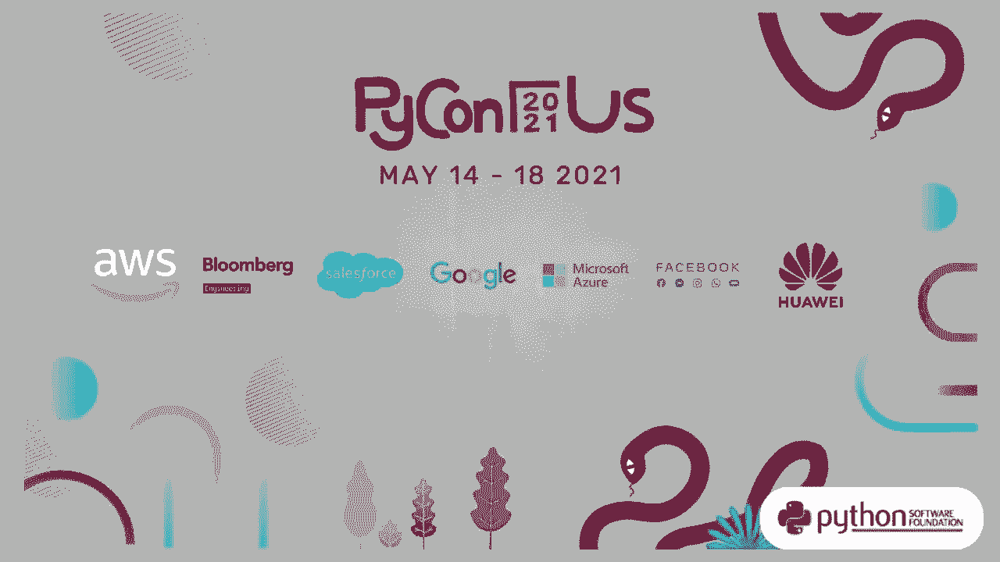
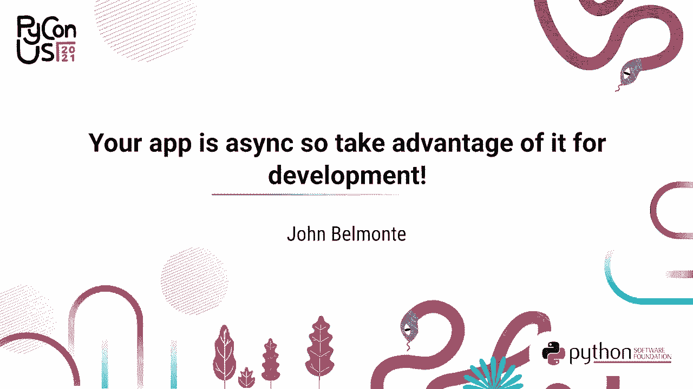
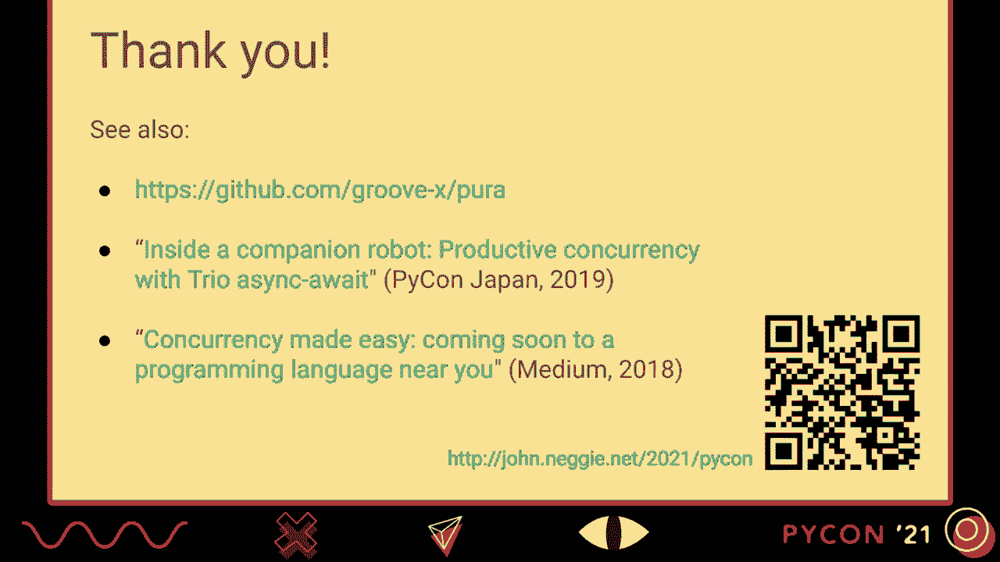
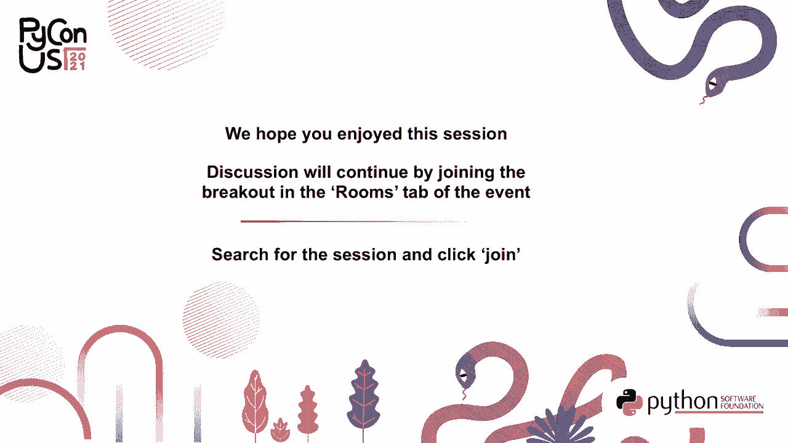

# P7：演讲 _ 约翰·贝尔蒙特 _ 你的应用是异步的，所以利用它进行开发 - VikingDen7 - BV19Q4y197HM

[音乐]。

如果作为开发者我们能够在不暂停应用程序的情况下检查和修改内部状态，那该多好啊？

如果你的应用是异步的，这种事情已经可以实现了。那么我们来利用这一点进行开发吧。这是一个尚未被充分探索的领域。在 Python 的上下文中，异步意味着我们使用协作式多任务处理。通常只有一个操作系统线程，并且你要小心不要阻塞该线程。

那么让我们深入无暂停的领域吧。我叫约翰·贝尔曼提。我很高兴能在今年的 Python 大会上发言。我是一个喜欢用手 gesturing 的人，所以在演讲时我会挥动这个激光指示器。我还想介绍一下 Lubbot。Lubbot 是一个伴侣机器人，这个项目激发了许多灵感。

我将在本次演讲中介绍的工具和方法。这些工具是由一家名为 Groovex 的公司开发的，并且在日本市场上已经有一年多的时间了。Python 不仅在机器人内部运行，而且处于软件栈的顶层，负责管理机器人内部的所有并发操作。

所有的传感器输入和伺服输出，决定要运行什么行为等等。这就是 Oreo。他是我在家工作的开发机器人，日常工作中与我相伴。他的工作很轻松，因为在辛勤工作的一天结束后，他可以放松并与家人玩耍。所以大多数程序内部都有有趣的事情发生。

可能有很多状态机和算法在运作。所以对于开发者来说，理解状态是重要的，当你试图调试一个问题时，它会被用到。同时当你只是在试图迭代和增强程序时也会用到。但我们并不总是希望在进行这种检查时暂停程序。

例如，程序可能有一个用户界面，用户正在积极参与。或者它连接到可能进行双向通信的服务。这些服务期待应用程序的回复。尤其是对于我们的机器人，应用程序可能与物理世界有着紧密的联系。

所以机器人有这些光和声音传感器，并且它有一个需要处理惯性和动量的物理身体。因此，仅仅说“停止世界”并不总是方便，因为我们想要检查我们的程序。而我们想要的并不总是可以在开发者显示上可用。

那么我们如何来实现这样的显示呢？这里有几种方法。所以你有了这个不可思议的应用程序。一个显而易见的方法是使用控制台。实际上，如果使用像 N-curses 这样的库，控制台也可以显示一些简单的图形。

这有效，但并不总是容易访问控制台。而且控制台可能用于其他功能，例如记录。如果你的应用有 GUI，那如何在 GUI 中做一个隐藏的开发者视图呢？这可以实现。然而，GUI API 通常很复杂，并不是所有应用都有 GUI。

一些嵌入式应用可能甚至没有显示器。因此，我们开始汇总一些我们所期望的理想特性。如果我们能进行远程访问，并且有一个不错的图形显示，那就太好了。如果这个开发者视图能够与控制台和 GUI 的正常操作解耦，那就更好了。

基本上与程序中发生的其他事情是解耦的。所以让我们深入探讨一些细节。有一个重新开发的打印循环，大家都很熟悉。这很好。假设我有一个机器人，我想检查 IMU 传感器，以获取机器人倾斜的读数。这很好用。

我可以使用 REPL 不仅来检查状态，还可以修改程序。在这里，我正在改变眼睑闪烁的模式。波动很不错，因为你可以进行一般查询。它们不需要大量的前期开发和思考。

关于你想展示的内容和如何展示。但实际上，在我的情况下，我不想停止机器人来执行这些语句。那么好吧，我们可以假设可以有这样的 REPL，而不暂停程序。但仍然缺少什么。我们希望能够按需连接到这个 REPL。

根据情况，如果机器人突然出现 bug，我想去探索程序，看看发生了什么。一个是远程访问。假设我要使用网页浏览器连接到我的本地设备，并访问这个窗口。REPL 的一个局限性是它的。

它不会向我们展示自定义的可视化显示。那么我们可以做些什么呢？打印函数实际上是我经常用来实时展示内部状态的工具。我会展示一个如何为控制伺服器插入和提取真实轮子而控制某个状态机的例子。

这有点像飞机的起落架。我们这样做是为了在你抱住机器人时，轮子不会妨碍我们。因此，我们想决定何时打开或关闭伺服器。我们不希望伺服器一直开启，因为这会消耗电池。

所以我们有一个腿部状态类。在这种情况下，我会把打印语句放到状态机的更新调用中。例如，我有状态机的输入、内部变量和输出。这就是我在控制台上看到的内容。如果更新每秒调用 30 次。

这样会导致内容疯狂滚动。所以在这种情况下，我会使用打印函数的结束参数这个技巧。你可以进行一些简单的光标控制。在这里，我进行了回车操作。因此在这次打印后，我们将光标移回行的开头，以便进行下一个打印。这样你只会在控制台上看到一行漂亮的、持续更新的内容。

这样运行得很好。每个人都知道如何使用当前的打印函数。但这足够好。每个人都知道如何使用打印。它非常非正式，因为每个开发者都在决定他们希望使用的显示格式。非常重要的是，它是本地化的。因此，你将这个打印放在离你想要显示的代码非常近的地方。

这可以是可选的。因此，我经常在完成这段代码后，会将其注释掉，并实际合并到我们的代码库中，因为将来其他开发者可能想要重新启用这段代码，并利用这个显示来了解状态机。所以有几个缺点。以这种方式使用打印并不够组合，因为它假设自己完全控制了控制台。

再次强调，观察者需要以某种方式获取终端访问权限。他们是如何做到的？

现在让我们考虑一些更具图形化的东西。这是我们的腿部可视化，它包含了我在打印函数中使用的许多相同信息。这是状态机的输出，伺服器是开还是关。这条白色虚线是腿部的请求位置，而蓝色线是来自伺服器的反馈位置。由于这是一个丰富的显示，我们能够显示更多信息。

这个彩色条告诉我们轮子何时处于空中和未加载状态，以及何时实际上开始接触地面并承受重力的作用。但我们可以进一步扩展，假设这也可以是交互式的。

假设我可以有一个手动控制模式，在那里我可以拖动这条白色虚线，设置请求的腿部位置，基本上调整我的状态机并观察它如何响应。在这种情况下，我们理想情况下也希望能够远程访问，这样我们可以随时弹出这个显示。

让我们看看这个在实际操作中的表现。接下来，我将再次插入腿部，但把手放在中间以干扰插入。因此，状态机进入卡住模式。然后它最终会重试。接下来，我会将其切换到手动控制模式，并拖动白色虚线。

然后释放手动模式。所以这很好，但我们需要考虑这个问题。编写这样的可视化有多难？

我们项目中的人员包括设计师、动画师和研究人员。每个人都将自己的经验和见解带入项目。因此，保持开发的可访问性非常重要。那么，我们如何使这些可视化的编码变得简单呢？好吧，我们可以这样做。

我们有了我们的腿状态类。让它继承一个提供这些网页视图的混入类。作为这个契约的一部分，我们必须实现一个接受图形上下文的绘制方法。现在，我们正在进行图形功能调用，并访问类实例的一些本地属性。因此，这符合我们在打印功能中拥有的许多相同要求。

这仍然相对简单且非正式。因此，每个开发人员决定如何展示信息。重要的是，这种展示是本地化的。我们正在使用 Python 代码来实现绘制功能，紧挨着我们试图展示的语句表实现。因为最终调用这个绘制方法的基础设施可以决定是否实际查看可视化，这也是可选的。

因此，我们可以有条件地调用它。我们获得更多，因为这是一个丰富的显示。它可以是交互式的，我们可以远程访问。然而，有一个微妙的点，即绘制方法何时被调用，因为在打印示例中，我们只是将打印放入状态机更新方法中，但对于绘制。

我们可能不想那么频繁地调用它，因为它可能会稍微重一点。因此，这基本上意味着我们希望将这个绘制功能与程序的正常操作解耦。这就是 async 变得重要的地方。那么我们如何在解决方案中利用 async 呢？

它确实提供了一种高效的 HTTP 服务器以及应用程序内部的功能。这对于远程方面非常重要。但合作多任务提供了更重要的东西。因此，合作多任务的本质是任务仅在合适的停顿点显式让出。

这意味着我们有一个自然的地方来检查程序的状态。在大多数情况下，我们会获得一致的视图。例如，假设我们有一个动物列表，同时我们还想记录每种动物在列表中出现的次数。因此，程序的不变性是这两个集合始终保持一致。

当我们将斑马添加到列表中时，我们还需要将斑马的计数增加一。因此，通过合作多任务，我们确保这两个操作基本上是原子的。只有在执行 await 语句时，才会发生上下文切换。因此，在任何 await 语句之间，它基本上就像一段原子代码。

所以我们利用这一点，我们知道 repls eval 永远不会看到这两个集合的不一致视图。在我们的项目中，大约三年前我们引入了这个工具来进行这种可视化。效果非常好，开发团队广泛采用。我认为更重要的是，这为开发者提供了一种与团队其他成员沟通他们所创建组件和发生情况的方式。

对于团队的新成员或者有时的客座开发者，他们能够学习程序某些部分的实时操作。我们非常频繁地使用这个工具。我认为如果没有这个工具，我们的开发和质量保证的很大一部分将会停止。团队中的客座开发者甚至贡献了可视化。

这说明了拥有足够信息的重要性。要有足够的简单性来实现这一点。我们的实现被称为 Pura，提供这些远程校园可视化以及 REPL。它是自由授权的，所以你可以嵌入到你的程序中。Pura 的一个重要原则是如果可视化没有观察者。

没有运行时开销，这一点非常重要。你不想干扰应用程序的正常生产行为。让我们进入 Pura 的演示。我在后台运行了一个示例程序，我将连接到 Pura 的主端口。这是一个 hello 示例，这个下拉框让我选择任何其他可用的可视化。

这是一个比真实时间更快的时钟，和一个迷你物理链模拟。因此我将去另一个浏览器客户端，打开另一个连接。这是连接到同一个正在运行的程序。因此现在我们同时展示两个可视化，接着是第三个窗口。

现在通过这个示例，你会看到视图彼此镜像。因此程序只有一个内部状态表示，而我恰好在一个客户端中操控那个状态，它被广播到另一个客户端。这就是发生的事情。让我们看看。

让我打开一个 ruffle。因此我需要完成来探索可用的变量。有一个时钟对象，它是运行时钟可视化的对象。这个对象实际上有一个可以设置的 12 小时闹钟。所以我们可以从 ruffle 中检查当前的闹钟时间，并将其设置为另一个时间。

看！我想展示的是如果我们停止程序会发生什么。因此所有这些状态灯从蓝色变为红色，表明我们失去了连接。我将重新启动程序。发生的事情是每个可视化自动重新连接到服务器。这对典型的开发流程非常友好。这就是 Pura。

关于 Pura 设计的一个有趣点。这里又是那个 hello 示例。我们做出的一个决定是，不进入创建图形 API 的业务。这种事情已经做过很多次了。因此，我们实际上借用了一个名为 processing 的框架的 API。processing 是一个图形库和 IDE，在学生、图形艺术家和动画师中很受欢迎，适合处理图形和与鼠标、键盘的交互。

通过使用处理 API，我们也能够利用该社区现有的文档、示例和专业知识，比如论坛和书籍。实际上，我们刚刚看到的 follow 示例就是官方处理示例之一。

快速看看架构。所有演示都需要有一个架构幻灯片。因此，主要是 Pura 将在你的应用程序中具有这个网页视图服务器组件，你将注册你的可视化与该组件。然后我会在这里跳过一些有趣的部分，直到一个网页客户端发起对某个可视化的特定 WebSocket 连接，对应的 draw 函数才会定期调用，大约每秒 10 次。draw 函数的作用是在调用那些 Python 函数时。

他们实际上在组装一些 JavaScript HTML5 画布代码。然后最终这些代码会通过 eval 发送回客户端。所以我们有。我们会调出第二个可视化实例。另一个有趣的点是，每一帧的 follow draw 方法只会被调用一次，然后那段 JavaScript 会广播给所有观看可视化的客户端。

然后是终端。REPL 有点不同，因为客户端正在运行一个终端模拟器。每个与网页视图服务器的连接都有自己的 REPL 实例。所以它们不是共享的。我想以一些未来工作的想法结束今天的讨论。如我所说，我认为这是一个很丰富的探索领域，其他人肯定也有一些想法。

我想听听他们的意见。所以调试器通常会有一个变量显示。但你必须暂停程序才能检查变量。如果我们可以在程序运行时做到这一点，所有这些值将会持续更新。我们还可以探索程序中的长时间运行任务。

这只是发现你感兴趣的变量，并查看程序堆栈所有级别的方法。因此，这也可以在你的程序运行时实时完成。非常感谢你的时间。如果你对这里展示的方法感兴趣，请查看祈祷库。此外，如果你对软件并发感兴趣，我有一个关于 Python 高效并发的演讲。

几年前在日本，关于结构化并发的概念也有一篇文章。这次演讲有一个网页，其中包含这些链接以及附录和其他信息。最后，我想对给予我早期版本反馈的朋友和同事表示衷心的感谢。同时也感谢我的家人理解我在过去几周的忙碌。

再见，直到下次。谢谢。谢谢。谢谢。谢谢。谢谢。谢谢。谢谢。谢谢。谢谢。谢谢。谢谢。谢谢。谢谢。谢谢。谢谢。谢谢。谢谢。谢谢。谢谢。谢谢。谢谢。谢谢。谢谢。谢谢。谢谢。谢谢。谢谢。谢谢。 [BLANK_AUDIO]

