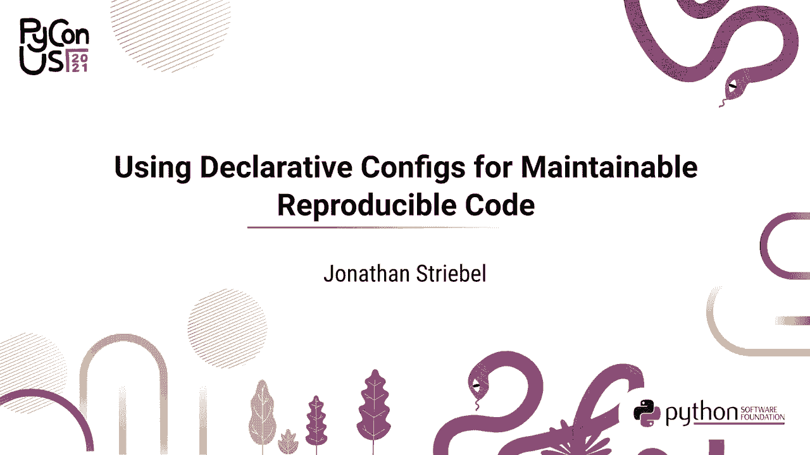
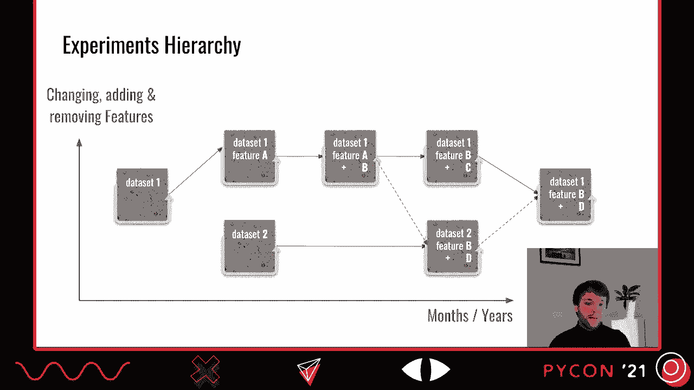
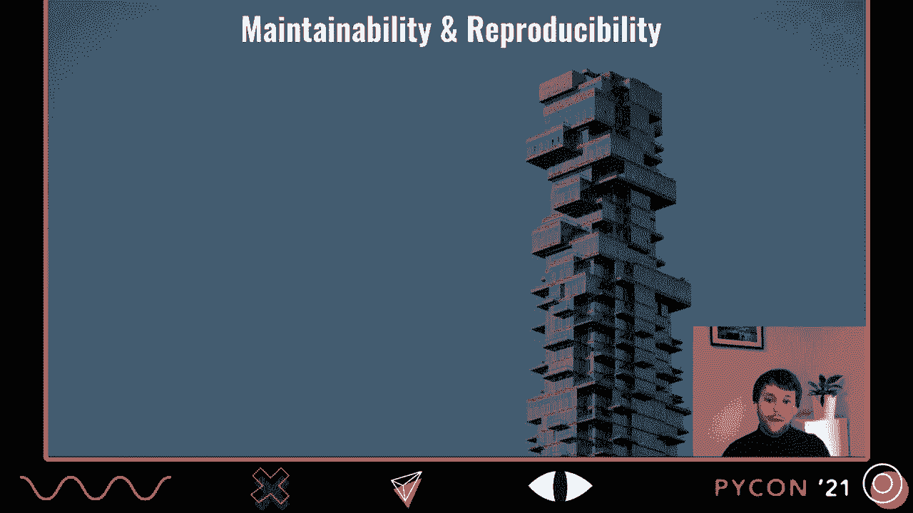
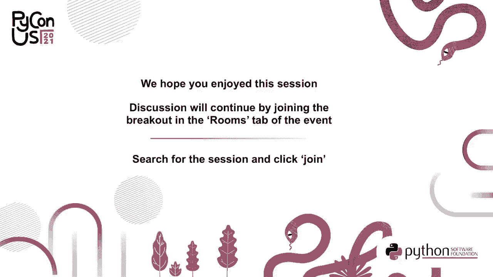

# P8：谈话 _ 乔纳森·斯特里贝尔 _ 使用声明式配置进行可维护的可重现性 - VikingDen7 - BV19Q4y197HM

[音乐]。

大家好。我很高兴欢迎你们来到我关于可维护的可重现代码的声明式冲突的演讲。我叫乔纳森，你可以给我发邮件或在 Twitter 上关注我。我在德国波茨坦的 Scalable Minds 公司工作。我们专注于图像分析工具和服务。在深入讨论主题之前。

我想给大家概述一下我所在领域的工作以及我们面临的问题。在 Scalable Minds，我们构建了 webmasters，这是一个开源在线工具，允许你查看和注释 3D 体积图像数据。这里展示的是从显微镜获取的脑组织的 3D 扫描。不同的细胞通过颜色进行分割。

一个细胞在底部中心以 3D 形式渲染。如果你想亲自尝试，可以访问 webnossos.org 或使用这个二维码。我们还在自动化这些细胞的注释，这也是我大部分时间的工作。为此，我们正在进行实验。这开始于多个 TB 的灰度图像数据。

在此基础上，我们训练机器学习系统以检测细胞边界。因此，我们管理训练数据和评估数据，这些数据之前通过 webnossos 手动获取。训练通常需要几周的时间。之后，我们会运行分割和聚合算法。

最终结果是所有神经元的密集 3D 重建，供我们的客户进行生物分析。由于我们处理的是大量数据和计算密集型算法，我们在高性能计算集群中并行运行这个流程。

这只是单个实验的概述。由于该领域非常依赖研究，我们不断迭代我们的流程。我们可能会使用数据集 1 进行实验并开发特征 A 以改善结果。此外，我们还会开始使用数据集 2。在第一个数据集上，我们添加特征 B，并在一段时间后发现应该用特征 C 替换特征 A。

此外，我们在第二个数据集上应用特征 B 和新特征 D，然后也在数据集 1 上使用 D。这在几个月和几年的时间尺度上发生了许多更多的中间步骤，并可能让你了解到我们面临的问题。我们需要保持对每个实验数据集所用特征的概述。

并能够在一年后真正运行一次实验，但使用最新的流程，这样我们就可以简单地启用我们昨天刚开发的特征。

这些挑战激励了这次演讲。我们需要保持应用程序层次结构的可维护性，同时又能复现。复现不仅是指锁定特定实验的代码和包，还能够用当前的代码库重新运行旧实验。因此，我们有四个主要要点帮助我们实现这一目标。

首先，我们将特性标志和参数的配置与其余代码分开。这将实验的结构和不断演变的管道分开，并给我们提供了之前展示的实验层次结构的概念。其次，我们希望验证实验的配置与可用功能的一致性。

但也反过来验证代码仅使用可用的配置参数。最后，由于配置可能会随着时间而变化，我们希望有自动迁移或演变的机制。首先，我想给你一个关于实现选项的概述。

然后再深入实际代码。在这次演讲中，我准备了一个玩具示例，远比我们通常的实验简单，但机制基本相同。在这个例子中，我们加载一个数据集，这个数据集是关于运动练习的线性根数据集。你可以看到不同的运动练习和一个人能做的重复次数。

在不同的行中。我们对其进行异常值检测，然后绘制数据，其中异常值在这里用橙色标记。对于绘图，我们必须选择可用列中的两个作为不同的轴。在这个例子中，我们在数据集中有引体向上、仰卧起坐和跳跃，绘制引体向上和跳跃。

你可以看到一个人能做的跳跃次数远高于其他人，因此在顶部被标记为异常值。这个实验的代码大致如下。我们从某个路径加载数据，找出异常值，在这种情况下，我们可能需要指定一个阈值为 10。

并使用两个特定的轴绘制数据。现在，当我们提取配置时，我们必须提取路径、阈值和用于绘图的两个轴。当然，你可以简单地写一个具有四个参数的函数，但我建议将其与代码完全分开，使用声明式配置。

声明式意味着只能在这里指定数据，与可以使用 if 条件或 for 循环的命令式编程（如 Python 编程语言）相对。将其分开并使用声明式配置的好处是，这迫使你保持一个简单的配置。

它不能包含任何逻辑，逻辑必须在你的应用程序中指定。因此，我们需要一个用于配置的声明式输入格式。然后，这需要在我们的代码库中表示。为了将这个输入格式转化为表示。

我们需要某种形式的反序列化。让我们看看我们的选项是什么。对于输入格式，典型的选择是为命令行界面使用参数。因此，所有配置必须在命令行上提供，如果你有很多参数，这就不太好用。不过，对于少量参数来说，这非常棒。

通常的选择是使用 Python 内置的 ArcPERS 来加载参数。但在这里，没有什么可以阻止你访问配置的错误键，这将导致运行时错误。因此，我更喜欢使用外部包 typer，它允许你将期望的参数和数据类型作为函数参数指定。

这也可以进行类型检查，稍后会详细说明。另一个选择是使用环境变量作为输入，可以通过 OS.enviren 在 Python 中访问。对于大型配置，我更喜欢将其提取到单独的文件中。一般来说，我们使用 YAML，但还有很多其他选择，如 JSON、Tumble 或其他格式。

要加载 YAML 文件，你需要一个第三方库，比如 PyYAML，它为你提供该文件的 Python 表示。这种表示由基本的 Python 类型组成，如字典、列表、整数等。这里的问题是，我们可能会访问错误的键，导致运行时错误。

由于我们的实验持续几天，这需要提前缓存，例如在测试中。我们使用的另一种可能性是将配置转换为类。该类定义不同的参数及其类型作为属性。为了获取初始化方法和其他辅助方法，我们使用 utter 库。

它会自动添加这些参数。现在我们像访问普通属性一样访问配置对象的参数。这使我们可以在运行代码之前使用标签检查器，提前捕获错误使用。由于将 YAML 文件加载到 Python 中提供了我们左侧的基本 Python 结构，我们需要一个工具将其转换为右侧的类对象。为此。

我们可以直接使用 see address 库，它提供了许多数据类型的转换器，也可以用自定义转换器进行调整。在深入代码之前，让我们看看如果你想实现类似系统，你有哪些可能性。我展示了三种不同的选项，如何将配置数据提供给你的应用程序。然后这需要在你的代码中表示。

对于此，你有很多选择。如果你想给普通字典添加类型信息，可以使用`typing.type.dict`。我们更倾向于使用之前展示的自定义类的对象。要自动化这些类的特殊方法，你可以使用命名元组或数据类，这些都是 Python 的一部分。如果你有更复杂的场景，可能需要使用第三方库。

第三方库，例如 pedantic，非常出色，或者在我们的案例中使用 attors。我在这里没有提供详细的比较，因为这对本次演讲来说太多了。要创建这样一个类的对象，你还需要一个转换器。Typeload 是一个流行的库，专门用于数据类，而 pedantic 带有内置的转换器。

其类别，然后是地址，我更喜欢这种方式，因为你可以为自己的类编写自定义结构。最后，我建议使用类型检查器来验证代码中配置对象的使用，例如 myPy 或 PyType。那么我们来看看这在代码中是怎样的。我在这里准备了之前展示过的例子。

在 TruePider 笔记本中。在这种情况下，我们加载另一个数据集，鸢尾花数据集，关于花朵的信息。我们还执行离群值检测，这次使用稍微不同的阈值，然后绘制数据，我们选择两个轴。在这种情况下，数据包含四列，不同属性关于花朵的大小。此外，我们在这里指定了。

已经知道哪些行是离群值，哪些不是。然后我们查看两个不同轴的结果，如下图所示。此外，我还有另一个例子，就是我刚刚展示过的，使用线性根数据集和另一个离群值因子为 10。我们当然使用两个不同的轴进行绘图。同样，肘部和山丘的情况，这就是你所看到的图。

之前看到的。当我们想将这段代码转换为提供分割配置的代码时，我们可以通过编写这个配置文件开始。在这个例子中，我们将指定数据集为鸢尾花。我们指定离群值因子为 50，和用于绘图的两个不同轴。我们也可以对另一个示例做同样的操作，在那里我们有另一个配置。

这次使用线性根数据集，另一个参数和两个用于绘图的轴。如果我们想在这里的两位数笔记本中使用这个，我们必须指定一个类，正如我之前展示过的那样。在这种情况下，它是配置模式类，其中我们有一个数据集。我们稍后再查看数据集类型和离群值数量，后者是一个整数。

以及两个作为字符串的轴参数。因此，这里的数据集参数是一个枚举。在这种情况下，我们可以为这个枚举设置两个选项，线性根和鸢尾花。因此，要将这个配置加载到该配置模式类的对象中，我们必须首先加载文件，打开文件后，这里使用 yaml load 加载它。

这给了我们一个字典，里面仅有文件的结构。然后我们可以使用 c-adgers，我之前介绍过，来将这个字典结构化为该类的对象，即配置模式。因此，最后的结果就是下面的配置，里面只有我们在配置文件中提供的数据。这现在可以用于调整代码。

我们之前已经看到，我们只需检查我们有哪两个数据集。然后我们使用来自配置的轮廓检测参数，以及我们提供的两个轴。现在，不再在笔记本中有两个实验，我们可以简单地使用不同的配置。这是针对线性数据集的配置。

我们加载此配置，重新运行这一部分并生成此处的拟合图。如果你犯了一个错误，并且在这里提供了 plot z 而不是 plot y。在运行之前，你可以使用 myPY，静态类型检查器来检查这一点。在这种情况下，使用 nbqa，它可以在笔记本上运行，我们启动 myPY，使用这个笔记本。

显然，我们必须在之前保存它。现在可以看到我们有一个错误，因为我们不能使用 plot z，它不在我们的模式中，而必须使用 y 或 x。因此，如果我们再次修复这个，我们就没有错误了。所以你现在看到的是，我们可以使用声明式的 yaml 配置分离我们的配置和代码。在这种情况下，我们可以验证我们的配置，因为我们已经加载到我们定义的模式类中。

使用 sea others。然后我们可以使用 myPY 验证在代码中使用此配置的情况。让我们看看在更复杂的用例中会是怎样。在这种情况下，我们不仅绘制数据的简单散点图，还希望添加更多绘图的可能性。因此，如果我们现在绘制，不仅使用 x 和 y，我们还定义。

C 属性是可选的，因为我们仍然可以进行 2D 绘图。散点图的另一种替代方案现在是热图绘图，它仅使用 x 和 y。因为我们只能提供两种绘图可能性之一，这必须定义这些的联合，这基本上意味着联合绘图模式的对象要么是散点图模式。

或热图模式。你可以通过查看种类来判断这是什么，可能是散点图，在这种情况下，它可以是散点字符串或热图。然后和之前一样，我们可以在我们的配置模式中使用它。所以在我们的配置模式中，我们有一个嵌套模式，仅用于绘图。数据和之前一样，我们在这里有一个枚举。

我们还有一个用于异常值的整数。但现在这是我们在上面定义的两个模式的联合。因此，我们现在必须调整我们的配置。在这种情况下，我们仍然使用线性数据集，我们仍然使用相同的异常值检测数字，进行散点图绘制。如果我们只提供链和仰卧起坐，这将产生与之前完全相同的结果。代码更复杂一点。

complex。现在，由于我们有不同绘图可能性的 if 条件。因此，这里只是与之前相同的散点图。现在我们还可以添加可选的 Z 参数。然后我们重新加载它。最后，我们得到了绘图的 3D 版本。这是如何工作的？所以因为我们在这里使用的是散点图模式。

这次使用了设置属性，在下面的 if 部分我们找出 z 是否被定义。由于它被定义了，我们现在进行散点图。所以我们说，好吧，这次我们想做热图。因此再次，我们只使用这里从配置中提供的热图参数。

重新加载配置并运行我们的代码。现在我们遇到了一个错误，因为我们无法解析这个配置，由于 C 已被定义。由于 C 不是 2D 热图的一部分，我们必须将其移除，然后可以重新运行。提前验证这个配置也可以很容易地完成。因此这次，我们只得到一张热图。现在，我们手动调整了 B 的配置。

但我们不想每次都手动调整，而是希望进行演变。因此我们仍然有 A 的配置，并希望也使用这个旧配置。因此，我在这里准备了一个演变。可以简单地看起来像这样：我们加载配置的字典，在这种情况下称为绘制配置。

然后我们查看是否定义了版本。因此在这里，你需要说，好的。新配置也有一个版本键。在这种情况下，这将是 2，而我们旧版本冲突的默认版本仅为 1。如果我们有一个旧配置，我们只需运行演变，它会将这两个图形转换为绘图。

现在我们所拥有的可能性。因此现在，不是加载新的配置，而是从旧配置开始并运行演变。现在可以使用旧实验与更新的代码，其中配置会自动迁移。因此，我们拥有的是转化为的配置文件。

字典被转化为对象。因此，我们总是拥有最新的模式类，以适应我们最新的代码。现在我刚才展示的是使用一种演变，其中我们有版本化的配置文件，并对字典进行演变。

所以我们知道只有当前代码的简单模式类。作为替代方案，你也可以在结构化对象上进行演变，但那样你还需要保留之前定义的所有旧模式类。因此我之前给你展示了这个概述，你可能会错过一些专门用于跟踪实验的库。例如，神圣的库。

一个 L 流或一个指导，它们非常适合标记你的实验，并可以与我在这里描述的配置机制结合使用，但它们本身没有相同的可能性，例如类型检查或演变。它们特别有助于跟踪你实验中的指标。因此总结一下，我也向你展示了两种演变配置的方法，以便你可以运行。

使用向后兼容的应用程序迁移旧实验。让我们再看一下我们的目标。首先，维护性。声明性配置的分离帮助我们保持对实验的总体概览，配置和代码验证帮助我们确保这些在我们的流程中按预期工作。

此外，这种验证结合迁移系统还确保旧实验可以在我们不断发展的流程中可重现。因此，如果您有任何问题，请随时与我联系，我很高兴详细讨论这些主题。希望这能为您提供一些关于可维护和可重现应用程序的有用信息。非常感谢。（沉默），（沉默）。

（沉默），（沉默），（沉默），（沉默），（沉默），[ 沉默 ]。

